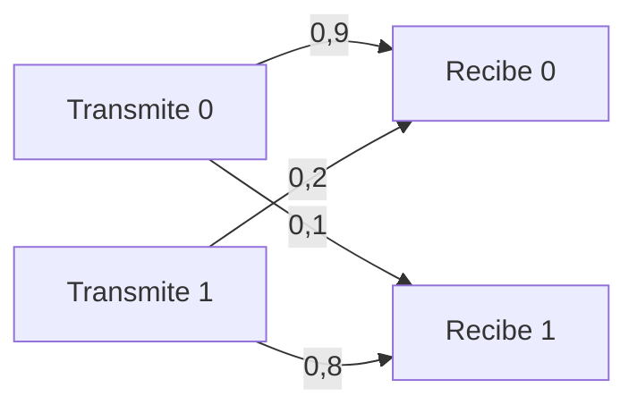
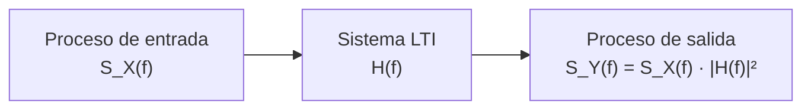
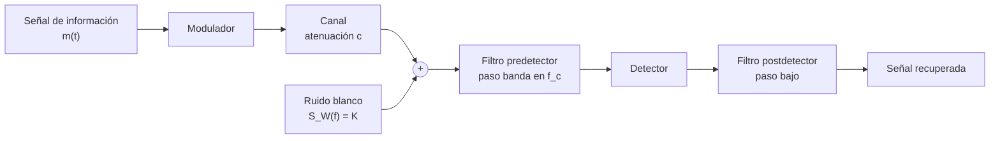

Una señal que transporta información no puede describirse con una expresión analítica
cerrada, porque su valor en cada instante es precisamente lo que el receptor desconoce.
El ruido que se le añade en el canal tampoco admite esa descripción. Este capítulo
construye el lenguaje con que se caracterizan ambos, desde la variable aleatoria
unidimensional hasta el modelo de ruido blanco gaussiano aditivo, y termina en las
escalas logarítmicas con que se expresan niveles de potencia y relaciones señal-ruido.

## Introducción

Un **experimento aleatorio** es aquel cuyo resultado no queda determinado por las
condiciones de partida. Cada resultado posible es un **suceso elemental**, el conjunto
de todos ellos forma el **espacio muestral** $E$ y cualquier subconjunto del espacio
muestral es un **suceso**. La probabilidad asigna a cada suceso $A$ un número $P(A) \geq
0$, con $P(E) = 1$ y $0 \leq P(A) \leq 1$.

La probabilidad se estima experimentalmente a través de la **frecuencia relativa**. Si
un experimento se repite $N$ veces y un valor concreto aparece $n_i$ veces, la
frecuencia relativa de ese valor es

$$
f_r = \frac{n_i}{N}
$$

donde $n_i$ es la frecuencia absoluta y $N$ el tamaño de la muestra. A medida que $N$
crece, la frecuencia relativa se aproxima a la probabilidad del suceso y el margen de
variabilidad entre repeticiones se estrecha. Esa convergencia es la que justifica que un
estimador calculado sobre un número elevado de muestras sustituya al valor teórico al
analizar un sistema de comunicaciones.

El capítulo recorre tres niveles de descripción. El primero es la variable aleatoria,
que modela el valor de una señal en un instante concreto. El segundo es el proceso
aleatorio, que modela la señal completa como una familia de variables aleatorias
indexada por el tiempo. El tercero es el modelo de ruido, que particulariza el proceso
aleatorio al perturbador presente en todo receptor real.

## Variables aleatorias

Una **variable aleatoria** es una aplicación que asocia un número real a cada suceso
elemental del espacio muestral, y describe el valor de una señal en un único instante.
Las variables **continuas** toman valores en un intervalo de la recta real, como una
tensión o una temperatura. Las variables **discretas** toman valores de un conjunto
numerable, como el valor de un bit recibido.

Las operaciones sobre sucesos fijan las reglas básicas de cálculo. La probabilidad de la
unión descuenta la intersección, $P(A \cup B) = P(A) + P(B) - P(A \cap B)$, y se reduce
a la suma cuando los sucesos son **incompatibles**, es decir cuando $A \cap B =
\emptyset$. El **suceso complementario** $\bar{A}$ agrupa todo lo que no está en $A$, de
modo que $P(\bar{A}) = 1 - P(A)$, y el suceso imposible tiene probabilidad nula.

La **probabilidad condicionada** de $A$ dado que ha ocurrido $B$, con $P(B) \neq 0$,
mide cómo cambia la probabilidad de $A$ al disponer de esa información:

$$
P(A \mid B) = \frac{P(A \cap B)}{P(B)}
$$

Dos sucesos son **independientes** cuando la información de uno no altera la
probabilidad del otro, es decir, $P(A \mid B) = P(A)$, lo que equivale a $P(A \cap B) =
P(A) \, P(B)$.

El **teorema de la probabilidad total** permite calcular la probabilidad de un suceso a
partir de sus probabilidades condicionadas a un conjunto de sucesos $C_i$ que forman una
partición del espacio muestral:

$$
P(A) = \sum_i P(A \mid C_i) \, P(C_i)
$$

Combinado con la definición de probabilidad condicionada resulta el **teorema de
Bayes**, que invierte el sentido del condicionamiento:

$$
P(B \mid A) = \frac{P(A \mid B) \, P(B)}{P(A)}
$$

Esta última expresión es la que emplea un receptor para decidir qué se transmitió a
partir de lo que ha recibido. El grafo siguiente describe el canal binario más sencillo
en que esa decisión no es trivial, aquel cuyas dos probabilidades de error son
distintas.



???+ example "Decisión sobre un canal binario con errores asimétricos"

    El canal del grafo anterior transmite los símbolos $T_0$ y $T_1$ de forma
    equiprobable, $P(T_0) = P(T_1) = 0{,}5$, con probabilidades de transición
    $P(R_1 \mid T_0) = 0{,}1$ y $P(R_0 \mid T_1) = 0{,}2$. La probabilidad de error se
    obtiene por probabilidad total, sumando las dos formas en que puede producirse:

    $$
    P(E) = P(R_1 \mid T_0) P(T_0) + P(R_0 \mid T_1) P(T_1)
    = 0{,}1 \cdot 0{,}5 + 0{,}2 \cdot 0{,}5 = 0{,}15
    $$

    El teorema de Bayes responde entonces a la pregunta inversa, cuál era el símbolo más
    probable en el transmisor sabiendo que se ha producido un error:

    $$
    P(T_1 \mid E) = \frac{P(E \mid T_1) P(T_1)}{P(E)}
    = \frac{0{,}2 \cdot 0{,}5}{0{,}15} = \frac{2}{3}
    $$

    y por complemento $P(T_0 \mid E) = 1/3$. Aunque los símbolos son equiprobables en el
    transmisor, dos de cada tres errores corresponden a la transmisión de un uno, porque
    ese es el símbolo peor protegido por el canal.

### Función densidad de probabilidad y función de distribución

El **histograma** es la representación gráfica de las frecuencias relativas de un
conjunto de realizaciones de un experimento. El recorrido de la variable se divide en
intervalos de anchura constante $\Delta$ y sobre cada uno se levanta un rectángulo de
altura proporcional a la frecuencia relativa de ese intervalo. Si la altura se toma como
$f_r / \Delta$, el área total encerrada por el histograma es la unidad, y los intervalos
con más realizaciones dan lugar a rectángulos más altos.

Al aumentar el número de realizaciones hacia infinito y reducir simultáneamente la
anchura $\Delta$ hacia cero, el histograma converge a una curva continua que recibe el
nombre de **función densidad de probabilidad**, $f_X(x)$. Sus dos propiedades
fundamentales se heredan del histograma: no existe probabilidad negativa, luego $f_X(x)
\geq 0$, y el área encerrada es la unidad,

$$
\int_{-\infty}^{\infty} f_X(x) \, dx = 1
$$

La densidad no es una probabilidad. La probabilidad de que la variable caiga en un
intervalo es el área encerrada bajo la curva en ese intervalo,

$$
P(a < X \leq b) = \int_{a}^{b} f_X(x) \, dx
$$

de donde se deduce que la probabilidad de que una variable continua tome un valor
concreto es nula, porque el intervalo se reduce a un punto y el área se anula. Una
variable discreta se describe con el mismo formalismo mediante un tren de deltas,
$f_X(x) = \sum_i P_i \, \delta(x - x_i)$, donde $P_i$ es la probabilidad del valor $x_i$
y el área de cada delta, no su altura, es la que representa esa probabilidad.

La **función de distribución** $F_X(x)$ acumula la densidad desde el extremo inferior
del recorrido:

$$
F_X(x) = P(X \leq x) = \int_{-\infty}^{x} f_X(u) \, du
$$

Es una función monótona no decreciente acotada entre cero y uno, y la densidad se
recupera por derivación, $f_X(x) = dF_X(x) / dx$. De su definición se siguen las dos
relaciones de uso más frecuente, $P(a < X \leq b) = F_X(b) - F_X(a)$ y $P(X > b) = 1 -
F_X(b)$.

El histograma es, en la práctica, el estimador de la densidad con que se comprueba el
comportamiento de un generador de señal. El ejemplo siguiente lo aplica a una variable
de densidad triangular, que aparece de forma natural como suma de dos variables
uniformes independientes.

???+ example "Aproximación de una densidad triangular mediante su histograma"

    La suma de dos variables uniformes independientes en el intervalo
    $\lbrack -1/2, 1/2 \rbrack$ tiene densidad triangular en
    $\lbrack -1, 1 \rbrack$, dada por $f_X(x) = 1 - |x|$ dentro de ese intervalo y nula
    fuera de él. El código estima esa densidad a partir de un millón de realizaciones,
    con intervalos de anchura $\Delta = 0{,}025$.

```python linenums="1"
import numpy as np


def histograma_normalizado(
    muestras: np.ndarray, anchura: float
) -> tuple[np.ndarray, np.ndarray]:
    """Estima la función densidad de probabilidad mediante un histograma.

    Args:
        muestras: Vector de realizaciones de la variable aleatoria.
        anchura: Anchura de los intervalos en que se divide el recorrido.

    Returns:
        Tupla con los centros de los intervalos y la densidad estimada en
        cada uno de ellos.
    """
    primero = np.floor(muestras.min() / anchura)
    ultimo = np.floor(muestras.max() / anchura)
    # Centro de cada intervalo, todos de la misma anchura
    centros = anchura * (np.arange(primero, ultimo + 1) + 0.5)
    bordes = np.append(centros - anchura / 2, centros[-1] + anchura / 2)
    cuentas, _ = np.histogram(muestras, bins=bordes)
    # La frecuencia relativa dividida por la anchura estima la densidad
    return centros, cuentas / (muestras.size * anchura)


generador = np.random.default_rng(seed=0)
# La suma de dos uniformes independientes en (-1/2, 1/2) es triangular
muestras = generador.uniform(-0.5, 0.5, 10**6) + generador.uniform(-0.5, 0.5, 10**6)
anchura = 0.025
centros, densidad = histograma_normalizado(muestras, anchura)
# Densidad teórica de la variable triangular en el intervalo (-1, 1)
teorica = np.maximum(1.0 - np.abs(centros), 0.0)
print(f"Área encerrada por el histograma: {np.sum(densidad) * anchura:.4f}")
print(f"Error máximo frente a la densidad: {np.max(np.abs(densidad - teorica)):.4f}")
```

```plaintext title="Expected output"
Área encerrada por el histograma: 1.0000
Error máximo frente a la densidad: 0.0141
```

El parecido entre histograma y densidad depende de dos parámetros que actúan en sentidos
opuestos. Reducir la anchura $\Delta$ mejora la resolución del eje de abscisas, pero
deja menos realizaciones en cada intervalo y aumenta la dispersión de la estimación.
Aumentar el número de realizaciones reduce esa dispersión. Mantener la calidad de la
estimación al dividir la anchura por un factor exige, por tanto, aumentar el número de
realizaciones en esa misma proporción.

### Media, valor cuadrático medio y varianza

Los **momentos** de una variable aleatoria resumen su comportamiento estadístico en unos
pocos números. La **media** o esperanza matemática es el primer momento:

$$
E\lbrack X \rbrack = m_X = \int_{-\infty}^{\infty} x \, f_X(x) \, dx
$$

que para una variable discreta se reduce a $E\lbrack X \rbrack = \sum_i x_i P_i$ sobre
los valores $x_i$ y sus probabilidades $P_i$. La esperanza es un operador lineal,
$E\lbrack a X + b Z \rbrack = a E\lbrack X \rbrack + b E\lbrack Z \rbrack$, propiedad
que se usa constantemente al analizar sumas de señales.

El **valor cuadrático medio** es el segundo momento y, cuando la variable representa una
tensión o una corriente, se interpreta como una potencia:

$$
E\lbrack X^2 \rbrack = \int_{-\infty}^{\infty} x^2 \, f_X(x) \, dx
$$

La **varianza** mide la dispersión de la variable en torno a su media:

$$
\sigma_X^2 = E\lbrack (X - m_X)^2 \rbrack = E\lbrack X^2 \rbrack - m_X^2
$$

donde $\sigma_X$ es la desviación típica. Cuanto mayor es la varianza, más ancha es la
densidad y más dispersas están las realizaciones. Si la media es nula, la varianza
coincide con el valor cuadrático medio, situación habitual en el modelado de ruido y de
señales de información.

### Distribución uniforme

Una variable **uniforme** en el intervalo $\lbrack a, b \rbrack$ tiene densidad
constante dentro de él y nula fuera:

$$
f_X(x) = \frac{1}{b - a}, \quad a \leq x \leq b
$$

Sus momentos se obtienen por integración directa,

$$
m_X = \frac{a + b}{2}, \qquad
E\lbrack X^2 \rbrack = \frac{b^3 - a^3}{3 (b - a)}, \qquad
\sigma_X^2 = \frac{(b - a)^2}{12}
$$

de modo que la varianza depende solo de la anchura del intervalo, no de su posición. Un
caso de uso frecuente es la fase de una portadora recibida sin sincronismo, que se
modela uniforme en $\lbrack 0, 2\pi \rbrack$ por no existir ninguna razón para preferir
un valor sobre otro.

### Distribución gaussiana y función Q

La distribución **gaussiana** o **normal**, que se denota $X \sim \mathcal{N}(m_X,
\sigma_X^2)$, tiene densidad

$$
f_X(x) = \frac{1}{\sqrt{2 \pi \sigma_X^2}}
\, e^{-\frac{(x - m_X)^2}{2 \sigma_X^2}}
$$

donde $m_X$ es la media y $\sigma_X^2$ la varianza. La curva es simétrica respecto de $x
= m_X$, alcanza su máximo en ese punto y presenta puntos de inflexión en $x = m_X \pm
\sigma_X$. Cuanto mayor es $\sigma_X$, más ancha y más baja es la campana, porque el
área encerrada sigue siendo la unidad. Esta distribución describe el ruido presente en
todo receptor, y su preeminencia no es arbitraria sino consecuencia del teorema del
límite central.

La función de distribución gaussiana no tiene expresión cerrada en términos de funciones
elementales, por lo que se tabula una única función normalizada. La **función Q** da la
probabilidad de que una variable gaussiana de media nula y varianza unidad supere un
umbral:

$$
Q(x) = \frac{1}{\sqrt{2\pi}} \int_{x}^{\infty} e^{-u^2 / 2} \, du
$$

Cualquier probabilidad de cola de una variable gaussiana se reduce a esta función
mediante el cambio de variable que normaliza media y desviación típica:

$$
P(X > x) = Q\!\left(\frac{x - m_X}{\sigma_X}\right)
$$

La simetría de la campana se traduce en la propiedad $Q(-x) = 1 - Q(x)$, que permite
tabular la función solo para argumentos positivos.

???+ example "Probabilidad de que una tensión de ruido supere un umbral"

    La tensión de ruido a la entrada de un decisor se modela como una variable gaussiana
    de media $m_X = 2$ V y desviación típica $\sigma_X = 2$ V, y el decisor declara una
    falsa alarma cuando esa tensión supera los 5 V. Normalizando el umbral,

    $$
    P(X > 5) = Q\!\left(\frac{5 - 2}{2}\right) = Q(1{,}5) \approx 0{,}0668
    $$

    de modo que algo menos del siete por ciento de las observaciones lo supera. Si la
    desviación típica se reduce a la mitad manteniendo la media, el argumento pasa a
    valer $3$ y la probabilidad cae a $Q(3) \approx 0{,}00135$: reducir la dispersión a
    la mitad disminuye la probabilidad de cola en más de un factor cincuenta.

### Transformación lineal de una variable aleatoria

Sea $Y = a X + b$ la transformación lineal de una variable aleatoria $X$, con $a$ y $b$
constantes. La densidad de la variable transformada se obtiene escalando y desplazando
la original:

$$
f_Y(y) = \frac{1}{|a|} \, f_X\!\left(\frac{y - b}{a}\right)
$$

El factor $1/|a|$ preserva el área unidad cuando el eje de abscisas se dilata o se
contrae. La forma de la densidad no cambia, solo su amplitud y sus límites: una variable
uniforme sigue siendo uniforme tras una transformación lineal, y una gaussiana sigue
siendo gaussiana. Los momentos se transforman de acuerdo con la linealidad de la
esperanza, $m_Y = a \, m_X + b$ y $\sigma_Y^2 = a^2 \, \sigma_X^2$. El desplazamiento
$b$ no afecta a la varianza, porque no altera la dispersión en torno a la media.

???+ example "Adaptación de un generador uniforme al intervalo requerido"

    Un generador entrega realizaciones de una variable uniforme en el intervalo
    $\lbrack 0, 1 \rbrack$ y se necesita una variable uniforme en
    $\lbrack -1, 3 \rbrack$. Basta una transformación lineal que lleve los extremos del
    intervalo de partida a los del intervalo destino: el extremo inferior exige
    $b = -1$ y el superior $a + b = 3$, de donde $a = 4$.

    La variable de partida tiene $m_X = 0{,}5$ y $\sigma_X^2 = 1/12$, luego
    $m_Y = 4 \cdot 0{,}5 - 1 = 1$ y $\sigma_Y^2 = 16/12 = 4/3$. Ambos valores coinciden
    con los de una variable uniforme en $\lbrack -1, 3 \rbrack$ calculados
    directamente.

## Variables aleatorias bidimensionales

Un sistema de comunicaciones rara vez involucra una sola magnitud aleatoria. La señal
transmitida y la recibida, o las componentes en fase y en cuadratura de una portadora,
son magnitudes aleatorias definidas sobre el mismo espacio muestral, y lo relevante es
tanto su comportamiento individual como la relación entre ambas. Una **variable
aleatoria bidimensional** es una aplicación del espacio muestral en $\mathbb{R}^2$ que
asocia un par de números reales a cada suceso elemental.

Su descripción completa es la **función densidad de probabilidad conjunta** $f_{XY}(x,
y)$, cuya integral doble sobre una región del plano da la probabilidad de que el par de
valores caiga en ella:

$$
P(x_0 < X \leq x_1, \; y_0 < Y \leq y_1) =
\int_{x_0}^{x_1} \int_{y_0}^{y_1} f_{XY}(x, y) \, dy \, dx
$$

Donde en el caso unidimensional la probabilidad era un área bajo una curva, aquí es un
volumen bajo una superficie. La normalización sigue siendo la unidad al extender la
integral a todo el plano.

### Funciones marginales y condicionales

De la densidad conjunta se derivan dos familias de funciones. Las **funciones
marginales** describen el comportamiento estadístico de cada variable por separado y se
obtienen integrando la conjunta respecto de la otra variable:

$$
f_X(x) = \int_{-\infty}^{\infty} f_{XY}(x, y) \, dy, \qquad
f_Y(y) = \int_{-\infty}^{\infty} f_{XY}(x, y) \, dx
$$

Las **funciones condicionales** describen el comportamiento de una variable cuando la
otra toma un valor conocido, y son el paralelo continuo de la probabilidad condicionada:

$$
f_{Y \mid X}(y \mid x) = \frac{f_{XY}(x, y)}{f_X(x)}
$$

Las marginales no determinan la conjunta. Dos pares de variables pueden tener idénticas
densidades marginales y estar relacionados de forma completamente distinta, de modo que
la información sobre la relación entre ambas reside exclusivamente en la conjunta o,
resumida en un número, en los momentos conjuntos.

### Correlación, covarianza y coeficiente de correlación

Los momentos conjuntos miden el grado de parecido entre dos variables aleatorias. La
esperanza conserva su linealidad sobre combinaciones de variables, pero la esperanza de
un producto solo se factoriza cuando las variables son independientes, y de ahí que el
momento conjunto de segundo orden resulte informativo. La **correlación** es la
esperanza del producto, $r_{XY} = E\lbrack X Y \rbrack$. La **covarianza** descuenta de
ella la contribución de las medias, aislando la parte del parecido debida a las
fluctuaciones:

$$
\sigma_{XY} = E\lbrack X Y \rbrack - E\lbrack X \rbrack \, E\lbrack Y \rbrack
$$

La covarianza tiene dimensiones de producto de las dos variables, lo que dificulta
comparar pares de magnitudes distintas. El **coeficiente de correlación** la normaliza
con las desviaciones típicas y resulta adimensional:

$$
\rho_{XY} = \frac{\sigma_{XY}}{\sigma_X \, \sigma_Y}
$$

Su valor está acotado, $\rho_{XY} \in \lbrack -1, 1 \rbrack$. Los extremos corresponden
a una relación determinista lineal entre ambas variables, el valor nulo a la ausencia de
relación lineal, y los valores intermedios a grados intermedios de parecido.

???+ example "Tres pares de variables con idénticas marginales y distinta relación"

    Sean $U_1$, $U_2$, $U_3$ y $U_4$ cuatro variables independientes, uniformes en el
    intervalo unidad, cada una con varianza $\sigma_U^2 = 1/12$. Se construyen tres
    pares tomando siempre $X = U_1 + U_2$ y variando la segunda variable. Todas las
    variables implicadas tienen la misma distribución triangular, por ser suma de dos
    uniformes independientes, de modo que su comportamiento individual es idéntico en
    los tres casos.

    Con $Y = U_3 + U_4$ no hay ningún término común, las variables son independientes y
    $\sigma_{XY} = 0$, luego $\rho_{XY} = 0$. Con $Y = U_2 + U_3$ comparten el término
    $U_2$, y la covarianza es la varianza de ese término común,
    $\sigma_{XY} = \sigma_U^2 = 1/12$. Como $\sigma_X^2 = \sigma_Y^2 = 2/12$, resulta
    $\rho_{XY} = 0{,}5$. Con $Y = U_1 + U_2 = X$ la relación es determinista y
    $\rho_{XY} = 1$.

    El coeficiente de correlación recorre así todo el margen entre la independencia y la
    identidad sin que cambie la distribución individual de ninguna variable. Un
    histograma de cada variable por separado no distingue los tres casos, mientras que
    la nube de puntos del par sí lo hace.

### Independencia, incorrelación y ortogonalidad

Tres conceptos próximos describen la ausencia de relación entre dos variables
aleatorias, y conviene no confundirlos porque las implicaciones solo van en un sentido.

- **Independencia**: La densidad conjunta se factoriza, $f_{XY}(x, y) = f_X(x) \,
  f_Y(y)$, y el conocimiento de una variable no aporta nada sobre la otra. Es la
  condición más fuerte.
- **Incorrelación**: La covarianza es nula, $\sigma_{XY} = 0$, lo que equivale a
  $E\lbrack X Y \rbrack = E\lbrack X \rbrack E\lbrack Y \rbrack$ y a $\rho_{XY} = 0$.
  Solo descarta la relación lineal.
- **Ortogonalidad**: La correlación es nula, $r_{XY} = E\lbrack X Y \rbrack = 0$.

La independencia implica la incorrelación, pero no al contrario: dos variables
incorreladas pueden mantener una relación no lineal perfectamente determinista. La
incorrelación implica la ortogonalidad únicamente cuando al menos una de las dos
variables tiene media nula, ya que entonces se anula el producto de medias que separa
ambas definiciones. Esa condición se cumple de forma natural en los sistemas de
comunicaciones, donde tanto el ruido como la mayoría de las señales de información se
modelan con media nula, y por eso ambos conceptos suelen usarse indistintamente.

## Suma de variables aleatorias

La suma de variables aleatorias aparece en dos situaciones básicas: cuando el ruido se
añade a la señal útil en el canal y cuando varias señales comparten un mismo medio de
transmisión. Sea $Z = X + Y$. Si las variables son independientes, la densidad de la
suma es la convolución de las densidades de los sumandos, $f_Z(z) = f_X(x) * f_Y(y)$.

Los momentos, en cambio, no exigen independencia. La media de la suma es siempre la suma
de las medias, por linealidad de la esperanza. El valor cuadrático medio y la varianza
incorporan un término cruzado que recoge el parecido entre los sumandos:

$$
E\lbrack Z^2 \rbrack = E\lbrack X^2 \rbrack + E\lbrack Y^2 \rbrack
+ 2 \, E\lbrack X Y \rbrack
$$

$$
\sigma_Z^2 = \sigma_X^2 + \sigma_Y^2 + 2 \, \sigma_{XY}
$$

Cuando los sumandos son incorrelados el término cruzado desaparece y las varianzas se
suman. Cuando además son ortogonales, lo que se suman son los valores cuadráticos
medios, es decir, las potencias. Esta es la propiedad que hace posible la multiplexación
de varias señales sobre un mismo medio: si son ortogonales entre sí, la potencia total
es la suma de las potencias individuales y cada señal puede recuperarse sin
interferencia de las demás.

### Teorema del límite central

Considérese la variable aleatoria formada por la suma normalizada de $M$ variables
aleatorias independientes $X_k$, todas con la misma distribución y con media nula:

$$
Z_M = \frac{1}{\sqrt{M}} \sum_{k=1}^{M} X_k
$$

La normalización por $\sqrt{M}$ mantiene la varianza acotada al crecer $M$. Al ser las
variables independientes sus varianzas se suman, de modo que $\sigma_{Z}^2 = M
\sigma_X^2 / M = \sigma_X^2$, independiente de $M$, y la media es nula por serlo la de
cada sumando.

El **teorema del límite central** establece que, al aumentar $M$, la distribución de
$Z_M$ tiende a una gaussiana de esa misma media y varianza, $Z_{\infty} \sim
\mathcal{N}(0, \sigma_X^2)$, cualquiera que sea la distribución de los sumandos. De este
resultado se sigue el modelo de ruido que se emplea en todo el análisis de sistemas de
comunicaciones: el ruido de un receptor es el efecto agregado de un número enorme de
contribuciones microscópicas independientes, ninguna dominante, y por tanto su
distribución es gaussiana con independencia de la naturaleza de cada contribución
individual.

???+ example "Convergencia de una suma de variables uniformes a la campana gaussiana"

    Sean $X_k$ variables independientes y uniformes en el intervalo $(-1, 1)$, de media
    nula y varianza $\sigma_X^2 = (1 - (-1))^2 / 12 = 1/3$. La suma normalizada $Z_M$
    tiene entonces media nula y varianza $1/3$ para cualquier valor de $M$.

    Para $M = 3$ el histograma de $Z_M$ conserva todavía los tramos rectos heredados de
    la distribución uniforme y un recorrido estrictamente acotado. Para $M = 5$ el
    perfil se redondea, y para $M = 20$ resulta prácticamente indistinguible de la
    densidad gaussiana de media nula y varianza $1/3$. La convergencia no depende de la
    forma de la distribución de partida: si los sumandos se toman de una distribución
    bimodal, formada por la unión de dos intervalos uniformes disjuntos, el histograma
    de la suma normalizada converge a la misma campana, sin rastro de la bimodalidad
    original.

## Procesos aleatorios

Una variable aleatoria describe el valor de una señal en un instante concreto. Un
**proceso aleatorio** o señal aleatoria $X(t)$ describe la señal completa: es una
familia de variables aleatorias indexada por el tiempo, de modo que $X(t_1)$ es la
variable aleatoria asociada al instante $t_1$. Cada resultado del experimento produce
una función del tiempo completa, una **realización** del proceso, que se denota con
letra minúscula, $x_r(t)$.

La caracterización de un proceso requiere distinguir dos formas de promediar. El
**promedio estadístico** o esperanza, $E\lbrack \cdot \rbrack$, recorre el conjunto de
realizaciones en un instante fijo. El **promedio temporal**, que se denota $\langle
\cdot \rangle$, recorre el tiempo sobre una única realización. Para señales continuas de
potencia, cuya duración es ilimitada, el promedio temporal se define como

$$
\langle x(t) \rangle = \lim_{T \to \infty} \frac{1}{T}
\int_{-T/2}^{T/2} x(t) \, dt
$$

y para señales discretas de potencia, sobre un bloque de $N_0$ muestras,

$$
\langle x\lbrack n \rbrack \rangle = \frac{1}{N_0} \sum_{n} x\lbrack n \rbrack
$$

El promedio temporal es lineal, y el promedio de una constante es la propia constante.
El promedio temporal de un tono es nulo, $\langle \cos(\omega_0 t) \rangle = 0$,
propiedad de la que depende la demodulación. Aplicado al cuadrado de la señal, el
promedio temporal da la **potencia media**, $P_X = \langle x^2(t) \rangle$, que para un
tono de amplitud $A$ vale $A^2/2$.

Una **señal de energía** comienza y acaba en un intervalo finito y tiene energía finita
$E_X = \int_{-\infty}^{\infty} x^2(t) \, dt$ pero potencia media nula. Una **señal de
potencia** no acaba nunca y tiene potencia media finita pero energía infinita. Las
señales periódicas y las señales aleatorias que modelan información y ruido son señales
de potencia.

### Estacionariedad

Un proceso aleatorio es **estacionario** cuando todas las variables aleatorias que lo
componen comparten los mismos estadísticos, es decir, cuando estos no dependen del
instante considerado. En la práctica basta comprobar la estacionariedad en los dos
primeros momentos, $E\lbrack X(t) \rbrack = m_X$ constante y $E\lbrack X^2(t) \rbrack$
constante.

La comprobación experimental exige un conjunto amplio de realizaciones del proceso. Se
fija un instante $n_1$, se extraen los valores que todas las realizaciones toman en ese
instante, y con ellos se estiman la media y el valor cuadrático medio de la variable
$X\lbrack n_1 \rbrack$. Repitiendo el procedimiento para varios instantes se observa si
los momentos se mantienen constantes o evolucionan.

???+ example "Señal aleatoria cuyo valor cuadrático medio crece con el tiempo"

    Un proceso gaussiano de media nula cuya desviación típica aumenta con el índice de
    muestra produce, en la comprobación anterior, una media estimada próxima a cero para
    todos los instantes, mientras que el valor cuadrático medio estimado crece de forma
    sistemática al desplazar el instante de análisis. El histograma de
    $X\lbrack n_1 \rbrack$ conserva la forma de campana pero se va ensanchando.

    El proceso es estacionario en la media y no lo es en el valor cuadrático, y basta
    ese incumplimiento para que no sea estacionario. La consecuencia práctica es que
    ninguna magnitud derivada de la potencia, y por tanto ninguna relación señal-ruido,
    puede asignarse al proceso como un valor único: habría que especificar el instante
    al que se refiere.

### Ergodicidad

Un proceso estacionario es además **ergódico** cuando sus promedios temporales coinciden
con sus promedios estadísticos,

$$
\langle x_r(t) \rangle = E\lbrack X \rbrack, \qquad
\langle x_r^2(t) \rangle = E\lbrack X^2 \rbrack
$$

para cualquier realización $x_r(t)$ del proceso. Dicho de otro modo, una sola
realización observada durante un tiempo suficientemente largo contiene toda la
aleatoriedad del proceso y representa a las demás. La ergodicidad implica la
estacionariedad, pero no al contrario: un proceso puede tener estadísticos constantes en
el tiempo y contener, sin embargo, realizaciones que difieren sistemáticamente entre sí.

La importancia práctica de esta propiedad es difícil de exagerar. Un receptor real
observa una única realización de la señal que le llega, no un conjunto de realizaciones.
Solo si el proceso es ergódico puede estimar las magnitudes estadísticas que necesita,
empezando por la potencia, promediando en el tiempo la señal que efectivamente recibe.

???+ example "Comprobación empírica de la ergodicidad de un proceso correlado"

    El código compara los dos tipos de promedio sobre un proceso gaussiano de muestras
    correladas, obtenido filtrando ruido blanco con una media móvil. El promedio
    estadístico se estima sobre veinte mil realizaciones evaluadas en un mismo
    instante, y el promedio temporal sobre una única realización de doscientas mil
    muestras.

```python linenums="1"
import numpy as np


def genera_proceso(num_realizaciones: int, longitud: int, semilla: int) -> np.ndarray:
    """Genera realizaciones de un proceso gaussiano de muestras correladas.

    Args:
        num_realizaciones: Número de realizaciones que forman el conjunto.
        longitud: Número de muestras de cada realización.
        semilla: Semilla del generador pseudoaleatorio.

    Returns:
        Matriz cuyas filas son realizaciones independientes del proceso.
    """
    generador = np.random.default_rng(semilla)
    blanco = generador.standard_normal((num_realizaciones, longitud + 3))
    # Media móvil de cuatro muestras, normalizada a potencia unidad
    return sum(blanco[:, k : k + longitud] for k in range(4)) / 2.0


def promedios_temporales(realizacion: np.ndarray) -> tuple[float, float]:
    """Estima los promedios temporales de una única realización.

    Args:
        realizacion: Fragmento de una realización de la señal aleatoria.

    Returns:
        Tupla con la media temporal y el valor cuadrático medio temporal.
    """
    return float(np.mean(realizacion)), float(np.mean(realizacion**2))


# Promedios estadísticos: muchas realizaciones evaluadas en un instante fijo
conjunto = genera_proceso(num_realizaciones=20000, longitud=64, semilla=7)
instante = 32
media_estadistica = float(np.mean(conjunto[:, instante]))
potencia_estadistica = float(np.mean(conjunto[:, instante] ** 2))
# Promedios temporales: una sola realización observada durante mucho tiempo
larga = genera_proceso(num_realizaciones=1, longitud=200000, semilla=11)[0]
media_temporal, potencia_temporal = promedios_temporales(larga)
print(f"E[X] = {media_estadistica:+.4f}    <x(t)> = {media_temporal:+.4f}")
print(f"E[X^2] = {potencia_estadistica:.4f}   <x^2(t)> = {potencia_temporal:.4f}")
```

```plaintext title="Expected output"
E[X] = -0.0009    <x(t)> = -0.0067
E[X^2] = 1.0149   <x^2(t)> = 0.9941
```

Ambas parejas de estimaciones coinciden dentro del margen de error esperable, lo que es
compatible con un proceso ergódico. Un resultado negativo sería concluyente, mientras
que uno positivo solo aporta evidencia: la comprobación empírica descarta la
ergodicidad, no la demuestra.

### Densidad espectral de potencia

La caracterización en frecuencia de una señal se apoya en su transformada de Fourier. Se
reserva la letra minúscula $x(t)$ para una señal determinista, aquella cuya expresión
matemática se conoce, y $X(f)$ para su transformada. El módulo al cuadrado de la
transformada da la **densidad espectral**, que informa de cómo se reparte la energía o
la potencia de la señal a lo largo del eje de frecuencias.

Para una señal de energía, la densidad espectral $S_X(f)$ tiene dimensiones de energía
por unidad de frecuencia y su integral sobre una banda da la energía contenida en ella.
Para una señal de potencia, periódica o aleatoria, $S_X(f)$ es la **densidad espectral
de potencia** y su integral da la potencia:

$$
P_X = \int_{-\infty}^{\infty} S_X(f) \, df
$$

Aprovechando la simetría de la densidad espectral respecto del origen, la potencia
contenida en la banda $\lbrack f_1, f_2 \rbrack$ se obtiene duplicando la integral sobre
las frecuencias positivas, $P\lbrack f_1, f_2 \rbrack = 2 \int_{f_1}^{f_2} S_X(f) \,
df$. Las frecuencias negativas no tienen existencia física independiente: son el
complementario de las positivas y ambas conforman conjuntamente la señal. Para una señal
periódica la densidad espectral es un tren de deltas situadas en los armónicos, con la
componente continua en el armónico de orden cero, y la potencia total es la suma de las
potencias de los armónicos, resultado conocido como **teorema de Parseval**, $P_X =
\sum_k |A_k|^2$, donde $A_k$ es el coeficiente del armónico de orden $k$.

Una descripción equivalente y a menudo más cómoda para señales aleatorias es la
**función de autocorrelación**, que mide el parecido de una señal consigo misma
desplazada:

$$
R_X(\tau) = \langle x(t) \, x(t - \tau) \rangle
$$

Su valor en el origen es la potencia de la señal, $R_X(0) = P_X$. La misma construcción
aplicada a dos señales distintas da la **correlación cruzada**, $R_{XY}(\tau) = \langle
x(t) \, y(t - \tau) \rangle$, cuyo valor en el origen mide el parecido entre ambas sin
desplazamiento. Dos señales con $R_{XY}(0) = 0$ son ortogonales y su suma tiene por
potencia la suma de las potencias, mientras que su densidad espectral es la suma de las
densidades espectrales:

$$
S_Z(f) = S_X(f) + S_Y(f), \qquad P_Z = P_X + P_Y
$$

Dos tonos de frecuencias distintas son ortogonales, y también lo son dos tonos de la
misma frecuencia desfasados noventa grados, mientras que dos tonos idénticos en
frecuencia y fase tienen correlación máxima. Señales de origen distinto son
independientes, por tanto incorreladas y, al tener media nula, ortogonales, de modo que
sus potencias se suman sin término cruzado.

Para un proceso ergódico, la densidad espectral de potencia es la misma para cualquiera
de sus realizaciones, lo que permite estimarla a partir de una sola de ellas. El
procedimiento consiste en trocear la realización en ventanas contiguas, calcular el
módulo al cuadrado de la transformada discreta de cada una y promediar las estimaciones
resultantes. El promediado reduce la varianza del estimador a costa de la resolución
frecuencial, que queda fijada por la longitud de la ventana.

### Respuesta de un sistema lineal e invariante

Cuando una señal atraviesa un sistema lineal e invariante en el tiempo de respuesta
impulsional $h(t)$ y respuesta en frecuencia $H(f)$, la transformada de la salida es el
producto de la transformada de la entrada por la respuesta en frecuencia, $Y(f) = X(f)
\, H(f)$. En términos de densidad espectral de potencia, lo que se aplica es el módulo
al cuadrado:

$$
S_Y(f) = S_X(f) \, |H(f)|^2
$$

Esta relación es la herramienta central del análisis de ruido. Un filtro paso bajo deja
pasar las componentes de baja frecuencia y elimina el resto, de modo que la potencia a
su salida es la integral de la densidad espectral de entrada restringida a la banda de
paso.



El caso de una señal modulada por un tono merece mención aparte, porque es el que
traslada una señal en banda base a la banda de paso del canal. Multiplicar la señal por
$\cos(2 \pi f_0 t + \theta)$ desplaza su densidad espectral a ambos lados de la
frecuencia de la portadora y la escala:

$$
S_Y(f) = \frac{1}{4} S_X(f - f_0) + \frac{1}{4} S_X(f + f_0)
$$

Para que las dos réplicas desplazadas no se solapen, la frecuencia de portadora debe
superar el ancho de banda $W$ de la señal moduladora, condición necesaria $f_0 > W$ que
fija el mínimo de la banda ocupada.

???+ example "Potencia a la salida de un filtro paso bajo con densidad triangular"

    Una señal aleatoria ergódica en tiempo discreto tiene densidad espectral de potencia
    triangular, de valor máximo $P / f'_M$ en el origen y decreciente de forma lineal
    hasta anularse en $\pm f'_M$, donde $f'$ denota la frecuencia normalizada a la
    frecuencia de muestreo. La potencia de la señal es el área del triángulo,
    $P_X = \frac{1}{2} \cdot 2 f'_M \cdot P / f'_M = P$, de modo que el parámetro $P$ es
    directamente esa potencia.

    La señal atraviesa un filtro paso bajo ideal de frecuencia de corte
    $f'_c = f'_M / 4$, cuyo módulo de respuesta vale la unidad en la banda de paso y
    cero fuera de ella. La densidad espectral a la salida es la porción central de la
    triangular, y la potencia se obtiene integrándola sobre la banda de paso:

    $$
    P_Y = 2 \int_{0}^{f'_M / 4} \frac{P}{f'_M}
    \left(1 - \frac{f'}{f'_M}\right) df' = \frac{7}{16} P
    $$

    El filtro conserva algo menos de la mitad de la potencia de entrada pese a que su
    banda de paso es solo la cuarta parte del ancho de banda de la señal, porque la
    densidad espectral es máxima precisamente en la zona que preserva. Con una
    frecuencia de corte $f'_c = f'_M / 8$ la potencia a la salida baja a $15 P / 64$,
    aproximadamente el veintitrés por ciento de la de entrada. El efecto en el dominio
    del tiempo es igual de visible: al estrechar la densidad espectral, la señal
    filtrada varía más despacio de una muestra a la siguiente, ya que se han eliminado
    las componentes responsables de los cambios rápidos.

El código siguiente estima la densidad espectral de potencia de un proceso a partir de
una sola realización y verifica sobre ella la relación entre entrada y salida de un
sistema lineal e invariante.

```python linenums="1"
import numpy as np


def densidad_espectral(
    muestras: np.ndarray, num_bandas: int
) -> tuple[np.ndarray, np.ndarray]:
    """Estima la densidad espectral de potencia promediando periodogramas.

    Args:
        muestras: Realización de una señal aleatoria ergódica.
        num_bandas: Número de bandas en que se divide el eje de frecuencias.

    Returns:
        Tupla con el eje de frecuencias normalizadas y la densidad espectral
        estimada en cada banda.
    """
    num_ventanas = muestras.size // num_bandas
    # La realización se trocea en ventanas contiguas de igual longitud
    ventanas = muestras[: num_ventanas * num_bandas].reshape(num_ventanas, num_bandas)
    # Periodograma de cada ventana: módulo al cuadrado de su transformada
    periodogramas = np.abs(np.fft.fft(ventanas, axis=1)) ** 2 / num_bandas
    # El promediado sobre ventanas reduce la varianza de la estimación
    estimacion = np.fft.fftshift(periodogramas.mean(axis=0))
    return np.fft.fftshift(np.fft.fftfreq(num_bandas)), estimacion


generador = np.random.default_rng(seed=3)
# Ruido blanco de potencia unidad: densidad espectral plana de valor 1
blanco = generador.standard_normal(2**20)
nucleo = np.ones(4) / 4
# Filtrado paso bajo mediante una media móvil de cuatro muestras
filtrada = np.convolve(blanco, nucleo, mode="valid")
num_bandas = 256
frecuencias, dep_entrada = densidad_espectral(blanco, num_bandas)
_, dep_salida = densidad_espectral(filtrada, num_bandas)
# Módulo al cuadrado de la respuesta en frecuencia de la media móvil
respuesta = np.abs(np.fft.fftshift(np.fft.fft(nucleo, num_bandas))) ** 2
desviacion = np.max(np.abs(dep_salida - respuesta))
print(f"Potencia a la entrada: {np.mean(dep_entrada):.4f}")
print(f"Potencia a la salida: {np.mean(dep_salida):.4f}")
print(f"Desviación máxima frente a S_X(f)|H(f)|^2: {desviacion:.4f}")
```

```plaintext title="Expected output"
Potencia a la entrada: 0.9994
Potencia a la salida: 0.2496
Desviación máxima frente a S_X(f)|H(f)|^2: 0.0277
```

La potencia estimada a la entrada es la unidad, como corresponde a un ruido blanco de
varianza unidad. A la salida es la cuarta parte, valor que coincide con la integral de
$|H(f)|^2$ sobre todo el eje de frecuencias normalizadas para una media móvil de cuatro
coeficientes. La desviación entre la densidad espectral estimada a la salida y la
predicha se mantiene en torno al tres por ciento del valor máximo, atribuible a la
varianza residual del estimador.

## Modelado del ruido

El ruido es el proceso aleatorio que se añade a la señal de información en el canal y
que fija el límite último de las prestaciones de un enlace. Su modelado no persigue
describir con detalle los mecanismos físicos que lo originan sino capturar, con el menor
número de parámetros posible, las propiedades que determinan su efecto sobre el
receptor.

### Ruido blanco gaussiano aditivo

El modelo de referencia es el **ruido blanco gaussiano aditivo**, habitualmente
designado por sus siglas inglesas AWGN, de _additive white gaussian noise_. Sus cuatro
características simplifican cada una una parte del análisis:

- **Aditivo**: Se suma a la señal de información, sin multiplicarla ni distorsionarla,
  de modo que la señal recibida es $r(t) = x(t) + w(t)$.
- **Blanco**: Su densidad espectral de potencia es constante en toda la banda de
  interés, $S_W(f) = K$, y muestras tomadas en instantes distintos son independientes
  entre sí, porque una densidad espectral plana equivale a una autocorrelación
  impulsiva.
- **Gaussiano**: La variable aleatoria asociada a cada instante tiene distribución
  gaussiana de media nula, consecuencia del teorema del límite central aplicado a la
  agregación de un número enorme de contribuciones independientes.
- **Estacionario y ergódico**: Sus estadísticos no dependen del instante considerado y
  una sola realización basta para estimarlos, lo que permite caracterizar el ruido
  midiendo la señal que recibe un receptor real.

La condición de blancura tiene una consecuencia aparentemente paradójica: la potencia
total de un ruido estrictamente blanco es infinita, ya que la integral de una densidad
espectral constante sobre todo el eje de frecuencias diverge. El modelo es una
idealización válida mientras la banda de interés sea finita, que es siempre el caso,
porque todo receptor filtra la señal antes de procesarla.

### Ruido a la salida de un filtro

El filtrado es lo que convierte el modelo de ruido blanco en una magnitud finita y
manejable. Aplicando la relación entre densidades espectrales de un sistema lineal e
invariante a un ruido blanco de densidad $S_W(f) = K$ que atraviesa un filtro paso bajo
ideal de ancho de banda $B$, la densidad a la salida es $K$ dentro de la banda de paso y
nula fuera, y la potencia de ruido resulta

$$
P_N = \int_{-B}^{B} K \, df = 2 K B
$$

La potencia de ruido que alcanza al detector es, por tanto, proporcional al ancho de
banda que se le deja pasar. De ahí la primera regla de diseño de un receptor: el filtro
que precede al detector debe ser lo más estrecho que permita la señal útil, porque todo
ancho de banda adicional solo aporta ruido.

???+ example "Potencia de ruido admitida por un filtro de recepción"

    Un receptor recibe un ruido blanco de densidad espectral de potencia
    $K = 10^{-14}$ W/Hz y lo filtra con un paso bajo ideal de ancho de banda
    $B = 5$ MHz. La potencia de ruido a la salida del filtro vale

    $$
    P_N = 2 K B = 2 \cdot 10^{-14} \cdot 5 \cdot 10^{6} = 10^{-7} \; \text{W}
    $$

    Si el filtro se ensancha a $B = 20$ MHz para acomodar una señal de mayor ancho de
    banda, la potencia de ruido se cuadruplica hasta $4 \cdot 10^{-7}$ W. Mantener la
    misma relación señal-ruido exige entonces cuadruplicar también la potencia de señal
    recibida, lo que en un enlace radio se traduce en cuatro veces más potencia
    transmitida o en una reducción equivalente del alcance.

### Ruido paso banda y ruido coloreado

El ruido que efectivamente llega al detector de un receptor real ha atravesado ya varias
etapas de filtrado, y su densidad espectral ya no es plana. El **ruido coloreado** es
aquel cuya densidad espectral de potencia no es constante en la banda de interés, porque
el filtro atravesado no tiene un módulo de respuesta plano. El término se opone a
«blanco» por analogía con el espectro luminoso: un ruido blanco reparte su potencia por
igual entre todas las frecuencias, mientras que un ruido coloreado la concentra en unas
más que en otras.

El **ruido paso banda** es el caso particular en que la densidad espectral queda
confinada a dos bandas estrechas centradas en $\pm f_c$, resultado de aplicar al ruido
blanco un filtro paso banda ideal centrado en la frecuencia de la portadora y de ancho
de banda $B_T$. Su potencia se obtiene con el mismo razonamiento que en el caso paso
bajo, integrando la densidad sobre las dos bandas de paso, y vale $P_N = 2KB_T$ contando
ambas contribuciones.

La cadena de filtrado de un receptor cumple dos funciones distintas y sucesivas. El
**filtro predetector** es un paso banda centrado en la portadora que elimina todo el
ruido ajeno a la banda de la señal antes de la detección. El **filtro postdetector** es
un paso bajo que actúa sobre la señal ya demodulada en banda base y elimina el ruido
residual que la detección ha trasladado a esa banda.



El diagrama hace explícito por qué el ruido que importa no es el del canal sino el que
sobrevive al filtrado. Un ensanchamiento innecesario de cualquiera de los dos filtros
degrada la relación señal-ruido en la misma proporción en que aumenta la banda admitida.

## Relación señal-ruido

La **relación señal-ruido** es el cociente entre la potencia de la señal útil y la
potencia de ruido medidas en el mismo punto del sistema, $\mathrm{SNR} = P_S / P_N$,
donde $P_S$ es la potencia de señal y $P_N$ la de ruido. Es la magnitud que determina la
calidad alcanzable en un enlace, y se evalúa en dos puntos de referencia: a la entrada
del demodulador, donde el ruido es paso banda, y a su salida, donde el ruido ya ha
pasado por el filtro postdetector. La comparación entre ambas cuantifica la ganancia que
aporta un esquema de modulación concreto.

### Expresión en decibelios

Al ser un cociente de potencias, la relación señal-ruido se expresa habitualmente en
decibelios:

$$
\mathrm{SNR}_{\mathrm{dB}} = 10 \log_{10} \left( \frac{P_S}{P_N} \right)
$$

La escala logarítmica tiene dos ventajas prácticas. La primera es que comprime un margen
dinámico muy amplio en números manejables, ya que las potencias de interés en un enlace
radio abarcan muchos órdenes de magnitud. La segunda es que convierte productos en
sumas: la cadena de ganancias y atenuaciones que atraviesa una señal se evalúa sumando y
restando decibelios en lugar de multiplicando y dividiendo factores.

La atenuación de un canal se expresa también en decibelios. Si el canal multiplica la
amplitud de la señal por un factor $c$ menor que la unidad, la atenuación vale
$\alpha_{\mathrm{dB}} = -20 \log_{10} c$. El factor veinte, en lugar de diez, se debe a
que $c$ actúa sobre la amplitud y la potencia es proporcional al cuadrado de la
amplitud. La ganancia de un amplificador se define de forma análoga con el signo
opuesto.

### Escalas dBW, dBm y dBµ

Un cociente de potencias es adimensional y su expresión en decibelios no necesita
referencia. Una potencia absoluta, en cambio, solo puede expresarse en escala
logarítmica si se fija una potencia de referencia. De ahí las tres escalas de uso
corriente:

| Escala | Referencia   | Definición                                           |
| ------ | ------------ | ---------------------------------------------------- |
| dBW    | 1 vatio      | $P_{\mathrm{dBW}} = 10 \log_{10} P/1\,\mathrm{W}$    |
| dBm    | 1 milivatio  | $P_{\mathrm{dBm}} = 10 \log_{10} P/1\,\mathrm{mW}$   |
| dBµ    | 1 microvatio | $P_{\mathrm{dB\mu}} = 10 \log_{10} P/1\,\mu\text{W}$ |

Las tres escalas difieren en un desplazamiento constante, porque cada referencia es mil
veces menor que la anterior. Una potencia de un vatio equivale a 0 dBW, a 30 dBm y a 60
dBµ, de donde se obtienen las dos reglas de conversión que se usan sin cálculo
intermedio: la lectura en dBm es la lectura en dBW más treinta, y la lectura en dBµ es
la lectura en dBm más otros treinta.

???+ example "Balance de potencias de un enlace expresado en decibelios"

    Un transmisor entrega una potencia de 1 W y el canal introduce una atenuación de
    120 dB. La potencia recibida se obtiene por resta directa en la escala logarítmica,
    sin necesidad de manejar el factor de atenuación lineal:

    $$
    P_R = 0 \; \mathrm{dBW} - 120 \; \mathrm{dB} = -120 \; \mathrm{dBW}
    = -90 \; \mathrm{dBm} = -60 \; \mathrm{dB\mu}
    $$

    equivalente a una potencia de $10^{-12}$ W, un picovatio. Si la potencia de ruido en
    la banda del receptor es $10^{-13}$ W, es decir $-130$ dBW, la relación señal-ruido
    resulta $\mathrm{SNR}_{\mathrm{dB}} = -120 - (-130) = 10$ dB, equivalente a un
    cociente de potencias de diez veces.

    Duplicar la potencia transmitida mejoraría la relación en 3 dB, mientras que
    duplicar el ancho de banda del filtro de recepción la degradaría en esos mismos
    3 dB al duplicar la potencia de ruido admitida. Ambas acciones tienen el mismo peso
    sobre el resultado final, lo que explica que el dimensionado del filtro reciba tanta
    atención como el del amplificador de potencia.

Con estas herramientas queda descrito el canal como la suma de una señal de información
aleatoria y un ruido de estadística conocida. El siguiente paso consiste en estudiar
cómo se traslada esa señal a la banda de paso del canal y qué relación señal-ruido se
obtiene a la salida de cada esquema de modulación.
