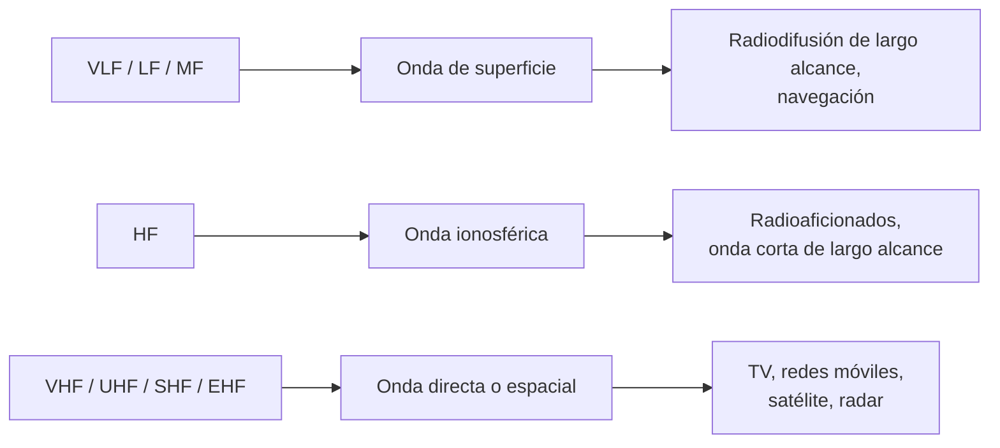
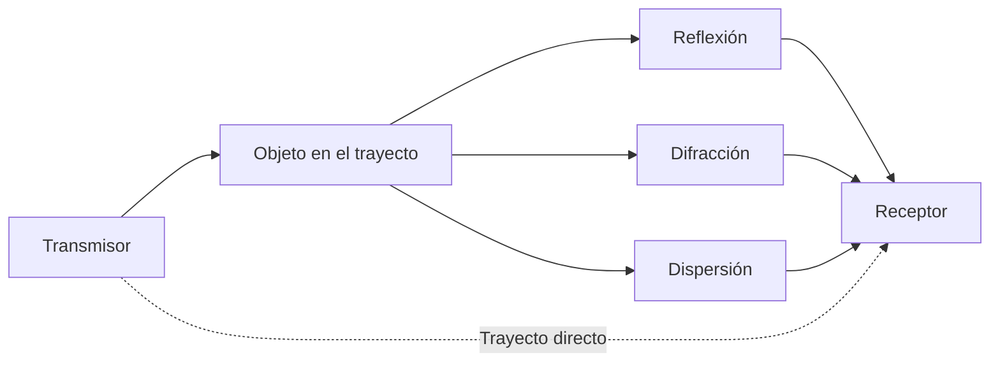
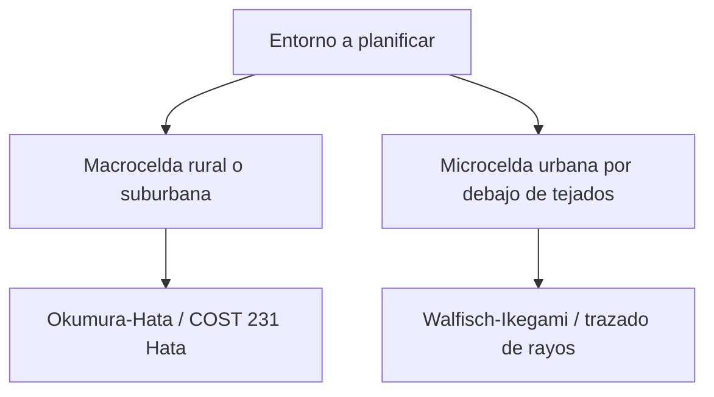

Este capítulo describe cómo se atenúa una señal radioeléctrica entre un transmisor y un
receptor, los mecanismos físicos que la desvían de su trayecto directo y los modelos con
los que se estima numéricamente esa atenuación durante el diseño de un enlace radio.

## Introducción

El **canal radio** es el medio físico que conecta la antena transmisora con la antena
receptora en un sistema de comunicaciones sin hilos. A diferencia de un cable o una
fibra, este medio no está confinado: la energía radiada se dispersa en todas las
direcciones permitidas por la antena y llega al receptor debilitada, retardada y, con
frecuencia, dividida en múltiples componentes que han seguido caminos distintos. La
magnitud con la que se debilita esa señal a lo largo del trayecto directo entre
transmisor y receptor se conoce como **pérdidas de propagación** (_path loss_), y su
estimación fiable es la base de cualquier balance de enlace y de cualquier ejercicio de
planificación de cobertura.

## Bandas radioeléctricas y modos de propagación

Antes de estudiar cómo se atenúa una señal conviene situar en qué parte del espectro
radioeléctrico opera un sistema concreto, porque la banda de frecuencia condiciona de
forma directa el mecanismo por el que la onda alcanza al receptor. El espectro se divide
en bandas normalizadas, cada una designada por un intervalo de frecuencias creciente en
potencias de diez.

| Banda | Rango de frecuencias | Aplicación típica                                                    |
| ----- | -------------------- | -------------------------------------------------------------------- |
| `VLF` | 3 kHz - 30 kHz       | Comunicación submarina y radionavegación de muy largo alcance.       |
| `LF`  | 30 kHz - 300 kHz     | Radiodifusión en onda larga y ayudas a la navegación.                |
| `MF`  | 300 kHz - 3 MHz      | Radiodifusión comercial en onda media.                               |
| `HF`  | 3 MHz - 30 MHz       | Radioaficionados, radiodifusión de onda corta, enlaces aeronáuticos. |
| `VHF` | 30 MHz - 300 MHz     | Radio FM, televisión terrestre en sus canales más bajos.             |
| `UHF` | 300 MHz - 3 GHz      | Televisión terrestre, redes móviles celulares, _Wi-Fi_.              |
| `SHF` | 3 GHz - 30 GHz       | Enlaces por satélite, radar, _backhaul_ por microondas.              |
| `EHF` | 30 GHz - 300 GHz     | Ondas milimétricas de quinta generación, radar de alta resolución.   |

A cada banda le corresponde, de forma dominante aunque no exclusiva, uno de tres modos
de propagación, según cómo la onda radiada alcanza al receptor una vez abandona la
antena transmisora.

La **onda de superficie** viaja pegada a la curvatura de la Tierra, guiada por la
conductividad del terreno o de la masa de agua sobre la que se propaga. Este modo domina
en las bandas más bajas del espectro, VLF, LF y MF, donde la longitud de onda es
suficientemente grande para que la difracción alrededor del horizonte terrestre resulte
apreciable, y es el mecanismo que sostiene la radiodifusión comercial en onda media a
distancias que superan con claridad el horizonte visual.

La **onda ionosférica** se propaga hacia arriba, se refleja en las capas ionizadas de la
atmósfera superior y regresa a la superficie a una distancia que puede alcanzar miles de
kilómetros desde el transmisor. Es el mecanismo característico de la banda HF, y su
comportamiento varía con la hora del día y con el ciclo de actividad solar, porque ambos
factores modifican la altura y la densidad de ionización de las capas reflectoras. Esta
variabilidad es la razón por la que las comunicaciones de radioaficionado y de onda
corta dependen de la elección de frecuencia según el momento del día y la estación del
año.

La **onda directa o espacial** exige visión directa, sin obstáculos relevantes, entre
transmisor y receptor, y es el modo dominante a partir de VHF y en todas las bandas
superiores. Las longitudes de onda de este rango ya no se difractan de forma apreciable
alrededor de obstáculos de tamaño urbano ni siguen la curvatura terrestre, por lo que el
alcance queda limitado por el horizonte radioeléctrico o por la altura de las antenas
implicadas. Es el mecanismo que sostiene la televisión terrestre, las redes móviles
celulares y los enlaces por satélite, estos últimos atravesando la atmósfera en línea
recta hasta un satélite en órbita.

???+ example "Elección de banda para un enlace de radioaficionado transcontinental"

    Un operador de radioaficionado desea establecer un enlace con un corresponsal
    situado en otro continente, sin recurrir a ningún repetidor ni infraestructura de
    red intermedia, empleando únicamente su propio equipo de transmisión y una antena
    convencional.

    La distancia buscada excede con mucho el horizonte radioeléctrico, lo que descarta
    la onda directa propia de VHF y bandas superiores, y también supera el alcance
    habitual de la onda de superficie de las bandas más bajas. La banda adecuada es HF,
    donde la onda ionosférica permite que la señal se refleje en las capas altas de la
    atmósfera y alcance distancias continentales con un único salto, o con varios
    saltos sucesivos entre la ionosfera y la superficie terrestre.

Esta clasificación por banda y modo de propagación es el punto de partida físico sobre
el que se apoyan los mecanismos y los modelos que describe el resto de este capítulo,
centrados en las bandas VHF y superiores, donde opera la mayoría de los sistemas de
comunicaciones móviles e inalámbricas actuales.

## Cadena de transmisión radio

Antes de estudiar la atenuación conviene situar dónde se produce dentro de la cadena
completa de transmisión. Un sistema de transmisión radio puede representarse como un
canal discreto equivalente que engloba, a su vez, un canal continuo equivalente entre
las dos antenas.

```mermaid linenums="1"
flowchart LR
    X["x[n]"] --> DA["Conversor D/A"]
    DA --> MOD["Modulador"]
    MOD --> AMPT["Amplificador"]
    AMPT --> ANTT["Antena transmisora"]
    ANTT -.->|Medio físico| ANTR["Antena receptora"]
    ANTR --> AMPR["Amplificador"]
    AMPR --> DEMOD["Demodulador"]
    DEMOD --> AD["Conversor A/D"]
    AD --> Y["y[n]"]
```

La secuencia de bloques es siempre la misma. Primero se realiza una conversión
digital-analógica de la señal en banda base. A continuación se aplica una modulación,
que consiste en multiplicar la señal por una sinusoide para trasladarla a la banda de
frecuencia de trabajo. La señal modulada se amplifica y se radia mediante la antena
transmisora, atraviesa el medio físico y llega a la antena receptora, donde se vuelve a
amplificar antes de demodularse y convertirse de nuevo a digital. La modulación a
frecuencias altas tiene, además, una ventaja mecánica: reduce la longitud de onda de la
señal radiada y permite, por tanto, utilizar antenas más pequeñas.

## Atenuación

El factor principal de la atenuación es la distancia entre el transmisor y el receptor.
A medida que el receptor se aleja, el frente de onda radiado crece y la misma energía
total se reparte sobre una superficie mayor, de modo que la densidad de potencia que
puede capturar una antena de área fija decrece con la distancia. Que se produzca
atenuación implica, en definitiva, que la señal pierde amplitud entre el punto de
transmisión y el punto de recepción. Esta dispersión geométrica también hace que la
captura efectiva de la señal dependa de la altura de la antena receptora, ya que una
antena más elevada intercepta una porción distinta del frente de onda y queda menos
expuesta a los obstáculos cercanos al suelo.

### Pérdidas de propagación en espacio libre

El caso más sencillo de atenuación es el de un medio sin obstáculos, en el que la única
causa de pérdida es la dispersión geométrica de la energía radiada. Este es el modelo de
**espacio libre**, descrito por la ecuación de Friis. En su forma logarítmica, con la
distancia $d$ entre antenas y la longitud de onda $\lambda$ de la portadora, las
pérdidas de propagación en espacio libre son:

$$
L_{fs}\ \lbrack \text{dB}\rbrack = 20 \log_{10}\left(\frac{4\pi d}{\lambda}\right)
$$

donde $\lambda = c / f$, con $c$ la velocidad de la luz y $f$ la frecuencia de la
portadora. Expresando la distancia en kilómetros y la frecuencia en megahercios, la
expresión anterior se reduce a la forma numérica de uso habitual en balances de enlace:

$$
L_{fs}\ \lbrack \text{dB}\rbrack = 20 \log_{10}\lbrack d_{\text{km}}\rbrack +
20 \log_{10}\lbrack f_{\text{MHz}}\rbrack + 32{,}44
$$

donde $d_{\text{km}}$ es la distancia entre antenas en kilómetros y $f_{\text{MHz}}$ es
la frecuencia de la portadora en megahercios. La constante 32,44 recoge el resto de
factores fijos de la ecuación de Friis una vez fijadas esas unidades.

???+ example "Cálculo del balance de un enlace en espacio libre"

    Un enlace de microondas transmite a una frecuencia portadora de 2000 MHz entre dos
    antenas situadas en visión directa a una distancia de 5 km. El transmisor entrega
    una potencia de 43 dBm y ambas antenas presentan una ganancia de 15 dBi. El
    receptor necesita una potencia mínima de -90 dBm para demodular correctamente la
    señal.

    Sustituyendo $d_{\text{km}} = 5$ y $f_{\text{MHz}} = 2000$ en la forma numérica de
    Friis se obtiene:

    $$
    L_{fs} = 20 \log_{10}(5) + 20 \log_{10}(2000) + 32{,}44 \approx
    13{,}98 + 66{,}02 + 32{,}44 = 112{,}44\ \text{dB}
    $$

    La potencia recibida se obtiene restando las pérdidas de propagación a la potencia
    transmitida y sumando la ganancia de ambas antenas:

    $$
    P_r\ \lbrack \text{dBm}\rbrack = P_t + G_t + G_r - L_{fs}
    $$

    con $P_t = 43$, $G_t = G_r = 15$ y $L_{fs} = 112{,}44$, lo que da
    $P_r \approx 43 + 15 + 15 - 112{,}44 = -39{,}44$ dBm. Ese valor queda muy por encima del
    umbral de sensibilidad del receptor, de modo que el enlace dispone de un margen de
    unos 50 dB frente a atenuaciones adicionales que este cálculo no contempla, como el
    exponente de pérdidas del medio o el desvanecimiento por multitrayecto.

### Exponente de pérdidas del medio

El modelo de espacio libre solo es válido cuando no existen obstáculos entre las
antenas. En cualquier otro medio, la atenuación crece con la distancia más rápido de lo
que predice la ecuación de Friis, y esa diferencia se recoge mediante un exponente de
pérdidas $n$ propio del medio:

$$
L\ \lbrack \text{dB}\rbrack = L_{fs}(d_0) + 10\, n \log_{10}\left(\frac{d}{d_0}\right)
$$

donde $L_{fs}(d_0)$ son las pérdidas en espacio libre a una distancia de referencia
$d_0$ y $d$ es la distancia real entre transmisor y receptor. El exponente $n$ toma el
valor 2 en espacio libre y crece con la densidad de obstáculos del entorno, de modo que
un entorno urbano denso presenta un exponente de pérdidas mayor que una zona rural
abierta. Este parámetro es, junto con la altura de antena, uno de los principales grados
de libertad que ajustan los modelos de propagación empíricos descritos más adelante.

### Influencia de la altura de antena

La altura de la antena, tanto en la estación base como en el terminal, condiciona de
forma directa las pérdidas de propagación. Cuanto más elevada está la antena
transmisora, mayor es la proporción del entorno cercano que queda por debajo de la línea
de visión directa hacia el receptor, y el comportamiento del canal se aproxima más al de
espacio libre. Por el contrario, una antena próxima al suelo queda rodeada de obstáculos
que bloquean o desvían buena parte de la energía radiada, lo que se traduce en un
exponente de pérdidas efectivo mayor. Por este motivo, todos los modelos de propagación
que se presentan en este capítulo incluyen la altura de la antena de la estación base y
la del terminal como parámetros explícitos.

## Mecanismos de propagación

Cuando la onda radiada encuentra un obstáculo en su trayecto, la energía no se detiene:
se redistribuye siguiendo distintos mecanismos según el tamaño y las propiedades del
objeto en relación con la longitud de onda de la señal. Esta redistribución es la causa
principal de que la señal recibida llegue por múltiples caminos distintos del trayecto
directo.

### Reflexión

La **reflexión** se produce cuando la onda incide sobre un objeto de dimensiones grandes
en comparación con la longitud de onda y de superficie relativamente lisa, como la
fachada de un edificio, el suelo o una masa de agua. Una parte de la energía incidente
se redirige siguiendo un nuevo trayecto que, en general, ya no apunta directamente al
receptor original, aunque puede volver a alcanzarlo tras uno o varios rebotes
adicionales.

### Difracción

La **difracción** aparece cuando la onda encuentra el borde de un obstáculo, como la
arista de un edificio o la cresta de una elevación del terreno. El propio borde actúa
como fuente secundaria de radiación, lo que permite que la señal alcance zonas situadas
detrás del obstáculo y fuera de la línea de visión directa, aunque con una atenuación
adicional que depende del ángulo y de la geometría del borde.

### Dispersión

La **dispersión** se produce cuando la onda incide sobre objetos pequeños en relación
con la longitud de onda o sobre superficies rugosas, como el follaje, el mobiliario
urbano o una fachada irregular. En este caso la energía incidente no sigue una única
dirección de salida bien definida, sino que se reparte en múltiples direcciones, lo que
contribuye a que el receptor capte energía procedente de trayectos muy diversos incluso
cuando no existe un obstáculo reflector claramente identificable.

## Modelos de propagación

Estimar las pérdidas de propagación de un enlace real exige combinar los mecanismos
anteriores con la geometría concreta del entorno, lo que en la práctica es
computacionalmente inabordable punto por punto para redes de gran escala. Por ello se
recurre a modelos que aproximan el comportamiento agregado del canal con distinto grado
de detalle geométrico, desde modelos puramente estadísticos ajustados a medidas hasta
modelos deterministas que reconstruyen explícitamente cada trayecto.

### Modelos empíricos: Okumura-Hata

El modelo de **Okumura-Hata** es un modelo estadístico obtenido a partir de campañas de
medida y es el más extendido para macroceldas en entornos urbanos, suburbanos y rurales.
Las pérdidas de propagación se calculan como:

$$
L_b\ \lbrack \text{dB}\rbrack = A + B \log_{10}\lbrack f\rbrack -
13{,}82 \log_{10}\lbrack h_{bs}\rbrack - a(h_{ms}) +
\left(44{,}9 - 6{,}55 \log_{10}\lbrack h_{bs}\rbrack\right) \log_{10}\lbrack d\rbrack + C
$$

con $f$ la frecuencia en megahercios, $h_{bs}$ la altura de la antena de la estación
base en metros, $h_{ms}$ la altura de la antena del terminal en metros y $d$ la
distancia entre ambas en kilómetros. El término $a(h_{ms})$ corrige la altura del
terminal según la frecuencia y el tamaño de la ciudad, y crece en magnitud cuanto mayor
es la ciudad considerada. Los coeficientes $A$ y $B$ dependen de la banda de frecuencia:

| Coeficiente | Banda de frecuencia | Valor |
| ----------- | ------------------- | ----- |
| `A`         | 150-1500 MHz        | 69,55 |
| `A`         | 1500-2000 MHz       | 46,30 |
| `B`         | 150-1500 MHz        | 26,16 |
| `B`         | 1500-2000 MHz       | 33,90 |

El término $C$ corrige por tipo de entorno: es nulo en zona urbana y toma valores
progresivamente más negativos en zona suburbana y rural, reflejando que la propagación
en entornos abiertos se acerca más al espacio libre que en un entorno urbano denso. El
modelo es válido para distancias de 1 a 20 km, alturas de estación base de 30 a 200 m,
alturas de terminal de 1 a 10 m y frecuencias de 150 a 2000 MHz. Para frecuencias
superiores, propias de bandas de tercera generación en adelante, se utiliza la extensión
COST 231 Hata, que mantiene la misma estructura de la fórmula con coeficientes
recalibrados para ese rango.

???+ example "Radio máximo de una macrocelda urbana con Okumura-Hata"

    Una estación base urbana transmite a 1800 MHz desde una antena situada a 30 m de
    altura hacia terminales cuya antena se encuentra a 1,5 m del suelo, en una ciudad de
    tamaño pequeño o mediano. El balance de enlace disponible admite unas pérdidas de
    propagación máximas de 145 dB antes de que la señal caiga por debajo del umbral de
    recepción. Se busca el radio máximo de celda compatible con ese presupuesto de
    pérdidas.

    Al superar los 1500 MHz corresponden los coeficientes $A = 46{,}30$ y $B = 33{,}90$. El
    entorno es urbano, por lo que $C = 0$. El término de corrección por altura de
    terminal para ciudad pequeña o mediana es:

    $$
    a(h_{ms}) = (1{,}1 \log_{10}\lbrack f\rbrack - 0{,}7)\, h_{ms} -
    (1{,}56 \log_{10}\lbrack f\rbrack - 0{,}8)
    $$

    Sustituyendo $f = 1800$ y $h_{ms} = 1{,}5$ resulta $a(h_{ms}) \approx 0{,}04$ dB, un
    valor pequeño porque la altura de terminal considerada es la habitual en un
    dispositivo de mano. Agrupando en la fórmula de Okumura-Hata todos los términos que
    no dependen de la distancia se obtiene una expresión en función únicamente de $d$:

    $$
    L_b\ \lbrack \text{dB}\rbrack \approx 136{,}19 + 35{,}23 \log_{10}\lbrack d_{\text{km}}
    \rbrack
    $$

    Igualando $L_b$ al presupuesto de pérdidas de 145 dB y despejando la distancia:

    $$
    d_{\text{km}} = 10^{\frac{145 - 136{,}19}{35{,}23}} \approx 1{,}78\ \text{km}
    $$

    El emplazamiento puede, por tanto, dar servicio hasta una distancia de
    aproximadamente 1,8 km antes de que las pérdidas de propagación agoten el margen
    disponible del enlace.

### Modelos semideterministas: Walfisch-Ikegami y trazado de rayos

Cuando la resolución de macrocelda de Okumura-Hata no es suficiente, en particular para
microceldas urbanas situadas por debajo de la altura de los edificios, se recurre a
modelos que incorporan explícitamente la geometría de las calles. El modelo
**Walfisch-Ikegami** distingue entre visión directa y ausencia de ella. Con visión
directa dentro de un cañón urbano, las pérdidas siguen una expresión cercana al espacio
libre:

$$
L_0\ \lbrack \text{dB}\rbrack = 42{,}6 + 26 \log_{10}\lbrack d_{\text{km}}\rbrack +
20 \log_{10}\lbrack f_{\text{MHz}}\rbrack
$$

Sin visión directa, las pérdidas se descomponen en tres términos: unas pérdidas de
espacio libre $L_0$, unas pérdidas de difracción del tejado a la calle $L_{rts}$ y unas
pérdidas de difracción múltiple entre las filas de edificios $L_{msd}$:

$$
L_b\ \lbrack \text{dB}\rbrack = L_0 + L_{rts} + L_{msd}
$$

El término $L_{rts}$ depende de la anchura de la calle, de la diferencia de altura entre
el tejado y el terminal y de un factor de orientación que aumenta con el ángulo entre la
calle y la dirección de incidencia de la onda. El término $L_{msd}$ depende, a su vez,
de la diferencia entre la altura de la estación base y la altura media de los edificios,
de la separación entre filas de edificios y de la frecuencia. En conjunto, cuanto más
sobresale la estación base sobre los tejados y cuanto más estrecha es la calle, menores
son las pérdidas por difracción múltiple.

El **trazado de rayos** lleva la idea semideterminista hasta su extremo: en lugar de
resumir la geometría del entorno en unos pocos parámetros como la anchura de calle o la
altura media de los edificios, reconstruye explícitamente cada trayecto individual entre
transmisor y receptor aplicando los mecanismos de reflexión, difracción y dispersión
descritos en la sección anterior sobre un modelo tridimensional detallado del escenario.
Esta reconstrucción exige mapas de alta resolución, del orden de 5 m, para representar
correctamente los objetos cercanos a la estación base, especialmente en entornos
urbanos, y es el enfoque más preciso disponible a costa de ser también el más exigente
computacionalmente.

### Elección de modelo según entorno y resolución

La elección de un modelo de propagación es, en última instancia, un compromiso entre la
resolución del entorno que se quiere representar y el coste computacional que se puede
asumir para calcular la cobertura de toda una red.

Los modelos estadísticos como Okumura-Hata resultan adecuados para macroceldas, admiten
mapas de baja resolución y su coste de cálculo es reducido, aunque pierden precisión
cuanto más baja está la antena de la estación base respecto a los tejados circundantes,
ya que el entorno deja de comportarse como una aproximación razonable del espacio libre.
Los modelos semideterministas como Walfisch-Ikegami, y con mayor motivo el trazado de
rayos, resultan necesarios en microceldas urbanas, pero exigen mapas de mayor resolución
y un coste de cálculo considerablemente mayor.

Esta misma lógica de ajuste al entorno se extiende a escenarios más específicos que los
dos modelos anteriores, como la propagación en microceldas dispuestas en una retícula de
calles de tipo Manhattan o la propagación en el interior de edificios, para los que
existen modelos estadísticos propios calibrados sobre ese escenario concreto. Sea cual
sea el modelo elegido, su construcción puede seguir dos enfoques complementarios:
ajustar directamente los valores medidos sobre una retícula de celdas del terreno, lo
que ofrece mayor fidelidad local a costa de exigir una campaña de medidas extensa y de
degradarse en zonas no muestreadas, o calibrar las constantes de una expresión analítica
genérica a partir de un conjunto reducido de medidas, lo que resulta más simple de
mantener y actualizar pero sacrifica precisión frente a las particularidades de cada
punto del escenario.

### Modelo geométrico-estocástico WINNER II para interiores

El modelo **WINNER II** aborda la propagación en interiores con un enfoque distinto al
de Okumura-Hata o Walfisch-Ikegami: en lugar de ajustar una única expresión analítica
sobre la distancia, genera de forma estocástica un conjunto de trayectos multitrayecto
cuyos parámetros de retardo, potencia y ángulo se extraen de distribuciones estadísticas
calibradas por campañas de medida, no de la geometría explícita del escenario. Este
enfoque geométrico-estocástico ocupa una posición intermedia entre los modelos puramente
empíricos, que resumen toda la variabilidad del entorno en un exponente de pérdidas, y
el trazado de rayos, que reconstruye cada trayecto a partir de un modelo tridimensional
detallado.

El modelo define un conjunto de escenarios normalizados, cada uno con sus propios
parámetros de calibración, según la posición relativa de la estación base y el terminal
respecto al interior del edificio.

| Escenario | Descripción                                                                                                                 |
| --------- | --------------------------------------------------------------------------------------------------------------------------- |
| `A1`      | Interior-interior. Estación base y terminal dentro del mismo edificio.                                                      |
| `A2`      | Interior-exterior. Terminal en el interior, estación base fuera.                                                            |
| `B3`      | Interior de gran superficie, como una nave industrial o un vestíbulo amplio.                                                |
| `C2`      | Exterior-exterior, propagación en macrocelda urbana.                                                                        |
| `C4`      | Exterior-interior, con la estación base en el exterior y el terminal dentro de un edificio dentro de una macrocelda urbana. |

Cada escenario distingue, a su vez, entre condición de visión directa y ausencia de
ella, y asocia a esa distinción un conjunto propio de parámetros de dispersión temporal
y angular del canal. El escenario A1, el más directamente relevante para la cobertura en
interiores, incorpora además la atenuación adicional que introduce cada pared u
obstáculo físico interpuesto entre transmisor y receptor, de modo que las pérdidas
dependen tanto de la distancia como del número y del tipo de particiones atravesadas, a
diferencia de los modelos de macrocelda, que tratan el entorno construido de forma
agregada a través de un único exponente de pérdidas.

La ventaja de este enfoque frente a Okumura-Hata o Walfisch-Ikegami es que reproduce de
forma más realista el desvanecimiento rápido por multitrayecto dentro de un mismo
recinto, algo que una expresión puramente distance-dependent no puede capturar, a costa
de una complejidad de cálculo notablemente mayor y de exigir la calibración de un número
más amplio de parámetros estadísticos por escenario. Su ámbito de aplicación natural es,
por tanto, la planificación fina de cobertura en interiores, como centros comerciales,
aeropuertos o polígonos industriales, donde ni el exponente de pérdidas agregado de
Okumura-Hata ni la geometría de cañón urbano de Walfisch-Ikegami resultan
representativos del entorno real.

???+ example "Elección de escenario WINNER II para un centro comercial"

    Una estación base de pequeña potencia se instala dentro de un centro comercial para
    dar servicio a los terminales que se encuentran en el propio recinto. Toda la
    cobertura que interesa evaluar queda contenida dentro del mismo edificio, sin
    ningún tramo del enlace en el exterior.

    El escenario que corresponde a esta situación es el `A1`, interior-interior, ya que
    tanto la estación base como los terminales de interés están dentro del mismo
    recinto. Si en cambio la estación base estuviera instalada en el exterior del
    edificio, dando cobertura a los terminales situados dentro de sus plantas, el
    escenario adecuado pasaría a ser el `A2`, interior-exterior, con sus propios
    parámetros de atenuación adicional por penetración en el edificio.

El uso de estos modelos dentro del propio proceso de planificación celular, donde
determinan el número y la ubicación de los emplazamientos necesarios para alcanzar un
objetivo de cobertura, se trata en detalle en el capítulo dedicado a la planificación de
redes móviles.
