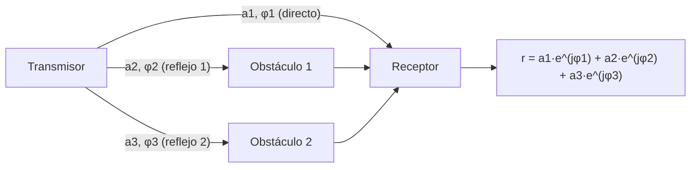
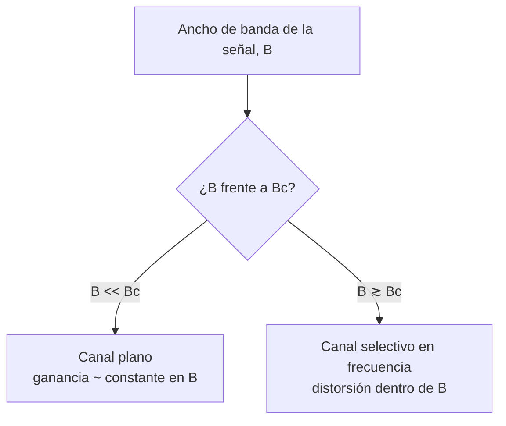

El capítulo anterior describe cómo se atenúa una señal radioeléctrica a lo largo de la
distancia entre transmisor y receptor y qué modelos estiman esa atenuación media. Este
capítulo se ocupa de la variación que la propagación multitrayecto y la movilidad del
terminal introducen alrededor de ese valor medio, tanto en el dominio del tiempo como en
el de la frecuencia, y de las consecuencias que esa variación tiene sobre el diseño de
un sistema de transmisión digital.

## Introducción

El modelo de atenuación descrito en
[propagación y pérdidas](./section_1_propagacion_y_perdidas.md) predice el nivel medio
de la señal recibida a una distancia dada, pero no explica sus fluctuaciones rápidas
alrededor de ese valor medio. Esas fluctuaciones reciben el nombre de
**desvanecimiento** (_fading_) y tienen dos causas físicas distintas que se estudian por
separado en este capítulo. La primera es la combinación de las múltiples réplicas de la
señal que llegan al receptor por caminos distintos, cada una con su propio retardo y su
propia fase, lo que da lugar a una respuesta del canal que varía con la frecuencia. La
segunda es el movimiento relativo entre transmisor y receptor, que hace que esa
combinación de réplicas cambie con el tiempo. Ambos efectos se caracterizan mediante
magnitudes de coherencia, el ancho de banda de coherencia en el dominio de la frecuencia
y el tiempo de coherencia en el dominio temporal, que determinan cómo debe diseñarse un
sistema de transmisión digital para convivir con ellos.

## Propagación multitrayecto

Los mecanismos de reflexión, difracción y dispersión descritos en el capítulo anterior
hacen que la energía radiada por el transmisor llegue al receptor siguiendo múltiples
caminos de longitud distinta. Cada uno de esos caminos entrega en el receptor una
réplica de la señal transmitida con su propia amplitud, su propio retardo y su propia
fase, y es la combinación de todas esas réplicas la que determina la señal que
finalmente se recibe.

### Suma de fasores

Para una señal sinusoidal de una sola frecuencia, cada réplica que llega al receptor
puede representarse como un fasor: un número complejo cuyo módulo recoge la atenuación
sufrida por ese camino y cuya fase recoge el retardo acumulado a lo largo de él. La
señal resultante en el receptor es la suma de todos esos fasores:

$$
r = \sum_{i=1}^{N} a_i\, e^{j\varphi_i}
$$

donde $N$ es el número de caminos que alcanzan el receptor, $a_i$ es la amplitud real y
positiva de la réplica que ha seguido el camino $i$, y $\varphi_i$ es su fase, que
depende del retardo de propagación de ese camino y de la frecuencia de la portadora.
Puesto que las fases $\varphi_i$ dependen de la longitud exacta de cada trayecto, un
cambio muy pequeño en la geometría del entorno, del orden de una fracción de la longitud
de onda, puede alterar de forma notable el resultado de la suma.

### Desvanecimiento constructivo y destructivo

Cuando las fases de los distintos fasores están próximas entre sí, la suma se produce de
forma constructiva y la amplitud resultante se aproxima a la suma de las amplitudes
individuales. Cuando, por el contrario, las fases se distribuyen de forma que algunos
fasores se oponen a otros, la suma se produce de forma destructiva y la amplitud
resultante puede llegar a ser mucho menor que la de cualquier réplica individual,
incluso próxima a cero si dos réplicas de amplitud similar llegan en oposición de fase
completa. Esta alternancia entre combinación constructiva y destructiva, gobernada por
retardos que cambian de forma continua con la geometría del entorno y con el movimiento
del terminal, es la causa directa del desvanecimiento de la señal recibida.

## Respuesta del canal

La suma de fasores descrita para una señal sinusoidal se generaliza a una descripción
completa del canal como sistema lineal, caracterizado indistintamente por su respuesta
al impulso en el dominio del tiempo o por su respuesta en frecuencia, ambas relacionadas
mediante la transformada de Fourier.

### Respuesta al impulso

Si en lugar de una sinusoide se transmite un impulso, el receptor observa varios pulsos
distintos, uno por cada camino de propagación, cada uno con su propio retardo y su
propia amplitud. La respuesta al impulso del canal multitrayecto recoge esa estructura:

$$
h(\tau) = \sum_{i=1}^{N} a_i\, e^{j\varphi_i}\, \delta(\tau - \tau_i)
$$

donde $\tau_i$ es el retardo de propagación del camino $i$ respecto al camino más
directo, y $\delta(\cdot)$ es la función delta de Dirac. La duración total de esta
respuesta, esto es, la diferencia entre el retardo del último camino apreciable y el del
primero, se conoce como **dispersión temporal** del canal (_delay spread_) y crece con
la cantidad y la longitud relativa de los caminos que sigue la señal. Por ese motivo, un
entorno urbano denso con edificios altos presenta una respuesta al impulso más
prolongada que un espacio abierto, en el que apenas existen caminos secundarios de
longitud comparable al directo.

### Respuesta en frecuencia

La respuesta en frecuencia del canal se obtiene aplicando la transformada de Fourier a
la respuesta al impulso, lo que da lugar a una expresión formalmente idéntica a la suma
de fasores presentada más arriba, ahora explícita en su dependencia con la frecuencia
$f$:

$$
H(f) = \sum_{i=1}^{N} a_i\, e^{j\varphi_i}\, e^{-j2\pi f \tau_i}
$$

Para cada frecuencia, el término de fase $e^{-j2\pi f \tau_i}$ de cada camino toma un
valor distinto, de modo que la combinación constructiva o destructiva de los fasores
también depende de la frecuencia. El resultado es que la ganancia del canal, en lugar de
ser constante con la frecuencia como ocurre en el modelo de atenuación del capítulo
anterior, presenta máximos y mínimos que se repiten con la frecuencia, tanto más
pronunciados y frecuentes cuanto mayor es el retardo relativo entre caminos.

### Ancho de banda de coherencia

El ritmo con el que la respuesta en frecuencia varía a lo largo del eje de frecuencias
está gobernado por la dispersión temporal del canal: cuanto mayor es la diferencia de
retardos entre caminos, más rápido oscila $H(f)$ con la frecuencia. Esta relación se
resume mediante el **ancho de banda de coherencia** $B_c$, el intervalo de frecuencias
dentro del cual la respuesta del canal puede considerarse aproximadamente constante. El
ancho de banda de coherencia es del orden inverso de la dispersión temporal
$\Delta\tau$:

$$
B_c \sim \frac{1}{\Delta\tau}
$$

Esta expresión es una relación de orden de magnitud, no una identidad exacta: el factor
de proporcionalidad concreto depende del criterio de correlación que se exija entre dos
frecuencias para considerarlas coherentes, y distintas definiciones de $\Delta\tau$
(dispersión máxima o dispersión eficaz) dan lugar a constantes distintas. Lo que la
relación fija con precisión es la dependencia dimensional: un canal con mayor dispersión
temporal tiene, en la misma proporción inversa, un ancho de banda de coherencia menor.

???+ example "Ancho de banda de coherencia de un entorno urbano macrocelular"

    Un entorno urbano macrocelular presenta una dispersión temporal del orden de
    $\Delta\tau \approx 1\ \mu\text{s}$, una cifra habitual para trayectos con
    reflexiones múltiples entre edificios situados a varios cientos de metros de la
    estación base. Aplicando la relación de orden de magnitud entre dispersión temporal y
    ancho de banda de coherencia:

    $$
    B_c \sim \frac{1}{\Delta\tau} = \frac{1}{1\ \mu\text{s}} = 1\ \text{MHz}
    $$

    El resultado indica que, en ese entorno, dos componentes espectrales separadas menos
    de aproximadamente 1 MHz experimentan una ganancia de canal similar, mientras que
    componentes separadas varios megahercios pueden verse afectadas de forma muy
    distinta. Por tratarse de una relación de orden de magnitud, el valor exacto puede
    variar en un factor de varias unidades según el criterio de coherencia elegido, pero
    la escala de megahercios resultante es la que condiciona las decisiones de diseño que
    se retoman más adelante en este capítulo.

### Canal plano y canal selectivo en frecuencia

La relación entre el ancho de banda $B$ de la señal transmitida y el ancho de banda de
coherencia $B_c$ del canal determina el tipo de desvanecimiento que sufre esa señal. Si
$B$ es mucho menor que $B_c$, todas las componentes espectrales de la señal caen dentro
de una región en la que el canal se comporta de forma prácticamente uniforme, y se dice
que el canal es **plano** para esa señal: la señal recibida conserva su forma, escalada
por una única ganancia compleja aproximadamente constante en toda la banda. Si, por el
contrario, $B$ es comparable o mayor que $B_c$, distintas componentes espectrales de la
señal experimentan ganancias distintas, y el canal se denomina **selectivo en
frecuencia**: la forma de la señal recibida se distorsiona, con algunas componentes
atenuadas mucho más que otras.

???+ example "Clasificación de un canal como plano o selectivo en frecuencia"

    Se dispone del ancho de banda de coherencia estimado en el ejemplo anterior,
    $B_c \approx 1\ \text{MHz}$, y se comparan dos sistemas que operan en ese mismo
    entorno urbano: un sistema de banda estrecha con un ancho de banda de señal
    $B_1 = 200\ \text{kHz}$ y un sistema de banda ancha con $B_2 = 20\ \text{MHz}$.

    Para el primer sistema, $B_1 / B_c = 0{,}2$, de modo que el ancho de banda de la señal
    es una fracción pequeña del ancho de banda de coherencia y el canal puede tratarse
    como aproximadamente plano en toda la banda ocupada. Para el segundo sistema,
    $B_2 / B_c = 20$, muy por encima de la unidad, de modo que la señal ocupa muchas
    veces el ancho de banda de coherencia y el canal es claramente selectivo en
    frecuencia: distintas porciones de los 20 MHz de señal sufren desvanecimientos
    independientes entre sí.

## Variación temporal del canal

Las secciones anteriores describen la respuesta del canal en un instante concreto, con
el transmisor, el receptor y los objetos del entorno en posiciones fijas. En un sistema
real esa hipótesis rara vez se cumple: el receptor se desplaza, o lo hacen los objetos
que producen reflexiones a su alrededor, y esa movilidad hace que la respuesta del canal
evolucione de forma continua con el tiempo.

### Efecto de la velocidad del terminal

Cuando el receptor se mueve, la longitud de cada uno de los trayectos de propagación
cambia de forma continua, lo que hace que la fase $\varphi_i$ de cada fasor de la suma
presentada al inicio del capítulo también cambie con el tiempo. El resultado es que la
combinación constructiva o destructiva entre trayectos deja de ser estática: en unos
instantes la suma es favorable y la ganancia del canal aumenta, y en otros la suma es
destructiva y la señal se desvanece. El factor que más influye en la rapidez de este
cambio es la longitud de onda de la portadora, de modo que a mayor frecuencia el mismo
desplazamiento físico produce un giro de fase mayor y, por tanto, un cambio más rápido
de la ganancia. La velocidad del terminal actúa en el mismo sentido: a mayor velocidad,
la geometría de los trayectos cambia más deprisa y la respuesta del canal se renueva con
mayor frecuencia. Esta dependencia tiene una consecuencia práctica directa sobre la
estimación del canal en cualquier sistema de transmisión digital: si el canal cambia de
forma apreciable en una fracción de segundo, las estimaciones de canal obtenidas a
partir de símbolos piloto quedan obsoletas antes de lo previsto, lo que degrada la
calidad de la compensación aplicada en recepción y eleva la tasa de errores de símbolo y
de bit, un efecto que se corrige en la práctica aumentando la densidad de símbolos
piloto en el tiempo a medida que crece la velocidad del terminal.

### Frecuencia Doppler y tiempo de coherencia

El cambio de fase inducido por el movimiento del receptor se traduce en un
desplazamiento de la frecuencia observada respecto a la frecuencia transmitida, conocido
como **frecuencia Doppler**. Para un terminal que se mueve con velocidad $v$ y recibe
una componente que llega con un ángulo $\theta$ respecto a la dirección de movimiento,
el desplazamiento Doppler de esa componente es:

$$
f_d = \frac{v}{\lambda} \cos\theta
$$

donde $\lambda$ es la longitud de onda de la portadora. El desplazamiento Doppler
máximo, que corresponde a una componente que llega exactamente en la dirección de
movimiento del terminal ($\theta = 0$), es:

$$
f_{d,\text{máx}} = \frac{v}{\lambda} = \frac{v f_c}{c}
$$

con $f_c$ la frecuencia de la portadora y $c$ la velocidad de la luz. Cuando la señal
llega por múltiples caminos con ángulos de incidencia distintos, cada uno experimenta un
desplazamiento Doppler distinto dentro del intervalo $\lbrack -f_{d,\text{máx}},
f_{d,\text{máx}}\rbrack$, lo que se conoce como **dispersión Doppler** del canal y es el
equivalente, en el dominio del tiempo, de la dispersión temporal descrita para el
dominio de la frecuencia.

De forma dual al ancho de banda de coherencia, la dispersión Doppler determina el
**tiempo de coherencia** $T_c$, el intervalo temporal durante el cual la respuesta del
canal puede considerarse aproximadamente constante. El tiempo de coherencia es del orden
inverso del desplazamiento Doppler máximo:

$$
T_c \sim \frac{1}{f_{d,\text{máx}}}
$$

De nuevo, esta es una relación de orden de magnitud y no una identidad exacta, por el
mismo motivo que en el caso de $B_c$ y $\Delta\tau$: el factor de proporcionalidad
depende del criterio de correlación temporal exigido. La dependencia dimensional, sin
embargo, es clara y es simétrica a la del dominio de la frecuencia: dispersión temporal
y ancho de banda de coherencia forman un par inverso en frecuencia, y dispersión Doppler
y tiempo de coherencia forman el par inverso equivalente en tiempo.

???+ example "Frecuencia Doppler y tiempo de coherencia a distintas velocidades"

    Un terminal recibe una portadora de $f_c = 2600\ \text{MHz}$, para la que la
    longitud de onda es $\lambda = c / f_c \approx 0{,}1154\ \text{m}$. Se comparan dos
    situaciones de movilidad: un usuario peatonal a $v_1 = 5\ \text{km/h}$
    ($1{,}39\ \text{m/s}$) y un usuario a bordo de un vehículo a $v_2 = 120\ \text{km/h}$
    ($33{,}33\ \text{m/s}$).

    El desplazamiento Doppler máximo de cada escenario es:

    $$
    f_{d,\text{máx},1} = \frac{1{,}39}{0{,}1154} \approx 12{,}0\ \text{Hz}, \qquad
    f_{d,\text{máx},2} = \frac{33{,}33}{0{,}1154} \approx 288{,}9\ \text{Hz}
    $$

    y el tiempo de coherencia correspondiente, aplicando la relación de orden de
    magnitud $T_c \sim 1/f_{d,\text{máx}}$:

    $$
    T_{c,1} \approx 83\ \text{ms}, \qquad T_{c,2} \approx 3{,}5\ \text{ms}
    $$

    El usuario vehicular experimenta un tiempo de coherencia unas 24 veces menor que el
    peatonal: el canal que percibe cambia de forma apreciable en pocos milisegundos, lo
    que exige actualizar la estimación de canal con mucha mayor frecuencia para que el
    receptor no opere con una estimación ya obsoleta.

### Distancia de coherencia

El tiempo de coherencia tiene un equivalente expresado en distancia recorrida en lugar
de en tiempo transcurrido, la **distancia de coherencia** $D_c$: la distancia que puede
desplazarse el terminal sin que la respuesta del canal varíe de forma significativa.
Puesto que el cambio de fase de cada trayecto es proporcional al desplazamiento
recorrido dividido entre la longitud de onda, la respuesta del canal permanece
prácticamente constante mientras ese desplazamiento sea una fracción pequeña de
$\lambda$, de modo que la distancia de coherencia es del orden de una fracción de la
longitud de onda de la portadora. De forma consistente con el tiempo de coherencia, y
dado que distancia recorrida y tiempo transcurrido están relacionados por la velocidad
del terminal, la distancia de coherencia guarda con el tiempo de coherencia la relación
dimensional esperada:

$$
D_c \sim v \, T_c
$$

Esta relación explica por qué, a igual tiempo de coherencia, un terminal más rápido
cubre una distancia de coherencia mayor: lo que se mantiene constante entre ambos casos
no es la distancia recorrida, sino el número de longitudes de onda recorridas.

## Distribuciones de la ganancia del canal

Cuando el número de trayectos que combinan en el receptor es elevado y ninguno de ellos
domina claramente sobre el resto, el teorema del límite central permite aproximar la
ganancia compleja del canal, la suma de fasores presentada al inicio del capítulo, como
una variable aleatoria gaussiana compleja: sus partes real e imaginaria se comportan
como dos variables gaussianas independientes de media nula. La distribución estadística
del módulo de esa ganancia, es decir, de la amplitud instantánea de la señal recibida,
depende de si existe o no un trayecto dominante entre transmisor y receptor.

### Desvanecimiento de Rayleigh

Cuando no existe ningún trayecto dominante, en particular cuando no hay visión directa
entre transmisor y receptor y la señal recibida procede únicamente de la combinación de
componentes dispersadas de magnitud comparable, la parte real y la parte imaginaria de
la ganancia del canal son ambas gaussianas de media nula y varianza idéntica. En esas
condiciones, el módulo de la ganancia sigue una **distribución de Rayleigh**, cuya
función densidad de probabilidad es:

$$
f(r) = \frac{r}{\sigma^2}\, e^{-r^2/(2\sigma^2)}, \qquad r \ge 0
$$

donde $r$ es el módulo de la ganancia del canal y $\sigma^2$ es la potencia media de
cada una de las dos componentes gaussianas independientes que la forman. El
desvanecimiento de Rayleigh es el modelo estadístico habitual para entornos sin visión
directa con abundante dispersión, como una macrocelda urbana densa.

### Desvanecimiento de Rice

Cuando, por el contrario, existe un trayecto dominante, típicamente porque hay visión
directa entre transmisor y receptor, la ganancia del canal se compone de una parte
determinista de amplitud constante $A$, correspondiente a ese trayecto dominante, más
una componente aleatoria gaussiana que recoge el resto de trayectos dispersados. El
módulo de esa ganancia sigue entonces una **distribución de Rice**:

$$
f(r) = \frac{r}{\sigma^2}\, \exp\!\left(-\frac{r^2 + A^2}{2\sigma^2}\right)
I_0\!\left(\frac{rA}{\sigma^2}\right), \qquad r \ge 0
$$

donde $A$ es la amplitud del trayecto dominante, $\sigma^2$ es la potencia de las
componentes dispersadas e $I_0(\cdot)$ es la función de Bessel modificada de primera
especie y orden cero. La relación entre la potencia del trayecto dominante y la potencia
dispersada se resume en el factor de Rice $K = A^2/(2\sigma^2)$: cuando $K$ tiende a
cero, el trayecto dominante desaparece frente a la dispersión y la distribución de Rice
se reduce a la de Rayleigh, y cuando $K$ crece sin límite, la dispersión se hace
despreciable frente al trayecto dominante y el canal se aproxima a uno sin
desvanecimiento. El desvanecimiento de Rice es, por tanto, el modelo habitual para
entornos con visión directa, como una macrocelda rural abierta o un enlace fijo punto a
punto, en los que además existen reflexiones secundarias de menor peso.

## Consecuencias para el diseño del sistema

Las magnitudes de coherencia definidas en este capítulo, el ancho de banda de coherencia
y el tiempo de coherencia, no son solo herramientas de caracterización del canal: fijan
restricciones directas sobre cómo debe diseñarse un sistema de transmisión digital para
operar sobre él.

### Elección del ancho de banda

Un sistema que transmite con un ancho de banda mucho menor que el ancho de banda de
coherencia experimenta un canal aproximadamente plano y evita, por construcción, la
distorsión asociada a la selectividad en frecuencia. Esta es la razón por la que, frente
al presupuesto de dispersión temporal de un entorno dado, existe un ancho de banda
máximo recomendable antes de que el canal empiece a comportarse de forma selectiva.
Cuando la velocidad de transmisión que exige un servicio obliga a superar ese límite, el
sistema ya no puede tratarse como un canal plano de banda estrecha, y los sistemas de
transmisión digital recurren entonces a técnicas de igualación del canal o a esquemas de
modulación que fragmentan un canal ancho en múltiples subcanales estrechos y
aproximadamente planos, soluciones que se tratan en capítulos posteriores dedicados a la
modulación y al acceso al medio.

### Interferencia entre símbolos

En el dominio del tiempo, la misma limitación se manifiesta como **interferencia entre
símbolos** (_intersymbol interference_ o ISI): cuando la dispersión temporal del canal
es comparable o mayor que el periodo de símbolo de la señal transmitida, las réplicas
retardadas de un símbolo se solapan con el símbolo siguiente, y ese solapamiento se
interpreta en el receptor como ruido añadido a la decisión de símbolo. Cuantos más
caminos de propagación contribuyen a la señal recibida, mayor es la dispersión temporal
resultante y más severo es el solapamiento entre símbolos consecutivos, lo que se
traduce en un incremento tanto de la tasa de error de símbolo como de la tasa de error
de bit del enlace. La condición de diseño equivalente a la del ancho de banda es, por
tanto, mantener el periodo de símbolo suficientemente grande frente a la dispersión
temporal del canal, o recurrir a mecanismos que absorban esa dispersión, como un tiempo
de guarda entre símbolos, sin necesidad de reducir la velocidad de transmisión.

## Entornos de propagación normalizados

Para poder comparar y dimensionar sistemas de forma reproducible, la planificación de
redes móviles recurre a un catálogo de entornos de propagación normalizados que fijan,
de forma estandarizada, la dispersión temporal y la movilidad del terminal que deben
suponerse durante el diseño. Cada familia de entornos está asociada a una generación
tecnológica y a un tipo de escenario geográfico:

| Familia | Entorno que representa                     | Generación asociada |
| ------- | ------------------------------------------ | ------------------- |
| `RAx`   | Zona rural abierta                         | GSM                 |
| `TUx`   | Zona urbana típica                         | GSM                 |
| `HTx`   | Terreno montañoso                          | GSM                 |
| `EPAx`  | Usuario peatonal (_extended pedestrian A_) | UMTS y LTE          |
| `EVAx`  | Usuario vehicular (_extended vehicular A_) | UMTS y LTE          |
| `ETUx`  | Zona urbana típica de banda ancha          | UMTS y LTE          |
| `HSTx`  | Usuario a bordo de tren de alta velocidad  | UMTS y LTE          |

El sufijo `x` de cada entorno indica la velocidad del terminal en kilómetros por hora
que se supone durante el dimensionado, de modo que un entorno `RA250` representa un
usuario en zona rural desplazándose a 250 km/h. Las familias que incorporan la letra `E`
de _extended_ son versiones de mayor resolución temporal de sus equivalentes originales:
resuelven un número mayor de componentes multitrayecto dentro del mismo perfil de
retardo, lo que permite representar con más detalle la dispersión temporal del entorno.
Durante el proceso de dimensionado de una red, la elección de uno de estos entornos fija
de manera indirecta la dispersión temporal y la dispersión Doppler que deben usarse como
entrada de los cálculos de ancho de banda de coherencia y de tiempo de coherencia
desarrollados en este capítulo, y con ellas el margen de diseño frente a la selectividad
en frecuencia y a la interferencia entre símbolos.
