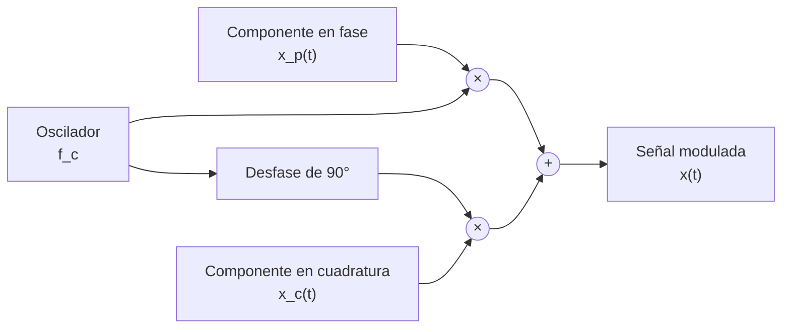
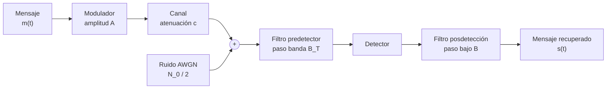
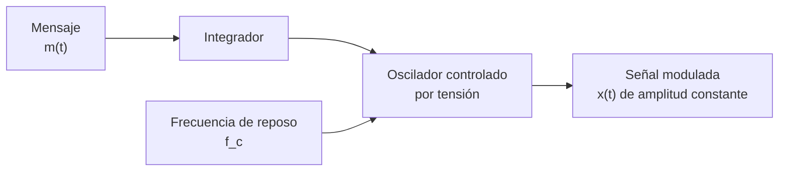
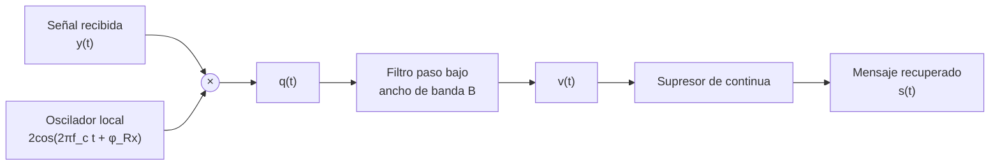
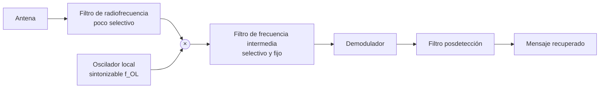

Un mensaje analógico ocupa una banda de frecuencias próxima al origen que casi nunca
coincide con la banda que el canal es capaz de transportar. La modulación resuelve ese
desajuste trasladando el mensaje a una banda situada en torno a una frecuencia elevada,
la de la portadora, y el demodulador realiza la operación inversa en el receptor. Este
capítulo describe las dos familias con que se hace ese traslado sobre señales
analógicas, las modulaciones lineales y las angulares, y cuantifica qué relación
señal-ruido entrega cada una a cambio del ancho de banda que consume.

## Introducción

Una **modulación** es la operación que hace variar uno de los parámetros de una señal
portadora al ritmo de la señal de información. Si el parámetro afectado es la amplitud,
la modulación es **lineal**, porque la señal transmitida depende linealmente del
mensaje. Si el parámetro afectado es la frecuencia o la fase, la modulación es
**angular** y esa dependencia lineal se pierde, lo que complica el análisis y a la vez
abre la posibilidad de mejorar la relación señal-ruido a costa de ancho de banda.

Tres motivos justifican modular. El primero es adaptar la señal al medio, ya que una
antena de dimensiones razonables solo radia con eficiencia en torno a frecuencias altas.
El segundo es compartir el medio entre varias transmisiones, asignando a cada una una
portadora distinta. El tercero es intercambiar ancho de banda por calidad, posibilidad
que solo ofrecen las modulaciones angulares.

El capítulo sigue el recorrido natural de la señal. Primero se describe la estructura
común a toda señal situada en torno a una portadora, después el sistema completo con su
canal y su ruido, a continuación las dos familias de modulación y el ancho de banda que
cada una ocupa, luego las prestaciones que alcanzan frente al ruido y por último los
demoduladores y su sensibilidad a los errores de sincronismo. Las herramientas
estadísticas que se emplean sin volver a deducirlas, la densidad espectral de potencia,
el modelo de ruido blanco gaussiano aditivo y las escalas logarítmicas de potencia,
están en
[señales aleatorias y ruido](../01_senales/section_2_senales_aleatorias_y_ruido.md).

## Señales paso banda

Una **señal paso banda** es aquella cuya densidad espectral de potencia se concentra en
un entorno de una frecuencia $f_c$ mucho mayor que su propio ancho de banda. El caso más
sencillo es una portadora cuya amplitud varía lentamente,

$$
x(t) = a(t) \cos(2 \pi f_c t)
$$

donde $a(t)$ es la amplitud instantánea y $f_c$ la frecuencia de la portadora. Su
transformada de Fourier reparte el espectro de la amplitud en dos réplicas centradas en
las frecuencias de la portadora,

$$
X(f) = \frac{A(f - f_c)}{2} + \frac{A(f + f_c)}{2}
$$

siendo $A(f)$ la transformada de $a(t)$. El factor un medio y la duplicación de réplicas
son consecuencia directa de expresar el coseno como suma de dos exponenciales complejas,
y aparecen en todas las expresiones espectrales del capítulo.

### Componentes en fase y en cuadratura

Una sola portadora admite dos señales moduladoras independientes, porque un coseno y un
seno de la misma frecuencia son ortogonales. La forma general de una señal paso banda es

$$
x(t) = x_p(t) \cos(2 \pi f_c t) - x_c(t) \operatorname{sen}(2 \pi f_c t)
$$

donde $x_p(t)$ es la **componente en fase** y $x_c(t)$ la **componente en cuadratura**,
ambas señales paso bajo de ancho de banda $B$. Toda modulación analógica lineal se
describe eligiendo qué se pone en cada una de esas dos componentes, y ese es el criterio
que ordena las secciones siguientes.

Las dos componentes se agrupan en el **equivalente paso bajo**, señal compleja que
concentra toda la información sin arrastrar la portadora:

$$
x_{eq}(t) = x_p(t) + j \, x_c(t)
$$

de modo que $x(t) = \operatorname{Re} \lbrack x_{eq}(t) \, e^{j 2 \pi f_c t} \rbrack$.
Esta representación simplifica el análisis de los errores de sincronismo, donde un
desfase del oscilador local se traduce en un simple giro de fase de $x_{eq}(t)$.

El modulador consta por tanto de dos ramas, y el demodulador replica la estructura en
sentido inverso recuperando cada componente por separado mediante un filtro paso bajo.



### Densidad espectral de potencia de una señal modulada

La relación general entre la densidad espectral de entrada y salida de un sistema lineal
e invariante, $S_y(f) = S_x(f) \, |H(f)|^2$, y su particularización al desplazamiento
espectral producido por una modulación de tono se demuestran en
[señales aleatorias y ruido](../01_senales/section_2_senales_aleatorias_y_ruido.md#respuesta-de-un-sistema-lineal-e-invariante).
Aplicando esa misma construcción a una señal paso banda con componentes en fase y en
cuadratura incorreladas, la densidad espectral de potencia de la señal modulada es la
suma de las réplicas desplazadas de las densidades de cada componente,

$$
S_x(f) = \frac{A^2}{4} \lbrack S_{x_p}(f - f_c) + S_{x_c}(f - f_c)
+ S_{x_p}(f + f_c) + S_{x_c}(f + f_c) \rbrack
$$

donde $A$ es la amplitud que aplica el modulador. Integrando esa densidad se obtiene la
potencia transmitida,

$$
P_x = \frac{A^2}{2} \lbrack P_{x_p} + P_{x_c} \rbrack
$$

con $P_{x_p}$ y $P_{x_c}$ las potencias medias de cada componente. La potencia de la
señal recibida es la anterior afectada por la atenuación del canal, $P_y = c^2 P_x$,
donde $c$ es el factor de atenuación en amplitud.

De estas dos expresiones se sigue una consecuencia que conviene retener. El ancho de
banda ocupado por la señal modulada es el doble del de sus componentes, $B_T = 2B$,
porque cada réplica conserva la anchura de la densidad original a ambos lados de la
portadora. La única forma de reducir esa ocupación es eliminar deliberadamente parte del
espectro transmitido, que es lo que hacen las modulaciones de banda lateral reducida.

## Sistema de comunicaciones analógico

### Mensaje, canal y ruido

El **mensaje** $m(t)$ es la señal que transporta la información. Su modelo depende de lo
que se quiera analizar. Para estudiar espectros y formas de onda basta tratarlo como una
señal determinista, habitualmente un tono de frecuencia $f_0$. Para evaluar prestaciones
se modela como un proceso aleatorio estacionario y ergódico de media nula, con ancho de
banda $B$ y potencia media $P_m$ obtenida integrando su densidad espectral de potencia.
La media nula es una hipótesis de trabajo, no una casualidad, porque una componente
continua en el mensaje consume potencia del transmisor sin transportar información.

El **canal** se modela como una atenuación que multiplica la amplitud por un factor $c$
menor que la unidad, sin distorsión de fase ni selectividad en frecuencia. Esa
simplificación es válida cuando el ancho de banda de la señal modulada es pequeño frente
a la banda en que el canal se comporta de forma plana, condición que se examina al
tratar la
[respuesta del canal](../02_canal/section_2_desvanecimiento_y_respuesta_del_canal.md).

El **ruido** $n(t)$ se suma a la señal en el receptor y responde al modelo blanco
gaussiano aditivo, con densidad espectral de potencia bilateral constante de valor $N_0
/ 2$. La señal disponible a la entrada del receptor es por tanto

$$
r(t) = c \, x(t) + n(t)
$$

### Filtro predetector y filtro posdetección

El receptor intercala dos filtros con cometidos distintos. El **filtro predetector**
$H_P(f)$ es un paso banda centrado en la portadora, de ancho de banda $B_T$ igual al de
la señal modulada, que elimina todo el ruido ajeno a esa banda antes de la detección. El
**filtro posdetección** $H_B(f)$ es un paso bajo de ancho de banda $B$ igual al del
mensaje, que actúa después del detector y suprime el ruido residual que la detección ha
trasladado a banda base.



Los dos puntos de referencia del análisis de prestaciones son la salida del filtro
predetector, que se designa como entrada del demodulador y se marca con el subíndice
$E$, y la salida del filtro posdetección, que se designa como salida del demodulador y
se marca con el subíndice $S$. Toda comparación entre modulaciones se hace entre esos
dos puntos.

Con filtros ideales, la potencia de ruido a la entrada del demodulador es la densidad
espectral integrada sobre las dos bandas de paso del filtro predetector, $P_N = N_0
B_T$, que para una modulación lineal de ancho de banda $B_T = 2B$ vale $P_N = 2 N_0 B$.
Cuando los filtros no son ideales la integración debe hacerse sobre el módulo al
cuadrado de la respuesta,

$$
P_N = \frac{N_0}{2} \int_{-\infty}^{\infty} |H_P(f)|^2 \, df
$$

y el resultado es siempre mayor que el ideal, porque las faldas del filtro admiten ruido
fuera de la banda útil. Ensanchar cualquiera de los dos filtros por encima de lo
necesario degrada la relación señal-ruido en la misma proporción en que aumenta la banda
admitida, sin aportar nada a la señal.

## Modulaciones lineales

En una modulación lineal las componentes en fase y en cuadratura son combinaciones
lineales del mensaje, de modo que el espectro de la señal transmitida es una réplica
desplazada del espectro del mensaje. Las cuatro variantes de uso corriente se distinguen
por cómo reparten el mensaje entre las dos componentes y por cuánto espectro conservan.

### Doble banda lateral

La modulación de **doble banda lateral** pone el mensaje en la componente en fase y deja
vacía la de cuadratura, $x_p(t) = m(t)$ y $x_c(t) = 0$, con lo que la señal transmitida
es

$$
x(t) = A \, m(t) \cos(2 \pi f_c t)
$$

Su densidad espectral son las dos réplicas del espectro del mensaje centradas en las
frecuencias de la portadora,

$$
S_x(f) = \frac{A^2}{4} \lbrack S_m(f - f_c) + S_m(f + f_c) \rbrack
$$

de donde la potencia transmitida vale $P_x = A^2 P_m / 2$ y el ancho de banda ocupado es
$B_T = 2B$. Toda la potencia transmitida es útil, porque no se emite ninguna componente
que no transporte información. Es el esquema lineal más eficiente en potencia y a la vez
el que exige un receptor más exigente, ya que recuperar el mensaje obliga a reconstruir
la portadora en amplitud y en fase.

### Modulación de amplitud

La **modulación de amplitud** añade a la señal anterior una portadora residual, de modo
que la componente en fase pasa a tener un nivel de continua,

$$
x_p(t) = 1 + k_a \, m(t), \qquad x_c(t) = 0
$$

donde $k_a$ es la **sensibilidad de amplitud** del modulador. La señal transmitida se
escribe habitualmente en función del índice de modulación,

$$
x(t) = A \lbrack 1 + \mu \, m(t) \rbrack \cos(2 \pi f_c t)
$$

con el mensaje normalizado a amplitud máxima unidad. Su densidad espectral reproduce la
de la doble banda lateral y le añade dos deltas en las frecuencias de la portadora,

$$
S_x(f) = \frac{A^2 \mu^2}{4} \lbrack S_m(f - f_c) + S_m(f + f_c) \rbrack
+ \frac{A^2}{4} \lbrack \delta(f - f_c) + \delta(f + f_c) \rbrack
$$

y la potencia transmitida se reparte en consecuencia entre portadora y bandas laterales,

$$
P_x = \frac{A^2}{2} \lbrack 1 + \mu^2 P_m \rbrack
$$

El ancho de banda sigue siendo $B_T = 2B$, igual que en doble banda lateral, porque la
portadora añadida no ensancha el espectro. Lo que cambia es el reparto de potencia, y
con él las prestaciones. La ventaja que compra esa portadora emitida es que la
envolvente de la señal reproduce directamente el mensaje, lo que permite un receptor sin
sincronismo.

### Índice de modulación y sobremodulación

El **índice de modulación** $\mu = k_a \max |m(t)|$ mide cuánto se aparta la envolvente
de su valor de reposo. Para que la envolvente $1 + \mu \, m(t)$ no cambie de signo debe
cumplirse

$$
0 < \mu \leq 1
$$

Por encima de ese límite se produce **sobremodulación**, la envolvente cruza por cero y
sus lóbulos positivos se solapan, de modo que la forma de onda que sigue la envolvente
ya no reproduce el mensaje. Un receptor que detecte la envolvente entrega entonces una
señal distorsionada de forma irrecuperable, mientras que un receptor que reconstruya la
portadora sigue funcionando porque opera sobre la componente en fase completa, con signo
incluido.

El precio del margen de seguridad es potencia. La fracción de potencia transmitida que
transporta información es

$$
\eta = \frac{\mu^2 P_m}{1 + \mu^2 P_m}
$$

que ni siquiera en el caso límite favorable alcanza valores altos. El código siguiente
recorre tres índices de modulación y muestra a la vez la aparición de la sobremodulación
y el reparto de potencia resultante.

```python linenums="1"
import numpy as np


def modula_am(
    t: np.ndarray, m: np.ndarray, indice: float, f_c: float, amplitud: float
) -> tuple[np.ndarray, np.ndarray]:
    """Modula en amplitud una señal moduladora normalizada.

    Args:
        t: Vector de instantes de tiempo, en segundos.
        m: Moduladora normalizada a amplitud máxima unidad.
        indice: Índice de modulación.
        f_c: Frecuencia de la portadora, en hercios.
        amplitud: Amplitud de la portadora, en voltios.

    Returns:
        Tupla con la señal modulada y con su envolvente.
    """
    # La envolvente es la que transporta el mensaje sobre un nivel de continua
    envolvente = amplitud * (1.0 + indice * m)
    return envolvente * np.cos(2.0 * np.pi * f_c * t), envolvente


frecuencia_muestreo = 400e3
t = np.arange(0.0, 5e-3, 1.0 / frecuencia_muestreo)
# Tono de 1 kHz normalizado, de potencia media 1/2
m = np.cos(2.0 * np.pi * 1e3 * t)
for indice in (0.5, 1.0, 2.0):
    x, envolvente = modula_am(t, m, indice, f_c=20e3, amplitud=1.0)
    # Reparto de potencia entre portadora y bandas laterales
    potencia_bandas = 0.5 * indice**2 * 0.5
    fraccion = potencia_bandas / (0.5 + potencia_bandas)
    sobremodula = np.any(envolvente < 0.0)
    print(
        f"mu = {indice:.1f}  envolvente mínima = {envolvente.min():+.2f} V  "
        f"potencia útil = {100.0 * fraccion:4.1f} %  "
        f"sobremodulación = {sobremodula}"
    )
```

```plaintext title="Expected output"
mu = 0.5  envolvente mínima = +0.50 V  potencia útil = 11.1 %  sobremodulación = False
mu = 1.0  envolvente mínima = +0.00 V  potencia útil = 33.3 %  sobremodulación = False
mu = 2.0  envolvente mínima = -1.00 V  potencia útil = 66.7 %  sobremodulación = True
```

El índice unidad es la frontera exacta entre los dos regímenes, con envolvente mínima
nula y un tercio de la potencia dedicado a la información. Reducirlo a la mitad
multiplica por tres el desperdicio, y superarlo mejora el reparto de potencia a cambio
de una distorsión que ninguna ganancia compensa.

???+ example "Índice de modulación de una emisión medida sobre su envolvente"

    Un analizador conectado a la salida de un transmisor de amplitud modulada mide una
    envolvente que oscila entre un máximo de 1,5 V y un mínimo de 0,5 V, con el mensaje
    normalizado a amplitud unidad. La envolvente responde a la expresión
    $A \lbrack 1 + \mu \, m(t) \rbrack$, de modo que el máximo vale $A (1 + \mu)$ y el
    mínimo $A (1 - \mu)$. El cociente entre la diferencia y la suma de ambos elimina la
    amplitud de la portadora y despeja el índice:

    $$
    \mu = \frac{1{,}5 - 0{,}5}{1{,}5 + 0{,}5} = 0{,}5
    $$

    mientras que la semisuma devuelve $A = 1$ V. Si el mensaje es un tono normalizado,
    su potencia media vale $P_m = 1/2$ y la potencia transmitida se reparte como
    $P_x = (1 + 0{,}5^2 \cdot 0{,}5) / 2 = 0{,}5625$ W, de los cuales solo
    $0{,}0625$ W corresponden a las bandas laterales. Un 11,1 % de la potencia emitida
    transporta información y el resto se gasta en una portadora que el receptor
    descarta.

    Llevar el índice a la unidad elevaría esa fracción al 33,3 %, el máximo compatible
    con la detección de envolvente. Ese techo, y no una limitación del amplificador, es
    lo que explica el consumo característico de este esquema.

### Modulación en cuadratura

La **modulación en cuadratura** aprovecha las dos componentes para transportar dos
mensajes independientes sobre la misma portadora, $x_p(t) = m_1(t)$ y $x_c(t) = m_2(t)$,
con lo que la señal transmitida es

$$
x(t) = A \, m_1(t) \cos(2 \pi f_c t) - A \, m_2(t) \operatorname{sen}(2 \pi f_c t)
$$

Su densidad espectral suma las réplicas de los dos mensajes,

$$
S_x(f) = \frac{A^2}{4} \lbrack S_{m_1}(f - f_c) + S_{m_2}(f - f_c)
+ S_{m_1}(f + f_c) + S_{m_2}(f + f_c) \rbrack
$$

y la potencia transmitida vale $P_x = A^2 \lbrack P_{m_1} + P_{m_2} \rbrack / 2$. El
ancho de banda sigue siendo $B_T = 2B$ para los dos mensajes juntos, de modo que el
espectro ocupado por mensaje se reduce a la mitad respecto de la doble banda lateral.
Esa duplicación de capacidad es la razón de ser del esquema.

La contrapartida es la exigencia de sincronismo. La separación de las dos componentes
descansa por completo en la ortogonalidad entre el coseno y el seno de la portadora, y
cualquier desfase del oscilador local la destruye mezclando los dos mensajes, efecto que
se cuantifica al tratar los errores de sincronismo.

### Banda lateral única y banda lateral residual

Las dos réplicas que una modulación lineal sitúa a cada lado de la portadora son
redundantes, porque el espectro de un mensaje real es simétrico. Transmitir solo una de
ellas reduce el ancho de banda a la mitad sin perder información.

La modulación de **banda lateral única** transmite una sola banda lateral y alcanza $B_T
= B$, el mínimo posible para una modulación analógica lineal. Exige un filtro de
transición muy abrupta junto a la portadora, difícil de realizar, y su demodulación es
especialmente sensible a los fallos de sincronismo, porque un desfase no solo atenúa la
salida sino que distorsiona la relación de fases entre componentes espectrales del
mensaje. Su nicho histórico es la telefonía multiplexada por división en frecuencia,
donde el ahorro de espectro por canal compensa la complejidad del equipo terminal.

La modulación de **banda lateral residual** relaja esa exigencia dejando pasar un resto
de la banda suprimida, con lo que el ancho de banda crece hasta $B_T = B + \delta$,
siendo $\delta$ la anchura del residuo conservado. El filtro resultante admite una
transición gradual y por tanto una realización sencilla, a cambio de un ancho de banda
ligeramente superior al mínimo teórico.

## Modulación angular

En una modulación angular el mensaje actúa sobre el argumento de la portadora y no sobre
su amplitud, que permanece constante. La relación entre mensaje y señal transmitida deja
de ser lineal, de modo que el espectro de la señal modulada ya no es una réplica
desplazada del espectro del mensaje y su cálculo exacto resulta considerablemente más
complejo. Esa dificultad se compensa con dos ventajas prácticas de peso. La primera es
la inmunidad frente al ruido, muy superior a la de cualquier modulación lineal. La
segunda es que la amplitud constante permite trabajar con amplificadores no lineales de
alto rendimiento.

Según el parámetro afectado se distingue la **modulación de frecuencia**, en que el
mensaje controla la frecuencia instantánea, y la **modulación de fase**, en que controla
directamente la fase. Ambas están relacionadas por una integración y comparten
prestaciones, por lo que el tratamiento se centra en la primera.

### Modulación de frecuencia

La señal modulada en frecuencia es una portadora de amplitud constante cuyo argumento
incorpora la integral del mensaje,

$$
x(t) = A \cos \lbrack 2 \pi f_c t + \varphi(t) \rbrack
$$

$$
\varphi(t) = 2 \pi k_f \int_{0}^{t} m(\tau) \, d\tau
$$

donde $k_f$ es la **sensibilidad de frecuencia** del modulador, en hercios por voltio, y
$\varphi(t)$ la desviación de fase acumulada. Derivando el argumento se obtiene la
frecuencia instantánea $f_i(t) = f_c + k_f \, m(t)$, expresión que justifica el nombre
de la modulación. El equivalente paso bajo tiene módulo constante y toda la información
reside en su fase,

$$
x_{eq}(t) = A \, e^{j \varphi(t)}
$$

La realización directa del modulador consta de un integrador seguido de un oscilador
controlado por tensión, dispositivo cuya frecuencia de salida depende linealmente de la
tensión aplicada a su entrada de control.



### Desviación de frecuencia e índice de modulación

La **desviación máxima de frecuencia** mide cuánto se aparta la frecuencia instantánea
de la frecuencia de reposo,

$$
f_\Delta = k_f \max |m(t)|
$$

y es el parámetro que el diseñador fija según el ancho de banda disponible. El **índice
de modulación** relaciona esa desviación con el contenido en frecuencia del mensaje,

$$
\beta = \frac{f_\Delta}{B}
$$

donde $B$ es la frecuencia máxima del mensaje, que para una moduladora de tono único se
sustituye por la frecuencia del propio tono $f_0$. El índice admite una segunda lectura
como desviación máxima de fase, porque integrar un mensaje de frecuencia $f_0$ divide su
amplitud por ese valor.

El espectro de una señal modulada en frecuencia es teóricamente infinito incluso para
una moduladora de tono único, ya que la exponencial de una fase sinusoidal desarrolla
infinitos armónicos en torno a la portadora. La amplitud de esos armónicos decrece con
rapidez una vez superada la desviación de frecuencia, lo que hace razonable definir un
ancho de banda práctico que recoja la mayor parte de la potencia.

### Regla de Carson

La **regla de Carson** estima el ancho de banda ocupado sumando la desviación de
frecuencia y el ancho de banda del mensaje,

$$
B_T = 2 \lbrack f_\Delta + B \rbrack = 2 B \lbrack \beta + 1 \rbrack
$$

expresión que se particulariza sustituyendo $B$ por $f_0$ cuando la moduladora es un
tono. Esa distinción no es un detalle de notación. Aplicar la versión del tono a una
moduladora de espectro extenso sobrestima el ancho de banda, porque la mayor parte de la
potencia del mensaje se concentra por debajo de su frecuencia máxima.

Los dos regímenes límite se leen directamente en la expresión. Con $\beta \ll 1$ el
ancho de banda tiende a $2B$, el mismo que consumiría una modulación lineal de doble
banda lateral. Con $\beta \gg 1$ el ancho de banda queda dominado por la desviación de
frecuencia y crece proporcionalmente a ella, régimen en que la modulación angular compra
calidad a cambio de espectro. El código siguiente comprueba la regla midiendo qué
fracción de la potencia transmitida cae dentro de la banda que predice.

```python linenums="1"
import numpy as np


def modula_fm(
    t: np.ndarray, m: np.ndarray, f_c: float, desviacion: float, amplitud: float
) -> np.ndarray:
    """Modula en frecuencia una señal moduladora normalizada.

    Args:
        t: Vector de instantes de tiempo, en segundos.
        m: Moduladora normalizada a amplitud máxima unidad.
        f_c: Frecuencia de la portadora, en hercios.
        desviacion: Desviación máxima de frecuencia, en hercios.
        amplitud: Amplitud de la portadora, en voltios.

    Returns:
        Señal modulada en frecuencia.
    """
    periodo = float(t[1] - t[0])
    # La fase instantánea es proporcional a la integral del mensaje
    integral = np.cumsum(m) * periodo
    fase = 2.0 * np.pi * f_c * t + 2.0 * np.pi * desviacion * integral
    return amplitud * np.cos(fase)


def fraccion_potencia(
    x: np.ndarray, frecuencia_muestreo: float, f_c: float, ancho_banda: float
) -> float:
    """Calcula la fracción de potencia contenida en una banda centrada en f_c.

    Args:
        x: Señal modulada muestreada.
        frecuencia_muestreo: Frecuencia de muestreo, en hercios.
        f_c: Frecuencia central de la banda, en hercios.
        ancho_banda: Anchura total de la banda, en hercios.

    Returns:
        Cociente entre la potencia dentro de la banda y la potencia total.
    """
    espectro = np.fft.rfft(x)
    frecuencias = np.fft.rfftfreq(x.size, d=1.0 / frecuencia_muestreo)
    densidad = np.abs(espectro) ** 2
    dentro = np.abs(frecuencias - f_c) <= ancho_banda / 2.0
    return float(np.sum(densidad[dentro]) / np.sum(densidad))


frecuencia_muestreo = 1e6
t = np.arange(0.0, 100e-3, 1.0 / frecuencia_muestreo)
f_0 = 1e3
m = np.cos(2.0 * np.pi * f_0 * t)
for desviacion in (5e3, 10e3, 15e3, 20e3):
    x = modula_fm(t, m, f_c=100e3, desviacion=desviacion, amplitud=1.0)
    # Regla de Carson para una moduladora de tono único
    ancho_carson = 2.0 * (desviacion + f_0)
    indice = desviacion / f_0
    fraccion = fraccion_potencia(x, frecuencia_muestreo, 100e3, ancho_carson)
    print(
        f"f_delta = {desviacion / 1e3:4.1f} kHz  beta = {indice:4.1f}  "
        f"B_T = {ancho_carson / 1e3:4.1f} kHz  "
        f"potencia dentro de B_T = {100.0 * fraccion:.2f} %"
    )
```

```plaintext title="Expected output"
f_delta =  5.0 kHz  beta =  5.0  B_T = 12.0 kHz  potencia dentro de B_T = 97.62 %
f_delta = 10.0 kHz  beta = 10.0  B_T = 22.0 kHz  potencia dentro de B_T = 97.47 %
f_delta = 15.0 kHz  beta = 15.0  B_T = 32.0 kHz  potencia dentro de B_T = 97.44 %
f_delta = 20.0 kHz  beta = 20.0  B_T = 42.0 kHz  potencia dentro de B_T = 97.45 %
```

La fracción recogida se mantiene en torno al 97 % para índices de modulación muy
distintos, lo que confirma que la regla es una estimación estable y no un ajuste válido
solo en un punto. El 3 % restante existe y se manifiesta como componentes espectrales
fuera de la banda nominal, de amplitud suficientemente baja para no interferir a las
emisiones vecinas.

???+ example "Ancho de banda asignado a una emisión de frecuencia modulada"

    Un transmisor modula un tono de 1 kHz y admite tres configuraciones de desviación de
    frecuencia, 10 kHz, 15 kHz y 20 kHz. La regla de Carson para moduladora de tono
    único devuelve los anchos de banda

    $$
    B_T = 2 \lbrack 10 + 1 \rbrack = 22 \; \mathrm{kHz}, \quad
    B_T = 2 \lbrack 15 + 1 \rbrack = 32 \; \mathrm{kHz}, \quad
    B_T = 2 \lbrack 20 + 1 \rbrack = 42 \; \mathrm{kHz}
    $$

    con índices de modulación de 10, 15 y 20 respectivamente. El ancho de banda crece
    prácticamente en proporción a la desviación, porque con índices tan altos el término
    unidad de la regla apenas contribuye.

    Si el mismo transmisor pasa a modular una señal de espectro extenso con frecuencia
    máxima de 2 kHz y desviación de 10 kHz, la regla devuelve $B_T = 24$ kHz, pero el
    espectro medido queda apreciablemente por debajo de ese valor. La razón es que la
    regla supone toda la potencia del mensaje concentrada en su frecuencia máxima, lo
    que es exacto para un tono y conservador para cualquier otra señal.

## Prestaciones

### Relación señal-ruido en recepción

La referencia frente a la que se juzga toda modulación es la transmisión en banda base,
sin modular, cuya relación señal-ruido a la salida vale

$$
\left( \frac{S}{N} \right)_{BB} = \frac{P_R}{N_0 B}
$$

donde $P_R = c^2 P_x$ es la potencia recibida y $B$ el ancho de banda del mensaje. Esta
expresión es el listón: una modulación que no lo alcance está desperdiciando potencia, y
una que lo supere está comprando calidad con ancho de banda.

A la entrada del demodulador la potencia de ruido es la que admite el filtro
predetector, $P_N = N_0 B_T$, de modo que la relación señal-ruido en ese punto empeora
conforme la modulación ocupa más espectro. En doble banda lateral y en modulación de
amplitud, con $B_T = 2B$, resulta

$$
\left( \frac{S}{N} \right)_E = \frac{P_R}{2 N_0 B}
$$

exactamente la mitad de la referencia en banda base. A la salida, la detección traslada
a banda base la componente en fase del ruido y el filtro posdetección elimina el resto,
con lo que cada esquema recupera una fracción distinta de la degradación sufrida.

| Modulación           | Potencia recibida             | Señal-ruido a la salida    |
| -------------------- | ----------------------------- | -------------------------- |
| Doble banda lateral  | $c^2 A^2 P_m / 2$             | $P_R/(N_0 B)$              |
| Amplitud             | $c^2 A^2 (1+\mu^2 P_m)/2$     | $\eta P_R/(N_0 B)$         |
| Cuadratura, por rama | $c^2 A^2 (P_{m_1}+P_{m_2})/2$ | $P_R/(2 N_0 B)$            |
| Frecuencia           | $c^2 A^2 / 2$                 | $3\beta^2 P_m P_R/(N_0 B)$ |

donde $\eta$ es la fracción de potencia útil definida al tratar el índice de modulación.

La modulación de amplitud queda por debajo de la referencia en banda base para cualquier
índice admisible, porque la portadora emitida consume potencia sin contribuir a la señal
detectada. La de frecuencia la supera por un factor que crece con el cuadrado del índice
de modulación, que es la forma precisa del intercambio entre ancho de banda y calidad.

### Ganancia del proceso

La **ganancia del proceso** compara las relaciones señal-ruido a la salida y a la
entrada del demodulador,

$$
G_p = \frac{(S/N)_S}{(S/N)_E}
$$

y mide lo que aporta el demodulador por sí mismo, con independencia del ruido que el
filtro predetector haya dejado pasar. Sus valores caracterizan cada esquema:

- **Doble banda lateral**: $G_p = 2$. La detección coherente suma en fase las dos bandas
  laterales de la señal mientras las componentes de ruido se suman en potencia, lo que
  duplica la relación señal-ruido.
- **Amplitud**: $G_p = 2 \mu^2 P_m / (1 + \mu^2 P_m)$, siempre menor que la unidad. El
  factor es el doble de la fracción de potencia útil, y con el índice máximo y una
  moduladora de tono no pasa de dos tercios.
- **Cuadratura**: $G_p = 1$. Cada rama recupera su mensaje pero soporta el ruido de todo
  el ancho de banda ocupado por las dos.
- **Frecuencia**: $G_p = 6 \beta^2 P_m \lbrack \beta + 1 \rbrack$, con el mensaje
  normalizado a amplitud unidad. Crece como el cubo del índice de modulación y es el
  origen de la ventaja de la modulación angular.

Esa ganancia cúbica no es gratuita ni ilimitada. La mejora de la modulación de
frecuencia solo se materializa por encima de un **umbral** de relación señal-ruido a la
entrada, situado en el entorno de los 13 dB. Por debajo del umbral el demodulador pierde
el seguimiento de la fase y las prestaciones se derrumban con rapidez, muy por debajo de
las que ofrecería una modulación lineal con la misma potencia recibida.

### Eficiencia espectral

La **eficiencia espectral** es el cociente entre el ancho de banda del mensaje y el que
ocupa la señal modulada,

$$
\varepsilon = \frac{B}{B_T}
$$

y expresa cuántos mensajes de ancho de banda $B$ caben en la banda consumida. Vale un
medio en doble banda lateral y en amplitud, la unidad en cuadratura y en banda lateral
única, y $1 / (2 \lbrack \beta + 1 \rbrack)$ en frecuencia, donde decrece conforme
aumenta el índice de modulación.

### Comparación entre modulaciones

Las cuatro magnitudes anteriores permiten ordenar los esquemas según el criterio que
domine en cada aplicación.

| Modulación          | Ancho de banda      | Eficiencia       | Ganancia            |
| ------------------- | ------------------- | ---------------- | ------------------- |
| Doble banda lateral | $2B$                | $1/2$            | $2$                 |
| Amplitud            | $2B$                | $1/2$            | menor que 1         |
| Cuadratura          | $2B$ (dos mensajes) | $1$              | $1$                 |
| Banda lateral única | $B$                 | $1$              | $1$                 |
| Frecuencia          | $2B(\beta+1)$       | $1/(2(\beta+1))$ | crece con $\beta^3$ |

Ninguna columna domina en todas las filas, y de ahí que las cinco variantes hayan
convivido. La modulación de amplitud es la peor en prestaciones y la que más se ha
usado, porque su receptor es un detector de envolvente sin sincronismo y por tanto
barato. La banda lateral única es la más eficiente en espectro a cambio de filtros
exigentes. La modulación de frecuencia entrega la mejor calidad con el mayor consumo de
espectro y un umbral por debajo del cual falla.

???+ example "Prestaciones comparadas de una emisión lineal y una angular"

    Un enlace transmite con amplitud de portadora $A = 100$ V sobre un canal de
    atenuación $c = 0{,}01$, con mensaje de tono normalizado de ancho de banda
    $B = 2$ kHz y densidad espectral de ruido $N_0 / 2 = 10^{-10}$ W/Hz. La potencia
    media del mensaje normalizado vale $P_m = 1/2$.

    Con doble banda lateral la potencia recibida es
    $P_R = c^2 A^2 P_m / 2 = 0{,}25$ W, y las relaciones señal-ruido resultan

    $$
    \left( \frac{S}{N} \right)_E
    = \frac{0{,}25}{2 \cdot 2 \cdot 10^{-10} \cdot 2 \cdot 10^3}
    = 3{,}13 \cdot 10^5 \rightarrow 54{,}9 \; \mathrm{dB}
    $$

    $$
    \left( \frac{S}{N} \right)_S = 2 \left( \frac{S}{N} \right)_E \rightarrow
    57{,}9 \; \mathrm{dB}
    $$

    Con modulación de frecuencia y desviación $f_\Delta = 5$ kHz el índice vale
    $\beta = 2{,}5$, el ancho de banda de Carson es $B_T = 14$ kHz y la potencia
    recibida sube a $P_R = c^2 A^2 / 2 = 0{,}5$ W, porque la amplitud es constante y no
    depende del mensaje. La relación señal-ruido a la entrada empeora respecto del caso
    lineal por el ancho de banda admitido,

    $$
    \left( \frac{S}{N} \right)_E = \frac{0{,}5}{2 \cdot 10^{-10} \cdot 14 \cdot 10^3}
    = 1{,}79 \cdot 10^5 \rightarrow 52{,}5 \; \mathrm{dB}
    $$

    mientras que a la salida la ganancia del proceso, $G_p = 6 \beta^2 P_m (\beta + 1) =
    65{,}6$, la eleva a

    $$
    \left( \frac{S}{N} \right)_S = 65{,}6 \cdot 1{,}79 \cdot 10^5
    = 1{,}17 \cdot 10^7 \rightarrow 70{,}7 \; \mathrm{dB}
    $$

    La modulación de frecuencia entrega 12,8 dB más que la doble banda lateral en
    condiciones idénticas, a cambio de ocupar 14 kHz en lugar de 4 kHz. La entrada está
    además muy por encima del umbral de 13 dB, condición sin la cual esa ventaja no se
    materializa.

## Demodulación

### Demodulación coherente

Un **demodulador coherente** recupera el mensaje multiplicando la señal recibida por una
réplica local de la portadora y filtrando el resultado. Multiplicar por un coseno de la
misma frecuencia genera dos términos, uno en banda base que reproduce la componente en
fase y otro en torno al doble de la frecuencia de la portadora que el filtro paso bajo
elimina,

$$
q(t) = 2 \, y(t) \cos(2 \pi f_c t + \phi_{Rx})
$$

donde $\phi_{Rx}$ es la fase del oscilador local y el factor dos compensa la pérdida de
amplitud del traslado. En modulación de amplitud se añade a la salida un supresor de
continua, que cancela el término constante debido a la portadora emitida sin afectar al
mensaje.



La estructura es la misma para doble banda lateral, amplitud y cuadratura, y en este
último caso se duplica para extraer también la componente en cuadratura con un oscilador
desfasado noventa grados. Su inconveniente es que exige conocer la frecuencia y la fase
de la portadora recibida, lo que obliga a incorporar un lazo de enganche de fase al
receptor.

### Demodulación incoherente de amplitud

Un **demodulador incoherente** de amplitud prescinde por completo del oscilador local y
sigue directamente la envolvente de la señal recibida. Se construye con un rectificador,
un filtro paso bajo y un supresor de continua, y funciona porque en modulación de
amplitud sin sobremodulación la envolvente reproduce el mensaje.


El filtro paso bajo debe seguir las variaciones del mensaje sin seguir las de la
portadora, condición que se expresa como $B \ll f_{corte} \ll f_c$ y que exige una
separación holgada entre las dos escalas de tiempo. La señal recuperada es el módulo del
equivalente paso bajo,

$$
|y_{eq}(t)| = \sqrt{ \lbrack A_c (1 + \mu \, m(t)) + n_p(t) \rbrack^2 + n_c^2(t) }
$$

donde $n_p(t)$ y $n_c(t)$ son las componentes en fase y en cuadratura del ruido paso
banda. Cuando la señal domina sobre el ruido, el término en cuadratura es despreciable y
la raíz se aproxima por su primer argumento, con lo que las prestaciones coinciden con
las del demodulador coherente. Por debajo de ese umbral la aproximación deja de valer y
el detector de envolvente se degrada más rápidamente que el coherente.

!!! note

    La señal a la salida del filtro paso bajo no alcanza los mismos niveles máximos que
    la rectificada, y el motivo no es una pérdida del filtro. Rectificar una señal cuya
    envolvente es siempre positiva equivale a modularla con una portadora igual al valor
    absoluto de un coseno, y esa portadora tiene componente continua no nula. La réplica
    del mensaje que aparece en banda base queda por tanto multiplicada por el promedio
    temporal de $|\cos(2 \pi f_c t)|$, que vale $2 / \pi \approx 0{,}637$.

    Dividir la salida del filtro por ese factor restituye los niveles originales. El
    valor no depende de la frecuencia de la portadora, porque el promedio temporal de
    una señal periódica es independiente de su periodo.

La comparación entre los dos demoduladores resume el compromiso característico de la
modulación de amplitud. El incoherente es más simple, no necesita circuito de
sincronización y es insensible a los errores de fase y de frecuencia del receptor, pero
exige que no haya sobremodulación y falla antes cuando el ruido crece. El coherente
tolera la sobremodulación y cualquier valor del índice, incluso su ausencia en doble
banda lateral, a cambio de un receptor que debe reconstruir la portadora con precisión.

### Error de fase y error de frecuencia en recepción

Un **error de fase** entre los osciladores del transmisor y del receptor, $\theta =
\phi_{Tx} - \phi_{Rx}$, hace girar el equivalente paso bajo de la señal recibida,

$$
y'_{eq}(t) = y_{eq}(t) \, e^{j \theta}
$$

Separando parte real e imaginaria se obtiene el efecto sobre las dos componentes,

$$
y'_p(t) = y_p(t) \cos \theta - y_c(t) \operatorname{sen} \theta
$$

$$
y'_c(t) = y_c(t) \cos \theta + y_p(t) \operatorname{sen} \theta
$$

En doble banda lateral y en amplitud, donde la componente en cuadratura está vacía, el
único efecto es una atenuación de la salida por el factor $\cos \theta$. La degradación
es inapreciable para desfases pequeños, alcanza un factor $\sqrt{2}/2$ en amplitud a los
cuarenta y cinco grados, invierte el signo del mensaje a los ciento ochenta grados y
cancela la salida por completo a los noventa. El código siguiente recorre esos cuatro
casos sobre una señal de amplitud modulada.

```python linenums="1"
import numpy as np


def filtra_paso_bajo(
    x: np.ndarray, frecuencia_muestreo: float, ancho_banda: float
) -> np.ndarray:
    """Aplica un filtro paso bajo ideal en el dominio de la frecuencia.

    Args:
        x: Señal de entrada muestreada.
        frecuencia_muestreo: Frecuencia de muestreo, en hercios.
        ancho_banda: Frecuencia de corte del filtro, en hercios.

    Returns:
        Señal filtrada, con las componentes por encima del corte anuladas.
    """
    espectro = np.fft.rfft(x)
    frecuencias = np.fft.rfftfreq(x.size, d=1.0 / frecuencia_muestreo)
    # Un filtro ideal anula por completo todo lo que queda fuera de la banda
    espectro[frecuencias > ancho_banda] = 0.0
    return np.fft.irfft(espectro, n=x.size)


def demodula_coherente(
    t: np.ndarray,
    y: np.ndarray,
    f_c: float,
    error_fase: float,
    ancho_banda: float,
    frecuencia_muestreo: float,
) -> np.ndarray:
    """Demodula de forma coherente una señal paso banda con error de fase.

    Args:
        t: Vector de instantes de tiempo, en segundos.
        y: Señal recibida a la entrada del demodulador.
        f_c: Frecuencia de la portadora, en hercios.
        error_fase: Desfase entre los osciladores, en radianes.
        ancho_banda: Ancho de banda del filtro posdetección, en hercios.
        frecuencia_muestreo: Frecuencia de muestreo, en hercios.

    Returns:
        Señal demodulada sin componente continua.
    """
    # Traslado a banda base con la réplica local de la portadora
    q = 2.0 * y * np.cos(2.0 * np.pi * f_c * t - error_fase)
    v = filtra_paso_bajo(q, frecuencia_muestreo, ancho_banda)
    # Supresor de continua: la portadora no transporta información
    return v - np.mean(v)


frecuencia_muestreo = 400e3
t = np.arange(0.0, 20e-3, 1.0 / frecuencia_muestreo)
m = np.cos(2.0 * np.pi * 1e3 * t)
indice = 0.5
# Señal AM transmitida con fase nula en el oscilador del transmisor
x = (1.0 + indice * m) * np.cos(2.0 * np.pi * 20e3 * t)
for error_fase in (0.0, np.pi / 4.0, np.pi / 2.0, np.pi):
    s = demodula_coherente(t, x, 20e3, error_fase, 2e3, frecuencia_muestreo)
    # Proyección de la salida sobre el mensaje, normalizada por el índice
    ganancia = float(np.dot(s, m) / np.dot(m, m)) / indice
    print(
        f"theta = {error_fase:.4f} rad  amplitud relativa = {ganancia:+.3f}  "
        f"cos(theta) = {np.cos(error_fase):+.3f}"
    )
```

```plaintext title="Expected output"
theta = 0.0000 rad  amplitud relativa = +1.000  cos(theta) = +1.000
theta = 0.7854 rad  amplitud relativa = +0.707  cos(theta) = +0.707
theta = 1.5708 rad  amplitud relativa = -0.000  cos(theta) = +0.000
theta = 3.1416 rad  amplitud relativa = -1.000  cos(theta) = -1.000
```

La amplitud relativa medida reproduce el coseno del desfase en los cuatro casos,
incluida la cancelación completa a noventa grados, donde el residuo numérico queda por
debajo de la precisión de impresión. La consecuencia práctica es que un receptor
coherente sin lazo de enganche es inservible, porque ningún oscilador libre mantiene la
fase de otro situado al otro extremo del canal.

En modulación en cuadratura el mismo desfase tiene un efecto más grave, ya que cada
salida recibe una contribución del mensaje ajeno. Esa interferencia mutua degrada la
relación señal-ruido de cada rama según

$$
\left( \frac{S}{N} \right)' = \frac{S \cos^2 \theta}{N + S \operatorname{sen}^2 \theta}
$$

donde la potencia de señal desviada hacia la otra rama actúa como ruido añadido. La
expresión muestra que el deterioro no se limita a una atenuación y que no puede
compensarse amplificando.

???+ example "Intercambio de canales en un enlace en cuadratura desincronizado"

    Un enlace en cuadratura transporta dos mensajes independientes, $m_1(t)$ en la
    componente en fase y $m_2(t)$ en la de cuadratura. Particularizando las relaciones
    generales del giro de fase se obtiene, para un desfase de cuarenta y cinco grados,

    $$
    s_1(t) = \frac{\sqrt{2}}{2} \lbrack m_1(t) - m_2(t) \rbrack, \qquad
    s_2(t) = \frac{\sqrt{2}}{2} \lbrack m_2(t) + m_1(t) \rbrack
    $$

    de modo que cada salida entrega una mezcla a partes iguales de los dos mensajes y
    ninguna es utilizable. Para noventa grados el resultado es
    $s_1(t) = -m_2(t)$ y $s_2(t) = m_1(t)$, es decir, los canales se intercambian con un
    cambio de signo en uno de ellos. Para ciento ochenta grados resulta
    $s_1(t) = -m_1(t)$ y $s_2(t) = -m_2(t)$, con los canales en su sitio y ambos
    invertidos.

    Los dos casos extremos son recuperables mediante una corrección conocida, pero el
    intermedio no lo es, y el receptor no dispone de ninguna forma de distinguirlos sin
    una referencia de fase. Esa es la razón de que todo enlace en cuadratura incorpore
    un mecanismo de estimación de fase sobre la señal recibida.

Un **error de frecuencia** $\Delta f$ entre los dos osciladores equivale a un error de
fase que varía linealmente con el tiempo, $\theta(t) = 2 \pi \Delta f \, t$. La salida
queda entonces multiplicada por $\cos(2 \pi \Delta f \, t)$, lo que produce una
fluctuación periódica de la amplitud recuperada, con anulaciones completas cada medio
periodo $1 / (2 \Delta f)$. En un enlace en cuadratura el efecto es una rotación
continua que mezcla los dos mensajes en proporción variable. Un error de frecuencia es
por tanto más dañino que un desfase constante, porque ninguna corrección fija lo
compensa.

### Receptor superheterodino

Un receptor que deba sintonizar cualquier emisión de una banda amplia se enfrenta a un
problema de realización. El filtro predetector tendría que ser selectivo y a la vez
sintonizable en toda la banda, combinación difícil de conseguir con componentes de
calidad razonable.

El **receptor superheterodino** resuelve el problema trasladando toda emisión
sintonizada a una misma **frecuencia intermedia**, donde el filtrado selectivo se
realiza con un filtro fijo. Un **mezclador** multiplica la señal recibida por la de un
oscilador local sintonizable, y la diferencia entre ambas frecuencias es la frecuencia
intermedia,

$$
f_{OL} = f_c + f_{FI}
$$

de modo que sintonizar una emisión distinta consiste únicamente en desplazar el
oscilador local. Todo el filtrado exigente ocurre después, a frecuencia fija.



La contrapartida es la **frecuencia imagen**. El mezclador traslada a la frecuencia
intermedia tanto la emisión deseada como la situada en $f_c + 2 f_{FI}$, porque ambas
distan lo mismo de la frecuencia del oscilador local. El filtro de radiofrecuencia
previo, aunque poco selectivo, existe precisamente para rechazar esa imagen, y la
elección de la frecuencia intermedia responde a un compromiso entre esa exigencia y la
selectividad alcanzable en el filtro fijo.

Las modulaciones tratadas aquí actúan sobre un mensaje analógico, y su rendimiento está
acotado por la relación señal-ruido que el canal permite. Cuando el mensaje es una
secuencia de símbolos discretos el criterio de calidad deja de ser esa relación y pasa a
ser la probabilidad de error, lo que da lugar a una familia distinta de esquemas que se
trata en [modulaciones digitales](section_2_modulaciones_digitales.md).
