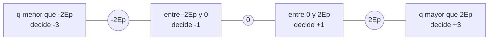
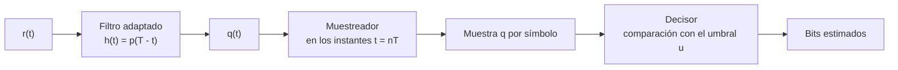

Una transmisión digital no envía la forma de onda del mensaje sino una secuencia de
símbolos tomados de un alfabeto finito. Esa restricción es la que permite regenerar la
señal en cada tramo del enlace, proteger la información con códigos y expresar las
prestaciones del sistema con una única cifra, la probabilidad de que un bit llegue
equivocado. Este capítulo recorre el camino completo, desde el codificador de símbolos
hasta el decisor, y cuantifica el precio en energía y en ancho de banda de cada elección
de constelación.

## Introducción

Una **modulación digital** asigna a cada bloque de bits una forma de onda de entre un
conjunto finito. El receptor no reconstruye esa forma de onda sino que decide cuál de
las posibles se envió, de modo que la calidad del enlace no se mide con una relación
señal-ruido a la salida del demodulador sino con la frecuencia con que esa decisión
falla.

La ventaja decisiva frente a una transmisión analógica es la regeneración. Un repetidor
digital recupera los símbolos, los vuelve a generar limpios y elimina el ruido acumulado
hasta ese punto, mientras que un repetidor analógico amplifica señal y ruido por igual.
A esa propiedad se suman la posibilidad de codificar la información para detectar y
corregir errores, de cifrarla, de multiplexar flujos heterogéneos sobre el mismo medio y
de abstraer el enlace como un simple transporte de bits. El precio es la conversión
previa de la señal a formato digital y la necesidad de mantener sincronizados transmisor
y receptor, dos bloques que no existen en un sistema analógico.

El capítulo se organiza en tres niveles: el modelo del sistema, común a cualquier
modulación digital, las señales PAM en banda base, que permiten derivar de forma cerrada
la probabilidad de error, y las modulaciones paso banda, que trasladan esas mismas
constelaciones en torno a una portadora.

## Modelo del sistema de transmisión digital

El modelo de referencia consta de un transmisor que convierte bits en una señal
eléctrica, un canal que la atenúa y le añade ruido, y un receptor que recupera los bits.
La cadena completa es la siguiente.


### Codificador de símbolos, modulador y decisor

El **codificador de símbolos** agrupa los bits de entrada en bloques y asigna a cada
bloque un símbolo $a\lbrack n \rbrack$ tomado de un alfabeto de $M$ valores, la
**constelación** transmitida. El **modulador** convierte esa secuencia discreta en una
señal continua, asociando a cada símbolo una forma de onda que se emite durante un
intervalo de duración $T$, el **período de símbolo**. El canal entrega al receptor una
versión atenuada de esa señal con ruido añadido. El **demodulador** procesa la señal
recibida y produce una muestra por símbolo, $q\lbrack n \rbrack$, y el **decisor**
compara esa muestra con uno o varios umbrales para declarar qué símbolo se envió y, a
partir de él, qué bits lo originaron.

El análisis se apoya en cuatro hipótesis que simplifican el tratamiento sin restar
generalidad al resultado:

- **Símbolos equiprobables**: Cada símbolo se transmite con probabilidad $1/M$,
  situación que corresponde a una fuente cuya salida no presenta redundancia.
- **Símbolos independientes**: El símbolo emitido en un intervalo no depende de los
  anteriores, de modo que el sistema es sin memoria y el análisis de un intervalo se
  extiende a todos los demás.
- **Pulso de energía finita y confinado**: La forma de onda básica $p(t)$ es nula fuera
  del intervalo $\lbrack 0, T \rbrack$, lo que evita que un símbolo interfiera con el
  siguiente.
- **Ruido blanco gaussiano aditivo**: El canal se modela como la suma de la señal y un
  proceso de ruido, sin distorsión lineal adicional.

La magnitud que resume las prestaciones es la **probabilidad de error de símbolo**,

$$
P_e = P\lbrace \hat{a} \neq a \rbrace
$$

donde $a$ es el símbolo transmitido y $\hat{a}$ el decidido. Cuando la constelación
transporta más de un bit por símbolo conviene distinguirla de la **probabilidad de error
de bit** $P_b$, también llamada tasa de error de bit, que cuenta bits equivocados en
lugar de símbolos equivocados. Un único símbolo mal decidido puede arrastrar varios bits
erróneos, por lo que ambas magnitudes coinciden solo en el caso binario.

### Tamaño de la modulación y régimen binario

El **tamaño de la modulación** $M$ es el número de símbolos de la constelación y se
elige siempre como potencia de dos,

$$
M = 2^{k}
$$

donde $k = \log_2 M$ es el número de bits que transporta cada símbolo. Esa relación
vincula el período de símbolo con el **período de bit** $T_b$,

$$
T = k \, T_b = T_b \log_2 M
$$

de modo que el **régimen binario**, el número de bits transmitidos por unidad de tiempo,
vale

$$
R_b = \frac{1}{T_b} = \frac{\log_2 M}{T}
$$

Junto a él se define la **velocidad de símbolo** $R_s = 1/T$, medida en baudios, que
cuenta símbolos por segundo en lugar de bits por segundo. Ambas se relacionan mediante
$R_b = k R_s$ y su distinción es esencial, porque el ancho de banda que ocupa la señal
lo fija la velocidad de símbolo mientras que la información transportada la fija el
régimen binario.

La expresión anterior muestra las dos vías para elevar el régimen binario. La primera es
acortar el período de símbolo, lo que ensancha el espectro. La segunda es aumentar el
tamaño de la constelación, que multiplica el régimen por $\log_2 M$ sin tocar el ancho
de banda. Esta segunda vía no es gratuita: a igualdad de potencia transmitida, añadir
símbolos al alfabeto los acerca entre sí y basta un ruido menor para confundir unos con
otros. Una constelación de 1024 símbolos transporta diez bits por símbolo, pero exige
una relación señal-ruido muy superior a la de una binaria para la misma probabilidad de
error.

### Canal AWGN

El canal se modela como una atenuación de amplitud seguida de la suma de ruido blanco
gaussiano aditivo,

$$
r(t) = c \, x(t) + w(t)
$$

donde $x(t)$ es la señal transmitida, $c$ el factor de amplitud del canal, menor que la
unidad en un enlace real, y $w(t)$ el ruido. La densidad espectral de potencia del ruido
es constante y se expresa de forma bilateral como

$$
S_W(f) = \frac{N_0}{2}
$$

donde $N_0$ es la densidad espectral de potencia unilateral, en vatios por hercio. Las
propiedades del modelo, su carácter blanco, gaussiano, estacionario y ergódico, junto
con el efecto del filtrado sobre la potencia de ruido, se desarrollan en
[señales aleatorias y ruido](../01_senales/section_2_senales_aleatorias_y_ruido.md),
donde la constante de la densidad espectral se denota $K$. La notación $N_0/2$ empleada
aquí es la habitual en transmisión digital y designa esa misma constante.

En lo que sigue se toma $c = 1$ salvo indicación contraria, lo que equivale a referir
todas las energías al punto de recepción. El efecto de la atenuación es multiplicar por
$c^2$ la energía que llega al receptor y degradar en esa misma proporción la relación
entre energía de bit y densidad de ruido.

## Señales PAM

La **modulación por amplitud de pulsos**, designada por sus siglas inglesas PAM, de
_pulse amplitude modulation_, deposita la información en la amplitud de los pulsos que
se emiten cada período de símbolo. La señal modulada es la suma de réplicas desplazadas
de una única forma de onda,

$$
x(t) = \sum_{n} a\lbrack n \rbrack \, p(t - nT)
$$

donde $a\lbrack n \rbrack$ es el símbolo del intervalo $n$ y $p(t)$ la forma de pulso,
común a todos los símbolos. Toda la información viaja en el factor de escala, no en la
forma. Esa separación entre amplitud y forma es la que permite estudiar por separado la
constelación, que fija las prestaciones frente al ruido, y el pulso, que fija el
espectro ocupado.

### Modulación 2PAM

El caso binario asigna a cada bit un símbolo de un alfabeto de dos valores. La
asignación **antipodal** hace corresponder el bit $0$ con el símbolo $-1$ y el bit $1$
con el símbolo $+1$, de modo que las dos formas de onda son opuestas, $x(t) = \pm p(t)$.

Con un pulso rectangular de amplitud $V$ y duración $T$, la señal transmitida consiste
en un nivel $+V$ durante los intervalos en que se envía un uno y un nivel $-V$ en los
que se envía un cero. Las dos formas de onda tienen la misma energía,

$$
E_1 = E_2 = V^2 T
$$

resultado de integrar el cuadrado de la amplitud a lo largo del período de símbolo. Esa
cantidad es la **energía de pulso** $E_p$, y en el caso binario antipodal coincide con
la energía por bit. La constelación es unidimensional y se representa como dos puntos
sobre un eje, simétricos respecto del origen y separados por una distancia $2$ en
unidades de amplitud normalizada.

### Modulación 4PAM y caso M-ario

Con cuatro amplitudes cada símbolo transporta dos bits, de modo que $k = 2$ y $T = 2
T_b$. La constelación habitual es el conjunto de niveles impares simétricos respecto del
origen,

$$
a \in \lbrace -3, -1, +1, +3 \rbrace
$$

y la correspondencia entre pares de bits y niveles es la que recoge la tabla siguiente.

| Bits | Símbolo | Nivel emitido |
| ---- | ------- | ------------- |
| `00` | $-3$    | $-3V$         |
| `01` | $-1$    | $-V$          |
| `10` | $+1$    | $+V$          |
| `11` | $+3$    | $+3V$         |

La generalización a un alfabeto de $M$ niveles conserva el mismo patrón. Los símbolos
son

$$
a_i = 2i - 1 - M, \quad i = 1, 2, \ldots, M
$$

expresión que para $M = 2$ devuelve $\lbrace -1, +1 \rbrace$ y para $M = 4$ el conjunto
anterior. Todos los niveles están separados por la misma distancia, dos unidades de
amplitud normalizada, y el conjunto es simétrico respecto del origen, con lo que el
valor medio de los símbolos es nulo si son equiprobables. Esa nulidad tiene una
consecuencia espectral que se examina más adelante, la ausencia de componente continua.

### Constelaciones y distancia entre símbolos

La **constelación** es el conjunto de puntos que representan los símbolos en el espacio
de señal, unidimensional en una modulación PAM. Lo que determina la robustez frente al
ruido no es la posición absoluta de los puntos sino la **distancia mínima** $d_{\min}$
entre los dos más próximos, porque el decisor solo se equivoca cuando el ruido desplaza
la muestra recibida más allá de la frontera que separa dos regiones vecinas.

La relación entre distancia y potencia es directa y constituye el compromiso central del
diseño de una constelación. Alejar los puntos entre sí reduce la probabilidad de error,
pero eleva la potencia media transmitida, proporcional al valor cuadrático medio de los
símbolos. Reducir la potencia acerca los puntos y hace que cualquier perturbación baste
para confundirlos. El criterio consiste en maximizar la separación entre símbolos para
una potencia media dada, que es lo que consigue el reparto uniforme de niveles
equiespaciados y simétricos.

El decisor divide el eje en $M$ regiones separadas por umbrales situados a mitad de
camino entre puntos consecutivos. Para una constelación de cuatro niveles el reparto es
el siguiente, expresado en función de la energía de pulso $E_p$, que es la escala en que
aparecen los símbolos a la entrada del decisor.



Las dos regiones de los extremos son semiinfinitas y las interiores tienen anchura
finita, de modo que un símbolo interior está expuesto a error por ambos lados y un
símbolo extremo solo por uno. El número medio de fronteras a que se asoma un símbolo
vale $2(M-1)/M$, cantidad que aparece como factor en la probabilidad de error de una
constelación M-aria.

El diseño abarca también la asignación de bits a puntos. Cuando el ruido provoca un
error, el símbolo decidido es casi siempre uno de los vecinos inmediatos, por lo que
conviene que las etiquetas de dos puntos adyacentes difieran en un solo bit. Con esa
asignación un error de símbolo se traduce en un único bit equivocado y la probabilidad
de error de bit resulta aproximadamente la de símbolo dividida por $k$, mientras que una
asignación descuidada hace que un error entre vecinos arrastre varios bits a la vez.

### Energía de símbolo y energía de bit

La **energía de pulso** es la energía de la forma de onda básica,

$$
E_p = \int_{-\infty}^{\infty} p^2(t) \, dt
$$

que para un pulso rectangular de amplitud $V$ y duración $T$ vale $E_p = V^2 T$. La
energía de la forma de onda asociada a un símbolo concreto es $a_i^2 E_p$, ya que el
símbolo escala la amplitud del pulso. Promediando sobre la constelación con símbolos
equiprobables se obtiene la **energía media de símbolo**,

$$
E_s = \frac{1}{M} \sum_{i=1}^{M} a_i^2 \, E_p
$$

y sustituyendo los niveles equiespaciados resulta una expresión cerrada,

$$
E_s = \frac{M^2 - 1}{3} \, E_p
$$

donde $M$ es el tamaño de la constelación y $E_p$ la energía del pulso. La **energía
media de bit** reparte la energía del símbolo entre los bits que transporta,

$$
E_b = \frac{E_s}{k} = \frac{E_s}{\log_2 M}
$$

Ambas magnitudes se relacionan con la potencia media transmitida a través del período de
símbolo, $P_s = E_s / T$, lo que permite pasar de una especificación de potencia,
habitual en el diseño de un transmisor, a una de energía, que es la que aparece en las
expresiones de probabilidad de error. La distinción entre energía de símbolo y energía
de bit es la fuente de confusión más frecuente al comparar modulaciones: dos
constelaciones de tamaño distinto que transmiten con la misma potencia tienen la misma
energía de símbolo pero energías de bit diferentes, y es la energía de bit la que debe
igualarse para que la comparación sea justa.

???+ example "Energía media de símbolo de una constelación de cuatro niveles"

    Un transmisor emplea una constelación de cuatro niveles con pulso rectangular de
    amplitud $V = 1$ V y transporta un régimen binario de $R_b = 10$ kbit/s, con los
    cuatro símbolos equiprobables.

    Cada símbolo transporta $k = \log_2 4 = 2$ bits, de modo que el período de bit vale
    $T_b = 1 / R_b = 0{,}1$ ms y el período de símbolo lo duplica, $T = 0{,}2$ ms. La
    velocidad de símbolo resulta $R_s = 5$ kbaudios, la mitad del régimen binario, y la
    energía del pulso rectangular vale

    $$
    E_p = V^2 T = 2 \cdot 10^{-4} \; \text{V}^2\text{s}
    $$

    La energía media de símbolo se obtiene promediando los cuadrados de los cuatro
    niveles,

    $$
    E_s = \frac{(-3)^2 + (-1)^2 + (+1)^2 + (+3)^2}{4} \, E_p = 5 E_p
    = 10^{-3} \; \text{V}^2\text{s}
    $$

    resultado que coincide con la expresión general $(M^2 - 1)/3 = 5$ para $M = 4$. La
    energía media de bit es la mitad, $E_b = 5 \cdot 10^{-4}$ V²s, porque cada símbolo
    transporta dos bits. Emplear la energía de símbolo donde corresponde la de bit
    sobreestimaría en $3$ dB la calidad del enlace.

## Recepción óptima

El receptor de un sistema digital no persigue reproducir la señal transmitida sino
maximizar la fiabilidad de una decisión. Esa diferencia de objetivo conduce a una
estructura muy concreta, un filtro seguido de un muestreador y un umbral, que es óptima
para el canal AWGN en el sentido de minimizar la probabilidad de error.



### Filtro adaptado

La cuestión que resuelve el receptor es cuantificar el parecido entre la señal recibida
y cada una de las formas de onda posibles. La medida natural de ese parecido es la
correlación, y su complemento es el error cuadrático integrado entre ambas señales. Dos
señales idénticas presentan correlación normalizada unidad, mientras que dos señales
cuya correlación es nula se denominan **ortogonales** y no se confunden entre sí. El
producto escalar de una señal consigo misma es máximo, y ese máximo es su energía.

El bloque que calcula esa correlación es el **filtro adaptado**, cuya respuesta
impulsiva es la forma de pulso invertida y desplazada,

$$
h(t) = p(T - t)
$$

Para un pulso rectangular, el filtro adaptado vuelve a ser rectangular, ya que la
inversión temporal de un rectángulo es el mismo rectángulo. La salida del filtro es la
convolución de la señal recibida con esa respuesta, que en ausencia de ruido y con $c=1$
reproduce la función de autocorrelación del pulso desplazada al instante $T$,

$$
q(t) = \pm R_p(t - T)
$$

donde $R_p$ es la autocorrelación de $p(t)$. Esa función alcanza su máximo en el origen,
por lo que la salida presenta un máximo en $t = T$ cuyo valor es la energía del pulso.
Al muestrear en ese instante se obtiene

$$
q = q(T) = \pm E_p
$$

con el signo que corresponde al símbolo transmitido. El muestreador reduce así la señal
continua a una única cifra por símbolo, la **muestra de decisión**.

La razón por la que este filtro es óptimo está en el efecto que tiene sobre el ruido. La
potencia de ruido a la salida se obtiene integrando la densidad espectral del ruido
filtrado,

$$
P_N = \int_{-\infty}^{\infty} \frac{N_0}{2}
\lvert H(f) \rvert^2 \, df = \frac{N_0}{2} E_p
$$

igualdad que se sigue de que el módulo de la respuesta en frecuencia del filtro adaptado
coincide con el de la transformada del pulso, de modo que la integral de su cuadrado es
la energía del pulso. La muestra de decisión es por tanto una variable gaussiana,

$$
q = \pm E_p + n, \quad n \sim \mathcal{N}\!\left(0, \frac{N_0}{2} E_p\right)
$$

donde $n$ es la muestra de ruido a la salida del filtro. La señal útil crece con $E_p$
mientras que la desviación típica del ruido crece solo con $\sqrt{E_p}$, y de esa
asimetría procede la mejora: ninguna otra respuesta impulsiva consigue una relación
mayor entre el valor de la muestra útil y la dispersión del ruido en el instante de
decisión. Una consecuencia notable es que la relación señal-ruido en el decisor depende
de la energía del pulso y no de su forma, resultado que separa el diseño frente al ruido
del diseño frente al ancho de banda disponible.

La cadena completa se simula con unas pocas líneas. El código siguiente genera bits
equiprobables, los codifica en símbolos antipodales, construye la señal muestreada con
pulso rectangular, le añade ruido gaussiano de densidad espectral conocida y aplica el
filtro adaptado, el muestreador y el decisor.

```python linenums="1"
import numpy as np


def filtra_y_muestrea(
    recibida: np.ndarray,
    muestras_por_simbolo: int,
    periodo_muestreo: float,
    amplitud: float,
) -> np.ndarray:
    """Aplica el filtro adaptado y muestrea en los instantes de decisión.

    Args:
        recibida: Vector de muestras de la señal a la entrada del receptor.
        muestras_por_simbolo: Muestras que ocupa cada período de símbolo.
        periodo_muestreo: Separación entre muestras, en segundos.
        amplitud: Amplitud del pulso rectangular, en voltios.

    Returns:
        Vector con una muestra por símbolo a la entrada del decisor.
    """
    # El filtro adaptado a un pulso rectangular vuelve a ser rectangular
    respuesta = amplitud * np.ones(muestras_por_simbolo)
    tramos = recibida.reshape(-1, muestras_por_simbolo)
    # Correlacionar con el pulso equivale a integrar sobre el período
    return periodo_muestreo * (tramos @ respuesta)


frecuencia_muestreo = 200e3
periodo_muestreo = 1.0 / frecuencia_muestreo
periodo_simbolo = 1e-3
muestras_por_simbolo = int(periodo_simbolo / periodo_muestreo)
amplitud = 1.0
num_simbolos = 100_000
energia_pulso = amplitud**2 * periodo_simbolo
# Nivel de ruido elegido para una relación Eb/N0 de 6 dB
densidad_ruido_mitad = energia_pulso / 8.0

generador = np.random.default_rng(seed=0)
bits = generador.integers(0, 2, num_simbolos)
# La codificación antipodal traslada los bits al alfabeto {-1, +1}
simbolos = 2.0 * bits - 1.0
# Cada símbolo escala un pulso rectangular de duración igual al período
pulso = amplitud * np.ones(muestras_por_simbolo)
transmitida = np.outer(simbolos, pulso).ravel()
# Un ruido blanco de densidad N0/2 se muestrea con esta desviación típica
desviacion_ruido = np.sqrt(densidad_ruido_mitad * frecuencia_muestreo)
recibida = transmitida + generador.normal(0.0, desviacion_ruido, transmitida.size)
decision = filtra_y_muestrea(
    recibida, muestras_por_simbolo, periodo_muestreo, amplitud
)
bits_estimados = (decision > 0.0).astype(int)
errores = np.count_nonzero(bits != bits_estimados)
relacion = energia_pulso / (2.0 * densidad_ruido_mitad)
desviacion_estimada = np.std(decision - simbolos * energia_pulso)
desviacion_teorica = np.sqrt(densidad_ruido_mitad * energia_pulso)
print(f"Energía de pulso: {energia_pulso:.2e} V^2 s")
print(f"Valor medio de |q|: {np.mean(np.abs(decision)):.2e}")
print(f"Desviación de la muestra de ruido: {desviacion_estimada:.2e}")
print(f"Desviación teórica: {desviacion_teorica:.2e}")
print(f"Relación Eb/N0: {10 * np.log10(relacion):.1f} dB")
print(f"Bits erróneos: {errores} de {num_simbolos}")
```

```plaintext title="Expected output"
Energía de pulso: 1.00e-03 V^2 s
Valor medio de |q|: 1.00e-03
Desviación de la muestra de ruido: 3.52e-04
Desviación teórica: 3.54e-04
Relación Eb/N0: 6.0 dB
Bits erróneos: 247 de 100000
```

Las cifras confirman el modelo. El valor medio del módulo de la muestra de decisión
coincide con la energía de pulso, la dispersión del ruido a la salida del filtro
reproduce la desviación típica $\sqrt{N_0 E_p / 2}$ y la fracción de bits erróneos queda
en el orden que predice la teoría para esa relación entre energía de bit y densidad de
ruido.

### Umbral de decisión

El decisor compara la muestra con un umbral $u$ y declara el símbolo cuya región la
contiene. Para una constelación binaria antipodal, en la que los dos valores posibles
son $+E_p$ y $-E_p$, la simetría del problema y la equiprobabilidad de los símbolos
sitúan el umbral óptimo en el punto medio, $u = 0$, y la regla de decisión se reduce al
signo de la muestra: se declara un uno si $q > 0$ y un cero si $q < 0$.

El umbral óptimo es el punto medio solo porque las dos alternativas son simétricas y
equiprobables. En cuanto la constelación deja de ser simétrica respecto del origen el
umbral se desplaza, y mantenerlo en cero degrada las prestaciones de forma drástica. La
generalización a $M$ niveles conserva el criterio del punto medio entre vecinos, lo que
produce los $M-1$ umbrales interiores de la figura anterior.

???+ example "Reajuste del umbral al pasar a una constelación unipolar"

    Un sistema binario se modifica para que sus símbolos tomen los valores
    $\lbrace 0, +1 \rbrace$ en lugar de $\lbrace -1, +1 \rbrace$, de modo que el bit
    cero se transmite como ausencia de pulso. El modulador, el canal y el filtro
    adaptado se mantienen sin cambios.

    Con el decisor original, que compara con el umbral nulo, la fracción de bits
    erróneos se aproxima a la mitad. Las dos muestras posibles a la entrada del decisor
    valen ahora $0$ y $E_p$, ambas no negativas, con lo que el umbral nulo declara un
    uno prácticamente siempre y acierta solo en los bits que efectivamente lo eran. El
    decisor no está roto: está diseñado para otra constelación.

    El umbral correcto es el punto medio entre los dos valores posibles, $u = E_p / 2$,
    que puede estimarse en recepción como el valor medio de la señal de entrada al
    decisor, ya que con símbolos equiprobables ese promedio tiende a $E_p / 2$.
    Restaurado el umbral, el sistema vuelve a funcionar, aunque con una penalización
    permanente: la distancia entre los dos puntos es ahora $E_p$ en lugar de $2E_p$,
    mientras que la energía media de bit se ha reducido solo a la mitad, lo que se
    traduce en una pérdida de $3$ dB frente a la asignación antipodal. El decisor forma
    parte del diseño de la modulación y no es un bloque genérico reutilizable.

### Probabilidad de error de bit

El cálculo de la probabilidad de error parte de la estadística de la muestra de
decisión. Cuando se transmite el bit cero, la muestra vale $q = -E_p + n$ y el decisor
se equivoca si esa muestra resulta positiva, lo que exige que el ruido supere la
distancia al umbral,

$$
P(e \mid b = 0) = P\lbrace q > 0 \rbrace = P\lbrace n > E_p \rbrace
$$

El ruido es una variable gaussiana de media nula y varianza $\sigma_n^2 = N_0 E_p / 2$,
por lo que la probabilidad de cola se expresa con la función Q definida en
[señales aleatorias y ruido](../01_senales/section_2_senales_aleatorias_y_ruido.md),

$$
P(e \mid b = 0) = Q\!\left(\frac{E_p}{\sigma_n}\right)
= Q\!\left(\frac{E_p}{\sqrt{N_0 E_p / 2}}\right)
= Q\!\left(\sqrt{\frac{2 E_p}{N_0}}\right)
$$

La simetría de la constelación hace que la probabilidad condicionada al bit uno valga lo
mismo, y al promediar con símbolos equiprobables, sustituyendo $E_p = E_b$, que es la
identidad válida en este caso, se obtiene

$$
P_b = Q\!\left(\sqrt{\frac{2 E_b}{N_0}}\right)
$$

donde $E_b$ es la energía media de bit y $N_0$ la densidad espectral de potencia
unilateral del ruido. Esta expresión es el resultado de referencia de la transmisión
digital. Su argumento depende de un único parámetro adimensional, el cociente $E_b/N_0$,
que sustituye a la relación señal-ruido como figura de mérito de un enlace digital
porque no depende ni del ancho de banda del receptor ni del régimen binario. El descenso
de $P_b$ con ese cociente es muy acusado: la probabilidad de error cae varios órdenes de
magnitud en unos pocos decibelios, y por encima de $12$ dB queda por debajo de
$10^{-8}$.

La forma general del resultado admite una lectura geométrica extensible a cualquier
constelación. La probabilidad de confundir dos símbolos vecinos es la de que el ruido
recorra la mitad de la distancia que los separa,

$$
P \approx \frac{2(M-1)}{M} \, Q\!\left(\frac{d_{\min}}{2 \sigma_n}\right)
$$

donde $d_{\min}$ es la distancia mínima entre puntos de la constelación medida a la
entrada del decisor, $\sigma_n$ la desviación típica del ruido en ese punto y el factor
que precede a la función Q el número medio de vecinos. Para el caso binario antipodal
$d_{\min} = 2E_p$, el factor de vecinos vale la unidad y la expresión reproduce el
resultado exacto anterior.

???+ example "Probabilidad de error de un enlace binario de 64 kbit/s"

    Un enlace transmite a $R_b = 64$ kbit/s con una modulación binaria antipodal de
    pulso rectangular y amplitud $V = 1$ V. El ruido del canal tiene una densidad
    espectral de potencia bilateral $N_0/2 = 10^{-6}$ W/Hz.

    Con modulación binaria el período de símbolo coincide con el de bit,
    $T = T_b = 15{,}6\ \mu$s, y la energía por bit es la del pulso rectangular,

    $$
    E_b = E_p = V^2 T_b = 1{,}5625 \cdot 10^{-5} \; \text{V}^2\text{s}
    $$

    La densidad espectral unilateral vale $N_0 = 2 \cdot 10^{-6}$ W/Hz, de modo que el
    cociente resulta $E_b/N_0 = 7{,}81$, equivalente a $8{,}9$ dB, y la probabilidad de
    error vale

    $$
    P_b = Q\!\left(\sqrt{2 \cdot 7{,}81}\right) = Q(3{,}95) \approx 3{,}9 \cdot 10^{-5}
    $$

    es decir, unos cuatro bits erróneos por cada cien mil transmitidos. Duplicar la
    amplitud del pulso multiplicaría la energía por bit por cuatro, elevaría el cociente
    a $14{,}9$ dB y situaría la probabilidad de error en el orden de $10^{-15}$, mejora
    de diez órdenes de magnitud a cambio de $6$ dB de potencia.

La expresión teórica se contrasta con una estimación por simulación. El código siguiente
emplea el modelo discreto equivalente del sistema, en el que el filtro adaptado y el
muestreador se resumen en una única muestra gaussiana por símbolo, y estima la tasa de
error contando bits equivocados sobre cuatro millones de realizaciones por punto, número
suficiente para que las dos primeras cifras significativas sean estables en todo el
margen considerado.

```python linenums="1"
import math

import numpy as np


def funcion_q(argumento: float) -> float:
    """Evalúa la función Q en un punto.

    Args:
        argumento: Umbral normalizado en el que se evalúa la cola.

    Returns:
        Probabilidad de que una gaussiana normalizada supere el umbral.
    """
    return 0.5 * math.erfc(argumento / math.sqrt(2.0))


def simula_tasa_error(
    relacion_db: float, num_bits: int, generador: np.random.Generator
) -> float:
    """Estima por Montecarlo la tasa de error de un sistema binario antipodal.

    Args:
        relacion_db: Cociente entre energía de bit y densidad de ruido, en dB.
        num_bits: Número de bits simulados.
        generador: Generador de números aleatorios.

    Returns:
        Fracción de bits recibidos erróneamente.
    """
    energia_bit = 1.0
    densidad_ruido = energia_bit / 10.0 ** (relacion_db / 10.0)
    # El modelo discreto equivalente entrega al decisor q = ±sqrt(Eb) + n
    desviacion = math.sqrt(densidad_ruido * energia_bit / 2.0)
    bits = generador.integers(0, 2, num_bits)
    muestras = (2.0 * bits - 1.0) * math.sqrt(energia_bit)
    muestras += generador.normal(0.0, desviacion, num_bits)
    return np.count_nonzero((muestras > 0.0) != (bits == 1)) / num_bits


# Número de bits por punto de la curva, fijado para que la estimación sea estable
num_bits = 4_000_000
generador = np.random.default_rng(seed=1)
print("Eb/N0 (dB)  Pb simulada  Pb teórica")
for relacion_db in (0.0, 2.0, 4.0, 6.0, 8.0):
    estimada = simula_tasa_error(relacion_db, num_bits, generador)
    teorica = funcion_q(math.sqrt(2.0 * 10.0 ** (relacion_db / 10.0)))
    print(f"{relacion_db:10.0f}  {estimada:11.2e}  {teorica:10.2e}")
```

```plaintext title="Expected output"
Eb/N0 (dB)  Pb simulada  Pb teórica
         0     7.89e-02    7.86e-02
         2     3.76e-02    3.75e-02
         4     1.25e-02    1.25e-02
         6     2.37e-03    2.39e-03
         8     2.00e-04    1.91e-04
```

El acuerdo entre ambas columnas es completo en los primeros puntos y se degrada
ligeramente en el último, donde apenas ocho centenares de errores contribuyen a la
estimación y la dispersión relativa del contaje ronda el cuatro por ciento. Ese
comportamiento es inherente al método: estimar una probabilidad de error pequeña exige
un número de realizaciones inversamente proporcional a ella, razón por la que las curvas
medidas rara vez descienden por debajo de $10^{-6}$ sin recurrir a técnicas de
simulación acelerada.

## Códigos de línea

La constelación fija los valores que toman los símbolos, pero no la forma de onda
concreta con que se representan sobre el medio. Esa elección constituye el **código de
línea**, y determina el espectro de la señal transmitida, la facilidad con que el
receptor recupera el reloj de símbolo y la posibilidad de detectar errores sin añadir
redundancia explícita.

### NRZ polar y unipolar

El código más sencillo es el **NRZ polar**, de _non return to zero_, que mantiene un
nivel constante durante todo el período de símbolo y emplea niveles opuestos para los
dos bits. Es la asignación antipodal analizada hasta aquí, y su interés radica en que
maximiza la distancia entre puntos para una energía media dada. El nivel no vuelve a
cero entre símbolos consecutivos, de donde procede su nombre.

El **NRZ unipolar** sustituye el nivel negativo por la ausencia de señal, con lo que la
constelación pasa a ser $\lbrace 0, V \rbrace$. Transmitir un cero no consume energía,
de modo que la energía media de bit se reduce a la mitad respecto del caso polar, pero
la distancia entre los dos puntos también se reduce a la mitad. El balance es
desfavorable y la penalización neta es de $3$ dB, como se comprueba comparando los
argumentos de la función Q en ambos casos. A cambio, el transmisor es más simple, porque
no necesita generar dos polaridades.

Una tercera familia introduce deliberadamente un tercer nivel. La **inversión alternada
de marcas**, conocida por sus siglas inglesas AMI, representa los ceros con nivel nulo y
los unos alternando entre nivel positivo y negativo. La alternancia no transporta
información adicional, pero su violación delata un error de transmisión, de modo que el
receptor detecta anomalías sin necesidad de un código corrector.

### Código Manchester

El **código Manchester** sigue una estrategia distinta a las anteriores: en lugar de
asignar a cada bit un nivel constante durante todo el período de símbolo, codifica el
bit en el sentido de una transición situada a mitad de ese período. Una transición de
nivel bajo a nivel alto representa un valor de bit y la transición opuesta, de nivel
alto a nivel bajo, representa el otro, de modo que cada intervalo de bit contiene
siempre exactamente una transición central, con independencia de la secuencia de bits
transmitida.

Esa transición garantizada es la propiedad que hace del código Manchester un esquema
**autosincronizante**: el receptor extrae el reloj de símbolo directamente de la propia
señal, sin necesidad de un canal ni de una secuencia de referencia adicional, porque
nunca se da una racha de nivel constante que supere la mitad del período de bit. Frente
a NRZ polar o unipolar, donde una racha larga de unos o de ceros deja al receptor sin
transiciones de las que extraer el reloj, Manchester resuelve ese problema de raíz al
precio de duplicar el número de transiciones por bit transmitido.

Ese precio se traduce directamente en ancho de banda: al insertar una transición
adicional dentro de cada período de bit, el pulso efectivo que compone la señal se
acorta a la mitad de su duración, lo que según la relación entre duración de pulso y
anchura espectral descrita más adelante en este capítulo duplica el ancho de banda
ocupado respecto de un código NRZ con el mismo régimen binario. A cambio de ese coste
espectral, el código Manchester no acumula componente continua para ninguna secuencia de
bits, porque cada intervalo aporta la misma cantidad de nivel alto que de nivel bajo,
con independencia del bit transmitido. Esta combinación de autosincronización y ausencia
de componente continua, pagada con el doble de ancho de banda, explica su adopción como
código de línea de referencia en las primeras versiones de Ethernet sobre cable coaxial.

### Propiedades buscadas: componente continua, sincronización y detección de errores

La elección de un código de línea responde a tres criterios que compiten entre sí.

- **Ausencia de componente continua**: Un código cuyo valor medio no es nulo concentra
  parte de la potencia en frecuencia cero. Esa componente no atraviesa los
  transformadores ni los acoplamientos capacitivos de los equipos de línea, y además se
  desperdicia, porque no contribuye a separar los símbolos entre sí. La asignación
  antipodal con símbolos equiprobables tiene valor medio nulo, mientras que la unipolar
  no.
- **Abundancia de transiciones**: El receptor extrae el reloj de símbolo de los cambios
  de nivel de la señal recibida. Una secuencia larga sin transiciones deja al oscilador
  local sin referencia y provoca la deriva del instante de muestreo, que desplaza el
  punto de decisión y degrada la probabilidad de error.
- **Capacidad de detección de errores**: Un código con redundancia estructural, como la
  alternancia de polaridad de la inversión alternada de marcas, permite reconocer
  secuencias imposibles y señalar la presencia de errores en el enlace.

Ningún código satisface los tres criterios de forma óptima a la vez, y la elección
depende del medio. Un enlace de cobre con acoplamiento por transformador prioriza la
ausencia de componente continua, mientras que un enlace donde la sincronización es el
punto crítico prefiere garantizar transiciones aunque cueste espectro.

## Densidad espectral de una señal PAM

La señal PAM es un proceso aleatorio, porque los símbolos que la componen lo son, y por
tanto se caracteriza en frecuencia mediante su densidad espectral de potencia. Para
símbolos equiprobables, independientes entre sí y de valor medio nulo, esa densidad
resulta

$$
S_X(f) = \frac{1}{T} \lvert P(f) \rvert^2
$$

donde $P(f)$ es la transformada de Fourier de la forma de pulso y $T$ el período de
símbolo. El resultado es notable por lo que no contiene: la secuencia concreta de
símbolos no aparece, solo su estadística. Toda la dependencia con la frecuencia procede
del pulso, y el período de símbolo actúa como factor de escala. Si los símbolos tuvieran
valor medio no nulo, como ocurre en una asignación unipolar, aparecerían además líneas
espectrales discretas, entre ellas una en frecuencia cero.

### Relación entre forma de pulso y espectro

Para el pulso rectangular de amplitud $V$ y duración $T$, el módulo de la transformada
es

$$
\lvert P(f) \rvert = V T \lvert \mathrm{sinc}(f T) \rvert
$$

con $\mathrm{sinc}(x) = \sin(\pi x) / (\pi x)$, y la densidad espectral de potencia
resulta

$$
S_X(f) = V^2 T \, \mathrm{sinc}^2(f T)
$$

Esta densidad presenta su máximo en frecuencia cero, con valor $V^2 T$, y ceros en todos
los múltiplos enteros de $1/T$. El lóbulo principal ocupa el intervalo entre $-1/T$ y
$1/T$, y los lóbulos secundarios decaen con el cuadrado de la frecuencia, de modo que
concentran una fracción pequeña de la potencia total. La potencia media de la señal se
obtiene integrando la densidad, o más directamente dividiendo la energía de un símbolo
por su duración,

$$
P_X = \frac{E_s}{T} = V^2
$$

resultado inmediato para una señal que permanece siempre en $\pm V$.

La relación entre duración del pulso y anchura del espectro es inversa: un pulso
estrecho en el tiempo tiene una transformada ancha en frecuencia, y viceversa. Esa
reciprocidad convierte la elección de $T$ en un compromiso, porque el período de símbolo
gobierna a la vez la velocidad de transmisión y el ancho de banda ocupado.

### Compromiso entre velocidad y ancho de banda

El resultado obtenido al analizar el filtro adaptado establece que la relación
señal-ruido en el decisor depende de la energía del pulso y no de su forma. La forma, en
cambio, es lo único que determina el espectro. De esa separación de competencias se
sigue el compromiso fundamental del diseño de una modulación digital.

Acortar el pulso eleva la velocidad de símbolo y, con ella, el régimen binario, pero
ensancha el espectro en la misma proporción. Alargarlo permite acumular más energía por
símbolo, y por tanto mejorar las prestaciones frente al ruido, a costa de reducir la
velocidad. Tomando como medida del ancho de banda la anchura del lóbulo principal, una
señal PAM en banda base ocupa

$$
B = \frac{1}{T} = R_s
$$

de modo que el ancho de banda necesario iguala la velocidad de símbolo, no el régimen
binario. Ahí reside el valor de las constelaciones grandes: aumentar $M$ multiplica el
régimen binario por $\log_2 M$ sin alterar el ancho de banda, porque no cambia el
período de símbolo. El precio se paga en energía. La tabla siguiente aplica la expresión
anterior a cuatro constelaciones PAM con la misma energía por bit y un cociente
$E_b/N_0$ de $10$ dB, expresando la energía media de símbolo y la de bit en unidades de
energía de pulso.

| $M$ | $k$ | $E_s / E_p$ (en unidades de $E_p$) | $E_b / E_p$ (en unidades de $E_p$) | $P_e$                 |
| --- | --- | ---------------------------------- | ---------------------------------- | --------------------- |
| 2   | 1   | 1                                  | 1                                  | $3{,}9 \cdot 10^{-6}$ |
| 4   | 2   | 5                                  | 2,5                                | $3{,}5 \cdot 10^{-3}$ |
| 8   | 3   | 21                                 | 7                                  | $8{,}0 \cdot 10^{-2}$ |
| 16  | 4   | 85                                 | 21,25                              | $3{,}1 \cdot 10^{-1}$ |

Duplicar el número de bits por símbolo de uno a dos degrada la probabilidad de error en
tres órdenes de magnitud, y con dieciséis niveles el enlace deja de ser utilizable a esa
relación. Expresado en términos de potencia, mantener la misma probabilidad de error al
pasar de dos a cuatro niveles exige unos $4$ dB adicionales de energía por bit, y unos
$13$ dB al pasar a dieciséis. Esa es la moneda con que se paga la eficiencia espectral.

???+ example "Elección de constelación en un canal de banda limitada"

    Se dispone de un canal paso banda de $10$ MHz de ancho de banda y se desea
    transportar un régimen binario de $20$ Mbit/s.

    Una modulación paso banda con pulso rectangular ocupa el doble de ancho de banda que
    su equivalente en banda base, $B_T = 2 R_s$, porque el espectro se replica a ambos
    lados de la portadora. El canal admite por tanto una velocidad de símbolo
    $R_s = B_T / 2 = 5$ Mbaudios, y alcanzar $20$ Mbit/s exige transportar
    $k = R_b / R_s = 4$ bits por símbolo, es decir una constelación de $M = 16$ puntos.
    Una modulación binaria sobre el mismo canal quedaría limitada a $5$ Mbit/s.

    La penalización se estima a partir de la energía de pulso disponible para una
    energía de bit dada. Con dieciséis niveles equiespaciados esa energía es
    $3k/(M^2-1) = 0{,}047$ veces la energía de bit, frente a la igualdad que se da en el
    caso binario, de modo que alcanzar la misma probabilidad de error requiere unos $13$
    dB más de energía por bit. Cuadruplicar la eficiencia espectral cuesta, en este
    caso, un factor veinte en potencia transmitida.

## Modulaciones digitales paso banda

Un canal radio no transmite en banda base, de modo que la señal PAM debe trasladarse en
torno a una portadora. El procedimiento consiste en emplear como forma de pulso una
sinusoide truncada al período de símbolo,

$$
p(t) = V \cos(2 \pi f_c t + \phi), \quad 0 \leq t < T
$$

donde $f_c$ es la frecuencia de portadora y $\phi$ su fase. Habitualmente se elige $f_c
= k/T$ con $k$ entero, lo que hace que el pulso contenga un número entero de ciclos y
facilita la ortogonalidad entre símbolos consecutivos. La energía de este pulso vale
$E_p = V^2 T / 2$, la mitad de la del pulso rectangular de la misma amplitud, porque una
sinusoide entrega la mitad de la potencia de pico.

El espectro de la señal transmitida es el de la señal en banda base replicado en torno a
$\pm f_c$, lo que duplica el ancho de banda ocupado. Tomando de nuevo el lóbulo
principal,

$$
B_T = \frac{2}{T} = 2 R_s
$$

Una modulación paso banda dispone de tres atributos del pulso donde depositar la
información, la amplitud, la fase y la frecuencia, y de su uso por separado o combinado
surgen las cuatro familias siguientes.

### ASK y OOK

La **modulación por desplazamiento de amplitud**, designada por sus siglas inglesas ASK,
de _amplitude shift keying_, es la traslación directa de PAM a paso banda: la
constelación actúa sobre la amplitud de la portadora,

$$
x(t) = a \, V \cos(2 \pi f_c t)
$$

Vista desde el dominio analógico, equivale a una modulación de doble banda lateral cuya
señal moduladora es una señal PAM. Con la constelación binaria antipodal $\lbrace -1, +1
\rbrace$ el cambio de signo se manifiesta como una inversión de fase de la portadora, y
todas las expresiones de probabilidad de error obtenidas en banda base se aplican sin
modificación, sustituyendo la energía de pulso por la del pulso sinusoidal.

La variante **de conexión y desconexión**, conocida por sus siglas inglesas OOK, de _on
off keying_, emplea la constelación unipolar $\lbrace 0, 1 \rbrace$ y transmite
portadora durante los unos y silencio durante los ceros. Es la modulación digital más
simple de generar y de detectar, lo que explica su presencia en enlaces ópticos y en
mandos de radiofrecuencia de bajo coste, y arrastra la misma penalización de $3$ dB que
la asignación unipolar en banda base. La generalización a $M$ amplitudes produce las
modulaciones M-ASK, con el compromiso ya descrito entre eficiencia espectral y energía.

### PSK, BPSK y QPSK

La **modulación por desplazamiento de fase**, designada por sus siglas inglesas PSK, de
_phase shift keying_, mantiene la amplitud constante y deposita la información en la
fase de la portadora,

$$
x(t) = V \cos(2 \pi f_c t + \phi_i)
= \cos(\phi_i) V \cos(2 \pi f_c t) - \sin(\phi_i) V \sin(2 \pi f_c t)
$$

donde $\phi_i$ es la fase asociada al símbolo $i$. El desarrollo de la derecha revela la
estructura que subyace a todas las modulaciones paso banda: cualquier pulso de amplitud
y fase arbitrarias se descompone en dos componentes en cuadratura, una sobre un coseno y
otra sobre un seno, que el receptor separa por ser ortogonales entre sí.

La variante binaria, denominada BPSK, emplea las fases $\lbrace 0, \pi \rbrace$ y es
idéntica a la ASK binaria antipodal, ya que invertir la fase de una sinusoide equivale a
cambiar el signo de su amplitud. La variante en cuadratura, QPSK, emplea cuatro fases
equiespaciadas,

$$
\phi_i \in \left\lbrace \frac{\pi}{4}, \frac{3\pi}{4}, \frac{5\pi}{4},
\frac{7\pi}{4} \right\rbrace
$$

y transporta dos bits por símbolo situando los cuatro puntos en los vértices de un
cuadrado centrado en el origen del plano de componentes en fase y cuadratura. Cada
componente transporta uno de los dos bits, de modo que QPSK equivale a dos modulaciones
binarias independientes que comparten portadora y ancho de banda. Esa independencia
tiene una consecuencia de calado: QPSK duplica la eficiencia espectral de BPSK sin
penalización en energía por bit, resultado que no se cumple al aumentar el número de
niveles de una constelación unidimensional. La amplitud constante de la señal es la
segunda ventaja de esta familia, porque permite operar el amplificador de potencia cerca
de la saturación.

### QAM

La **modulación de amplitud en cuadratura**, designada por sus siglas inglesas QAM, de
_quadrature amplitude modulation_, emplea simultáneamente las dos componentes
ortogonales y modula la amplitud de cada una,

$$
x(t) = a_I V \cos(2 \pi f_c t) - a_Q V \sin(2 \pi f_c t)
$$

donde $a_I$ y $a_Q$ son los símbolos de la componente en fase y de la componente en
cuadratura. La constelación resultante es bidimensional, una retícula de puntos en el
plano, y esa segunda dimensión es lo que la hace más eficiente que una constelación PAM
del mismo tamaño: los puntos se reparten en un área en lugar de sobre una recta, con lo
que la distancia mínima disminuye más despacio al crecer $M$.

La constelación de cuatro puntos coincide con QPSK, ya que ambas sitúan los símbolos en
los vértices de un cuadrado. La de dieciséis puntos transporta cuatro bits por símbolo y
admite una lectura directa en términos de las modulaciones ya descritas.

???+ example "Descomposición de una constelación de dieciséis puntos"

    Una constelación cuadrada de dieciséis puntos transporta $k = \log_2 16 = 4$ bits
    por símbolo. La retícula resulta del producto de dos alfabetos de cuatro niveles,
    $\lbrace -3, -1, +1, +3 \rbrace$ sobre la componente en fase y el mismo conjunto
    sobre la componente en cuadratura, de modo que el símbolo se construye eligiendo una
    abscisa y una ordenada de forma independiente.

    Los dos primeros bits de cada bloque seleccionan el nivel de la componente en fase y
    los dos últimos el de la componente en cuadratura. La consecuencia práctica es que
    el receptor no necesita evaluar dieciséis hipótesis: basta con proyectar la muestra
    recibida sobre cada una de las dos componentes y aplicar por separado el decisor de
    cuatro niveles descrito en banda base, con sus tres umbrales.

    La probabilidad de error de símbolo se obtiene entonces del razonamiento binario
    aplicado dos veces. Si $P_r$ es la probabilidad de que falle la decisión sobre una
    componente, el símbolo se recibe correctamente solo cuando aciertan las dos, de modo
    que $P_e = 1 - (1 - P_r)^2 \approx 2 P_r$ cuando $P_r$ es pequeña. Esa factorización
    es la que convierte a las constelaciones cuadradas en las preferidas de los sistemas
    reales frente a otras disposiciones de dieciséis puntos.

Las constelaciones de 64, 256 y 1024 puntos extienden el mismo esquema y se emplean en
enlaces con relación señal-ruido elevada, donde la distancia entre puntos sigue siendo
suficiente. Un sistema que escoge dinámicamente el tamaño de la constelación según la
calidad instantánea del canal aplica el compromiso cuantificado en la tabla anterior.

### FSK

La **modulación por desplazamiento de frecuencia**, designada por sus siglas inglesas
FSK, de _frequency shift keying_, deposita la información en la frecuencia del pulso,

$$
x(t) = V \cos(2 \pi f_i t)
$$

donde $f_i$ es la frecuencia asociada al símbolo $i$. La variante binaria emplea dos
frecuencias simétricas respecto de la portadora, $f_i \in \lbrace f_c - \Delta f, f_c +
\Delta f \rbrace$, con $\Delta f$ la desviación de frecuencia.

FSK comparte con PSK la envolvente constante y añade una propiedad valiosa: si la
separación entre frecuencias se elige de forma que los pulsos resulten ortogonales, los
símbolos no interfieren entre sí en el detector. El precio es el ancho de banda, que
crece con la desviación de frecuencia y hace de FSK la menos eficiente espectralmente de
las cuatro familias. Esa combinación de robustez y simplicidad explica su uso en enlaces
de baja velocidad, donde la sencillez del receptor pesa más que la eficiencia espectral.

## Problemas prácticos

Todo el análisis anterior se apoya en dos idealizaciones que un enlace real no cumple:
que el canal no distorsiona la forma del pulso y que el receptor conoce con exactitud
los instantes de muestreo. Relajar ambas hipótesis introduce los dos problemas que
dominan el diseño de un receptor digital.

### Interferencia entre símbolos e igualación

Un canal con respuesta en frecuencia no plana dentro de la banda de la señal introduce
distorsión lineal, y su efecto en el tiempo es ensanchar el pulso recibido más allá del
período de símbolo. La cola de un pulso se solapa entonces con el intervalo del
siguiente y contribuye a su muestra de decisión, fenómeno que se denomina
**interferencia entre símbolos** y se designa por sus siglas inglesas ISI, de
_intersymbol interference_. La consecuencia es doble: la muestra útil se reduce y
aparece una perturbación adicional que depende de los símbolos vecinos, con lo que la
probabilidad de error crece por encima de lo que predice la expresión teórica incluso
sin aumentar el ruido.

La severidad del fenómeno depende de la relación entre el ancho de banda de la señal y
el del canal, cuestión que se aborda al clasificar un canal como plano o selectivo en
frecuencia en
[desvanecimiento y respuesta del canal](../02_canal/section_2_desvanecimiento_y_respuesta_del_canal.md).
Cuanto más corto es el período de símbolo, mayor es la fracción del intervalo que ocupa
la dispersión introducida por el canal y más severa resulta la interferencia.

La contramedida es la **igualación**, que consiste en insertar antes del decisor un
filtro cuya respuesta compense la del canal, de modo que la respuesta conjunta vuelva a
concentrar la energía de cada pulso en su propio intervalo. El igualador necesita
conocer la respuesta del canal, que se estima a partir de secuencias de referencia
conocidas insertadas en la trama transmitida, y debe actualizarse a medida que el canal
varía. Un igualador demasiado agresivo amplifica el ruido en las frecuencias donde el
canal atenúa, por lo que su diseño es también un compromiso.

### Sincronización de portadora, de símbolo y de trama

El receptor no dispone de ninguna referencia temporal compartida con el transmisor y
debe deducirla de la propia señal recibida. La tarea se descompone en tres niveles
independientes.

- **Sincronización de portadora**: El oscilador local del receptor debe reproducir la
  frecuencia y la fase de la portadora del transmisor. Un error de frecuencia hace girar
  la constelación recibida y un error de fase la rota de forma constante, lo que en una
  modulación de fase o de amplitud en cuadratura basta para invalidar todas las
  decisiones.
- **Sincronización de símbolo**: El muestreador debe actuar en el instante en que la
  salida del filtro adaptado alcanza su máximo. Un desplazamiento de ese instante reduce
  la muestra útil y, si el canal introduce dispersión, añade contribución de los
  símbolos vecinos. El reloj se recupera de las transiciones de la señal, lo que explica
  que los códigos de línea se valoren por la densidad de transiciones que garantizan.
- **Sincronización de trama**: Los bits recuperados deben agruparse en las unidades con
  significado para las capas superiores. El receptor localiza el comienzo de cada trama
  mediante secuencias de sincronización insertadas por el transmisor, cuya detección se
  basa en la misma operación de correlación que fundamenta el filtro adaptado.

Los tres niveles se abordan en ese orden, porque cada uno se apoya en el anterior, y su
fallo produce síntomas distintos. Una pérdida de sincronización de portadora degrada las
decisiones de forma gradual, mientras que una pérdida de sincronización de trama deja la
información irrecuperable aunque todos los bits se reciban sin error.

Las técnicas que comparten un mismo medio entre varios flujos de información se apoyan
directamente en lo descrito aquí. La multiplexación en tiempo y en frecuencia reparte el
período de símbolo o el ancho de banda entre usuarios, el espectro ensanchado sustituye
el pulso rectangular por formas de onda cuasi ortogonales de banda mucho mayor, y la
modulación multiportadora distribuye una constelación como las anteriores sobre un gran
número de portadoras estrechas. En todos los casos la constelación, la energía de bit y
la probabilidad de error conservan el significado que se les ha dado en este capítulo.
