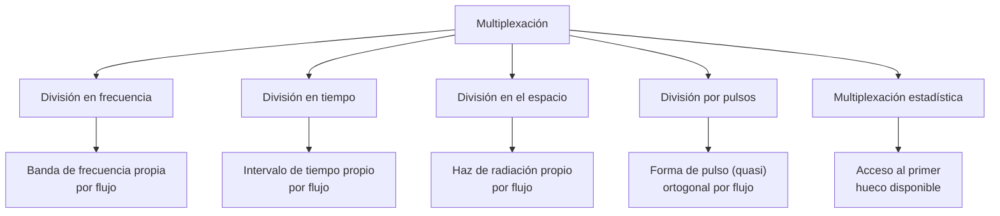
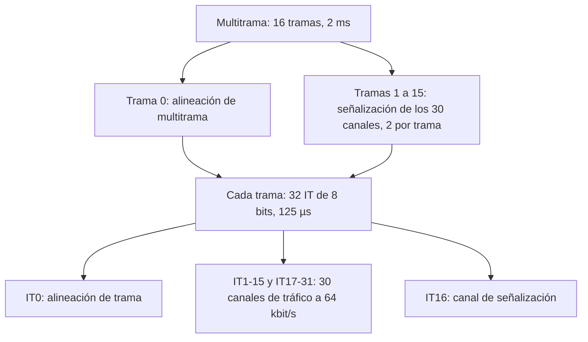

Un medio de transmisión, ya sea un cable, una fibra o una porción del espectro
radioeléctrico, tiene una capacidad finita que casi nunca se dedica a un único flujo de
información. Este capítulo describe las técnicas con las que varios flujos comparten un
mismo medio sin interferirse entre sí, desde su clasificación general hasta el
desarrollo en profundidad de la multiplexación por división en tiempo, que es la base de
las jerarquías digitales empleadas en las redes troncales.

## Introducción

**Multiplexar** consiste en combinar varios flujos de información independientes para
que compartan un mismo medio de transmisión, de forma que en el extremo receptor puedan
separarse de nuevo sin pérdida de información. La necesidad de multiplexar aparece en
cuanto la capacidad del medio supera la que requiere un solo flujo, situación habitual
tanto en los cables y fibras de las redes troncales como en el espectro radioeléctrico
asignado a un operador. La variable que cada técnica de multiplexación explota para
separar los flujos, ya sea la frecuencia, el tiempo, el espacio, la forma de un pulso o
la ocupación estadística del medio, determina su nombre y sus propiedades.

Conviene distinguir la multiplexación de dos conceptos con los que se confunde con
frecuencia. La **canalización**, con siglas como `FDMA`, `TDMA` o `CDMA`, aplica las
mismas ideas para repartir el acceso a un medio compartido entre terminales
independientes que no cooperan entre sí en su transmisión, un problema con matices
propios que se trata en el capítulo siguiente. La **duplexación**, con siglas `FDD` y
`TDD`, resuelve un problema distinto: cómo separar el sentido ascendente y el sentido
descendente de una misma comunicación bidireccional. La duplexación por división en
código no se emplea en la práctica, porque una señal recibida y la señal que el propio
equipo transmite comparten banda y tiempo, y la enorme diferencia de potencia entre
ambas saturaría el amplificador de recepción antes de que el código pudiera separarlas.

## Clasificación de las técnicas de multiplexación

Las técnicas de multiplexación se agrupan según la dimensión de la señal que emplean
para separar los flujos. Las tres primeras, frecuencia, tiempo y espacio, son
ortogonales entre sí y pueden combinarse: un sistema real reparte con frecuencia el
espectro disponible entre portadoras y, dentro de cada portadora, reparte el tiempo
entre usuarios. Las dos últimas, la división por pulsos y la multiplexación estadística,
responden a necesidades más específicas del acceso radio y de las redes de datos a
ráfagas respectivamente.

### División en frecuencia

La **multiplexación por división en frecuencia** (_frequency division multiplexing_,
`FDM`) asigna a cada flujo de información una banda de frecuencia distinta dentro del
espectro disponible, de modo que todos los flujos pueden transmitirse de forma
simultánea y continua. Cada banda se sitúa alrededor de una portadora propia y las
bandas no se solapan, lo que exige dejar una banda de guarda entre portadoras contiguas
para absorber la imperfección de los filtros reales, un aspecto que se desarrolla más
adelante en este capítulo. La FDM es la técnica dominante en radiocomunicación para
compartir el espectro y sostiene las redes de difusión de radio y televisión, los
radioenlaces fijos y los sistemas vía satélite. En los medios guiados, como el cable
coaxial o el par de cobre, la FDM queda reservada a la red de acceso, donde el número de
flujos que conviene multiplexar es reducido: el bucle de abonado, por ejemplo,
multiplexa en frecuencia la señal de _ADSL_ y la señal telefónica convencional sobre el
mismo par de cobre. La FDM es también el fundamento habitual de la duplexación, como en
los terminales móviles de GSM, que emplean duplexación por división en frecuencia entre
el enlace ascendente y el enlace descendente.

### División en tiempo

La **multiplexación por división en tiempo** (_time division multiplexing_, `TDM`)
asigna a cada flujo de información la totalidad del ancho de banda del medio durante una
fracción del tiempo que se repite de forma periódica, de modo que la capacidad del medio
se reparte en el dominio temporal en lugar de en el dominio frecuencial. Solo es
aplicable a señales digitales, porque exige interrumpir cada flujo mientras el medio
atiende a los demás, algo que una señal analógica no admite sin degradarse. Esta técnica
se desarrolla en profundidad en la sección siguiente de este capítulo, dada su
importancia como fundamento de las jerarquías digitales de las redes troncales.

### División en el espacio

La **multiplexación por división en el espacio** (_space division multiplexing_, `SDM`)
separa los flujos dirigiéndolos hacia direcciones distintas del espacio mediante haces
de radiación generados con configuraciones de antenas múltiples. Todas las antenas del
sistema participan en la transmisión de todos los flujos: lo que distingue a un haz de
otro no es qué antena lo emite, sino el desfase relativo con que cada antena excita su
señal, lo que orienta la energía radiada hacia una dirección concreta. Su principal
limitación es que necesita un número de antenas apreciable para conseguir haces
suficientemente directivos y, por tanto, suficientemente separados entre sí. La técnica
de conformación de haz que hace posible esta división pertenece al ámbito de los
sistemas de múltiples antenas y se trata en el capítulo dedicado a MIMO.

### División por pulsos

La **multiplexación por división de pulso** separa los flujos empleando formas de pulso
distintas, cuasi-ortogonales u ortogonales entre sí, de manera que el receptor puede
distinguir la contribución de cada flujo aun cuando todos ocupen la misma banda de
frecuencia y el mismo intervalo de tiempo. Los pulsos cuasi-ortogonales toleran cierta
interferencia residual entre flujos, mientras que los pulsos estrictamente ortogonales
la eliminan a cambio de exigir una sincronización precisa entre los transmisores, un
requisito que se vuelve exigente en el enlace ascendente porque los terminales se
encuentran a distancias distintas de la estación base y sus señales llegan con retardos
diferentes. Esta familia de técnicas es el fundamento de la multiplexación por división
de código, que emplea secuencias de pulsos ortogonales como forma de canalización entre
usuarios y que se trata en un capítulo propio de este mismo tema, dedicado al espectro
ensanchado y al acceso `CDMA`.

### Multiplexación estadística

La **multiplexación estadística** parte de la observación de que, en tráfico de datos a
ráfagas, no todos los flujos transmiten de forma simultánea, de modo que puede
prescindirse de reservar un intervalo de tiempo fijo para cada uno y permitir en su
lugar que cada flujo transmita en el primer hueco disponible del medio. Frente a la
reserva fija de TDM, esta técnica aprovecha mejor la capacidad del medio cuando el
tráfico es intermitente, porque no desperdicia capacidad reservada a flujos que en un
instante dado no tienen nada que enviar. Su contrapartida es que dos flujos pueden
coincidir al aspirar al mismo hueco, lo que produce una colisión y obliga a resolverla
con un mecanismo de acceso al medio, materia que se desarrolla en el capítulo siguiente
de este mismo tema.

## Multiplexación por división en tiempo

La TDM organiza la información en **tramas**, cada una dividida en un número fijo de
**intervalos de tiempo** (`IT`, también llamados _slot_ en su denominación inglesa), y
asigna cada intervalo a un flujo concreto. Las secciones siguientes desarrollan esa
estructura con detalle, tomando como referencia el sistema temporal `E1`, la
implementación más extendida de la TDM en las redes troncales de telefonía.

### Trama, multitrama e intervalo de tiempo

Una **trama** es la unidad periódica en la que se organiza la transmisión TDM: contiene
un número fijo de intervalos de tiempo, cada uno de duración idéntica, y la trama
completa se repite de forma continua mientras dura la comunicación. La repetición del
mismo intervalo de tiempo en tramas consecutivas define un **canal físico**: por
ejemplo, el primer intervalo de todas las tramas forma el canal físico 1,
independientemente de qué flujo de información transporte en cada momento. Un canal
físico puede dedicarse por completo a un único flujo de información, en cuyo caso ese
flujo recibe el nombre de **canal lógico**, o repartirse entre varios flujos que se
alternan dentro del mismo canal físico, una distinción que se retoma más adelante en
este capítulo.

Cuando un solo nivel de trama no basta para organizar toda la información que debe
transportarse, en particular la señalización de control asociada a cada canal, varias
tramas se agrupan en una **multitrama**, una unidad periódica de orden superior formada
por un número fijo de tramas consecutivas. La multitrama permite repartir a lo largo de
varias tramas una información que no cabe, o que no conviene repetir, dentro de una sola
trama, como se ilustra en la descripción del sistema E1 que sigue.

### Sistema temporal E1

El sistema **E1** es la implementación europea de la jerarquía digital de primer nivel y
organiza la información en tramas de 32 intervalos de tiempo de 8 bits cada uno. La
trama se repite con una frecuencia de 8 kHz, es decir, cada 125 microsegundos, de modo
que cada intervalo de tiempo transporta un régimen binario de:

$$
R_\text{IT} = \frac{8\ \text{bits}}{125\ \mu\text{s}} = 64\ \text{kbit/s}
$$

Puesto que la trama completa contiene 32 intervalos de ese régimen, el régimen binario
agregado del sistema E1 es:

$$
R_\text{E1} = 32 \times 64\ \text{kbit/s} = 2048\ \text{kbit/s}
$$

De esos 32 intervalos, el `IT0` se reserva para la alineación de trama, que se describe
en la sección siguiente, y el `IT16` se reserva para la señalización de control asociada
a los canales de tráfico. Los 30 intervalos restantes, `IT1` a `IT15` y `IT17` a `IT31`,
transportan cada uno un canal de tráfico a 64 kbit/s, la cifra que da nombre al canal de
voz digital de referencia en telefonía.

| Intervalo de tiempo | Contenido                                  |
| ------------------- | ------------------------------------------ |
| `IT0`               | Alineación de trama                        |
| `IT1` a `IT15`      | 15 canales de tráfico a 64 kbit/s cada uno |
| `IT16`              | Señalización de control de los 30 canales  |
| `IT17` a `IT31`     | 15 canales de tráfico a 64 kbit/s cada uno |

La señalización de control de los 30 canales no cabe en un único `IT16`, de modo que se
reparte a lo largo de una multitrama de 16 tramas: la primera trama de la multitrama
emplea su `IT16` para transportar una palabra de alineación de multitrama, y cada una de
las 15 tramas restantes dedica su `IT16` a transportar 4 bits de señalización por cada
uno de dos canales de tráfico, hasta cubrir los 30 canales al cabo de las 15 tramas. El
régimen binario que resulta de esa señalización, por canal, es de:

$$
R_\text{control} = \frac{4\ \text{bits}}{125\ \mu\text{s} \times 16} = 2\ \text{kbit/s}
$$

???+ example "Cálculo del régimen binario agregado de un sistema E1"

    Un sistema E1 multiplexa 30 canales de tráfico, cada uno a 64 kbit/s, junto con la
    alineación de trama y la señalización de control. El régimen binario agregado
    resulta de sumar los 30 canales de tráfico con el intervalo de alineación y el
    intervalo de señalización, ambos a 64 kbit/s por ser intervalos de 8 bits dentro de
    la misma trama de 125 microsegundos:

    $$
    R_\text{E1} = \underbrace{30 \times 64}_\text{tráfico} +
    \underbrace{64}_\text{alineación} + \underbrace{64}_\text{señalización} =
    2048\ \text{kbit/s}
    $$

    De los 2048 kbit/s agregados, 1920 kbit/s corresponden a información de tráfico y
    128 kbit/s a _overhead_ de trama, lo que supone una eficiencia de trama del 93,75 %.
    Esa cifra de _overhead_, dos intervalos de 64 kbit/s sobre 32 intervalos totales, es
    el coste de disponer de alineación de trama y de señalización de control propias
    dentro de cada trama, y se paga en todos los sistemas E1 con independencia del
    tráfico real que transporten sus canales.

### Alineación de trama

Para que el receptor pueda separar correctamente los flujos multiplexados necesita
identificar, dentro del flujo continuo de bits que recibe, dónde empieza cada trama. Ese
proceso, la **alineación de trama**, se resuelve insertando en un intervalo de tiempo
fijo de cada trama, el `IT0` en el caso de E1, una palabra de bits conocida de antemano
por el receptor. El receptor busca esa palabra de forma continua en el flujo recibido y,
cuando la encuentra de forma repetida en la posición esperada trama tras trama, declara
alcanzado el estado de alineación y puede a partir de ese momento asignar cada intervalo
recibido al canal físico que le corresponde. Un fallo de alineación, por ejemplo si el
receptor pierde la sincronización a causa de una interrupción del enlace, obliga a
repetir esa búsqueda antes de poder recuperar ningún canal de tráfico, lo que introduce
una interrupción de servicio breve pero perceptible.

### Canal lógico frente a canal físico

La distinción entre canal físico y canal lógico, introducida al describir la trama,
adquiere su forma más clara en la multitrama E1: el `IT16` es un único canal físico, la
repetición del intervalo 16 en cada una de las tramas, pero a lo largo de las 16 tramas
de la multitrama transporta la señalización de 30 canales lógicos distintos, dos por
trama. Un mismo canal físico reparte así su capacidad entre múltiples flujos de
información sin que esos flujos tengan visibilidad unos de otros. Los intervalos `IT1` a
`IT15` y `IT17` a `IT31`, en cambio, mantienen siempre la misma correspondencia: cada
uno de esos canales físicos transporta en exclusiva un único canal lógico de tráfico
mientras dura la conexión que lo ocupa. La misma distinción se generaliza a cualquier
sistema TDM: un canal físico es una posición fija en la estructura de trama, mientras
que un canal lógico es el flujo de información concreto al que esa posición da servicio
en un instante dado, y ambos coinciden solo cuando el diseño del sistema decide no
compartir el canal físico entre varios flujos.

## Jerarquías digitales

El sistema E1 constituye el primer nivel de una **jerarquía digital**: una escala de
sistemas de multiplexación en la que cada nivel combina varios flujos del nivel inferior
para formar un flujo agregado de mayor capacidad, que a su vez puede combinarse con
otros flujos agregados idénticos para formar el nivel siguiente. Esta organización
jerárquica permite que las redes troncales multiplexen progresivamente un número
creciente de canales de voz sin necesidad de diseñar un sistema de multiplexación
distinto para cada capacidad de enlace que aparece en la red.

### Jerarquía digital plesiócrona

La **jerarquía digital plesiócrona** (_plesiochronous digital hierarchy_, `PDH`) recibe
su nombre de la palabra griega que significa casi síncrono, porque los distintos flujos
que combina en cada nivel proceden de multiplexores independientes, cada uno gobernado
por su propio reloj, y esos relojes, aunque nominalmente idénticos, nunca coinciden con
exactitud perfecta. El nivel europeo de la jerarquía PDH parte del sistema E1, a 2048
kbit/s, y combina cuatro flujos de un nivel para formar el nivel siguiente: cuatro E1
forman un E2, a 8448 kbit/s; cuatro E2 forman un E3, a 34368 kbit/s; y cuatro E3 forman
un E4, a 139264 kbit/s. El régimen binario de cada nivel supera ligeramente cuatro veces
el del nivel anterior, una diferencia que no es ruido de medida sino el efecto directo
del problema de sincronización entre tributarios que se describe a continuación.

### Problema de la sincronización entre tributarios

Cuando un multiplexor combina varios flujos tributarios, cada uno procedente de un
multiplexor distinto con su propio reloj, el número exacto de bits que cada tributario
entrega durante el tiempo que dura una trama de salida no es constante de una trama a
otra, porque el periodo de bit real de cada tributario se desvía ligeramente de su valor
nominal según la tolerancia del reloj que lo genera. Si el periodo de bit de un
tributario resulta ligeramente mayor que el nominal, llega el momento de extraer bits
que todavía no han sido entregados por ese tributario. Si, por el contrario, el periodo
de bit resulta ligeramente menor que el nominal, el tributario entrega más bits de los
que la trama de salida puede acomodar en el espacio que tiene reservado para él. Ambas
situaciones son inevitables en un sistema plesiócrono, porque ningún reloj real mantiene
una frecuencia perfectamente constante, y deben resolverse sin perder ni un solo bit de
información de ningún tributario.

### Justificación de bits

La solución al problema anterior es la **justificación de bits**: conociendo la
tolerancia de frecuencia de los relojes empleados, es posible acotar el número máximo
($N_\text{max}$) y el número mínimo ($N_\text{min}$) de bits que puede entregar un
tributario durante el tiempo que ocupa una trama de salida. La trama de salida se diseña
con capacidad para $N_\text{max}$ bits de cada tributario, de modo que nunca falta
espacio para los bits que llegan. Cuando un tributario entrega, en una trama concreta,
menos de $N_\text{max}$ bits porque su reloj es en ese instante ligeramente más lento,
las posiciones sobrantes se rellenan con **bits de justificación**, bits sin información
que el multiplexor inserta para completar la trama y que el demultiplexor en el extremo
receptor descarta sin más. La posición exacta en la que se han insertado bits de
justificación en cada trama se señaliza mediante bits de control específicos, de modo
que el demultiplexor sepa en cada trama cuáles de los bits recibidos son información
real del tributario y cuáles son relleno que debe eliminar antes de reconstituir el
flujo original.

## Bandas e intervalos de guarda

Tanto la FDM como la TDM necesitan reservar un margen que absorba la imperfección de los
sistemas reales, aunque ese margen adopta una forma distinta según la dimensión que cada
técnica emplea para separar los flujos. En FDM, la **banda de guarda** es una porción de
espectro sin uso que se deja entre las bandas de frecuencia asignadas a portadoras
contiguas, necesaria porque ningún filtro real corta con pendiente infinita en el borde
de la banda que le corresponde: sin banda de guarda, la energía que escapa de una banda
adyacente se interpretaría en el receptor como interferencia sobre el canal deseado. En
TDM, el margen equivalente es el **intervalo de guarda**, un breve periodo de tiempo sin
transmisión útil entre intervalos de tiempo consecutivos, necesario porque las señales
de transmisores distintos, o de un mismo transmisor en instantes distintos, no llegan al
receptor con una sincronización perfecta, y ese margen absorbe tanto el error residual
de sincronización como la dispersión temporal introducida por la propagación del canal.

En ambos casos, el margen de guarda es capacidad del medio que no transporta información
de usuario: cuanto mayor es la banda o el intervalo de guarda, más margen frente a
errores de sincronización y de filtrado, pero también más capacidad sacrificada frente a
la que quedaría disponible para tráfico útil.

???+ example "Número de canales de un sistema FDM con banda de guarda"

    Un operador dispone de una banda total de 5 MHz para desplegar un sistema FDM en el
    que cada canal ocupa 200 kHz y entre canales contiguos debe dejarse una banda de
    guarda de 20 kHz. El ancho de banda que consume cada canal, incluida la porción de
    banda de guarda que lo precede, es de:

    $$
    B_\text{canal} = 200\ \text{kHz} + 20\ \text{kHz} = 220\ \text{kHz}
    $$

    El número de canales que caben en la banda total se obtiene dividiendo el ancho de
    banda disponible entre el ancho de banda que consume cada canal, redondeando hacia
    abajo porque no puede desplegarse una fracción de canal:

    $$
    N_\text{canales} = \left\lfloor \frac{5000\ \text{kHz}}{220\ \text{kHz}}
    \right\rfloor = \lfloor 22{,}7 \rfloor = 22\ \text{canales}
    $$

    Aumentar la banda de guarda de 20 a 50 kHz por canal, para dar más margen frente a
    filtros de peor calidad, reduce la cuenta a $\lfloor 5000 / 250 \rfloor = 20$
    canales: tres canales menos, sacrificados íntegramente para ganar margen frente a la
    interferencia entre canales adyacentes.

## Compromisos de diseño

La elección de una técnica de multiplexación, y del margen de guarda que se le asocia,
responde a un compromiso entre varios factores que rara vez se optimizan todos a la vez.
Un margen de guarda amplio, en frecuencia o en tiempo, ofrece robustez frente a
imperfecciones de sincronización y de filtrado, pero reduce la eficiencia espectral o
temporal del sistema porque esa capacidad reservada no transporta tráfico de usuario. La
TDM exige una sincronización temporal precisa entre transmisor y receptor, resuelta
mediante la alineación de trama descrita en este capítulo, mientras que la FDM traslada
esa exigencia al dominio de la frecuencia, en forma de estabilidad y selectividad de los
osciladores y los filtros empleados. La SDM ofrece la mayor eficiencia potencial, porque
reutiliza la misma banda y el mismo tiempo en direcciones distintas del espacio, a costa
de una complejidad de antenas considerablemente mayor que la de las otras técnicas.

La jerarquía plesiócrona, por su parte, ilustra un compromiso propio de los sistemas que
combinan multiplexores independientes: la justificación de bits resuelve el problema de
sincronización entre tributarios sin exigir que todos compartan un reloj común, a costa
de un _overhead_ de señalización y de una complejidad de procesado que crece en cada
nivel de la jerarquía. Esta limitación es, precisamente, la que da paso histórico a la
jerarquía digital síncrona, que sustituye los relojes independientes por un reloj de
referencia común a toda la red y elimina así la necesidad de justificación de bits, a
cambio de una exigencia de sincronización de red que la jerarquía plesiócrona nunca tuvo
que afrontar.

Las técnicas de multiplexación descritas en este capítulo no agotan las formas de
compartir un medio de transmisión. La multiplexación por división de código, que emplea
secuencias de pulsos ortogonales sobre toda la banda disponible, y la multiplexación por
división ortogonal de frecuencia, que fragmenta una banda ancha en subportadoras
estrechas y mutuamente ortogonales, resuelven el mismo problema con herramientas propias
que merecen un desarrollo independiente. Su aplicación concreta a los sistemas de
telefonía móvil, donde la elección entre estas técnicas condiciona buena parte del
diseño de la interfaz radio, se retoma en los capítulos dedicados a las redes móviles.
