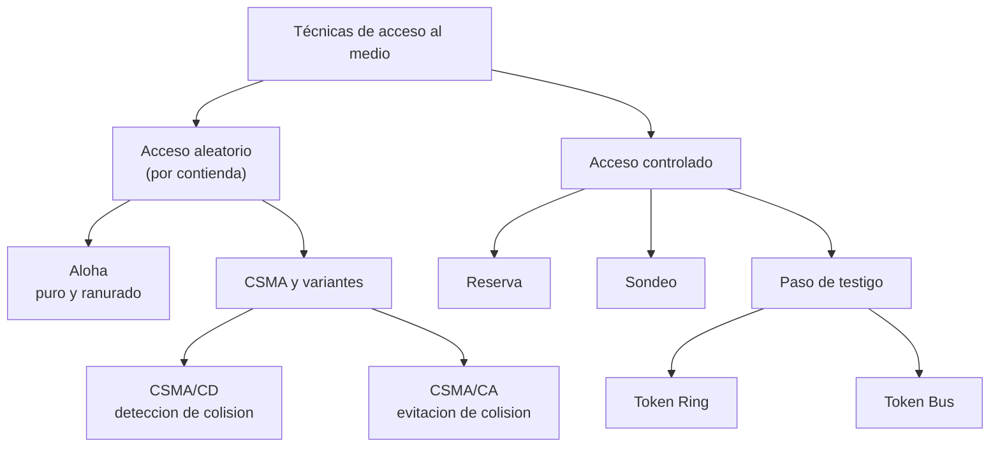
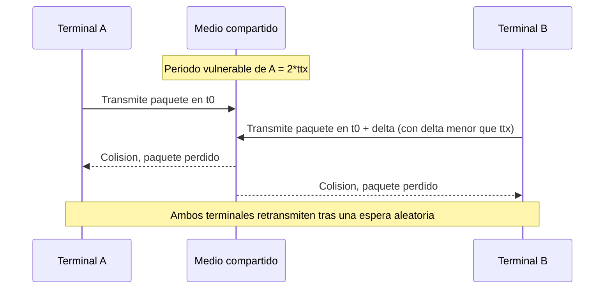
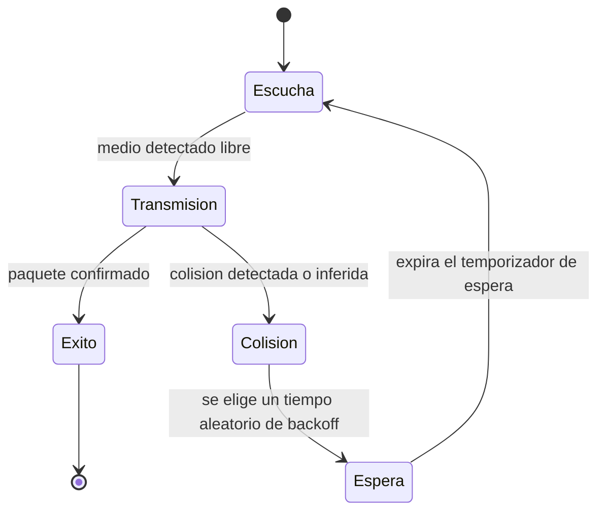
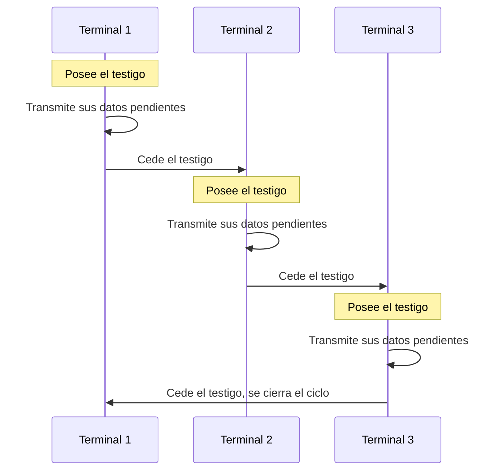

El capítulo anterior describe cómo varios flujos de información comparten un mismo medio
de transmisión mediante multiplexación, repartiendo el medio en el dominio de la
frecuencia, del tiempo o del espacio de forma planificada de antemano. Este capítulo
aborda un problema distinto: cómo organizar el acceso de varios terminales a un medio
compartido cuando ninguna asignación fija resulta eficiente, porque el tráfico que
genera cada terminal es a ráfagas e impredecible. Las técnicas de acceso múltiple al
medio son la respuesta a ese problema, y se dividen en dos grandes familias según si
coordinan el acceso de antemano o dejan que los propios terminales negocien el uso del
canal en el momento en que surge la necesidad de transmitir.

## Introducción

Un **medio compartido** es un canal de transmisión al que varios terminales pueden
acceder para enviar información, sin que ninguno de ellos disponga de un canal físico
exclusivo. Este escenario aparece de forma natural en redes de radio, donde el aire es
un único medio que todos los terminales de una zona comparten por necesidad física, pero
también en redes cableadas que comparten un mismo segmento, como un bus o un anillo. Los
terminales conectados a un medio compartido presentan dos rasgos que hacen inadecuada
una asignación fija de recursos: generan tráfico a ráfagas, con periodos de actividad
intensa seguidos de silencios prolongados, y necesitan acceder al medio repetidas veces
a lo largo de una sesión de comunicación, no una sola vez.

Ante esta situación conviene distinguir entre **canal lógico** y **canal físico**: el
canal físico es el medio de transmisión real, único y compartido, mientras que un canal
lógico es la porción de ese medio que una técnica de acceso reserva, temporal o
permanentemente, para el uso de un terminal concreto. Organizar el reparto de canales
lógicos sobre un único canal físico es precisamente la función de una **técnica de
acceso al medio**, que persigue tres objetivos simultáneos: repartir el uso del medio
entre los terminales de forma razonable, maximizar el rendimiento agregado de la red,
expresado como un _throughput_ elevado, y minimizar el retardo extremo a extremo que
experimenta cada terminal.

## Clasificación de las técnicas de acceso

Las técnicas de acceso al medio se clasifican en dos familias según el grado de
coordinación que exigen entre los terminales antes de transmitir. En el **acceso
aleatorio**, también llamado acceso por contienda, ningún terminal necesita el permiso
de otro para transmitir: cualquiera puede intentar el acceso en el momento en que tiene
datos que enviar, a costa de asumir el riesgo de que dos o más terminales transmitan
simultáneamente y provoquen una colisión. En el **acceso controlado**, por el contrario,
existe un mecanismo explícito, ya sea una estación coordinadora o un testigo que circula
entre los terminales, que determina en cada instante quién tiene derecho a transmitir,
de modo que las colisiones quedan excluidas por construcción.



Existe una tercera vía, intermedia entre ambas familias, que no evita la contienda por
completo sino que la reduce dividiendo el canal físico entre los usuarios mediante
códigos ortogonales o casi ortogonales en lugar de mediante turnos. Esa vía, que incluye
el acceso múltiple por división de código y las técnicas de portadoras múltiples, se
trata en secciones posteriores dedicadas específicamente a ella. El acceso aleatorio y
el acceso controlado que ocupan este capítulo comparten, en cambio, la hipótesis de que
en cada instante el canal físico completo está disponible para un único terminal a la
vez, y que la técnica de acceso decide quién lo ocupa.

## Técnicas de acceso aleatorio

Las técnicas de acceso aleatorio no requieren ninguna coordinación previa entre
terminales: el control del acceso está totalmente distribuido, y cada terminal decide
por sí mismo cuándo intentar transmitir. Esta simplicidad las hace baratas y sencillas
de implementar, pero introduce la posibilidad de que dos transmisiones se superpongan en
el tiempo, lo que se conoce como **colisión**, y que destruye ambos paquetes
involucrados.

### Aloha puro

**Aloha puro** es la técnica de acceso aleatorio más simple: un terminal que tiene un
paquete que enviar lo transmite inmediatamente, sin comprobar el estado del medio ni
esperar ningún instante concreto. Si dos terminales transmiten de forma que sus paquetes
se superponen aunque solo sea parcialmente en el tiempo, ambos paquetes colisionan y se
pierden, y cada terminal debe retransmitirlos tras un tiempo de espera.

Para un paquete que comienza a transmitirse en el instante $t_0$ y cuyo tiempo de
transmisión es $t_{tx}$, cualquier otro paquete que comience a transmitirse en el
intervalo $\lbrack t_0 - t_{tx}, t_0 + t_{tx} \rbrack$ provoca una colisión con él. Ese
intervalo, de duración $2 t_{tx}$, se denomina **periodo vulnerable** del paquete: es el
margen de tiempo durante el cual la aparición de un segundo transmisor arruina la
transmisión en curso.



### Aloha ranurado

**Aloha ranurado** reduce el periodo vulnerable dividiendo el eje temporal en
intervalos, o ranuras, de duración exactamente igual al tiempo de transmisión de un
paquete, y obligando a todos los terminales a comenzar sus transmisiones únicamente al
inicio de una ranura. Esta sincronización, que exige un mecanismo adicional para que
todos los terminales conozcan el instante de inicio de cada ranura, reduce el periodo
vulnerable de un paquete de $2t_{tx}$ a $t_{tx}$: dos paquetes solo colisionan si se
transmiten en la misma ranura, nunca si se transmiten en ranuras consecutivas aunque
estén muy próximas entre sí. Esta reducción a la mitad del periodo vulnerable es la
causa directa de que Aloha ranurado duplique el rendimiento máximo de Aloha puro, como
se desarrolla en la sección siguiente.

### Rendimiento frente a carga ofrecida

Para comparar ambas variantes de forma cuantitativa conviene modelar la generación de
tráfico. Se supone que los paquetes llegan a la red, procedentes de un número elevado de
terminales, siguiendo un proceso de Poisson de tasa media $\lambda$ paquetes por
segundo, y que todos los paquetes tienen la misma longitud $L$ y, por tanto, el mismo
tiempo de transmisión $t_{tx} = L/R$, con $R$ el régimen binario del canal.

Sobre ese modelo se definen dos magnitudes normalizadas, ambas expresadas como número
medio de paquetes por tiempo de transmisión de un paquete:

- **Carga ofrecida**, $G$: número medio de paquetes, contando tanto los que se
  transmiten con éxito como las retransmisiones, que el conjunto de terminales entrega
  al sistema durante un intervalo de duración $t_{tx}$. $G$ recoge, por tanto, todo el
  tráfico que intenta acceder al medio, con independencia de si lo consigue.
- **_Throughput_ normalizado**, $S$: número medio de paquetes transmitidos con éxito, es
  decir, sin colisión, durante ese mismo intervalo de duración $t_{tx}$. $S$ toma
  valores entre 0 y 1 y mide la fracción de la capacidad del canal que efectivamente se
  aprovecha.

El _throughput_ se relaciona con la carga ofrecida a través de la probabilidad de que,
durante el periodo vulnerable de un paquete, ningún otro terminal transmita, ya que esa
ausencia de tráfico competidor es la condición necesaria para el éxito de la
transmisión. Bajo la hipótesis de llegadas de Poisson, el número de paquetes que llegan
durante un intervalo de duración $k$ periodos de transmisión sigue una distribución de
Poisson de media $kG$, de modo que la probabilidad de que no llegue ningún paquete
competidor durante ese intervalo es $e^{-kG}$. Para Aloha puro, el periodo vulnerable
mide $2t_{tx}$, es decir, dos periodos de transmisión, y para Aloha ranurado mide
$t_{tx}$, un único periodo, lo que conduce a las expresiones clásicas:

$$
S_{\text{puro}} = G \, e^{-2G}
$$

$$
S_{\text{ranurado}} = G \, e^{-G}
$$

En ambas expresiones, $G$ es la carga ofrecida normalizada definida arriba y $S$ es el
_throughput_ normalizado resultante. Derivando cada expresión respecto de $G$ e
igualando a cero se obtiene el punto de carga que maximiza el _throughput_ de cada
variante: $G = 0{,}5$ para Aloha puro, con un _throughput_ máximo de $S_{\text{máx}} =
1/(2e) \approx 0{,}184$, y $G = 1$ para Aloha ranurado, con $S_{\text{máx}} = 1/e
\approx 0{,}368$. Aloha ranurado duplica exactamente el _throughput_ máximo de Aloha
puro, consecuencia directa de que su periodo vulnerable mide la mitad.

```python linenums="1"
import numpy as np


def throughput_aloha(
    carga_ofrecida: np.ndarray, ranurado: bool
) -> np.ndarray:
    """Calcula el throughput normalizado de un canal Aloha.

    Args:
        carga_ofrecida: Valores de carga ofrecida normalizada, G.
        ranurado: Si es True, aplica el modelo de Aloha ranurado. Si es
            False, aplica el modelo de Aloha puro.

    Returns:
        Throughput normalizado, S, para cada valor de carga ofrecida.
    """
    exponente = -carga_ofrecida if ranurado else -2 * carga_ofrecida
    return carga_ofrecida * np.exp(exponente)


carga = np.linspace(0, 3, 301)
s_puro = throughput_aloha(carga, ranurado=False)
s_ranurado = throughput_aloha(carga, ranurado=True)
# El maximo de cada curva se alcanza en G=0.5 (puro) y G=1 (ranurado)
g_optimo_puro = carga[np.argmax(s_puro)]
g_optimo_ranurado = carga[np.argmax(s_ranurado)]
```

Ambas curvas comparten la misma forma cualitativa: con carga ofrecida baja, apenas hay
competencia por el canal y el _throughput_ crece casi linealmente con la carga, porque
prácticamente todos los paquetes se transmiten sin colisión. Al superar el punto óptimo,
el número de colisiones crece más rápido que el número de intentos, las retransmisiones
se acumulan sobre el tráfico nuevo y el _throughput_ decrece, pudiendo llegar a colapsar
hacia cero si la carga sigue aumentando sin control. Esta caída tras el máximo es la
razón por la que un sistema Aloha real necesita limitar el número de terminales activos
o reducir su tasa de generación de tráfico para mantenerse en la zona estable de la
curva, y por la que estos cálculos de rendimiento son independientes del tiempo de
propagación del canal, a diferencia de las técnicas que se presentan a continuación.

???+ example "Throughput máximo de un canal Aloha en paquetes por segundo"

    Un canal radio transmite a un régimen binario $R = 9600$ bit/s y los paquetes que
    circulan por él tienen una longitud fija $L = 120$ bits, de modo que el tiempo de
    transmisión de cada paquete es $t_{tx} = L/R = 12{,}5$ ms. Se pide el _throughput_
    máximo, expresado en paquetes por segundo, que puede alcanzar este canal con Aloha
    puro y con Aloha ranurado.

    Para Aloha puro, el _throughput_ máximo normalizado es $S_{\text{máx}} \approx
    0{,}184$, de modo que el _throughput_ máximo en bits por segundo es
    $0{,}184 \cdot 9600 \approx 1766{,}4$ bit/s, que equivale a
    $1766{,}4 / 120 \approx 14{,}72$ paquetes por segundo. Para Aloha ranurado, el
    _throughput_ máximo normalizado es $S_{\text{máx}} \approx 0{,}368$, exactamente el
    doble, lo que da un _throughput_ máximo de $0{,}368 \cdot 9600 \approx 3532{,}8$
    bit/s, equivalente a $3532{,}8 / 120 \approx 29{,}44$ paquetes por segundo. El
    resultado confirma, sobre un caso numérico concreto, que ranurar el canal duplica la
    capacidad máxima que Aloha puede sostener sin necesidad de ningún otro cambio en el
    sistema.

???+ example "Throughput de un canal Aloha puro para una carga dada y su óptimo"

    Una red Aloha pura transmite paquetes de $L = 600$ bits sobre un canal de
    $R = 400$ kbit/s, con un tiempo de transmisión por paquete
    $t_{tx} = L/R = 1{,}5$ ms. Al sistema llegan $1000$ paquetes por segundo. Se pide el
    _throughput_ que resulta de esa carga y la tasa de llegada de paquetes que
    maximizaría el _throughput_.

    La carga ofrecida normalizada es $G = 1000 \cdot t_{tx} = 1{,}5$. El _throughput_
    normalizado para Aloha puro es
    $S = G\,e^{-2G} = 1{,}5 \cdot e^{-3} \approx 0{,}0747$, lo que equivale a un
    _throughput_ de $0{,}0747 \cdot 400 \approx 29{,}9$ kbit/s, o
    $29{,}9\,\text{kbit/s}/600\,\text{bit} \approx 49{,}8$ paquetes por segundo: la red
    opera muy por encima de su punto óptimo y desperdicia la mayor parte de su
    capacidad en colisiones.

    Para maximizar el _throughput_, Aloha puro exige $G = 0{,}5$, lo que en este canal
    corresponde a una tasa de llegada de
    $X = 0{,}5 / t_{tx} \approx 333{,}3$ paquetes por segundo, muy por debajo de la
    carga real del enunciado. En ese punto óptimo el _throughput_ alcanzaría
    $0{,}184 \cdot 400 \approx 73{,}6$ kbit/s, casi 2,5 veces más que con la carga
    excesiva de partida, lo que ilustra que reducir la tasa de generación de tráfico
    puede aumentar el _throughput_ útil de la red en lugar de disminuirlo.

### Acceso múltiple por detección de portadora

El acceso múltiple por detección de portadora, **CSMA** por sus siglas en inglés, mejora
sobre Aloha introduciendo una comprobación previa: antes de transmitir, cada terminal
escucha el medio y solo transmite cuando lo detecta libre, es decir, cuando el nivel de
energía que percibe es prácticamente nulo. La idea surge de forma natural en entornos en
los que el tiempo de propagación es pequeño en comparación con el tiempo de transmisión
de un paquete: si la señal de un terminal que ha comenzado a transmitir llega enseguida
al resto, los demás terminales pueden detectarla y evitar transmitir mientras el medio
está ocupado, lo que reduce sustancialmente la probabilidad de colisión sin llegar a
eliminarla por completo.

La colisión sigue siendo posible porque la detección no es instantánea: existe un
**periodo vulnerable**, igual al tiempo de propagación $t_{prop}$ entre los dos
terminales más alejados del medio, durante el cual un segundo terminal puede comenzar a
transmitir sin haber detectado aún la transmisión en curso, porque la señal del primero
todavía no le ha alcanzado. Para que la técnica tenga sentido, el tiempo de transmisión
de un paquete debe ser mayor que ese tiempo de propagación, $t_{tx} > t_{prop}$: solo
entonces la comprobación previa del medio aporta una ventaja apreciable sobre no
comprobarlo, porque la fracción de la transmisión expuesta al riesgo de colisión es
pequeña frente a su duración total.

### Variantes persistentes y no persistentes

La comprobación del medio que define CSMA admite distintas políticas según qué hace un
terminal cuando encuentra el medio ocupado. En la variante **persistente**, el terminal
sigue escuchando el medio de forma continua y transmite inmediatamente en cuanto lo
detecta libre. Esta política es sencilla, pero tiene un inconveniente: si varios
terminales estaban esperando a que el medio quedara libre, todos transmiten en el mismo
instante en que eso ocurre, lo que provoca una colisión casi garantizada cuando el
número de terminales en espera es alto. En la variante **no persistente**, el terminal
que encuentra el medio ocupado no espera de forma continua a que se libere, sino que
programa un nuevo intento de comprobación tras un tiempo aleatorio, lo que dispersa en
el tiempo los intentos de los distintos terminales en espera y reduce la probabilidad de
que coincidan, a costa de introducir un retardo adicional incluso cuando el medio queda
libre de inmediato. Un compromiso habitual entre ambos extremos es la variante
**$p$-persistente**, en la que un terminal que encuentra el medio libre transmite con
una probabilidad $p$ y, con probabilidad $1-p$, retrasa su comprobación un intervalo
fijo, de modo que ajustar $p$ permite situarse en cualquier punto entre el
comportamiento puramente persistente ($p=1$) y un comportamiento más próximo al no
persistente cuanto menor es $p$.

### Detección de colisión: CSMA/CD

CSMA reduce la probabilidad de colisión, pero no evita que, una vez producida, el
terminal transmisor continúe enviando un paquete que ya está condenado a perderse. La
variante **CSMA/CD**, con detección de colisión, añade la capacidad de que el terminal
siga monitorizando el medio mientras transmite y, si detecta que el nivel de energía es
superior al que él mismo está inyectando, interpreta que se ha producido una colisión,
detiene inmediatamente su transmisión y libera el canal antes de completar el envío del
paquete completo. Esta interrupción temprana ahorra el tiempo que de otro modo se
perdería transmitiendo un paquete ya corrupto, y mejora el rendimiento efectivo del
canal frente a CSMA sin detección.

El rendimiento máximo alcanzable con la variante persistente de CSMA/CD admite una
aproximación clásica en función del parámetro $a$, definido como la relación entre el
tiempo de propagación entre los dos terminales más alejados y el tiempo de transmisión
de un paquete, $a = t_{prop}/t_{tx}$:

$$
S_{\text{máx}} \approx \frac{1}{1 + 6{,}44\,a}
$$

Esta expresión confirma, de forma cuantitativa, que cuanto mayor es el tiempo de
propagación relativo al tiempo de transmisión, mayor es el periodo vulnerable relativo
del canal y menor el rendimiento máximo alcanzable: un canal con paquetes largos o con
distancias físicas cortas, es decir, con $a$ pequeño, se aproxima a un rendimiento
cercano a la unidad, mientras que un canal con paquetes cortos o distancias largas
degrada su rendimiento con rapidez.

???+ example "Rendimiento máximo de un canal CSMA/CD ante un cambio de velocidad"

    Un conjunto de estaciones conectadas a un concentrador central en topología en
    estrella comparten un medio mediante CSMA/CD persistente. Cada estación se
    encuentra a una distancia de $100$ m del concentrador, la velocidad de propagación
    en la línea es $v = 2{,}5 \times 10^8$ m/s, y los paquetes tienen una longitud de
    $1250$ bytes, es decir, $10\,000$ bits. Se pide el rendimiento máximo normalizado
    con una velocidad de transmisión de $10$ Mbit/s y, a continuación, el que resulta de
    aumentar esa velocidad a $1$ Gbit/s.

    Con $R = 10$ Mbit/s, el tiempo de transmisión de un paquete es
    $t_{tx} = 10\,000/10^7 = 1$ ms. El tiempo de propagación entre las dos estaciones
    más alejadas, separadas por el doble de la distancia al concentrador, es
    $t_{prop} = 2 \cdot 100 / (2{,}5 \times 10^8) = 0{,}8\,\mu\text{s}$, de modo que
    $a = t_{prop}/t_{tx} = 8 \times 10^{-4}$. El rendimiento máximo resulta
    $S_{\text{máx}} = 1/(1 + 6{,}44 \cdot 8\times 10^{-4}) \approx 0{,}9949$, casi
    $9{,}95$ Mbit/s de _throughput_ útil sobre los $10$ Mbit/s nominales.

    Al aumentar la velocidad de transmisión a $R = 1$ Gbit/s sin modificar la distancia
    física, el tiempo de transmisión se reduce a $t_{tx} = 10\,000/10^9 = 10\,\mu
    \text{s}$, mientras que el tiempo de propagación permanece en $0{,}8\,\mu
    \text{s}$, de modo que $a$ crece hasta $0{,}08$, cien veces más que antes. El
    rendimiento máximo cae hasta
    $S_{\text{máx}} = 1/(1 + 6{,}44 \cdot 0{,}08) \approx 0{,}66$, muy por debajo del
    caso anterior a pesar de que la velocidad nominal del canal es cien veces mayor. El
    resultado ilustra un compromiso estructural de CSMA/CD: aumentar la velocidad de
    transmisión sin acortar las distancias físicas empeora, en términos relativos, el
    rendimiento alcanzable, porque el periodo vulnerable pasa a representar una
    fracción mayor del tiempo de transmisión de cada paquete.

### Evitación de colisión: CSMA/CA

En un medio radio, a diferencia de un medio cableado, resulta mucho más difícil que un
terminal pueda detectar una colisión mientras transmite, porque su propia transmisión
suele saturar el receptor de forma que este no puede distinguir si la energía recibida
procede de otro terminal o de su propia señal reflejada. Ante esta limitación, la
variante **CSMA/CA**, con evitación de colisión, sustituye la detección durante la
transmisión por un conjunto de medidas preventivas que reducen la probabilidad de
colisión antes de que la transmisión comience.

La primera medida es un **espacio entre paquetes** (_interframe space_): cuando un
terminal detecta el medio libre, no transmite de inmediato, sino que espera un intervalo
de tiempo fijo. Ese margen evita colisionar con un paquete que otro terminal ya ha
enviado pero que todavía no ha alcanzado al terminal que está escuchando, porque la
señal en tránsito no se detecta hasta que llega físicamente al receptor. La segunda
medida son las **comprobaciones adicionales**: si al finalizar el espacio entre paquetes
el medio sigue libre, el terminal no transmite todavía, sino que repite la comprobación
un número aleatorio de veces adicionales, y solo transmite si el medio se mantiene libre
durante todas ellas, lo que dispersa en el tiempo los instantes de transmisión de los
terminales que estaban esperando y reduce la probabilidad de que varios coincidan. La
tercera medida es la **confirmación explícita**: el receptor de un paquete recibido
correctamente envía de vuelta un acuse de recibo, de modo que el terminal emisor, si no
lo recibe dentro de un plazo determinado, interpreta que se ha producido una colisión o
una pérdida y programa una retransmisión, sustituyendo así la detección directa de la
colisión por una inferencia basada en la ausencia de respuesta.

### Mecanismo de espera aleatoria

Tanto la elección del número de comprobaciones adicionales en CSMA/CA como la
retransmisión tras una colisión detectada en CSMA/CD comparten un mismo principio de
diseño, conocido como mecanismo de **espera aleatoria** o _backoff_: en lugar de
reintentar la transmisión de inmediato, o de forma sincronizada con otros terminales que
se encuentran en la misma situación, cada terminal implicado en una colisión elige un
tiempo de espera al azar dentro de un intervalo dado, y solo vuelve a intentar el acceso
al medio una vez transcurrido ese tiempo. Elegir la espera de forma aleatoria e
independiente entre terminales rompe la sincronía que, de otro modo, llevaría a los
mismos terminales a colisionar de nuevo en el instante inmediatamente posterior a la
colisión anterior.



El refinamiento más extendido de este mecanismo es el **_backoff_ exponencial binario**:
el intervalo del que se sortea el tiempo de espera no es fijo, sino que se duplica cada
vez que un mismo paquete sufre una colisión adicional, de modo que tras la primera
colisión el terminal espera un tiempo aleatorio dentro de un intervalo pequeño, tras la
segunda colisión consecutiva del mismo paquete el intervalo se duplica, y así
sucesivamente hasta un límite máximo de reintentos o de tamaño de intervalo. Esta
progresión adapta el comportamiento del sistema a la carga real de la red: mientras las
colisiones son ocasionales, los terminales reintentan pronto y el retardo se mantiene
bajo, pero si la carga de la red es alta y las colisiones se repiten, el intervalo de
espera crece y dispersa los reintentos sobre una ventana de tiempo cada vez mayor,
reduciendo la probabilidad de que las sucesivas retransmisiones vuelvan a coincidir
entre sí.

## Técnicas de acceso controlado

Frente a la contienda de las técnicas anteriores, las técnicas de acceso controlado
introducen un mecanismo explícito que determina, en cada instante, qué terminal tiene
derecho a ocupar el medio, de modo que las colisiones quedan excluidas por diseño. Esa
coordinación exige información de control adicional y una organización algo más compleja
de implementar, pero a cambio permite garantizar un tiempo de espera máximo acotado, lo
que resulta imprescindible en aplicaciones con requisitos de rendimiento estables.

### Reserva

En el protocolo de **reserva**, el tiempo se organiza en ciclos, y cada ciclo comienza
con un breve intervalo de reserva antes de la fase de transmisión de datos propiamente
dicha. El intervalo de reserva se divide en tantas mini-ranuras como terminales tiene el
sistema, y cada terminal indica en su mini-ranura asignada si tiene datos pendientes
para ese ciclo. Al finalizar el intervalo de reserva, todos los terminales conocen
exactamente qué terminales van a transmitir y en qué orden, de modo que la fase de datos
que sigue se desarrolla sin ningún riesgo de colisión. La longitud de cada ciclo varía
según cuántos terminales hayan hecho una reserva efectiva, de modo que el medio no se
desperdicia en huecos de datos vacíos cuando pocos terminales tienen tráfico pendiente.

El rendimiento máximo de este esquema, alcanzado cuando todos los terminales del sistema
reservan y transmiten un paquete en cada ciclo y con un tiempo de propagación
despreciable, es:

$$
S_{\text{máx}} = \frac{t_{tx}}{t_{tx} + t_{mr}}
$$

donde $t_{tx}$ es el tiempo de transmisión de un paquete de datos y $t_{mr}$ es la
duración de una única mini-ranura de reserva. Esta expresión refleja que el intervalo de
reserva es un _overhead_ fijo que se paga una vez por ciclo y por terminal activo, de
modo que el rendimiento se aproxima a la unidad cuanto más corta es la mini-ranura de
reserva en comparación con el tiempo que ocupa transmitir un paquete completo de datos.

### Reserva con Aloha ranurado

Cuando el número de terminales del sistema es elevado pero solo una fracción pequeña de
ellos tiene tráfico pendiente en un ciclo dado, dedicar una mini-ranura fija a cada
terminal desperdicia capacidad en mini-ranuras vacías. La variante **reserva con Aloha
ranurado**, o R-Aloha, resuelve esta ineficiencia reduciendo el número de mini-ranuras
de reserva por ciclo a un valor $k$ menor que el número total de terminales $N$, y
haciendo que los terminales compitan por esas $k$ mini-ranuras siguiendo la técnica de
Aloha ranurado en miniatura: cada terminal con tráfico pendiente elige al azar una de
las $k$ mini-ranuras disponibles, y solo consigue la reserva si ninguna otra estación
elige la misma mini-ranura en ese ciclo. Una vez que un terminal consigue una reserva
con éxito, esa reserva se mantiene válida para transmitir en el ciclo siguiente sin
necesidad de repetir la competencia, lo que favorece especialmente a los terminales con
tráfico sostenido frente a los puramente esporádicos.

Puesto que cada mini-ranura de reserva se resigue con Aloha ranurado, su rendimiento
máximo por intento es $1/e \approx 0{,}368$, de modo que, en promedio, una reserva con
éxito requiere $1/0{,}368 \approx 2{,}72$ intentos de ocupar una mini-ranura. El
rendimiento máximo del ciclo completo, de nuevo con todos los terminales transmitiendo
un paquete y tiempo de propagación despreciable, resulta:

$$
S_{\text{máx}} = \frac{t_{tx}}{t_{tx} + 2{,}72 \, t_{mr}}
$$

con $t_{tx}$ y $t_{mr}$ definidos igual que en el protocolo de reserva básico. El factor
$2{,}72$ penaliza el rendimiento frente al protocolo básico, porque cada reserva exige
en promedio varios intentos antes de tener éxito, pero esa penalización se compensa con
creces cuando el sistema tiene muchos terminales inactivos en un ciclo dado, ya que el
protocolo básico habría desperdiciado una mini-ranura completa por cada uno de ellos.

???+ example "Comparación del _throughput_ entre reserva básica y R-Aloha"

    Una red con velocidad de transmisión de $10$ kbit/s está compartida por $20$
    terminales muy próximos entre sí, de modo que el tiempo de propagación es
    despreciable. Los terminales transmiten paquetes de $50$ bytes y el tamaño de una
    mini-ranura de reserva es de $1$ byte. Se pide el _throughput_ normalizado máximo
    con el protocolo de reserva básico, dedicando una mini-ranura a cada uno de los
    $20$ terminales, y con R-Aloha limitando el número de mini-ranuras a $5$ por ciclo.

    El tiempo de transmisión de un paquete de datos es
    $t_{tx} = 50 \cdot 8 / 10\,000 = 40$ ms, y la duración de una mini-ranura es
    $t_{mr} = 1 \cdot 8 / 10\,000 = 0{,}8$ ms. Con reserva básica, el _throughput_
    máximo es $S_{\text{máx}} = 40/(40+0{,}8) \approx 0{,}980$: el sistema aprovecha un
    $98$ % de su capacidad, y solo pierde el resto en las mini-ranuras de reserva de
    los $20$ terminales.

    Con R-Aloha limitado a $k=5$ mini-ranuras por ciclo, el _throughput_ máximo es
    $S_{\text{máx}} = 40/(40 + 2{,}72 \cdot 0{,}8) \approx 0{,}948$. El resultado es
    algo menor que con reserva básica en este caso concreto, porque el sistema tiene
    pocos terminales y la reserva básica ya era barata, pero la ventaja de R-Aloha
    aparece cuando el número de terminales crece mucho: dedicar una mini-ranura fija a
    cada uno de, por ejemplo, varios miles de terminales inactivos resultaría muy
    ineficiente, mientras que limitar el intervalo de reserva a un número reducido de
    mini-ranuras mantiene el _overhead_ de reserva acotado con independencia del tamaño
    total del sistema.

### Sondeo

En el protocolo de **sondeo** (_polling_), un terminal se designa como estación primaria
y controla el enlace: todos los intercambios de datos pasan por ella, y es la estación
primaria la que decide, en cada momento, qué terminal secundario puede usar el canal.
Cuando la estación primaria quiere transmitir datos a un terminal, le envía primero un
mensaje de selección con la dirección de destino, y el terminal responde con una
confirmación antes de que la estación primaria envíe los datos propiamente dichos.
Cuando, en cambio, la estación primaria quiere recibir datos, pregunta sucesivamente a
cada terminal si tiene información pendiente: un terminal sin datos responde con una
negativa, y la estación primaria pasa a preguntar al siguiente, mientras que un terminal
con datos responde enviándolos directamente, y la estación primaria confirma su
recepción antes de continuar con el siguiente terminal del ciclo.

El rendimiento máximo del sondeo se alcanza cuando todos los terminales tienen datos
pendientes en cada ronda. Definiendo el **tiempo de tránsito** $\tau$ como el tiempo que
transcurre entre que un terminal termina de transmitir y el siguiente terminal comienza
la suya, que engloba los mensajes de sondeo, sus tiempos de propagación y las
confirmaciones asociadas, el rendimiento máximo, para $N$ terminales que transmiten cada
uno un paquete de tiempo de transmisión $t_{tx}$, resulta:

$$
S_{\text{máx}} = \frac{t_{tx}}{t_{tx} + \tau}
$$

Cuanto menor es el tiempo de tránsito en relación con el tiempo de transmisión de datos,
más próximo a la unidad resulta el rendimiento máximo, de modo que el sondeo resulta
especialmente eficiente cuando los mensajes de control son cortos y las distancias
físicas entre la estación primaria y los terminales son reducidas.

???+ example "Rendimiento máximo de un ciclo de sondeo con mensajes de control"

    Una red con velocidad de transmisión de $10$ kbit/s está compartida por $100$
    terminales situados a una distancia media de $1$ km de un concentrador que actúa
    como estación primaria. Los mensajes de sondeo tienen una longitud de $96$ bits,
    los mensajes de datos de cada terminal $100$ bytes, y los mensajes de confirmación
    $64$ bits. Se pide el rendimiento máximo normalizado suponiendo que todos los
    terminales tienen datos pendientes en la ronda.

    El tiempo de transmisión de un mensaje de datos es
    $t_{tx} = 100 \cdot 8 / 10\,000 = 80$ ms. El tiempo de propagación entre el
    concentrador y un terminal es
    $t_{prop} = 1000 / (3 \times 10^8) \approx 3{,}33\,\mu\text{s}$, y los tiempos de
    transmisión de los mensajes de control son $t_{\text{sondeo}} = 96/10\,000 = 9{,}6$
    ms y $t_{\text{ACK}} = 64/10\,000 = 6{,}4$ ms. El tiempo de tránsito acumula el
    mensaje de sondeo, la confirmación y tres tramos de propagación, uno por cada
    mensaje que atraviesa el enlace:

    $$
    \tau = t_{\text{sondeo}} + t_{\text{ACK}} + 3\,t_{prop}
    \approx 9{,}6 + 6{,}4 + 0{,}01 = 16{,}01 \text{ ms}
    $$

    y el rendimiento máximo resulta
    $S_{\text{máx}} = 80/(80+16{,}01) \approx 0{,}833$. El resultado muestra que,
    incluso con cien terminales, el _overhead_ de control se mantiene contenido frente al
    tiempo de datos, porque los mensajes de sondeo y confirmación son mucho más breves
    que el mensaje de datos que los justifica.

### Paso de testigo

En el protocolo de **paso de testigo** (_token passing_), los terminales se organizan en
un anillo lógico, en el que cada uno tiene un predecesor y un sucesor fijados de
antemano, sin que ese orden lógico tenga que coincidir necesariamente con la disposición
física de los terminales. Un paquete de control especial y de tamaño reducido, el
**testigo** (_token_), circula continuamente por ese anillo lógico, y un terminal solo
puede transmitir datos mientras está en posesión del testigo, habitualmente con un
límite de tiempo o de número de paquetes por posesión. Cuando un terminal termina su
turno de transmisión, cede el testigo al siguiente terminal del anillo lógico, que
repite el mismo procedimiento.



Puesto que en cada instante solo un terminal está en posesión del testigo, dos
terminales nunca transmiten a la vez y las colisiones quedan excluidas por completo, a
diferencia de las técnicas de acceso aleatorio. A cambio, el sistema exige mantener la
integridad del anillo lógico y del propio testigo: la pérdida del testigo, por ejemplo
por el fallo de un terminal, exige un mecanismo de regeneración que reconstruya el
anillo o genere un nuevo testigo, complejidad que las técnicas de contienda no
necesitan.

### Token Ring y Token Bus

Dos variantes de topología física comparten este mismo principio lógico. En **Token
Ring**, los terminales se conectan formando físicamente un anillo, en el que cada
interfaz opera en modo escucha, reproduciendo cada bit de entrada hacia la salida tras
un pequeño retardo constante que le permite monitorizar el flujo en busca del testigo o
de una dirección concreta, o en modo transmisión, cuando recibe el testigo y el terminal
asociado tiene datos pendientes. En **Token Bus**, el anillo es puramente lógico: la
topología física es un bus, y el testigo se dirige explícitamente mediante la dirección
del terminal siguiente en el orden lógico, de modo que cada terminal conoce la identidad
de su predecesor y de su sucesor sin que la disposición física del cableado determine
ese orden. Ambas variantes admiten, además, **reinserción multitoken**, tratada en la
sección siguiente junto con su efecto sobre el rendimiento máximo del anillo.

### Latencia del anillo y rendimiento máximo

El coste que introduce el paso de testigo frente a un medio sin ningún retardo de
control es la **latencia del anillo**, $\tau$: el tiempo que tardaría un bit en recorrer
la totalidad del anillo si ningún terminal tuviera datos que transmitir. Esa latencia
combina el tiempo de propagación de la señal a lo largo de la longitud física del anillo
con el retardo adicional que introduce cada interfaz de terminal en su modo de escucha,
de modo que, con $N$ terminales y un retardo de $b$ bits por interfaz operando a un
régimen binario $R$, la latencia del anillo se puede aproximar como $\tau \approx
t_{prop} + Nb/R$, con $t_{prop}$ el tiempo de propagación de la señal por el medio
físico del anillo.

Con **reinserción multitoken**, en la que un terminal reinserta el testigo en el anillo
inmediatamente después de haber enviado el último bit de su propio paquete, en lugar de
esperar a que ese paquete complete su recorrido por todo el anillo, pueden convivir
simultáneamente en el anillo paquetes de distintos terminales junto con el testigo, lo
que mejora sensiblemente el rendimiento frente a la reinserción tras vuelta completa.
Para $N$ terminales que transmiten cada uno un paquete de tiempo de transmisión $t_{tx}$
por ciclo completo del testigo, el rendimiento máximo resulta:

$$
S_{\text{máx}} = \frac{N \, t_{tx}}{N \, t_{tx} + \tau}
$$

expresión equivalente, definiendo la latencia del anillo normalizada $a' = \tau /
t_{tx}$, a $S_{\text{máx}} = 1/(1 + a'/N)$. Ambas formas muestran que el rendimiento
máximo con reinserción multitoken mejora cuantos más terminales activos tiene el anillo,
porque el coste fijo de la latencia se reparte entre más transmisiones útiles, y empeora
cuanto mayor es la latencia del anillo en relación con el tiempo de transmisión de un
paquete.

???+ example "Rendimiento máximo de un anillo con reinserción multitoken"

    Una red de $150$ terminales conectados a un concentrador en topología física en
    estrella opera con paso de testigo y reinserción multitoken. Cada interfaz de
    terminal introduce un retardo de $3$ bits, la longitud del testigo es de $3$ bytes,
    cada terminal se encuentra a una distancia de $50$ m del concentrador, la velocidad
    de transmisión en la línea es $R = 10$ Mbit/s, los paquetes de datos tienen una
    longitud de $60$ bytes y la señal se propaga a $v = 2{,}5 \times 10^8$ m/s. Se pide
    el rendimiento máximo suponiendo que todos los terminales transmiten un paquete por
    ciclo.

    El tiempo de transmisión de un paquete de datos es
    $t_{tx} = 60 \cdot 8 / 10^7 = 48\,\mu\text{s}$. La longitud efectiva del anillo, en
    una topología en estrella donde la señal recorre ida y vuelta el tramo hacia cada
    uno de los $150$ terminales, es $d = 2 \cdot 150 \cdot 50 = 15\,000$ m, lo que da un
    tiempo de propagación $t_{prop} = 15\,000 / (2{,}5\times 10^8) = 60\,\mu\text{s}$.
    El retardo introducido por las $150$ interfaces, con $3$ bits cada una, añade
    $Nb/R = 150 \cdot 3 / 10^7 = 45\,\mu\text{s}$, de modo que la latencia total del
    anillo es $\tau = 60 + 45 = 105\,\mu\text{s}$, y su valor normalizado
    $a' = \tau/t_{tx} = 105/48 \approx 2{,}19$.

    El rendimiento máximo resulta
    $S_{\text{máx}} = 1/(1 + a'/N) = 1/(1 + 2{,}19/150) \approx 0{,}986$, equivalente a
    un _throughput_ útil de $0{,}986 \cdot 10 \approx 9{,}86$ Mbit/s sobre los $10$
    Mbit/s nominales de la línea. El resultado confirma que, con un número de terminales
    elevado, el coste fijo de la latencia del anillo se diluye casi por completo, y el
    rendimiento máximo del paso de testigo con reinserción multitoken se aproxima
    mucho a la unidad.

## Comparación entre familias de técnicas

Las dos familias presentadas en este capítulo ocupan posiciones opuestas en el
compromiso entre simplicidad y previsibilidad. Las técnicas de acceso aleatorio son
sencillas de implementar, económicas y muy eficientes cuando el tráfico agregado es
pequeño o moderado, precisamente el escenario para el que fueron concebidas, pero su
rendimiento se degrada con rapidez a medida que crece la carga, y no pueden garantizar
un tiempo máximo de espera para ningún terminal individual, solo aproximarlo mediante
cálculos estadísticos. Las técnicas de acceso controlado exigen información de control
adicional y una organización más compleja del sistema, ya sea mediante un intervalo de
reserva, una estación primaria que coordina el sondeo o un testigo que circula por un
anillo lógico, pero eliminan las colisiones por construcción, sostienen rendimientos
máximos más altos y, bajo ciertas condiciones, pueden acotar el tiempo máximo de espera
de cualquier terminal, aunque ese tiempo máximo crece con el número de terminales del
sistema.

| Criterio                      | Acceso aleatorio               | Acceso controlado                                  |
| ----------------------------- | ------------------------------ | -------------------------------------------------- |
| Coordinación entre terminales | Ninguna, control distribuido   | Explícita, mediante reserva, sondeo o testigo      |
| Colisiones                    | Posibles                       | Excluidas por diseño                               |
| Rendimiento con carga baja    | Alto y eficiente               | Limitado por el _overhead_ de control fijo         |
| Rendimiento con carga alta    | Se degrada, puede colapsar     | Se mantiene, tiende a la unidad                    |
| Tiempo de espera máximo       | No garantizado, solo estimable | Acotable, crece con el número de terminales        |
| Complejidad de implementación | Baja                           | Media o alta                                       |
| Aplicaciones típicas          | Tráfico esporádico o a ráfagas | Control industrial, flujos con requisitos estables |

Esta comparación explica por qué ambas familias conviven en la práctica en lugar de que
una sustituya a la otra: las redes de área local basadas en contienda emplean CSMA en
sus distintas variantes precisamente porque su tráfico es tradicionalmente a ráfagas, y
lo hacen extendiendo los principios de detección o evitación de colisión que este
capítulo desarrolla en su forma general, mientras que las redes inalámbricas locales
recurren tanto a la evitación de colisión como, en modo opcional, al sondeo para el
tráfico que exige baja variabilidad de retardo. Los protocolos concretos que instancian
estas familias sobre un medio físico determinado, con sus formatos de trama y sus
parámetros normalizados, son objeto de los capítulos que tratan cada tecnología de red
local en particular. El acceso múltiple por división de código, que reduce la contienda
repartiendo el medio mediante códigos en lugar de mediante turnos, y las técnicas de
portadoras múltiples que fragmentan el canal en subcanales estrechos, se tratan en las
secciones que siguen a esta dentro del mismo tema.
