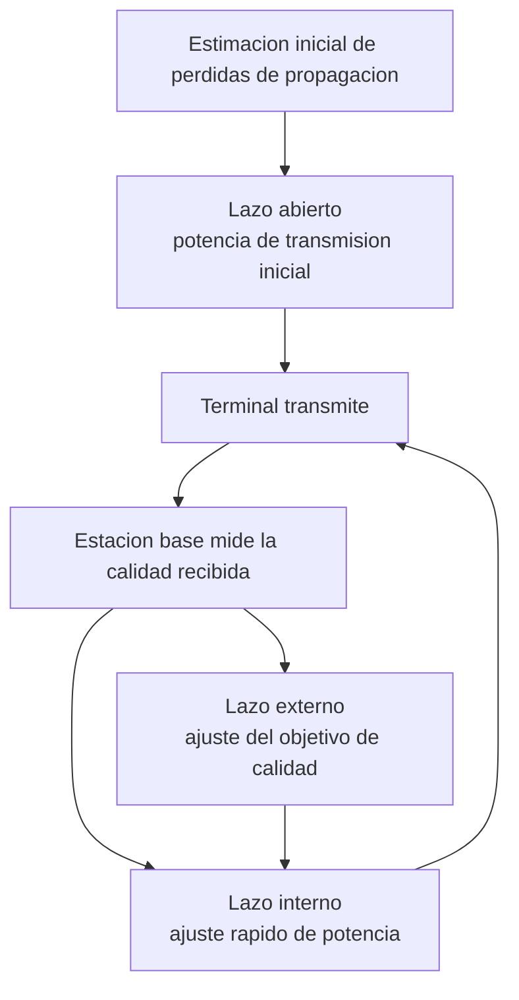
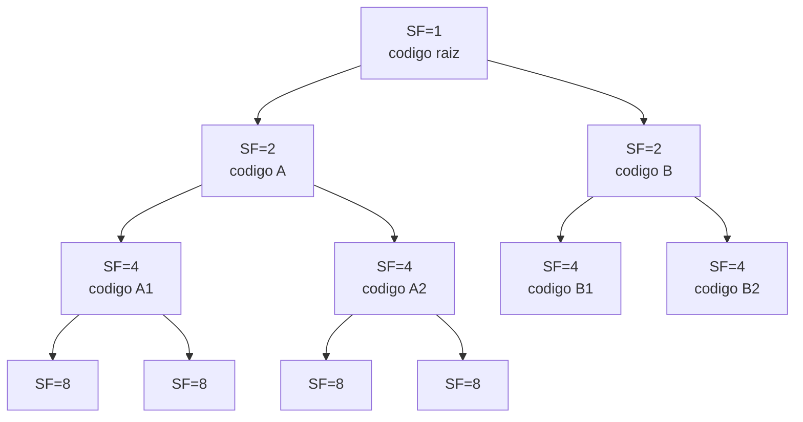

Frente al reparto planificado de la multiplexación y al reparto por contienda o por
turnos del acceso múltiple convencional, existe una tercera familia de técnicas que
divide el medio compartido mediante códigos en lugar de mediante bandas de frecuencia o
intervalos de tiempo. Este capítulo desarrolla esa familia desde su fundamento de
procesado de señal, el ensanchamiento espectral por secuencia directa, hasta su empleo
como técnica de acceso múltiple en un sistema celular real, con la asignación de códigos
ortogonales de longitud variable y los límites de capacidad que impone la interferencia
entre usuarios.

## Introducción

El **acceso múltiple por división de código**, CDMA por sus siglas en inglés, asigna a
cada usuario un código propio en lugar de una banda de frecuencia o un intervalo de
tiempo exclusivo, de modo que todos los usuarios transmiten simultáneamente sobre el
mismo ancho de banda y es el código, no el dominio de la frecuencia ni el del tiempo, el
que separa sus señales en el receptor. Esa separación por código descansa sobre una
técnica de procesado de señal previa, el **ensanchamiento espectral por secuencia
directa** (_direct sequence spread spectrum_, DS-SS), que multiplica la señal de datos
por una secuencia de mayor ritmo antes de transmitirla y ensancha su ocupación espectral
muy por encima del ancho de banda mínimo que exigiría la información que transporta.

## Secuencia directa de espectro ensanchado

### Pulso de chip y secuencia pseudoaleatoria

Un sistema DS-SS parte de una señal de datos convencional, formada por símbolos
$a\lbrack n \rbrack$ que se transmiten cada período de símbolo $T$ mediante un pulso
$p(t)$, exactamente el modelo PAM descrito para las
[modulaciones digitales](../03_modulacion/section_2_modulaciones_digitales.md). La
diferencia del sistema ensanchado es que, antes de transmitirse, esa señal se multiplica
por una **secuencia de ensanchamiento** $c(t)$, formada por una sucesión de pulsos
rectangulares de amplitud $\pm 1$ y duración $T_c$, el **período de chip**, mucho menor
que el período de símbolo. Cada uno de esos pulsos se llama **chip**, para distinguirlo
del símbolo de datos que multiplica, y sus signos siguen una **secuencia
pseudoaleatoria**: una sucesión determinista y conocida por transmisor y receptor, pero
que se comporta estadísticamente como una secuencia de signos independientes y
equiprobables.

La señal transmitida resulta de multiplicar la señal de datos por esa secuencia de chip,

$$
x(t) = a\lbrack n \rbrack \, p(t - nT) \, c(t)
$$

donde $a\lbrack n \rbrack$ es el símbolo de datos del intervalo $n$, $p(t)$ el pulso de
símbolo y $c(t)$ la secuencia de ensanchamiento, común a todo el sistema de un mismo
usuario y sincronizada en tiempo con la señal de datos. Como $c(t)$ toma únicamente los
valores $\pm 1$, la multiplicación no altera la amplitud de la señal de datos en ningún
instante, solo invierte su signo chip a chip, de modo que la energía de la señal se
conserva íntegra tras el ensanchamiento.

### Factor de ensanchamiento

La multiplicación por una secuencia que varía mucho más rápido que el símbolo de datos
traslada energía de la señal hacia frecuencias más altas, porque las variaciones bruscas
introducidas por cada chip aportan componentes espectrales de alta frecuencia que la
señal de datos original no tenía. La magnitud que cuantifica esa expansión es el
**factor de ensanchamiento**, $SF$, definido como el número de chips que caben en un
período de símbolo,

$$
SF = \frac{T}{T_c} = \frac{R_c}{R_s}
$$

donde $T$ es el período de símbolo, $T_c$ el período de chip, $R_c = 1/T_c$ el **ritmo
de chip** y $R_s = 1/T$ la velocidad de símbolo definida igual que en el capítulo de
modulaciones digitales. El ritmo de chip es un parámetro fijo del sistema, común a todos
los usuarios, mientras que el factor de ensanchamiento de un usuario concreto puede
variar si su servicio exige una velocidad de símbolo distinta: a ritmo de chip
constante, un usuario con un régimen binario más alto necesita un $SF$ menor, y uno con
un régimen binario más bajo puede permitirse un $SF$ mayor. Esta relación inversa entre
$SF$ y la velocidad de símbolo del servicio es la que después permite asignar factores
de ensanchamiento distintos a servicios de voz y de datos sobre el mismo sistema.

???+ example "Factor de ensanchamiento y ancho de banda ocupado para un servicio de voz"

    Un sistema de espectro ensanchado transmite con un ritmo de chip fijo
    $R_c = 3{,}84$ Mchip/s. Un usuario de un servicio de voz codificada emplea un
    régimen binario $R_b = 12{,}2$ kbit/s y transmite un bit por símbolo. Se pide el
    factor de ensanchamiento de ese usuario y el ancho de banda ocupado por su señal
    ensanchada, aproximado como el doble del ritmo de chip por tratarse del ancho del
    lóbulo principal de un pulso rectangular de chip.

    El período de símbolo coincide con el período de bit, $T = 1/R_b \approx 81{,}97\
    \mu\text{s}$, y el período de chip es $T_c = 1/R_c \approx 0{,}2604\ \mu\text{s}$,
    de modo que el factor de ensanchamiento resulta

    $$
    SF = \frac{T}{T_c} = \frac{R_c}{R_b} = \frac{3{,}84 \cdot 10^6}{12{,}2 \cdot 10^3}
    \approx 315
    $$

    valor que en la práctica se redondea a la potencia de dos inmediatamente inferior o
    superior según el esquema de códigos del sistema, típicamente $SF = 256$. El ancho
    de banda ocupado por la señal ensanchada es del orden de $2 R_c \approx 7{,}68$
    MHz, muy por encima de los pocos kilohercios que exigiría el mismo servicio de voz
    sin ensanchar, y ese exceso de ancho de banda es exactamente el precio que compra
    la ganancia de proceso frente a la interferencia que se cuantifica más adelante.

### Densidad espectral de potencia de la señal ensanchada

El ensanchamiento no crea potencia adicional, la redistribuye. Como el pulso de chip es
rectangular y de duración $T_c$, la densidad espectral de potencia de la señal
ensanchada sigue la misma forma general que la de cualquier señal PAM con pulso
rectangular, presentada en el capítulo de modulaciones digitales, pero evaluada con la
duración de chip en lugar de con la duración de símbolo,

$$
S_X(f) \approx P_x \, T_c \, \mathrm{sinc}^2(f T_c)
$$

donde $P_x$ es la potencia media de la señal transmitida y $\mathrm{sinc}(u) = \sin(\pi
u)/(\pi u)$. El lóbulo principal de este espectro mide $2/T_c = 2R_c$, frente a los $2/T
= 2R_s$ que ocuparía la misma señal sin ensanchar, de modo que el ancho de banda ocupado
crece en la misma proporción que el factor de ensanchamiento. Puesto que la potencia
total transmitida no cambia, y esa misma potencia se reparte ahora sobre un ancho de
banda $SF$ veces mayor, la densidad espectral de potencia en el pico del espectro se
reduce aproximadamente en ese mismo factor. Esta caída de la densidad espectral es la
que permite que varias señales ensanchadas convivan sobre el mismo ancho de banda sin
que cada una perciba a las demás como una interferencia concentrada en frecuencia, y
también la que hace que, ante un receptor no cooperativo que desconoce la secuencia de
ensanchamiento, la señal resulte indistinguible de un ruido de baja densidad espectral.

### Desensanchado en recepción

El receptor recupera la señal de datos original multiplicando de nuevo la señal recibida
por la misma secuencia de ensanchamiento empleada en el transmisor. Como cada chip de
$c(t)$ toma el valor $\pm 1$, se cumple $c(t)^2 = 1$ en todo instante, de modo que esa
segunda multiplicación deshace exactamente la primera,

$$
r(t) \, c(t) = a\lbrack n \rbrack \, p(t - nT) \, c(t)^2 = a\lbrack n \rbrack \, p(t - nT)
$$

y la señal recuperada vuelve a ocupar el ancho de banda estrecho de la señal de datos
original, lista para procesarse con el filtro adaptado y el decisor descritos para las
modulaciones digitales. Esta operación exige que el receptor conozca la secuencia de
ensanchamiento y que la aplique alineada en el tiempo con la que empleó el transmisor;
un desajuste de sincronización de un solo chip basta para que el producto ya no se
reduzca a la identidad anterior y la señal quede parcialmente ensanchada todavía.

La ventaja frente al ruido y frente a otras señales interferentes procede de que
**solo** la señal deseada se desensancha con esa multiplicación. Cualquier componente
que no esté modulada por la misma secuencia, ya sea ruido térmico de banda ancha o la
señal de otro usuario con un código distinto, permanece ensanchada tras la
multiplicación y conserva su densidad espectral de potencia baja. El filtro adaptado y
el integrador que siguen a la multiplicación concentran, en cambio, toda la energía de
la señal deseada en el ancho de banda estrecho de símbolo, de modo que la relación entre
la potencia útil y la potencia de cualquier interferencia no correlada mejora en un
factor igual al de ensanchamiento, la **ganancia de proceso**. El siguiente fragmento
comprueba numéricamente esa ganancia comparando la relación entre señal e interferencia
antes y después de desensanchar una señal contaminada por otra señal de código distinto.

```python linenums="1"
import numpy as np


def relacion_senal_interferencia(
    senal: np.ndarray, interferencia: np.ndarray
) -> float:
    """Calcula la relación entre potencia de señal e interferencia, en dB.

    Args:
        senal: Muestras de la componente de señal deseada.
        interferencia: Muestras de la componente interferente.

    Returns:
        Relación señal a interferencia, en decibelios.
    """
    potencia_senal = np.mean(senal**2)
    potencia_interferencia = np.mean(interferencia**2)
    return 10 * np.log10(potencia_senal / potencia_interferencia)


factor_ensanchamiento = 64
num_simbolos = 2000
generador = np.random.default_rng(seed=2)

# Cada usuario emplea una secuencia de chip pseudoaleatoria de valores +-1
codigo_deseado = generador.choice([-1.0, 1.0], size=factor_ensanchamiento)
codigo_interferente = generador.choice([-1.0, 1.0], size=factor_ensanchamiento)

simbolos_deseados = generador.choice([-1.0, 1.0], size=num_simbolos)
simbolos_interferentes = generador.choice([-1.0, 1.0], size=num_simbolos)

# Ensanchar repite el código de chip para cada símbolo y lo escala por el símbolo
ensanchada_deseada = np.outer(simbolos_deseados, codigo_deseado)
ensanchada_interferente = np.outer(simbolos_interferentes, codigo_interferente)
recibida = ensanchada_deseada + ensanchada_interferente

# Antes de desensanchar, ambas componentes ocupan el mismo ancho de banda
sir_antes = relacion_senal_interferencia(ensanchada_deseada, ensanchada_interferente)

# Desensanchar multiplica por el código propio e integra sobre el símbolo
desensanchada = recibida * codigo_deseado
muestra_senal = simbolos_deseados * factor_ensanchamiento
muestra_interferencia = desensanchada.sum(axis=1) - muestra_senal
sir_despues = relacion_senal_interferencia(muestra_senal, muestra_interferencia)

print(f"SIR antes de desensanchar: {sir_antes:.2f} dB")
print(f"SIR después de desensanchar: {sir_despues:.2f} dB")
print(f"Ganancia de proceso teórica: {10 * np.log10(factor_ensanchamiento):.2f} dB")
```

```plaintext title="Expected output"
SIR antes de desensanchar: -0.06 dB
SIR después de desensanchar: 17.83 dB
Ganancia de proceso teórica: 18.06 dB
```

La simulación confirma el resultado teórico: antes de desensanchar, la señal deseada y
la interferente tienen una potencia comparable porque ambas ocupan el mismo ancho de
banda, pero tras multiplicar por el código propio e integrar sobre el símbolo la señal
deseada se recompone íntegra mientras que la interferencia, modulada por un código
distinto y no correlado, solo se acumula parcialmente, y la relación entre ambas mejora
en un valor próximo al factor de ensanchamiento expresado en decibelios.

## Multiplexación de señales ensanchadas

### Secuencias ortogonales y cuasiortogonales

Cuando varios transmisores comparten el mismo tiempo y la misma frecuencia mediante
espectro ensanchado, cada uno emplea una secuencia de ensanchamiento distinta, y el
grado de separación que consigue el sistema depende de la relación entre esas
secuencias. Dos secuencias son **ortogonales** cuando su correlación cruzada, evaluada
en el desalineamiento temporal relevante, es exactamente nula, de modo que el
desensanchado con una de ellas anula por completo la componente asociada a la otra. Las
secuencias pseudoaleatorias generadas de forma independiente no cumplen esa condición de
forma exacta, sino que presentan una correlación cruzada pequeña pero distinta de cero,
y se denominan por ello **cuasiortogonales**: producen una interferencia residual entre
usuarios, moderada por el factor de ensanchamiento, en lugar de eliminarla por completo.

### Interferencia entre subcanales

La interferencia entre subcanales, también llamada interferencia de acceso múltiple,
aparece cuando la secuencia de un usuario interferente no se desensancha por completo al
multiplicarla por la secuencia del usuario deseado, dejando un residuo de energía dentro
del ancho de banda estrecho tras la integración. La magnitud de ese residuo depende del
factor de ensanchamiento, porque un $SF$ mayor reparte la energía interferente sobre más
chips y reduce la fracción que sobrevive a la integración, pero no depende de si los
transmisores están o no sincronizados entre sí: la falta de sincronización desplaza la
correlación cruzada a otro punto de su función, pero no la convierte en mayor por sí
misma. Cuando las secuencias empleadas son estrictamente ortogonales y los transmisores
están sincronizados, esta interferencia se anula en el caso ideal, lo que es
precisamente la situación que se explota en el enlace descendente de un sistema celular.


## CDMA en el enlace descendente

### Sincronización desde la estación base

En el **enlace descendente**, una única estación base genera las señales de todos los
usuarios de una celda y las transmite desde el mismo punto físico, lo que le permite
generar las secuencias de ensanchamiento de todos ellos referidas a un mismo reloj y
garantizar que llegan sincronizadas entre sí en el instante de transmisión. Esa
sincronización de origen hace viable asignar a cada usuario un código estrictamente
ortogonal a los del resto, de modo que, en ausencia de multitrayecto, la interferencia
entre subcanales del enlace descendente se anula por diseño y el único factor que limita
la calidad del enlace de un usuario es el ruido térmico, no la señal de los demás
usuarios de su propia celda.

### Pérdida de ortogonalidad por multitrayecto

Esa ortogonalidad exacta se rompe en un canal real por el mismo mecanismo que provoca el
desvanecimiento descrito para la respuesta del canal: la señal transmitida llega al
receptor por varios caminos con retardos distintos, y cada eco es una réplica de la
señal conjunta de todos los usuarios desplazada en el tiempo. El receptor puede
sincronizarse con uno de esos ecos, típicamente el más fuerte, pero los códigos de los
demás usuarios, que eran ortogonales entre sí en el instante de transmisión, dejan de
serlo respecto al eco escogido porque la correlación cruzada de un código con una
versión desplazada de otro código ya no es nula en general. El resultado es una
interferencia entre subcanales que no existía en el caso ideal sincronizado,
proporcional al número de ecos significativos y a su energía relativa, y que constituye
el principal límite de calidad del enlace descendente en un entorno con multitrayecto
pronunciado.

## CDMA en el enlace ascendente

### Asincronía entre transmisores

En el **enlace ascendente**, la situación se invierte: cada usuario transmite desde un
terminal distinto, sin ningún reloj común entre ellos más allá de la referencia de
tiempo que la propia red les distribuye con una precisión limitada, y las señales de
distintos usuarios llegan a la estación base con retardos de propagación relativos
arbitrarios y variables. Esa asincronía entre transmisores impide que la estación base
aproveche la ortogonalidad exacta de los códigos del mismo modo que en el enlace
descendente, porque la correlación cruzada entre dos códigos desplazados de forma
arbitraria no es nula aunque los códigos fueran ortogonales en el origen. En
consecuencia, el enlace ascendente de un sistema CDMA es, por construcción, un enlace
limitado por interferencia entre usuarios más que por ruido térmico, un rasgo que se
acentúa cuanto mayor es el número de terminales activos simultáneamente en la celda.

### Efecto cerca-lejos y control de potencia

La consecuencia más visible de que el enlace ascendente esté limitado por interferencia
es el **efecto cerca-lejos** (_near-far effect_): un terminal situado cerca de la
estación base llega con una atenuación de propagación mucho menor que uno situado en el
borde de la celda, de modo que, si todos transmiten con la misma potencia, la señal del
terminal cercano se recibe con una potencia muy superior a la del terminal lejano. Como
la separación entre usuarios depende de la correlación de los códigos y no es perfecta,
una interferencia mucho más potente que la señal deseada puede llegar a enmascararla por
completo tras el desensanchado, incluso si el código del interferente es nominalmente
ortogonal al propio.

La solución estructural es el **control de potencia**: cada terminal ajusta su potencia
de transmisión para que todas las señales lleguen a la estación base con una potencia
recibida similar, con independencia de la distancia de cada uno. Ese ajuste combina tres
mecanismos que actúan a distinta escala temporal. El **control de potencia en lazo
abierto** fija una potencia de transmisión inicial a partir de una estimación de las
pérdidas de propagación, típicamente la potencia recibida en el enlace descendente,
antes de que exista ningún enlace establecido con retroalimentación. El **control de
potencia en lazo interno** ajusta la potencia de forma continua y rápida a partir de la
calidad de la señal medida en el receptor, compensando las variaciones de
desvanecimiento rápido del canal. El **control de potencia en lazo externo** actúa sobre
el objetivo de calidad que persigue el lazo interno, elevándolo o rebajándolo según la
tasa de error observada a más largo plazo, de modo que el sistema converge hacia el
punto de operación que mantiene la calidad exigida con el mínimo consumo de potencia
posible.



Un efecto asociado al control de potencia y a la interferencia variable entre usuarios
es la llamada **respiración de la celda**: el área de cobertura que una estación base
puede sostener con una calidad de servicio dada no es fija, sino que se contrae cuando
crece el número de usuarios activos, porque la interferencia total que deben superar los
terminales del borde de la celda aumenta con cada usuario adicional que se admite. Un
terminal lejano, que ya transmite cerca de su potencia máxima para compensar sus
pérdidas de propagación, puede quedar enmascarado por la interferencia agregada de los
usuarios más cercanos en cuanto esa interferencia crece lo suficiente, aunque ninguno de
ellos individualmente supere su potencia asignada. Esta dependencia mutua entre
cobertura y capacidad, ausente en un sistema de acceso por división de frecuencia o de
tiempo donde cada canal físico es independiente de los demás, es una consecuencia
directa de que en CDMA todos los usuarios comparten el mismo ancho de banda y se limitan
mutuamente por interferencia.

### Relación señal a interferencia

La magnitud que resume el efecto conjunto del factor de ensanchamiento y del número de
usuarios activos es la **relación señal a interferencia**, SIR. Bajo la aproximación
habitual de que las señales de los demás usuarios, tras perder su ortogonalidad exacta,
se comportan como interferencia de banda ancha de potencia comparable a la propia, y de
que la ganancia de proceso reduce en un factor $SF$ la fracción de esa interferencia que
sobrevive al desensanchado, la relación señal a interferencia de un usuario en presencia
de $K$ usuarios activos con potencia similar en el receptor se aproxima por

$$
\mathrm{SIR} \approx \frac{SF}{K - 1}
$$

donde $SF$ es el factor de ensanchamiento del usuario y $K - 1$ el número de usuarios
interferentes, es decir, todos los usuarios activos salvo el propio. Esta expresión
asume implícitamente que la interferencia entre usuarios domina sobre el ruido térmico,
lo que es la situación habitual de un enlace ascendente cargado, y que la ortogonalidad
entre códigos no se mantiene, de modo que cada usuario adicional aporta una contribución
de interferencia comparable a la suya propia. Elevar el factor de ensanchamiento o
reducir el ritmo de bits del servicio, que son la misma acción expresada de dos formas
distintas puesto que $SF = R_c/R_b$ con el ritmo de chip fijo, mejora la relación señal
a interferencia en la misma proporción, mientras que admitir más usuarios simultáneos la
degrada.

???+ example "Relación señal a interferencia con un número dado de usuarios activos"

    Una celda opera con un factor de ensanchamiento $SF = 128$ para todos sus usuarios y
    en un instante dado tiene $K = 32$ usuarios activos en el enlace ascendente,
    recibidos con una potencia similar en la estación base tras el control de potencia.
    Se pide la relación señal a interferencia resultante y el efecto de duplicar el
    número de usuarios activos manteniendo el mismo factor de ensanchamiento.

    Con $K = 32$ usuarios, la relación señal a interferencia es

    $$
    \mathrm{SIR} \approx \frac{128}{32 - 1} = \frac{128}{31} \approx 4{,}13
    $$

    equivalente a $6{,}16$ dB. Al duplicar el número de usuarios activos a $K = 64$, la
    relación cae a $128/63 \approx 2{,}03$, es decir, $3{,}08$ dB, prácticamente la
    mitad en unidades naturales y unos tres decibelios menos en escala logarítmica. El
    resultado ilustra que la relación señal a interferencia se degrada de forma
    aproximadamente inversa con el número de usuarios, y que sostener el doble de
    tráfico con la misma calidad de enlace exigiría, en la práctica, duplicar también
    el factor de ensanchamiento o aceptar una penalización de varios decibelios en la
    calidad de la comunicación de cada usuario.

## Códigos ortogonales de longitud variable

Un sistema CDMA real no asigna a todos los usuarios el mismo factor de ensanchamiento,
porque los distintos servicios que transporta, desde voz hasta datos de alta velocidad,
exigen regímenes binarios muy distintos, y a ritmo de chip fijo un régimen binario mayor
solo es posible con un $SF$ menor. Los **códigos ortogonales de longitud variable**
(_orthogonal variable spreading factor_, OVSF) resuelven ese reparto organizando el
conjunto de códigos disponibles en un árbol binario. La raíz del árbol es un único
código de longitud mínima, y cada nodo se expande en dos códigos hijos de longitud
doble, construidos concatenando el código del nodo padre consigo mismo y con su
complemento, de modo que dos códigos de la misma generación del árbol son siempre
mutuamente ortogonales.



La propiedad que gobierna la asignación de estos códigos es que dos códigos situados en
generaciones distintas del árbol solo son ortogonales entre sí si ninguno de ellos es
antecesor o descendiente del otro. Un código de un nodo concreto se construye combinando
su código padre, de modo que asignarlo a un usuario inhabilita, para cualquier otro uso
simultáneo, tanto ese código padre como todos los códigos que descienden de él en el
árbol, porque cualquiera de ellos comparte con el código asignado una relación de
construcción que rompe la ortogonalidad exacta. Un usuario de datos de alta velocidad,
que necesita un $SF$ pequeño, ocupa por tanto un nodo cercano a la raíz del árbol y
bloquea de un solo golpe un subárbol completo de códigos de longitud mayor que, de otro
modo, habrían servido a varios usuarios de voz de menor régimen binario. Esta es la
misma flexibilidad que permite a un mismo terminal cambiar su régimen binario a lo largo
de una conexión de datos simplemente reasignándole un código de distinto factor de
ensanchamiento dentro del árbol, sin modificar ni el ritmo de chip ni el resto de la
estructura del sistema.

???+ example "Códigos disponibles en un árbol OVSF tras asignar uno de tasa alta"

    Un sistema organiza sus códigos OVSF hasta un factor de ensanchamiento máximo
    $SF = 256$. Un usuario de datos de alta velocidad recibe un único código de
    $SF = 4$ para su conexión. Se pide cuántos códigos de $SF = 256$ quedan
    inutilizables como consecuencia directa de esa asignación.

    Cada nodo del árbol en el nivel $SF = 4$ es antecesor de todos los códigos que
    descienden de él hasta el nivel $SF = 256$. El número de descendientes de un nodo
    entre dos niveles del árbol es la razón entre sus factores de ensanchamiento, ya
    que cada generación duplica el número de códigos,

    $$
    \frac{256}{4} = 64
    $$

    de modo que asignar ese único código de $SF = 4$ bloquea $64$ códigos de
    $SF = 256$ que, de no haberse producido esa asignación, habrían podido repartirse
    entre otros tantos usuarios de bajo régimen binario. El coste en códigos de tasa
    baja que impone un usuario de tasa alta crece linealmente con la razón entre ambos
    factores de ensanchamiento, lo que explica por qué un sistema con tráfico de datos
    de alta velocidad dominante agota su reserva de códigos mucho antes de agotar su
    capacidad de potencia o de interferencia.

## Límites de capacidad de un sistema CDMA

Un sistema CDMA está sujeto simultáneamente a dos límites de capacidad de naturaleza
distinta, y el que resulta más restrictivo depende de la mezcla de servicios que
transporta la celda. El primero es el límite de **códigos disponibles**: el árbol OVSF
tiene un número finito de códigos en cada nivel, y la asignación de un código de tasa
alta consume, como se ha visto, varios códigos potenciales de tasa baja, de modo que una
celda puede agotar su reserva de códigos antes de saturar ningún otro recurso. El
segundo es el límite de **interferencia**, derivado directamente de la relación señal a
interferencia: para que todos los usuarios activos mantengan una calidad de enlace
aceptable, su relación señal a interferencia debe mantenerse por encima de un umbral
mínimo $\mathrm{SIR}_{\text{req}}$, lo que impone un número máximo de usuarios
simultáneos

$$
K_{\max} = 1 + \frac{SF}{\mathrm{SIR}_{\text{req}}}
$$

expresión que se obtiene despejando $K$ de la relación señal a interferencia presentada
antes e imponiendo que no baje del umbral requerido. A diferencia del límite de códigos,
este límite de interferencia es progresivo y no un tope abrupto: la calidad del enlace
se degrada de forma continua a medida que se acerca a $K_{\max}$, lo que da lugar a la
respiración de la celda descrita para el control de potencia, en la que el área de
cobertura sostenible se contrae con la carga de tráfico en lugar de mantenerse constante
hasta un límite fijo de usuarios. Un sistema bien dimensionado equilibra ambos límites,
de modo que ni la reserva de códigos ni la interferencia agregada se convierten por
separado en el cuello de botella dominante de la celda.

Otras técnicas de acceso múltiple resuelven el mismo problema de repartir un medio
compartido dividiendo en cambio el dominio de la frecuencia entre subportadoras
ortogonales, una familia que se trata en detalle en la sección siguiente de este mismo
tema.
