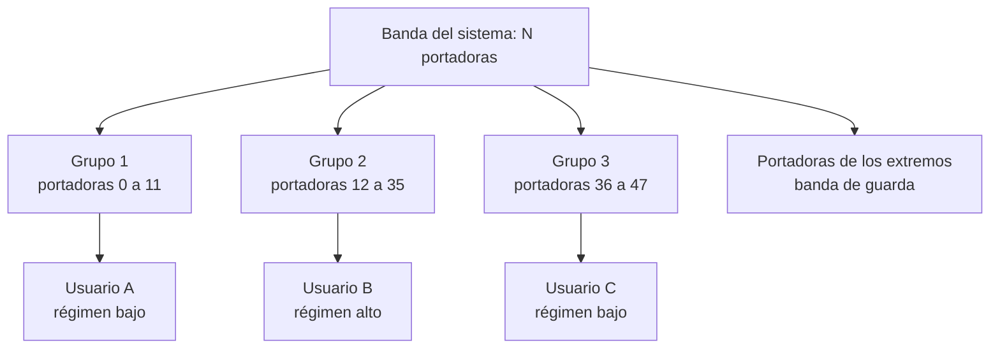
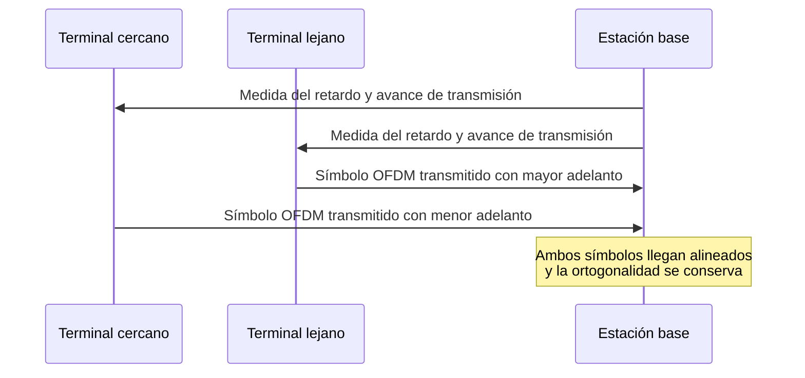
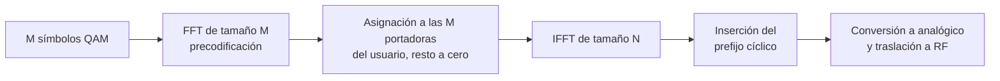

Un canal de radio con ecos distorsiona cualquier señal cuyo ancho de banda supere el
ancho de banda de coherencia del medio, y esa distorsión crece con la velocidad de
transmisión que se pretende alcanzar. Este capítulo describe la familia de técnicas que
resuelve el problema por la vía contraria a la igualación en el tiempo: en lugar de
corregir la distorsión de un canal ancho, se fragmenta ese canal en un número elevado de
subcanales estrechos, cada uno de los cuales resulta prácticamente plano, y se transmite
sobre ellos de forma simultánea. El resultado es la multiplexación por división
ortogonal de frecuencia, OFDM, junto con su variante de acceso múltiple, OFDMA, y su
alternativa de portadora única, SC-FDM, que corrige el principal inconveniente de ambas.

## Introducción

La **multiplexación por división ortogonal de frecuencia** (_orthogonal frequency
division multiplexing_, OFDM) es una técnica de transmisión que reparte un flujo de
información entre un número elevado de portadoras de banda estrecha, mutuamente
ortogonales, moduladas cada una con un esquema convencional como la QAM descrita en
[modulaciones digitales](../03_modulacion/section_2_modulaciones_digitales.md). La señal
transmitida es la suma de todas esas portadoras, y la ortogonalidad entre ellas es lo
que permite al receptor separar de nuevo la contribución de cada una a pesar de que sus
espectros se solapan.

El interés de este reparto no está en la multiplexación por sí misma, que ya resuelve la
división en frecuencia convencional descrita en
[multiplexación](section_1_multiplexacion.md), sino en la relación entre el ancho de
banda de cada portadora y el comportamiento del canal. Un canal con ecos presenta una
respuesta en frecuencia con máximos y mínimos cuyo ritmo de variación viene fijado por
el ancho de banda de coherencia, tal como se desarrolla en
[desvanecimiento y respuesta del canal](../02_canal/section_2_desvanecimiento_y_respuesta_del_canal.md).
Una señal de banda ancha ocupa muchas veces ese ancho de banda de coherencia y sufre por
tanto una distorsión severa, mientras que cada portadora de un sistema OFDM ocupa una
fracción pequeña de él y experimenta una ganancia compleja aproximadamente constante.
OFDM convierte así un problema de igualación de un canal selectivo en un conjunto de
problemas triviales: la corrección de una única ganancia compleja por portadora.

El precio de esa conversión se paga en tres frentes que este capítulo recorre en orden.
La ortogonalidad solo se sostiene si el canal no introduce transitorios dentro del
intervalo de observación del receptor, lo que obliga a insertar una extensión cíclica
delante de cada símbolo y sacrifica una fracción del tiempo de transmisión. La suma de
un número elevado de portadoras produce picos de potencia instantánea muy por encima del
valor medio, lo que limita el rendimiento del amplificador. Y la ortogonalidad exige, en
el sentido ascendente, una sincronización entre terminales que el sentido descendente no
necesita.

## Transmisión multipulso

OFDM es un caso particular de una idea más general, la **transmisión multipulso**, que
consiste en transmitir varios flujos de información de forma simultánea sobre el mismo
canal empleando formas de pulso distintas y ortogonales entre sí. Esta familia es la que
la clasificación de [multiplexación](section_1_multiplexacion.md) denomina división por
pulsos, y conviene desarrollarla antes de particularizar a portadoras complejas, porque
las condiciones que garantizan la separación de los flujos y las circunstancias que la
destruyen son las mismas en todos los casos.

### Pulsos ortogonales simultáneos

En una transmisión de un solo flujo, la señal se construye modulando la amplitud de un
único pulso repetido cada periodo de símbolo. La transmisión multipulso emplea en su
lugar $N$ pulsos distintos que ocupan el mismo intervalo temporal, cada uno modulado por
su propio símbolo:

$$
s(t) = \sum_{k=0}^{N-1} a_k\, p_k(t)
$$

donde $a_k$ es el símbolo que transporta el subcanal $k$, tomado de una constelación
como las descritas en
[modulaciones digitales](../03_modulacion/section_2_modulaciones_digitales.md), y
$p_k(t)$ es el pulso asociado a ese subcanal. Todos los pulsos coinciden en el tiempo y
comparten la misma banda de frecuencia, de modo que la separación entre subcanales no
puede apoyarse ni en el tiempo ni en la frecuencia, sino únicamente en la forma de cada
pulso.

La condición que hace posible esa separación es la **ortogonalidad** entre pulsos, que
se expresa mediante el producto interno de dos de ellos sobre el intervalo de símbolo:

$$
\langle p_k, p_l \rangle = \int_{0}^{T_S} p_k(t)\, p_l^{*}(t)\, dt = E_p\, \delta_{kl}
$$

donde $T_S$ es la duración del intervalo de símbolo, $p_l^{*}(t)$ es el conjugado
complejo del pulso $l$, $E_p$ es la energía de cada pulso y $\delta_{kl}$ es la delta de
Kronecker, que vale la unidad cuando $k = l$ y cero en cualquier otro caso. Los pulsos
son complejos en el caso general, porque cada subcanal transporta una componente en fase
y otra en cuadratura, de ahí la conjugación de uno de los dos factores.

### Detección por correlación

La ortogonalidad se explota en el receptor mediante **correlación** con el pulso
conjugado del subcanal que se desea recuperar. Partiendo de la señal recibida en
ausencia de distorsión y de ruido, la correlación con $p_l^{*}(t)$ da:

$$
\int_{0}^{T_S} s(t)\, p_l^{*}(t)\, dt = \sum_{k=0}^{N-1} a_k \langle p_k, p_l \rangle
= a_l\, E_p
$$

El resultado depende exclusivamente del símbolo $a_l$, porque todos los términos con $k
\neq l$ se anulan por ortogonalidad. Dividiendo por la energía del pulso se recupera el
símbolo transmitido, y repitiendo la operación con los $N$ pulsos se recuperan los $N$
subcanales de forma independiente. Esta operación es el filtro adaptado descrito en
[modulaciones digitales](../03_modulacion/section_2_modulaciones_digitales.md), aplicado
ahora una vez por subcanal, y conserva todas sus propiedades: la relación señal-ruido a
la salida depende de la energía del pulso y no de su forma, de modo que el reparto en
subcanales no degrada por sí mismo el comportamiento frente al ruido.

### Asincronía entre transmisores e interferencia entre canales

La ortogonalidad de la expresión anterior se define sobre un intervalo de integración
concreto, el que va de $0$ a $T_S$. Si los pulsos de los distintos subcanales no llegan
alineados a ese intervalo, el producto interno de dos pulsos distintos deja de anularse
y la correlación destinada al subcanal $l$ recoge contribuciones de los demás. Esa
contribución indeseada se denomina **interferencia entre canales** (_inter-carrier
interference_, ICI).

Dos causas producen ese desalineamiento. La primera es la **asincronía entre
transmisores**: cuando los pulsos proceden de equipos distintos situados a distancias
distintas del receptor, sus tiempos de propagación difieren y sus intervalos de símbolo
no coinciden, por mucho que cada transmisor respete su propio reloj. La segunda son los
**ecos** del canal, porque cada réplica retardada de un pulso llega desplazada respecto
al intervalo de integración y actúa, a efectos de ortogonalidad, igual que un transmisor
desincronizado. El perfil de retardos que da lugar a esas réplicas es el que
[desvanecimiento y respuesta del canal](../02_canal/section_2_desvanecimiento_y_respuesta_del_canal.md)
caracteriza mediante la respuesta al impulso y la dispersión temporal.

Ambas causas reaparecen a lo largo del capítulo con soluciones distintas. Los ecos se
neutralizan mediante la extensión cíclica descrita más adelante, sin necesidad de
eliminarlos. La asincronía entre transmisores solo puede corregirse obligando a los
terminales a adelantar su transmisión hasta que sus señales lleguen alineadas al
receptor, requisito propio del enlace ascendente que se trata al describir el acceso
múltiple.

## Multiplexación por división de frecuencia ortogonal

OFDM concreta la transmisión multipulso eligiendo como conjunto de pulsos ortogonales un
banco de portadoras complejas equiespaciadas en frecuencia. Esa elección no es una entre
muchas posibles: es la que admite una implementación mediante transformadas discretas de
Fourier, y por tanto la que hace viable un sistema con miles de subcanales sin un coste
de procesado prohibitivo.

### Portadoras complejas ortogonales

El pulso asignado al subcanal $k$ en un sistema OFDM es una portadora compleja de
frecuencia $k\Delta f$, limitada al intervalo de símbolo:

$$
p_k(t) = e^{\,j2\pi k \Delta f\, t}, \qquad t \in \lbrack 0, T_S)
$$

donde $\Delta f$ es la separación entre portadoras contiguas y $T_S$ es la duración útil
del símbolo. Cada portadora se modula en amplitud y en fase con un símbolo QAM, lo que
equivale a transmitir de forma simultánea una componente en fase y otra en cuadratura
sobre cada subcanal.

La condición de ortogonalidad entre dos de estas portadoras se obtiene evaluando su
producto interno sobre el intervalo de símbolo:

$$
\frac{1}{T_S}\int_{0}^{T_S} e^{\,j2\pi k \Delta f\, t}\, e^{-j2\pi l \Delta f\, t}\, dt
= \frac{1}{T_S}\int_{0}^{T_S} e^{\,j2\pi (k-l) \Delta f\, t}\, dt
$$

La integral de una exponencial compleja sobre un intervalo que contiene un número entero
de sus periodos es nula. Para $k \neq l$, el integrando completa exactamente $(k-l)$
periodos en el intervalo $T_S$ si y solo si la separación entre portadoras cumple:

$$
\Delta f = \frac{1}{T_S}
$$

Esta igualdad es la condición fundamental de un sistema OFDM y liga de forma rígida dos
parámetros que en otras técnicas se eligen por separado. Un sistema con portadoras muy
próximas entre sí necesita, por construcción, símbolos largos, y un sistema de símbolos
cortos obliga a separar mucho sus portadoras. Todo el dimensionado gira alrededor de esa
relación inversa, porque las dos restricciones que impone el canal, la dispersión
temporal y la dispersión Doppler, tiran de ella en sentidos opuestos.

### Separación entre portadoras y ancho de banda

Cada portadora, al estar limitada a un intervalo de duración $T_S$, no ocupa una única
frecuencia sino un espectro con forma de seno cardinal centrado en $k\Delta f$, cuyo
primer nulo se sitúa precisamente a una distancia $\Delta f$ de su centro. Los espectros
de portadoras contiguas se solapan de forma apreciable, pero el máximo de cada portadora
coincide con un nulo del espectro de todas las demás, lo que es la lectura frecuencial
de la condición de ortogonalidad anterior.

Esa propiedad marca la diferencia esencial frente a la división en frecuencia
convencional. La FDM descrita en [multiplexación](section_1_multiplexacion.md) necesita
reservar una banda de guarda entre portadoras contiguas para absorber la imperfección de
los filtros, capacidad que no transporta información. OFDM prescinde de esas bandas de
guarda, porque la separación entre subcanales no se consigue filtrando sino
correlacionando. El ancho de banda ocupado es, en consecuencia, el producto del número
de portadoras por su separación:

$$
B_w = N_u \Delta f
$$

donde $N_u$ es el número de portadoras efectivamente empleadas para transmitir. Un
sistema real no utiliza todas las disponibles: reserva las de los extremos como banda de
guarda del conjunto, para que el espectro decaiga antes del borde de la banda asignada,
y con frecuencia deja sin usar la portadora central por coincidir con la frecuencia de
la portadora de radiofrecuencia.

### Implementación digital con IFFT y FFT

La señal OFDM, muestreada a intervalos $T_M = T_S / N$ dentro del intervalo útil del
símbolo, toma en el instante $n T_M$ el valor:

$$
x\lbrack n \rbrack = \frac{1}{\sqrt{N}} \sum_{k=0}^{N-1} X_k\,
e^{\,j2\pi k n / N}, \qquad n = 0, 1, \ldots, N-1
$$

donde $X_k$ es el símbolo QAM que modula la portadora $k$. Esta expresión es la
**transformada discreta de Fourier inversa** (IDFT) de la secuencia de símbolos, el
resultado de mayor consecuencia práctica de toda la técnica: generar una señal OFDM no
exige un banco de $N$ osciladores y $N$ moduladores, sino una única transformada. El
receptor recupera los símbolos aplicando la **transformada discreta de Fourier** (DFT) a
las muestras recibidas, versión discreta de la correlación con cada portadora conjugada.

Cuando $N$ es una potencia de dos, la transformada se calcula mediante los algoritmos de
**transformada rápida de Fourier** (IFFT en el transmisor y FFT en el receptor), cuyo
coste crece como $N \log_2 N$ en lugar de como $N^2$. Esa reducción hace viables los
sistemas con miles de portadoras, y es la razón por la que el número de portadoras de
todo sistema OFDM real es una potencia de dos.


El código siguiente implementa el modulador y el demodulador completos en dos funciones,
transmite varios símbolos OFDM de 64 portadoras moduladas en 16-QAM y comprueba que la
cadena reconstruye los símbolos sin error en ausencia de canal. La última pareja de
cifras compara el coste de calcular la transformada de forma directa y mediante FFT.

```python linenums="1"
import numpy as np


def modula_ofdm(simbolos: np.ndarray, longitud_prefijo: int) -> np.ndarray:
    """Modula símbolos OFDM mediante la IDFT e inserta el prefijo cíclico.

    Args:
        simbolos: Matriz de símbolos QAM con un símbolo OFDM por fila y una
            columna por portadora.
        longitud_prefijo: Número de muestras del prefijo cíclico.

    Returns:
        Vector de muestras temporales de la señal OFDM.
    """
    # La IDFT ortonormal convierte cada fila de portadoras en muestras de tiempo
    muestras = np.fft.ifft(simbolos, axis=-1, norm="ortho")
    # El prefijo cíclico replica la cola del símbolo al comienzo del mismo
    prefijo = muestras[:, -longitud_prefijo:]
    return np.concatenate((prefijo, muestras), axis=-1).ravel()


def demodula_ofdm(
    muestras: np.ndarray, num_portadoras: int, longitud_prefijo: int
) -> np.ndarray:
    """Descarta el prefijo cíclico y recupera las portadoras con la DFT."""
    bloques = muestras.reshape(-1, num_portadoras + longitud_prefijo)
    # El prefijo solo absorbe el transitorio del canal, no aporta información
    utiles = bloques[:, longitud_prefijo:]
    return np.fft.fft(utiles, axis=-1, norm="ortho")


num_portadoras = 64
longitud_prefijo = 16
num_simbolos = 4
generador = np.random.default_rng(seed=0)
niveles = np.array([-3.0, -1.0, 1.0, 3.0]) / np.sqrt(10.0)
reales = generador.choice(niveles, size=(num_simbolos, num_portadoras))
imaginarios = generador.choice(niveles, size=(num_simbolos, num_portadoras))
simbolos = reales + 1j * imaginarios
transmitida = modula_ofdm(simbolos, longitud_prefijo)
recibidos = demodula_ofdm(transmitida, num_portadoras, longitud_prefijo)

muestras_por_simbolo = num_portadoras + longitud_prefijo
error = np.max(np.abs(recibidos - simbolos))
print(f"Muestras por simbolo OFDM: {muestras_por_simbolo}")
print(f"Muestras totales transmitidas: {transmitida.size}")
print(f"Error maximo de reconstruccion: {error:.2e}")
print(f"Potencia media de la senal: {np.mean(np.abs(transmitida) ** 2):.3f}")
productos_dft = num_portadoras**2
productos_fft = num_portadoras * np.log2(num_portadoras) / 2
print(f"Productos de una DFT directa: {productos_dft}")
print(f"Productos de una FFT: {productos_fft:.0f}")
```

```plaintext title="Expected output"
Muestras por simbolo OFDM: 80
Muestras totales transmitidas: 320
Error maximo de reconstruccion: 4.97e-16
Potencia media de la senal: 1.042
Productos de una DFT directa: 4096
Productos de una FFT: 192
```

El error de reconstrucción queda en el orden de la precisión numérica, lo que confirma
que la cadena IDFT-DFT recupera los símbolos de forma exacta. Con solo 64 portadoras, el
cálculo directo de la transformada exigiría más de veinte veces los productos que emplea
la FFT, y esa proporción crece de forma lineal con el número de portadoras.

## Canales con ecos

Todo lo anterior supone un canal que entrega la señal sin réplicas retardadas. Un canal
de radio real no cumple esa hipótesis, y el efecto de sus ecos sobre un sistema
multiportadora tiene dos manifestaciones que exigen remedios diferentes. La primera es
la **interferencia entre símbolos** (_intersymbol interference_, ISI): las réplicas
retardadas del símbolo anterior siguen llegando cuando ya ha comenzado el intervalo del
símbolo actual, y se suman a él. La segunda es la interferencia entre canales ya
descrita: dentro del intervalo de observación del símbolo actual, las réplicas
retardadas de sus propias portadoras no completan un número entero de periodos, de modo
que la ortogonalidad se incumple y cada correlación recoge energía de las portadoras
vecinas. La ISI procede del símbolo precedente y la ICI del propio símbolo, pero ambas
tienen el mismo origen físico, que es el transitorio que el canal introduce al comienzo
de cada intervalo.

### Intervalo de guarda

El remedio inmediato frente a la ISI consiste en dejar un **intervalo de guarda** de
duración $T_G$ entre símbolos consecutivos, durante el cual no se transmite información.
Si ese intervalo supera la dispersión temporal máxima del canal, las réplicas retardadas
de un símbolo se extinguen antes de que comience el intervalo útil del siguiente y la
ISI desaparece:

$$
T_G \ge \Delta\tau_\text{máx}
$$

donde $\Delta\tau_\text{máx}$ es el retardo del eco más tardío que llega con potencia
apreciable, magnitud que los perfiles de propagación normalizados descritos en
[desvanecimiento y respuesta del canal](../02_canal/section_2_desvanecimiento_y_respuesta_del_canal.md)
fijan para cada entorno.

El intervalo de guarda resuelve la ISI, pero no la ICI. Durante el intervalo útil, cada
portadora arranca con un transitorio, porque sus propios ecos todavía no han alcanzado
el régimen permanente, y ese transitorio impide que la integral de correlación abarque
un número entero de periodos. Un intervalo de guarda vacío entrega al receptor un
símbolo libre de contaminación del anterior pero cuyas portadoras han dejado de ser
ortogonales entre sí, de modo que sustituye un problema por otro y sacrifica tiempo de
transmisión para hacerlo.

### Prefijo cíclico

La solución que hace practicable OFDM consiste en no dejar vacío el intervalo de guarda,
sino rellenarlo con una copia de las últimas muestras del propio símbolo. Esa copia se
denomina **prefijo cíclico** (_cyclic prefix_) y su longitud, expresada en muestras, se
designa habitualmente por $E$, de modo que $T_G = E\, T_M$.


El efecto de esa copia es que la señal recibida durante el intervalo útil, una vez
descartado el prefijo, coincide con la **convolución circular** de las $N$ muestras del
símbolo con la respuesta al impulso del canal, en lugar de con su convolución lineal. La
diferencia es decisiva, porque la DFT diagonaliza la convolución circular: si $h\lbrack
n \rbrack$ es la respuesta al impulso discreta del canal y $H_k$ su DFT de $N$ puntos,
el símbolo recibido en la portadora $k$ resulta ser:

$$
Y_k = H_k X_k + W_k
$$

donde $X_k$ es el símbolo transmitido en esa portadora, $H_k$ es la ganancia compleja
que el canal le aplica y $W_k$ es la contribución del ruido. La expresión no contiene
ningún término cruzado con portadoras distintas de $k$, de modo que la ortogonalidad se
ha restituido íntegramente y la ICI ha desaparecido. Un canal selectivo en frecuencia se
ha transformado en $N$ canales planos independientes, cada uno caracterizado por un
único número complejo.

Esta propiedad se sostiene mientras la respuesta al impulso del canal quepa dentro del
prefijo. Expresada en muestras, la condición es que la longitud $L$ de la respuesta al
impulso cumpla $L - 1 \le E$, versión discreta de la condición $T_G \ge
\Delta\tau_\text{máx}$ enunciada más arriba. Cuando se incumple, reaparecen
simultáneamente la ISI y la ICI, y su severidad crece con la parte de la respuesta del
canal que queda fuera del prefijo.

El código siguiente cuantifica ese comportamiento. Reutiliza las funciones anteriores,
hace pasar la señal por un canal de doce ecos de amplitud decreciente y mide, para
distintas longitudes de prefijo, el error cuadrático medio que queda tras corregir la
ganancia de cada portadora.

```python linenums="1"
def error_cuadratico_relativo(
    simbolos: np.ndarray, respuesta_canal: np.ndarray, longitud_prefijo: int
) -> float:
    """Mide el error residual tras ecualizar, relativo a la potencia de símbolo.

    Returns:
        Error cuadrático medio en decibelios.
    """
    num_portadoras = simbolos.shape[-1]
    transmitida = modula_ofdm(simbolos, longitud_prefijo)
    recibida = np.convolve(transmitida, respuesta_canal)[: transmitida.size]
    recibidos = demodula_ofdm(recibida, num_portadoras, longitud_prefijo)
    # Ecualizador de un solo coeficiente por portadora
    ecualizados = recibidos / np.fft.fft(respuesta_canal, num_portadoras)
    error = np.mean(np.abs(ecualizados - simbolos) ** 2)
    return 10.0 * np.log10(error / np.mean(np.abs(simbolos) ** 2))


num_portadoras = 64
num_simbolos = 200
generador = np.random.default_rng(seed=1)
niveles = np.array([-3.0, -1.0, 1.0, 3.0]) / np.sqrt(10.0)
simbolos = generador.choice(niveles, size=(num_simbolos, num_portadoras)) + 1j * (
    generador.choice(niveles, size=(num_simbolos, num_portadoras))
)
# Canal con doce ecos de amplitud decreciente y fase aleatoria
retardos = np.arange(12)
amplitudes = np.exp(-retardos / 4.0)
fases = generador.uniform(0.0, 2.0 * np.pi, retardos.size)
respuesta_canal = amplitudes * np.exp(1j * fases)

for longitud_prefijo in (16, 11, 8, 4):
    error_db = error_cuadratico_relativo(simbolos, respuesta_canal, longitud_prefijo)
    holgura = longitud_prefijo - (respuesta_canal.size - 1)
    print(
        f"Prefijo {longitud_prefijo:2d} muestras, "
        f"holgura {holgura:3d}: {error_db:6.1f} dB"
    )
```

```plaintext title="Expected output"
Prefijo 16 muestras, holgura   5: -305.8 dB
Prefijo 11 muestras, holgura   0: -305.8 dB
Prefijo  8 muestras, holgura  -3:  -25.8 dB
Prefijo  4 muestras, holgura  -7:  -15.0 dB
```

Las cifras reproducen con nitidez el carácter abrupto de la condición. Con un prefijo de
16 muestras el error queda en el nivel de la precisión de la aritmética en punto
flotante, es decir, la cadena es exacta. Con 11 muestras, justo la longitud del canal
menos uno, el error sigue siendo nulo: alargar el prefijo por encima de ese valor no
aporta nada. Con 8 muestras aparece un error de $-26$ dB respecto a la potencia de
símbolo, suficiente para dispersar la constelación recibida, y con 4 muestras alcanza
$-15$ dB, un nivel que una constelación de 16-QAM ya no tolera. Esa transición entre el
error nulo y la degradación severa, gobernada únicamente por la relación entre el
prefijo y la dispersión del canal, convierte el dimensionado del prefijo en la decisión
más crítica del diseño.

### Ecualizador de frecuencia

Dado que el canal queda reducido a una ganancia compleja por portadora, corregirlo exige
un único producto por portadora. El bloque que realiza esa corrección es el
**ecualizador de frecuencia** (_frequency domain equalizer_, FEQ), cuya salida es:

$$
\hat{X}_k = \frac{Y_k}{\hat{H}_k}
$$

donde $\hat{H}_k$ es la estimación de la ganancia del canal en la portadora $k$,
obtenida a partir de símbolos de referencia conocidos que el transmisor inserta en
portadoras e instantes predeterminados. La comparación con la igualación en el dominio
del tiempo descrita en
[modulaciones digitales](../03_modulacion/section_2_modulaciones_digitales.md) es
inmediata: allí el igualador es un filtro con múltiples coeficientes que debe invertir
la respuesta del canal sobre toda la banda, mientras que aquí basta una división
escalar. Esa reducción de complejidad es el segundo gran argumento a favor de OFDM,
después de la inmunidad frente a la selectividad en frecuencia.

El ecualizador hereda la limitación fundamental de toda igualación: en las portadoras
donde el canal presenta un mínimo profundo, la división amplifica el ruido en la misma
proporción en que corrige la señal. Las portadoras no ofrecen por tanto la misma
calidad, y un sistema bien diseñado adapta la constelación de cada una a su relación
señal-ruido, con constelaciones densas en las portadoras favorecidas y reducidas, o
ninguna transmisión, en las que caen en un mínimo del canal.

El código siguiente hace pasar la señal por un canal con un rayo directo y tres ecos,
mide la dispersión de ganancias entre portadoras y compara el error antes y después del
ecualizador. Reutiliza las funciones de modulación y demodulación definidas más arriba.

```python linenums="1"
num_portadoras = 64
longitud_prefijo = 16
num_simbolos = 8
generador = np.random.default_rng(seed=3)
niveles = np.array([-3.0, -1.0, 1.0, 3.0]) / np.sqrt(10.0)
reales = generador.choice(niveles, size=(num_simbolos, num_portadoras))
imaginarios = generador.choice(niveles, size=(num_simbolos, num_portadoras))
simbolos = reales + 1j * imaginarios
# Canal con un rayo directo y tres ecos retardados respecto a el
respuesta_canal = np.array([1.0, 0.0, 0.6 - 0.3j, 0.0, 0.0, 0.25j, 0.15])
transmitida = modula_ofdm(simbolos, longitud_prefijo)
recibida = np.convolve(transmitida, respuesta_canal)[: transmitida.size]
recibidos = demodula_ofdm(recibida, num_portadoras, longitud_prefijo)
# La DFT de la respuesta al impulso da la ganancia compleja de cada portadora
ganancia = np.fft.fft(respuesta_canal, num_portadoras)
ecualizados = recibidos / ganancia

modulos = np.abs(ganancia)
print(f"Longitud del canal: {respuesta_canal.size} muestras")
print(f"Prefijo ciclico: {longitud_prefijo} muestras")
print(f"Ganancia minima entre portadoras: {modulos.min():.3f}")
print(f"Ganancia maxima entre portadoras: {modulos.max():.3f}")
print(f"Error maximo sin ecualizar: {np.max(np.abs(recibidos - simbolos)):.3f}")
print(f"Error maximo tras el ecualizador: {np.max(np.abs(ecualizados - simbolos)):.2e}")
```

```plaintext title="Expected output"
Longitud del canal: 7 muestras
Prefijo ciclico: 16 muestras
Ganancia minima entre portadoras: 0.025
Ganancia maxima entre portadoras: 1.935
Error maximo sin ecualizar: 1.433
Error maximo tras el ecualizador: 1.76e-14
```

El canal reparte entre las portadoras ganancias que van de 0,025 a 1,935, casi cuarenta
decibelios de diferencia entre la portadora mejor tratada y la que cae en el mínimo más
profundo, sobre un ancho de banda de solo 64 portadoras. Sin ecualizar, el error alcanza
valores del orden de la propia amplitud de la constelación y ninguna decisión de símbolo
sería fiable. Tras dividir por la ganancia de cada portadora, el error vuelve al nivel
de la precisión numérica, aunque en la portadora de ganancia 0,025 esa corrección
multiplica por cuarenta y amplificaría en la misma medida cualquier ruido presente en
ella.

## Parámetros y fórmulas de un sistema OFDM

Las relaciones deducidas hasta aquí fijan un conjunto reducido de parámetros de los que
se derivan todas las magnitudes de interés de un sistema OFDM. La tabla siguiente reúne
la notación empleada en el resto del capítulo.

| Parámetro       | Significado                                              |
| --------------- | -------------------------------------------------------- |
| $N$             | Número total de portadoras, potencia de dos.             |
| $N_u$           | Número de portadoras útiles que transportan información. |
| $\Delta f$      | Separación entre portadoras contiguas.                   |
| $T_S$           | Duración útil del símbolo, sin prefijo.                  |
| $E$             | Longitud del prefijo cíclico, en muestras.               |
| $T_G$           | Duración del prefijo cíclico.                            |
| $T_\text{OFDM}$ | Duración total del símbolo OFDM, prefijo incluido.       |
| $T_M$           | Periodo de muestreo.                                     |
| $f_M$           | Frecuencia de muestreo.                                  |
| $f_\text{OFDM}$ | Frecuencia de símbolo OFDM.                              |
| $B_w$           | Ancho de banda ocupado.                                  |
| $\bar{B}$       | Número medio de bits por símbolo de constelación.        |
| $\eta$          | Eficiencia asociada al prefijo cíclico.                  |
| $R_B$           | Régimen binario.                                         |

### Número de portadoras, periodo de símbolo y periodo de guarda

El punto de partida del dimensionado es la condición de ortogonalidad, que liga la
separación entre portadoras con la duración útil del símbolo:

$$
\Delta f = \frac{1}{T_S}
$$

El muestreo de la señal dentro del intervalo útil reparte $N$ muestras en $T_S$, de
donde se obtienen el periodo y la frecuencia de muestreo:

$$
T_M = \frac{T_S}{N}, \qquad f_M = \frac{1}{T_M} = N \Delta f
$$

La frecuencia de muestreo coincide, por tanto, con el ancho de banda que abarcaría el
conjunto completo de las $N$ portadoras. El prefijo cíclico ocupa $E$ muestras de ese
mismo ritmo, lo que fija su duración y la duración total del símbolo:

$$
T_G = E\, T_M, \qquad T_\text{OFDM} = T_S + T_G = (N + E)\, T_M
$$

$$
f_\text{OFDM} = \frac{1}{T_\text{OFDM}}
$$

Conviene ser preciso sobre qué magnitudes afecta el prefijo. El prefijo **se añade** a
la duración útil del símbolo, no se descuenta de ella: la parte útil sigue durando $T_S$
y la separación entre portadoras sigue valiendo $1/T_S$, de modo que el prefijo no
altera ni esa separación ni el ancho de banda ocupado. Lo que reduce es la frecuencia de
símbolo, porque cada símbolo tarda ahora $T_S + T_G$ en transmitirse, y con ella el
régimen binario y la eficiencia espectral. El coste del prefijo se paga íntegramente en
el dominio del tiempo.

Las tres restricciones que fijan el dimensionado provienen del canal y del propio
sistema. La primera es la dispersión temporal, que impone $T_G \ge
\Delta\tau_\text{máx}$ y empuja el prefijo hacia valores largos. La segunda es la
eficiencia, que exige $T_G \ll T_S$ y, por la relación inversa entre $T_S$ y $\Delta f$,
empuja la separación entre portadoras hacia valores pequeños. La tercera es la variación
temporal del canal: el símbolo debe ser mucho más corto que el tiempo de coherencia, lo
que en el dominio de la frecuencia equivale a exigir que la separación entre portadoras
supere ampliamente la dispersión Doppler máxima:

$$
\Delta f \gg f_{d,\text{máx}}
$$

Las dos últimas restricciones tiran en sentidos opuestos y acotan la separación entre
portadoras por arriba y por abajo, lo que deja un margen de elección estrecho una vez
fijados el entorno de propagación y la movilidad máxima que debe soportarse.

???+ example "Dimensionado de la separación entre portadoras y del prefijo cíclico"

    Se desea desplegar un sistema OFDM de banda ancha en un entorno urbano con una
    dispersión temporal máxima de $\Delta\tau_\text{máx} = 5\ \mu\text{s}$, que debe dar
    servicio a terminales que se desplazan hasta 120 km/h sobre una portadora de 2 GHz.
    Ambas cifras acotan la separación entre portadoras por extremos opuestos.

    La dispersión temporal fija el ancho de banda de coherencia, y con él el límite
    superior de la separación entre portadoras, porque cada portadora debe experimentar
    un canal plano. Exigiendo que la separación no supere su décima parte:

    $$
    B_c \sim \frac{1}{\Delta\tau_\text{máx}} = 200\ \text{kHz}
    \quad \Rightarrow \quad \Delta f \le 20\ \text{kHz}
    $$

    La movilidad fija el límite inferior. Con
    $v = 120\ \text{km/h} = 33{,}3\ \text{m/s}$ y $f_c = 2\ \text{GHz}$, el desplazamiento
    Doppler máximo es:

    $$
    f_{d,\text{máx}} = \frac{v f_c}{c} =
    \frac{33{,}3 \times 2 \times 10^{9}}{3 \times 10^{8}} = 222\ \text{Hz}
    $$

    Exigiendo que la separación entre portadoras supere en al menos cincuenta veces esa
    cifra, para que el desplazamiento Doppler resulte despreciable frente a ella, se
    obtiene $\Delta f \ge 11{,}1\ \text{kHz}$. La ventana de diseño es por tanto el
    intervalo de 11,1 a 20 kHz, y un valor de $\Delta f = 15\ \text{kHz}$ queda centrado
    en ella. Ese valor implica una duración útil de símbolo de
    $T_S = 1/\Delta f = 66{,}7\ \mu\text{s}$, unas setenta veces menor que el tiempo de
    coherencia asociado a esa movilidad, del orden de
    $1/f_{d,\text{máx}} = 4{,}5\ \text{ms}$.

    Con $N = 2048$ portadoras, el periodo de muestreo resulta
    $T_M = T_S / N = 32{,}55\ \text{ns}$, de modo que cubrir los 5 microsegundos de
    dispersión temporal exige al menos
    $5\ \mu\text{s} / 32{,}55\ \text{ns} = 153{,}6$ muestras, es decir $E = 154$.
    Redondeando a $E = 160$ para dejar margen, el prefijo dura
    $T_G = 5{,}21\ \mu\text{s}$ y consume un 7,25 % de la duración del símbolo. Un prefijo
    de 144 muestras, que solo cubre 4,69 microsegundos, resultaría insuficiente en este
    entorno y dejaría al sistema expuesto a interferencia entre símbolos y entre
    canales, a cambio de recuperar apenas medio punto porcentual de eficiencia.

### Eficiencia y régimen binario

La fracción de la duración del símbolo que transporta información útil define la
**eficiencia** asociada al prefijo cíclico:

$$
\eta = \frac{T_S}{T_S + T_G} = \frac{N}{N + E}
$$

Esta cifra es el coste directo de la inmunidad frente a los ecos: la parte del tiempo
que el sistema dedica a transmitir una copia redundante de sus propias muestras. Un
prefijo más largo amplía el margen frente a la dispersión temporal y reduce la
eficiencia en la misma proporción.

Cada símbolo OFDM transporta un símbolo de constelación por portadora útil, de modo que
entrega $\bar{B} N_u$ bits cada $T_\text{OFDM}$ segundos. El régimen binario resulta:

$$
R_B = \bar{B}\, N_u\, f_\text{OFDM} = \bar{B}\, N_u\, \Delta f\, \eta
$$

La segunda forma de la expresión, obtenida sustituyendo $f_\text{OFDM} = \eta / T_S =
\eta \Delta f$, resulta más cómoda para el dimensionado porque separa las tres
decisiones que determinan el régimen binario: la constelación elegida, el número de
portadoras asignadas y la eficiencia del prefijo. Dividiendo por el ancho de banda
ocupado $B_w = N_u \Delta f$ se obtiene la eficiencia espectral:

$$
\frac{R_B}{B_w} = \bar{B}\, \eta
$$

Este resultado es notablemente simple: la eficiencia espectral de un sistema OFDM es el
número de bits por símbolo de la constelación degradado únicamente por la eficiencia del
prefijo, y no depende ni del número de portadoras ni de su separación. Toda la
estructura multiportadora es, a estos efectos, transparente. En un sistema real esa
cifra se degrada además por las portadoras y los símbolos dedicados a referencias de
canal, lo que introduce un factor igual a la fracción de recursos disponibles para
información de usuario.

???+ example "Régimen binario y eficiencia espectral de un conjunto de parámetros"

    Un sistema OFDM emplea $N = 2048$ portadoras con una separación de
    $\Delta f = 15\ \text{kHz}$, un prefijo cíclico de $E = 144$ muestras y
    $N_u = 1200$ portadoras útiles moduladas en 16-QAM, con $\bar{B} = 4$ bits por
    símbolo. Todas las magnitudes del sistema se derivan de esos cuatro valores. La
    frecuencia y el periodo de muestreo salen del número total de portadoras y de su
    separación:

    $$
    f_M = N \Delta f = 2048 \times 15\ \text{kHz} = 30{,}72\ \text{MHz},
    \qquad T_M = 32{,}55\ \text{ns}
    $$

    La duración útil del símbolo es el inverso de la separación entre portadoras, y el
    prefijo añade a esa duración el tiempo correspondiente a sus 144 muestras:

    $$
    T_S = \frac{1}{15\ \text{kHz}} = 66{,}67\ \mu\text{s},
    \qquad T_G = 144 \times 32{,}55\ \text{ns} = 4{,}69\ \mu\text{s}
    $$

    $$
    T_\text{OFDM} = 66{,}67 + 4{,}69 = 71{,}35\ \mu\text{s}
    \quad \Rightarrow \quad f_\text{OFDM} = 14{,}01\ \text{kHz}
    $$

    La eficiencia del prefijo y el régimen binario resultan:

    $$
    \eta = \frac{2048}{2048 + 144} = 0{,}9343,
    \qquad R_B = 4 \times 1200 \times 14{,}01\ \text{kHz} = 67{,}3\ \text{Mbit/s}
    $$

    El ancho de banda ocupado por las 1200 portadoras útiles es
    $B_w = 1200 \times 15\ \text{kHz} = 18\ \text{MHz}$, de modo que la eficiencia
    espectral alcanza 3,74 bit/s/Hz, exactamente el producto de los 4 bits por símbolo
    de la constelación por la eficiencia del 93,43 % del prefijo. De las 2048 portadoras
    disponibles solo se emplean 1200, y las 848 restantes quedan como banda de guarda
    del conjunto para que el espectro decaiga antes del borde de la banda asignada. Esa
    reserva no afecta a la eficiencia espectral calculada sobre el ancho de banda
    realmente ocupado, pero sí al aprovechamiento de la banda que el sistema necesita.

## Acceso múltiple por división ortogonal de frecuencia

Un sistema OFDM reparte un flujo de información entre muchas portadoras, pero nada
obliga a que ese flujo pertenezca a un solo usuario. El **acceso múltiple por división
ortogonal de frecuencia** (_orthogonal frequency division multiple access_, OFDMA)
aprovecha la estructura multiportadora como mecanismo de canalización, asignando a cada
usuario un subconjunto distinto de portadoras. La técnica hereda así la granularidad que
la división en frecuencia convencional no puede ofrecer: el recurso mínimo asignable no
es una portadora completa de radiofrecuencia sino un grupo reducido de portadoras de
unos pocos kilohercios.

### Asignación de portadoras a usuarios

En el enlace descendente, la estación base construye cada símbolo OFDM colocando en cada
portadora el símbolo de constelación destinado al usuario que la tiene asignada, y
calcula una única IFFT sobre el conjunto. La señal radiada es común a todos los
usuarios, y cada terminal recupera la suya aplicando la FFT y quedándose con las
portadoras que le corresponden, descartando las demás.



Esta asignación admite dos grados de libertad que un sistema de canalización rígida no
tiene. El primero es la cantidad de recursos: un usuario que necesita más régimen
binario recibe más portadoras, sin cambiar ningún otro parámetro del sistema. El segundo
es la elección de qué portadoras concretas se le asignan, porque el planificador conoce
la respuesta en frecuencia de cada terminal y puede asignarle aquellas en las que su
canal presenta mejor ganancia. Dado que los mínimos del canal de un terminal no
coinciden con los de otro situado en un punto distinto de la celda, esa asignación
selectiva convierte la selectividad en frecuencia en una fuente de ganancia. La
contrapartida es la señalización que el planificador necesita para conocer esas
respuestas, cuyo volumen crece con la resolución frecuencial que se desee explotar.

???+ example "Portadoras necesarias para un régimen binario objetivo"

    Un usuario solicita un servicio que exige 2 Mbit/s en un sistema con una separación
    entre portadoras de $\Delta f = 15\ \text{kHz}$ y una eficiencia de prefijo de
    $\eta = 0{,}9343$. El canal del usuario admite una constelación de 16-QAM, es decir
    $\bar{B} = 4$ bits por símbolo. El régimen binario que aporta cada portadora se
    obtiene de la expresión del régimen binario particularizada a una sola portadora:

    $$
    R_\text{portadora} = \bar{B}\, \Delta f\, \eta =
    4 \times 15\ \text{kHz} \times 0{,}9343 = 56{,}06\ \text{kbit/s}
    $$

    El número de portadoras necesarias es el cociente entre el régimen objetivo y esa
    cifra, redondeado al alza porque una portadora no puede asignarse de forma
    fraccionada:

    $$
    N_u = \left\lceil \frac{2\ \text{Mbit/s}}{56{,}06\ \text{kbit/s}} \right\rceil =
    \lceil 35{,}7 \rceil = 36\ \text{portadoras}
    $$

    Las 36 portadoras entregan 2,02 Mbit/s y ocupan
    $36 \times 15\ \text{kHz} = 540\ \text{kHz}$ de la banda del sistema. Si el canal
    del usuario se degrada y obliga a retroceder a una constelación de 4-QAM, con
    $\bar{B} = 2$, el régimen por portadora cae a la mitad y son necesarias 72
    portadoras, es decir 1,08 MHz, para sostener el mismo servicio. El mismo compromiso
    entre constelación y ancho de banda que gobierna un enlace de portadora única
    reaparece aquí expresado en número de portadoras asignadas.

### Requisitos de sincronización en el enlace ascendente

El enlace descendente no plantea ningún problema de ortogonalidad entre usuarios, porque
todas las portadoras proceden de un mismo transmisor y comparten por construcción el
mismo instante de inicio de símbolo. El enlace ascendente es el caso opuesto: las
portadoras de cada usuario proceden de un terminal distinto, situado a una distancia
distinta de la estación base, de modo que sus señales llegan con retardos de propagación
diferentes. La situación es la asincronía entre transmisores descrita al comienzo del
capítulo, y su efecto es la interferencia entre canales, que el prefijo cíclico no
corrige porque su longitud está dimensionada para absorber la dispersión del canal, no
las diferencias de distancia entre terminales.

La solución consiste en obligar a cada terminal a **adelantar** su transmisión en una
cantidad proporcional a su retardo de propagación, de forma que todas las señales
lleguen alineadas al receptor. La estación base mide ese retardo y comunica a cada
terminal el avance que debe aplicar, valor que se actualiza a medida que el terminal se
desplaza por la celda. La granularidad temporal de ese mecanismo condiciona el tamaño
máximo de celda que el sistema puede soportar.



## Relación de potencia de pico a media

El inconveniente estructural de OFDM no tiene que ver con el canal ni con la
sincronización, sino con la forma de onda que resulta de sumar un número elevado de
portadoras. Esa forma de onda presenta picos de potencia instantánea muy por encima de
su valor medio, lo que degrada el rendimiento del amplificador de potencia y, con él, el
alcance del enlace.

### Origen del problema

La señal OFDM en el dominio del tiempo es la suma de $N$ portadoras con amplitudes y
fases independientes entre sí. Cuando $N$ es grande, esa suma se comporta
estadísticamente como un proceso gaussiano complejo, tal como predice el teorema central
del límite, y su potencia instantánea sigue por tanto una distribución exponencial con
una cola apreciable hacia valores altos. La señal resultante se parece al ruido en su
aspecto temporal, y ocasionalmente presenta instantes en los que muchas portadoras suman
sus contribuciones en fase y producen un pico muy superior al valor eficaz.

La magnitud que cuantifica ese comportamiento es la **relación de potencia de pico a
media** (_peak-to-average power ratio_, PAPR), definida sobre un símbolo como el
cociente entre la potencia instantánea máxima y la potencia media:

$$
\text{PAPR} = \frac{\max_t \lvert x(t) \rvert^{2}}
{\mathbb{E}\lbrack \lvert x(t) \rvert^{2} \rbrack}
$$

donde $x(t)$ es la señal transmitida y $\mathbb{E}\lbrack \cdot \rbrack$ denota el valor
medio sobre la duración del símbolo. La PAPR no es determinista, porque depende de la
combinación concreta de símbolos que se transmite, de modo que caracterizarla exige
hablar de su distribución y no de un único número. La cifra relevante para el diseño es
el valor que la PAPR supera con una probabilidad pequeña, por ejemplo en el uno por
ciento de los símbolos, porque es ese valor el que el amplificador debe reproducir sin
distorsionar.

### Consecuencias sobre el amplificador y la cobertura

Un amplificador de potencia es lineal solo dentro de un margen de amplitudes, y por
encima de cierto nivel de entrada su ganancia se reduce hasta saturar. Una señal con
picos muy superiores a su valor medio obliga por tanto a operar el amplificador con un
**retroceso** respecto a su punto de saturación, de modo que incluso los picos más altos
queden dentro de la región lineal. Ese retroceso equivale a reducir la potencia media
transmitida, y su consecuencia directa es una reducción del alcance del enlace.

El problema es especialmente severo en el transmisor del terminal de usuario. Un
amplificador de estación base admite un dimensionado generoso, con margen de linealidad
sobrado a costa de un consumo y un coste que se reparten entre todos los usuarios de la
celda, mientras que el de un terminal opera con restricciones estrictas de consumo y
coste, y cualquier retroceso adicional reduce de forma inmediata el alcance del enlace
ascendente, que es el sentido que limita el tamaño de la celda. Esta asimetría es la
razón por la que la variante de portadora única descrita a continuación se reserva
habitualmente para el sentido ascendente.

Una PAPR alta tiene además un segundo efecto indeseado. Si el retroceso resulta
insuficiente y algún pico entra en la región no lineal, la distorsión genera productos
de intermodulación que ensanchan el espectro más allá de la banda asignada, con lo que
el sistema interfiere a las bandas adyacentes y degrada su propia constelación recibida.

???+ example "Retroceso del amplificador y alcance del enlace ascendente"

    Un sistema cuya PAPR alcanza 9,9 dB en el uno por ciento de los símbolos más
    desfavorables exige un retroceso de esa misma magnitud respecto al punto de
    saturación del amplificador. Si una variante de la misma técnica reduce esa cifra a
    7,8 dB, el retroceso necesario disminuye en 2,1 dB y esa diferencia queda disponible
    como potencia media adicional en el transmisor.

    El alcance que se gana con esos 2,1 dB depende del exponente de pérdidas del
    entorno, definido en
    [propagación y pérdidas](../02_canal/section_1_propagacion_y_perdidas.md). Con un
    exponente urbano de $n = 3{,}5$, la relación entre las distancias máximas alcanzables
    con ambos niveles de potencia es:

    $$
    \frac{d_2}{d_1} = 10^{\,\Delta P / (10 n)} = 10^{\,2{,}1 / 35} = 1{,}15
    $$

    El resultado supone un 15 % más de alcance en el enlace ascendente, o de forma
    equivalente un 32 % más de área cubierta por celda a igualdad de potencia del
    terminal. Reducir la PAPR se traduce por tanto en el número de emplazamientos
    necesarios para cubrir un territorio.

## Multiplexación de portadora única en frecuencia

La **multiplexación de portadora única en frecuencia** (_single carrier frequency
division multiplexing_, SC-FDM) es una variante de OFDM concebida para reducir la PAPR
conservando todo lo demás: portadoras ortogonales, prefijo cíclico, ecualizador de
frecuencia de un coeficiente por portadora y reparto de portadoras entre usuarios. El
único elemento que añade es una precodificación en el transmisor y su inversa en el
receptor.

### Precodificación con FFT de tamaño M

El transmisor SC-FDM, antes de asignar los símbolos a las portadoras, aplica sobre ellos
una DFT de tamaño $M$, donde $M$ es el número de portadoras asignadas al usuario. Los
$M$ coeficientes resultantes se colocan en esas portadoras y el resto de las del sistema
se pone a cero, tras lo cual se calcula la IFFT de tamaño $N$ y se inserta el prefijo
cíclico igual que en OFDM.



El efecto de encadenar una DFT de tamaño $M$ con una IDFT de tamaño $N$ mayor es una
interpolación de los símbolos originales, acompañada de una traslación en frecuencia si
las portadoras asignadas no comienzan en el origen de la banda. La señal transmitida ya
no es una suma de portadoras moduladas de forma independiente, sino una versión
interpolada de la propia secuencia de símbolos QAM, transmitida de manera secuencial. De
ahí el nombre de la técnica: pese a ocupar $M$ portadoras, la forma de onda se comporta
como la de una transmisión de portadora única.

### Reducción de la PAPR

La consecuencia de esa diferencia estructural es que la potencia instantánea de la señal
SC-FDM no resulta de sumar muchas contribuciones independientes, sino que sigue de cerca
la envolvente de la constelación empleada. La relación entre la amplitud máxima y la
amplitud eficaz de una constelación QAM es modesta, de modo que la PAPR de la señal
SC-FDM se mantiene muy por debajo de la de una señal OFDM equivalente.

El código siguiente cuantifica la diferencia. Genera un número elevado de símbolos con
ambas técnicas sobre 64 portadoras de un sistema de 256, sobremuestrea la señal por
cuatro para capturar los picos que caen entre muestras y compara la PAPR media y la PAPR
que se supera en el uno por ciento de los símbolos, tanto para 4-QAM como para 16-QAM.

```python linenums="1"
import numpy as np


def papr_db(muestras: np.ndarray) -> float:
    """Calcula la relación de potencia de pico a media, en decibelios.

    Args:
        muestras: Vector de muestras complejas de un símbolo transmitido.

    Returns:
        Relación entre la potencia instantánea máxima y la media, en dB.
    """
    potencia = np.abs(muestras) ** 2
    return 10.0 * np.log10(np.max(potencia) / np.mean(potencia))


def genera_ofdm(
    datos: np.ndarray, num_portadoras: int, sobremuestreo: int
) -> np.ndarray:
    """Sitúa los símbolos en portadoras contiguas y pasa al dominio del tiempo."""
    espectro = np.zeros(num_portadoras * sobremuestreo, dtype=complex)
    espectro[: datos.size] = datos
    return np.fft.ifft(espectro)


def genera_sc_fdm(
    datos: np.ndarray, num_portadoras: int, sobremuestreo: int
) -> np.ndarray:
    """Precodifica los símbolos con una DFT de tamaño M antes de la IDFT."""
    # La precodificación traslada los símbolos al dominio de la frecuencia
    precodificados = np.fft.fft(datos, norm="ortho")
    espectro = np.zeros(num_portadoras * sobremuestreo, dtype=complex)
    espectro[: datos.size] = precodificados
    return np.fft.ifft(espectro)


num_portadoras = 256
num_asignadas = 64
sobremuestreo = 4
num_realizaciones = 2000
generador = np.random.default_rng(seed=2)
constelaciones = {
    "4-QAM": np.array([-1.0, 1.0]) / np.sqrt(2.0),
    "16-QAM": np.array([-3.0, -1.0, 1.0, 3.0]) / np.sqrt(10.0),
}
for nombre, niveles in constelaciones.items():
    papr_ofdm = np.empty(num_realizaciones)
    papr_sc = np.empty(num_realizaciones)
    for indice in range(num_realizaciones):
        reales = generador.choice(niveles, size=num_asignadas)
        imaginarios = generador.choice(niveles, size=num_asignadas)
        datos = reales + 1j * imaginarios
        papr_ofdm[indice] = papr_db(genera_ofdm(datos, num_portadoras, sobremuestreo))
        papr_sc[indice] = papr_db(genera_sc_fdm(datos, num_portadoras, sobremuestreo))
    media_ofdm = np.mean(papr_ofdm)
    media_sc = np.mean(papr_sc)
    pico_ofdm = np.percentile(papr_ofdm, 99)
    pico_sc = np.percentile(papr_sc, 99)
    print(f"{nombre} sobre {num_asignadas} portadoras")
    print(f"  PAPR media:      OFDM {media_ofdm:5.2f} dB / SC-FDM {media_sc:5.2f} dB")
    print(f"  PAPR al 1 %:     OFDM {pico_ofdm:5.2f} dB / SC-FDM {pico_sc:5.2f} dB")
```

```plaintext title="Expected output"
4-QAM sobre 64 portadoras
  PAPR media:      OFDM  7.48 dB / SC-FDM  5.33 dB
  PAPR al 1 %:     OFDM  9.87 dB / SC-FDM  6.99 dB
16-QAM sobre 64 portadoras
  PAPR media:      OFDM  7.42 dB / SC-FDM  5.90 dB
  PAPR al 1 %:     OFDM  9.92 dB / SC-FDM  7.82 dB
```

Las cifras confirman la ventaja y revelan un matiz importante. En el percentil que
interesa al dimensionado del amplificador, SC-FDM reduce la PAPR en 2,9 dB con 4-QAM y
en 2,1 dB con 16-QAM, que son los márgenes que el ejemplo anterior traducía en alcance.
El matiz está en la dependencia con la constelación: la PAPR de OFDM apenas varía entre
4-QAM y 16-QAM, porque la gobierna la suma de muchas portadoras y no la constelación
individual, mientras que la de SC-FDM crece 0,8 dB al pasar de una a la otra. Recurrir a
constelaciones de orden reducido para contener la PAPR es por tanto eficaz en SC-FDM e
inútil en OFDM.

### Recepción y deshecho de la precodificación

El receptor SC-FDM reproduce la cadena OFDM en su totalidad y añade un último paso.
Descarta el prefijo cíclico, aplica la FFT de tamaño $N$, extrae las $M$ portadoras
asignadas al usuario y las corrige con el ecualizador de frecuencia, que sigue siendo un
único coeficiente por portadora porque el prefijo cíclico conserva su efecto sobre la
convolución circular. Solo entonces deshace la precodificación aplicando una IDFT de
tamaño $M$, que devuelve los símbolos de constelación originales.


El orden de las dos últimas operaciones es esencial. La ecualización debe aplicarse
mientras los datos están en el dominio de las portadoras, porque es ahí donde el canal
se reduce a una ganancia por portadora, y la precodificación se deshace después, porque
de lo contrario la corrección del canal se mezclaría con la interpolación introducida
por el transmisor. Una consecuencia de esa ordenación es que cada símbolo recuperado
depende de todas las portadoras asignadas al usuario, de modo que el ruido amplificado
en una portadora que cae en un mínimo del canal se reparte entre todos los símbolos del
bloque en lugar de concentrarse en uno. Ese reparto es el precio que SC-FDM paga por su
menor PAPR frente a OFDM, que aísla cada símbolo en su portadora.

## Secuencias de Zadoff-Chu

La ventaja de SC-FDM en cuanto a PAPR se pierde si la señal transmitida mezcla símbolos
de datos con símbolos de referencia dentro del mismo bloque, porque la suma de ambos
reintroduce las variaciones de amplitud que la precodificación evita. La solución
adoptada consiste en transmitir las referencias en bloques propios, separados de los
datos, y construirlas con secuencias de amplitud constante. Las **secuencias de
Zadoff-Chu** son la familia que cumple ese requisito y varios más.

Una secuencia de Zadoff-Chu de longitud $N_{zc}$ y raíz $u$ se define mediante una fase
que crece de forma cuadrática con el índice de muestra:

$$
x_u\lbrack n \rbrack = e^{\,-j\pi u n (n+1) / N_{zc}}, \qquad n = 0, 1, \ldots, N_{zc}-1
$$

donde $u$ es un entero primo relativo con $N_{zc}$. Tres propiedades se siguen de esa
definición. La primera es la **amplitud constante**: todas las muestras tienen módulo
unidad, de modo que la secuencia no añade variaciones de potencia instantánea y su PAPR
es la mínima posible. La segunda es una **autocorrelación cíclica ideal**, unidad en el
origen y cero en cualquier otro desplazamiento, lo que permite estimar el retardo de
llegada sin ambigüedad. La tercera es una **correlación cruzada reducida** entre raíces
distintas, acotada por $1/\sqrt{N_{zc}}$, lo que permite asignar raíces diferentes a
celdas o terminales vecinos y distinguir sus transmisiones aunque lleguen
simultáneamente.

El código siguiente verifica las tres propiedades sobre una secuencia de longitud 63.

```python linenums="1"
import numpy as np


def secuencia_zadoff_chu(longitud: int, raiz: int) -> np.ndarray:
    """Genera una secuencia de Zadoff-Chu de longitud y raíz dadas.

    Args:
        longitud: Longitud de la secuencia, habitualmente impar.
        raiz: Índice de raíz, primo relativo con la longitud.

    Returns:
        Vector complejo de módulo unidad con la secuencia generada.
    """
    indices = np.arange(longitud)
    # Fase cuadrática: cada muestra avanza un incremento proporcional a n
    fase = -np.pi * raiz * indices * (indices + 1) / longitud
    return np.exp(1j * fase)


def correlacion_ciclica(primera: np.ndarray, segunda: np.ndarray) -> np.ndarray:
    """Calcula la correlación cíclica normalizada entre dos secuencias."""
    espectro = np.fft.fft(primera) * np.conj(np.fft.fft(segunda))
    return np.abs(np.fft.ifft(espectro)) / primera.size


longitud = 63
secuencia = secuencia_zadoff_chu(longitud, raiz=25)
otra = secuencia_zadoff_chu(longitud, raiz=29)
autocorrelacion = correlacion_ciclica(secuencia, secuencia)
cruzada = correlacion_ciclica(secuencia, otra)
modulos = np.abs(secuencia)
print(f"Longitud de la secuencia: {longitud}")
print(f"Modulo minimo y maximo: {modulos.min():.3f} y {modulos.max():.3f}")
print(f"Autocorrelacion en el origen: {autocorrelacion[0]:.3f}")
print(f"Lobulo secundario maximo: {np.max(autocorrelacion[1:]):.2e}")
print(f"Correlacion cruzada maxima: {np.max(cruzada):.3f}")
print(f"Cota teorica 1/raiz(N): {1.0 / np.sqrt(longitud):.3f}")
```

```plaintext title="Expected output"
Longitud de la secuencia: 63
Modulo minimo y maximo: 1.000 y 1.000
Autocorrelacion en el origen: 1.000
Lobulo secundario maximo: 7.81e-14
Correlacion cruzada maxima: 0.126
Cota teorica 1/raiz(N): 0.126
```

Los tres resultados son categóricos. El módulo de todas las muestras vale exactamente la
unidad, el lóbulo secundario máximo de la autocorrelación queda en el nivel de la
precisión numérica, lo que confirma que la autocorrelación cíclica es una delta
perfecta, y la correlación cruzada máxima entre dos raíces distintas coincide con la
cota teórica $1/\sqrt{63} = 0{,}126$, lo que indica que la familia alcanza esa cota y
que ninguna elección de raíces la mejora.

La combinación de amplitud constante y autocorrelación ideal explica por qué estas
secuencias se emplean tanto en las señales que un terminal transmite al solicitar acceso
a la red, donde la estación base debe estimar el retardo de propagación, como en las
referencias que permiten estimar el canal en el enlace ascendente sin penalizar la PAPR.

## Comparación entre OFDM y SC-FDM

OFDM y SC-FDM resuelven el mismo problema con un reparto distinto de sus costes. Ambas
convierten un canal selectivo en frecuencia en un conjunto de subcanales planos que un
ecualizador de un solo coeficiente por portadora corrige, y ambas pagan por ello la
fracción de tiempo que consume el prefijo cíclico. OFDM concentra cada símbolo de
constelación en una portadora, lo que permite adaptar la modulación a la calidad de cada
subcanal y asignar a cada usuario las portadoras que mejor le convienen, a costa de una
relación de potencia de pico a media elevada. SC-FDM reparte cada símbolo entre todas
las portadoras asignadas, lo que reduce esa relación en más de dos decibelios y amplía
el alcance en la misma medida, a costa de perder la independencia entre portadoras. Ese
reparto de virtudes lleva a emplear una técnica en cada sentido del enlace, con OFDM en
el descendente, donde el amplificador de la estación base admite el retroceso necesario,
y SC-FDM en el ascendente, donde la potencia disponible en el terminal es el recurso
escaso.

Las técnicas descritas aquí se presentan en su forma genérica, con los parámetros como
grados de libertad del diseño. Los sistemas de acceso radio de las generaciones móviles
fijan esos parámetros en conjuntos normalizados, definen una estructura de trama que
organiza los símbolos en el tiempo y establecen patrones concretos de señales de
referencia sobre la retícula de portadoras y símbolos. Esas particularidades, junto con
los mecanismos que asignan recursos a los usuarios en cada intervalo de transmisión,
corresponden a los capítulos dedicados a las redes móviles.
