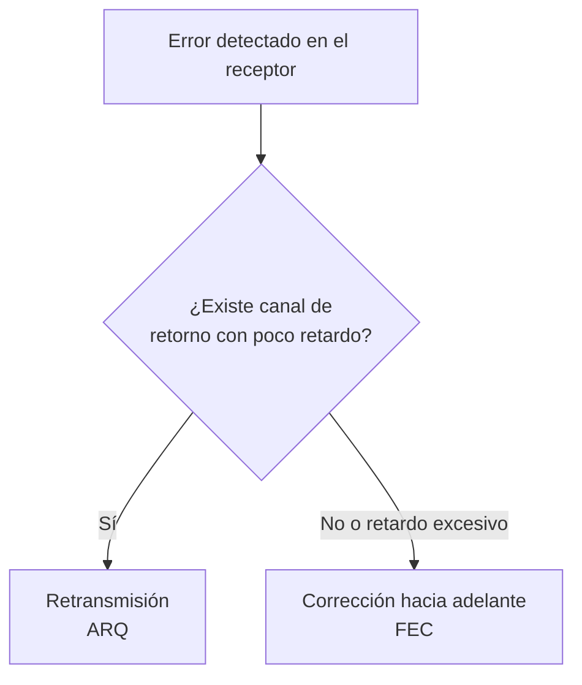
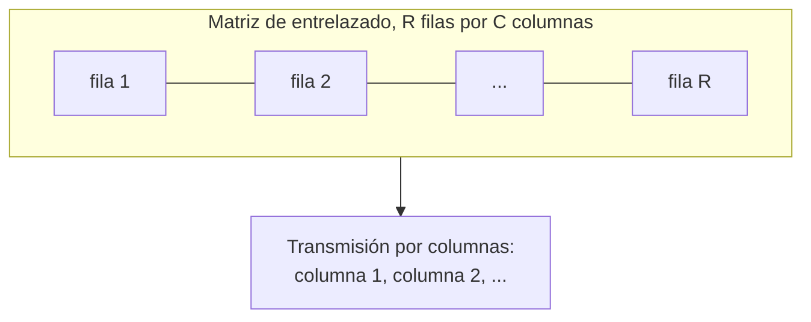

Ningún canal de transmisión entrega la señal sin alterarla, y esa alteración se traduce
en bits que llegan al receptor distintos de los que emitió el transmisor. La
**codificación de canal** añade a los bits de información una redundancia calculada de
forma que el receptor pueda detectar, y en muchos casos corregir, los errores que el
canal introduce. Este capítulo recorre esa idea desde su formulación más elemental, la
paridad de un único bit, hasta la formulación matricial que sostiene los códigos
lineales, los códigos cíclicos que se usan en la práctica bajo el nombre de comprobación
de redundancia cíclica, y los códigos de comprobación de paridad de baja densidad que
emplean los sistemas de comunicaciones actuales.

## Introducción

Todo receptor digital se enfrenta al mismo problema: decidir qué secuencia de bits
transmitió el emisor a partir de una secuencia que el canal puede haber alterado. La
[recepción óptima frente al ruido](../03_modulacion/section_2_modulaciones_digitales.md)
ya fija cuántos bits llegan equivocados en promedio para una relación dada entre energía
de bit y densidad de ruido. La codificación de canal no reduce esa tasa de error física,
que depende del canal y de la modulación, sino que explota la redundancia introducida en
el transmisor para que los errores que sí ocurren dejen de propagarse hasta la
aplicación.

La estrategia general consiste en transformar cada bloque de bits de información en un
bloque más largo, la **palabra de código**, de modo que solo una fracción de las
secuencias posibles de esa longitud sean palabras válidas. Si el canal altera unos pocos
bits, la secuencia recibida deja de coincidir con ninguna palabra válida y el receptor
detecta que algo ha fallado. Si además la estructura del código es suficientemente rica,
el receptor puede identificar cuál era la palabra válida más próxima y corregir el error
sin solicitar nada al transmisor.

## Errores en un canal de transmisión

### Tasa de error de bit

La **tasa de error de bit**, o BER por sus siglas inglesas de _bit error rate_, es la
fracción de bits que el canal entrega alterados. Es una magnitud empírica que depende
del medio de transmisión y de la relación entre energía de bit y densidad de ruido, y
sirve como dato de entrada para dimensionar cualquier esquema de control de error. Los
órdenes de magnitud varían mucho según el medio: un par trenzado presenta valores en
torno a $10^{-6}$, un enlace inalámbrico puede degradarse hasta $10^{-3}$ y una fibra
óptica bien diseñada alcanza $10^{-8}$ o mejor. La forma cerrada de la BER en función de
la energía de bit y del tipo de modulación se desarrolla en
[modulaciones digitales](../03_modulacion/section_2_modulaciones_digitales.md), que este
capítulo toma como dato de partida sin volver a derivarla.

### Errores simples y errores a ráfagas

Un **error simple** afecta a un único bit aislado, rodeado de bits correctos por ambos
lados. Su número esperado en una transmisión se estima multiplicando la BER por el
régimen binario y por la duración de la perturbación que lo origina. Un régimen de $1$
Mbit/s sometido a una perturbación de $1\ \mu\text{s}$ afecta a un único bit, porque el
producto de ambas cantidades vale la unidad. Elevar el régimen binario a $10$ Mbit/s
para la misma duración de perturbación multiplica por diez el número de bits afectados,
porque en ese intervalo caben diez períodos de bit en lugar de uno.

Un **error a ráfaga** afecta a varios bits consecutivos, con la particularidad de que no
todos los bits intermedios tienen que estar necesariamente equivocados. La longitud de
la ráfaga se define desde el primer bit erróneo hasta el último, y engloba también los
bits correctos que puedan quedar entre ellos si la distancia entre errores consecutivos
es pequeña frente a la longitud total. Las ráfagas son características de canales con
desvanecimientos profundos o de interferencias impulsivas, y su tratamiento exige
técnicas distintas de las que bastan para errores simples, como se ve en el entrelazado
al cierre del capítulo.

## Estrategias de control de error

Ante un error detectado, el sistema dispone de dos estrategias posibles, que pueden
combinarse pero responden a necesidades distintas.



### Retransmisión

La **retransmisión**, conocida por las siglas ARQ de _automatic repeat request_, se
apoya en un código capaz solo de detectar errores. Cuando el receptor detecta que una
palabra no es válida, solicita al transmisor que repita esa transmisión a través de un
canal de retorno. Es una estrategia eficiente en redundancia, porque detectar errores
exige menos bits adicionales que corregirlos, pero introduce un retardo igual al tiempo
de propagación de ida y vuelta más el tiempo de procesado, lo que la hace poco adecuada
para enlaces con mucho retardo de propagación o para servicios sensibles al retardo. La
combinación de esta estrategia con la corrección hacia adelante, bajo el nombre de
retransmisión híbrida, se trata en un capítulo posterior dedicado a la adaptación de
enlace.

### Corrección hacia adelante

La **corrección hacia adelante**, conocida por las siglas FEC de _forward error
correction_, emplea un código capaz de corregir errores sin necesidad de retransmisión.
Es la única opción viable cuando no existe canal de retorno, cuando el retardo de la
retransmisión resulta inaceptable o cuando el canal es de difusión y no admite una
solicitud individualizada. El precio es una redundancia mayor que la que basta para
detectar, porque distinguir cuál era la palabra correcta exige más información que
distinguir simplemente que hubo un error.

## Códigos de bloque

### Palabra código, longitud y tasa de codificación

Un **código de bloque** $C(n, k)$ es una función que asocia a cada uno de los $2^k$
mensajes posibles de $k$ bits una palabra de código de $n$ bits, con $n > k$. La
diferencia $n - k$ es la **redundancia** del código, expresada en bits, y el conjunto de
las $2^k$ palabras válidas es un subconjunto propio del espacio de $2^n$ secuencias
posibles de esa longitud. Todas las palabras de un mismo código comparten la misma
longitud $n$, propiedad que da nombre a la familia y que la distingue de otros esquemas
de codificación de longitud variable.

La **tasa de codificación**, denotada $R$, mide qué fracción de cada palabra transmitida
transporta información,

$$
R = \frac{k}{n}
$$

y cumple siempre $R \leq 1$, con igualdad solo en el caso trivial sin redundancia. Un
código que repite cada bit de información tres veces, $C(3,1)$, tiene tasa $R = 1/3$: de
cada tres bits transmitidos, solo uno aporta información nueva. Cuando un código
sistemático transmite los $k$ bits de información sin modificar junto con $n-k$ bits de
redundancia calculados a partir de ellos, la palabra de código adopta la forma $\lbrack
\text{mensaje} \mid \text{redundancia} \rbrack$, estructura que se retoma al introducir
la matriz generadora.

La reducción de la tasa de codificación tiene una contrapartida directa sobre el régimen
binario efectivo que percibe la aplicación: si el canal soporta un régimen fijo $R_b$,
el régimen de información útil se reduce a $R \, R_b$. Ese es el efecto negativo de la
codificación de canal, que se compensa con el efecto positivo de reducir la probabilidad
de que un bloque de información llegue con un error no corregido.

### Distancia de Hamming

La **distancia de Hamming** entre dos palabras de la misma longitud, $d_H(\mathbf{x},
\mathbf{y})$, es el número de posiciones en que ambas difieren. Por ejemplo,
$d_H(0000, 1100) = 2$ y $d_H(0000, 1111) = 4$: la primera pareja difiere en dos bits y
la segunda en los cuatro. Esta distancia cuantifica cuántos bits debe alterar el canal
para transformar una palabra de código en otra, y es la magnitud sobre la que se
construye toda la teoría de detección y corrección de errores en códigos de bloque.

El parámetro que caracteriza a un código completo es su **distancia mínima**, $d_{\min}$
o $d_H(C)$, el menor valor de la distancia de Hamming entre cualquier pareja de palabras
válidas distintas, tomadas de dos en dos. Un código con palabras muy separadas entre sí
tolera más alteraciones antes de que una palabra corrompida se confunda con otra válida
distinta de la que se transmitió.

### Capacidad de detección y de corrección

Un código de distancia mínima $d$ detecta con certeza todos los patrones de error de
peso, es decir, de número de bits erróneos, menor o igual que $d - 1$. La razón es
geométrica: si el error desplaza la palabra transmitida en menos de $d$ posiciones, la
secuencia recibida no puede coincidir con otra palabra válida, porque cualquier par de
palabras válidas está separado por al menos $d$ posiciones.

$$
e_{\text{detecta}} = d - 1
$$

donde $e_{\text{detecta}}$ es el número máximo de errores que el código garantiza
detectar. La corrección exige una condición más estricta, porque el decodificador debe
poder decidir sin ambigüedad cuál era la palabra correcta más próxima a la recibida. Esa
condición es

$$
e_{\text{corrige}} = \left\lfloor \frac{d - 1}{2} \right\rfloor
$$

donde $e_{\text{corrige}}$ es el número máximo de errores que el código garantiza
corregir. La diferencia entre ambas capacidades explica por qué un mismo código puede
usarse en dos modos distintos: exigiendo solo detección se cubre hasta $d-1$ errores,
mientras que exigiendo corrección automática solo se cubren hasta $\lfloor (d-1)/2
\rfloor$, la mitad aproximadamente.

???+ example "Capacidad de un código de repetición triple"

    Un código $C(3,1)$ repite cada bit de información tres veces, de modo que sus dos
    palabras válidas son $000$ y $111$. La distancia de Hamming entre ambas es
    $d_H(000, 111) = 3$, y como solo hay dos palabras, esa distancia coincide con la
    distancia mínima del código, $d_{\min} = 3$.

    La capacidad de detección es $e_{\text{detecta}} = 3 - 1 = 2$ errores: cualquier
    patrón de uno o dos bits erróneos aleja la palabra recibida de la palabra válida
    transmitida sin acercarla a la otra palabra válida. La capacidad de corrección es
    $e_{\text{corrige}} = \lfloor (3-1)/2 \rfloor = 1$ error: si se recibe $101$, esa
    secuencia está a distancia $1$ de $111$ y a distancia $2$ de $000$, por lo que el
    decodificador de máxima verosimilitud declara $111$ como la palabra más probable.
    Con dos errores, por ejemplo al recibir $001$, la secuencia queda equidistante o más
    cerca de la palabra incorrecta, y la corrección automática falla aunque el error
    siga siendo detectable.

### Eficiencia del código

La **eficiencia** de un código, también llamada tasa de codificación cuando se expresa
en función del tamaño del alfabeto de código, mide la fracción de información útil por
bit transmitido,

$$
\eta = \frac{k}{n} = \frac{\log_2 \lvert C \rvert}{n}
$$

donde $\lvert C \rvert$ es el número de palabras válidas del código, igual a $2^k$
cuando el código codifica bloques de $k$ bits sin restricciones adicionales. La segunda
forma de la expresión generaliza la primera a códigos cuyo número de palabras no es una
potencia de dos exacta, aunque ese caso no es el habitual en los códigos de bloque
binarios que ocupan este capítulo.

La eficiencia y la capacidad correctora compiten entre sí para una longitud de palabra
$n$ fija: aumentar la redundancia mejora la protección frente a errores pero reduce
$\eta$, y el diseño de un código concreto es la búsqueda de un compromiso entre ambas
magnitudes para las condiciones del canal.

La probabilidad de que una palabra de código de longitud $n$, protegida por un código
capaz de corregir hasta $e$ errores, llegue con más errores de los que el código puede
corregir se obtiene sumando la probabilidad de todas las combinaciones de más de $e$
errores sobre $n$ posiciones,

$$
\text{PER} = \sum_{j = e+1}^{n} \binom{n}{j} \, \text{BER}^{j} \, (1 - \text{BER})^{n-j}
$$

donde $\text{PER}$ es la probabilidad de error de palabra tras la decodificación,
$\binom{n}{j}$ el número de formas de distribuir $j$ errores entre $n$ posiciones y
$\text{BER}$ la tasa de error de bit del canal sin codificar. Esta expresión traduce la
BER física del canal en una probabilidad de fallo del bloque codificado, y es la
magnitud que hay que comparar frente a la probabilidad de error de un sistema sin
codificar para cuantificar la ganancia que aporta el código.

???+ example "Probabilidad de error de palabra de un código de Hamming (7,4)"

    Un enlace transmite bloques de $n = 7$ bits codificados con un código capaz de
    corregir $e = 1$ error, sobre un canal con $\text{BER} = 10^{-2}$.

    La probabilidad de que la palabra recibida contenga más de un error, y por tanto de
    que la corrección automática falle, es

    $$
    \text{PER} = \sum_{j=2}^{7} \binom{7}{j} (10^{-2})^{j} (1 - 10^{-2})^{7-j}
    \approx 2{,}03 \cdot 10^{-3}
    $$

    Sin codificar, la probabilidad de que ese mismo bloque de $7$ bits contuviera al
    menos un error habría sido $1 - (1-\text{BER})^7 \approx 6{,}79 \cdot 10^{-2}$, más
    de treinta veces superior a la probabilidad de fallo tras la corrección. La
    codificación no elimina los errores del canal, pero reduce en más de un orden de
    magnitud la fracción de bloques que la aplicación recibe corrompidos.

## Códigos de paridad

El código de control de error más simple añade un único bit de redundancia a un bloque
de $k$ bits de información. El **bit de paridad** se calcula de modo que el número total
de unos en la palabra completa, contando el bit añadido, cumpla una condición fija: en
la **paridad par** ese número debe ser par, y en la **paridad impar**, impar. Para
paridad par, el bit de paridad vale $0$ si el bloque de información ya contiene un
número par de unos y $1$ en caso contrario, de modo que la suma total se mantiene par.

Un código de paridad tiene distancia mínima $d_{\min} = 2$, porque cualquier palabra
válida difiere de cualquier otra en al menos dos posiciones: cambiar un solo bit de
información obliga a cambiar también el bit de paridad para mantener la propiedad, y
cambiar solo el bit de paridad produce una secuencia que ya no cumple la regla.
Aplicando las expresiones de capacidad, ese código detecta $d_{\min} - 1 = 1$ error pero
no corrige ninguno, $\lfloor (d_{\min}-1)/2 \rfloor = 0$, resultado consistente con la
intuición: un único bit de paridad no aporta información suficiente para señalar cuál de
los bits es el erróneo.

La paridad par es además la única de las dos variantes que constituye un código lineal
en el sentido que se define en la sección siguiente, porque incluye entre sus palabras
válidas la palabra de todo ceros, mientras que la paridad impar la excluye por
construcción. Un código de paridad detecta cualquier número impar de bits erróneos, ya
que alterar un número impar de bits cambia la paridad total, pero es ciego a un número
par de errores simultáneos, porque estos se compensan entre sí y dejan la paridad total
inalterada.

## Códigos lineales

### Matriz generadora y matriz de comprobación

Un **código lineal** de bloque $C(n, k)$ es un código en el que la suma módulo dos de
dos palabras cualesquiera del código es también una palabra del código. Esa propiedad
tiene una consecuencia inmediata: la palabra de todo ceros pertenece siempre a un código
lineal, porque es el resultado de sumar cualquier palabra consigo misma. La linealidad
también implica que la distancia mínima del código coincide con el menor peso, es decir,
el menor número de unos, de entre sus palabras distintas de la de todo ceros, ya que la
distancia entre dos palabras cualesquiera es igual al peso de su suma, que es también
una palabra del código.

La estructura lineal permite describir un código completo mediante una única matriz en
lugar de enumerar sus $2^k$ palabras. La **matriz generadora** $\mathbf{G}$, de
dimensiones $k \times n$, produce cada palabra de código a partir de su mensaje mediante
un producto matricial en aritmética módulo dos,

$$
\mathbf{c} = \mathbf{m} \, \mathbf{G}
$$

donde $\mathbf{m}$ es el vector fila de $k$ bits del mensaje y $\mathbf{c}$ la palabra
de código de $n$ bits resultante. Cuando el código es **sistemático**, la matriz
generadora se escribe en la forma

$$
\mathbf{G} = \lbrack \mathbf{I}_k \mid \mathbf{P} \rbrack
$$

donde $\mathbf{I}_k$ es la matriz identidad de orden $k$ y $\mathbf{P}$ es una matriz de
$k \times (n-k)$ que fija los bits de redundancia. Con esta forma, el producto
$\mathbf{m} \, \mathbf{G}$ reproduce el mensaje sin alterar en las primeras $k$
posiciones y añade a continuación la redundancia calculada a partir de $\mathbf{P}$, lo
que hace explícita la estructura $\mathbf{c} = \lbrack \text{mensaje} \mid
\text{redundancia} \rbrack$ ya anticipada.

A partir de $\mathbf{P}$ se construye la **matriz de comprobación** $\mathbf{H}$, de
dimensiones $(n-k) \times n$,

$$
\mathbf{H} = \lbrack \mathbf{P}^{T} \mid \mathbf{I}_{n-k} \rbrack
$$

que cumple, para toda palabra de código válida, la relación fundamental

$$
\mathbf{c} \, \mathbf{H}^{T} = \mathbf{0}
$$

Esta identidad es la que permite al decodificador comprobar la validez de una palabra
recibida sin necesidad de compararla una a una con las $2^k$ palabras del código.

???+ example "Matriz generadora y de comprobación de un código (6,3)"

    Un código lineal sistemático transporta mensajes de $k=3$ bits en palabras de
    $n=6$ bits mediante la matriz de paridad

    $$
    \mathbf{P} = \begin{pmatrix} 1 & 1 & 0 \\ 0 & 1 & 1 \\ 1 & 0 & 1 \end{pmatrix}
    $$

    de modo que la matriz generadora resulta

    $$
    \mathbf{G} = \lbrack \mathbf{I}_3 \mid \mathbf{P} \rbrack =
    \begin{pmatrix}
    1 & 0 & 0 & 1 & 1 & 0 \\
    0 & 1 & 0 & 0 & 1 & 1 \\
    0 & 0 & 1 & 1 & 0 & 1
    \end{pmatrix}
    $$

    Para codificar el mensaje $\mathbf{m} = (1, 0, 1)$ se suman en módulo dos la primera
    y la tercera fila de $\mathbf{G}$,

    $$
    \mathbf{c} = (1,0,0,1,1,0) \oplus (0,0,1,1,0,1) = (1,0,1,0,1,1)
    $$

    donde $\oplus$ denota la suma bit a bit sin acarreo. Recorriendo los ocho mensajes
    posibles se comprueba que la palabra de peso mínimo distinta de la nula tiene tres
    unos, de modo que $d_{\min} = 3$: el código detecta hasta dos errores y corrige uno.

    La matriz de comprobación asociada es

    $$
    \mathbf{H} = \lbrack \mathbf{P}^{T} \mid \mathbf{I}_3 \rbrack =
    \begin{pmatrix}
    1 & 0 & 1 & 1 & 0 & 0 \\
    1 & 1 & 0 & 0 & 1 & 0 \\
    0 & 1 & 1 & 0 & 0 & 1
    \end{pmatrix}
    $$

    y se verifica que $\mathbf{c} \, \mathbf{H}^{T} = (0,0,0)$ para la palabra
    calculada, como debe ocurrir para cualquier palabra válida de este código.

### Síndrome y patrón de error

El **síndrome** de un vector recibido $\mathbf{r}$ es el resultado de aplicarle la
matriz de comprobación,

$$
\mathbf{s} = \mathbf{r} \, \mathbf{H}^{T}
$$

Si $\mathbf{r}$ es una palabra válida, el síndrome es el vector nulo, de acuerdo con la
identidad anterior. Si el canal ha introducido un **patrón de error** $\mathbf{e}$, de
modo que $\mathbf{r} = \mathbf{c} \oplus \mathbf{e}$, el síndrome depende únicamente del
error,

$$
\mathbf{s} = (\mathbf{c} \oplus \mathbf{e}) \, \mathbf{H}^{T}
= \mathbf{c} \, \mathbf{H}^{T} \oplus \mathbf{e} \, \mathbf{H}^{T}
= \mathbf{e} \, \mathbf{H}^{T}
$$

porque el primer término se anula al ser $\mathbf{c}$ una palabra válida. Esta propiedad
es la que hace operativa la decodificación: el síndrome no depende de qué palabra se
transmitió, sino solo del patrón de error que el canal introdujo, de modo que basta con
tabular de antemano el síndrome que produce cada patrón de error de peso mínimo, uno por
columna de $\mathbf{H}$ para un error de un único bit, y comparar el síndrome calculado
con esa tabla para identificar y corregir el error.

???+ example "Corrección de un error mediante el síndrome"

    Se transmite el mensaje $\mathbf{m} = (1, 0, 1)$ con el código $(6,3)$ del ejemplo
    anterior, cuya palabra de código es $\mathbf{c} = (1,0,1,0,1,1)$. El canal invierte
    el segundo bit, de modo que el receptor obtiene
    $\mathbf{r} = (1,1,1,0,1,1)$.

    El síndrome del vector recibido se calcula con la matriz $\mathbf{H}$ del ejemplo
    anterior y resulta $\mathbf{s} = (0,1,1)$. Las columnas de $\mathbf{H}$, leídas de
    izquierda a derecha, son $(1,1,0)$, $(0,1,1)$, $(1,0,1)$, $(1,0,0)$, $(0,1,0)$ y
    $(0,0,1)$: el síndrome obtenido coincide con la segunda columna, de modo que el
    decodificador declara el error en la segunda posición y corrige el bit invertido,
    recuperando $\mathbf{c} = (1,0,1,0,1,1)$ y, tras descartar los tres bits de
    redundancia, el mensaje original $\mathbf{m} = (1,0,1)$.

    ```python linenums="1"
    def codifica(mensaje: list[int], generadora: list[list[int]]) -> list[int]:
        """Codifica un mensaje multiplicándolo por la matriz generadora en módulo 2.

        Args:
            mensaje: Bits del mensaje, de longitud k.
            generadora: Matriz generadora de dimensiones k por n.

        Returns:
            Palabra de código de longitud n.
        """
        n = len(generadora[0])
        palabra = [0] * n
        for fila, bit in enumerate(mensaje):
            if bit:
                for columna in range(n):
                    palabra[columna] ^= generadora[fila][columna]
        return palabra


    def sindrome(recibido: list[int], comprobacion: list[list[int]]) -> list[int]:
        """Calcula el síndrome de un vector recibido.

        Args:
            recibido: Vector recibido, de longitud n.
            comprobacion: Matriz de comprobación de dimensiones (n-k) por n.

        Returns:
            Vector síndrome de longitud n-k.
        """
        return [
            sum(fila[j] & recibido[j] for j in range(len(recibido))) % 2
            for fila in comprobacion
        ]


    # Matrices del código (6,3) sistemático con G = [I_3 | P]
    G = [
        [1, 0, 0, 1, 1, 0],
        [0, 1, 0, 0, 1, 1],
        [0, 0, 1, 1, 0, 1],
    ]
    H = [
        [1, 0, 1, 1, 0, 0],
        [1, 1, 0, 0, 1, 0],
        [0, 1, 1, 0, 0, 1],
    ]

    palabra = codifica([1, 0, 1], G)
    recibido = [palabra[i] ^ (1 if i == 1 else 0) for i in range(6)]
    print(f"Palabra transmitida: {palabra}")
    print(f"Vector recibido:     {recibido}")
    print(f"Síndrome:            {sindrome(recibido, H)}")
    ```

    ```plaintext title="Expected output"
    Palabra transmitida: [1, 0, 1, 0, 1, 1]
    Vector recibido:     [1, 1, 1, 0, 1, 1]
    Síndrome:            [0, 1, 1]
    ```

Cuando el número de columnas de $\mathbf{H}$ que suman el vector nulo se conoce, ese
número mínimo de columnas coincide con la distancia mínima del código, resultado
coherente con que un patrón de error de peso igual a esa distancia mínima es
precisamente una palabra de código no nula, y por tanto produce un síndrome nulo que el
decodificador no puede distinguir de una transmisión sin errores.

## Códigos de Hamming

Los **códigos de Hamming** son la familia de códigos lineales que, para una redundancia
dada de $n - k$ bits, alcanza el mayor número de mensajes protegidos con distancia
mínima $d_{\min} = 3$. Esa distancia mínima garantiza, según las expresiones generales
de capacidad, la detección de hasta dos errores y la corrección de uno solo, aunque no
distingue un patrón de dos errores de un patrón de un error distinto: ambos pueden
producir el mismo síndrome, lo que exige recurrir a un código de Hamming extendido,
añadiendo un bit de paridad global, si se necesita distinguir entre ambos casos en lugar
de solo corregir el más probable.

La construcción sigue exactamente el esquema de matriz generadora y de comprobación
descrito para los códigos lineales, con una condición adicional sobre $\mathbf{H}$: sus
columnas deben ser todas distintas y no nulas, de modo que cada patrón de un único error
produzca un síndrome diferente y unívocamente identificable. Para $n - k$ bits de
redundancia existen $2^{n-k} - 1$ columnas no nulas posibles, lo que fija la longitud
máxima de un código de Hamming con esa redundancia en $n = 2^{n-k} - 1$. El caso más
citado es el código $(7,4)$, con tres bits de redundancia y las siete columnas no nulas
posibles de tres bits repartidas entre sus siete posiciones.

???+ example "Decodificación de un código de Hamming (7,4)"

    El código de Hamming $(7,4)$ sistemático emplea la matriz de paridad

    $$
    \mathbf{P} = \begin{pmatrix}
    1 & 1 & 0 \\ 1 & 0 & 1 \\ 0 & 1 & 1 \\ 1 & 1 & 1
    \end{pmatrix}
    $$

    Para el mensaje $\mathbf{m} = (1,0,1,1)$ la palabra de código resulta
    $\mathbf{c} = (1,0,1,1,0,1,0)$. Si el canal invierte el quinto bit, el receptor
    obtiene $\mathbf{r} = (1,0,1,1,1,1,0)$, cuyo síndrome, calculado con
    $\mathbf{H} = \lbrack \mathbf{P}^{T} \mid \mathbf{I}_3 \rbrack$, vale
    $\mathbf{s} = (1,0,0)$. Esa columna ocupa la quinta posición entre las siete
    columnas de $\mathbf{H}$, de modo que el decodificador corrige exactamente el bit
    alterado y recupera el mensaje original.

## Códigos cíclicos

### Polinomio generador

Un **código cíclico** es un código lineal con una propiedad adicional: cualquier
rotación de una palabra de código es también una palabra del código. Esta estructura
permite describir el código completo mediante un único **polinomio generador** $g(x)$ en
lugar de una matriz, representando cada palabra de $n$ bits como un polinomio de grado
menor que $n$ cuyos coeficientes son esos bits, y realizando la aritmética sobre esos
polinomios en módulo dos.

El polinomio generador de un código cíclico $C(n,k)$ debe cumplir tres condiciones. Es
un polinomio de grado $n - k$, la misma redundancia que en el caso lineal general. Tiene
término independiente no nulo, $g(0) \neq 0$, condición que se satisface siempre que
$g(x)$ contenga el término $1$. Y divide exactamente al polinomio $x^n + 1$, sin dejar
resto, condición que garantiza que las rotaciones de las palabras de código permanezcan
dentro del propio código. La codificación de un mensaje $m(x)$ es entonces un simple
producto polinómico,

$$
c(x) = m(x) \cdot g(x)
$$

donde $c(x)$ es el polinomio asociado a la palabra de código, de grado menor que $n$. El
polinomio generador es, en particular, él mismo una palabra de código, porque
corresponde a tomar $m(x) = 1$, el mensaje más simple posible distinto del nulo.

???+ example "Obtención del polinomio generador de un código cíclico (3,2)"

    Un código cíclico $C(3,2)$ codifica los cuatro mensajes de dos bits en palabras de
    tres bits. El polinomio generador debe tener grado $n-k = 1$ y término
    independiente no nulo, lo que entre los polinomios de grado uno solo deja
    $g(x) = x + 1$ como candidato, ya que un polinomio de grado uno sin término
    independiente sería simplemente $x$, que no cumple la segunda condición.

    Se comprueba que $g(x) = x+1$ divide exactamente a $x^3 + 1$, ya que en aritmética
    módulo dos $x^3 + 1 = (x+1)(x^2+x+1)$, con resto nulo. Codificando cada mensaje como
    $c(x) = m(x) \cdot (x+1)$ se obtiene

    $$
    C(3,2) = \lbrace 000,\ 011,\ 110,\ 101 \rbrace
    $$

    correspondientes a los mensajes $00$, $01$, $10$ y $11$ respectivamente. Cualquier
    rotación de una palabra, por ejemplo de $011$ a $110$ o a $101$, es también una
    palabra del mismo conjunto, propiedad que confirma el carácter cíclico del código.

### Comprobación de redundancia cíclica

La **comprobación de redundancia cíclica**, conocida por sus siglas inglesas CRC de
_cyclic redundancy check_, es la aplicación práctica de los códigos cíclicos a la
detección de errores en bloques de datos, y su capacidad de detección se justifica
directamente a partir de las propiedades del polinomio generador.

En recepción, el decodificador divide el polinomio recibido $r(x)$ entre $g(x)$. Si el
resto es nulo, $r(x)$ es múltiplo de $g(x)$ y por tanto una palabra válida, mientras que
un resto no nulo señala un error. Escribiendo $r(x) = c(x) \oplus e(x)$, donde $e(x)$ es
el polinomio del patrón de error, el resto de la división de $r(x)$ entre $g(x)$
coincide con el resto de dividir $e(x)$ entre $g(x)$, porque $c(x)$ es múltiplo exacto
de $g(x)$. El error pasa inadvertido únicamente cuando $e(x)$ resulta ser también
múltiplo de $g(x)$, de modo que diseñar $g(x)$ equivale a elegir qué patrones de error
resultan indetectables y, por descarte, garantizar que todos los demás sí se detectan.

Esa elección sigue tres reglas, todas mecánicas de aplicar y verificables por
construcción de $g(x)$:

- **Errores simples**: Un patrón de un solo bit erróneo es de la forma $e(x) = x^i$, que
  nunca es múltiplo de un polinomio con más de un término. Basta con que $g(x)$ tenga
  término independiente, condición ya exigida a cualquier polinomio generador cíclico,
  para que todos los errores simples se detecten.
- **Errores impares**: Si $g(x)$ tiene a $(x+1)$ como factor, lo que se comprueba
  evaluando $g(1) = 0$, entonces $g(x)$ detecta cualquier patrón de error con un número
  impar de bits erróneos. La razón es que un polinomio con un número impar de términos
  no nulos nunca se anula al evaluarlo en $x=1$, mientras que cualquier múltiplo de
  $(x+1)$ sí lo hace.
- **Errores dobles**: Si $g(x)$ es primitivo, es decir, no puede factorizarse en
  polinomios de menor grado, de grado $l = n-k$, detecta todos los patrones de dos bits
  erróneos siempre que la longitud de la palabra de código no supere $n \leq 2^{l} - 1$.

Muchos generadores prácticos combinan las dos últimas propiedades factorizando $g(x) =
(x+1) \cdot p(x)$, donde $p(x)$ es un polinomio primitivo de grado $n-k-1$: el factor
$(x+1)$ garantiza la detección de errores impares y $p(x)$, por ser primitivo, garantiza
la de errores dobles hasta la longitud que fija su propio grado.

Para ráfagas de error, un patrón se escribe $e(x) = x^i \cdot d(x)$, donde $d(x)$
concentra los bits distintos de cero de la ráfaga y tiene grado $L-1$, siendo $L$ la
longitud de la ráfaga. Como $g(x)$ no puede dividir a un polinomio de grado menor que el
suyo salvo que ese polinomio sea nulo, toda ráfaga de longitud

$$
L \leq n - k
$$

se detecta sin excepción, porque el grado de $d(x)$ queda entonces por debajo del grado
de $g(x)$. Para $L = n-k+1$ el generador solo deja de detectar la ráfaga cuando $d(x)$
coincide exactamente con $g(x)$, un único caso desfavorable entre todos los posibles, y
para ráfagas más largas la fracción de casos no detectados crece pero sigue siendo
pequeña frente al total.

???+ example "Cálculo de la CRC de un mensaje corto"

    Se transmite el mensaje $m(x)$ correspondiente a los bits $1101$ con el generador
    $g(x) = x^3 + x + 1$, de bits $1011$ y grado $n-k=3$.

    El procedimiento desplaza el mensaje tres posiciones, añadiendo tres ceros, y divide
    el resultado entre $g(x)$ en aritmética módulo dos, en la que la resta se reduce a
    una suma bit a bit sin acarreo. Partiendo del dividendo $1101000$:

    $$
    1101 \oplus 1011 = 0110, \quad 1100 \oplus 1011 = 0111, \quad
    1110 \oplus 1011 = 0101, \quad 1010 \oplus 1011 = 0001
    $$

    donde cada paso alinea el generador con el bit más significativo aún activo del
    resto parcial y aplica la suma módulo dos solo cuando ese bit vale uno. El resto
    final de tres bits es $001$, que constituyen la redundancia. La palabra transmitida
    es entonces $1101001$, y dividir esta palabra completa entre $g(x)$ produce resto
    nulo, confirmando que es múltiplo exacto del generador.

    ```python linenums="1"
    def resto_crc(mensaje: list[int], generador: list[int]) -> list[int]:
        """Calcula el resto de la división modulo 2 usada en la CRC.

        Args:
            mensaje: Bits del mensaje, bit mas significativo primero.
            generador: Coeficientes del polinomio generador, bit mas
                significativo primero.

        Returns:
            Bits de redundancia, en igual numero que el grado del generador.
        """
        grado = len(generador) - 1
        registro = mensaje + [0] * grado
        for posicion in range(len(mensaje)):
            if registro[posicion] == 1:
                for desplazamiento in range(len(generador)):
                    registro[posicion + desplazamiento] ^= generador[desplazamiento]
        return registro[-grado:]


    mensaje = [1, 1, 0, 1]
    generador = [1, 0, 1, 1]
    redundancia = resto_crc(mensaje, generador)
    print(f"Bits de redundancia: {redundancia}")
    print(f"Palabra código transmitida: {mensaje + redundancia}")
    ```

    ```plaintext title="Expected output"
    Bits de redundancia: [0, 0, 1]
    Palabra código transmitida: [1, 1, 0, 1, 0, 0, 1]
    ```

Un generador de referencia habitual en implementaciones reales es $g(x) = x^{16} +
x^{15} + x^2 + 1$, que factoriza como $(x+1)(x^{15}+x+1)$: el factor $(x+1)$ garantiza
la detección de errores impares, y el factor $x^{15}+x+1$, primitivo de grado $15$,
garantiza la detección de errores dobles para palabras de hasta $2^{15} - 1 = 32767$
bits, además de detectar sin excepción cualquier ráfaga de hasta $n-k=16$ bits de
longitud.

El cálculo de la CRC se implementa en hardware con un registro de desplazamiento
realimentado mediante puertas XOR, lo que permite calcular la redundancia en el mismo
número de ciclos de reloj que bits tiene el mensaje, sin necesidad de almacenar el
mensaje completo antes de empezar a transmitir los primeros bits.

## Códigos de comprobación de paridad de baja densidad

Los **códigos de comprobación de paridad de baja densidad**, conocidos por sus siglas
inglesas LDPC de _low density parity check_, son códigos lineales cuya matriz de
comprobación $\mathbf{H}$ contiene una proporción muy baja de unos frente al total de
elementos. Esa dispersión es la que da nombre a la familia y la que permite implementar
la decodificación mediante algoritmos iterativos de paso de mensajes sobre un grafo con
un número de conexiones que crece linealmente con el tamaño del código, en lugar de
exponencialmente, lo que resulta viable en bloques mucho mayores que los que admite la
decodificación exhaustiva de un código lineal general.

A partir de una matriz de comprobación dispersa, y siempre que sus filas sean
linealmente independientes, se obtiene la matriz generadora correspondiente reordenando
los bits de información y de redundancia hasta expresar $\mathbf{H}$ en la forma
$\lbrack \mathbf{P}^{T} \mid \mathbf{I}_{n-k} \rbrack$ ya vista para los códigos
lineales sistemáticos, de la que se deriva directamente $\mathbf{G} = \lbrack
\mathbf{I}_k \mid \mathbf{P} \rbrack$. La diferencia con un código lineal genérico no
está en la relación entre $\mathbf{G}$ y $\mathbf{H}$, que es la misma, sino en que la
estructura dispersa de $\mathbf{H}$ hace que ambas matrices admitan una representación y
un procesado mucho más eficientes para bloques largos.

Los sistemas de comunicaciones móviles actuales emplean códigos LDPC para los canales de
datos de usuario, en sustitución de los códigos convolucionales concatenados
iterativamente, conocidos como turbocódigos, que dominaron generaciones anteriores. La
ventaja de los LDPC es doble: ofrecen una tasa de error de bit próxima al límite teórico
de Shannon para el canal, y a diferencia de los turbocódigos no presentan una región de
estancamiento en tasas de error muy bajas, lo que los hace preferibles cuando el
servicio exige una fiabilidad extremadamente alta. El detalle de la decodificación
iterativa y de los códigos con memoria que compiten con los LDPC en otros escenarios se
retoma en
[códigos convolucionales y decodificación](section_2_codigos_convolucionales.md).

## Entrelazado

### Dimensionado del entrelazador frente a la longitud de ráfaga

Los códigos de bloque descritos hasta aquí se diseñan para un patrón de errores
razonablemente disperso, y su capacidad correctora se degrada con rapidez frente a una
ráfaga que concentra muchos bits erróneos en una región estrecha de la palabra. El
**entrelazado** resuelve ese problema sin modificar el código: reordena los bits antes
de la transmisión de modo que posiciones consecutivas en el flujo transmitido
correspondan a posiciones distantes dentro de cada palabra de código, de forma que una
ráfaga del canal, al deshacerse el entrelazado en recepción, se reparte entre varias
palabras distintas como errores aislados dentro de cada una.


La técnica habitual organiza varias palabras de código en una matriz, escribiendo cada
palabra en una fila, y transmite el contenido leyendo la matriz por columnas.



Si la matriz tiene $R$ filas, cada una ocupada por una palabra de código distinta, una
ráfaga de longitud $L$ que afecte a símbolos transmitidos consecutivos reparte como
máximo un símbolo erróneo por fila siempre que $L \leq R$, porque los $R$ primeros
símbolos transmitidos de cada columna pertenecen ya a $R$ filas distintas. El
**dimensionado del entrelazador** consiste, por tanto, en fijar el número de filas $R$
al menos igual a la longitud de ráfaga que se quiere neutralizar,

$$
R \geq L
$$

de modo que la ráfaga, que el canal físico ve como contigua, llegue al decodificador de
cada palabra como un único error aislado y corregible por el propio código de bloque,
sin necesidad de que ese código haya sido diseñado para tolerar ráfagas por sí mismo.

???+ example "Dimensionado de un entrelazador frente a una ráfaga de cuatro símbolos"

    Se codifican cinco mensajes con un código de bloque en el que cada palabra ocupa
    una fila de una matriz de entrelazado, y el canal introduce una ráfaga de error que
    afecta a $L=4$ símbolos consecutivos en el orden de transmisión.

    Con una matriz de $R=4$ filas y $C=5$ columnas, los símbolos se transmiten columna a
    columna: la primera columna aporta un símbolo de cada una de las cuatro filas, y
    solo entonces la transmisión avanza a la segunda columna. Una ráfaga que cubra
    cuatro símbolos consecutivos del flujo transmitido cae por tanto en, como máximo,
    cuatro filas distintas, una por cada posición de la ráfaga, y ninguna fila recibe
    más de un símbolo erróneo. Cada palabra de código ve la ráfaga como un único error
    aislado, corregible por un código con distancia mínima $d_{\min} = 3$ como el del
    ejemplo de matriz generadora anterior.

    ```python linenums="1"
    def orden_de_transmision(filas: int, columnas: int) -> list[int]:
        """Calcula el orden de transmisión de una matriz de entrelazado por columnas.

        Args:
            filas: Numero de filas de la matriz, una por palabra de código.
            columnas: Numero de columnas de la matriz, una por símbolo de cada
                palabra.

        Returns:
            Lista con la fila de origen de cada símbolo, en orden de
            transmisión.
        """
        return [fila for columna in range(columnas) for fila in range(filas)]


    filas, columnas = 4, 5
    orden = orden_de_transmision(filas, columnas)
    inicio_rafaga = 6
    longitud_rafaga = 4
    filas_afectadas = orden[inicio_rafaga : inicio_rafaga + longitud_rafaga]
    print(f"Orden de transmisión (fila de origen): {orden}")
    print(f"Filas afectadas por la ráfaga: {filas_afectadas}")
    print(f"Filas distintas afectadas: {len(set(filas_afectadas))}")
    ```

    ```plaintext title="Expected output"
    Orden de transmisión (fila de origen): [0, 1, 2, 3, 0, 1, 2, 3, 0, 1, 2, 3, 0, 1, 2, 3, 0, 1, 2, 3]
    Filas afectadas por la ráfaga: [2, 3, 0, 1]
    Filas distintas afectadas: 4
    ```

    Las cuatro filas afectadas son todas distintas, lo que confirma que una ráfaga de
    longitud igual al número de filas del entrelazador nunca deja más de un error por
    palabra, independientemente de en qué columna comience.

El precio del entrelazado es el retardo que introduce, porque el receptor debe esperar a
recibir la matriz completa antes de poder deshacer el entrelazado y entregar cualquier
palabra al decodificador, y ese retardo crece con el producto $R \times C$. El
compromiso entre longitud de ráfaga tolerada y retardo introducido se retoma, junto con
la combinación entre corrección hacia adelante y retransmisión, en
[adaptación de enlace y retransmisión](section_3_adaptacion_de_enlace_y_retransmision.md).
