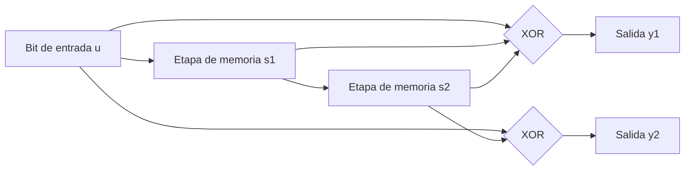
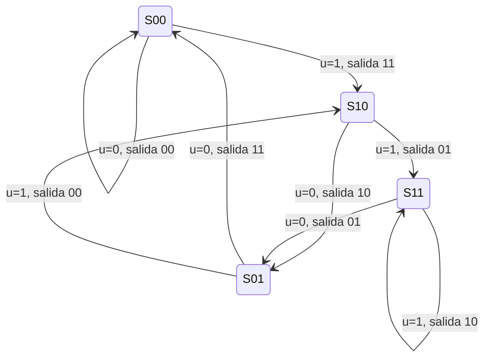
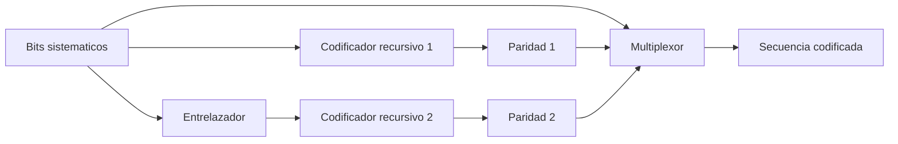

Un código de bloque protege cada palabra de forma independiente de las que la rodean. Un
**código convolucional** rompe esa independencia: la salida en un instante dado depende
del bit de entrada actual y de un número finito de bits anteriores, retenidos en un
registro de desplazamiento. Esa memoria introduce redundancia distribuida en el tiempo
en lugar de redundancia confinada a un bloque, y abre la puerta a un descodificador que
no comprueba pertenencia a un código sino que busca, entre todas las secuencias
posibles, la más verosímil dado lo recibido. Este capítulo desarrolla esa familia de
códigos, el algoritmo de Viterbi que los descodifica de forma óptima, el perforado que
adapta su tasa sin cambiar el codificador, la mejora que aporta trabajar con decisión
suave en lugar de con bits ya decididos y los códigos turbo, que combinan varios
codificadores convolucionales con entrelazado para acercarse al límite de Shannon.

## Introducción

Los códigos de bloque de la sección anterior fijan su capacidad de corrección en el
momento del diseño: la distancia mínima del código es una propiedad estática de la
palabra completa. Un código convolucional, en cambio, produce un flujo continuo de bits
codificados a partir de un flujo continuo de bits de información, sin fronteras de
bloque explícitas, y su descodificación óptima consiste en recorrer un grafo de estados
buscando el camino que mejor explica la secuencia recibida. Esa formulación como
búsqueda en un grafo es la que permite, más adelante en el capítulo, sustituir la
distancia de Hamming por una métrica de fiabilidad continua sin cambiar la estructura
del algoritmo, y es también la que hace de estos códigos el bloque constructivo de los
códigos turbo.

## Códigos convolucionales

### Registro de desplazamiento y estados

Un codificador convolucional de tasa $1/n$ desplaza cada bit de entrada $u\lbrack k
\rbrack$ a través de un registro de $m$ etapas de memoria y calcula $n$ bits de salida
como sumas módulo dos de un subconjunto fijo de las etapas del registro y del bit de
entrada. El número de etapas más el bit de entrada actual, $K = m + 1$, es la **longitud
de restricción** del código, y determina cuántos bits de entrada consecutivos influyen
en un mismo bit de salida.

El ejemplo que recorre el resto del capítulo es un código de tasa $R = 1/2$ y longitud
de restricción $K = 3$, con dos etapas de memoria $s_1\lbrack k \rbrack$ y $s_2\lbrack k
\rbrack$ que almacenan los dos bits de entrada anteriores. Las ecuaciones del
codificador son

$$
y_1\lbrack k \rbrack = u\lbrack k \rbrack \oplus s_1\lbrack k \rbrack \oplus
s_2\lbrack k \rbrack
$$

$$
y_2\lbrack k \rbrack = u\lbrack k \rbrack \oplus s_2\lbrack k \rbrack
$$

donde $\oplus$ es la suma módulo dos, $s_1\lbrack k \rbrack = u\lbrack k-1 \rbrack$ y
$s_2\lbrack k \rbrack = u\lbrack k-2 \rbrack$. Tras calcular la salida, el registro se
desplaza: $s_2\lbrack k+1 \rbrack = s_1\lbrack k \rbrack$ y $s_1\lbrack k+1 \rbrack =
u\lbrack k \rbrack$.



El contenido del registro en un instante dado, el par $\left(s_1\lbrack k \rbrack,
s_2\lbrack k \rbrack\right)$, es el **estado** del codificador. Con $m = 2$ etapas de
memoria hay $2^m = 4$ estados posibles, y en general un código de longitud de
restricción $K$ tiene $2^{K-1}$ estados. El estado resume toda la historia del
codificador que es relevante para calcular la salida futura: dos secuencias de entrada
distintas que llevan al mismo estado producen la misma salida a partir de ese punto.

Los coeficientes que multiplican a cada etapa del registro en cada salida se resumen en
un **polinomio generador** por rama, expresado en octal. La convención empleada aquí lee
el vector de conexión de una salida, desde el bit de entrada hasta la etapa de memoria
más antigua, como un número binario en el que el bit de entrada ocupa la posición más
significativa, y convierte ese binario a octal. Para $y_1$ el vector de conexión es
$(1,1,1)$, que en octal es $7$, y para $y_2$ es $(1,0,1)$, que en octal es $5$. El
código del ejemplo se designa por tanto como el código $(7,5)_8$, una notación habitual
en la literatura de códigos convolucionales para longitud de restricción $3$.

### Diagrama de estados

El **diagrama de estados** representa los cuatro estados como nodos y cada transición
posible, etiquetada con el bit de entrada que la provoca y con el par de bits de salida
que produce, como un arco dirigido. Dos arcos salen de cada estado, uno por cada valor
posible del bit de entrada, y dos arcos entran en cada estado, procedentes de los dos
estados cuya etapa más reciente coincide con la primera componente del estado destino.



El diagrama de estados es una descripción completa y compacta del codificador, pero no
distingue el instante en que ocurre cada transición. Esa información temporal es la que
añade el diagrama de Trellis.

### Diagrama de Trellis

El **diagrama de Trellis** despliega el diagrama de estados en el tiempo: cada columna
representa un instante de símbolo y cada fila uno de los estados posibles, de modo que
una transición del diagrama de estados se dibuja como un segmento entre la columna $k$ y
la columna $k+1$. Como el codificador es invariante en el tiempo, las ocho transiciones
posibles, dos por cada uno de los cuatro estados, se repiten idénticas en cada etapa del
Trellis, y basta tabularlas una vez.

| Estado de partida | Entrada $u$ | Salida $y_1 y_2$ | Estado de llegada |
| ----------------- | ----------- | ---------------- | ----------------- |
| `00`              | `0`         | `00`             | `00`              |
| `00`              | `1`         | `11`             | `10`              |
| `10`              | `0`         | `10`             | `01`              |
| `10`              | `1`         | `01`             | `11`              |
| `01`              | `0`         | `11`             | `00`              |
| `01`              | `1`         | `00`             | `10`              |
| `11`              | `0`         | `01`             | `01`              |
| `11`              | `1`         | `10`             | `11`              |

Una secuencia de entrada de longitud $L$ traza un único camino a través de $L$ etapas
del Trellis, comenzando y, si se añaden $m$ bits de cola en cero para vaciar el
registro, terminando en el estado `00`. El descodificador de máxima verosimilitud
recorre ese mismo Trellis en sentido contrario al codificador: en lugar de trazar un
camino, busca cuál de los caminos posibles es el más compatible con la secuencia
recibida.

### Distancia libre y longitud de restricción

La **distancia libre** $d_{\text{libre}}$ de un código convolucional es el peso de
Hamming mínimo entre todos los caminos del Trellis que se separan del camino
correspondiente a la entrada nula, `00000...`, y vuelven a fundirse con él tras haber
llevado al menos un bit de entrada a `1`. Desempeña para un código convolucional el
mismo papel que la distancia mínima para un código de bloque: la capacidad de corrección
garantizada es

$$
t = \left\lfloor \frac{d_{\text{libre}} - 1}{2} \right\rfloor
$$

donde $t$ es el número de errores que el descodificador corrige con garantía en
cualquier ventana de decisión. Para el código $(7,5)_8$ del ejemplo, el camino de menor
peso que se separa y se refunde con el estado `00` recorre los estados
`00 → 10 → 01 → 00`, con entrada `1,0,0` y salidas `11, 10, 11`, de peso $2+1+2=5$, de
modo que $d_{\text{libre}} = 5$ y $t = 2$.

La longitud de restricción $K$ y la distancia libre están relacionadas pero no son
intercambiables: aumentar $K$ multiplica el número de estados por dos por cada unidad
adicional y, con un buen diseño del polinomio generador, tiende a aumentar también
$d_{\text{libre}}$, a costa de un descodificador con el doble de estados que recorrer en
cada etapa. La elección de $K$ es por tanto un compromiso entre capacidad de corrección
y complejidad computacional del descodificador, no una decisión que dependa solo de la
tasa de codificación.

## Algoritmo de Viterbi

El **algoritmo de Viterbi** descodifica un código convolucional buscando, entre todos
los caminos posibles del Trellis, el que tiene menor distancia de Hamming acumulada
frente a la secuencia recibida. Recorrer todos los caminos de forma exhaustiva crece
exponencialmente con la longitud de la secuencia, pero el algoritmo evita esa explosión
combinatoria explotando una propiedad del Trellis: si dos caminos llegan al mismo estado
en el mismo instante, todo lo que sigue a partir de ese punto es idéntico para ambos,
así que solo el camino de menor métrica acumulada hasta ese estado puede formar parte
del camino óptimo global. El coste de la búsqueda se reduce así a mantener, en cada
instante, un único camino superviviente por estado.

### Métrica acumulada

Sea $\Gamma_k(s)$ la **métrica acumulada** del estado $s$ en el instante $k$, definida
como la distancia de Hamming mínima entre la secuencia recibida hasta ese instante y
cualquier camino del Trellis que termine en el estado $s$ en el instante $k$. La métrica
se calcula de forma recursiva,

$$
\Gamma_k(s) = \min_{s' \to s} \left\lbrack \Gamma_{k-1}(s') + d\!\left(r_k,
y(s' \to s)\right) \right\rbrack
$$

donde la minimización recorre los estados $s'$ desde los que existe una transición hacia
$s$, $r_k$ es el par de bits recibidos en el instante $k$, $y(s' \to s)$ es el par de
bits que produce esa transición según la tabla del Trellis y $d(\cdot,\cdot)$ es la
distancia de Hamming entre ambos pares. El valor inicial es $\Gamma_0(\texttt{00}) = 0$
y $\Gamma_0(s) = \infty$ para el resto de estados, porque el codificador parte siempre
del estado `00`.

### Supervivencia de caminos

En cada instante $k$ y para cada estado $s$, el algoritmo conserva únicamente el
predecesor $s'$ que minimiza la expresión anterior: ese es el **camino superviviente**
hasta $s$. Los caminos que llegan a $s$ con una métrica mayor se descartan de forma
irrevocable, porque cualquier continuación futura penalizaría por igual a todos los
caminos que comparten el mismo estado final, y el de menor métrica acumulada seguirá
siendo el mejor. Esta poda es la que mantiene acotado el número de caminos vivos en
$2^{K-1}$, uno por estado, con independencia de la longitud de la secuencia
descodificada.

Al llegar al final de la secuencia, el descodificador declara ganador el estado con
menor métrica acumulada, que en una secuencia con bits de cola es el estado `00`, y
recupera la secuencia de entrada recorriendo hacia atrás la cadena de predecesores
almacenados en cada paso, un proceso llamado traza hacia atrás.

???+ example "Descodificación paso a paso de una secuencia de cuatro bits"

    Se codifica la secuencia de información `1011` con el código $(7,5)_8$ de tasa
    $1/2$ y longitud de restricción $3$, a la que se añaden dos bits de cola en cero
    para forzar el retorno al estado `00`, quedando la secuencia completa `101100`.
    Aplicando la tabla de transiciones etapa a etapa se obtiene la codificación
    siguiente.

    | Etapa $k$ | Estado inicial | Entrada | Salida | Estado final |
    | --------- | -------------- | ------- | ------ | ------------ |
    | 1         | `00`            | `1`     | `11`    | `10`          |
    | 2         | `10`            | `0`     | `10`    | `01`          |
    | 3         | `01`            | `1`     | `00`    | `10`          |
    | 4         | `10`            | `1`     | `01`    | `11`          |
    | 5         | `11`            | `0`     | `01`    | `01`          |
    | 6         | `01`            | `0`     | `11`    | `00`          |

    La secuencia codificada transmitida es `11 10 00 01 01 11`, es decir, los doce bits
    `111000010111`. El canal invierte un único bit, el segundo bit de la tercera
    etapa, de modo que el descodificador recibe `11 10 01 01 01 11`, con la salida de
    la etapa 3 convertida en `01` donde se transmitió `00`.

    El algoritmo de Viterbi actualiza la métrica acumulada de los cuatro estados en
    cada etapa aplicando la recursión de la sección anterior. Los valores resultantes
    son los siguientes, donde cada columna es un instante y cada fila un estado.

    | Estado | $k=0$ | $k=1$ | $k=2$ | $k=3$ | $k=4$ | $k=5$ | $k=6$ |
    | ------ | ----- | ----- | ----- | ----- | ----- | ----- | ----- |
    | `00`    | 0     | 2     | 3     | 1     | 2     | 3     | 1     |
    | `10`    | ∞     | 0     | 3     | 1     | 2     | 3     | 3     |
    | `01`    | ∞     | ∞     | 0     | 2     | 3     | 1     | 3     |
    | `11`    | ∞     | ∞     | 2     | 3     | 1     | 2     | 3     |

    En $k=3$, por ejemplo, el estado `00` recibe candidatos desde `00` en $k=2$, con
    métrica $3 + d(01,00) = 3+1 = 4$, y desde `01` en $k=2$, con métrica $0 +
    d(01,11) = 0+1 = 1$. El segundo candidato sobrevive y el primero se descarta, lo
    que deja $\Gamma_3(\texttt{00}) = 1$.

    El estado con menor métrica en $k=6$ es `00`, con $\Gamma_6(\texttt{00}) = 1$. Ese
    valor coincide con el número de bits que el canal invirtió realmente, lo que
    confirma que el camino superviviente hasta ese estado es el camino de máxima
    verosimilitud. La traza hacia atrás a partir de `00` en $k=6$ recupera la secuencia
    de estados `00 → 10 → 01 → 10 → 11 → 01 → 00` y, con ella, la secuencia de entrada
    decodificada `101100`, idéntica a la transmitida a pesar del error de canal. El
    error queda corregido porque su peso, $1$, no supera la capacidad de corrección
    $t = 2$ del código.

La misma recursión se programa de forma directa. La función siguiente calcula las cuatro
métricas acumuladas de una etapa a partir de las de la etapa anterior y del par de bits
recibido, y se invoca una vez por cada etapa del Trellis.

```python linenums="1"
import math

# Tabla de transiciones: estado -> {entrada: (salida, estado_siguiente)}
TRANSICIONES = {
    (0, 0): {0: ((0, 0), (0, 0)), 1: ((1, 1), (1, 0))},
    (1, 0): {0: ((1, 0), (0, 1)), 1: ((0, 1), (1, 1))},
    (0, 1): {0: ((1, 1), (0, 0)), 1: ((0, 0), (1, 0))},
    (1, 1): {0: ((0, 1), (0, 1)), 1: ((1, 0), (1, 1))},
}


def distancia_hamming(a: tuple[int, int], b: tuple[int, int]) -> int:
    """Calcula la distancia de Hamming entre dos pares de bits.

    Args:
        a: Primer par de bits.
        b: Segundo par de bits.

    Returns:
        Número de posiciones en que ambos pares difieren.
    """
    return (a[0] != b[0]) + (a[1] != b[1])


def actualiza_metricas(
    metricas: dict[tuple[int, int], float],
    recibido: tuple[int, int],
) -> dict[tuple[int, int], float]:
    """Calcula las métricas acumuladas de la etapa siguiente del Trellis.

    Args:
        metricas: Métrica acumulada de cada estado en la etapa actual.
        recibido: Par de bits recibidos en la etapa siguiente.

    Returns:
        Métrica acumulada de cada estado en la etapa siguiente.
    """
    nuevas = {estado: math.inf for estado in TRANSICIONES}
    for estado, metrica in metricas.items():
        if metrica == math.inf:
            continue
        for _, (salida, estado_siguiente) in TRANSICIONES[estado].items():
            candidata = metrica + distancia_hamming(recibido, salida)
            if candidata < nuevas[estado_siguiente]:
                nuevas[estado_siguiente] = candidata
    return nuevas
```

## Perforado

Un código convolucional de tasa $1/2$ o $1/3$ ofrece una protección generosa pero
consume el doble o el triple de ancho de banda que la información desnuda. El
**perforado**, en inglés _puncturing_, permite obtener tasas intermedias sin diseñar un
codificador nuevo: se toma el código de tasa baja como código madre y, según un patrón
periódico fijo, se eliminan algunos de los bits codificados antes de la transmisión. El
descodificador conoce el patrón de perforado y, al recibir la secuencia, reinserta en
las posiciones eliminadas un valor neutro que no favorece ninguna rama, de modo que el
Trellis del código madre y el algoritmo de Viterbi siguen siendo válidos sin
modificación.

### Tasas de codificación flexibles

Si el código madre tiene tasa $1/n$ y el patrón de perforado se repite cada $N$ bits de
información, produciendo $nN$ bits codificados de los que se eliminan $p$, la tasa
efectiva es

$$
R_{\text{ef}} = \frac{N}{nN - p}
$$

donde $N$ es el período del patrón en bits de información, $n$ el inverso de la tasa del
código madre y $p$ el número de bits eliminados por período. Aumentar $p$ eleva la tasa
efectiva y acerca el sistema al límite sin redundancia, pero también reduce la distancia
libre efectiva del código resultante, porque cada bit eliminado es información que el
descodificador ya no puede aprovechar para distinguir caminos.

???+ example "Tasa efectiva de un patrón de perforado sobre el código madre"

    El código madre $(7,5)_8$ de tasa $1/2$ se perfora con un período de $N=4$ bits de
    información. La tabla siguiente marca con `1` los bits codificados que se
    transmiten y con `0` los que el patrón elimina.

    | Bit de información | 1   | 2   | 3   | 4   |
    | ------------------- | --- | --- | --- | --- |
    | $y_1$                | 1   | 1   | 1   | 1   |
    | $y_2$                | 1   | 0   | 1   | 0   |

    De los $nN = 8$ bits que produciría el código madre en cada período, el patrón
    elimina $p=2$, por lo que se transmiten $6$ bits por cada $4$ bits de información
    y la tasa efectiva resulta

    $$
    R_{\text{ef}} = \frac{4}{8-2} = \frac{4}{6} = \frac{2}{3}
    $$

    Un enlace que necesite ajustar su protección con más granularidad que la que
    ofrecen $1/2$, $2/3$ y $1/3$ combina varios patrones de perforado sobre el mismo
    codificador madre, seleccionando el patrón según la calidad del canal estimada.
    Ese ajuste dinámico de la tasa de codificación se retoma más adelante como
    adaptación conjunta de modulación y codificación.

## Decisión suave

Hasta este punto el descodificador de Viterbi ha trabajado sobre bits ya decididos por
el receptor, cero o uno, y ha medido distancia de Hamming entre bits. Esa decisión
previa descarta información: un bit recibido justo en el borde de la región de decisión
y un bit recibido lejos de ese borde cuentan exactamente igual una vez convertidos a bit
duro, aunque el segundo sea mucho más fiable que el primero. La **decisión suave** evita
ese descarte y entrega al descodificador la muestra de decisión completa, antes del
umbral.

### Métrica de fiabilidad por bit

La muestra de decisión $q$ a la salida del filtro adaptado, descrita en
[modulaciones digitales](../03_modulacion/section_2_modulaciones_digitales.md), es en sí
misma una medida de fiabilidad: su signo indica qué bit es más probable y su magnitud
indica cuánto. Esa idea se formaliza con la **razón de verosimilitud logarítmica**,

$$
L\!\left(y\lbrack k \rbrack\right) = \ln \frac{P\!\left(y\lbrack k \rbrack = 1 \mid
q\lbrack k \rbrack\right)}{P\!\left(y\lbrack k \rbrack = 0 \mid q\lbrack k
\rbrack\right)}
$$

donde $y\lbrack k \rbrack$ es el bit codificado transmitido en el instante $k$ y
$q\lbrack k \rbrack$ la muestra de decisión asociada. Bajo el modelo de ruido blanco
gaussiano aditivo de ese mismo capítulo, esta razón resulta proporcional a la propia
muestra, $L\!\left(y\lbrack k \rbrack\right) = \left(4 E_p / N_0\right) q\lbrack k
\rbrack$, de modo que en la práctica no hace falta evaluar la expresión logarítmica: la
muestra analógica antes del decisor ya es la métrica de fiabilidad, escalada por una
constante que depende de la energía de pulso y de la densidad de ruido. Un valor de $L$
muy positivo indica una fiabilidad alta de que se transmitió un uno, un valor muy
negativo indica una fiabilidad alta de que se transmitió un cero y un valor próximo a
cero indica una muestra ambigua, tomada cerca de la frontera de decisión. La razón
cumple además una propiedad de simetría, $L\!\left(y\lbrack k \rbrack = 0\right) =
-L\!\left(y\lbrack k \rbrack = 1\right)$, consecuencia directa de la simetría del ruido
gaussiano respecto del punto de decisión.

### Viterbi con decisión suave

El algoritmo de Viterbi se adapta a decisión suave sustituyendo la distancia de Hamming
de la recursión de la métrica acumulada por una métrica de correlación entre la muestra
recibida y el bit esperado según cada rama del Trellis. La estructura del algoritmo, la
recursión, la poda de caminos y la traza hacia atrás, permanece idéntica: lo único que
cambia es la función de coste de cada rama, que ahora suma fiabilidades en lugar de
contar discrepancias. Como el descodificador dispone de más información por bit que en
el caso de decisión dura, la degradación por el ruido de canal es menor para la misma
relación $E_b/N_0$, una mejora habitualmente citada en torno a los $2$ dB sobre canal
con ruido blanco gaussiano y que constituye la razón por la que prácticamente todos los
receptores que implementan Viterbi en la práctica trabajan con muestras suaves y no con
bits ya decididos.

## Turbo códigos

Los **códigos turbo** concatenan dos codificadores convolucionales recursivos y
sistemáticos separados por un entrelazador, y se descodifican de forma iterativa
intercambiando información de fiabilidad entre dos descodificadores. Su interés
histórico es que fueron los primeros códigos prácticos capaces de operar a relaciones
señal-ruido a solo unas décimas de decibelio del límite de Shannon, muy por encima de lo
que un único código convolucional descodificado con Viterbi podía ofrecer con una
complejidad comparable.

### Concatenación con entrelazado

El codificador turbo transmite los bits de información sin modificar, la parte
sistemática, junto con dos secuencias de paridad. La primera paridad procede de un
codificador convolucional recursivo aplicado directamente a los bits de información. La
segunda procede de un codificador idéntico aplicado a los mismos bits, pero tras
haberlos reordenado con un **entrelazador**. Ambos codificadores tienen tasa $1/2$, pero
como solo se transmite la parte de paridad de cada uno junto con una única copia de los
bits sistemáticos, la tasa conjunta se aproxima a $1/3$.



El papel del entrelazador no es solo desordenar los bits: al aplicar el segundo
codificador sobre una permutación de la misma secuencia, un patrón de errores que
resulta de baja distancia de Hamming para el primer codificador queda disperso de forma
distinta para el segundo, con lo que la probabilidad de que ambos codificadores
produzcan simultáneamente una salida de baja distancia frente a la palabra nula se
reduce. El resultado es una distancia libre efectiva del conjunto muy superior a la de
cualquiera de los dos codificadores por separado, sin haber aumentado la longitud de
restricción de ninguno de ellos.

### Decodificación iterativa con algoritmo MAP

Cada uno de los dos codificadores se descodifica con un descodificador de entrada y
salida suaves que no solo decide el bit más probable, sino que calcula la fiabilidad
completa de esa decisión, típicamente mediante el algoritmo MAP formulado sobre el
Trellis del codificador recursivo correspondiente. La fiabilidad que produce el primer
descodificador se emplea como información a priori del segundo, y viceversa en la
iteración siguiente, en un intercambio que da nombre al principio turbo por su analogía
con la realimentación de un motor turbocompresor.


Cada descodificador aporta a la iteración siguiente únicamente la **fiabilidad
extrínseca**, la parte de su estimación que no proviene de la información recibida
directamente del canal ni de la aportada por el otro descodificador, para evitar que el
sistema retroalimente la misma evidencia una y otra vez y confunda una fiabilidad
inflada artificialmente con una mejora real de la estimación.

### Criterio de parada

Las iteraciones no se prolongan indefinidamente. Un criterio de parada habitual
comprueba, tras la decisión final de cada iteración, un código de detección de errores
embebido en el bloque, de modo que el proceso se detiene en cuanto la comprobación pasa
y se acepta la secuencia decodificada. Como salvaguarda, se fija además un número máximo
de iteraciones, porque en canales muy degradados la comprobación puede no llegar a pasar
nunca y el sistema debe entregar una estimación en un tiempo acotado en lugar de iterar
sin límite.

## Códigos LDPC frente a turbo códigos

Los códigos turbo y los códigos de comprobación de paridad de baja densidad resuelven el
mismo problema, aproximarse al límite de Shannon con un descodificador de complejidad
práctica, con estrategias muy distintas. Un descodificador turbo alterna entre dos
descodificadores MAP y depende de esa alternancia secuencial para converger, mientras
que un descodificador LDPC propaga mensajes de fiabilidad entre nodos de variable y
nodos de comprobación sobre un grafo disperso, y esa propagación es intrínsecamente
paralela: todos los nodos del grafo actualizan su mensaje a la vez en cada iteración,
sin depender de un orden de ejecución secuencial entre dos bloques.

Esa diferencia de paralelismo se traduce en una ventaja de latencia y de rendimiento por
vatio en las implementaciones de altas prestaciones, y es la razón principal por la que
las redes de nueva generación han sustituido a los códigos turbo por códigos LDPC para
los canales de datos de mayor volumen, reservando estos últimos únicamente para
escenarios heredados. Los códigos turbo, además, presentan un **suelo de error**: por
debajo de una determinada tasa de error de bit la curva deja de caer con la pendiente
pronunciada característica de la zona de cascada y se aplana, un efecto asociado a la
distancia libre relativamente modesta del conjunto entrelazado. Un código LDPC bien
diseñado, con una distribución de grados del grafo optimizada, empuja ese suelo a tasas
de error mucho más bajas, lo que resulta decisivo en servicios que exigen una tasa de
error residual extremadamente pequeña.

## Códigos polares para señalización

Los **códigos polares** parten de un fenómeno distinto al de los códigos anteriores, la
**polarización de canal**: al combinar de forma recursiva un número par de copias de un
canal binario mediante una transformación fija, el conjunto resultante de canales
sintéticos se polariza, de modo que una fracción de ellos tiende a un canal casi sin
ruido y el resto tiende a un canal casi inútil, a medida que crece el número de copias
combinadas. El codificador asigna los bits de información a los canales sintéticos más
fiables y fija los canales menos fiables a un valor conocido de antemano por ambos
extremos del enlace, los llamados bits congelados.

La descodificación habitual recorre los canales sintéticos por orden y decide cada bit
de forma sucesiva a partir de los bits ya decididos, un procedimiento conocido como
cancelación sucesiva, que puede ampliarse a una variante con lista que mantiene varias
hipótesis en paralelo y mejora sensiblemente las prestaciones a longitudes de bloque
cortas. Esa buena prestación con bloques cortos es precisamente la que ha llevado a
adoptar los códigos polares para los canales de control de las redes de quinta
generación, donde los mensajes son breves y donde ni los códigos LDPC ni los códigos
turbo, pensados para bloques largos, resultan competitivos.

Con los códigos convolucionales y los códigos concatenados ya cubiertos, la protección
frente a errores solo queda completa cuando se combina con la posibilidad de ajustar
modulación y tasa de codificación a la calidad instantánea del canal, y con la
retransmisión selectiva de los bloques que ni siquiera esa adaptación logra proteger.
