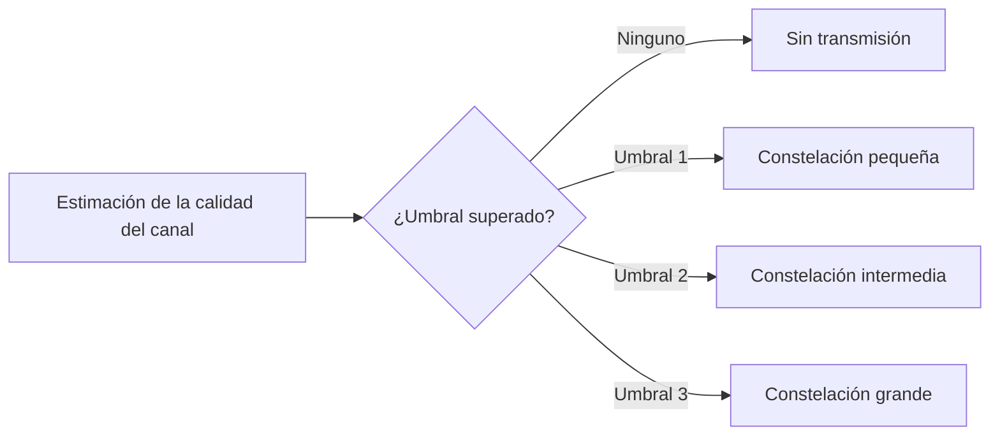
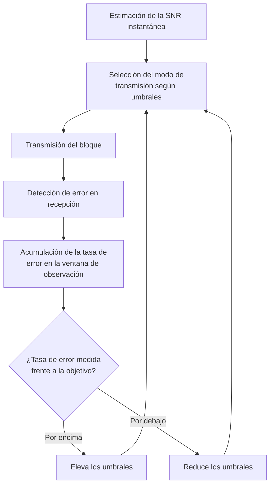
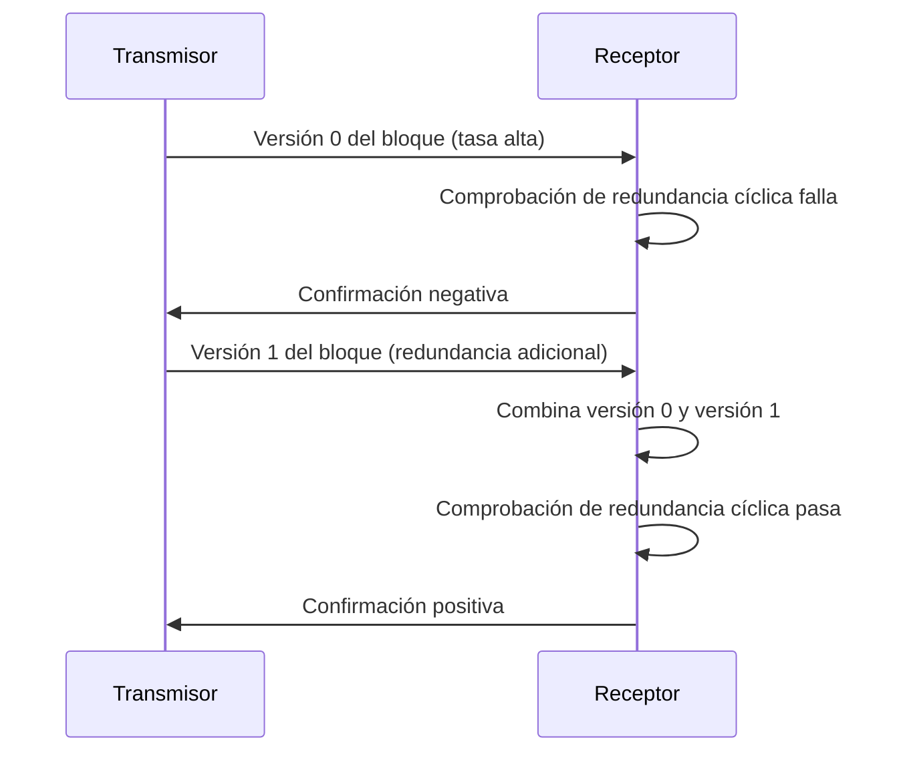

Los capítulos anteriores fijan la protección frente a errores en el momento del diseño:
un código de bloque o un código convolucional se elige una vez y se aplica por igual a
cualquier condición de canal. Un enlace radio real no ofrece esa comodidad, porque el
[desvanecimiento](../02_canal/section_2_desvanecimiento_y_respuesta_del_canal.md) hace
que la calidad instantánea del canal varíe en un rango de muchos decibelios a lo largo
del tiempo. Diseñar para el peor caso desperdicia capacidad la mayor parte del tiempo, y
diseñar para el caso medio deja al enlace sin protección cuando el canal empeora. Este
capítulo cierra el bloque de codificación combinando dos estrategias que resuelven ese
dilema desde extremos distintos: la adaptación de enlace, que ajusta la modulación y la
tasa de codificación a la calidad del canal estimada en cada instante, y la
retransmisión, que recupera a posteriori los bloques que ni siquiera esa adaptación
logra proteger.

## Introducción

La adaptación de enlace y la retransmisión comparten un mismo objetivo, mantener la
probabilidad de error dentro de un margen aceptable sin sacrificar más capacidad de la
necesaria, pero actúan en momentos distintos del ciclo de transmisión. La adaptación de
enlace decide antes de transmitir, a partir de una estimación de la calidad del canal,
qué modulación y qué tasa de codificación emplear. La retransmisión actúa después de
transmitir, cuando el receptor detecta que un bloque ha llegado con errores que la
codificación no ha podido corregir. Combinadas, ambas estrategias reducen la
probabilidad de que la aplicación reciba un bloque erróneo a un nivel muy inferior al
que cualquiera de las dos alcanzaría por separado, y es esa combinación, bajo el nombre
de retransmisión híbrida, la que emplean los sistemas de comunicaciones móviles actuales
para su canal de datos de usuario.

## Receptor para canales con desvanecimiento plano

### Ganancia variable y ecualización

Cuando el ancho de banda de la señal transmitida es mucho menor que el ancho de banda de
coherencia del canal, la condición de canal plano descrita en
[desvanecimiento y respuesta del canal](../02_canal/section_2_desvanecimiento_y_respuesta_del_canal.md)
se traduce, en el dominio discreto de los símbolos, en una relación muy simple entre lo
transmitido y lo recibido: cada símbolo se ve escalado por una única ganancia compleja
que varía lentamente de un símbolo a otro,

$$
r\lbrack n \rbrack = g\lbrack n \rbrack \, x\lbrack n \rbrack + w\lbrack n \rbrack
$$

donde $x\lbrack n \rbrack$ es el símbolo transmitido, $g\lbrack n \rbrack$ es la
ganancia compleja del canal en el instante del símbolo $n$, $w\lbrack n \rbrack$ es el
ruido blanco gaussiano aditivo a la entrada del receptor y $r\lbrack n \rbrack$ es la
muestra recibida tras el filtro adaptado y el muestreo descritos en
[modulaciones digitales](../03_modulacion/section_2_modulaciones_digitales.md). La
**ecualización** para un canal plano se reduce a deshacer esa ganancia multiplicando la
muestra recibida por su inversa,

$$
\hat{x}\lbrack n \rbrack = r\lbrack n \rbrack \, g^{-1}\lbrack n \rbrack
= x\lbrack n \rbrack + w\lbrack n \rbrack \, g^{-1}\lbrack n \rbrack
$$

de modo que, salvo el ruido, la muestra ecualizada recupera el símbolo transmitido. El
receptor necesita para ello conocer $g\lbrack n \rbrack$, que se obtiene en la práctica
mediante estimación de canal a partir de símbolos piloto conocidos por ambos extremos
del enlace, un procedimiento que se apoya en la misma noción de tiempo de coherencia que
fija cada cuánto debe repetirse esa estimación para que siga siendo válida.

### Efecto del desvanecimiento sobre la probabilidad de error

La ecualización deshace la ganancia del canal sobre la señal útil, pero no deshace su
efecto sobre la relación entre señal y ruido. Al dividir por $g\lbrack n \rbrack$, la
componente de ruido queda escalada por $g^{-1}\lbrack n \rbrack$, de modo que cuando el
desvanecimiento hace que $\lvert g\lbrack n \rbrack \rvert$ sea pequeño, el ruido
ecualizado crece en la misma proporción y la relación señal-ruido instantánea se
desploma. Definiendo la relación señal-ruido instantánea como

$$
\gamma\lbrack n \rbrack = \bar{\gamma} \, \lvert g\lbrack n \rbrack \rvert^2
$$

donde $\bar{\gamma}$ es la relación señal-ruido media del enlace, la probabilidad de
error de bit instantánea se obtiene sustituyendo $\gamma\lbrack n \rbrack$ en la
expresión de $P_b$ frente a $E_b/N_0$ de la modulación empleada. La probabilidad de
error media a lo largo del tiempo no es la que resultaría de aplicar esa expresión
directamente a $\bar{\gamma}$, sino el promedio de la probabilidad de error instantánea
sobre la distribución estadística de $\gamma\lbrack n \rbrack$, que hereda la
distribución del módulo de $g\lbrack n \rbrack$ descrita en el capítulo de
desvanecimiento. Para una modulación binaria antipodal sobre un canal con
desvanecimiento de Rayleigh, en el que $\lvert g\lbrack n \rbrack \rvert$ sigue la
distribución de Rayleigh y por tanto $\gamma\lbrack n \rbrack$ sigue una distribución
exponencial de media $\bar{\gamma}$, promediar la expresión $P_b = Q(\sqrt{2\gamma})$
sobre esa distribución tiene forma cerrada,

$$
\bar{P}_b = \frac{1}{2}\left(1 - \sqrt{\frac{\bar{\gamma}}{1+\bar{\gamma}}}\right)
$$

donde $\bar{P}_b$ es la probabilidad de error de bit media y $\bar{\gamma}$ la relación
señal-ruido media. Para $\bar{\gamma}$ grande esta expresión decae de forma inversamente
proporcional a $\bar{\gamma}$, en marcado contraste con el descenso exponencial de
$Q(\sqrt{2\bar{\gamma}})$ sobre un canal sin desvanecimiento: el desvanecimiento
convierte una caída de la probabilidad de error muy pronunciada en una caída mucho más
lenta, porque la media está dominada por los instantes en que el canal se desvanece
profundamente, aunque sean poco frecuentes.

???+ example "Degradación de error medio frente a un canal sin desvanecimiento"

    Un enlace con modulación binaria antipodal opera con una relación señal-ruido media
    $\bar{\gamma} = 10$ (10 dB). Sobre un canal sin desvanecimiento, la probabilidad de
    error de bit es

    $$
    P_b = Q\!\left(\sqrt{2 \cdot 10}\right) = Q(4{,}47) \approx 3{,}9 \cdot 10^{-6}
    $$

    Sobre un canal con desvanecimiento de Rayleigh y la misma relación señal-ruido
    media, la probabilidad de error de bit promediada sobre el desvanecimiento resulta

    $$
    \bar{P}_b = \frac{1}{2}\left(1 - \sqrt{\frac{10}{11}}\right) \approx 2{,}3 \cdot
    10^{-2}
    $$

    unas cuatro órdenes de magnitud peor que sin desvanecimiento, a pesar de que la
    relación señal-ruido media es idéntica en ambos casos. La diferencia procede de los
    instantes en que $\lvert g\lbrack n \rbrack \rvert$ es pequeño: aunque son
    minoritarios, aportan una probabilidad de error tan alta que dominan el promedio.
    Esta brecha es la que justifica que un sistema real no diseñe su modulación y su
    codificación para la relación señal-ruido media, sino que las adapte a la relación
    señal-ruido instantánea.

## Adaptación de modulación

### Modos de transmisión

La **adaptación de modulación** ajusta el tamaño de la constelación transmitida a la
relación señal-ruido instantánea del canal: cuando $\gamma\lbrack n \rbrack$ es alta,
una constelación con más símbolos transporta más bits por símbolo sin elevar
significativamente la probabilidad de error, y cuando $\gamma\lbrack n \rbrack$ cae,
solo una constelación con menos símbolos mantiene esa probabilidad dentro de un margen
aceptable. El sistema define un conjunto discreto de **modos de transmisión**, cada uno
asociado a un tamaño de constelación de la familia M-QAM descrita en
[modulaciones digitales](../03_modulacion/section_2_modulaciones_digitales.md), incluido
un modo de ausencia de transmisión para la relación señal-ruido más desfavorable, en la
que ni la constelación binaria ofrece una probabilidad de error tolerable.



### Diseño de umbrales

Cada modo de transmisión tiene asociado un **umbral** de relación señal-ruido: el modo
se selecciona comparando la relación señal-ruido instantánea contra los umbrales de
todos los modos disponibles y eligiendo el de mayor tamaño de constelación cuyo umbral
no supera esa relación señal-ruido. El umbral de un modo se fija exigiendo que, justo en
ese punto de cruce, la probabilidad de error de bit de esa constelación coincida con una
tasa de error objetivo $\text{BER}_{\text{obj}}$.

Partiendo de la probabilidad de error de símbolo de una constelación M-QAM cuadrada,

$$
P_s \approx 4\left(1 - \frac{1}{\sqrt{M}}\right)
Q\!\left(\sqrt{\frac{3 \gamma_s}{M-1}}\right)
$$

donde $\gamma_s$ es la relación señal-ruido por símbolo y aproximando la probabilidad de
error de bit como $P_b \approx P_s / k$ con $k = \log_2 M$ bajo un mapeo de bits a
símbolos que minimiza los errores entre vecinos, igualar $P_b$ a
$\text{BER}_{\text{obj}}$ y despejar $\gamma_s$ da el umbral de relación señal-ruido por
símbolo del modo de tamaño $M$,

$$
\gamma_{s,\text{th}}(M) = \frac{M-1}{3}
\left\lbrack Q^{-1}\!\left(\frac{k \, \text{BER}_{\text{obj}}}{4\left(1 -
1/\sqrt{M}\right)}\right) \right\rbrack^2
$$

donde $Q^{-1}(\cdot)$ es la inversa de la función Q empleada en
[modulaciones digitales](../03_modulacion/section_2_modulaciones_digitales.md). Esta
expresión asume una estimación de canal perfecta en el receptor. Cuando la estimación es
imperfecta, la constelación efectiva que ve el decisor está más dispersa que la ideal
para la misma relación señal-ruido nominal, y mantener la tasa de error objetivo exige
elevar los umbrales por encima del valor anterior con un margen adicional, tanto mayor
cuanto peor es la calidad de la estimación de canal.

```python linenums="1"
import math
from statistics import NormalDist


def umbral_snr_simbolo(
    tamano_constelacion: int, ber_objetivo: float
) -> float:
    """Calcula el umbral de SNR por símbolo de un modo M-QAM.

    Args:
        tamano_constelacion: Número de símbolos de la constelación M-QAM.
        ber_objetivo: Tasa de error de bit objetivo del sistema.

    Returns:
        Umbral de relación señal-ruido por símbolo, en unidades lineales.
    """
    k = math.log2(tamano_constelacion)
    argumento = (k * ber_objetivo) / (4 * (1 - 1 / math.sqrt(tamano_constelacion)))
    x = NormalDist().inv_cdf(1 - argumento)
    return (tamano_constelacion - 1) / 3 * x**2


ber_objetivo = 1e-3
for tamano in (4, 16, 64):
    umbral = umbral_snr_simbolo(tamano, ber_objetivo)
    print(f"M={tamano}: umbral = {umbral:.2f} ({10 * math.log10(umbral):.1f} dB)")
```

```plaintext title="Expected output"
M=4: umbral = 9.55 (9.8 dB)
M=16: umbral = 45.11 (16.5 dB)
M=64: umbral = 179.85 (22.5 dB)
```

???+ example "Elección de modulación que maximiza el rendimiento a una SNR dada"

    Un sistema dispone de tres modos de transmisión, con constelaciones de 4, 16 y 64
    símbolos, y una tasa de error objetivo $\text{BER}_{\text{obj}} = 10^{-3}$.
    Aplicando la expresión de umbrales con estimación de canal ideal se obtienen los
    valores de la tabla anterior: 9,8 dB para la constelación de 4 símbolos, 16,5 dB
    para la de 16 y 22,5 dB para la de 64.

    El canal presenta en un instante dado una relación señal-ruido por símbolo de 15 dB
    (unas 31,6 unidades lineales). Ese valor supera el umbral de la constelación de 4
    símbolos, 9,55, pero no alcanza el umbral de la constelación de 16 símbolos, 45,11.
    El sistema selecciona por tanto la constelación de 4 símbolos, que transporta 2 bits
    por símbolo, y no la de 16, aunque la relación señal-ruido disponible sea más alta
    que el umbral nominal de la constelación de 4 símbolos: elegir la constelación de 16
    símbolos en ese punto elevaría la tasa de error de bit por encima del objetivo. El
    régimen binario resultante es el máximo alcanzable sin incumplir la tasa de error
    objetivo, no el máximo que la constelación más grande podría ofrecer en abstracto.

### Tasa de error media frente a tasa de error objetivo

Los umbrales se fijan de modo que la tasa de error objetivo se alcance exactamente en el
punto de cruce entre dos modos, pero la relación señal-ruido instantánea rara vez
coincide con ese punto de cruce: la mayor parte del tiempo se encuentra en algún punto
intermedio entre un umbral y el siguiente, donde la constelación seleccionada ofrece una
tasa de error inferior a la objetivo. La tasa de error media resultante es, por esa
razón, sistemáticamente más baja que la tasa de error objetivo empleada para diseñar los
umbrales. Fijar los umbrales con precisión exigiría conocer de antemano la distribución
estadística de la relación señal-ruido del canal, información que en la práctica no está
disponible con la exactitud necesaria, lo que deja a la adaptación de bucle externo como
mecanismo de corrección de ese desconocimiento.

## Adaptación de bucle externo

La **adaptación de bucle externo** corrige el error de diseño de los umbrales
observando, a posteriori, la tasa de error que el sistema efectivamente experimenta. El
receptor dispone ya de un mecanismo de detección de errores en cada bloque recibido,
heredado de la codificación de canal descrita en
[codificación de canal](section_1_codificacion_de_canal.md), y ese mismo mecanismo sirve
para estimar la tasa de error promedio durante un intervalo de observación. Si la tasa
de error medida supera la tasa de error objetivo, el bucle externo eleva ligeramente y
de forma uniforme todos los umbrales, lo que empuja al sistema hacia modos de
transmisión más conservadores y reduce la tasa de error. Si la tasa de error medida
queda por debajo de la objetivo, el bucle reduce los umbrales en la misma proporción, lo
que permite emplear modos de transmisión más agresivos y eleva el régimen binario medio.
El ajuste es deliberadamente lento y de paso pequeño, porque su función es corregir un
sesgo sistemático de los umbrales, no reaccionar a la variación instantánea del canal,
que ya gestiona la selección de modo descrita en la sección anterior.



## Canal de retroalimentación

La selección del modo de transmisión es una decisión del transmisor, pero la magnitud
que la gobierna, la calidad instantánea del canal, solo puede medirla el receptor a
partir de la señal que efectivamente llega. Esa asimetría exige un **canal de
retroalimentación** desde el receptor hacia el transmisor, por el que viaja el modo de
transmisión que debe emplearse en la siguiente transmisión, o la información de calidad
de canal a partir de la cual el transmisor deriva ese modo.

### Estimación y predicción de la calidad del canal

Entre el instante en que el receptor mide la calidad del canal y el instante en que el
transmisor aplica el modo derivado de esa medida transcurre un retardo compuesto por el
tiempo de procesado en ambos extremos y el tiempo de propagación por el canal de
retroalimentación. Si ese retardo es una fracción apreciable del
[tiempo de coherencia](../02_canal/section_2_desvanecimiento_y_respuesta_del_canal.md#frecuencia-doppler-y-tiempo-de-coherencia)
del canal, el modo de transmisión que llega al transmisor corresponde a un estado del
canal que ya ha cambiado de forma significativa. La solución habitual no es reducir el
retardo del canal de retroalimentación, que está acotado por la propagación física, sino
sustituir la medida instantánea por una **predicción** de la calidad del canal en el
instante futuro en que la decisión se aplicará, construida a partir de la medida actual
y de las medidas anteriores.

???+ example "Bucle de adaptación cuya latencia excede el tiempo de coherencia"

    Un terminal se desplaza a $v = 300$ km/h ($83{,}3$ m/s) y recibe una portadora de
    $f_c = 3{,}5$ GHz, para la que la longitud de onda es
    $\lambda = c/f_c \approx 0{,}0857$ m. El desplazamiento Doppler máximo es

    $$
    f_{d,\text{máx}} = \frac{v}{\lambda} \approx 972\ \text{Hz}
    $$

    y el tiempo de coherencia correspondiente, aplicando la relación de orden de
    magnitud $T_c \sim 1/f_{d,\text{máx}}$ del capítulo de desvanecimiento, resulta

    $$
    T_c \sim \frac{1}{972\ \text{Hz}} \approx 1{,}0\ \text{ms}
    $$

    Si el bucle de adaptación, sumando el tiempo de procesado en el receptor, la
    propagación por el canal de retroalimentación y el procesado en el transmisor,
    acumula un retardo total de 4 ms, ese retardo es cuatro veces mayor que el tiempo de
    coherencia estimado. El modo de transmisión que el transmisor aplica corresponde a
    una medida de calidad de canal tomada varios tiempos de coherencia atrás, un
    intervalo en el que la respuesta del canal ya se ha renovado por completo de forma
    estadísticamente independiente de la medida original. El sistema, en la práctica,
    adapta su modulación a un canal que ya no existe, y solo una predicción que
    extrapole la tendencia de las medidas anteriores, en lugar de reutilizar la última
    medida sin cambios, puede mitigar parcialmente ese desajuste.

### Agrupación en bloques para reducir señalización

Señalizar un modo de transmisión distinto para cada símbolo multiplicaría el régimen
binario exigido al canal de retroalimentación hasta hacerlo comparable al del propio
enlace de datos. La solución habitual agrupa varios símbolos consecutivos en un
**bloque** y señaliza un único modo de transmisión por bloque, en lugar de por símbolo,
lo que reduce el régimen binario del canal de retroalimentación en la misma proporción
que el número de símbolos por bloque. El precio de esa agrupación es una pérdida de
granularidad temporal: dentro de un bloque, el modo de transmisión aplicado es el mismo
para todos los símbolos aunque la calidad del canal varíe ligeramente entre ellos, de
modo que el tamaño del bloque debe mantenerse pequeño frente al tiempo de coherencia del
canal para que esa aproximación siga siendo razonable.

## Adaptación conjunta de modulación y codificación

El salto de probabilidad de error entre dos modos de transmisión consecutivos es grande
cuando la única variable de ajuste es el tamaño de la constelación: pasar de una
constelación a la siguiente del catálogo M-QAM multiplica el número de bits por símbolo
en un paso discreto y desplaza el umbral de relación señal-ruido varios decibelios de
una sola vez. Ese salto deja fuera de un aprovechamiento eficiente a todo el rango de
relación señal-ruido comprendido entre dos umbrales consecutivos, porque en él el
sistema transmite con más protección de la estrictamente necesaria. La **adaptación
conjunta de modulación y codificación** añade la tasa de codificación como una segunda
variable de ajuste, independiente del tamaño de la constelación, lo que multiplica el
número de modos de transmisión disponibles y reduce el salto de régimen binario entre
modos consecutivos.

### Esquemas de modulación y codificación

Combinar cada tamaño de constelación con varias tasas de codificación, obtenidas por
perforado del mismo código madre según lo descrito en
[perforado](section_2_codigos_convolucionales.md#perforado), genera un catálogo de
**esquemas de modulación y codificación** mucho más fino que el que resultaría de variar
solo la constelación. La magnitud que resume cada esquema es la **eficiencia espectral**
$\eta = k R$, el producto de los bits por símbolo de la constelación y la tasa de
codificación, expresada en bits de información útil por símbolo transmitido.

| Constelación | Tasa de codificación $R$ | Eficiencia espectral $\eta$ (bit/símbolo) |
| ------------ | ------------------------ | ----------------------------------------- |
| `QPSK`       | $1/2$                    | $1{,}0$                                   |
| `QPSK`       | $2/3$                    | $1{,}33$                                  |
| `16-QAM`     | $1/2$                    | $2{,}0$                                   |
| `16-QAM`     | $2/3$                    | $2{,}67$                                  |
| `64-QAM`     | $1/2$                    | $3{,}0$                                   |
| `64-QAM`     | $2/3$                    | $4{,}0$                                   |

Cada fila de la tabla corresponde a un modo de transmisión con su propio umbral de
relación señal-ruido, y el conjunto ordenado por umbral creciente sustituye al catálogo
de la sección anterior, con la ventaja de que el salto de eficiencia espectral entre
filas consecutivas es mucho menor que el salto entre dos tamaños de constelación
consecutivos. El compromiso de fondo no cambia respecto al que ya fija el perforado en
[perforado](section_2_codigos_convolucionales.md#perforado): una tasa de codificación
mayor eleva el régimen binario útil pero reduce la distancia libre efectiva del código,
así que a mayor redundancia añadida, mayor protección frente a errores y menor régimen
binario resultante.

### Indicador de calidad del canal

El transmisor no puede seleccionar un esquema de modulación y codificación sin recibir
del receptor una medida de la calidad del canal, resumida habitualmente en un
**indicador de calidad del canal**: un valor numérico, cuantificado a un número reducido
de niveles para limitar el régimen binario del canal de retroalimentación, que el
receptor deriva de la relación señal-ruido estimada y que el transmisor traduce en un
esquema de modulación y codificación concreto mediante una tabla de correspondencia
fijada de antemano entre ambos extremos. Las redes móviles concretas fijan el formato,
la periodicidad y el rango de este indicador en sus propias especificaciones de control,
aspecto que se trata en los capítulos dedicados a cada tecnología de red móvil; lo que
interesa aquí es únicamente la función que cumple, cerrar el bucle de adaptación
proporcionando al transmisor la información que solo el receptor puede medir.


## Protocolos de retransmisión

La adaptación de enlace reduce la frecuencia con la que un bloque llega con errores,
pero no la elimina: incluso con el esquema de modulación y codificación óptimo para la
relación señal-ruido instantánea, queda una probabilidad residual de que el
desvanecimiento caiga por debajo de lo previsto durante la transmisión de un bloque
concreto. Los **protocolos de retransmisión** recuperan esos bloques solicitando al
transmisor que repita, de una forma u otra, la información que no llegó correctamente.

### Parada y espera, vuelta atrás N y repetición selectiva

Tres esquemas clásicos de control de flujo y de error organizan la retransmisión según
cómo tratan los bloques que siguen al que falla. En **parada y espera**, el transmisor
envía un bloque y detiene toda transmisión posterior hasta recibir confirmación de ese
bloque concreto, lo que simplifica el protocolo al precio de dejar el canal inactivo
durante cada espera de confirmación. En **vuelta atrás N**, el transmisor continúa
enviando bloques sin esperar la confirmación de cada uno, pero si el receptor detecta un
bloque erróneo descarta ese bloque y todos los que le siguen, y el transmisor debe
retransmitir desde el bloque fallido en adelante, aunque los bloques posteriores
hubieran llegado bien. En **repetición selectiva**, el receptor conserva los bloques
correctos que llegan después de uno erróneo y solicita únicamente la retransmisión del
bloque concreto que falló, lo que evita repetir información ya recibida a costa de un
búfer de recepción más complejo, capaz de reordenar bloques que llegan fuera de
secuencia.

### ARQ

La **repetición automática de solicitud**, conocida por las siglas inglesas ARQ de
_automatic repeat request_, aplica cualquiera de los tres esquemas anteriores sobre un
código capaz solo de detectar errores, como la comprobación de redundancia cíclica
descrita en
[codificación de canal](section_1_codificacion_de_canal.md#comprobacion-de-redundancia-ciclica).
El receptor comprueba cada bloque recibido: si la comprobación pasa, envía una
confirmación positiva y el bloque se considera entregado; si falla, envía una
confirmación negativa y el transmisor repite el mismo bloque, sin ninguna modificación,
hasta que la comprobación pase o se alcance un número máximo predefinido de intentos.
Esa repetición sin modificación es la diferencia esencial que separa el ARQ básico del
esquema híbrido de la sección siguiente.

???+ example "Cálculo de la tasa efectiva tras varias retransmisiones"

    Un enlace emplea ARQ con un máximo de $N_{\text{máx}} = 4$ intentos por bloque,
    sobre un canal en el que la probabilidad de que un bloque llegue con error no
    corregible, la probabilidad de error de bloque, vale $\text{PER} = 0{,}1$, y se
    supone independiente entre intentos sucesivos.

    El número esperado de intentos hasta que un bloque se entrega, contando también el
    caso desfavorable en que se agotan los $N_{\text{máx}}$ intentos sin éxito, es

    $$
    E\lbrack N \rbrack = \sum_{j=1}^{N_{\text{máx}}-1} j \, \text{PER}^{j-1}
    (1-\text{PER}) + N_{\text{máx}} \, \text{PER}^{N_{\text{máx}}-1}
    $$

    donde el primer término suma los casos en que el bloque se entrega en el intento
    $j$-ésimo tras $j-1$ fallos, y el segundo término recoge el caso en que ni siquiera
    el último intento tiene garantía de éxito. Sustituyendo los valores numéricos,

    $$
    E\lbrack N \rbrack = 1{,}111
    $$

    Cada retransmisión ocupa un intervalo de canal adicional sin aportar información
    nueva, de modo que la tasa efectiva de bloques entregados por intervalo de canal
    ocupado es el inverso de $E\lbrack N \rbrack$,

    $$
    R_{\text{ef}} = \frac{1}{E\lbrack N \rbrack} \approx 0{,}90
    $$

    Con una probabilidad de error de bloque del 10 %, el protocolo ARQ básico consume
    en promedio algo más del 11 % de capacidad adicional en retransmisiones para
    entregar la misma cantidad de información útil, reduciendo la tasa efectiva a un
    90 % de la nominal. Cuanto mayor es $\text{PER}$, más rápido crece
    $E\lbrack N \rbrack$ y más se aleja $R_{\text{ef}}$ de la unidad, lo que motiva
    combinar el ARQ con la corrección hacia adelante en lugar de emplearlo en solitario
    sobre canales de calidad muy variable.

### HARQ

La **repetición automática de solicitud híbrida**, conocida por las siglas inglesas HARQ
de _hybrid automatic repeat request_, mantiene la misma lógica de detección mediante
comprobación de redundancia cíclica y de confirmación positiva o negativa que el ARQ
básico, pero cambia lo que se retransmite. En lugar de repetir el bloque tal cual, el
transmisor envía una **versión** distinta del mismo bloque de información, con un número
diferente de bits sistemáticos y de bits de redundancia, de modo que cada intento
adicional aporta al receptor información nueva y no una simple copia de la anterior. Esa
diferencia tiene dos consecuencias que el ARQ básico no ofrece: permite reducir la tasa
de codificación efectiva de forma progresiva a medida que se acumulan intentos, y
permite al receptor aprovechar la información suave de las versiones anteriores en lugar
de descartarlas al recibir una nueva.



### Combinación de versiones y redundancia incremental

El aprovechamiento de las versiones anteriores admite dos técnicas, que pueden aplicarse
por separado o combinadas. La **combinación de búsqueda** (_chase combining_) transmite
en cada versión los mismos bits codificados que en la anterior, y el receptor suma las
muestras de decisión suave, en el sentido descrito en
[decisión suave](section_2_codigos_convolucionales.md#decision-suave), de todas las
versiones recibidas antes de decodificar. Si las versiones sufren ruido independiente
entre sí, sumar $N$ muestras de una misma rama del código equivale a una combinación de
máxima verosimilitud cuya relación señal-ruido efectiva es la suma de las relaciones
señal-ruido individuales,

$$
\gamma_{\text{ef}} = \sum_{i=1}^{N} \gamma_i
$$

donde $\gamma_i$ es la relación señal-ruido de la versión $i$-ésima. Esa suma es la
razón por la que combinar varias copias débiles puede superar la tasa de error que
cualquiera de ellas alcanzaría por separado, incluso sin haber cambiado el código
empleado.

La **redundancia incremental** (_incremental redundancy_), en cambio, transmite en cada
versión bits de redundancia distintos de los ya enviados, en lugar de repetir los
mismos. El receptor no combina réplicas de la misma información, sino que acumula cada
vez más bits de redundancia del código madre, lo que reduce de forma efectiva la tasa de
codificación con cada intento adicional y aumenta la distancia libre efectiva del código
que el descodificador puede explotar. Frente a la combinación de búsqueda, la
redundancia incremental aprovecha mejor cada intento adicional porque aporta información
de código nueva en lugar de una segunda medida de la misma información, aunque exige que
el transmisor y el receptor mantengan sincronizado qué subconjunto de bits del código
madre corresponde a cada versión.

### Ajuste de tasa con búfer circular

El mecanismo que hace posible generar las distintas versiones de redundancia incremental
sin diseñar un codificador nuevo para cada una es el mismo perforado descrito en
[perforado](section_2_codigos_convolucionales.md#perforado), aplicado sobre una
estructura de datos concreta: un **búfer circular** que almacena, en un orden fijo, los
bits sistemáticos seguidos de los bits de redundancia que produce el código madre. Cada
versión de redundancia se define por un punto de inicio distinto dentro de ese búfer: la
primera versión suele comenzar por los bits sistemáticos y una fracción pequeña de la
redundancia, lo que produce una tasa de codificación efectiva alta y un régimen binario
elevado si el bloque se entrega al primer intento, mientras que las versiones siguientes
desplazan el punto de inicio hacia tramos del búfer que contienen más bits de
redundancia y menos bits sistemáticos, aportando al receptor exactamente el complemento
de información que la versión anterior no incluía. Cuando el recorrido del búfer alcanza
su final antes de que el bloque se entregue, continúa desde el principio, lo que
convierte el ajuste de tasa en una repetición de los bits ya enviados en lugar de en
redundancia nueva a partir de ese punto. El resultado es un único mecanismo, perforar
sobre un búfer recorrido de forma circular, que sirve tanto para fijar la tasa de
codificación de la primera transmisión como para generar cada versión sucesiva de la
retransmisión híbrida, sin necesidad de que el transmisor y el receptor negocien un
codificador distinto para cada caso.

Con la modulación y la tasa de codificación ajustadas a la calidad instantánea del
canal, y con la retransmisión híbrida recuperando lo que esa adaptación no logra
proteger a la primera, el bloque de codificación de canal queda completo: desde la
paridad más simple hasta el ajuste dinámico de un búfer circular, cada mecanismo añade
una capa de defensa frente a un canal que nunca se comporta exactamente como predice su
modelo estadístico.
