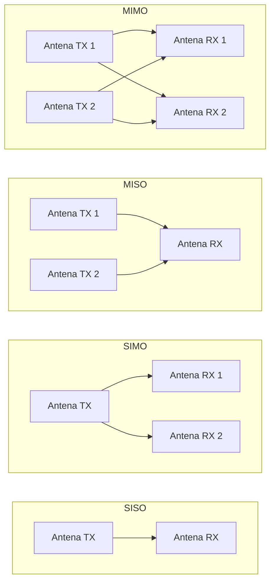
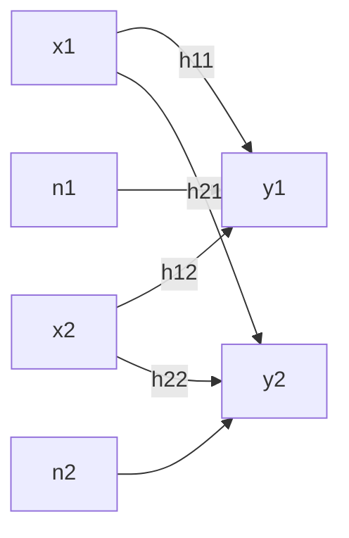
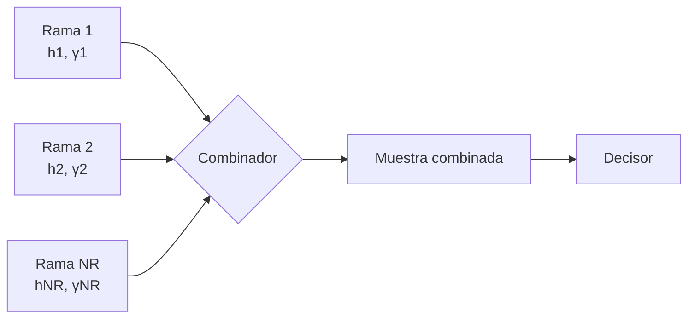
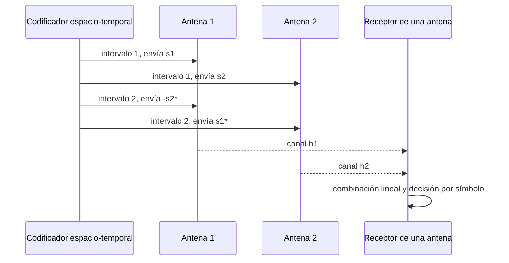

Un sistema con una sola antena en transmisión y en recepción queda a merced de una única
realización del canal radio en cada instante. Añadir antenas, tanto en el transmisor
como en el receptor, multiplica el número de subcanales disponibles entre ambos extremos
del enlace y abre tres vías distintas para aprovechar esa multiplicidad: concentrar más
potencia en el receptor, combatir el desvanecimiento combinando réplicas
estadísticamente independientes de la señal, o transmitir varios flujos de información
distintos de forma simultánea sobre el mismo canal de radio. Este capítulo describe el
canal con múltiples antenas, las tres ganancias que de él se derivan y las técnicas de
diversidad, en recepción, en transmisión y conjunta, con las que un sistema **MIMO**
(_multiple input, multiple output_) explota esa multiplicidad para mejorar la fiabilidad
del enlace.

## Introducción

Un sistema con $N_T$ antenas transmisoras y $N_R$ antenas receptoras da lugar a $N_T
\times N_R$ subcanales entre cada antena transmisora y cada antena receptora, cada uno
de ellos con su propia ganancia compleja variante en el tiempo y en la frecuencia, tal
como se caracteriza en
[desvanecimiento y respuesta del canal](../02_canal/section_2_desvanecimiento_y_respuesta_del_canal.md).
La denominación **MIMO** designa de forma genérica cualquier sistema con más de una
antena en al menos uno de los dos extremos del enlace, y se reserva el nombre de
**SISO** (_single input, single output_) para el caso de una sola antena en cada
extremo, que es el caso particular sobre el que se construyen los modelos de canal y de
modulación de los capítulos anteriores.

La familia **SIMO** (_single input, multiple output_) añade varias antenas solo en
recepción, la familia **MISO** (_multiple input, single output_) las añade solo en
transmisión, y la denominación MIMO propiamente dicha se reserva para el caso general
con varias antenas en ambos extremos. Las tres ganancias que se desarrollan en este
capítulo, de array, de diversidad y de multiplexación, están disponibles en distinta
medida según cuál de estas cuatro configuraciones se emplee, y esa disponibilidad es la
que determina qué técnica de las descritas a continuación resulta aplicable en cada
caso.

## Canal MIMO

### Matriz de ganancias complejas

En un canal de banda estrecha con una sola antena en cada extremo, la respuesta del
canal en un instante dado es una única ganancia compleja $h$, tal como se define en
[desvanecimiento y respuesta del canal](../02_canal/section_2_desvanecimiento_y_respuesta_del_canal.md).
Cuando el transmisor dispone de $N_T$ antenas y el receptor de $N_R$, existe un subcanal
distinto entre cada par de antenas transmisora y receptora, y el conjunto completo de
esas ganancias complejas se organiza en la **matriz de canal MIMO** $\mathbf{H}$.

La convención de dimensiones que se sigue en este capítulo, y que es la fuente más
habitual de confusión al trabajar con sistemas de múltiples antenas, es la siguiente:
$\mathbf{H}$ tiene $N_R$ filas y $N_T$ columnas, de modo que el elemento $h_{ij}$,
situado en la fila $i$ y la columna $j$, es la ganancia compleja del subcanal que va
desde la antena transmisora $j$ hasta la antena receptora $i$. Con esa convención, el
vector de señales recibidas $\mathbf{y}$, de dimensión $N_R \times 1$, se relaciona con
el vector de señales transmitidas $\mathbf{x}$, de dimensión $N_T \times 1$, mediante

$$
\mathbf{y} = \mathbf{H}\, \mathbf{x} + \mathbf{n}
$$

donde $\mathbf{n}$ es el vector de ruido en recepción, también de dimensión $N_R \times
1$, con las mismas propiedades de ruido blanco gaussiano aditivo independiente en cada
antena que se describen para el caso de una sola antena en
[señales aleatorias y ruido](../01_senales/section_2_senales_aleatorias_y_ruido.md). La
fila $i$ de $\mathbf{H}$ recoge, por tanto, cómo contribuye cada una de las $N_T$
antenas transmisoras a la señal que llega a la antena receptora $i$, mientras que la
columna $j$ recoge cómo se reparte la señal de la antena transmisora $j$ entre las $N_R$
antenas receptoras. El número total de subcanales, y por tanto el número de elementos de
$\mathbf{H}$, es $N_T \times N_R$.

### Variación en tiempo y en frecuencia

Cada elemento de $\mathbf{H}$ es, por sí mismo, una ganancia compleja sujeta a las
mismas causas de variación que el canal de una sola antena. En el dominio de la
frecuencia, cada subcanal presenta su propia respuesta en frecuencia $H_{ij}(f)$,
gobernada por la dispersión temporal del entorno de propagación, y puede tratarse como
plano o como selectivo en frecuencia frente al ancho de banda de coherencia $B_c$
definido en
[desvanecimiento y respuesta del canal](../02_canal/section_2_desvanecimiento_y_respuesta_del_canal.md).
En el dominio del tiempo, cada subcanal evoluciona con la movilidad del terminal según
el tiempo de coherencia $T_c$ definido en ese mismo capítulo, de modo que la matriz de
canal completa se convierte, en general, en una matriz que varía subcanal a subcanal,
símbolo a símbolo y subportadora a subportadora, $\mathbf{H}\lbrack k \rbrack$, donde
$k$ indexa el instante de símbolo o la subportadora según se trabaje en el dominio del
tiempo o en el de la frecuencia.

Esta dependencia temporal y frecuencial no introduce ningún fenómeno físico nuevo
respecto al caso de una sola antena: lo que aporta el sistema de múltiples antenas es la
posibilidad de que, si las antenas transmisoras o receptoras están suficientemente
separadas entre sí, los distintos subcanales de $\mathbf{H}$ se desvanezcan de forma
poco correlacionada entre ellos, aunque la evolución temporal y frecuencial de cada uno
individualmente responda a las mismas magnitudes de coherencia ya caracterizadas. Esa
independencia estadística entre subcanales es, precisamente, el recurso que explotan las
ganancias de diversidad que se presentan a continuación.

## Ganancias de un sistema MIMO

Disponer de $N_T \times N_R$ subcanales en lugar de uno solo permite obtener tres tipos
de mejora, que no son mutuamente compatibles en su totalidad y que constituyen el eje
central de este capítulo.

### Ganancia de array

La **ganancia de array** es el incremento en la potencia total recibida que se obtiene
al combinar de forma coherente las señales procedentes de varias antenas. Se logra
principalmente en la etapa de recepción, donde no existe una limitación de potencia
radiada equivalente a la del transmisor, y consiste en sumar las contribuciones de cada
rama de manera que se refuercen entre sí en lugar de promediarse o cancelarse.

Cuando las $N_R$ ramas de recepción presentan una relación señal-ruido media idéntica
$\bar{\gamma}$ y se combinan de forma que la relación señal-ruido resultante es la suma
de las relaciones señal-ruido individuales, la relación señal-ruido combinada promedia a

$$
\bar{\gamma}_{\text{comb}} = \sum_{i=1}^{N_R} \bar{\gamma}_i = N_R\, \bar{\gamma}
$$

de modo que la ganancia de array, expresada como el cociente entre la relación
señal-ruido combinada y la de una sola rama, vale $N_R$ en escala lineal, o
equivalentemente $10 \log_{10} N_R$ en decibelios. Esta suma de relaciones señal-ruido
es la que proporciona la combinación de máxima relación descrita más adelante en este
capítulo, y es la única de las técnicas de combinación en recepción que consigue
ganancia de array propiamente dicha.

???+ example "Ganancia de array de la combinación coherente de cuatro ramas"

    Un receptor dispone de cuatro antenas cuyas ramas presentan, cada una, una relación
    señal-ruido media idéntica de $\bar{\gamma} = 5\ \text{dB}$, equivalente a un valor
    lineal de $\bar{\gamma} \approx 3{,}16$. Si el receptor combina las cuatro ramas de
    forma que sus relaciones señal-ruido se sumen, la relación señal-ruido combinada
    resulta

    $$
    \bar{\gamma}_{\text{comb}} = 4 \times 3{,}16 \approx 12{,}64
    $$

    equivalente a $10 \log_{10}(12{,}64) \approx 11{,}0\ \text{dB}$. La ganancia de
    array obtenida es la diferencia entre este valor y el de una sola rama,
    $11{,}0 - 5{,}0 = 6{,}0\ \text{dB}$, que coincide con $10 \log_{10}(4)$. El
    resultado no depende del valor concreto de $\bar{\gamma}$ de partida: cuadruplicar
    el número de ramas combinadas de forma coherente añade siempre $6$ dB de ganancia
    de array, con independencia de la relación señal-ruido de la que se parta.

### Ganancia de diversidad

La **ganancia de diversidad** no consiste en aumentar la potencia media recibida, sino
en reducir la varianza de la distribución de la ganancia equivalente del canal tras la
combinación. En un enlace con una sola antena sujeto a desvanecimiento de Rayleigh, la
ganancia del canal puede caer, en un instante dado, muy por debajo de su valor medio, y
es precisamente esa caída profunda la que domina la probabilidad de error del enlace a
relaciones señal-ruido altas. Si se dispone de varias réplicas de la señal que se
desvanecen de forma estadísticamente independiente, la probabilidad de que todas ellas
caigan simultáneamente muy por debajo de su valor medio es mucho menor que la
probabilidad de que lo haga una sola, y esa reducción de la probabilidad de caída
profunda conjunta es la ganancia de diversidad.

El número de réplicas independientes que se combinan se denomina **orden de diversidad**
$d$. Cuando se combinan $d$ ramas con desvanecimiento de Rayleigh independiente mediante
combinación de máxima relación, la probabilidad media de error de bit, en lugar de
decrecer de forma lineal con la relación señal-ruido media como ocurre en un canal sin
desvanecimiento, decrece de forma proporcional a la potencia $-d$ de esa relación a
relaciones señal-ruido suficientemente altas,

$$
P_b \sim \frac{1}{\bar{\gamma}^{\,d}}
$$

Esta relación de proporcionalidad es asintótica, válida en el régimen de relación
señal-ruido alta en el que la constante que multiplica a $\bar{\gamma}^{-d}$ deja de
influir en la pendiente observada. Su consecuencia práctica es directa: al representar
la probabilidad de error de bit frente a la relación señal-ruido media en escala
logarítmica en ambos ejes, la curva resultante es aproximadamente una recta cuya
pendiente vale $-d$, de modo que cada orden adicional de diversidad multiplica por un
factor mayor la rapidez con la que la probabilidad de error cae al aumentar la relación
señal-ruido, frente a la caída mucho más lenta que exhibe un enlace de un solo canal con
desvanecimiento, cuyo orden de diversidad es $d = 1$.

???+ example "Orden de diversidad y pendiente de error de una configuración SIMO"

    Un receptor con una sola antena transmisora y tres antenas receptoras combina las
    tres ramas mediante máxima relación sobre un canal con desvanecimiento de Rayleigh
    independiente entre ramas. El orden de diversidad de esta configuración es
    $d = N_R = 3$, de modo que la probabilidad de error de bit decrece
    asintóticamente como $\bar{\gamma}^{-3}$.

    Frente a un enlace de una sola antena en cada extremo, cuyo orden de diversidad es
    $d = 1$ y cuya probabilidad de error decrece como $\bar{\gamma}^{-1}$, un
    incremento de $10\ \text{dB}$ en la relación señal-ruido media reduce la
    probabilidad de error en un factor de $10$ en el caso SISO, pero en un factor de
    $10^3 = 1000$ en la configuración SIMO de tres antenas receptoras. La ganancia de
    array adicional que aporta la combinación de máxima relación, $10 \log_{10}(3)
    \approx 4{,}8\ \text{dB}$, desplaza además la curva completa hacia relaciones
    señal-ruido más bajas, de modo que las dos mejoras, de pendiente y de
    desplazamiento, actúan de forma simultánea pero conceptualmente distinta.

### Ganancia de multiplexación

La **ganancia de multiplexación** consiste en transmitir varios flujos de información
independientes de forma simultánea sobre el mismo canal de radio, en lugar de repetir la
misma información por varias ramas para obtener diversidad. El número máximo de flujos
independientes que pueden separarse en recepción, denominado $N_S$, está limitado por el
menor de los dos números de antenas,

$$
N_S = \min(N_T, N_R)
$$

Aunque los flujos se interfieren entre sí en cada antena receptora, esa interferencia
puede cancelarse en recepción siempre que se conozca la respuesta completa del canal
MIMO $\mathbf{H}$, lo que permite separar de nuevo los flujos individuales. Las técnicas
concretas con las que se diseña esa separación, la matriz de precodificación en
transmisión y la ecualización espacial o la cancelación de interferencias en recepción,
exceden el alcance de este capítulo, dedicado a los fundamentos, y se tratan junto con
la operación multiusuario y la estimación del canal MIMO en
[multiplexación espacial y MIMO multiusuario](./section_2_multiplexacion_espacial.md).

### Compromiso entre diversidad y multiplexación

La ganancia de diversidad y la ganancia de multiplexación no pueden maximizarse de forma
simultánea con los mismos recursos de antena: existe entre ellas una relación
inversamente proporcional. La diversidad amplifica la ganancia del canal efectivo
mediante precodificación en transmisión y combinación espacial en recepción, mientras
que la multiplexación aumenta el número de flujos independientes mediante
precodificación en transmisión y ecualización espacial o cancelación de interferencias
en recepción. A medida que un sistema dedica más de sus antenas a maximizar los flujos
independientes transmitidos, dispone de menos recursos espaciales para promediar
desvanecimientos independientes, y a la inversa: un sistema que dedica todas sus antenas
a diversidad no transmite más de un flujo de información. Entre estos dos extremos
existe un continuo de esquemas intermedios que sacrifican parte de la ganancia de
diversidad a cambio de transmitir más de un flujo, cuyo diseño concreto pertenece
también al ámbito de la multiplexación espacial.

## Diversidad en recepción

Cuando la multiplicidad de antenas se concentra en el receptor, la técnica con la que se
combinan las $N_R$ ramas recibidas determina si se obtiene solo ganancia de diversidad o
también ganancia de array, y qué información del canal necesita conocer el receptor para
llevarla a cabo.

### Combinación por conmutación

La **combinación por conmutación** (_switch and stay combining_) selecciona una única
rama y permanece demodulando su salida hasta que la potencia de esa rama desciende por
debajo de un umbral prefijado, momento en el que el receptor conmuta a otra rama sin
comprobar previamente si esa otra rama ofrece, en ese instante, una potencia mayor. Solo
se demodula la señal de la rama seleccionada, de modo que esta técnica no aporta
ganancia de array: la potencia de la señal demodulada en cada instante es la de una sola
rama, no la suma de varias. Sí aporta ganancia de diversidad, puesto que evita
permanecer indefinidamente en una rama que ha caído en un desvanecimiento profundo,
aunque de forma menos eficiente que las dos técnicas siguientes, ya que la decisión de
conmutar se basa únicamente en un umbral y no en una comparación completa entre ramas.

### Combinación por selección

La **combinación por selección** (_selection combining_) estima simultáneamente la
potencia de todas las ramas disponibles y selecciona, en cada instante, la de mayor
potencia para demodularla. Al igual que la combinación por conmutación, solo se demodula
la señal de una rama en cada instante, por lo que tampoco se obtiene ganancia de array.
La diferencia respecto a la conmutación es que la selección compara de forma continua
todas las ramas entre sí, en lugar de esperar a que la rama activa caiga por debajo de
un umbral, lo que permite aprovechar mejor la diversidad disponible a cambio de requerir
la estimación de potencia de todas las ramas de forma simultánea, no solo de la que está
activa.

### Combinación de máxima relación

La **combinación de máxima relación** (_maximum ratio combining_, MRC) pondera cada rama
con el conjugado de su ganancia de canal y suma las $N_R$ ramas ponderadas, en lugar de
seleccionar una sola. Para un vector de señales recibidas $\mathbf{y}$ con respuesta de
canal $\mathbf{h}$, un vector columna de dimensión $N_R \times 1$ que recoge la ganancia
de cada rama de recepción para una única antena transmisora, la combinación MRC forma la
muestra de decisión

$$
q = \mathbf{h}^{H} \mathbf{y}
$$

donde $\mathbf{h}^{H}$ es el vector fila conjugado transpuesto de $\mathbf{h}$. Esta
ponderación equivale a construir una antena virtual alineada en fase con la señal
recibida en cada rama, de modo que las $N_R$ contribuciones se suman de forma
constructiva y no se cancelan entre sí, con independencia de la fase concreta con la que
llegue la señal a cada antena física. Es esta alineación de fase la que produce la
ganancia de array descrita más arriba, y su contrapartida es que el receptor necesita
conocer la ganancia compleja de cada una de las $N_R$ ramas, no solo su potencia
instantánea como en la selección o su cruce con un umbral como en la conmutación. La
combinación MRC es, de las tres técnicas de diversidad en recepción, la que exige mayor
conocimiento del canal y la única que combina la ganancia de array con la ganancia de
diversidad.

| Técnica                                           | Ganancia de array | Conocimiento de canal necesario         |
| ------------------------------------------------- | ----------------- | --------------------------------------- |
| Combinación por conmutación                       | No                | Umbral de potencia de la rama activa    |
| Combinación por selección                         | No                | Potencia instantánea de todas las ramas |
| Combinación de máxima relación                    | Sí                | Ganancia compleja de todas las ramas    |
| Códigos espacio-temporales ortogonales (Alamouti) | No                | Ganancia compleja, solo en el receptor  |
| _Beamforming_ en transmisión con MRC en recepción | Sí                | Ganancia compleja, en ambos extremos    |

Las tres técnicas de este apartado alcanzan el mismo orden de diversidad, $d = N_R$,
puesto que las tres explotan la independencia estadística de las $N_R$ ramas frente al
desvanecimiento profundo. Lo que las distingue no es cuánta diversidad extraen, sino si
además obtienen ganancia de array y cuánta información del canal exigen para
conseguirlo.

## Diversidad en transmisión

Cuando la multiplicidad de antenas está en el transmisor y no en el receptor, la
diversidad no puede lograrse combinando ramas recibidas, porque solo existe una antena
receptora. La estrategia se invierte: es el transmisor el que introduce, mediante
precodificación en el dominio del tiempo y del espacio, una estructura en la señal
emitida que permita al receptor recuperar el equivalente de varias observaciones
independientes del canal a partir de una sola antena de recepción.

### Códigos de bloque espacio-temporales ortogonales

Los **códigos de bloque espacio-temporales ortogonales** (_orthogonal space-time block
codes_, OSTBC) distribuyen un bloque de símbolos entre las antenas transmisoras y entre
varios intervalos de símbolo consecutivos, de modo que cada antena transmisora emite, en
cada instante, una combinación lineal distinta de los símbolos del bloque. La propiedad
que da nombre a la familia es la ortogonalidad de la matriz de transmisión resultante:
las distintas combinaciones lineales se diseñan de forma que, al combinarlas de nuevo en
recepción, los términos que mezclan símbolos distintos se cancelan exactamente, sin
necesidad de invertir ninguna matriz ni de introducir amplificación de ruido. Esta
propiedad es la que permite obtener el orden de diversidad máximo disponible, $N_T
\times N_R$, con un procesado en recepción tan simple como el de una combinación lineal.

### Esquema de Alamouti

El **esquema de Alamouti** es el código de bloque espacio-temporal ortogonal para dos
antenas transmisoras, y es el caso concreto sobre el que se ilustra la propiedad de
ortogonalidad de toda la familia. Dos símbolos consecutivos $s_1$ y $s_2$ se transmiten
en dos intervalos de símbolo sobre las dos antenas siguiendo la matriz de codificación

$$
\mathbf{X} = \begin{pmatrix} s_1 & -s_2^{*} \\ s_2 & s_1^{*} \end{pmatrix}
$$

donde cada fila de $\mathbf{X}$ corresponde a una antena transmisora y cada columna a un
intervalo de símbolo, de modo que en el primer intervalo la antena 1 emite $s_1$ y la
antena 2 emite $s_2$, y en el segundo intervalo la antena 1 emite $-s_2^{_}$ y la antena
2 emite $s_1^{_}$.

Con ganancias de canal $h_1$ y $h_2$ constantes durante los dos intervalos, condición
razonable porque la duración de dos símbolos es habitualmente muy inferior al tiempo de
coherencia del canal, las dos señales recibidas por la antena única del receptor son

$$
r_1 = h_1 s_1 + h_2 s_2 + n_1, \qquad
r_2 = -h_1 s_2^{*} + h_2 s_1^{*} + n_2
$$

El receptor forma dos combinaciones lineales de $r_1$ y del conjugado de $r_2$,

$$
\hat{s}_1 = h_1^{*} r_1 + h_2 r_2^{*}, \qquad
\hat{s}_2 = h_2^{*} r_1 - h_1 r_2^{*}
$$

Sustituyendo las expresiones de $r_1$ y de $r_2^{*}$ en la primera combinación,

$$
\hat{s}_1 = \bigl(\lvert h_1 \rvert^{2} + \lvert h_2 \rvert^{2}\bigr)\, s_1
+ h_1^{*} n_1 + h_2 n_2^{*}
$$

los términos que mezclan $s_1$ con $s_2$ se cancelan exactamente entre las dos
contribuciones, de modo que $\hat{s}_1$ depende únicamente de $s_1$, escalado por la
suma de las potencias de los dos canales, exactamente el mismo factor $\lvert h_1
\rvert^{2} + \lvert h_2 \rvert^{2}$ que produciría una combinación de máxima relación
con dos ramas de recepción. La segunda combinación, $\hat{s}_2$, resulta de forma
simétrica en una expresión equivalente para $s_2$. El esquema de Alamouti alcanza así el
orden de diversidad completo de dos ramas de transmisión sin necesitar ninguna inversión
de matriz y, de forma decisiva, sin que el transmisor necesite conocer en ningún momento
la ganancia del canal: toda la información de canal que exige el esquema, $h_1$ y $h_2$,
se emplea únicamente en la combinación del receptor.

## Diversidad conjunta

### Beamforming en transmisión con combinación en recepción

Cuando tanto el transmisor como el receptor disponen de varias antenas y ambos conocen
la respuesta completa del canal, la combinación de máxima ganancia posible se obtiene
aplicando precodificación espacial en la transmisión, denominada _beamforming_, junto
con combinación de máxima relación en la recepción. El vector de _beamforming_ en
transmisión se diseña para maximizar la potencia total recibida tras la combinación en
recepción, de modo que las dos etapas trabajan de forma conjunta sobre el mismo
objetivo: concentrar toda la energía radiada en la dirección espacial que mejor
atraviesa el canal hacia el receptor, y combinar en recepción las contribuciones
resultantes de forma coherente. Esta combinación conjunta proporciona la mayor ganancia
de array alcanzable para una configuración de antenas dada, superior a la que obtiene
por separado cualquiera de las dos etapas actuando en solitario.

### Necesidad de conocer el canal en el transmisor

El precio de esa ganancia adicional es que el transmisor necesita conocer la respuesta
del canal hacia el receptor, a diferencia del esquema de Alamouti, en el que toda la
información de canal se emplea exclusivamente en el receptor. Esa información puede
obtenerse de dos formas. En un sistema con canal recíproco, en el que el mismo recurso
de radio se emplea para ambos sentidos de la transmisión, el transmisor puede estimar
directamente la respuesta del canal a partir de lo que recibe en sentido contrario, sin
necesidad de que el receptor le comunique nada. En caso contrario, es necesario un canal
de retorno explícito por el que el receptor informe al transmisor de la respuesta del
canal que ha medido, o del vector de _beamforming_ que debería emplear. Este canal de
retorno introduce una limitación práctica que no aparece en la diversidad de recepción
ni en el esquema de Alamouti: si la respuesta del canal cambia de forma apreciable
durante el tiempo que transcurre entre la medida en el receptor y su aplicación en el
transmisor, un intervalo que crece con la distancia entre ambos extremos y con la carga
del canal de retorno, la información empleada para diseñar el vector de _beamforming_
puede haber quedado obsoleta frente al tiempo de coherencia real del canal en ese
instante, lo que degrada la ganancia efectivamente obtenida por debajo de la que
predicen las expresiones de este apartado. El diseño concreto de los vectores de
precodificación, incluida la opción de restringirlos a un conjunto finito predefinido
para reducir la carga de ese canal de retorno, se retoma junto con la multiplexación
espacial en
[multiplexación espacial y MIMO multiusuario](./section_2_multiplexacion_espacial.md).

???+ example "Separación entre antenas para un desvanecimiento independiente"

    La ganancia de diversidad de cualquiera de las técnicas descritas en este capítulo
    depende de que las ramas combinadas se desvanezcan de forma estadísticamente poco
    correlacionada entre sí. Dos antenas receptoras situadas en el mismo punto del
    espacio observan, en la práctica, la misma realización del canal, porque la fase
    acumulada por cada trayecto de propagación apenas cambia entre una posición y la
    otra, exactamente el mismo fenómeno que describe la distancia de coherencia
    $D_c$ definida en
    [desvanecimiento y respuesta del canal](../02_canal/section_2_desvanecimiento_y_respuesta_del_canal.md)
    para un receptor que se desplaza en el tiempo: el canal permanece correlacionado
    mientras el desplazamiento acumulado sea una fracción pequeña de la longitud de
    onda de la portadora.

    Separar dos antenas receptoras por una distancia comparable a esa misma escala de
    longitud de onda basta, en un entorno con dispersión angular amplia de los
    trayectos de llegada, para que sus ganancias de canal se decorrelen de forma
    apreciable, mientras que dos antenas separadas por una fracción pequeña de la
    longitud de onda vuelven a comportarse como una sola rama a efectos de diversidad.
    Esta es la razón por la que un terminal móvil, rodeado de dispersores próximos que
    reparten la energía incidente en un amplio rango de ángulos, puede lograr
    desvanecimiento casi independiente entre sus antenas con separaciones de una
    fracción de longitud de onda, mientras que una estación base, cuyos trayectos de
    llegada suelen concentrarse en un rango de ángulos mucho más estrecho, necesita
    separaciones de varias longitudes de onda entre sus antenas para alcanzar un grado
    de decorrelación comparable.
