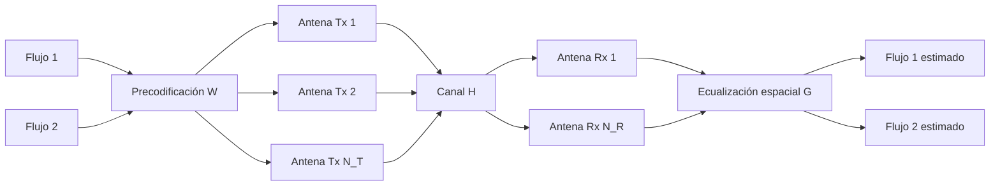
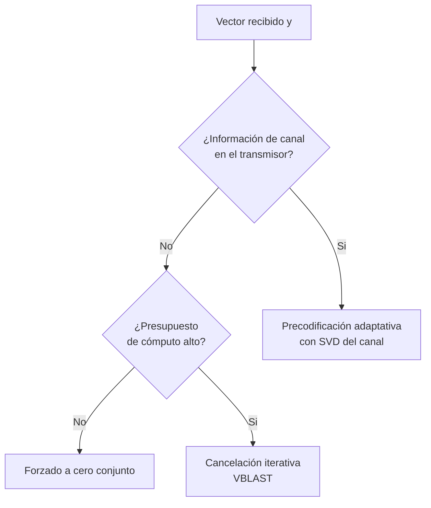
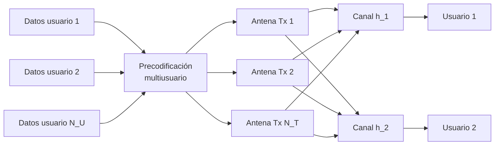

La ganancia de multiplexación introducida en
[fundamentos de los sistemas MIMO](./section_1_fundamentos_mimo.md) consiste en
transmitir varios flujos de información independientes por el mismo canal de radio, en
lugar de reforzar un único enlace mediante diversidad. Este capítulo desarrolla esa idea
de principio a fin: cómo se reparten los flujos entre las antenas transmisoras, cómo se
separan de nuevo en el receptor, qué ocurre cuando varios usuarios comparten el mismo
recurso espacial, cómo se estima un canal con múltiples antenas y qué cambia cuando el
canal deja de ser plano en frecuencia.

## Introducción

Un sistema con $N_T$ antenas transmisoras y $N_R$ antenas receptoras puede transportar,
sobre el mismo canal y al mismo tiempo, hasta

$$
N_S = \min(N_T, N_R)
$$

flujos de información independientes, donde $N_S$ es el número de flujos espaciales.
Este capítulo adopta el convenio de que la matriz de canal $\mathbf{H}$ tiene dimensión
$N_R \times N_T$, de modo que su fila $j$ recoge la ganancia compleja desde cada antena
transmisora hasta la antena receptora $j$, y la columna $i$ recoge la ganancia desde la
antena transmisora $i$ hasta cada antena receptora. Con este convenio, la señal recibida
se escribe como

$$
\mathbf{y} = \mathbf{H} \mathbf{x} + \mathbf{n}
$$

donde $\mathbf{x}$ es el vector de $N_T$ símbolos enviados por las antenas transmisoras,
$\mathbf{y}$ es el vector de $N_R$ muestras recogidas en las antenas receptoras y
$\mathbf{n}$ es el vector de ruido térmico en cada receptor, habitualmente modelado como
gaussiano, independiente entre antenas y de la misma varianza que en un enlace de una
sola antena.

El límite $N_S = \min(N_T, N_R)$ tiene una lectura directa: no tiene sentido intentar
separar más flujos que antenas receptoras, porque cada antena receptora aporta como
mucho una ecuación independiente para resolver el sistema, y tampoco tiene sentido
intentar separar más flujos que antenas transmisoras, porque no hay forma de generarlos.
Alcanzar ese máximo exige además que el canal tenga **rango completo**, es decir, que
sus $N_S$ valores singulares sean todos distintos de cero. Un canal con poca dispersión
de trayectos, con antenas muy próximas entre sí o con una línea de vista dominante entre
transmisor y receptor tiende a producir columnas de $\mathbf{H}$ muy parecidas entre sí,
lo que reduce su rango efectivo por debajo de $\min(N_T, N_R)$ y limita en la práctica
el número de flujos que pueden separarse con una calidad aceptable, aunque el número
nominal de antenas sea mayor.

???+ example "Flujos disponibles y pérdida de rango en una configuración 4x2"

    Una estación base con $N_T = 4$ antenas transmisoras da servicio a un terminal con
    $N_R = 2$ antenas receptoras. El número máximo de flujos espaciales es
    $N_S = \min(4, 2) = 2$, con independencia de que el transmisor disponga de cuatro
    antenas: el terminal solo puede aportar dos ecuaciones independientes en recepción.
    Si, además, las dos antenas del terminal están separadas menos de media longitud de
    onda y el entorno de propagación presenta pocos trayectos resueltos, las dos filas
    de $\mathbf{H}$ se parecen y el segundo valor singular del canal cae muy por debajo
    del primero. El sistema sigue permitiendo formalmente dos flujos, pero el segundo se
    transmite sobre un subcanal de ganancia casi nula y su tasa de error se dispara. La
    solución práctica no es forzar los dos flujos, sino reducir la transmisión a uno
    solo, tal como se describe más adelante en la selección del número de flujos.

## Multiplexación con precodificación fija

Cuando el transmisor no dispone de información sobre el canal, o cuando esa información
no puede alimentar un diseño más elaborado, la matriz de canal $\mathbf{H}$ se afronta
con una precodificación fija: una matriz $\mathbf{W}$ conocida de antemano y compartida
entre transmisor y receptor, que no depende de la realización concreta del canal.

### Número máximo de flujos

El número de flujos que puede transportar la precodificación fija está acotado, como se
ha visto, por $N_S = \min(N_T, N_R)$. En la práctica se elige transmitir $N_L \leq N_S$
flujos, con $N_L$ el número de capas o flujos activados, y esa elección compite con la
ganancia de diversidad descrita en el capítulo anterior: activar más capas incrementa la
tasa de información transmitida, pero reduce la protección frente a desvanecimientos que
ofrecería concentrar la misma potencia en menos flujos.

### Matriz de precodificación

La precodificación reparte cada uno de los $N_L$ símbolos de datos, agrupados en el
vector $\mathbf{d}$, entre las $N_T$ antenas transmisoras mediante una matriz de
precodificación $\mathbf{W}$ de dimensión $N_T \times N_L$,

$$
\mathbf{x} = \mathbf{W} \mathbf{d}
$$

Cada columna de $\mathbf{W}$ define cómo se distribuye un flujo entre las antenas, y
habitualmente está normalizada a módulo unidad y escalada por un factor de potencia
común, de forma que la potencia total radiada no depende del número de flujos activados.
La señal recibida resulta de combinar la precodificación con el canal,

$$
\mathbf{y} = \mathbf{H} \mathbf{W} \mathbf{d} + \mathbf{n}
$$

y cada antena receptora recoge, por tanto, una combinación lineal de los $N_L$ flujos
entrelazados a través de $\mathbf{H} \mathbf{W}$, que el receptor debe deshacer antes de
poder decidir cada símbolo por separado.

El diagrama resume la cadena completa: los flujos de datos se reparten entre las antenas
transmisoras mediante $\mathbf{W}$, atraviesan el canal $\mathbf{H}$ mezclados entre sí,
y la ecualización espacial $\mathbf{G}$ del receptor deshace esa mezcla para recuperar
cada flujo por separado.

### Ecualización espacial y amplificación del ruido

La separación de los flujos en recepción se resuelve con una **ecualización espacial**,
análoga a la ecualización de frecuencia empleada frente a canales selectivos y descrita
en [OFDM y SC-FDM](../04_acceso_al_medio/section_4_ofdm_y_sc_fdm.md), pero aplicada
sobre la dimensión espacial en lugar de sobre la frecuencia. El receptor construye una
matriz de ecualización $\mathbf{G}$ de dimensión $N_L \times N_R$ que, aplicada al
vector recibido, aproxima el vector de datos transmitido,

$$
\hat{\mathbf{d}} = \mathbf{G} \mathbf{y}
$$

Cuando el sistema es cuadrado, $N_T = N_R = N_L$, la matriz de canal efectiva
$\mathbf{H} \mathbf{W}$ es cuadrada e invertible siempre que tenga rango completo, y el
diseño más directo, conocido como **forzado a cero** (_zero forcing_), toma $\mathbf{G}
= (\mathbf{H} \mathbf{W})^{-1}$, con lo que $\hat{\mathbf{d}} = \mathbf{d} + \mathbf{G}
\mathbf{n}$ y la interferencia entre flujos se cancela por completo. Cuando $N_R > N_T$
se recurre en su lugar a la pseudoinversa de Moore-Penrose,

$$
\mathbf{G} = \left( (\mathbf{H}\mathbf{W})^{H} (\mathbf{H}\mathbf{W})
\right)^{-1} (\mathbf{H}\mathbf{W})^{H}
$$

donde $(\cdot)^{H}$ denota la transpuesta conjugada, expresión que se reduce a la
inversa exacta cuando $N_R = N_T$.

Este forzado a cero paga un precio conocido de toda inversión de canal: en la dirección
del canal efectivo con menor ganancia, la matriz $\mathbf{G}$ amplifica tanto la señal
como el ruido en la misma proporción necesaria para cancelar la interferencia, de la
misma manera en que el ecualizador de frecuencia amplifica el ruido en las portadoras
que caen en un mínimo profundo del canal. Cuando la relación señal a ruido de partida es
baja y hay que repartir la potencia disponible entre varios flujos, esa amplificación
puede dominar el comportamiento del enlace y degradar la tasa de error muy por encima de
lo que predice la relación señal a ruido media del sistema.

### Cancelación iterativa de interferencias

Una alternativa al forzado a cero conjunto es la **cancelación iterativa de
interferencias**, conocida por el acrónimo VBLAST, que detecta los flujos uno a uno en
lugar de invertir la matriz de canal completa de una sola vez. El receptor ordena los
flujos por la calidad de su subcanal efectivo, detecta primero el de mayor relación
señal a ruido, reconstruye su contribución a la señal recibida y la resta antes de
detectar el siguiente flujo, que se beneficia de una interferencia ya reducida. Este
orden por calidad decreciente, en lugar de un orden arbitrario, es lo que evita que los
errores de decisión de los primeros flujos se propaguen sin control a los siguientes: al
detectar primero los flujos más fiables, la probabilidad de arrastrar un error hacia
etapas posteriores es menor que en el orden inverso.

La elección entre estas estrategias de detección depende de la información disponible en
el transmisor y del coste de cómputo que puede asumir el receptor, resumidos en la tabla
siguiente.

| Estrategia                     | Complejidad                                | Rendimiento                                                      |
| ------------------------------ | ------------------------------------------ | ---------------------------------------------------------------- |
| Forzado a cero conjunto        | Baja, una inversión o pseudoinversa        | Amplifica el ruido en los subcanales de menor ganancia.          |
| Cancelación iterativa VBLAST   | Media, detección y resta flujo a flujo     | Mejor que el forzado a cero conjunto si el orden es por calidad. |
| Precodificación adaptativa SVD | Alta, exige SVD del canal en el transmisor | Óptima en capacidad, requiere información de canal actualizada.  |

## Multiplexación con precodificación adaptativa

Cuando el transmisor sí dispone de una estimación de la matriz de canal $\mathbf{H}$,
habitualmente porque el enlace es de división en el tiempo con canal recíproco entre
ambos sentidos, o porque el receptor la ha realimentado por un canal de retorno, la
precodificación puede diseñarse a medida de esa realización concreta del canal en lugar
de emplear una matriz fija.

### Descomposición en valores singulares del canal

El instrumento que permite ese diseño a medida es la **descomposición en valores
singulares** (_singular value decomposition_, SVD) de la matriz de canal,

$$
\mathbf{H} = \mathbf{U} \mathbf{\Sigma} \mathbf{V}^{H}
$$

donde $\mathbf{U}$ es una matriz unitaria $N_R \times N_R$, $\mathbf{V}$ es una matriz
unitaria $N_T \times N_T$ y $\mathbf{\Sigma}$ es una matriz $N_R \times N_T$ con los
valores singulares $\sigma_1 \geq \sigma_2 \geq \dots \geq \sigma_{N_S} \geq 0$ del
canal en su diagonal principal y ceros fuera de ella. Precodificar con las primeras
$N_L$ columnas de $\mathbf{V}$, es decir, tomar $\mathbf{W} = \mathbf{V}_{N_L}$, y
ecualizar en recepción con las primeras $N_L$ columnas de $\mathbf{U}$, tomando
$\mathbf{G} = \mathbf{U}_{N_L}^{H}$, diagonaliza por completo el canal efectivo:

$$
\mathbf{U}_{N_L}^{H} \mathbf{H} \mathbf{V}_{N_L} = \mathrm{diag}(\sigma_1, \dots,
\sigma_{N_L})
$$

El resultado transforma el canal MIMO acoplado en $N_L$ subcanales independientes y sin
interferencia mutua entre sí, cada uno con su propia ganancia $\sigma_i$. Cada flujo
atraviesa entonces un canal equivalente de una sola antena con ganancia $\sigma_i$, y la
potencia asignada a cada flujo puede repartirse de forma desigual, favoreciendo los
subcanales de mayor $\sigma_i$, según el mismo razonamiento de asignación óptima de
potencia que rige la capacidad de un canal AWGN. Este reparto de potencia entre
subcanales de distinta ganancia es la razón por la que la precodificación adaptativa
alcanza la capacidad óptima del canal MIMO, frente al reparto uniforme implícito en la
precodificación fija.

### Selección del número de flujos

La disponibilidad de los valores singulares $\sigma_i$ permite decidir cuántos flujos
conviene activar realmente, en lugar de activar siempre el máximo $N_S$ posible. Un
valor singular muy pequeño frente a los demás indica un subcanal de ganancia casi nula,
que consumiría potencia de transmisión sin aportar una tasa de error aceptable, y en el
que además el ruido térmico domina sobre la señal útil. Descartar ese subcanal y
concentrar la potencia disponible en los flujos de mayor $\sigma_i$ suele producir una
tasa de error global mejor que insistir en transmitir por todos los subcanales
nominales, del mismo modo que en la ecualización de frecuencia conviene reducir o anular
la transmisión en las portadoras que caen en un mínimo profundo del canal.

???+ example "Ganancia de capacidad de la multiplexación espacial frente a una antena"

    Un enlace de una sola antena en cada extremo alcanza, para una relación señal a
    ruido $\mathrm{SNR}$, una capacidad de $C_1 = \log_2(1 + \mathrm{SNR})$ bits por uso
    del canal, según el resultado de Shannon. Un enlace con $N_T = N_R = 2$ antenas y un
    canal de rango completo con valores singulares $\sigma_1$ y $\sigma_2$ tales que
    $\sigma_1^2 = \sigma_2^2 = 1$, es decir, con la misma ganancia de potencia total que
    el caso de una antena, reparte la misma potencia entre dos subcanales
    independientes de igual ganancia y alcanza

    $$
    C_2 = 2 \log_2\!\left(1 + \frac{\mathrm{SNR}}{2}\right)
    $$

    Para $\mathrm{SNR} = 100$ (20 dB), $C_1 = \log_2(101) \approx 6{,}66$ bits por uso
    del canal, mientras que $C_2 = 2 \log_2(51) \approx 11{,}30$ bits por uso del canal,
    un incremento de casi el 70 % sin ampliar el ancho de banda ni la potencia
    transmitida. La ganancia crece con la relación señal a ruido, porque a alta SNR cada
    subcanal opera en la región logarítmica donde duplicar el número de subcanales casi
    duplica la capacidad, mientras que a baja SNR el reparto de la potencia entre dos
    subcanales penaliza más de lo que aporta la segunda dimensión espacial.

### Validez de la información de canal

Todo el diseño de la precodificación adaptativa depende de que la estimación de
$\mathbf{H}$ empleada en el transmisor siga siendo representativa del canal en el
instante de transmisión. Cuando el canal varía deprisa, por una velocidad del terminal
elevada o por un tiempo de coherencia corto en el sentido descrito en
[desvanecimiento y respuesta del canal](../02_canal/section_2_desvanecimiento_y_respuesta_del_canal.md),
la estimación empleada para calcular $\mathbf{V}$ puede quedar obsoleta antes de que la
precodificación llegue a aplicarse, y el canal efectivo diagonalizado deja de ser
realmente diagonal, reintroduciendo interferencia entre flujos que el diseño adaptativo
pretendía eliminar. En esas condiciones, mantener el número de flujos activados por
debajo del máximo teórico y dejar un margen de potencia sin asignar a los subcanales más
débiles reduce la sensibilidad del sistema a ese desajuste entre la información de canal
disponible y el canal real en el instante de transmisión.

## MIMO multiusuario

Las técnicas anteriores separan flujos que pertenecen a un mismo usuario. La
multiplexación espacial puede aplicarse igualmente para separar en el espacio a
distintos usuarios que comparten el mismo recurso de tiempo y de frecuencia, lo que se
conoce como **MIMO multiusuario** (_multi-user MIMO_, MU-MIMO). La estación base separa
a los usuarios explotando las diferencias entre sus respuestas de canal, del mismo modo
que la multiplexación espacial de un único usuario explota las diferencias entre las
columnas de $\mathbf{H}$ para separar sus flujos.

### Multiplexación espacial de usuarios en el enlace ascendente

En el enlace ascendente, cada uno de $N_U$ usuarios transmite con una sola antena, y la
estación base, equipada con $N_R$ antenas, recibe una combinación de las señales de
todos ellos. Si $\mathbf{h}_i$ es el vector columna de $N_R$ componentes que recoge la
respuesta del canal entre el usuario $i$ y las antenas de la estación base, la matriz de
canal multiusuario se construye apilando esos vectores como columnas,

$$
\mathbf{H}_{UL} = \lbrack \mathbf{h}_1 \enspace \mathbf{h}_2 \enspace \cdots \enspace
\mathbf{h}_{N_U} \rbrack
$$

y la señal recibida en la estación base es

$$
\mathbf{y} = \mathbf{H}_{UL} \mathbf{d} + \mathbf{n}
$$

donde $\mathbf{d}$ agrupa el símbolo transmitido por cada usuario. Esta expresión tiene
exactamente la misma forma que la de un único usuario con $N_T = N_U$ antenas
transmisoras, salvo que ahora cada antena transmisora pertenece a un terminal distinto
en una ubicación distinta. La estación base separa a los usuarios con las mismas
herramientas de ecualización espacial descritas antes, forzado a cero o cancelación
iterativa, y la ganancia de potencia recibida del usuario $i$ tras la ecualización
depende de cuánto se parece $\mathbf{h}_i$ a los vectores de canal de los demás
usuarios: cuanto más distintas sean sus respuestas de canal, menor es la penalización
por amplificación de ruido al separarlos.

### Multiplexación espacial de usuarios en el enlace descendente

En el enlace descendente, la estación base, con $N_T$ antenas, precodifica los datos
destinados a $N_U$ usuarios antes de transmitirlos conjuntamente. A diferencia del
enlace ascendente, aquí la estación base concentra toda la potencia de transmisión y
también toda la responsabilidad de evitar que la señal destinada a un usuario interfiera
con la de los demás, puesto que cada terminal solo puede procesar su propia señal
recibida y no coordina la recepción con el resto de usuarios. La precodificación de
descendente se diseña por tanto para anticipar en el transmisor la interferencia entre
usuarios, con matrices que dependen de las respuestas de canal $\mathbf{h}_i$ de todos
los usuarios servidos simultáneamente, en lugar de dejar la separación a un ecualizador
en recepción como en el enlace ascendente.

Cada usuario recibe únicamente su propia señal, ya separada por la precodificación de la
estación base, y no participa en la separación conjunta como sí ocurre en el enlace
ascendente.

### Límite impuesto por el número de antenas

El número de usuarios que pueden multiplexarse espacialmente está acotado, en cada
sentido, por el número de antenas del extremo que realiza la separación. En el enlace
ascendente, $N_U \leq N_R$, porque la estación base necesita al menos tantas antenas
receptoras como usuarios simultáneos para poder separarlos. En el enlace descendente,
$N_U \leq N_T$, por la razón simétrica: la estación base necesita al menos tantos grados
de libertad de transmisión como usuarios a los que precodificar de forma independiente.
Cuando los usuarios están próximos entre sí, sus vectores de canal tienden a parecerse,
lo que exige ampliar el número de antenas de la estación base para mantener una
discriminación espacial suficiente entre ellos, de forma análoga a la pérdida de rango
descrita para la multiplexación de un único usuario con antenas próximas entre sí.

## Estimación del canal MIMO

Toda la precodificación y toda la ecualización espacial descritas hasta aquí dependen de
disponer de una estimación de $\mathbf{H}$. Esa estimación se complica frente al caso de
una sola antena porque los símbolos piloto transmitidos por distintas antenas llegan
superpuestos a cada antena receptora, y el receptor debe diferenciar la contribución de
cada transmisor antes de poder aislar cada elemento de la matriz de canal.

### Estimación por fases

La estrategia más directa transmite los pilotos en $N_T$ fases sucesivas, una por cada
antena transmisora: en la fase $i$, solo la antena $i$ transmite un símbolo piloto
conocido mientras las demás permanecen en silencio, y cada antena receptora mide
directamente la columna $i$ de $\mathbf{H}$ sin ninguna interferencia de las demás
antenas transmisoras. El procedimiento es independiente del número de antenas receptoras
$N_R$, porque todas ellas pueden medir simultáneamente durante cada fase. Su coste es un
_overhead_ de señalización que crece linealmente con $N_T$, ya que se necesitan $N_T$
intervalos de piloto exclusivos en lugar de uno solo.

### Estimación con códigos ortogonales

Una alternativa que reduce ese coste transmite los pilotos de todas las antenas de forma
simultánea, pero cada una modulada con una secuencia de un código ortogonal de longitud
$N_T$, de manera que las secuencias asignadas a distintas antenas transmisoras tienen
correlación cruzada nula entre sí. El receptor correla la señal recibida con cada
secuencia del código y recupera la contribución de cada antena transmisora por separado,
exactamente igual que la separación de usuarios por código descrita para el acceso
múltiple por división de código. Esta estrategia sigue necesitando $N_T$ intervalos de
símbolo piloto para completar el código, pero permite promediar la estimación a lo largo
de esos intervalos, lo que reduce la varianza del error de estimación frente al ruido a
costa de una mayor sensibilidad a que la respuesta del canal cambie apreciablemente
durante ese intervalo de promediado.

En ambos esquemas, la operación final es la misma división entre símbolo recibido y
símbolo piloto conocido que emplea la estimación de un canal de una sola antena,
aplicada de forma independiente a cada par transmisor-receptor una vez separadas las
contribuciones de cada antena transmisora,

$$
\hat{H}_{ji} = \frac{Y_{p,ji}}{X_{p,i}}
$$

donde $X_{p,i}$ es el símbolo piloto conocido enviado por la antena transmisora $i$,
$Y_{p,ji}$ es la componente de la señal recibida en la antena receptora $j$ que
corresponde a esa antena transmisora tras la separación por fases o por código, y
$\hat{H}_{ji}$ es la estimación resultante del elemento correspondiente de $\mathbf{H}$.

### Interpolación de pilotos

Los pilotos solo se transmiten en un subconjunto de instantes o de subportadoras, por lo
que la estimación en las posiciones restantes se obtiene interpolando entre las
estimaciones disponibles en los pilotos vecinos, tanto en el dominio del tiempo como en
el de la frecuencia cuando el canal es de banda ancha. La calidad de esa interpolación
depende de que la separación entre pilotos sea suficientemente pequeña frente al tiempo
de coherencia y al ancho de banda de coherencia del canal descritos en
[desvanecimiento y respuesta del canal](../02_canal/section_2_desvanecimiento_y_respuesta_del_canal.md):
una separación excesiva entre pilotos deja que el canal varíe de forma apreciable entre
dos puntos de referencia consecutivos, y la interpolación lineal o de orden bajo
habitual no consigue seguir esa variación con precisión.

???+ example "Overhead de pilotos al estimar un canal MIMO de tamaño creciente"

    Una estación base con $N_T = 8$ antenas transmisoras y un terminal con $N_R = 2$
    antenas receptoras deben estimar una matriz de canal de $16$ elementos complejos.
    Con estimación por fases, cada antena transmisora necesita su propio intervalo de
    piloto exclusivo, de modo que el _overhead_ de señalización crece de forma lineal
    con $N_T$: duplicar el número de antenas transmisoras, de $8$ a $16$, duplica
    también el número de intervalos de piloto necesarios y la fracción de recursos de
    radio que no transporta información de usuario. La estimación con códigos
    ortogonales no reduce ese número de intervalos, que sigue siendo $N_T$, pero permite
    promediar las $N_T$ medidas recibidas en cada antena receptora para obtener una
    estimación de menor varianza frente al ruido, a cambio de exigir que el canal
    permanezca aproximadamente constante durante los $N_T$ intervalos completos del
    código, una condición cada vez más exigente cuanto mayor es $N_T$ y menor el tiempo
    de coherencia del canal.

## MIMO en canales selectivos en frecuencia

Todo el desarrollo anterior supone un canal plano en frecuencia, en el que cada elemento
de $\mathbf{H}$ es una única ganancia compleja válida para toda la banda transmitida.
Esa hipótesis se rompe cuando el ancho de banda de la señal supera el ancho de banda de
coherencia del canal, tal como se describe en
[desvanecimiento y respuesta del canal](../02_canal/section_2_desvanecimiento_y_respuesta_del_canal.md)
para el caso de una sola antena.

### Canal MIMO de banda ancha

En un entorno selectivo en frecuencia, cada elemento de la matriz de canal deja de ser
un escalar y pasa a ser una respuesta al impulso completa, de forma que el canal entre
la antena transmisora $i$ y la receptora $j$ se describe por una secuencia
$h_{ji}[\ell]$ con $\ell$ recorriendo los distintos retardos con energía apreciable, en
lugar de por el escalar $H_{ji}$ del caso plano. La señal recibida en cada antena es
entonces la convolución entre la señal transmitida por cada antena transmisora y la
respuesta al impulso correspondiente, sumada sobre todas las antenas transmisoras y con
el ruido de recepción añadido. Cuanto más se reduce el ancho de banda de coherencia
frente al ancho de banda de la señal, más larga resulta esa respuesta al impulso en
número de muestras significativas, y más costosa resulta cualquier igualación que opere
directamente en el dominio del tiempo sobre esta convolución multiantena.

### MIMO-OFDM

La solución que evita igualar esa convolución extendida combina las técnicas MIMO
anteriores con la multiplexación por división ortogonal de frecuencia descrita en
[OFDM y SC-FDM](../04_acceso_al_medio/section_4_ofdm_y_sc_fdm.md). Cada antena
transmisora dispone de su propio modulador OFDM, y cada antena receptora de su propio
demodulador OFDM, de modo que el canal de banda ancha entre cada par de antenas queda
dividido en un conjunto de subportadoras estrechas, cada una de ellas prácticamente
plana. La matriz de canal deja de ser una única matriz $N_R \times N_T$ y pasa a ser una
familia de matrices $\mathbf{H}_k$, una por cada subportadora $k$,

$$
\mathbf{y}_k = \mathbf{H}_k \mathbf{x}_k + \mathbf{n}_k
$$

donde $\mathbf{x}_k$ es el vector de símbolos transmitidos por las distintas antenas en
la subportadora $k$ y $\mathbf{y}_k$ es el vector correspondiente recibido en esa misma
subportadora. Cada subportadora se trata entonces con exactamente las mismas técnicas de
precodificación fija o adaptativa, de ecualización espacial y de estimación de canal
desarrolladas en este capítulo para el caso plano, aplicadas de forma independiente
subportadora a subportadora. El coste de esa independencia es que la precodificación
adaptativa, cuando se emplea, debe recalcularse subportadora a subportadora a partir de
la descomposición en valores singulares de cada $\mathbf{H}_k$, lo que multiplica la
carga de cómputo del transmisor por el número de subportadoras activas, aunque esa carga
se compensa con la simplicidad de trabajar sobre canales planos en cada una de ellas en
lugar de sobre una convolución multiantena completa.

MIMO-OFDM es el punto de encuentro entre la familia de técnicas de multiplexación
espacial desarrollada en este capítulo y la familia de técnicas de multiplexación en
frecuencia, y es también la base sobre la que las tecnologías celulares concretas
construyen sus esquemas de antenas múltiples, con las particularidades de
configuraciones de antena, libros de código y señalización de cada generación que quedan
fuera del alcance de este capítulo.
