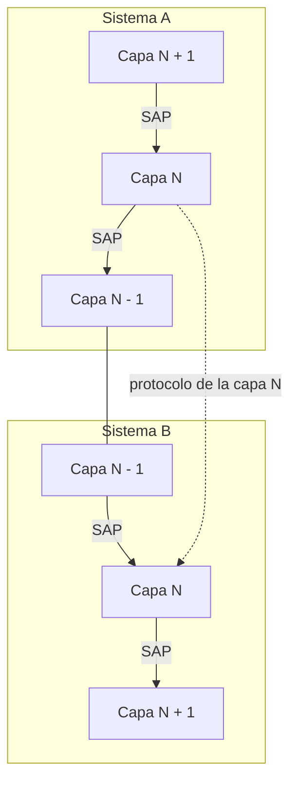
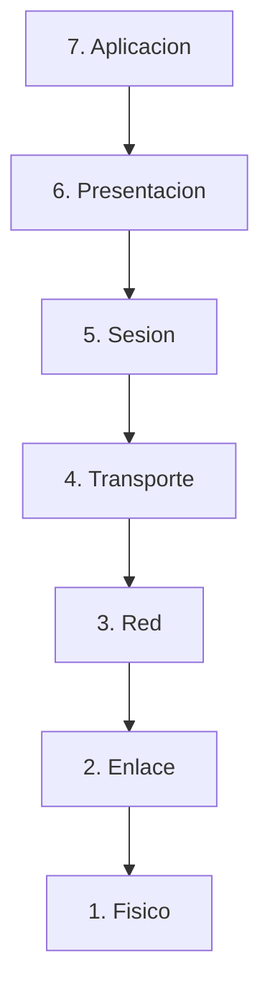

Una red de telecomunicación resuelve, al mismo tiempo, un número elevado de problemas
independientes: transmitir bits sobre un medio físico, entregar tramas libres de errores
entre dos nodos vecinos, encaminar paquetes hasta un destino que puede estar a varios
saltos de distancia, garantizar la entrega de un mensaje completo entre dos procesos y
presentar esa información de forma útil a una aplicación. Abordar ese conjunto de
problemas como un bloque único produciría un diseño imposible de mantener y de hacer
evolucionar. Este capítulo presenta la solución estructural que adoptan prácticamente
todas las arquitecturas de red para dominar esa complejidad, la organización en capas de
protocolo, junto con el mecanismo que hace posible que capas independientes cooperen sin
conocer los detalles internas de las demás, el encapsulado. El resto de temas de esta
área describen protocolos concretos que ocupan una capa determinada de este modelo, y
dan por conocido el vocabulario que se fija aquí.

## Introducción

Agrupar las funciones de una red en subconjuntos relacionados, denominados **capas**, es
la manera habitual de abordar un problema de diseño tan extenso como el de una red de
telecomunicación completa. Cada capa se ocupa de una familia concreta de funciones y
oculta esos detalles al resto de capas, que solo conocen el servicio que ofrece, no cómo
lo implementa. Esta organización ha permitido, además, que equipos de fabricantes
distintos, cada uno responsable de una parte de la pila, puedan interoperar siempre que
respeten las mismas reglas en cada capa.

## Concepto de protocolo

Un **protocolo** es el conjunto de reglas que permite que dos o más entidades se
comuniquen en la red hablando el mismo lenguaje, usando el mismo tipo de paquetes y de
forma ordenada. Un protocolo gobierna el intercambio de datos entre entidades situadas
en el mismo nivel de la arquitectura, ya residan en el mismo equipo o en equipos
distintos conectados por la red.

### Semántica, sintaxis y temporización

Todo protocolo queda caracterizado por tres aspectos independientes entre sí:

- **Semántica**: el significado de cada campo o de cada sección de bits que compone un
  mensaje del protocolo.
- **Sintaxis**: el formato de los datos, es decir, cuántos campos tiene la cabecera de
  un mensaje y en qué orden aparecen.
- **Temporización**: la secuenciación de los mensajes, qué mensaje puede o debe seguir a
  otro y en qué instante.

Dos implementaciones de un mismo protocolo solo son compatibles si coinciden en los tres
aspectos: basta que una discrepe en el significado de un campo, en su formato o en el
orden de los mensajes para que la comunicación falle, aunque ambas usen exactamente las
mismas palabras para describir el protocolo.

### Entidades, puntos de acceso al servicio y primitivas

Cada capa está compuesta por **entidades**, elementos que engloban un conjunto de
funciones concretas de esa capa. Dos entidades de la misma capa situadas en sistemas
distintos se comunican entre sí mediante un protocolo, pero esa comunicación es virtual:
no existe un enlace directo entre ellas, sino que cada una recurre al servicio que le
ofrece la capa inferior de su propio sistema para hacer llegar la información a su
entidad homóloga en el sistema remoto.

Una entidad de la capa $N$ intercambia información con la capa $N+1$ o con la capa $N-1$
de su mismo sistema a través de un **punto de acceso al servicio**, o SAP por sus siglas
en inglés, que es el lugar concreto donde una capa ofrece su servicio a la capa
inmediatamente superior. Esa comunicación vertical entre capas contiguas del mismo
sistema se coordina mediante cuatro tipos de mensajes, llamados **primitivas** o ASP:

- **Request**: solicitud del usuario del servicio para invocarlo.
- **Indication**: indicación del proveedor del servicio de que este ha sido invocado en
  un SAP, dirigida al usuario situado en el otro extremo.
- **Response**: respuesta del usuario para completar un servicio previamente invocado.
- **Confirmation**: confirmación del proveedor de que una petición de servicio se ha
  completado.

## Arquitectura en capas

La **arquitectura en capas** consiste en agrupar las funciones de una red en
subconjuntos relacionados y ordenarlos verticalmente, de forma que cada capa ofrezca un
servicio a la capa que tiene inmediatamente encima y consuma, a su vez, el servicio que
le ofrece la capa que tiene inmediatamente debajo. Una capa nunca accede directamente a
los servicios de una capa no adyacente, ni necesita conocer cómo implementa su servicio
la capa inferior, solo qué servicio le ofrece.

### Ventajas de la estructura en capas

La organización en capas aporta cuatro ventajas que justifican su adopción prácticamente
universal en el diseño de redes:

- **Simplificación del diseño**: cada capa resuelve un problema acotado, mucho más
  manejable que el problema completo de la red.
- **Facilidad de modificación**: cambiar la implementación de una capa, por ejemplo
  sustituir el medio de transmisión, no exige modificar las demás siempre que el
  servicio que ofrece la capa modificada permanezca igual.
- **Partición del diseño**: equipos distintos pueden trabajar en paralelo sobre capas
  distintas de la misma arquitectura.
- **Interoperatividad**: fabricantes distintos pueden construir equipos que interoperen
  entre sí siempre que respeten el mismo modelo de capas.

### Unidad de datos de protocolo

Cada capa entrega su información a la capa inferior en forma de un bloque de bytes
llamado **unidad de datos de protocolo**, o PDU por sus siglas en inglés. Una PDU está
formada por una cabecera, que contiene la información de control necesaria para que la
entidad homóloga del destino interprete el mensaje, y los datos de usuario que la capa
superior le ha entregado, denominados unidad de datos de servicio o SDU. Cada capa
entiende y da sentido únicamente a la cabecera que ella misma ha añadido: la PDU de una
capa concreta solo es relevante para las entidades de esa misma capa.

### Encapsulado y desencapsulado

El **encapsulado** es el proceso mediante el que la PDU de la capa $N$ se inserta como
datos, es decir, como SDU, dentro de la PDU de la capa inmediatamente inferior $N-1$.
Cada capa que participa en el envío añade su propia cabecera por delante de lo que ha
recibido de la capa superior, de modo que la PDU crece a medida que desciende por la
pila. El proceso inverso, que tiene lugar en el sistema receptor, se denomina
**desencapsulado**: cada capa retira su propia cabecera y entrega el contenido restante
a la capa superior, hasta que la información original llega a la capa que la generó.

Cuanto más desciende la información por la pila, mayor es la proporción de la PDU
ocupada por cabeceras y menor la proporción ocupada por los datos de la aplicación
original. Esa fracción de cabeceras añadidas por el proceso de encapsulado recibe el
nombre de _overhead_, y su peso relativo depende tanto del número de capas atravesadas
como del tamaño del mensaje original.

???+ example "Overhead de encapsulado de un mensaje de aplicación de 500 bytes"

    Un mensaje de aplicación de 500 bytes desciende por una pila de protocolos
    formada, de arriba abajo, por un protocolo de transporte con una cabecera mínima de
    20 bytes, un protocolo de red con una cabecera mínima de 20 bytes y un protocolo de
    acceso a la red que añade una cabecera de 14 bytes y una cola de control de errores
    de 4 bytes. Se pide el tamaño final de la trama y la fracción de esa trama que
    corresponde a _overhead_ frente a la que corresponde a datos útiles.

    El encapsulado añade una cabecera por cada capa que atraviesa el mensaje. La capa
    de transporte entrega al nivel de red una PDU de $500 + 20 = 520$ bytes. La capa de
    red entrega a la capa de acceso una PDU de $520 + 20 = 540$ bytes. La capa de
    acceso añade su propia cabecera y su cola de control de errores, de modo que la
    trama final ocupa $540 + 14 + 4 = 558$ bytes.

    El _overhead_ total introducido por las tres capas es $20 + 20 + 14 + 4 = 58$
    bytes, frente a los 500 bytes de datos útiles de la aplicación. La fracción de
    _overhead_ sobre el tamaño final de la trama es $58 / 558 \approx 10{,}4\,\%$: algo
    más de una décima parte de lo que viaja realmente por el medio de transmisión no es
    información de la aplicación, sino cabeceras de control añadidas por el proceso de
    encapsulado. En el sistema receptor, el desencapsulado retira esas mismas cabeceras
    en el orden inverso hasta devolver a la aplicación destino los 500 bytes
    originales.

## Modelo de referencia OSI

El **modelo de referencia OSI**, de Interconexión de Sistemas Abiertos por sus siglas en
inglés, es un sistema abierto que permite que sistemas de fabricantes diferentes se
comuniquen con independencia de la arquitectura interna de cada uno. Está formado por
siete niveles ordenados, que de superior a inferior son aplicación, presentación,
sesión, transporte, red, enlace de datos y físico. Los tres niveles inferiores, físico,
enlace y red, se agrupan bajo el nombre de niveles de soporte de red, porque se ocupan
de los aspectos físicos de la transmisión entre dispositivos. Los tres niveles
superiores, sesión, presentación y aplicación, se agrupan como niveles de servicios de
soporte de usuario, porque permiten la interoperatividad entre sistemas de software no
relacionados entre sí. El nivel de transporte ocupa una posición intermedia entre ambos
grupos, responsable de la transmisión de datos extremo a extremo.

### Nivel físico

El **nivel físico** transmite un flujo de bits sobre el medio de transmisión y es
responsable de las características físicas y eléctricas de las interfaces y del medio,
del tipo de codificación que se usa en la transmisión, del régimen binario, de la
sincronización entre los relojes del emisor y del receptor, de la configuración de la
topología de la red y del modo de transmisión, ya sea símplex, semidúplex o dúplex. La
clasificación de las topologías en malla, estrella, anillo y bus, con sus compromisos de
coste y de robustez, se trata en
[clasificación por topología](../../04_inalambricas/01_panorama/section_1_taxonomia_y_arquitecturas.md#clasificacion-por-topologia)
y no es una función del nivel físico, sino una propiedad de la red aplicable con
independencia de la capa; su consecuencia cuantitativa sobre la escalabilidad se
desarrolla más adelante en este capítulo, en
[escalabilidad de la topología en malla](#escalabilidad-de-la-topologia-en-malla).

### Nivel de enlace

El **nivel de enlace** transforma el nivel físico, propenso a errores, en un enlace que
resulta fiable de cara al nivel superior. Es responsable del entramado, es decir, de
dividir el flujo de bits en unidades manejables llamadas tramas, del direccionamiento
físico entre los sistemas de una misma red, del control de flujo para evitar que el
receptor se sature, del control de errores para detectar tramas defectuosas y solicitar
su retransmisión, y del control de acceso al medio, que decide qué sistema puede
transmitir en cada instante cuando varios comparten el mismo medio físico. Esta última
función, el control de acceso a un medio compartido, se desarrolla con detalle en
[acceso múltiple al medio](../../01_fundamentos/04_acceso_al_medio/section_2_acceso_multiple.md).

### Nivel de red

El **nivel de red** es responsable de la entrega de un paquete desde el origen hasta el
destino, incluso cuando ambos no comparten el mismo enlace físico y el paquete debe
atravesar varias redes intermedias. Sus dos funciones son el direccionamiento lógico,
que añade a cada paquete las direcciones de origen y de destino dentro del conjunto de
redes, y el **encaminamiento**, que decide qué camino sigue el paquete a través de los
distintos enlaces y redes intermedias hasta alcanzar su destino final. Mientras que el
nivel de enlace resuelve la entrega nodo a nodo, el nivel de red resuelve la entrega
origen a destino, un problema estrictamente mayor que puede exigir atravesar varios
nodos de enlace intermedios.

### Nivel de transporte

El **nivel de transporte** es responsable de la entrega extremo a extremo del mensaje
completo entre dos procesos, no solo entre dos equipos. Sus funciones son el
direccionamiento del proceso concreto dentro de cada equipo, la segmentación del mensaje
y su reensamblado en el destino, el control de la conexión, el control de flujo y el
control de errores, entendido este último como la capacidad de solicitar la
retransmisión de un mensaje si se detecta que ha llegado con errores.

### Nivel de sesión

El **nivel de sesión** se encarga de autentificar al usuario y de permitir recuperar el
estado de la comunicación en caso de problema. Sus funciones son el control de diálogo,
que permite a dos entidades añadir interacciones a la sesión desde que esta se inicia
hasta que se cierra, ya sea en modo semidúplex o en modo dúplex completo, y la
sincronización, que permite a un proceso insertar puntos de control en un flujo de datos
para poder reanudarlo desde ese punto si es necesario.

### Nivel de presentación

El **nivel de presentación** se ocupa de la sintaxis y de la semántica de la información
que se intercambia entre dos sistemas. Sus funciones son la representación, que traduce
la información de un formato específico y dependiente del sistema emisor a un formato
común antes de enviarla, y que el sistema receptor traduce de nuevo a su propio formato
específico; el cifrado, que oculta la información para asegurar su privacidad frente a
terceros; y la compresión, que reduce el número de bits necesarios para transportar la
misma información.

### Nivel de aplicación

El **nivel de aplicación** permite al usuario acceder a la red y proporciona las
interfaces y los soportes que emplean los servicios de usuario, como el correo
electrónico o el acceso a ficheros remotos. Entre sus servicios específicos se cuentan
el terminal virtual de red, que permite acceder a una máquina remota como si fuera un
terminal físico; la transferencia, el acceso y la gestión de archivos en un equipo
remoto; los servicios de correo electrónico; y los servicios de directorio, que dan
acceso a bases de datos con información global sobre los recursos de la red.

## Modelo de Internet

El **modelo de Internet** organiza las mismas funciones en cuatro capas en lugar de
siete: la capa de aplicación, que proporciona la comunicación entre procesos de
terminales separados; la capa de transporte, que ofrece un servicio de transferencia de
datos extremo a extremo; la capa de internet, relacionada con el encaminamiento de los
datos origen a destino a través de redes conectadas entre sí; y la capa de acceso a la
red, relacionada con la interfaz lógica entre un sistema final y la subred a la que se
conecta. La jerarquía entre capas significa que un protocolo de nivel superior siempre
se apoya en uno o más protocolos de nivel inferior para completar su función.

### Correspondencia con el modelo OSI

El modelo OSI especifica con detalle qué función pertenece a cada uno de sus siete
niveles. El modelo de Internet, en cambio, agrupa protocolos independientes que pueden
coincidir o solaparse con las necesidades de varios niveles OSI a la vez, porque se
estableció antes que OSI y sobre él se construyó ya la propia Internet, lo que hace que
el coste de cambiarlo resulte muy alto. La correspondencia aproximada entre ambos
modelos es la siguiente:

| Niveles del modelo OSI            | Capa del modelo de Internet |
| --------------------------------- | --------------------------- |
| Aplicación, presentación y sesión | Aplicación                  |
| Transporte                        | Transporte                  |
| Red                               | Internet                    |
| Enlace y físico                   | Acceso a la red             |

Esta correspondencia no es una igualdad estricta entre niveles: un protocolo del modelo
de Internet puede asumir funciones que el modelo OSI reparte entre varios de sus
niveles, y viceversa.

### Capas presentes en los equipos intermedios

Los **sistemas terminales** implementan la pila completa de protocolos, desde el nivel
físico hasta el de aplicación, porque son ellos quienes generan y consumen la
información de las aplicaciones de usuario. Los **sistemas intermedios**, en cambio,
solo implementan los niveles inferiores necesarios para realizar sus funciones de
conmutación y de encaminamiento entre equipos terminales, sin necesidad de subir hasta
los niveles de servicio de soporte de usuario. Qué niveles concretos implementa cada
tipo de sistema intermedio se detalla en la sección de equipos de interconexión más
adelante en este capítulo.

## Direccionamiento

Una **dirección** permite identificar de forma unívoca un elemento de la red, ya sea un
nodo terminal, un nodo intermedio o una interfaz concreta de cualquiera de ellos, entre
todos los demás elementos posibles.

### Tipos de dirección según el destino

Según a cuántos elementos designa una dirección, se distinguen cuatro tipos:

- **Unicast**: designa a un único nodo destino.
- **Multicast**: designa a un grupo de nodos, de forma que un mismo mensaje llega a
  todas las interfaces que pertenecen a ese grupo.
- **Broadcast**: designa a todos los nodos de la red o del segmento de red.
- **Anycast**: designa a un único nodo dentro de un grupo de nodos posibles, sin fijar
  de antemano cuál de ellos responderá.

### Direcciones globales, locales y jerárquicas

Según su rango de validez, una dirección puede ser **global**, si es única y está
asignada por una autoridad de alcance mundial, como ocurre con las direcciones IP
públicas o con los números de teléfono, o **local**, si solo es válida dentro de un área
determinada, como ocurre con las direcciones IP privadas de una red doméstica. Un mismo
equipo puede necesitar traducir entre una dirección local y una dirección global para
comunicarse con el exterior de su red, función que desempeña la traducción de
direcciones de red.

Según si la dirección revela algo sobre la ubicación del elemento que designa, se
distingue entre direcciones **jerárquicas**, en las que una parte de la dirección indica
en qué región o subdivisión de la red se encuentra el elemento, como ocurre con las
direcciones IP o con los números de teléfono, y direcciones **no jerárquicas**, que no
indican ninguna zona concreta, como ocurre con las direcciones MAC.

### Plan de numeración telefónica E.164

La norma **E.164** define la numeración telefónica internacional, administrada por la
Unión Internacional de Telecomunicaciones, y establece que un número de teléfono
completo no puede superar los 15 dígitos. Ese número se compone de tres campos: el
**CC**, o indicativo de país, de entre 1 y 3 dígitos; el **NDC**, o indicativo nacional
de destino; y el **SN**, o número de abonado. La norma reserva además números
específicos para servicios internacionales de alcance mundial y para números de ensayo,
de uso temporal en pruebas y estudios.

???+ example "Margen de dígitos disponible para el NDC de un país"

    Un país tiene asignado un indicativo CC de 2 dígitos, y su plan de numeración
    nacional fija el número de abonado SN en 9 dígitos para todos los números fijos y
    móviles. Se pide cuántos dígitos quedan disponibles para el indicativo nacional de
    destino NDC sin sobrepasar el límite de la norma E.164.

    La norma E.164 limita a 15 el número total de dígitos de CC, NDC y SN combinados.
    Con $CC = 2$ dígitos y $SN = 9$ dígitos, el margen que queda para el NDC es
    $15 - 2 - 9 = 4$ dígitos. Ese límite de 4 dígitos condiciona, por ejemplo, cuántas
    zonas o cuántos operadores distintos puede distinguir el indicativo nacional de
    destino de ese país sin agotar el espacio de numeración disponible.

### Direcciones físicas MAC

Una **dirección MAC**, de Control de Acceso al Medio, es el identificador que se asigna
a cada tarjeta de red para operar en el nivel de enlace. Ocupa 48 bits, organizados en 6
bytes, de los cuales los 24 bits más significativos identifican al fabricante y los 24
bits menos significativos identifican a la tarjeta dentro de la producción de ese
fabricante. El bit menos significativo del primer byte distingue si la dirección es
unicast, cuando vale 0, o multicast, cuando vale 1; la dirección de broadcast se
representa con los 48 bits a 1. La dirección de origen de una trama debe ser siempre
unicast.

Antes de enviar una trama, el nivel de enlace también necesita determinar qué protocolo
superior debe recibir su contenido. Con ese fin, la cabecera de una trama puede reservar
un campo de control de enlace lógico, o LLC, con dos subcampos de 8 bits llamados SAP de
destino y SAP de origen, que identifican la entidad de protocolo a la que va dirigida la
trama dentro del sistema receptor.

### Direcciones de red y de transporte

En el nivel de red, el esquema de direccionamiento depende de si el servicio es
orientado a conexión o no orientado a conexión. En un esquema de **circuito virtual**,
se establece un camino antes de enviar los datos, y cada llamada se identifica mediante
un identificador de camino, de modo que todos los paquetes de una misma comunicación lo
siguen. En un esquema de **datagrama**, cada paquete lleva su propia dirección de origen
y de destino, es independiente de los demás y puede seguir un camino distinto a través
de la red; este es el esquema que adopta, por ejemplo, IPv4.

En el nivel de transporte también hace falta identificar a qué entidad de esa capa va
dirigido un mensaje dentro de un mismo equipo, de forma equivalente al SAP del nivel de
enlace. El SAP del nivel de transporte se denomina **puerto**, e identifica al proceso
concreto de la aplicación que debe recibir los datos, como el puerto convencionalmente
asociado al servicio web.

### Identificadores uniformes de recurso

Un **URI**, o Identificador Uniforme de Recurso, es una secuencia de caracteres que
identifica de forma unívoca un recurso disponible en la red. Localizar un recurso a
partir de su URI exige, en la práctica, recorrer las direcciones de todas las capas
inferiores: el URI se resuelve hasta un puerto de transporte concreto en un equipo
determinado, ese equipo se identifica mediante una dirección de red, y finalmente el
nivel de enlace entrega los datos a la interfaz física correspondiente mediante su
dirección MAC. El direccionamiento de cada capa, estudiado por separado en las secciones
anteriores, se compone así en una única cadena que va del recurso identificado por el
URI hasta la interfaz física que lo sirve.

## Funciones transversales

Algunas funciones no pertenecen en exclusiva a un único nivel de la arquitectura, sino
que se repiten, con variaciones, en varias capas distintas.

### Segmentación y reensamblado

Cuando una unidad de datos es demasiado grande para la capa inferior, esta la divide en
fragmentos más pequeños, llamados segmentos, cada uno identificado con un número de
secuencia. En el destino, la capa correspondiente reensambla el mensaje original a
partir de esos segmentos, en el orden que indican sus números de secuencia, y puede
detectar y, si el protocolo lo permite, sustituir los segmentos que se hayan perdido
durante la transmisión.

### Confirmación salto a salto y extremo a extremo

Una comunicación puede verificarse mediante dos estrategias distintas. En la
confirmación **salto a salto**, todo nodo intermedio de la red se ocupa de comprobar que
la transmisión hacia el siguiente nodo ha sido correcta antes de continuar, lo que exige
nodos intermedios más complejos. En la confirmación **extremo a extremo**, en cambio,
solo los dos sistemas finales de la comunicación comprueban que los datos han llegado
bien, y los nodos intermedios no necesitan implementar ese mecanismo. La fiabilidad del
propio medio de transmisión es el factor que más pesa en la decisión entre una
estrategia y la otra: cuanto más fiable es el medio, menos necesario resulta duplicar la
verificación en cada salto intermedio.

### Servicio orientado a conexión y sin conexión

Un servicio **orientado a conexión** establece una conexión entre los dos extremos antes
de transferir ningún dato, y a partir de ese momento entrega los paquetes sin pérdidas y
en la misma secuencia en que se enviaron. Un servicio **sin conexión** no establece
ninguna conexión previa: cada paquete se envía de forma independiente, puede perderse
por el camino, y no se garantiza que los paquetes lleguen en el mismo orden en que se
enviaron. La elección entre ambos tipos de servicio se repite en distintos niveles de la
arquitectura, y no es exclusiva de ninguno de ellos en particular.

## Equipos de interconexión

Los equipos intermedios de una red implementan únicamente los niveles de la arquitectura
necesarios para su función, y ese nivel de implementación determina qué tipo de
decisiones puede tomar cada equipo.

### Repetidor y concentrador

El **repetidor** opera en el nivel físico y une dos segmentos de red, regenerando la
señal para compensar la atenuación y el ruido introducidos por el medio de transmisión.
Existen repetidores activos, que regeneran realmente la señal, y repetidores pasivos,
que se limitan a retransmitirla sin regenerarla. El **concentrador**, o hub, es
funcionalmente un repetidor con varios puertos, que amplía una red local repitiendo por
todos sus puertos lo que recibe por cualquiera de ellos.

### Puente

El **puente**, o bridge, opera en el nivel de enlace y divide la red en segmentos,
filtrando el tráfico que pasa de un segmento a otro: cada puerto del puente da acceso a
un segmento de red distinto. El puente mantiene una tabla que asocia direcciones MAC a
puertos de salida. Cuando recibe una trama, aprende la dirección MAC de origen
asociándola al puerto por el que ha llegado, y a continuación consulta su tabla para la
dirección MAC de destino: si la conoce, reenvía la trama solo por el puerto
correspondiente; si no la conoce, o si la dirección de destino es de broadcast, la
reenvía por todos los puertos salvo por el que la recibió, comportándose en ese caso
como un repetidor.

### Conmutador

El **conmutador**, o switch, opera igualmente en el nivel de enlace y extiende la
función del puente a un número mayor de puertos: mapea direcciones MAC a puertos de
salida y calcula, para cada trama recibida, el puerto por el que debe reenviarla, lo que
permite que varios pares de puertos se comuniquen de forma simultánea sin competir por
el mismo segmento. Algunos equipos comerciales llamados conmutadores incorporan además
funciones del nivel de red, pero esa capacidad adicional no es la función que define al
conmutador como equipo de interconexión.

### Encaminador

El **encaminador**, o router, opera en el nivel de red y decide la ruta completa que
seguirá un paquete a través de un conjunto de redes interconectadas, para lo que
necesita conocer la topología global de la red, o al menos disponer de una tabla de
encaminamiento con esa información. A diferencia del puente o del conmutador, que solo
decide el siguiente salto dentro de una misma red, el encaminador conecta redes
distintas entre sí.

### Pasarela

La **pasarela**, o gateway, opera en el nivel de red o en niveles superiores y traduce
entre dos dominios de red distintos que, de otro modo, no podrían entenderse entre sí,
por ejemplo entre una red conmutación de datos y una red telefónica conmutada. Al operar
por encima del nivel de red, una pasarela puede llegar a traducir también protocolos
completos de niveles superiores, no solo direcciones.

## Escalabilidad de la topología en malla

El número de enlaces que exige una topología es una propiedad cuantitativa de la propia
red, agnóstica de la capa de la arquitectura: se aplica por igual a una red óptica de
transporte, a una red de acceso radio o a un grafo de encaminamiento lógico, y no es una
función que resuelva ningún nivel concreto del modelo OSI. Se presenta aquí, tras haber
introducido ya la clasificación cualitativa por topología, como cierre cuantitativo de
ese mismo concepto.

En una topología en malla completa, cada uno de los $N$ nodos se conecta directamente
con los $N-1$ restantes. Contar cada enlace una sola vez, en lugar de una vez por cada
extremo, da el número total de enlaces que exige la red:

$$
N_{\text{enlaces}} = \frac{N(N-1)}{2}
$$

Este crecimiento cuadrático es la razón estructural por la que la malla completa no
escala: cada nodo nuevo que se incorpora a la red exige un enlace adicional hacia cada
uno de los nodos ya existentes, algunos de ellos a distancias que pueden resultar
prohibitivas de tender físicamente y con una utilización individual baja, porque el
tráfico total de la red se reparte entre un número de enlaces que crece mucho más rápido
que el número de nodos.

???+ example "Enlaces necesarios al duplicar el tamaño de una malla completa"

    Una red en malla completa conecta $10$ nodos. El número de enlaces que exige es
    $N_{\text{enlaces}} = 10 \cdot 9 / 2 = 45$. Si la red duplica su tamaño hasta $20$
    nodos, el número de enlaces necesarios asciende a $20 \cdot 19 / 2 = 190$, más de
    cuatro veces el valor anterior a pesar de que el número de nodos solo se ha
    duplicado. El resultado ilustra por qué la malla completa se reserva, en la
    práctica, a un número reducido de nodos con requisitos exigentes de robustez frente
    a fallos, y por qué las redes de mayor tamaño recurren a topologías más
    económicas en número de enlaces, como la estrella o el anillo.
