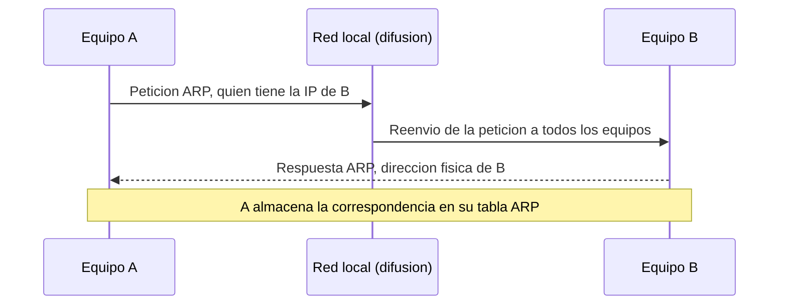

El protocolo IP es responsable de que los datos de una aplicación alojada en un equipo
lleguen a otra aplicación que reside en un equipo distinto, situado en la misma red o en
una red diferente. Este capítulo recorre el servicio que presta IP, la estructura del
datagrama que transporta, el direccionamiento lógico y su división en subredes, los
mecanismos que relacionan una dirección lógica con la dirección física del medio de
acceso, y los servicios auxiliares del nivel de red: traducción de direcciones,
seguridad y multidifusión.

## Introducción

La capa de red ofrece sus servicios a los protocolos de transporte para el envío y la
recepción de datagramas. Da un servicio de entrega de `paquetes` no fiable y sin
conexión, y permite que los mensajes atraviesen redes distintas y sean entendidos por
los encaminadores intermedios. El protocolo que implementa este servicio es IP (Internet
Protocol), basado en el uso de direcciones lógicas, las direcciones IP, que se
distinguen de las direcciones físicas asociadas a las tarjetas de red de cada equipo.

## Servicio que ofrece IP

### Entrega no fiable y sin conexión

IP es un servicio de entrega no confiable y sin conexión. No confiable significa que, si
se produce un error durante la transmisión, el datagrama afectado se descarta sin
notificación al origen ni intento de retransmisión: esa responsabilidad recae en capas
superiores, como TCP. Sin conexión significa que cada datagrama se trata de forma
independiente de los demás, sin que exista un establecimiento previo de sesión entre
origen y destino. Como consecuencia de este tratamiento independiente, dos datagramas
con la misma dirección de origen y de destino pueden seguir rutas distintas a través de
la red y llegar al destino desordenados. Garantizar la entrega en orden es, de nuevo,
tarea de las capas superiores.

### Datagrama IP

El datagrama es la unidad de datos que transporta IP. Además de los datos de la capa de
transporte, la cabecera del datagrama incorpora la información que necesitan los equipos
intermedios y el destino para entregarlo correctamente.

| Campo                          | Longitud | Función                                                                       |
| ------------------------------ | -------- | ----------------------------------------------------------------------------- |
| `Version`                      | 4 bits   | Versión del protocolo IP, 4 para IPv4.                                        |
| `IHL`                          | 4 bits   | Longitud de la cabecera en palabras de 32 bits.                               |
| `Tipo de servicio`             | 8 bits   | Prioridad y tratamiento que solicita el datagrama.                            |
| `Longitud total`               | 16 bits  | Tamaño del datagrama completo, cabecera y datos, en bytes.                    |
| `Identificación`               | 16 bits  | Identifica el datagrama original al que pertenece un fragmento.               |
| `Flags`                        | 3 bits   | Indicadores de fragmentación, entre ellos `no fragmentar`.                    |
| `Desplazamiento del fragmento` | 13 bits  | Posición del fragmento dentro del datagrama original, en unidades de 8 bytes. |
| `TTL`                          | 8 bits   | Número de saltos restantes antes de descartar el datagrama.                   |
| `Protocolo`                    | 8 bits   | Identifica el protocolo de transporte que transporta el `payload`.            |
| `Checksum de cabecera`         | 16 bits  | Suma de control que cubre únicamente la cabecera.                             |
| `Dirección de origen`          | 32 bits  | Dirección IP del equipo emisor.                                               |
| `Dirección de destino`         | 32 bits  | Dirección IP del equipo receptor.                                             |

El resto del datagrama, tras la cabecera, es el `payload`, es decir, los datos que le
entrega la capa de transporte. El `checksum` de cabecera se recalcula en cada salto,
porque el campo `TTL` cambia de valor en cada equipo intermedio que reenvía el
datagrama.

### Unidad máxima de transmisión y fragmentación

El tamaño máximo de un datagrama que puede transportar un enlace concreto se conoce como
unidad máxima de transmisión (Maximum Transmission Unit, `MTU`), y depende de la
tecnología de la capa de acceso a la red que se emplee en ese enlace. Cuando un
datagrama es mayor que el `MTU` del enlace por el que debe circular, se fragmenta en
varios datagramas de menor tamaño, cada uno con su propia cabecera IP, y se reensambla
en el destino final a partir de los campos `Identificación`, `Flags` y
`Desplazamiento del fragmento`. Todos los fragmentos de un mismo datagrama comparten el
mismo valor de `Identificación`. El desplazamiento se expresa en unidades de 8 bytes,
por lo que la longitud del `payload` de cualquier fragmento salvo el último debe ser
múltiplo de 8 bytes. El indicador `más fragmentos` de los `Flags` va activado en todos
los fragmentos excepto en el último, que lo lleva a cero para señalar el final del
datagrama original.

???+ example "Fragmentación de un datagrama para un enlace con MTU reducida"

    Un datagrama de 4000 bytes de longitud total, cabecera de 20 bytes incluida, debe
    atravesar un enlace cuya `MTU` es de 1500 bytes. El `payload` que debe repartirse
    entre los fragmentos es de $4000 - 20 = 3980$ bytes. Cada fragmento, salvo el
    último, puede llevar como máximo $1500 - 20 = 1480$ bytes de `payload`, una cifra
    que ya es múltiplo de 8 y no exige recortarla.

    Con fragmentos de 1480 bytes de `payload`, hacen falta $\lceil 3980 / 1480 \rceil =
    3$ fragmentos: dos completos y un tercero con el resto.

    - Fragmento 1: `payload` de 1480 bytes, desplazamiento 0, indicador de más
        fragmentos activado. Longitud total del fragmento, $1480 + 20 = 1500$ bytes.
    - Fragmento 2: `payload` de 1480 bytes, desplazamiento $1480 / 8 = 185$ unidades de
        8 bytes, indicador de más fragmentos activado. Longitud total, 1500 bytes.
    - Fragmento 3: `payload` de $3980 - 1480 - 1480 = 1020$ bytes, desplazamiento
        $2960 / 8 = 370$ unidades de 8 bytes, indicador de más fragmentos a cero.
        Longitud total, $1020 + 20 = 1040$ bytes.

    Los tres fragmentos comparten el mismo valor de `Identificación`, y el destino los
    reordena y reensambla a partir de los valores de desplazamiento antes de entregar
    el `payload` completo a la capa de transporte.

## Direccionamiento IP

### Estructura de una dirección IPv4

Una dirección IPv4 ocupa 32 bits, agrupados en 4 bloques de 1 byte que se escriben en
notación decimal separados por puntos, por ejemplo `192.168.1.1`. Cada dirección se
divide conceptualmente en dos partes: el identificador de red y el identificador de
equipo dentro de esa red. En el direccionamiento con clase, el número de bytes que ocupa
cada parte depende de la clase a la que pertenece la dirección, que se determina por el
valor de sus bits más significativos.

| Clase | Primer byte             | ID de red                    | ID de equipo | Equipos direccionables |
| ----- | ----------------------- | ---------------------------- | ------------ | ---------------------- |
| A     | 0 a 127 (`0xxx xxxx`)   | 1 byte                       | 3 bytes      | $2^{24} - 2$           |
| B     | 128 a 191 (`10xx xxxx`) | 2 bytes                      | 2 bytes      | $2^{16} - 2$           |
| C     | 192 a 223 (`110x xxxx`) | 3 bytes                      | 1 byte       | $2^{8} - 2$            |
| D     | 224 a 239 (`1110 xxxx`) | reservada para multidifusión | —            | —                      |
| E     | 240 a 255 (`1111 xxxx`) | reservada, uso experimental  | —            | —                      |

Se resta 2 al número de equipos direccionables en cada clase con `ID` de equipo porque
dos combinaciones quedan reservadas: la que tiene todos los bits del `ID` de equipo a
cero identifica la propia red, y la que los tiene todos a uno es la dirección de
`broadcast` de esa red, que permite enviar un datagrama a todos los equipos de la red
simultáneamente sin necesidad de conocer sus direcciones individuales.

???+ example "Identificación de red y broadcast a partir de una dirección con clase"

    La dirección `114.34.2.8` tiene como primer byte 114, cuya representación binaria
    es `0111 0010`: el bit más significativo es 0, por lo que pertenece a la clase A. El
    `ID` de red ocupa el primer byte, y el `ID` de equipo, los tres restantes.

    - Dirección de red: `114.0.0.0`.
    - Dirección de `broadcast`: `114.255.255.255`.
    - Equipos direccionables: $2^{24} - 2 = 16\,777\,214$.
    - Primer equipo direccionable: `114.0.0.1`.
    - Último equipo direccionable: `114.0.0.254`.

### Máscara de subred

El direccionamiento con clase resulta rígido, porque fija de antemano cuántos bytes
corresponden a la red y cuántos al equipo. La máscara de subred generaliza esta
división: es una secuencia de 32 bits, expresada igual que una dirección IP, con los
bits a 1 en las posiciones que corresponden a la red y a 0 en las que corresponden al
equipo. Aplicando la operación AND bit a bit entre una dirección IP y su máscara se
obtiene la dirección de red correspondiente. La notación CIDR abrevia la máscara como el
número de bits a 1 que contiene, escrito tras la dirección precedido de una barra, por
ejemplo `/16` para una máscara con los 16 primeros bits a 1.

???+ example "Red y broadcast a partir de una máscara en notación CIDR"

    La dirección `25.34.12.56/16` fija los primeros 16 bits, es decir, los dos primeros
    bytes, como identificador de red.

    - Dirección de red: `25.34.0.0`.
    - Dirección de `broadcast`: `25.34.255.255`.
    - Equipos direccionables: $2^{16} - 2 = 65\,534$.
    - Primer equipo direccionable: `25.34.0.1`.
    - Último equipo direccionable: `25.34.255.254`.

### División en subredes

Dividir una red en subredes consiste en tomar bits del `ID` de equipo original y
reasignarlos al `ID` de red, de modo que una única red con clase se reparte en varias
subredes más pequeñas. Cuando todas las subredes resultantes comparten la misma máscara,
la división es de tamaño uniforme: cada subred dispone del mismo número de direcciones,
lo que resulta sencillo de gestionar pero puede desperdiciar direcciones si las subredes
tienen necesidades de tamaño muy distintas.

???+ example "Comprobación de pertenencia a la misma subred"

    Dos equipos, con direcciones `192.168.10.70` y `192.168.10.130`, comparten la
    máscara `/26`, es decir, 255.255.255.192, que reserva 6 bits para el `ID` de equipo
    y agrupa las direcciones en bloques de $2^6 = 64$ direcciones.

    El último byte de la primera dirección, 70, cae en el bloque que comienza en
    $64 \times \lfloor 70 / 64 \rfloor = 64$, de modo que su subred es
    `192.168.10.64/26`, con `broadcast` en `192.168.10.127`.

    El último byte de la segunda dirección, 130, cae en el bloque que comienza en
    $64 \times \lfloor 130 / 64 \rfloor = 128$, de modo que su subred es
    `192.168.10.128/26`, con `broadcast` en `192.168.10.191`.

    Las dos direcciones de red obtenidas, `192.168.10.64` y `192.168.10.128`, son
    distintas, por lo que los dos equipos no pertenecen a la misma subred a pesar de
    compartir los tres primeros bytes de dirección.

### Máscaras de longitud variable

La técnica de máscaras de longitud variable (Variable Length Subnet Masking, `VLSM`)
subdivide una red en subredes de tamaños distintos, asignando a cada una la máscara más
ajustada a su número real de equipos. Frente a la división de tamaño uniforme, `VLSM`
reduce el desperdicio de direcciones y resulta esencial en redes con recursos limitados.
El procedimiento habitual asigna primero las subredes que necesitan más direcciones, de
mayor a menor, de modo que cada bloque quede alineado con el límite natural que le
corresponde según su tamaño.

???+ example "Reparto de una red /24 en subredes de distinto tamaño con VLSM"

    Una organización dispone de la red `192.168.1.0/24` y necesita provisionar cuatro
    departamentos con 100, 50, 20 y 10 equipos respectivamente. Para cada necesidad se
    busca el menor número de bits de equipo, $n$, tal que $2^n - 2$ sea suficiente.

    | Departamento | Equipos necesarios | $n$ | $2^n - 2$ | Máscara            |
    | ------------- | -------------------- | --- | ---------- | -------------------- |
    | A             | 100                  | 7   | 126        | /25 (255.255.255.128) |
    | B             | 50                   | 6   | 62         | /26 (255.255.255.192) |
    | C             | 20                   | 5   | 30         | /27 (255.255.255.224) |
    | D             | 10                   | 4   | 14         | /28 (255.255.255.240) |

    Asignando los bloques de mayor a menor tamaño a partir de `192.168.1.0`:

    - Departamento A, `192.168.1.0/25`: equipos de `192.168.1.1` a `192.168.1.126`,
        `broadcast` en `192.168.1.127`. El bloque ocupa 128 direcciones, hasta `.127`.
    - Departamento B, `192.168.1.128/26`: equipos de `192.168.1.129` a
        `192.168.1.190`, `broadcast` en `192.168.1.191`. El bloque ocupa 64
        direcciones, hasta `.191`.
    - Departamento C, `192.168.1.192/27`: equipos de `192.168.1.193` a
        `192.168.1.222`, `broadcast` en `192.168.1.223`. El bloque ocupa 32
        direcciones, hasta `.223`.
    - Departamento D, `192.168.1.224/28`: equipos de `192.168.1.225` a
        `192.168.1.238`, `broadcast` en `192.168.1.239`. El bloque ocupa 16
        direcciones, hasta `.239`.

    El bloque restante, `192.168.1.240/28`, queda sin asignar y disponible para un
    futuro quinto departamento de hasta 14 equipos.

### IPv6

IPv6 amplió el espacio de direccionamiento de IP a 128 bits frente a los 32 bits de
IPv4, con el fin de resolver el agotamiento del espacio de direcciones IPv4. Una
dirección IPv6 se escribe como ocho grupos de 4 dígitos hexadecimales separados por dos
puntos, y admite abreviar los grupos de ceros consecutivos con `::`, una sola vez por
dirección. El aumento del espacio de direccionamiento reduce la necesidad de técnicas
pensadas para paliar la escasez de direcciones IPv4, como la traducción de direcciones,
aunque estas siguen presentes en redes que todavía combinan ambas versiones del
protocolo.

## Configuración de un equipo en la red

### Dirección, máscara y pasarela predeterminada

Para que un equipo participe en una red IP necesita cuatro elementos de configuración.
La dirección física de su tarjeta de red se obtiene de fábrica y no requiere
configuración adicional. La dirección IP del equipo debe ser única dentro de la red a la
que se conecta. La máscara de subred determina qué parte de esa dirección IP identifica
a la red. La pasarela predeterminada es la dirección IP del encaminador que reenviará
hacia el exterior los datagramas destinados a redes distintas de la propia.

### Asignación dinámica con DHCP

Configurar estos cuatro elementos a mano en cada equipo de una red resulta inviable a
partir de cierto tamaño, por lo que las redes domésticas y empresariales recurren
habitualmente al Protocolo de Configuración Dinámica de Equipos (Dynamic Host
Configuration Protocol, `DHCP`). Un servidor `DHCP` mantiene un rango de direcciones
disponibles y las asigna a los equipos que se conectan a la red mediante un intercambio
de cuatro mensajes: el equipo difunde un mensaje de descubrimiento, el servidor responde
con una oferta de dirección, el equipo la solicita formalmente y el servidor confirma la
asignación. Junto con la dirección IP, el servidor `DHCP` distribuye también la máscara
de subred y la pasarela predeterminada que le corresponden.

## Traducción de direcciones

### NAT

La Traducción de Direcciones de Red (Network Address Translation, `NAT`) permite que
varios equipos de una red privada comparta una única dirección IP pública para acceder a
Internet. El encaminador que conecta ambas redes sustituye, en cada datagrama saliente,
la dirección de origen privada por su propia dirección pública, y mantiene una tabla de
traducción para deshacer la sustitución en los datagramas de respuesta que recibe. La
limitación de la `NAT` básica es que solo puede atender a un equipo privado a la vez por
cada dirección pública disponible, porque no hay forma de distinguir a qué equipo
privado pertenece cada respuesta si varios están usando la traducción simultáneamente.

### NAT con traducción de puertos

La NAT con traducción de puertos (NAT with Port Address Translation, `NAPT`) resuelve
esa limitación añadiendo el número de puerto a la información que gestiona la tabla de
traducción. Cada conexión saliente se identifica no solo por la dirección IP privada
sino también por un puerto, de modo que el encaminador puede asignar puertos distintos
de la dirección pública a las conexiones de equipos privados diferentes y distinguir a
qué equipo debe entregar cada datagrama de respuesta según el puerto de destino con el
que llega. Esto permite que múltiples equipos privados comparta simultáneamente una
única dirección IP pública.

## Resolución de direcciones físicas

### Protocolo ARP

Dentro de una misma red, la entrega de una trama al equipo destino requiere conocer su
dirección física, no solo su dirección IP. El Protocolo de Resolución de Direcciones
(Address Resolution Protocol, `ARP`) resuelve esta necesidad manteniendo, en cada
equipo, una tabla de correspondencias entre direcciones IP y direcciones físicas de los
equipos de su misma red. Esta tabla comienza vacía y se rellena dinámicamente: cuando un
equipo necesita la dirección física correspondiente a una dirección IP que no tiene en
su tabla, difunde una petición `ARP` a toda la red, y el equipo cuya dirección IP
coincide con la solicitada responde con su dirección física, que el solicitante almacena
en su tabla para usos posteriores.

### Construcción de la trama que transporta el datagrama

Cuando un equipo debe enviar un datagrama, su capa de acceso a la red determina la
interfaz de salida a partir de la dirección IP de destino y consulta la tabla de
correspondencias `ARP` para obtener la dirección física que debe figurar como destino de
la trama. Si el destino se encuentra en la misma red, esa dirección física es la del
propio destino. Si se encuentra en una red distinta, la dirección física de destino de
la trama es la de la pasarela predeterminada, aunque la dirección IP de destino que
lleva el datagrama sigue siendo la del destino final, no la de la pasarela. Si la tabla
`ARP` no contiene todavía la correspondencia necesaria, el envío de la trama espera a
que se complete el intercambio de resolución de direcciones descrito en el apartado
anterior.

## Recorrido de un datagrama entre dos redes

Cada encaminador mantiene una tabla de encaminamiento con la información necesaria para
decidir, para cada datagrama entrante, hacia dónde reenviarlo: la dirección de red de
destino, la máscara asociada, la pasarela por la que alcanzarla si no está conectada
directamente, y la interfaz de salida correspondiente. Ante un datagrama entrante, el
encaminador busca en la tabla la entrada cuya combinación de dirección de red y máscara
coincide con la dirección de destino del datagrama. Si existe una coincidencia, el
datagrama se reenvía por la interfaz indicada, directamente al destino si está en la
misma red que esa interfaz, o a la pasarela indicada en caso contrario. Si no existe
ninguna coincidencia, se recurre a la entrada por defecto, cuando existe, que reenvía el
datagrama hacia una pasarela genérica de salida. La función de mover un datagrama de red
en red hasta alcanzar su destino final, apoyándose en estas tablas, es el encaminamiento
(`routing`), cuyos protocolos de mantenimiento automático se tratan en un capítulo
propio,
[fundamentos de encaminamiento](../04_encaminamiento/section_1_fundamentos_de_encaminamiento.md).

???+ example "Transferencia completa de un datagrama entre dos redes distintas"

    Un host A necesita enviar un datagrama a un host B situado en una red distinta,
    alcanzable a través de un encaminador intermedio, partiendo de tablas `ARP` vacías
    en todos los equipos.

    Host A conoce su propia dirección IP y su dirección física, y sabe que la dirección
    IP de B pertenece a una red distinta de la suya. Consulta su tabla de
    encaminamiento y determina que debe enviar el datagrama a través de la pasarela
    predeterminada, la dirección IP del encaminador para su red. Construye el
    datagrama IP con las direcciones de origen y destino correctamente rellenas, y
    como no dispone todavía de la dirección física del encaminador en su tabla `ARP`,
    completa antes el intercambio de resolución de direcciones con él. Con esa
    dirección física ya disponible, construye una trama cuyo destino físico es el
    encaminador, y la envía por su interfaz de salida.

    El encaminador recibe la trama, la desencapsula y examina la dirección IP de
    destino del datagrama, que sigue siendo la de B. Consulta su propia tabla de
    encaminamiento y determina la interfaz por la que alcanza la red de B. Si no
    dispone todavía de la dirección física de B en su tabla `ARP`, completa primero el
    intercambio de resolución de direcciones con él. Construye una nueva trama, con su
    propia dirección física como origen y la de B como destino, y la envía por la
    interfaz correspondiente hacia la red de B.

    Host B recibe la trama, comprueba que la dirección física de destino coincide con
    la suya, y entrega el datagrama IP que contiene a la capa de transporte para su
    procesado.

Nótese que la dirección IP de origen y de destino del datagrama permanece invariable en
todo el recorrido, mientras que la dirección física de origen y de destino de la trama
cambia en cada salto, lo que refleja la diferencia entre un direccionamiento lógico de
extremo a extremo y un direccionamiento físico local a cada red.

## Seguridad del nivel de red

### Modo transporte y modo túnel

El Protocolo de Seguridad de Internet (Internet Protocol Security, `IPSec`) es un
conjunto de protocolos que garantiza la autenticación al inicio de una sesión, la
negociación de claves durante la sesión, y la autenticación de origen, la integridad y
el cifrado de los datos transportados. Puede emplearse en configuraciones de equipo a
equipo, de red a red o de red a equipo, y define dos modos de operación. En el modo de
transporte, solo se cifra o autentica el contenido del datagrama IP, manteniendo la
cabecera IP original sin modificar. En el modo túnel, se cifra y autentica el datagrama
IP completo, que se encapsula a continuación en un nuevo datagrama IP con una cabecera
distinta.

### Redes privadas virtuales

El modo túnel de `IPSec` es la base sobre la que se construyen las redes privadas
virtuales (Virtual Private Network, `VPN`), que permiten que dos redes o dos equipos
remotos se comuniquen a través de una red pública como si estuvieran conectados
directamente por un enlace privado, con la confidencialidad e integridad que aporta el
cifrado del datagrama original completo.

## Multidifusión IP

La multidifusión IP permite enviar datos de manera eficiente desde un origen a múltiples
receptores, o entre múltiples orígenes y múltiples receptores, sin que el emisor
necesite conocer la identidad ni el número de receptores. La eficiencia se consigue
replicando los `paquetes` en los conmutadores y encaminadores intermedios únicamente
donde la red se ramifica hacia varios receptores, en lugar de duplicar el envío del
emisor por cada receptor. El protocolo de transporte habitual en multidifusión es UDP,
por su ausencia de conexión individual con cada receptor.

### Gestión de grupos: IGMP y MLD

Un receptor se suma a una transmisión de multidifusión uniéndose a un grupo,
identificado por una dirección de la clase D. El Protocolo de Administración de Grupos
de Internet (Internet Group Management Protocol, `IGMP`) gestiona esta afiliación en
IPv4, y su equivalente en IPv6 es el Descubrimiento de Oyentes de Multidifusión
(Multicast Listener Discovery, `MLD`). Ambos protocolos permiten que los equipos
comuniquen a los encaminadores de su red local a qué grupos de multidifusión desean
unirse, y también cuándo abandonan un grupo.

### Encaminamiento multidifusión y modos disperso y denso

El encaminamiento de multidifusión busca la ruta que alcanza a todos los receptores
suscritos a un grupo sin duplicar el envío de `paquetes` por un mismo enlace, mediante
el Protocolo Independiente de Multidifusión (Protocol Independent Multicast, `PIM`), que
construye una jerarquía de rutas evitando bucles a partir de la dirección de origen. A
diferencia del encaminamiento unicast, donde las rutas cambian principalmente por la
topología de la red o por fallos en los equipos, en multidifusión las rutas cambian
según las suscripciones de los receptores al grupo. `PIM` define dos modos de
funcionamiento: el modo disperso (`sparse mode`), adecuado cuando solo un pequeño
porcentaje de los encaminadores tiene receptores suscritos, y el modo denso
(`dense mode`), en el que todos los encaminadores reciben el tráfico de multidifusión de
forma predeterminada salvo que envíen explícitamente un mensaje de poda para dejar de
recibirlo.
