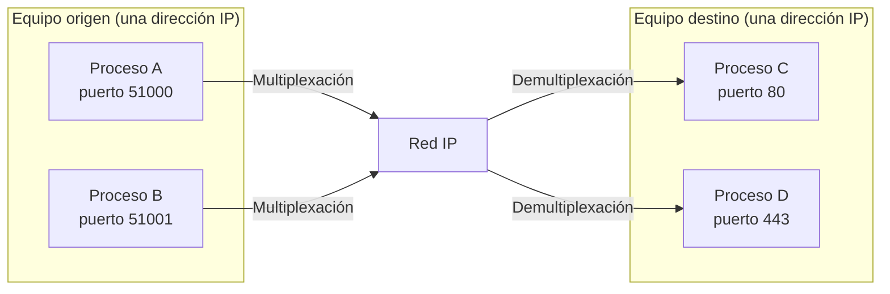
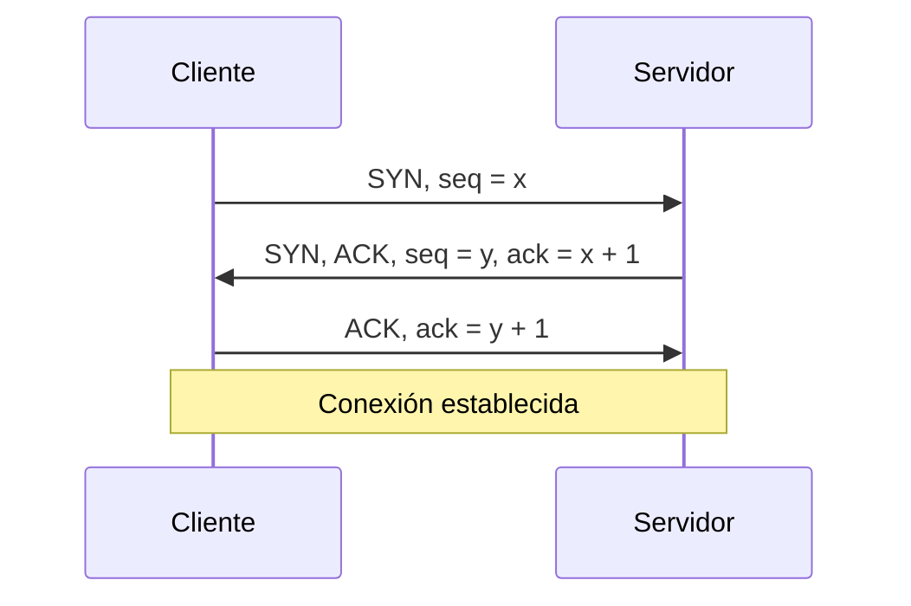
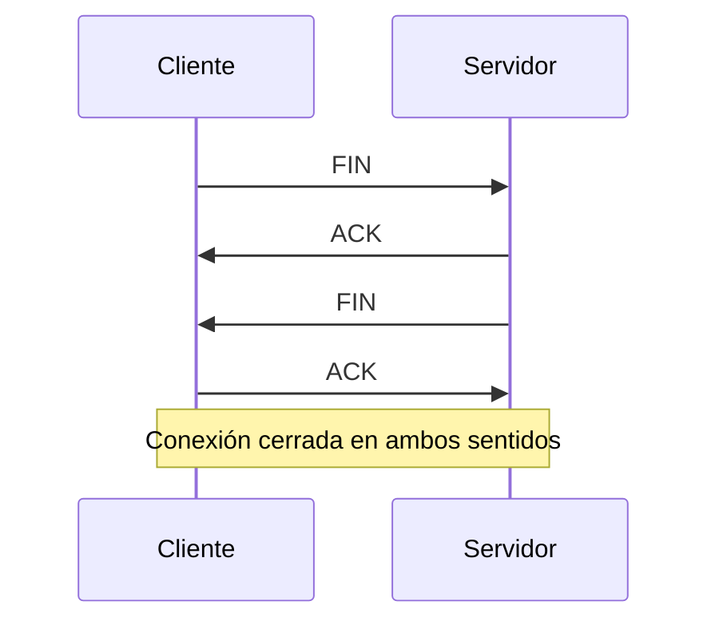
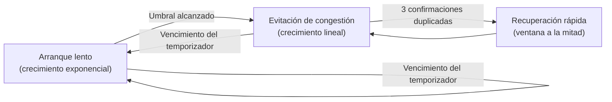

El nivel de red entrega datagramas entre dos equipos identificados por su dirección IP,
un servicio que describe en detalle
[protocolo IP y direccionamiento](section_1_protocolo_ip_y_direccionamiento.md), pero
una dirección IP identifica un equipo, no un proceso concreto que se ejecuta en él. Este
capítulo describe el nivel de transporte, la capa que toma esa entrega entre equipos y
la convierte en un servicio de comunicación entre procesos de aplicación, además de los
protocolos que implementan ese servicio con distintos compromisos entre fiabilidad,
orden y coste de _overhead_.

## Introducción

El nivel de transporte ofrece sus servicios a las aplicaciones y se apoya, a su vez, en
el servicio de entrega de datagramas del nivel de red, dentro de la organización en
capas presentada en
[arquitectura en capas y encapsulado](../01_arquitectura/section_1_capas_y_encapsulado.md).
Dos decisiones de diseño separan a los protocolos de este nivel entre sí. La primera es
si el protocolo establece una conexión antes de intercambiar datos o si entrega cada
unidad de forma independiente, sin estado previo entre los extremos. La segunda es si el
protocolo garantiza que los datos lleguen, en orden y sin duplicados, o si delega esa
garantía en la propia aplicación. Un **servicio orientado a conexión y fiable**
intercambia señalización de control antes de transmitir datos de usuario, numera lo que
envía y retransmite lo que no llega, a costa de una latencia inicial y de un _overhead_
constante de señalización. Un **servicio sin conexión** entrega cada unidad de forma
independiente, sin negociación previa ni garantía de entrega, y deja a la aplicación
decidir si necesita fiabilidad adicional. Ninguno de los dos servicios es superior en
abstracto, cada uno es la elección correcta para una clase distinta de aplicación, y ese
contraste es el hilo que recorre todo el capítulo.

## Puertos y sockets

Distinguir procesos dentro de un mismo equipo exige una dirección adicional a la
dirección IP: el **puerto**, un número de 16 bits que el nivel de transporte añade a la
dirección IP de origen y de destino de una sesión. Un puerto no es necesario en una
conexión física punto a punto entre dos equipos, porque en ese caso basta con
identificar el equipo, pero sí lo es en cualquier red donde varios procesos compartan
una misma dirección IP. La combinación de dirección IP, número de puerto y protocolo de
transporte forma un **`socket`**, el punto de acceso que un proceso abre para enviar y
recibir datos a través de la red. Un mismo host multiplexa así el tráfico de varios
procesos sobre una única dirección IP, y el nivel de transporte del extremo receptor
demultiplexa cada segmento o datagrama entrante hacia el proceso correcto a partir del
puerto de destino.

### Puertos bien conocidos

El espacio de 16 bits de puerto se organiza en tres rangos por convenio. Los **puertos
bien conocidos**, del 0 al 1023, identifican servicios estándar y los asigna un
organismo de normalización; los **puertos registrados**, del 1024 al 49151, quedan
reservados para aplicaciones concretas sin exigir la misma autoridad central; y los
**puertos dinámicos o efímeros**, del 49152 al 65535, los asigna el sistema operativo de
forma temporal al proceso que inicia una conexión saliente. Un servidor escucha
habitualmente en un puerto bien conocido fijo, mientras que el cliente que se conecta a
él recibe un puerto efímero asignado por su propio sistema.

| Servicio | Puerto      | Protocolo de transporte  |
| -------- | ----------- | ------------------------ |
| `HTTP`   | `80`        | TCP                      |
| `HTTPS`  | `443`       | TCP                      |
| `DHCP`   | `67` / `68` | UDP (servidor / cliente) |

El protocolo de aplicación que se apoya en cada uno de estos puertos, con su formato de
mensaje y su intercambio concreto, no es objeto de esta área: la Web como servicio de
operador, con el nivel de detalle que le corresponde a un catálogo de servicios, se
describe en
[servicios de datos y acceso a Internet](../../05_servicios/06_servicios_y_regulacion/section_1_catalogo_de_servicios.md#servicios-de-datos-y-acceso-a-internet).

## UDP

El **protocolo de datagramas de usuario** (_User Datagram Protocol_, UDP) ofrece el
servicio de transporte más simple posible: añade puertos y una verificación de
integridad opcional al servicio de entrega de datagramas que ya proporciona el nivel de
red, sin añadir nada más.

### Servicio sin conexión

UDP no establece conexión antes de transmitir ni mantiene ningún estado entre los
extremos. No garantiza la entrega de un datagrama, ni su orden de llegada, ni protege
frente a duplicados: cada datagrama viaja de forma independiente y el protocolo no
detecta ni corrige su pérdida. Esa ausencia de garantías es, precisamente, lo que reduce
su _overhead_ frente a un protocolo orientado a conexión, porque no hay señalización de
establecimiento, ni temporizadores de retransmisión, ni ventana de control de flujo que
mantener.

La cabecera de UDP ocupa 8 bytes, frente a los 20 bytes mínimos de la cabecera de TCP
descrita más adelante, lo que reduce el _overhead_ por segmento en aplicaciones que
envían datagramas pequeños con frecuencia.

| Campo                  | Longitud | Descripción                                      |
| ---------------------- | -------- | ------------------------------------------------ |
| `Puerto origen`        | 16 bits  | Puerto del proceso que envía el datagrama.       |
| `Puerto destino`       | 16 bits  | Puerto del proceso que debe recibirlo.           |
| `Longitud`             | 16 bits  | Longitud total del datagrama, cabecera incluida. |
| `Suma de comprobación` | 16 bits  | Verificación de integridad de cabecera y datos.  |

### Verificación de integridad

El único mecanismo de control de errores que ofrece UDP es la **suma de comprobación**
(_checksum_) de su cabecera, un valor calculado sobre la cabecera y los datos del
datagrama que el receptor recalcula al recibirlo para detectar corrupción durante el
tránsito. Detectar un error no implica corregirlo ni solicitar su retransmisión: si la
suma de comprobación no coincide, el receptor descarta el datagrama sin más acción, y es
la aplicación, si lo necesita, la que debe implementar su propio mecanismo de
recuperación por encima de UDP.

### Escenarios de uso

UDP resulta preferible cuando la aplicación tolera perder alguna unidad de datos pero no
tolera el retardo que introduciría esperar su retransmisión, o cuando el propio
protocolo de aplicación ya implementa su propia fiabilidad y no necesita que el nivel de
transporte la duplique. Los servicios de tiempo real son el caso más claro: una
aplicación de voz o vídeo en directo prefiere perder un fragmento de señal a esperar una
retransmisión que llegaría demasiado tarde para reproducirse con naturalidad. `DHCP`
también se apoya en UDP, porque el propio protocolo de aplicación gestiona sus
reintentos sin necesidad de una conexión previa.

???+ example "Elección de transporte para un servicio de voz en tiempo real"

    Un servicio de telefonía sobre IP debe elegir entre transportar sus paquetes de voz
    sobre un protocolo fiable orientado a conexión o sobre un protocolo sin conexión y
    sin garantía de entrega. El intervalo entre muestras de voz consecutivas es de
    varias decenas de milisegundos y el oído humano tolera huecos breves en el audio sin
    que la conversación se vea afectada de forma notable, pero no tolera un retardo
    acumulado de varios cientos de milisegundos, que se percibe como una conversación
    incómoda con silencios y solapamientos.

    Si un paquete de voz se pierde y el transporte fuera fiable, el extremo receptor
    tendría que esperar a la retransmisión antes de poder reproducir el audio siguiente,
    lo que introduce un retardo mayor que el propio hueco que la pérdida provocó. Sobre
    un transporte sin conexión, el receptor simplemente omite la muestra perdida, oculta
    el hueco con una técnica de enmascarado de errores y continúa reproduciendo el resto
    del flujo sin esperar. El servicio elige, por tanto, un transporte sin conexión y sin
    garantía de entrega: perder una muestra ocasional es preferible a introducir el
    retardo que su recuperación exigiría.

## TCP

El **protocolo de control de transmisión** (_Transmission Control Protocol_, TCP) adopta
la estrategia opuesta a UDP: establece una conexión antes de transmitir datos, numera
cada byte que envía, retransmite lo que no llega y regula el ritmo de envío según la
capacidad del receptor y de la red. Ese conjunto de garantías convierte a TCP en el
transporte por defecto de cualquier aplicación que necesite que sus datos lleguen
completos y en orden sin implementar esa lógica por sí misma.

| Campo                     | Longitud | Descripción                                      |
| ------------------------- | -------- | ------------------------------------------------ |
| `Puerto origen`           | 16 bits  | Puerto del proceso que envía el segmento.        |
| `Puerto destino`          | 16 bits  | Puerto del proceso que debe recibirlo.           |
| `Número de secuencia`     | 32 bits  | Posición del primer byte de datos del segmento.  |
| `Número de confirmación`  | 32 bits  | Siguiente byte que el emisor espera recibir.     |
| `Desplazamiento de datos` | 4 bits   | Longitud de la cabecera, en palabras de 32 bits. |
| `Indicadores`             | 6 bits   | `URG`, `ACK`, `PSH`, `RST`, `SYN`, `FIN`.        |
| `Ventana`                 | 16 bits  | Bytes que el receptor está dispuesto a aceptar.  |
| `Suma de comprobación`    | 16 bits  | Verificación de integridad de cabecera y datos.  |
| `Puntero urgente`         | 16 bits  | Desplazamiento de los datos marcados urgentes.   |

La cabecera mínima de TCP, sin opciones, ocupa 20 bytes, más del doble que la cabecera
de UDP, un _overhead_ que la aplicación asume a cambio de las garantías de entrega,
orden y control de flujo que se describen en el resto de esta sección.

### Establecimiento y cierre de conexión

TCP abre una conexión mediante un intercambio de tres segmentos conocido como **saludo
de tres vías**: el extremo que inicia la conexión envía un segmento con el indicador
`SYN` activo y un número de secuencia inicial; el extremo receptor responde con un
segmento que activa a la vez `SYN` y `ACK`, confirmando el número de secuencia recibido
y proponiendo el suyo; y el iniciador cierra el intercambio con un segmento `ACK` que
confirma el número de secuencia del receptor. A partir de ese momento ambos extremos
conocen el número de secuencia inicial del otro y la conexión queda establecida en ambos
sentidos.

El cierre sigue un patrón simétrico pero con cuatro segmentos, porque cada extremo debe
cerrar su propio sentido de la comunicación de forma independiente: el extremo que
inicia el cierre envía un segmento `FIN`, el otro extremo lo confirma con `ACK` y,
cuando también termina de enviar sus propios datos, envía su propio `FIN`, que el
iniciador confirma con un último `ACK`.

### Segmentación y entrega ordenada

La aplicación entrega a TCP un flujo continuo de bytes, sin estructura en unidades
discretas, y es TCP quien divide ese flujo en **segmentos** de tamaño ajustado a la
unidad máxima de transmisión que admite el nivel de red, para evitar la fragmentación en
tránsito. Cada segmento lleva en su cabecera el número de secuencia del primer byte de
datos que transporta, lo que permite al receptor reconstruir el flujo original en el
orden correcto aunque los segmentos lleguen desordenados o duplicados por el camino: el
receptor almacena en un búfer los segmentos que llegan fuera de orden y solo entrega a
la aplicación el flujo de bytes contiguo que ya tiene completo desde el principio.

### Retransmisión y tiempo de ida y vuelta

TCP confirma la recepción de datos mediante el campo de número de confirmación de su
cabecera, y retransmite un segmento cuando no recibe su confirmación dentro de un plazo
calculado a partir del **tiempo de ida y vuelta** (_Round-Trip Time_, RTT) medido en la
propia conexión. El emisor mantiene una estimación del RTT actualizada con cada
confirmación recibida y fija su temporizador de retransmisión por encima de esa
estimación, con un margen que absorbe la variabilidad del retardo de la ruta, para
evitar tanto una retransmisión prematura, que desperdicia capacidad enviando datos que
en realidad sí iban a llegar, como una retransmisión demasiado tardía, que deja al
receptor esperando innecesariamente.

Este mecanismo de detección y retransmisión reutiliza la misma idea de fondo que los
esquemas de retransmisión descritos para el
[nivel de enlace radio](../../01_fundamentos/05_codificacion/section_3_adaptacion_de_enlace_y_retransmision.md#protocolos-de-retransmision):
un número de secuencia, una confirmación y un temporizador o una señal explícita de
pérdida que dispara la repetición. La diferencia entre ambos niveles no está en la idea,
sino en su alcance. La retransmisión de enlace opera entre dos nodos adyacentes de un
único salto radio, recupera tramas dañadas por el canal físico de ese salto concreto y
resulta transparente al resto de la ruta. La retransmisión de TCP opera **extremo a
extremo**: solo los dos procesos de aplicación que mantienen la conexión participan en
ella, la pérdida puede producirse en cualquier salto intermedio de la ruta completa
entre ambos, y ningún encaminador intermedio conoce ni participa en la recuperación. Un
segmento TCP puede perderse por congestión en un encaminador situado a mitad de camino,
un motivo de pérdida que la retransmisión de enlace, limitada a errores del canal físico
de un solo salto, ni siquiera contempla.

???+ example "Coste en retardo de recuperar un segmento perdido según su detección"

    Una conexión TCP mide un tiempo de ida y vuelta de 60 ms. Cuando un segmento se
    pierde pero los segmentos que lo siguen sí llegan, el receptor responde con
    confirmaciones duplicadas del último byte contiguo recibido, y tres de esas
    confirmaciones duplicadas bastan para que el emisor retransmita el segmento perdido
    sin esperar a su temporizador, un mecanismo conocido como retransmisión rápida. Esas
    tres confirmaciones duplicadas llegan, en las condiciones de esta conexión,
    aproximadamente un tiempo de ida y vuelta después de la pérdida, de modo que la
    retransmisión rápida añade unos 60 ms de retardo antes de que el segmento vuelva a
    enviarse.

    Si en cambio ningún segmento posterior llega a confirmarse con una confirmación
    duplicada, por ejemplo porque el segmento perdido era el último de una ráfaga, la
    única señal de pérdida disponible es el vencimiento del temporizador de
    retransmisión, fijado en este caso en 300 ms para dar margen a la variabilidad del
    RTT. El emisor no reintenta hasta que expiran esos 300 ms.

    La diferencia entre ambos mecanismos es de $300 - 60 = 240$ ms de retardo adicional
    antes de que comience la recuperación, una diferencia que crece con cada
    retransmisión fallida sucesiva y que motiva que las implementaciones actuales de TCP
    prioricen la retransmisión rápida frente a esperar siempre al temporizador.

### Control de flujo

El **control de flujo** evita que el emisor sature el búfer de recepción del receptor
enviando más datos de los que este puede procesar. El receptor anuncia en el campo
`Ventana` de cada segmento el número de bytes que todavía puede aceptar en su búfer, y
el emisor limita la cantidad de datos sin confirmar en tránsito a ese valor. Cuando el
búfer del receptor se llena, la ventana anunciada se reduce, incluso hasta cero, lo que
detiene el envío hasta que la aplicación receptora consuma datos del búfer y libere
espacio. Esta ventana desliza a medida que se confirman datos, lo que da nombre a la
técnica de **ventana deslizante**: el límite de datos sin confirmar se desplaza hacia
adelante con cada confirmación recibida, sin necesidad de detener el envío mientras
queden bytes autorizados dentro de esa ventana.

???+ example "Rendimiento máximo que permite una ventana de recepción dada"

    El campo `Ventana` de la cabecera de TCP tiene 16 bits, lo que limita su valor
    nominal a 65535 bytes en ausencia de la opción de escalado de ventana. Sobre una
    conexión cuyo tiempo de ida y vuelta es de 100 ms, el emisor no puede tener en
    tránsito, sin confirmar, más de esos 65535 bytes en ningún instante, porque el
    receptor no acepta más.

    El régimen binario máximo que ese límite permite sostener es el cociente entre el
    tamaño de la ventana, en bits, y el tiempo que tarda en confirmarse y liberar
    espacio en la ventana, que es precisamente el tiempo de ida y vuelta:

    $$
    \text{Throughput}_{\text{máx}} = \frac{65535 \times 8\ \text{bit}}{0{,}1\ \text{s}}
    \approx 5{,}24\ \text{Mbit/s}
    $$

    Aunque el enlace subyacente ofrezca una capacidad muy superior a 5,24 Mbit/s, la
    conexión no puede aprovecharla mientras la ventana de recepción permanezca en su
    valor nominal de 16 bits: el producto entre el ancho de banda del enlace y el
    retardo de ida y vuelta, conocido como el producto ancho de banda-retardo de la
    conexión, supera el tamaño de la ventana, y es la ventana, no el enlace, la que
    limita el _throughput_ alcanzable. Elevar ese límite exige negociar la opción de
    escalado de ventana al establecer la conexión.

### Control de congestión

El **control de congestión** limita el ritmo de envío de TCP en función del estado de la
red, no solo de la capacidad del receptor, mediante una segunda ventana que el emisor
mantiene internamente: la **ventana de congestión**. TCP arranca una conexión nueva, o
reanuda una tras una pérdida por temporizador, en una fase de **arranque lento** (_slow
start_) en la que la ventana de congestión se duplica aproximadamente cada tiempo de ida
y vuelta, un crecimiento exponencial que explora rápidamente la capacidad disponible sin
partir de una estimación previa. Al alcanzar un umbral, la conexión pasa a **evitación
de congestión** (_congestion avoidance_), donde el crecimiento se vuelve lineal, de
aproximadamente un segmento adicional por tiempo de ida y vuelta, una exploración mucho
más cautelosa que reduce el riesgo de provocar una nueva congestión. Ante una pérdida
detectada por confirmaciones duplicadas, la conexión reduce a la mitad su ventana de
congestión y entra en **recuperación rápida** en lugar de reiniciar desde el arranque
lento, mientras que una pérdida detectada por vencimiento del temporizador, señal de una
congestión más severa, sí reinicia la ventana de congestión a su valor mínimo y regresa
al arranque lento.

El emisor nunca envía más datos sin confirmar que el menor de los dos límites vigentes,
la ventana de congestión que impone la red y la ventana de recepción que impone el
receptor, de modo que ambos mecanismos de control, el de flujo y el de congestión,
actúan siempre de forma conjunta sobre el mismo flujo de datos.

### Bloqueo de cabeza de línea

La entrega ordenada de TCP exige que el receptor entregue los bytes a la aplicación en
el mismo orden en que se enviaron, lo que produce **bloqueo de cabeza de línea**: si el
segmento situado al principio de la secuencia se pierde, ningún segmento posterior,
aunque ya haya llegado correctamente al receptor, se entrega a la aplicación hasta que
el segmento perdido se retransmite y llega. Ese bloqueo afecta a la conexión completa,
incluso cuando una misma conexión multiplexa varios flujos lógicos de una aplicación,
porque TCP no distingue flujos dentro de una única secuencia de bytes: la pérdida de un
fragmento de un flujo detiene también la entrega de los demás.

## SCTP

El **protocolo de transmisión de control de flujos** (_Stream Control Transmission
Protocol_, SCTP) combina propiedades de UDP y de TCP que ninguno de los dos ofrece por
separado: entrega mensajes discretos como UDP, pero con la fiabilidad y el orden que
ofrece TCP, evitando además el bloqueo de cabeza de línea que TCP no puede evitar por su
propio diseño orientado a un único flujo de bytes.

| Campo                      | Longitud | Descripción                                    |
| -------------------------- | -------- | ---------------------------------------------- |
| `Puerto origen`            | 16 bits  | Puerto del proceso que envía el paquete SCTP.  |
| `Puerto destino`           | 16 bits  | Puerto del proceso que debe recibirlo.         |
| `Etiqueta de verificación` | 32 bits  | Identifica la asociación entre ambos extremos. |
| `Suma de comprobación`     | 32 bits  | Verificación de integridad de todo el paquete. |

### Entrega fiable orientada a mensajes

A diferencia de TCP, que trata sus datos como un flujo continuo de bytes sin límites
propios, SCTP entrega **mensajes** completos y delimitados, de forma similar a como UDP
entrega datagramas, pero manteniendo la fiabilidad y el orden que UDP no ofrece: cada
mensaje se confirma, se retransmite si no llega y se reordena si llega fuera de
secuencia, igual que hace TCP con sus segmentos, solo que la unidad de trabajo es el
mensaje completo, no un flujo indiferenciado de bytes. SCTP mantiene además el estado de
la asociación mediante mensajes de **latido** (_heartbeat_) periódicos que verifican que
la ruta entre ambos extremos sigue disponible incluso cuando no hay datos de usuario que
transmitir.

### Multiplicidad de flujos y de direcciones

SCTP resuelve el bloqueo de cabeza de línea de TCP mediante **multiplicidad de flujos**:
una misma asociación transporta varios flujos lógicos independientes, cada uno con su
propia numeración y su propio orden de entrega, de modo que la pérdida de un mensaje en
un flujo bloquea únicamente la entrega de ese flujo y no la de los demás que comparten
la misma asociación. SCTP añade también **multiplicidad de direcciones**: cada extremo
de la asociación puede anunciar varias direcciones IP propias, típicamente asociadas a
interfaces de red distintas, y si la ruta activa deja de responder, la asociación
conmuta a una de las direcciones alternativas sin necesidad de reestablecer la
comunicación desde cero. Esa combinación de flujos y direcciones independientes es la
que permite a SCTP dar prioridad a los mensajes pequeños de un flujo cuando los mensajes
grandes de otro flujo quedan bloqueados esperando su confirmación.

### Fiabilidad parcial y prioridades

SCTP no exige que todos sus flujos ofrezcan la misma fiabilidad estricta que TCP: admite
configurar, por flujo o incluso por mensaje, una **fiabilidad parcial** en la que un
mensaje deja de retransmitirse si su entrega no se completa dentro de un número máximo
de intentos o de un plazo de tiempo, en lugar de reintentarse indefinidamente. Esa
fiabilidad parcial resulta útil para datos que pierden valor si llegan demasiado tarde,
de forma similar al motivo que lleva a elegir UDP para tráfico en tiempo real, pero sin
renunciar por completo a la fiabilidad y al orden dentro de cada flujo mientras el plazo
configurado no se agote.

## ICMP

El **protocolo de mensajes de control de Internet** (_Internet Control Message
Protocol_, ICMP) no transporta datos de aplicación entre procesos como hacen UDP, TCP o
SCTP. Su función es distinta: transmitir información de control y de error sobre el
propio funcionamiento de la red, generada por los equipos de red para informar de
condiciones que impiden o alteran la entrega de un datagrama.

| Campo                  | Longitud | Descripción                                         |
| ---------------------- | -------- | --------------------------------------------------- |
| `Tipo`                 | 8 bits   | Categoría del mensaje ICMP.                         |
| `Código`               | 8 bits   | Subtipo dentro de la categoría indicada por `Tipo`. |
| `Suma de comprobación` | 16 bits  | Verificación de integridad del mensaje.             |

### Mensajes de error

ICMP no se emplea para la transferencia de datos entre aplicaciones de usuario final: lo
generan los equipos de red, típicamente encaminadores, para notificar al origen de un
datagrama que este no ha podido entregarse o procesarse con normalidad. Un encaminador
que no encuentra ruta hacia el destino de un datagrama, o que descarta un datagrama
porque su campo de tiempo de vida ha llegado a cero, informa de ello al origen mediante
un mensaje ICMP de error en lugar de descartar el datagrama en silencio.

### Herramientas de diagnóstico

Las dos herramientas de diagnóstico de red más habituales se apoyan directamente en
ICMP. `ping` envía un mensaje ICMP de solicitud de eco al destino y mide el tiempo hasta
recibir el mensaje de respuesta de eco correspondiente, lo que verifica tanto la
alcanzabilidad del destino como el tiempo de ida y vuelta hacia él. `traceroute` envía
una serie de datagramas con un tiempo de vida creciente, comenzando en uno, de modo que
cada encaminador sucesivo de la ruta agota ese campo y devuelve un mensaje ICMP de
tiempo excedido, lo que revela la identidad de cada salto intermedio de la ruta completa
hacia el destino.

## Comparación de los protocolos de transporte

La tabla siguiente resume las diferencias que motivan elegir uno de estos protocolos
sobre los demás para un servicio concreto.

| Protocolo | Orientación a conexión | Fiabilidad y orden            | Unidad de entrega |
| --------- | ---------------------- | ----------------------------- | ----------------- |
| UDP       | Sin conexión           | Ninguna                       | Datagrama         |
| TCP       | Orientado a conexión   | Completa, un único flujo      | Flujo de bytes    |
| SCTP      | Orientado a conexión   | Completa o parcial, por flujo | Mensaje           |

UDP resulta adecuado cuando la aplicación tolera pérdidas y necesita baja latencia; TCP,
cuando la aplicación necesita un flujo de bytes fiable y no tiene varios flujos lógicos
independientes que proteger de un bloqueo mutuo; y SCTP, cuando la aplicación necesita
la fiabilidad de TCP pero maneja varios flujos de mensajes independientes, o varias
rutas de red redundantes, que TCP no puede aprovechar por su propio diseño.
