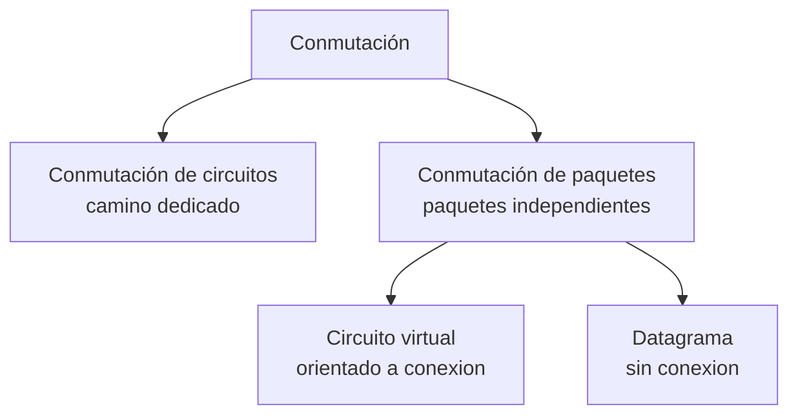
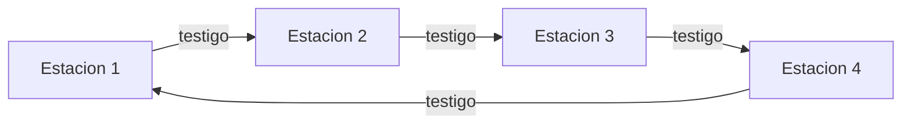
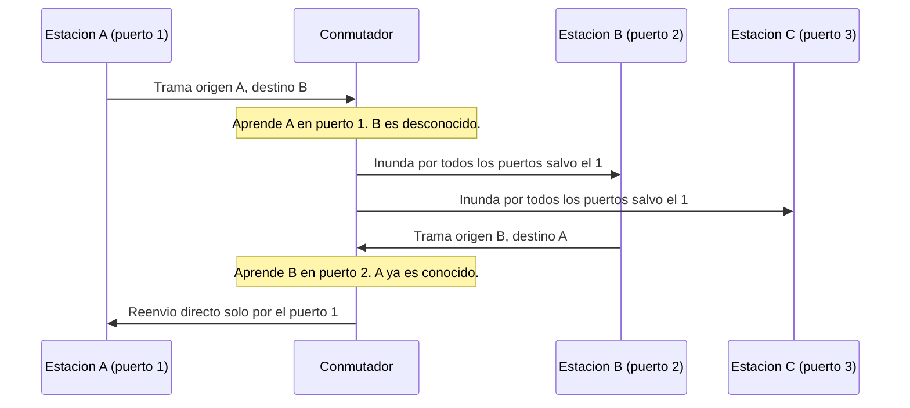
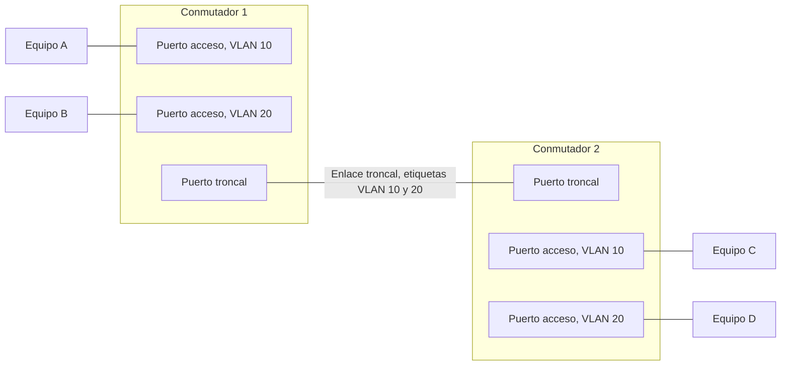

Entregar un mensaje entre dos equipos exige decidir cómo se comparte la capacidad de la
red entre las distintas comunicaciones que compiten por ella, y cómo se organiza un
conjunto de equipos vecinos para que se entiendan entre sí sin necesidad de que cada
mensaje atraviese toda la red interconectada. Este capítulo recorre esas dos preguntas
en el orden en que se resuelven en la práctica: primero los paradigmas de conmutación
que reparten la capacidad de un enlace entre varias comunicaciones, después la familia
Ethernet que domina la construcción de redes de área local, los equipos que
interconectan esas redes aprendiendo dónde se encuentra cada estación, y finalmente la
segmentación lógica de una red local en redes virtuales independientes.

## Introducción

Una red de telecomunicación rara vez ofrece un enlace dedicado a cada par de equipos que
necesita comunicarse, porque el coste de tender un enlace físico por cada posible
comunicación resultaría prohibitivo. En su lugar, los equipos comparten un conjunto
reducido de enlaces y de equipos intermedios que deciden, en cada instante, cómo se
reparte esa capacidad compartida entre las comunicaciones activas. La **conmutación** es
la función que toma esa decisión de reparto, y el conjunto de reglas que sigue para
tomarla es lo que distingue a los distintos paradigmas de conmutación que se presentan a
continuación. Sobre esa base, la tecnología **Ethernet** concreta un formato de trama y
un conjunto de reglas de acceso al medio que se ha convertido en el estándar de facto
para construir redes de área local, y los **conmutadores** son los equipos que
interconectan los segmentos de esas redes aprendiendo automáticamente dónde se encuentra
cada estación. Por último, las **redes de área local virtuales** permiten dividir una
misma red física conmutada en varios dominios lógicos independientes sin necesidad de
duplicar el cableado.

## Conmutación

La conmutación resuelve el problema de transferir datos entre dos equipos que no están
conectados por un enlace directo, apoyándose en un conjunto de equipos intermedios que
deciden por qué camino avanza cada unidad de información. Se distinguen dos paradigmas
principales según cómo se reserva la capacidad del enlace para una comunicación: la
conmutación de circuitos y la conmutación de paquetes.

### Conmutación de circuitos

La **conmutación de circuitos** establece, antes de transferir ningún dato, un camino
dedicado que reserva capacidad de forma exclusiva desde el origen hasta el destino, y
mantiene esa reserva durante toda la comunicación con independencia de que haya o no
datos que transmitir en cada instante. Este paradigma resulta natural para tráfico de
voz tradicional, donde la comunicación mantiene un flujo de información más o menos
constante durante toda su duración, pero desperdicia capacidad cuando el tráfico es a
ráfagas, porque el camino reservado permanece ocupado incluso durante los silencios de
la conversación. La cuantificación de cuánta capacidad dedicar a un sistema de
conmutación de circuitos, mediante el número de Erlangs que cursa el tráfico ofrecido,
se trata en
[teoría de colas y dimensionado de tráfico](../../06_trafico/01_colas/section_2_erlang_y_dimensionado.md).

### Conmutación de paquetes

La **conmutación de paquetes** divide los datos en unidades independientes, cada una con
la información de control necesaria para que los equipos intermedios decidan cómo
reenviarla, en lugar de reservar un camino dedicado de antemano. Cada equipo intermedio
de conmutación de paquetes recibe la unidad completa, la almacena temporalmente y la
reenvía por el enlace de salida que corresponda una vez decidido el siguiente salto, un
funcionamiento que se conoce como almacenamiento y reenvío. Este paradigma multiplexa de
forma estadística la capacidad del enlace entre varias comunicaciones simultáneas, lo
que aprovecha mucho mejor la capacidad disponible que la conmutación de circuitos cuando
el tráfico es a ráfagas, a cambio de que el retardo de entrega de cada unidad ya no es
constante, sino que depende de la carga instantánea que soportan los equipos
intermedios.

### Circuito virtual y datagrama

Dentro de la conmutación de paquetes conviven dos formas de decidir el camino que sigue
cada paquete, que corresponden a las dos variantes generales de servicio de red
introducidas al hablar de
[servicio orientado a conexión y sin conexión](../01_arquitectura/section_1_capas_y_encapsulado.md#servicio-orientado-a-conexion-y-sin-conexion).
En el esquema de **circuito virtual**, la fase de establecimiento de la conexión
selecciona una ruta concreta entre origen y destino, y todos los paquetes de esa misma
conexión siguen exactamente esa ruta hasta que la conexión se libera, de modo que llegan
en el mismo orden en que se enviaron. En el esquema de **datagrama**, cada paquete
transporta su propia dirección de destino y se encamina de forma independiente de los
demás, sin que exista ninguna fase previa de establecimiento, tal como ocurre en
Internet: cada encaminador intermedio decide el siguiente salto de cada paquete a partir
únicamente de la dirección que lleva, sin memoria de los paquetes anteriores de la misma
comunicación. La diferencia práctica entre ambos esquemas es que el circuito virtual
garantiza el orden de entrega a costa de una fase de señalización previa, mientras que
el datagrama evita esa fase previa a costa de admitir que paquetes de una misma
comunicación lleguen desordenados o por caminos distintos.

## Ethernet

**Ethernet** es la familia de tecnologías de red de área local definida por el estándar
IEEE 802.3, que fija un formato de trama común, un método de acceso al medio y un
conjunto de implementaciones físicas. Su adopción masiva la ha convertido en la
tecnología de referencia para interconectar estaciones dentro de un mismo edificio o
campus.

### Formato de trama

Una trama Ethernet transporta el datagrama de la capa de red dentro de una cabecera y
una cola que añade la propia capa de acceso a la red, siguiendo el mecanismo general de
[encapsulado](../01_arquitectura/section_1_capas_y_encapsulado.md#encapsulado-y-desencapsulado)
ya presentado para cualquier capa de protocolo.

| Campo                  | Longitud        | Función                                                            |
| ---------------------- | --------------- | ------------------------------------------------------------------ |
| `Preámbulo` y `SFD`    | 8 bytes         | Sincronización del receptor, no cuenta en la longitud de la trama. |
| `Dirección de destino` | 6 bytes         | Dirección MAC de la estación o del grupo destino.                  |
| `Dirección de origen`  | 6 bytes         | Dirección MAC de la estación que envía la trama.                   |
| `Tipo` o `Longitud`    | 2 bytes         | Protocolo de nivel superior, o longitud del campo de datos.        |
| `Datos`                | 46 a 1500 bytes | `Payload` de la trama, el datagrama de la capa de red.             |
| `FCS`                  | 4 bytes         | Secuencia de comprobación de trama, un `CRC` de 32 bits.           |

El campo `Tipo o Longitud` admite dos interpretaciones según su valor: si es mayor o
igual a 1536, identifica el protocolo de nivel superior que transporta la trama, por
ejemplo IP; si es menor, expresa la longitud en bytes del campo de datos y remite a una
subcapa de control de enlace lógico que identifica el protocolo mediante un campo
adicional de puntos de acceso al servicio. Esta segunda variante es la que empleaban las
implementaciones originales del estándar 802.3, mientras que la primera, conocida como
Ethernet II, es la que emplean prácticamente todas las redes actuales.

### Direccionamiento unicast, multidifusión y difusión

La estructura general de una dirección MAC de 48 bits, con sus 24 bits de fabricante y
24 bits de número de serie, y el significado de su bit menos significativo para
distinguir direcciones unicast, multicast y de broadcast, se describe en
[direcciones físicas MAC](../01_arquitectura/section_1_capas_y_encapsulado.md#direcciones-fisicas-mac).
Ethernet aplica directamente ese esquema de direccionamiento a sus dos campos de
dirección: la dirección de origen de una trama debe ser siempre unicast, porque
identifica a una única estación emisora, mientras que la dirección de destino puede ser
unicast si la trama va dirigida a una sola estación, de multidifusión si va dirigida a
un grupo de estaciones, o la dirección de difusión, con los 48 bits a uno, si debe
alcanzar a todas las estaciones del mismo segmento. Esta distinción determina
directamente cómo se comporta un conmutador ante cada trama, tal como se describe más
adelante al tratar los dominios de colisión y de difusión.

### Longitud mínima y máxima de trama

El campo de datos de una trama Ethernet ocupa entre 46 y 1500 bytes. Sumando los 6 bytes
de cada dirección, los 2 bytes del campo tipo o longitud y los 4 bytes del `FCS`, que
suponen 18 bytes de `overhead` fijo ajenos al preámbulo, la longitud total de la trama
queda acotada entre $46 + 18 = 64$ bytes y $1500 + 18 = 1518$ bytes. Cuando los datos
que hay que transmitir ocupan menos de 46 bytes, la trama se completa con bytes de
relleno hasta alcanzar esa longitud mínima, porque una trama más corta no permite al
método de acceso al medio garantizar la detección de una colisión, como se desarrolla en
la sección siguiente.

### Acceso al medio y longitud máxima del segmento

El mecanismo `CSMA/CD` que emplea Ethernet para acceder al medio compartido, incluida la
noción de periodo vulnerable y el mecanismo de espera aleatoria tras una colisión, se
describe con detalle en
[acceso múltiple al medio](../../01_fundamentos/04_acceso_al_medio/section_2_acceso_multiple.md).
Ethernet fija el tiempo de transmisión de la trama mínima como su **ranura temporal**
(`slot time`), de 512 bits, que coincide exactamente con los $64$ bytes de longitud
mínima de trama obtenidos en la sección anterior: si una trama tarda al menos ese tiempo
en transmitirse por completo, el emisor tiene garantizado detectar cualquier colisión
antes de terminar de enviarla, siempre que se cumpla la condición $t_{tx} \geq 2
t_{prop}$ que exige el mecanismo de detección de colisión. Esa condición liga
directamente el tiempo de transmisión mínimo con el tiempo de propagación máximo que la
red puede tolerar, y por tanto con la longitud física máxima que puede alcanzar un
segmento de la red para una velocidad de transmisión dada.

???+ example "Longitud máxima de segmento a 10 Mbit/s a partir de la ranura temporal"

    Una red Ethernet transmite a $R = 10$ Mbit/s, con una ranura temporal de 512 bits, lo
    que da un tiempo de transmisión mínimo $t_{tx} = 512 / 10^7 = 51{,}2\,\mu\text{s}$.
    La condición de detección de colisión exige que el tiempo de propagación máximo
    entre las dos estaciones más alejadas no supere la mitad de ese tiempo,
    $t_{prop} \leq t_{tx}/2 = 25{,}6\,\mu\text{s}$. Con una velocidad de propagación en
    el medio de $v = 2 \times 10^8$ m/s, la longitud máxima teórica del segmento es

    $$
    L_{\text{máx}} = t_{prop} \cdot v = 25{,}6 \times 10^{-6} \cdot 2 \times 10^8 =
    5120 \text{ m}
    $$

    Este valor teórico no tiene en cuenta los retardos adicionales que introducen los
    repetidores intermedios, el procesado en cada estación y la señal de colisión
    (`jam`) que debe propagarse de vuelta a la estación transmisora. Aplicando el
    margen de reducción del 48 % que el estándar reserva para esos factores, la
    longitud máxima real del segmento queda en $5120 \cdot 0{,}48 \approx 2458$ metros,
    bastante por debajo del límite teórico y coherente con los 500 metros de alcance
    que fija la implementación física de par grueso coaxial descrita en la sección
    siguiente para una única sección de cable, antes de necesitar repetidores
    adicionales.

### Denominación de los niveles físicos

El estándar Ethernet original nombra cada implementación de su nivel físico con tres
campos concatenados: la velocidad de transmisión en megabits por segundo, la palabra
`Base` para indicar que la señal ocupa toda la banda del medio sin modulación en
portadora, y un último campo que identifica el medio de transmisión o, en los casos más
antiguos, la longitud máxima de una sección de cable en cientos de metros.

| Denominación | Medio          | Topología           | Longitud máxima de segmento |
| ------------ | -------------- | ------------------- | --------------------------- |
| `10Base5`    | Coaxial grueso | Bus                 | 500 m                       |
| `10Base2`    | Coaxial fino   | Bus                 | 185 m                       |
| `10BaseT`    | Par trenzado   | Estrella            | 100 m                       |
| `10BaseF`    | Fibra óptica   | Estrella lógica bus | 2 km                        |

`10Base5` y `10Base2` comparten un mismo cable coaxial en forma de bus al que se
conectan todas las estaciones, mientras que `10BaseT` y `10BaseF` sustituyen el bus
físico por una estrella en la que cada estación se conecta mediante su propio enlace a
un dispositivo central, aunque `10BaseF` conserva un comportamiento lógico de bus a
efectos del método de acceso al medio.

## Tecnologías LAN de paso de testigo

Antes de que Ethernet se impusiera como tecnología dominante, coexistió con otras
tecnologías que repartían el acceso a un medio compartido mediante paso de testigo en
lugar de mediante contienda. El principio del paso de testigo, su anillo lógico y sus
fórmulas de rendimiento se desarrollan en
[acceso múltiple al medio](../../01_fundamentos/04_acceso_al_medio/section_2_acceso_multiple.md#token-ring-y-token-bus).
Esta sección presenta los tres estándares que lo instanciaron sobre una LAN real.

`IEEE 802.5`, o **Token Ring**, conecta los terminales formando físicamente un anillo, a
4 o 16 Mbit/s, con cada interfaz reproduciendo cada bit hacia la siguiente estación tras
un pequeño retardo que le permite examinar el testigo. Fue, durante los años noventa, la
alternativa comercial más extendida a Ethernet en entornos corporativos ligados a IBM,
antes de ceder terreno frente a su abaratamiento y simplicidad. `IEEE 802.4`, o **Token
Bus**, aplica el mismo principio sobre una topología física de bus: el anillo que
recorre el testigo es puramente lógico, y cada terminal conoce solo la dirección de su
predecesor y de su sucesor. Operó a 1,5 o a 10 Mbit/s, y encontró su nicho en la
automatización industrial, donde el determinismo del acceso controlado pesaba más que el
rendimiento agregado de la contienda. `FDDI` extiende el paso de testigo a un anillo
doble de fibra óptica: con un único anillo activo alcanza 100 Mbit/s a hasta 200 km, y
empleando ambos anillos para datos, en lugar de reservar el segundo como respaldo, la
capacidad agregada asciende a 200 Mbit/s a costa de reducir el alcance a 100 km. Se
empleó sobre todo como red troncal de campus, papel que Ethernet sobre fibra absorbió
después.

La coexistencia de estas tres tecnologías con Ethernet ilustra, sobre casos concretos,
el compromiso entre acceso aleatorio y acceso controlado ya presentado en el capítulo
enlazado arriba. El paso de testigo elimina las colisiones por construcción y sostiene
un rendimiento alto con muchas estaciones activas, pero exige mantener la integridad del
anillo y del propio testigo: su pérdida, por el fallo de una estación, obliga a
regenerar el anillo o a generar un nuevo testigo, complejidad que Ethernet no necesita
al no depender de ningún estado compartido entre estaciones. Esa diferencia operativa,
sumada al abaratamiento constante de las interfaces Ethernet, es el factor que explica
por qué esta última desplazó a las tres tecnologías de paso de testigo del mercado de
redes de área local. `IEEE 802.5` e `IEEE 802.4` quedaron obsoletas ya en la segunda
mitad de los años noventa, y `FDDI` la siguió a comienzos de los dos mil, cuando
Ethernet sobre fibra alcanzó y superó sus velocidades a un coste por puerto muy
inferior; hoy las tres se estudian como referencia histórica del acceso controlado, no
como tecnología desplegada.

???+ example "Rendimiento bajo carga alta: testigo frente a Ethernet"

    Un anillo con reinserción multitoken agrupa 100 terminales activos en cada ciclo,
    con latencia normalizada $a' = 2$. Su rendimiento máximo,
    $S_{\text{máx}} = 1/(1+a'/N) = 1/(1+2/100) \approx 0{,}980$, se mantiene cercano al
    98 % incluso con el centenar de terminales transmitiendo. Una red Ethernet con
    `CSMA/CD` sobre un medio con $a = 0{,}08$, comparable al caso de aumento de
    velocidad ya calculado en el capítulo de acceso al medio, alcanza en cambio
    $S_{\text{máx}} \approx 1/(1+6{,}44 \cdot 0{,}08) \approx 0{,}66$. La fórmula de
    Ethernet ignora cuántas estaciones compiten y solo depende de la relación entre
    propagación y transmisión, mientras que el paso de testigo mejora cuantos más
    terminales activos reparten el coste fijo de la latencia del anillo: la razón
    estructural por la que el acceso controlado resiste mejor la carga alta que la
    contienda.

## Conmutadores

El **conmutador**, o `switch`, es el equipo de interconexión que opera en el nivel de
enlace y que aprende de forma automática qué estaciones se encuentran accesibles a
través de cada uno de sus puertos, tal como se introduce en
[equipos de interconexión](../01_arquitectura/section_1_capas_y_encapsulado.md#equipos-de-interconexion).
Esta sección detalla el mecanismo concreto de aprendizaje y sus consecuencias sobre el
alcance de las colisiones y de la difusión dentro de la red.

### Tabla de direcciones y aprendizaje

Un conmutador mantiene una tabla que asocia direcciones MAC a los puertos por los que se
alcanza cada una, y la construye de forma incremental a partir del tráfico que observa,
sin necesidad de ninguna configuración manual previa. Ante cada trama que recibe, el
conmutador primero aprende, asociando la dirección MAC de origen de la trama al puerto
por el que ha llegado, y a continuación decide el reenvío consultando su tabla para la
dirección MAC de destino: si la conoce, reenvía la trama únicamente por ese puerto; si
no la conoce todavía, o si la dirección de destino es de difusión o de multidifusión, la
reenvía por todos los puertos salvo por el que la recibió.

???+ example "Construcción de la tabla de un conmutador con sus primeras tramas"

    Un conmutador de tres puertos arranca con la tabla de direcciones vacía. La
    estación A, conectada al puerto 1, envía una trama destinada a la estación B. El
    conmutador no conoce todavía el puerto de B, así que la inunda por los puertos 2 y
    3, pero aprovecha la trama para anotar que la dirección de A se alcanza por el
    puerto 1. Cuando B responde a A, su trama llega por el puerto 2, lo que permite al
    conmutador anotar también la dirección de B junto a ese puerto; como la dirección
    de destino de esa respuesta, la de A, ya es conocida, el conmutador la reenvía
    exclusivamente por el puerto 1, sin ocupar el puerto 3. A partir de este segundo
    intercambio, cualquier trama entre A y B se reenvía de forma directa entre los
    puertos 1 y 2, y solo una trama dirigida a una estación todavía no vista, o una
    trama de difusión, vuelve a inundar el resto de puertos del conmutador.

### Dominios de colisión y de difusión

Un **dominio de colisión** es el conjunto de estaciones que compiten por el mismo medio
compartido y que, por tanto, pueden sufrir una colisión entre sí. Un **dominio de
difusión** es el conjunto de estaciones que reciben una misma trama de difusión. Un
concentrador, al limitarse a repetir por todos sus puertos lo que recibe por cualquiera
de ellos, mantiene un único dominio de colisión que abarca a todas las estaciones
conectadas a él. Un conmutador, en cambio, aísla cada uno de sus puertos en su propio
dominio de colisión, porque solo reenvía una trama por el puerto que corresponde a su
destino en lugar de repetirla por todos: dos estaciones conectadas a puertos distintos
de un mismo conmutador nunca compiten entre sí por el medio, aunque sigan perteneciendo,
salvo que se segmenten en redes virtuales, al mismo dominio de difusión.

???+ example "Alcance del dominio de colisión en una red conmutada"

    En una red construida enteramente con conmutadores, el dominio de colisión de una
    estación se reduce al segmento que ella misma comparte en exclusiva con el puerto
    del conmutador al que está conectada, porque ningún otro puerto repite el tráfico
    que ese segmento transporta. El dominio de difusión, en cambio, sigue abarcando a
    todas las estaciones alcanzables a través del conjunto de conmutadores
    interconectados, ya que una trama de difusión se reenvía por todos los puertos
    salvo el de entrada en cada uno de ellos. Reducir también el alcance del dominio de
    difusión exige la segmentación lógica que introducen las redes de área local
    virtuales, tratadas a continuación.

## Redes de área local virtuales

Una **red de área local virtual** (`VLAN`) es una red lógica construida dentro de una
red física de área local más extensa, que agrupa un subconjunto de los puertos de uno o
varios conmutadores en un dominio de difusión independiente del resto.

### Segmentación lógica

La segmentación lógica que ofrece una `VLAN` agrupa estaciones en función de un criterio
que no depende de su ubicación física, de modo que equipos conectados a puntos distintos
de la red física pueden pertenecer a la misma red virtual, y equipos conectados al mismo
conmutador pueden pertenecer a redes virtuales distintas. Esta independencia respecto a
la topología física aporta una flexibilidad que la segmentación puramente física no
ofrece: reconfigurar a qué red virtual pertenece un dispositivo es una operación de
software sobre el conmutador, sin necesidad de recablear ningún puerto, lo que además
ayuda a optimizar el tráfico general de la red al agrupar en la misma red virtual a los
dispositivos que se comunican con más frecuencia entre sí, reduciendo la congestión que
esas comunicaciones introducirían en el resto de la red.

### Aislamiento y seguridad

Cada red virtual constituye un dominio de difusión propio: una trama de difusión
originada en una `VLAN` no alcanza a las estaciones de otra `VLAN` distinta, aunque
compartan el mismo conmutador físico. Ese aislamiento del tráfico de difusión aporta
también una capa de seguridad, porque una estación conectada a una `VLAN` no puede
observar el tráfico de difusión ni de multidifusión de las demás redes virtuales del
mismo conmutador, y no puede alcanzar directamente a ninguna estación de otra `VLAN` sin
pasar por un dispositivo que decida explícitamente encaminar tráfico entre ambas.

### Modo de acceso

Un puerto de conmutador configurado en **modo de acceso** (`access mode`) pertenece a
una única `VLAN`. Cualquier trama que llega por ese puerto se etiqueta internamente con
la `VLAN` asignada al puerto, y cualquier trama que sale por él lo hace sin ninguna
marca visible para el dispositivo conectado. Este modo es el que corresponde a los
puertos que conectan dispositivos terminales, como estaciones de trabajo o teléfonos,
que no necesitan ni esperan reconocer ninguna marca de red virtual en las tramas que
intercambian.

### Modo troncal

Un puerto de conmutador configurado en **modo troncal** (`trunk mode`) transporta el
tráfico de varias redes virtuales simultáneamente por el mismo enlace físico, marcando
cada trama con un identificador que indica a qué `VLAN` pertenece. El estándar
`IEEE 802.1Q` reserva 12 bits para ese identificador, lo que permite distinguir hasta
4094 redes virtuales utilizables en un mismo dominio de conmutación. El modo troncal es
el que corresponde a los enlaces entre conmutadores, o entre un conmutador y un router
que deba gestionar el tráfico de varias redes virtuales a la vez, porque es precisamente
en esos enlaces donde conviven tramas de redes virtuales distintas que deben
distinguirse al llegar al otro extremo.

???+ example "Asignación de puertos de acceso y troncales en una red con dos VLANs"

    Dos conmutadores interconectados sostienen dos redes virtuales, `VLAN 10` para el
    tráfico de datos y `VLAN 20` para el tráfico de voz. En el primer conmutador, el
    equipo A se conecta a un puerto de acceso asignado a `VLAN 10` y el equipo B a un
    puerto de acceso asignado a `VLAN 20`; en el segundo conmutador, los equipos C y D
    se conectan de la misma forma a sus VLANs respectivas. El único enlace entre ambos
    conmutadores se configura en modo troncal, porque debe transportar simultáneamente
    el tráfico de ambas redes virtuales: cada trama que lo atraviesa lleva una etiqueta
    `802.1Q` que indica si pertenece a `VLAN 10` o a `VLAN 20`, de modo que el
    conmutador receptor la entrega únicamente a los puertos de acceso de esa misma red
    virtual. El equipo A puede comunicarse con el equipo C, porque ambos pertenecen a
    `VLAN 10`, pero no directamente con el equipo B ni con el equipo D, que pertenecen a
    `VLAN 20`, a pesar de que todos comparten la misma infraestructura física de
    conmutadores y enlaces.

### Encaminamiento entre redes virtuales

Dos estaciones que pertenecen a redes virtuales distintas no pueden comunicarse
directamente a través de los conmutadores, precisamente porque cada `VLAN` constituye un
dominio de difusión aislado y, en la práctica, una red IP independiente. Alcanzar una
estación de otra `VLAN` exige atravesar un dispositivo de nivel de red, ya sea un router
con un enlace troncal hacia los conmutadores o un conmutador con capacidad de
encaminamiento, que reciba el tráfico de una red virtual, lo encamine según su propia
tabla y lo entregue en la red virtual de destino. El funcionamiento de ese
encaminamiento entre redes, incluidas las tablas y los protocolos que lo automatizan, se
trata en
[fundamentos de encaminamiento](../04_encaminamiento/section_1_fundamentos_de_encaminamiento.md);
esta sección se limita a señalar que la segmentación en redes virtuales traslada a ese
nivel superior toda comunicación que antes cruzaba libremente un único dominio de
difusión.

El límite de 4094 identificadores de `802.1Q` resulta insuficiente para segmentar los
inquilinos de un centro de datos a gran escala o para extender una `VLAN` más allá de
los límites de una única red física. La extensión de esa segmentación mediante una red
superpuesta que encapsula la trama Ethernet completa, `VXLAN`, se trata en
[virtualización de almacenamiento y de red](../../07_virtualizacion/01_virtualizacion/section_1_tipos_de_virtualizacion.md#virtualizacion-de-almacenamiento-y-de-red),
en el contexto de la interconexión de máquinas virtuales entre las que tiene sentido
práctico esa extensión.

El acceso físico que conecta al abonado con la red del operador, situado por debajo de
la conmutación y la segmentación lógica que ocupan este capítulo, se retoma en
[redes de acceso fijo](section_2_redes_de_acceso_fijo.md).
