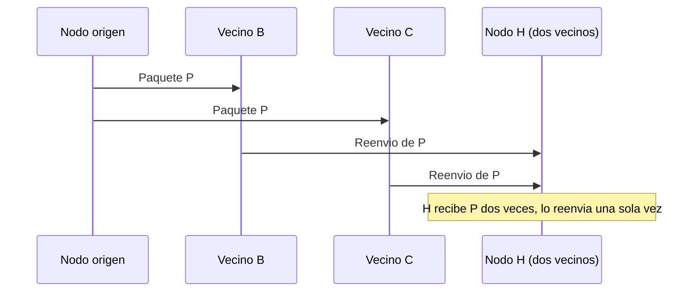
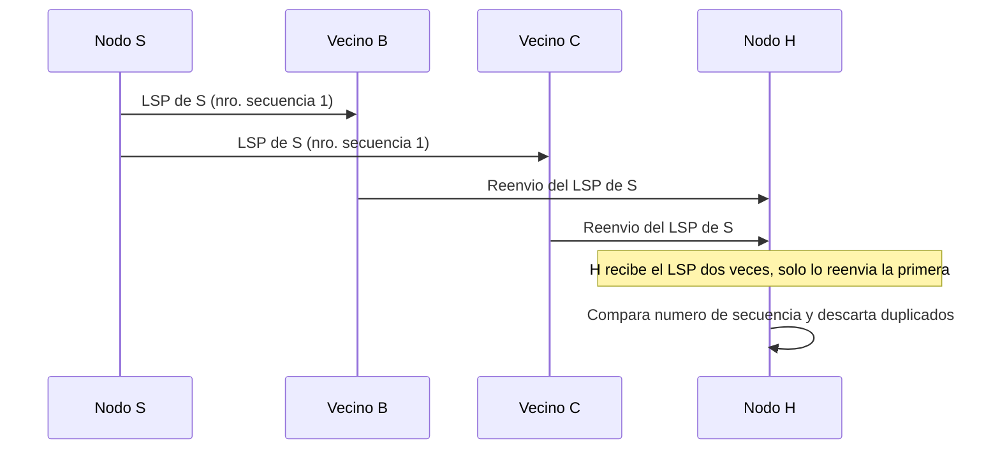

El nivel de red decide, para cada paquete, qué camino sigue desde su origen hasta su
destino a través de una sucesión de nodos intermedios. Este capítulo presenta las tablas
que soportan esa decisión y los dos algoritmos distribuidos con los que los nodos de una
red construyen esas tablas de forma automática: el vector distancia y el estado del
enlace. Ambos algoritmos calculan rutas de coste mínimo sin que ningún nodo disponga por
adelantado de un mapa completo de la red, y difieren en qué información comparten los
nodos entre sí y en cómo reaccionan ante un cambio de topología.

## Introducción

Un paquete que viaja de un origen a un destino puede seguir caminos alternativos, y
elegir uno de ellos es la función del **encaminamiento** (`routing`). El
[nivel de red](../01_arquitectura/section_1_capas_y_encapsulado.md#nivel-de-red) es
responsable de esta decisión, que se apoya en dos operaciones distintas aunque
relacionadas. El **encaminamiento** en sentido estricto es la actualización de las
tablas que guían esa decisión, ya sea de forma manual o mediante un algoritmo
distribuido. El **envío** (`forwarding`) es la acción concreta de poner un paquete en
ruta hacia su destino: cuando un nodo intermedio recibe un paquete, consulta su tabla de
encaminamiento para determinar por qué enlace debe reenviarlo, tal como se describe para
el datagrama IP en
[protocolo IP y direccionamiento](../02_ip/section_1_protocolo_ip_y_direccionamiento.md#recorrido-de-un-datagrama-entre-dos-redes).
Este capítulo se ocupa de la primera operación: cómo se construye y se mantiene
actualizada la tabla que la segunda consulta.

Un buen protocolo de encaminamiento debe ser correcto, en el sentido de que encuentra
siempre una ruta válida al destino; simple, con una carga computacional y de tráfico de
control reducida; robusto frente a fallos de la red y cambios de tráfico; estable, de
modo que la búsqueda de rutas converja a un resultado fijo; y en la medida de lo
posible, óptimo, encontrando la mejor ruta según el criterio que se haya fijado. Qué
criterio define la mejor ruta depende de la red: el número de saltos, el retardo, el
ancho de banda disponible o el nivel de tráfico son magnitudes candidatas, y el
resultado de aplicar cualquiera de ellas se agrupa bajo el nombre de coste de una ruta.

## Reenvío y encaminamiento

### Tabla de encaminamiento

Una **tabla de encaminamiento** es la base de datos que cada nodo intermedio consulta
para decidir por qué enlace reenviar un paquete, en función de su dirección de destino.
Puede almacenar la ruta completa hasta cada destino, o bien limitarse a indicar el
siguiente salto (_next-hop_), es decir, solo el nodo vecino inmediato por el que debe
salir el paquete para acercarse a su destino, dejando que cada nodo intermedio posterior
tome su propia decisión de forma independiente. El esquema de _next-hop_ es el habitual
en las redes de conmutación de paquetes, porque reduce drásticamente el tamaño de la
tabla frente a almacenar la ruta completa a cada destino.

Dentro del esquema de _next-hop_, una entrada de la tabla puede identificar al destino
con distinto grado de detalle. Una entrada específica de equipo (_host-specific_)
reserva una fila para cada terminal individual de la red, lo que produce tablas muy
grandes. Una entrada específica de red (_network-specific_) agrupa a todos los equipos
de una misma red bajo una sola fila, con un enorme ahorro de memoria frente al esquema
anterior. Una entrada por defecto (_default_) cubre cualquier destino que no coincida
con ninguna de las entradas anteriores, y evita tener que enumerar de forma explícita
todas las redes posibles.

### Rutas estáticas y rutas dinámicas

Las entradas de una tabla de encaminamiento pueden mantenerse de dos formas. Con **rutas
estáticas**, el administrador de la red introduce y modifica cada entrada de forma
manual. Esta opción resulta adecuada en redes pequeñas y con pocos cambios de topología,
porque no genera tráfico de control adicional, pero no se adapta por sí misma a un fallo
de un enlace o a la incorporación de una red nueva. Con **rutas dinámicas**, las
entradas se actualizan de forma periódica y automática a partir de la información que
intercambian entre sí los nodos de la red mediante un protocolo de encaminamiento, lo
que permite reaccionar a los cambios de topología sin intervención humana, a costa de
introducir tráfico de control y una carga de cómputo adicional en cada nodo.

### Ruta por defecto

La **ruta por defecto** es la entrada de la tabla de encaminamiento que se emplea cuando
la dirección de destino de un paquete no coincide con ninguna de las entradas más
específicas presentes en la tabla. Resulta especialmente útil en un nodo que solo tiene
una salida hacia el resto de la red, como el encaminador de un usuario doméstico frente
a Internet: en lugar de mantener una entrada para cada red posible a la que podría
llegar, basta una única entrada por defecto que reenvía cualquier destino no reconocido
hacia esa salida.

## Encaminamiento orientado a conexión y sin conexión

La forma en que un nodo toma sus decisiones de encaminamiento depende de si la red
ofrece un servicio orientado a conexión o sin conexión, la misma distinción que se
introduce para el nivel de red en general en
[arquitectura en capas y encapsulado](../01_arquitectura/section_1_capas_y_encapsulado.md#servicio-orientado-a-conexion-y-sin-conexion).
En una red orientada a conexión, la ruta se selecciona una única vez, durante el
establecimiento de un circuito virtual, y todos los paquetes de esa conexión la siguen
sin excepción: cada nodo intermedio mantiene una tabla que relaciona el identificador de
circuito virtual de entrada con el de salida, sin necesidad de examinar la dirección de
destino en cada paquete. En una red sin conexión, o de datagramas, cada paquete
transporta su propia dirección de destino y se reenvía de forma completamente
independiente de los demás paquetes de la misma comunicación, de modo que paquetes
distintos pueden llegar a seguir rutas distintas hacia el mismo destino final.

Una segunda distinción, ortogonal a la anterior, es quién toma la decisión de
encaminamiento. En el encaminamiento salto a salto, comparable al servicio postal, el
origen solo especifica el destino final y cada nodo intermedio decide de forma
independiente el siguiente salto según su propia tabla. En el encaminamiento en origen
(_source routing_), comparable a una ruta aérea con escalas fijadas de antemano, el
origen decide la ruta completa y los nodos intermedios se limitan a reenviar el paquete
siguiendo esa decisión sin margen de elección propio.

## Inundación

La **inundación** (_flooding_) es el mecanismo de distribución más simple entre los que
emplean los protocolos de encaminamiento dinámico: cuando un nodo recibe un paquete que
no va dirigido a él, lo retransmite por todos sus enlaces salientes salvo por aquel del
que lo recibió. No exige que el nodo disponga de ninguna información de encaminamiento
previa, lo que lo hace extremadamente sencillo de implementar, pero sobrecarga la red
con copias redundantes del mismo paquete si no se limita de alguna manera su
propagación.

### Control de duplicados con números de secuencia

Para evitar que un paquete circule indefinidamente por la red, la inundación se combina
con dos mecanismos de control. Cada paquete incorpora un número de secuencia que se
incrementa cada vez que su nodo origen genera una versión nueva: cualquier nodo que
reciba un paquete con un número de secuencia menor o igual que el último que ya almacenó
de ese mismo origen lo descarta, porque se trata de un duplicado. Cada paquete incorpora
además un campo de edad que se decrementa en cada nodo que lo retransmite, y que provoca
su descarte definitivo al llegar a cero, lo que garantiza que ningún paquete permanece
circulando de forma perpetua incluso ante un fallo del mecanismo de control de
duplicados.

## Encaminamiento por vector distancia

La idea general del **encaminamiento por vector distancia** es que cada nodo informa a
sus vecinos directos de lo que le cuesta llegar a todos los destinos de la red. Cada
nodo mantiene un vector con una posición por cada destino posible, que almacena el coste
mínimo conocido desde ese nodo hasta cada uno de ellos, junto con el vecino que
constituye el siguiente salto de esa ruta. Ningún nodo necesita conocer la topología
completa de la red: le basta con conocer a sus vecinos directos, el coste estimado de
los enlaces que lo unen a ellos y el vector distancia que cada uno de esos vecinos le
transmite periódicamente.

El procedimiento de arranque es el mismo en todos los nodos. A cada uno se le asigna un
identificador, se fija el coste de cada uno de sus enlaces salientes, y su vector
distancia se inicializa con un valor de 0 para sí mismo y de infinito para todos los
demás destinos, puesto que todavía no conoce ninguna ruta hacia ellos. A partir de ese
momento, cada nodo envía su vector distancia a sus vecinos siempre que la información
cambia, y también al activarse o de forma periódica, y recalcula su propio vector cada
vez que recibe un vector distinto de un vecino o detecta que un enlace ha fallado.

### Intercambio de vectores con los vecinos

El intercambio de vectores se repite continuamente mientras la red está en
funcionamiento, de modo que la información se propaga por la red salto a salto. Si la
ruta óptima entre dos nodos distantes atraviesa varios nodos intermedios, cada uno de
esos nodos debe primero recibir el vector distancia del nodo situado un salto más cerca
del destino antes de poder calcular su propio coste correcto, lo que explica por qué el
algoritmo necesita varias rondas de intercambio antes de estabilizarse. Cada ruta hacia
un destino concreto se calcula de forma completamente independiente de las rutas hacia
los demás destinos.

### Algoritmo de Bellman-Ford

El cálculo del vector distancia en cada iteración aplica el **algoritmo de
Bellman-Ford**: el coste de un nodo hasta un destino determinado es el mínimo, entre
todos los vecinos directos de ese nodo, de la suma del coste del enlace hasta ese vecino
más el coste que ese vecino tenía, en la iteración anterior, hasta el mismo destino. El
algoritmo puede aplicarse de dos formas equivalentes, según qué información se toma como
punto de partida.

Cuando el nodo que ejecuta el algoritmo conoce la topología completa de la red, la
fórmula se aplica sumando directamente el coste de cada enlace de entrada a un destino
al coste, en la iteración anterior, del nodo origen de ese enlace, considerando todos
los enlaces de entrada posibles a cada destino. Cuando el nodo no conoce la topología y
solo dispone de sus enlaces directos y de los vectores distancia que le envían sus
vecinos, la fórmula se simplifica: como el número de rutas posibles hacia cualquier
destino coincide con el número de vecinos directos del nodo, basta sumar el coste del
enlace a cada vecino con el valor que ese vecino tenía para ese destino en su último
vector distancia recibido, y tomar el mínimo de esas sumas. Ambos modos de aplicación
convergen al mismo resultado final, porque calculan la misma cantidad a partir de la
misma información, presentada de dos formas distintas.

???+ example "Convergencia del vector distancia de un nodo con topología conocida"

    Sea una red de cinco nodos, S, A, B, C y D, con los siguientes enlaces
    unidireccionales y sus costes: S-A de coste 10, S-B de coste 5, A-B de coste 2,
    A-C de coste 1, B-A de coste 3, B-C de coste 9, B-D de coste 2, C-D de coste 4 y
    D-C de coste 6. El nodo S conoce la topología completa y aplica Bellman-Ford para
    calcular su propio vector distancia hacia los cuatro destinos restantes.

    El vector distancia se inicializa a $d_0 = [D_S, D_A, D_B, D_C, D_D] = [0, \infty,
    \infty, \infty, \infty]$, puesto que S no conoce todavía ninguna ruta a los demás
    nodos.

    En la primera iteración, S solo puede alcanzar a sus vecinos directos, A y B: $D_A =
    \min(10 + 0) = 10$ y $D_B = \min(5 + 0) = 5$. Los destinos C y D permanecen a
    infinito, porque ningún enlace de entrada a ellos parte todavía de un nodo con coste
    conocido. El resultado es $d_1 = [0, 10, 5, \infty, \infty]$.

    En la segunda iteración, ya se conocen los costes de A y B, de modo que se puede
    alcanzar C a través de A, con coste $1 + 10 = 11$, y D a través de B, con coste
    $2 + 5 = 7$. Además, se recalcula el coste a A: la ruta directa S-A cuesta 10,
    frente a la ruta S-B-A, que suma el coste del enlace B-A, que vale 3, al coste ya
    conocido de S a B, $3 + 5 = 8$, una ruta mejor que la directa. El vector resultante
    es $d_2 = [0, 8, 5, 11, 7]$.

    En la tercera iteración se recalcula C, para el que ahora existe también la ruta
    S-D-C, con coste $6 + 7 = 13$, frente a la ruta directa a través de A, con coste
    $1 + 8 = 9$, que sigue siendo la mejor. El vector resultante es $d_3 = [0, 8, 5, 9,
    7]$.

    En la cuarta iteración se repiten los mismos cálculos con los valores de $d_3$ y no
    se encuentra ninguna ruta mejor que las ya conocidas, de modo que $d_4 = d_3$ y el
    algoritmo llega a su fin. El vector distancia final de S es $[0, 8, 5, 9, 7]$, con
    siguiente salto hacia B en las rutas a A, B y D, y hacia A en la ruta a C.

    Aplicando Bellman-Ford sin conocer la topología completa, en el que S solo dispone
    del coste de sus dos enlaces directos, 10 hacia A y 5 hacia B, y de los vectores
    distancia completos que le envían A y B, se llega exactamente al mismo resultado
    final, porque ambas formulaciones calculan la misma magnitud a partir de la misma
    información disponible en la red, solo que organizada de otra manera.

### Convergencia y cuenta a infinito

Después de un cambio de topología, la velocidad con la que el protocolo se adapta a la
nueva situación se denomina velocidad de convergencia, y en el vector distancia puede
ser muy lenta. El problema más conocido es la **cuenta a infinito**: cuando un enlace
falla, el nodo que lo detecta puede llegar a adoptar una ruta alternativa peor, a través
de un vecino que en realidad dependía de la propia ruta que ha fallado, sin que ninguno
de los dos se dé cuenta de que están recalculando su coste mutuamente a partir de
información obsoleta.

???+ example "Cuenta a infinito tras la caída de un enlace en una topología lineal"

    Sea una topología lineal de tres nodos, A, B y C, con enlaces de coste 1 entre A y
    B y entre B y C. El destino de interés es C. Antes de cualquier fallo, los costes
    convergidos hacia C son: A a distancia 2 (a través de B), B a distancia 1 (enlace
    directo) y C a distancia 0.

    El enlace B-C falla. B descarta el vector que tenía de C, pero no concluye que C es
    inalcanzable: en su lugar, recalcula su coste a través de su único vecino restante,
    A, cuyo último vector distancia anunciaba un coste de 2 hacia C. B calcula entonces
    $1 + 2 = 3$ y difunde ese nuevo coste a A.

    A recibe el nuevo vector de B y recalcula su propio coste hacia C a través de B,
    obteniendo $1 + 3 = 4$, que a su vez difunde de vuelta a B. B recalcula de nuevo,
    obtiene $1 + 4 = 5$, y lo anuncia a A. El proceso se repite indefinidamente,
    incrementando el coste anunciado en una unidad en cada ronda, sin que ninguno de
    los dos nodos descubra realmente que C ya no es alcanzable. El nombre de cuenta a
    infinito describe precisamente esta escalada sin límite superior natural.

El primer remedio histórico frente a este problema fue un tiempo de espera (_hold-down
time_) tras la caída de un enlace, durante el cual se anuncia un coste infinito hacia el
nodo afectado antes de aceptar cualquier ruta alternativa. Su eficacia depende de que la
noticia del fallo llegue a todos los nodos de la red antes de que expire ese tiempo, y
el propio valor del tiempo de espera es arbitrario: demasiado corto no evita el
problema, demasiado largo ralentiza aún más la convergencia.

Un segundo remedio, más costoso pero que elimina el problema por completo, consiste en
anunciar la ruta completa hacia cada destino en lugar de solo su coste, lo que permite a
cualquier nodo detectar y rechazar de inmediato una ruta que pasaría dos o más veces por
el mismo nodo.

El remedio más extendido es el horizonte dividido (_split horizon_): un nodo nunca
anuncia a un vecino una ruta hacia un destino si esa misma ruta depende de pasar
precisamente por ese vecino, porque ese vecino nunca la usaría de todos modos. En la
práctica, el nodo anuncia un coste infinito hacia ese destino en su lugar.

???+ example "Horizonte dividido con una ruta alternativa disponible"

    Retomando la topología lineal A-B-C con el destino C, el horizonte dividido añade
    la siguiente regla: como A alcanza C a través de B, A nunca anuncia a B su coste
    hacia C, sino que le anuncia infinito. Cuando el enlace B-C falla, B no dispone de
    ninguna ruta alternativa útil, porque la única información que tiene de A hacia C
    es infinito, y concluye correctamente que C es inalcanzable, evitando por completo
    la cuenta a infinito de la topología puramente lineal.

    Considérese ahora una topología algo más rica, con un cuarto nodo D conectado
    tanto a A como a C mediante enlaces de coste 7 en ambos casos, además de los
    enlaces A-B y B-C de coste 1. Por la misma regla de horizonte dividido, A tampoco
    anuncia a B su coste hacia C, de modo que cuando el enlace B-C falla, B concluye de
    nuevo que C es inalcanzable y así lo anuncia a A.

    D, que no ha sufrido ningún fallo, sigue anunciando su coste de 7 hacia C a sus
    vecinos, entre ellos A. A recibe ese anuncio y concluye que su mejor ruta hacia C es
    ahora a través de D, con coste $7 + 7 = 14$. A continuación, A anuncia ese nuevo
    coste a B, que concluye que su mejor ruta hacia C es a través de A, con coste
    $1 + 14 = 15$. En este caso el horizonte dividido no elimina la reconvergencia, pero
    sí evita que los costes escalen sin límite: ambos nodos alcanzan un valor final
    estable en dos rondas, apoyándose en la información fresca que aporta D.

El horizonte dividido resuelve el problema en topologías donde la única alternativa tras
un fallo pasa necesariamente por el mismo enlace caído, pero no lo resuelve en todos los
casos posibles cuando existen varias rutas alternativas independientes: sigue siendo un
remedio parcial, no una garantía general de convergencia rápida.

## Encaminamiento por estado del enlace

La idea general del **encaminamiento por estado del enlace** es la inversa de la del
vector distancia: en lugar de que cada nodo informe a sus vecinos de lo que le cuesta
llegar a todo el mundo, cada nodo informa a todo el mundo de lo que le cuesta llegar a
sus propios vecinos. El resultado es que, transcurrido un cierto tiempo, todos los nodos
de la red disponen de la misma información completa sobre la topología, y cada uno
calcula de forma independiente sus propias rutas óptimas a partir de ella.

El procedimiento consta de cuatro fases. Cada nodo descubre primero a sus vecinos
directos. A continuación construye un paquete de estado del enlace (Link State Packet,
`LSP`) que enumera esos vecinos junto con el coste del enlace hacia cada uno. Ese
paquete se difunde después a todos los nodos de la red, de modo que cada uno termina
almacenando el `LSP` más reciente de cada uno de los demás nodos. Por último, cada nodo,
que ya dispone así de la topología completa, calcula sus propias rutas mediante el
algoritmo de Dijkstra.

### Descubrimiento de vecinos

Un nodo descubre a sus vecinos directos enviando periódicamente un paquete especial de
saludo (`HELLO`) por cada uno de sus enlaces de salida. El nodo situado en el otro
extremo del enlace responde con un paquete de eco (`ECHO`) que lo identifica. El coste
del enlace se estima a partir del tiempo transcurrido entre el envío del `HELLO` y la
recepción del `ECHO`, dividido entre dos, lo que además permite que la estimación
refleje la carga real del enlace en el momento de la medición, no solo sus
características físicas. El mismo intercambio de `HELLO` permite detectar la caída de un
vecino: si transcurre un tiempo determinado sin recibir respuesta, el nodo concluye que
ese vecino, o el enlace que lo une a él, ha dejado de estar operativo.

### Difusión del estado de los enlaces

Un nodo difunde un nuevo `LSP` cuando aparece un vecino nuevo, cuando el coste hacia un
vecino existente cambia, o cuando un vecino deja de estar activo. La difusión se realiza
mediante inundación, con los mismos mecanismos de control de duplicados y de campo de
edad descritos para ese procedimiento. El `LSP` de cada nodo incluye, además de la lista
de vecinos y sus costes, un identificador del nodo emisor y un número de secuencia, que
permite a cualquier receptor determinar si el paquete que acaba de recibir es más
reciente que el que ya tenía almacenado de ese mismo emisor. La longitud de un `LSP` no
es uniforme entre los nodos de la red, a diferencia del vector distancia: depende
directamente del número de vecinos que tenga cada nodo, mientras que todos los vectores
distancia de una misma red comparten siempre la misma longitud, igual al número total de
nodos.

### Algoritmo de Dijkstra

El **algoritmo de Dijkstra**, publicado en 1959, calcula el árbol de rutas de coste
mínimo desde un nodo raíz hacia todos los demás nodos de la red, a partir de la
topología completa que ese nodo ya conoce gracias a los `LSP` recibidos. El algoritmo se
apoya en dos listas auxiliares. La lista `PATH` contiene los nodos para los que ya se
conoce la ruta óptima definitiva desde el nodo raíz. La lista `TENT` contiene los nodos
para los que ya se conoce alguna ruta, sin que se sepa todavía si es la de menor coste
posible. El algoritmo añade el nodo raíz a `PATH` con coste 0, y repite el siguiente
paso hasta que `TENT` queda vacía: se elige de `TENT` el nodo con menor coste acumulado,
se traslada a `PATH`, y se examinan sus vecinos que no estén ya en `PATH`, añadiéndolos
o actualizándolos en `TENT` con el coste acumulado hasta ellos a través del nodo recién
consolidado, cuando ese coste mejora al que ya tuvieran. Al finalizar, la ruta de cada
nodo en `PATH` queda determinada por el vecino a través del cual se consolidó su coste
mínimo, que es precisamente el siguiente salto que se traslada a la tabla de
encaminamiento final.

???+ example "Cálculo del árbol de encaminamiento de un nodo mediante Dijkstra"

    Sea una red de cinco encaminadores, R1 a R5, con los siguientes enlaces
    bidireccionales: R1-R2 de coste 2, R1-R3 de coste 5, R2-R3 de coste 1, R2-R4 de
    coste 3, R3-R4 de coste 2, R3-R5 de coste 4 y R4-R5 de coste 1. R1 ha recibido ya
    los `LSP` de los cinco nodos y ejecuta Dijkstra tomándose a sí mismo como raíz.

    | Paso | Nodo elegido | Coste acumulado | A través de | `PATH`             | `TENT`         |
    | ---- | ------------ | ---------------- | ------------ | ------------------- | -------------- |
    | 1    | R1           | 0                | —            | R1                  | R2(2), R3(5)   |
    | 2    | R2           | 2                | R1           | R1, R2              | R3(3), R4(5)   |
    | 3    | R3           | 3                | R2           | R1, R2, R3          | R4(5), R5(7)   |
    | 4    | R4           | 5                | R2           | R1, R2, R3, R4      | R5(6)          |
    | 5    | R5           | 6                | R4           | R1, R2, R3, R4, R5  | —              |

    En el paso 2 se elige R2 frente a R3 porque su coste acumulado, 2, es menor que el
    de R3, 5. Al consolidar R2 se descubre una ruta a R3 de coste $2 + 1 = 3$, mejor que
    la ruta directa R1-R3 de coste 5, de modo que el valor de R3 en `TENT` se actualiza a
    3 y su ruta pasa a discurrir por R2. Del mismo modo, al consolidar R3 en el paso 3
    se descubre una ruta a R4 de coste $3 + 2 = 5$, igual a la que ya ofrecía R2 con
    coste $2 + 3 = 5$: al empatar el coste, cualquiera de las dos rutas es igualmente
    válida y R4 conserva el salto por R2 ya registrado. En el paso 4, al consolidar R4
    con coste 5, aparece una ruta a R5 de coste $5 + 1 = 6$, mejor que la ruta directa
    R3-R5 de coste $3 + 4 = 7$ descubierta en el paso 3, de modo que R5 actualiza su
    coste a 6 y su siguiente salto pasa a ser R4.

    La tabla de encaminamiento resultante de R1, expresada como siguiente salto, es la
    siguiente:

    | Destino | Coste | Siguiente salto |
    | ------- | ----- | ----------------- |
    | R2      | 2     | R2                |
    | R3      | 3     | R2                |
    | R4      | 5     | R2                |
    | R5      | 6     | R2                |

    Todas las rutas de R1 salen por el mismo primer salto, R2, porque en esta topología
    R2 resulta ser el punto de paso más económico hacia el resto de la red, aunque cada
    ruta acumule después un coste distinto según el número de saltos adicionales que
    recorre a partir de R2.

## Comparación entre ambas familias

Ambos algoritmos comparten un requerimiento de memoria del mismo orden, proporcional al
producto del número de nodos por el número medio de vecinos de cada nodo, aunque
distribuido de forma distinta: el vector distancia necesita, en cada nodo, un vector de
longitud igual al número total de nodos por cada uno de sus vecinos, mientras que el
estado del enlace necesita, en cada nodo, un `LSP` de longitud igual al número de
vecinos por cada uno de los nodos de la red. El tiempo de cómputo de Bellman-Ford es
proporcional al número de enlaces de la red, y el de Dijkstra lo es también salvo por un
factor logarítmico adicional derivado de la búsqueda del nodo de menor coste en `TENT`.
Ambos algoritmos comparten además una robustez débil frente a nodos que no siguen las
reglas del protocolo, sea por error o de forma intencionada, porque ambos se basan en la
confianza mutua entre nodos.

Las dos familias difieren, en cambio, en la facilidad con la que un nodo puede conocer
la topología completa de la red: en estado del enlace basta consultar la información
almacenada en un único nodo, porque cada uno guarda los `LSP` de todos los demás,
mientras que en vector distancia sería necesario consultar a todos los nodos uno por
uno, porque cada uno solo conoce sus propios enlaces directos. Esa diferencia hace que
el estado del enlace resulte más sencillo de depurar ante un fallo y más adecuado para
un encaminamiento en origen, que exige conocer la ruta completa por adelantado. La
diferencia más determinante en la práctica es la velocidad de convergencia: el vector
distancia puede sufrir el problema de la cuenta a infinito descrito más arriba, mientras
que el estado del enlace converge en general con mayor rapidez, porque cada nodo calcula
sus rutas directamente a partir de una topología completa y actualizada, sin depender de
sucesivas rondas de recálculo entre vecinos.

## Encaminamiento jerárquico

### División en regiones

A medida que una red crece, las tablas de encaminamiento se alargan, el tiempo de
cálculo de las rutas óptimas aumenta y el ancho de banda consumido por el tráfico de
control crece en la misma proporción. El **encaminamiento jerárquico** contiene ese
crecimiento dividiendo la red en regiones y empleando direcciones jerárquicas, en las
que una parte de la dirección identifica la región y otra distingue al destino concreto
dentro de ella, de forma análoga a como una dirección postal identifica primero una
ciudad y después una calle dentro de esa ciudad. Dentro de cada región, los nodos solo
necesitan conocer las rutas detalladas hacia los destinos de su propia región, y tratan
el resto de regiones como un único destino agregado, lo que reduce drásticamente el
número de entradas de sus tablas de encaminamiento a cambio de que algunas rutas
resulten algo más largas de lo que serían con un conocimiento completo y sin agregar de
toda la red.

### Encaminadores internos y de columna vertebral

Dentro de un esquema de encaminamiento jerárquico de dos niveles se distinguen dos
clases de encaminador. El **encaminador interno** solo enruta paquetes dentro de su
propia región, y no necesita conocer nada de la topología de las demás regiones. El
**encaminador de columna vertebral** (_backbone_) conecta varias regiones entre sí y es
responsable del encaminamiento entre ellas: cualquier paquete que deba cruzar de una
región a otra pasa necesariamente por la columna vertebral. Cuando un nodo interno
necesita enviar un paquete a un destino situado en otra región, no necesita conocer el
coste exacto hasta ese destino final, sino únicamente el coste hasta el punto de salida
de su propia región, quedando el resto del trayecto a cargo de la columna vertebral.

Cuando las redes alcanzan un tamaño muy grande, esta misma idea de división en regiones
se aplica organizando la red en dominios administrativos independientes, cada uno bajo
una autoridad propia, con un protocolo de encaminamiento interior dentro del dominio y
un protocolo de encaminamiento exterior entre dominios distintos. Ambas familias de
algoritmo presentadas en este capítulo tienen representantes desplegados en Internet
siguiendo exactamente esta separación: un protocolo interior basado en estado del enlace
y un protocolo exterior basado en vector distancia, cuyos mensajes y atributos concretos
quedan fuera del alcance de estos fundamentos algorítmicos.
