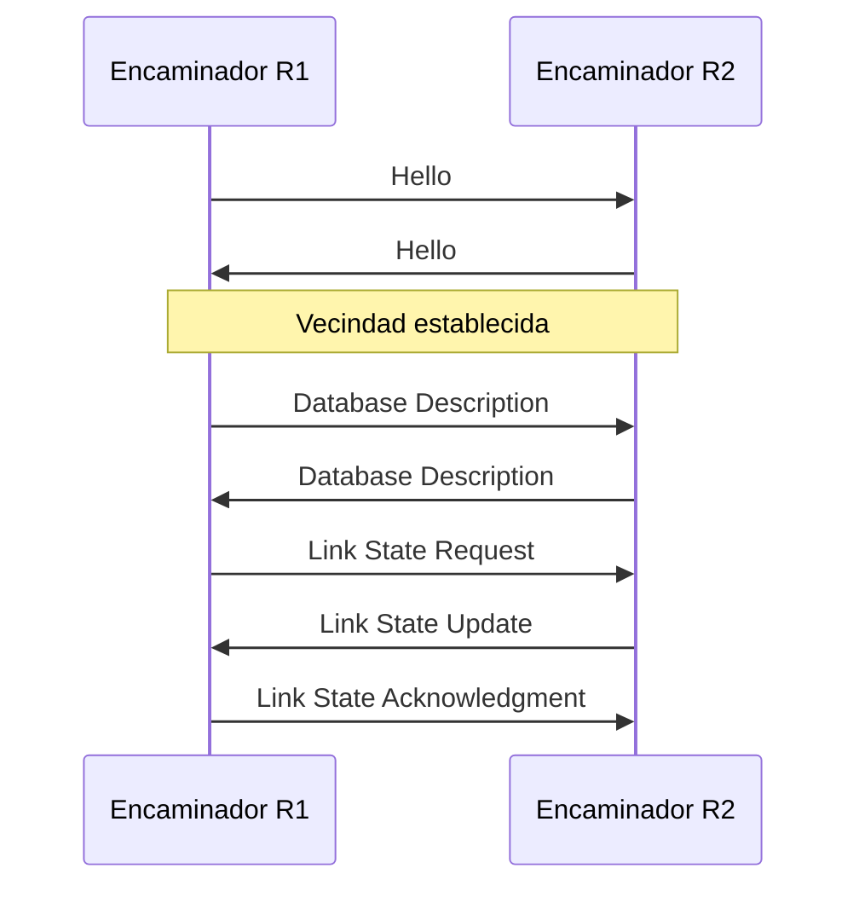
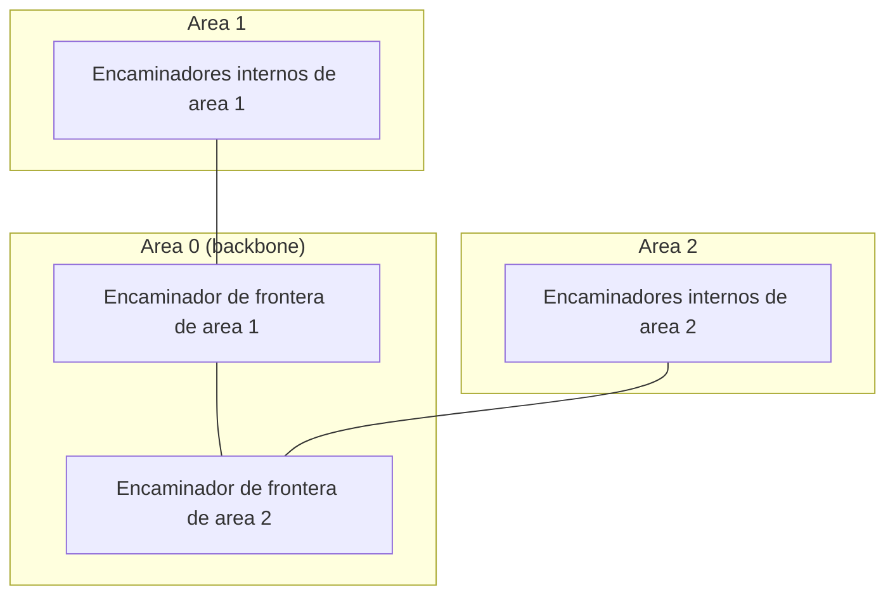
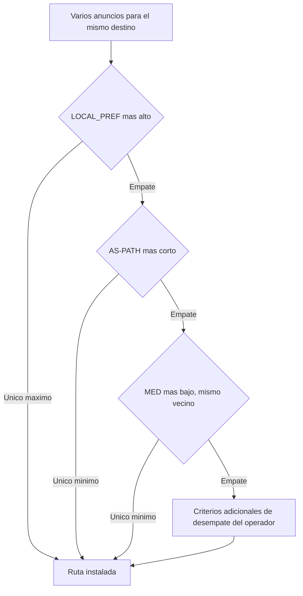

Los algoritmos de vector distancia y de estado del enlace describen cómo un encaminador
puede calcular, en abstracto, la ruta de menor coste hacia cualquier destino. Ningún
operador de red ejecuta esos algoritmos en su forma pura: los despliega dentro de un
protocolo concreto que añade formatos de mensaje, temporizadores, mecanismos de
descubrimiento de vecinos y reglas de decisión adicionales que el algoritmo por sí solo
no especifica. Este capítulo describe los dos protocolos de encaminamiento que dominan
el despliegue real de Internet: OSPF, que aplica estado del enlace dentro de una red
bajo una misma administración, y BGP, que aplica una variante de vector distancia entre
redes administradas de forma independiente.

## Introducción

Ambos protocolos toman como base uno de los dos algoritmos ya estudiados, pero difieren
en el alcance en el que operan y en la información que intercambian. OSPF ejecuta el
algoritmo de estado del enlace dentro de una única red bajo control administrativo
único, donde todos los encaminadores confían entre sí y comparten el objetivo de
minimizar un coste común. BGP, en cambio, opera entre redes que pertenecen a
administradores distintos y que no comparten necesariamente ese objetivo: cada red
aplica sus propias políticas comerciales y de seguridad, de modo que la decisión de qué
ruta usar no puede depender únicamente de un coste numérico. Esa diferencia de contexto
explica por qué BGP no se limita a propagar costes, como haría un vector distancia
clásico, sino que propaga el camino completo y un conjunto de atributos configurables.

## Protocolos interiores y exteriores

Un **protocolo de encaminamiento interior**, o IGP por sus siglas en inglés, calcula
rutas dentro de un mismo dominio administrativo y permite el intercambio de información
entre los nodos de ese dominio sin intervención humana. RIP y OSPF son ejemplos de IGP.
Un **protocolo de encaminamiento exterior**, o EGP, distribuye rutas entre dominios
administrativos distintos y permite que cada encaminador de frontera seleccione la mejor
salida hacia el resto de Internet. BGP es, en la práctica, el único EGP desplegado.
Ambas familias de protocolos cooperan: un IGP resuelve el encaminamiento dentro de un
dominio y BGP decide cómo ese dominio se conecta con los demás, de modo que un paquete
que atraviesa varios dominios administrativos combina ambos tipos de decisión a lo largo
de su camino.

El dominio administrativo sobre el que corre un EGP recibe el nombre de sistema
autónomo, la unidad sobre la que BGP toma sus decisiones de encaminamiento exterior. Los
acuerdos comerciales y de interconexión entre sistemas autónomos distintos no son objeto
de este capítulo.

## OSPF

**OSPF**, u Open Shortest Path First, es el protocolo de encaminamiento interior por
estado del enlace más extendido. Detecta los cambios de topología y se adapta con
rapidez a nuevas rutas libres de bucles, admite distintas métricas configurables y
permite repartir la carga de tráfico entre varias rutas de coste equivalente.

### Métricas y coste de interfaz

El coste que OSPF asocia a una ruta no es el número de saltos, como en un vector
distancia elemental, sino un valor por interfaz que el protocolo deriva del ancho de
banda de esa interfaz: cuanto mayor es el ancho de banda disponible, menor es el coste
que se le asigna. La fórmula habitual es el cociente entre un ancho de banda de
referencia, fijado por configuración, y el ancho de banda real de la interfaz, con el
resultado redondeado a un entero y con un coste mínimo de una unidad. El coste total de
una ruta es la suma de los costes de todas las interfaces de salida que atraviesa,
calculado por el algoritmo de estado del enlace ya conocido sobre ese grafo de costes.

???+ example "Coste de dos caminos alternativos hacia el mismo destino"

    Una red fija un ancho de banda de referencia de 100 Mbit/s para el cálculo de
    coste de sus interfaces OSPF. Un encaminador dispone de dos caminos hacia el mismo
    destino. El primero atraviesa dos enlaces de 100 Mbit/s y 10 Mbit/s. El segundo
    atraviesa dos enlaces de 1 Gbit/s cada uno. Se pide el coste de cada camino y cuál
    de los dos instala OSPF en la tabla de encaminamiento.

    El coste de cada interfaz es el ancho de banda de referencia dividido entre el
    ancho de banda de la interfaz, con un mínimo de 1. Para el primer camino, el
    enlace de 100 Mbit/s tiene coste $100/100 = 1$ y el de 10 Mbit/s tiene coste
    $100/10 = 10$, de modo que el coste total del camino es $1 + 10 = 11$. Para el
    segundo camino, cada enlace de 1 Gbit/s tiene un cociente $100/1000 = 0{,}1$, que
    se redondea al mínimo permitido de 1, de modo que el coste total del camino es
    $1 + 1 = 2$. Como el segundo camino tiene menor coste acumulado, OSPF lo instala
    en la tabla de encaminamiento y descarta el primero, aunque ambos tengan el mismo
    número de saltos.

### Tipos de mensaje

OSPF intercambia cinco tipos de mensaje entre encaminadores vecinos.

| Mensaje                     | Función                                                                                                                                                                             |
| --------------------------- | ----------------------------------------------------------------------------------------------------------------------------------------------------------------------------------- |
| `Hello`                     | Descubre a los vecinos y mantiene viva la relación de vecindad ya establecida.                                                                                                      |
| `Database Description`      | Anuncia los números de secuencia de las entradas que el emisor tiene en su base de datos de estado del enlace, para que el receptor sepa quién dispone de información más reciente. |
| `Link State Request`        | Solicita a un vecino las entradas concretas de su base de datos que están más actualizadas que las propias.                                                                         |
| `Link State Update`         | Difunde por inundación el coste de los enlaces del emisor hacia sus vecinos.                                                                                                        |
| `Link State Acknowledgment` | Confirma que un mensaje `Link State Update` ha llegado correctamente.                                                                                                               |

### Descubrimiento de vecinos y sincronización de bases de datos

Cada encaminador envía mensajes `Hello` de forma periódica por cada uno de sus enlaces
de salida, con un intervalo configurable que suele fijarse en 10 segundos en redes de
difusión. Al mismo tiempo, vigila cuánto tiempo transcurre desde el último `Hello`
recibido de cada vecino, con un temporizador de caducidad que suele fijarse en cuatro
veces el intervalo de `Hello`, de modo habitual 40 segundos; si ese plazo se agota sin
recibir un nuevo `Hello`, el encaminador considera caído el enlace o el vecino
correspondiente y adapta su base de datos en consecuencia.

Cuando dos vecinos recién descubiertos necesitan igualar el contenido de su base de
datos de estado del enlace, intercambian mensajes `Database Description` con los números
de secuencia de lo que cada uno posee. Si un encaminador detecta que su vecino tiene
información más reciente que la propia, le envía un `Link State Request` pidiendo esa
información concreta, y el vecino responde con un `Link State Update` que contiene el
contenido solicitado. Este intercambio es especialmente útil cuando un encaminador se
activa con la base de datos vacía y necesita ponerse al día con rapidez a partir de sus
vecinos, que se asumen ya sincronizados con el resto de la red.

### Cálculo de rutas y reparto de carga

Una vez sincronizada la base de datos de estado del enlace, cada encaminador aplica el
algoritmo de estado del enlace ya conocido sobre el grafo completo de costes de interfaz
para obtener su propio árbol de caminos más cortos. Cuando existen varias rutas de coste
idéntico hacia el mismo destino, OSPF puede repartir el tráfico entre todas ellas en vez
de descartar las alternativas, lo que mejora el aprovechamiento de la capacidad
disponible frente a un esquema que solo usa la ruta única de menor coste.

En redes de gran tamaño, ejecutar el algoritmo de estado del enlace sobre la topología
completa resulta costoso y hace que cualquier cambio local obligue a recalcular rutas en
toda la red. OSPF resuelve esto dividiendo la red en **áreas**: un conjunto de
encaminadores internos que solo conocen la topología detallada de su propia área, y un
conjunto de encaminadores de frontera de área que resumen esa topología antes de
anunciarla al resto de la red a través de un área troncal o backbone, a la que todas las
demás áreas deben conectarse. Con esta jerarquía, un cambio de topología dentro de un
área solo obliga a reinundar mensajes `Link State Update` y a recalcular rutas dentro de
esa misma área, mientras que el resto de la red solo percibe el resumen agregado que
publica el encaminador de frontera.

???+ example "Ahorro de la jerarquía de areas en una red de 500 encaminadores"

    Una red de 500 encaminadores ejecuta OSPF en una sola área plana. Un enlace
    interno cambia de estado y provoca la reinundación de un `Link State Update` y el
    recálculo del árbol de caminos más cortos en los 500 encaminadores de la red. Se
    pide cuántos encaminadores se ven afectados si esa misma red se divide en cinco
    áreas de 100 encaminadores cada una, conectadas a través de una área troncal.

    Sin jerarquía, cualquier cambio de topología se propaga a toda la red y obliga a
    los 500 encaminadores a recalcular su árbol de caminos más cortos. Con la red
    dividida en cinco áreas de 100 encaminadores, un cambio interno a una de ellas solo
    se reinunda y se recalcula dentro de esa área: el número de encaminadores afectados
    pasa de 500 a aproximadamente 100, una reducción de cinco veces. El resto de la red
    no percibe el cambio como un evento de recálculo, sino como una variación, si la
    hay, del resumen de rutas que publica el encaminador de frontera de esa área.

### Adaptación a cambios de topología

Cuando un enlace o un encaminador falla, el temporizador de caducidad del vecino expira
en los encaminadores adyacentes, que generan un nuevo `Link State Update` reflejando el
cambio y lo difunden por inundación al resto del área. Cada encaminador que recibe esa
actualización recalcula su árbol de caminos más cortos con la información corregida, sin
que se produzcan bucles de encaminamiento durante la transición, a diferencia de lo que
puede ocurrir con un vector distancia que no conoce la topología completa. Esta
capacidad de adaptación rápida y libre de bucles es la razón principal por la que OSPF
se prefiere sobre protocolos de vector distancia en redes de tamaño medio y grande bajo
una sola administración.

## BGP

**BGP**, o Border Gateway Protocol, es el protocolo de encaminamiento exterior que
conecta sistemas autónomos entre sí y sostiene el encaminamiento a escala de Internet.
Se clasifica como protocolo de vector de camino: extiende la idea de propagar
información resumida a los vecinos, propia de un vector distancia, pero en vez de
propagar solo un coste acumulado propaga el camino completo de sistemas autónomos
recorrido, lo que le permite detectar bucles entre sistemas autónomos sin depender de un
temporizador de convergencia.

### Sesiones sobre TCP entre sistemas autónomos

A diferencia de un IGP interno, que suele intercambiar mensajes directamente sobre el
nivel de red o de transporte no fiable, BGP establece una sesión sobre TCP entre los
encaminadores de frontera de dos sistemas autónomos, en el puerto conocido 179. Usar TCP
le da a BGP transporte fiable y ordenado sin tener que reimplementar esas garantías en
el propio protocolo, a costa de depender de una conexión que debe establecerse y
mantenerse activa entre los dos extremos. El direccionamiento de los dos extremos de la
sesión sigue el esquema general descrito en
[protocolo IP y direccionamiento](../02_ip/section_1_protocolo_ip_y_direccionamiento.md).

### Encaminamiento basado en políticas

BGP no persigue únicamente la ruta de menor coste, sino que aplica **políticas**
configurables por el administrador de cada sistema autónomo. Esas políticas permiten,
por ejemplo, dirigir el tráfico de un servicio concreto por una ruta distinta a la que
tomaría el resto del tráfico, o rechazar sistemáticamente rutas anunciadas por un
determinado vecino. La decisión final de qué ruta usar surge de aplicar esas políticas
sobre un conjunto de atributos que cada anuncio de ruta lleva consigo.

### Atributo de siguiente salto

El atributo `NEXT_HOP` contiene la dirección IP del encaminador vecino a través del cual
se alcanza la red anunciada. A diferencia de un vector distancia que solo guarda un
coste hacia cada destino, BGP necesita conservar explícitamente ese siguiente salto
porque el encaminador que recibe el anuncio puede no ser el mismo que lo reenvía dentro
del sistema autónomo.

### Preferencia local

El atributo `LOCAL_PREF` fija la preferencia interna de un sistema autónomo por una ruta
concreta para alcanzar una red determinada, y ese valor se propaga a los demás
encaminadores del mismo sistema autónomo, aunque no se transmite hacia sistemas
autónomos vecinos. Entre varias rutas hacia el mismo destino, un sistema autónomo
prefiere siempre la que tenga el valor de `LOCAL_PREF` más alto.

### Camino de sistemas autónomos

El atributo `AS-PATH` enumera, en orden, todos los sistemas autónomos que un anuncio de
ruta ha atravesado antes de llegar al encaminador receptor. Cuando un sistema autónomo
reenvía un anuncio a sus vecinos, añade su propio número al principio de la lista. Un
encaminador que recibe un anuncio con su propio número ya presente en `AS-PATH` lo
descarta, lo que evita bucles de encaminamiento entre sistemas autónomos sin necesitar
un temporizador de convergencia como el que exige un vector distancia clásico. Entre
rutas con igual `LOCAL_PREF`, se prefiere la que tenga un `AS-PATH` más corto.

### Discriminador de salidas múltiples

El atributo `MED`, o Multi-Exit Discriminator, se emplea cuando existen varios enlaces
distintos entre el mismo par de sistemas autónomos, para indicar al sistema autónomo
vecino cuál de esos enlaces prefiere el anunciante para recibir el tráfico entrante. Se
compara únicamente entre rutas anunciadas por el mismo sistema autónomo vecino, y solo
cuando `LOCAL_PREF` y la longitud de `AS-PATH` ya han resultado en un empate. Entre
rutas igualadas por esos dos criterios previos, se prefiere la de menor valor de `MED`.

???+ example "Decision entre dos anuncios que solo difieren en preferencia local"

    Un encaminador de frontera recibe dos anuncios de BGP para el mismo prefijo,
    `203.0.113.0/24`. El primero llega por el vecino X con `LOCAL_PREF` 100 y un
    `AS-PATH` de longitud 3. El segundo llega por el vecino Y con `LOCAL_PREF` 150 y el
    mismo `AS-PATH` de longitud 3. Se pide qué ruta instala el encaminador.

    El proceso de decisión de BGP compara primero `LOCAL_PREF`, antes de comparar la
    longitud de `AS-PATH` o el valor de `MED`. Como el segundo anuncio tiene un
    `LOCAL_PREF` de 150 frente a 100 del primero, y ambos comparten la misma longitud
    de `AS-PATH`, el encaminador instala la ruta anunciada por el vecino Y, sin llegar
    siquiera a evaluar la longitud del camino de sistemas autónomos.

### Coste computacional y riesgos de configuración

BGP requiere más recursos de cómputo y de memoria que un IGP interno, porque cada
encaminador de frontera mantiene el conjunto completo de rutas anunciadas por sus
vecinos y evalúa el proceso de decisión sobre atributos configurables en vez de sobre un
coste numérico único. Esa complejidad convierte la configuración de políticas de BGP en
una tarea que exige cuidado: una política mal definida en un sistema autónomo puede
afectar a otras tareas del encaminador o propagar un anuncio erróneo hacia sistemas
autónomos vecinos, con un alcance que puede llegar a extenderse por buena parte de
Internet.

## Registros de encaminamiento de Internet

Un **registro de encaminamiento de Internet**, o IRR, permite a un operador de red
publicar de forma pública sus políticas y sus anuncios de encaminamiento previstos, de
modo que otros operadores puedan verificar si una ruta que reciben coincide con lo que
el anunciante declaró de antemano. Cada registro regional de Internet mantiene su propio
IRR, y esa información pública facilita tanto la interconexión entre operadores como la
configuración de filtros de encaminamiento que descartan anuncios que no coinciden con
lo declarado.
