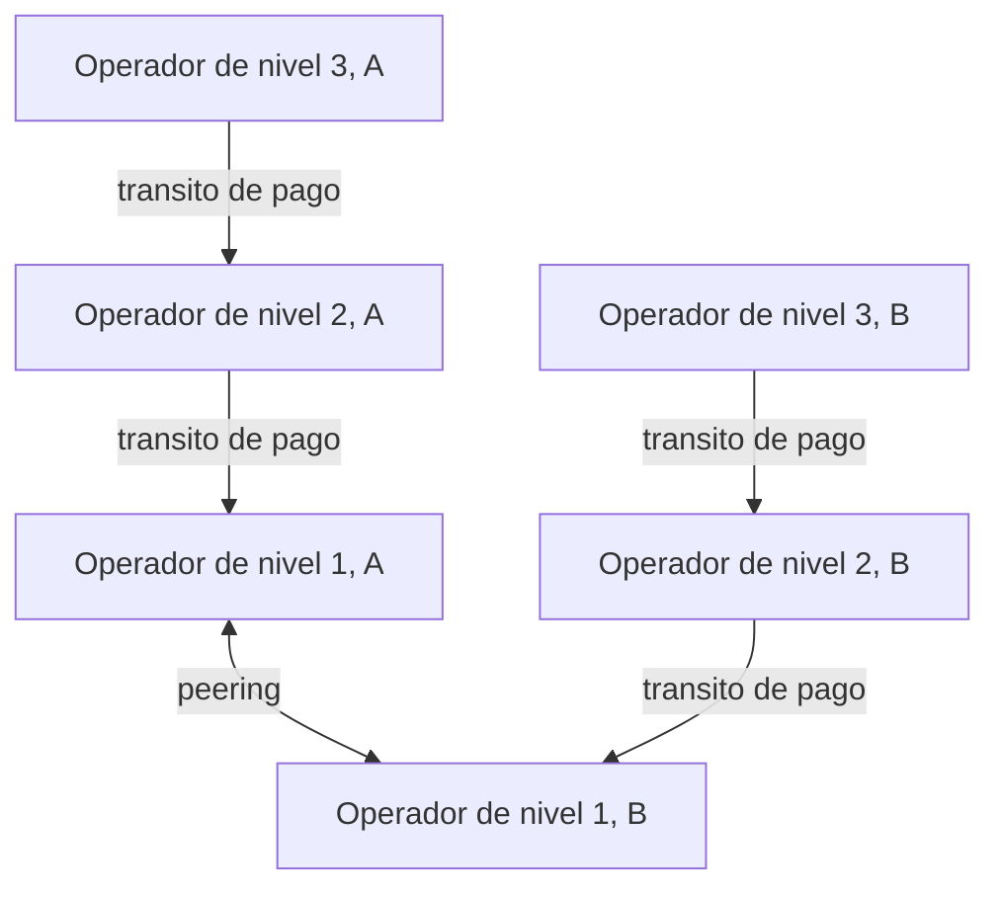
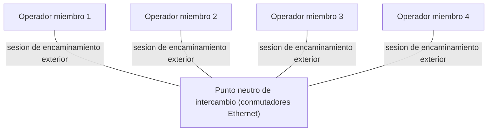
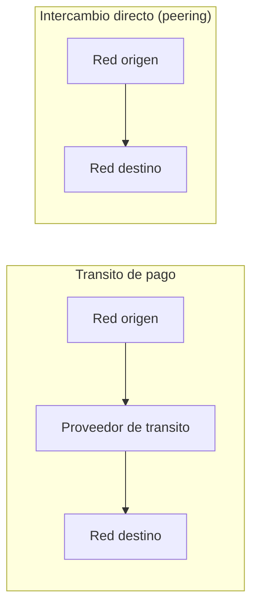

El capítulo anterior describe el protocolo de encaminamiento exterior que un sistema
autónomo emplea para anunciar y recibir rutas hacia el resto de Internet, junto con los
atributos que rigen su proceso de decisión. Este capítulo no repite esa mecánica: se
ocupa de lo que ese protocolo existe para expresar, es decir, las relaciones comerciales
y de confianza entre los sistemas autónomos que administran operadores distintos. Retoma
los [fundamentos de encaminamiento](section_1_fundamentos_de_encaminamiento.md) y
[OSPF y BGP](section_2_ospf_y_bgp.md) y cierra el bloque dedicado al encaminamiento con
la capa de interconexión, desde qué es un sistema autónomo como unidad de negocio hasta
cómo se extiende ese mismo problema a la interconexión de voz entre operadores móviles.

## Introducción

Un sistema autónomo no es solo una unidad técnica sobre la que corre un protocolo de
encaminamiento exterior. Es también una unidad administrativa y comercial: detrás de
cada sistema autónomo hay un operador que decide con quién intercambia tráfico, en qué
condiciones y quién paga por ello. Esa decisión no depende de ningún algoritmo de
encaminamiento, sino de acuerdos comerciales que después se traducen en configuración de
políticas sobre el protocolo exterior ya descrito. Este capítulo presenta esos acuerdos,
la jerarquía de operadores que resulta de aplicarlos a escala de Internet, y el caso
particular de los operadores móviles, que históricamente interconectaban su tráfico de
voz por una red distinta de Internet y solo migraron a una interconexión basada en IP
con garantías propias.

## Sistemas autónomos

Un **sistema autónomo** es un grupo de redes IP gestionado por un mismo operador, que
aplica dentro de él una política de encaminamiento propia y coherente. Un sistema
autónomo puede ser tan pequeño como la red de un campus o tan grande como la red troncal
de un proveedor de ámbito continental, y es la unidad sobre la que se apoyan tanto las
decisiones técnicas de encaminamiento exterior como los acuerdos comerciales que se
describen en el resto del capítulo.

### Sistemas autónomos terminales, multiconectados y de tránsito

Un sistema autónomo se clasifica según cómo se conecta con el resto de Internet. Un
**sistema autónomo terminal** (_stub_) solo tiene una conexión hacia otro sistema
autónomo, como ocurre en una red de campus pequeña que depende de un único proveedor
para llegar al resto de Internet. Un **sistema autónomo multiconectado** (_multihomed_)
mantiene varias conexiones simultáneas hacia otros sistemas autónomos, una situación
habitual en empresas que quieren evitar depender de un único proveedor. Un **sistema
autónomo de tránsito** ofrece, además de conectividad propia, un servicio de paso para
el tráfico de otras redes que lo atraviesan camino de un tercer destino. Esta última
categoría es la que sostiene comercialmente la jerarquía de proveedores que se describe
más adelante.

### Numeración de sistemas autónomos

Cada sistema autónomo recibe un número de sistema autónomo (ASN) único, que asigna la
ICANN u otras entidades responsables de la numeración de Internet. El protocolo de
encaminamiento exterior emplea este número para identificar, dentro de la información de
encaminamiento que intercambia, a qué sistema autónomo pertenece cada tramo del camino
que recorre un anuncio de ruta.

## Jerarquía de proveedores

La decisión de con quién se conecta un sistema autónomo no es simétrica entre todos los
operadores de Internet. Un operador pequeño no negocia en igualdad de condiciones con
una red troncal que da servicio a medio continente, y esa diferencia de escala da lugar
a una jerarquía de proveedores reconocida en la práctica del sector.

### Niveles de la jerarquía

La jerarquía distingue tres niveles. Los operadores de **nivel 1** forman la red troncal
que soporta grandes volúmenes de tráfico y da acceso a los proveedores regionales. Los
operadores de **nivel 2** son proveedores regionales que dan acceso a los proveedores
locales de su zona. Los operadores de **nivel 3** son proveedores locales que dan acceso
a Internet a hogares y empresas. Un operador de nivel inferior alcanza el resto de
Internet a través de un operador de nivel superior, mientras que los operadores de nivel
1 entre sí no dependen de ningún nivel más alto para alcanzarse.

## Acuerdos de interconexión

Entre dos sistemas autónomos que quieren intercambiar tráfico se dan, en la práctica,
dos tipos de acuerdo. El **tránsito** es un acuerdo de pago en el que un operador compra
a otro el paso hacia el resto de Internet. El _peering_ es un acuerdo entre dos
operadores para intercambiar directamente el tráfico que ya circula entre sus
respectivos clientes, sin que ese intercambio pase por un tercero.

### Tránsito

El tránsito permite que el tráfico de un operador atraviese la red de otro para alcanzar
destinos que no son clientes directos de ninguno de los dos. Es el acuerdo habitual
entre un operador de nivel 1 y uno de nivel 2 o 3, previo pago, y es lo que da a un
operador pequeño acceso al resto de Internet sin necesidad de conectarse directamente
con cada red que quiera alcanzar.

### Peering privado

El _peering_ reduce los costes de tránsito de ambos operadores y mejora la experiencia
de sus clientes, porque acorta la ruta que sigue el tráfico entre ellos y da a cada
operador un mayor control sobre su propio encaminamiento. En su forma más simple, el
_peering_ **privado** es una conexión punto a punto entre dos operadores que no requiere
ninguna infraestructura compartida adicional: basta con el enlace físico entre ambos y
la sesión del protocolo de encaminamiento exterior que se establece sobre él.

### Puntos neutros de intercambio

Cuando son varios los operadores que quieren intercambiar tráfico entre sí, resulta más
eficiente compartir una misma infraestructura que multiplicar enlaces punto a punto
entre cada pareja de ellos. Un **punto neutro de intercambio** (IXP) es el lugar físico
donde varios operadores interconectan sus redes a través de conmutadores Ethernet
compartidos, y establecen entre sí las sesiones del protocolo de encaminamiento exterior
necesarias para intercambiar tráfico. Un IXP no sustituye la negociación comercial entre
sus miembros: solo les proporciona la infraestructura compartida sobre la que, si
acuerdan un _peering_, ese _peering_ se implementa.

El contraste entre ambos acuerdos se aprecia en el camino que sigue el mismo tráfico.
Con tránsito de pago, el tráfico entre dos redes atraviesa la red del proveedor de
tránsito que ambas contratan. Con un intercambio directo, ya sea por _peering_ privado o
a través de un IXP, el tráfico va de una red a la otra sin atravesar ningún tercero.

### Límites del peering

El _peering_ no reemplaza al tránsito de Internet: un operador que solo tiene acuerdos
de _peering_ con sus vecinos inmediatos no alcanza, a través de ellos, el resto de
Internet, porque ningún operador de _peering_ reenvía tráfico hacia terceros con los que
no tiene un acuerdo propio. Por esa misma razón, un acuerdo de _peering_ solo tiene
sentido económico entre dos operadores que intercambian un volumen de tráfico alto y,
sobre todo, razonablemente equilibrado en ambos sentidos. Cuando el tráfico entre dos
redes es muy asimétrico, la red que recibe mucho más de lo que envía está, en la
práctica, consumiendo capacidad de la otra sin compensación equivalente, y esa situación
se resuelve con un acuerdo de tránsito de pago en vez de con _peering_.

???+ example "Decidir si dos operadores de tamaño muy distinto establecen peering"

    Dos operadores evalúan si establecer un acuerdo de _peering_. El operador A genera
    hacia el operador B un volumen de tráfico diez veces mayor que el que recibe de él.
    Se pide si conviene un acuerdo de _peering_ entre ambos o si es más adecuado un
    acuerdo de tránsito.

    El _peering_ se firma entre operadores con un intercambio de tráfico alto y
    razonablemente equilibrado en los dos sentidos. La proporción de diez a uno entre A
    y B no cumple esa condición: B está recibiendo de A mucho más tráfico del que le
    envía, sin que exista una contrapartida equivalente. En esas condiciones no resulta
    económicamente sostenible para A ofrecer ese intercambio sin coste, de modo que la
    relación entre ambos se resuelve mejor mediante un acuerdo de tránsito de pago, en
    el que B compra a A el acceso al tráfico que necesita, en lugar de mediante un
    acuerdo de _peering_ entre iguales.

## Servicio de tránsito

El servicio de tránsito que un operador de tránsito ofrece a sus clientes tiene dos
componentes complementarios, que juntos permiten que el tráfico fluya en ambas
direcciones entre el cliente y el resto de Internet.

### Anuncio de rutas entrantes y salientes

Por un lado, el proveedor de tránsito anuncia al resto de Internet las rutas hacia las
redes de su cliente, lo que atrae hacia el cliente el tráfico entrante que otros
operadores le dirigen. Por otro lado, el proveedor de tránsito anuncia a su cliente las
rutas que conoce del resto de Internet, lo que permite que el tráfico saliente del
cliente encuentre camino hacia cualquier destino, incluidos los que no son alcanzables
por ningún otro acuerdo del cliente.

### Niveles de servicio y garantías

Los proveedores de tránsito ofrecen distintos niveles de servicio con garantías de
rendimiento, aunque ninguno garantiza la entrega final del tráfico hasta su destino, que
depende también de las redes intermedias que este atraviesa más allá del proveedor
contratado. El mercado de tránsito de Internet reúne muchos proveedores que compiten con
catálogos de producto distintos, algunos con cobertura regional y otros con presencia en
varios continentes, y tanto los precios como los acuerdos de nivel de servicio varían de
forma considerable entre ellos.

## Interconexión entre operadores móviles

La misma tensión entre tránsito y _peering_ que estructura la interconexión de redes de
datos se plantea también entre operadores móviles, pero con una diferencia de partida
importante: durante décadas, el tráfico de voz entre operadores no viajó por Internet ni
por ninguna red equivalente, sino por una infraestructura de señalización y conmutación
específica del sector de las telecomunicaciones.

### Migración desde SS7 y TDM hacia IP

Tradicionalmente, la interconexión de voz entre operadores se realizaba sobre redes de
señalización SS7 y de transporte por multiplexación en el tiempo (TDM). La migración de
las redes de los operadores hacia el transporte de voz sobre IP obliga a repensar
también la interconexión entre ellos, que pasa a apoyarse en una interfaz y en una red
de transporte basadas en IP en lugar de en la conmutación de circuitos tradicional.

### Interfaz entre redes

Esa migración exige una interfaz de red a red (NNI) basada en IP entre los operadores, y
una red de interconexión dedicada que la soporte. No se utiliza la Internet pública para
esta interconexión, porque Internet no ofrece garantías de calidad de servicio, algo
especialmente crítico para un servicio en tiempo real como la voz, donde el retardo y la
pérdida de paquetes son mucho más perceptibles para el usuario que en otros servicios de
datos.

### Modelo de intercambio IP

La Asociación GSM (GSMA) ha desarrollado para este fin un modelo de interconexión
llamado IP Exchange (IPX), pensado específicamente para el intercambio de tráfico entre
operadores móviles con garantías de extremo a extremo. El modelo IPX se apoya en cuatro
características. Primero, intercambia tráfico de forma nativa sobre IP, sin necesidad de
conversión de medios en el propio intercambio. Segundo, ofrece interoperabilidad de
servicios entre operadores que pueden tener implementaciones técnicas distintas.
Tercero, admite pagos en cascada entre los proveedores de IPX que intervienen en una
misma comunicación, de modo que cada tramo de la cadena de interconexión se remunera por
separado y todas las partes implicadas se benefician económicamente del tráfico que
transportan. Cuarto, se rige por acuerdos de nivel de servicio (SLA) que garantizan
rendimiento, calidad y seguridad, y es el modelo empleado también para dar servicio a
_roaming_ entre operadores de países distintos.

En su arquitectura, los proveedores de IPX se conectan entre sí a través de un punto de
intercambio de IPX dedicado, análogo en su función al punto neutro de intercambio de
Internet, pero reservado al tráfico de los operadores adheridos al modelo. Tanto la
señalización, por ejemplo mediante SIP, como los propios medios, por ejemplo mediante
RTP, se transportan de extremo a extremo sobre esta red, que admite de forma nativa los
protocolos habituales basados en IP. Un operador puede necesitar abrir varias conexiones
lógicas según los servicios que curse, pero le basta con una única conexión técnica
hacia su proveedor de IPX para acceder a todas ellas. El modelo está abierto a escala
global a cualquier operador dispuesto a adoptar sus principios, y su diseño facilita
tanto la prestación de servicios en tiempo real como una tarificación más sencilla para
el operador que factura el tráfico transportado.

???+ example "Rastrear la cadena de facturación de una llamada entre dos operadores"

    Dos operadores móviles, cada uno adherido a un proveedor de IPX distinto, cursan
    tráfico de voz entre sí. Ninguno de los dos tiene una conexión técnica directa con
    el proveedor de IPX del otro, sino que ambos proveedores de IPX están, a su vez,
    interconectados entre ellos. Se pide cómo se reparte la facturación de esa llamada a
    lo largo de la cadena de interconexión.

    El modelo IPX admite pagos en cascada entre todos los proveedores que intervienen en
    una misma comunicación. El operador de origen factura a su propio proveedor de IPX
    por el tráfico que le entrega. Ese proveedor de IPX, al no tener conexión técnica
    directa con el proveedor de IPX del operador de destino, factura a su vez al segundo
    proveedor de IPX por completar la entrega, y este factura finalmente al operador de
    destino. Cada tramo de la cadena se remunera de forma independiente, de modo que
    todos los proveedores de IPX que participan en el camino de la llamada obtienen una
    compensación, aunque ninguno de ellos gestione la comunicación de un extremo a otro
    en solitario.

### Opciones de conectividad y garantías extremo a extremo

El modelo IPX ofrece tres opciones de conectividad entre proveedores, que se diferencian
por las funciones que incluyen y por el alcance de la garantía de calidad de servicio.

| Opción                      | Función                                                                                                                                                               |
| --------------------------- | --------------------------------------------------------------------------------------------------------------------------------------------------------------------- |
| Transporte de IPX           | Acuerdo entre proveedores que usa la capa de transporte de IPX con calidad de servicio garantizada de extremo a extremo.                                              |
| Tránsito de servicio de IPX | Acuerdo entre proveedores que añade funciones de _proxy_ de IPX sobre la capa de transporte de IPX, también con calidad de servicio garantizada de extremo a extremo. |
| Centro de servicio IP       | Opción que además incluye facturación basada en el propio servicio prestado, junto con la garantía de calidad de servicio de extremo a extremo.                       |

Las tres opciones comparten la garantía de calidad de servicio de extremo a extremo que
caracteriza al modelo IPX frente a la interconexión sobre la Internet pública. Se
diferencian en si incorporan, además del transporte, funciones de intermediación entre
proveedores o un modelo de facturación ligado directamente al servicio.
