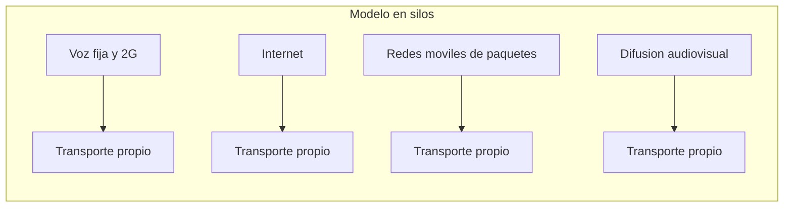
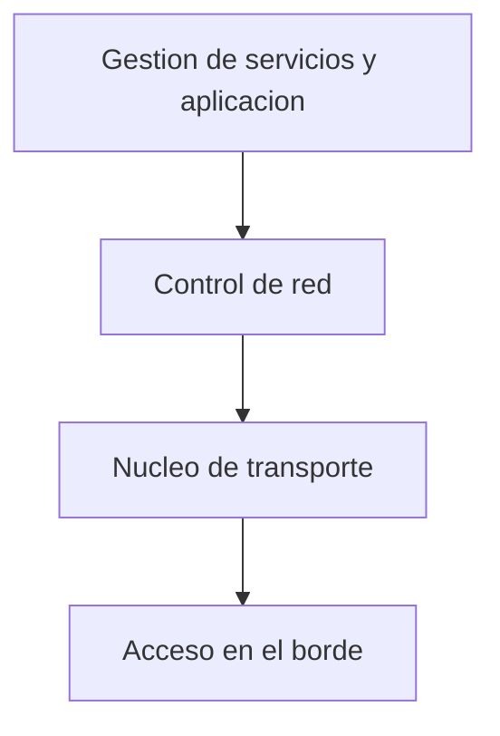
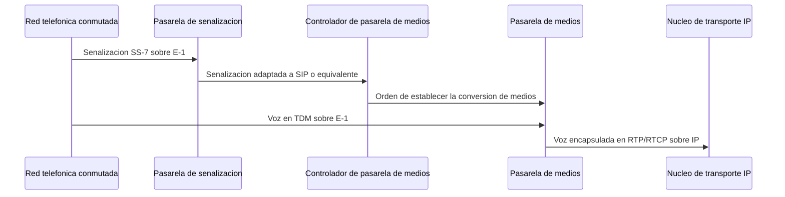

Un operador de telecomunicaciones no siempre ha construido una única infraestructura
capaz de transportar todos sus servicios. Durante buena parte de la historia de las
telecomunicaciones, cada servicio, la voz fija, la voz móvil, el acceso a Internet o la
difusión de televisión, se apoyó en una red propia, con su propia tecnología de acceso y
sus propios terminales. Este capítulo explica por qué ese modelo se mantuvo durante
tanto tiempo, qué fuerzas lo llevaron a converger sobre una infraestructura común basada
en IP, y cómo se diseña una red de nueva generación que soporta esa convergencia sin
perder la capacidad de comunicarse con la red telefónica que precedió a todas las demás.

## Introducción

Antes de que existiera un motivo económico y técnico para compartir infraestructura,
cada tipo de servicio de telecomunicación exigía su propia instalación de hardware y de
software, dedicada en exclusiva a ese servicio. Esa organización, denominada **modelo en
silos**, y la posterior **convergencia** que la sustituyó, son las dos caras de un mismo
proceso de evolución tecnológica que este capítulo recorre de principio a fin: primero
describe cómo era la red antes de converger, después por qué convergió y qué dos
culturas de diseño distintas se encontraron al hacerlo, a continuación qué tendencias de
tráfico empujaron a IP hacia el centro de esa convergencia, y finalmente cómo se
estructura una red de nueva generación (NGN) que resulta de todo ese proceso, incluida
su capacidad de seguir comunicándose con la red telefónica conmutada que no desapareció
de la noche a la mañana.

## Modelo vertical de redes

El **modelo en silos** (_silo model_) describe un enfoque histórico en el que los
distintos servicios de telecomunicación, de Internet y de radiodifusión se integraron
verticalmente, tanto como negocios como conjuntos de instalaciones. Cada silo resuelve
sus propias necesidades de transmisión, conmutación, acceso y terminal sin compartir
apenas nada con los silos vecinos, lo que produce una falta de integración y de
comunicación efectiva entre servicios que, en principio, podrían compartir buena parte
de su infraestructura de transporte.

Repasar los silos más representativos permite entender qué compartían entre sí y qué los
mantenía, a pesar de ello, como redes separadas.

### Red fija y red móvil de segunda generación

La red telefónica fija y la red móvil de segunda generación, GSM, comparten similitudes
en sus capas de transmisión, de conmutación y de servicio, porque ambas resuelven en el
fondo el mismo problema: establecer una comunicación de voz de extremo a extremo
mediante conmutación de circuitos. La diferencia entre ambas aparece en las capas de
terminales y de acceso, donde cada una emplea una tecnología distinta, y en la
movilidad, que la red fija no necesita resolver y que introduce en GSM desafíos de
gestión de ubicación y de traspaso que no tienen equivalente en el lado fijo. El bucle
de abonado, las centrales de conmutación y el plan de numeración que sostienen el lado
fijo de este silo se describen con detalle en
[redes de acceso fijo](../03_conmutacion_y_lan/section_2_redes_de_acceso_fijo.md).

### Internet y sus proveedores

Internet es, de los silos históricos, el que primero se unificó internamente alrededor
de un único protocolo, IP, en lugar de mantener una tecnología de transporte distinta
por cada proveedor. Esa unificación interna no impidió que Internet siguiera siendo, en
su origen, un silo frente al resto de servicios de telecomunicación: una infraestructura
separada, con su propia jerarquía de proveedores de acceso y de proveedores de red, que
se describe en
[estructura de Internet](../03_conmutacion_y_lan/section_2_redes_de_acceso_fijo.md#estructura-de-internet).
La convergencia que se describe más adelante en este capítulo no consiste en que
Internet desaparezca como silo, sino en que el resto de servicios terminen apoyándose en
la misma tecnología de transporte IP que Internet ya había adoptado internamente.

### Redes móviles de conmutación de paquetes

Las redes móviles de conmutación de paquetes son, hoy, las más utilizadas entre todos
los silos históricos, y agrupan tecnologías de acceso sucesivas, GPRS, UMTS, LTE y 5G,
que fueron añadiendo capacidad de datos sobre la base celular que sentó GSM. Cada una de
esas tecnologías de acceso concreta, con su arquitectura de red, su interfaz radio y su
núcleo propio, pertenece a un área posterior de esta wiki dedicada a las redes móviles.
Lo que interesa retener en este capítulo es únicamente su papel como silo: una red de
acceso y un núcleo pensados para conmutación de paquetes, coexistiendo históricamente
junto a la red fija de circuitos y junto a Internet en lugar de compartir transporte con
ninguna de las dos.

### Difusión audiovisual

La difusión audiovisual, o _broadcasting_, constituye un cuarto silo dedicado a unir
programas y contenido, emitir las señales resultantes a través de un sistema de
distribución propio y dar cobertura de radiofrecuencia a las áreas de recepción de los
receptores domésticos. A diferencia de los tres silos anteriores, que transportan
comunicaciones bidireccionales entre pares de usuarios, la difusión audiovisual reparte
un mismo contenido de uno a muchos receptores, lo que justificó durante mucho tiempo el
uso de una red de distribución de señal completamente independiente de la voz y de los
datos. Junto a estos cuatro silos, los operadores mantenían además una quinta línea de
negocio de datos de telecomunicación, dedicada a líneas alquiladas, redes privadas y
virtuales y a la provisión de servicios de Internet a otros operadores, con su propia
infraestructura de soporte.

## Convergencia

La **convergencia** es el proceso por el que servicios que antes vivían en silos
separados terminan compartiendo una misma infraestructura de transporte basada en IP.
Entender por qué tardó en producirse exige mirar primero a las dos comunidades de
ingeniería que construyeron, por separado, las redes de telecomunicación y las redes de
computadoras.

### Redes de telecomunicación y redes de computadoras

Las **redes de telecomunicación** y las **redes de computadoras** pertenecen ambas a la
familia general de las redes de comunicación, pero nacieron de tradiciones de ingeniería
distintas. Las redes de telecomunicación se basan en redes telefónicas conmutadas por
circuitos y ofrecen servicios pensados para dispositivos en movimiento; las desarrollan
ingenieros de telecomunicación. Las redes de computadoras, en cambio, incluyen las redes
domésticas, las de oficina e Internet, se acceden habitualmente desde dispositivos
inalámbricos y las desarrollan informáticos que trabajan con protocolos _ad hoc_, es
decir, conjuntos de reglas diseñados a medida de una necesidad concreta en lugar de
seguir un estándar previo. Esa diferencia de origen no es anecdótica: condiciona cómo
cada comunidad diseña, extiende y hace evolucionar sus propios protocolos, como se ve a
continuación.

### Dos modelos de evolución tecnológica

Las dos comunidades de ingeniería anteriores evolucionan, además, siguiendo modelos de
desarrollo distintos. El **modelo catedral** caracteriza a un sistema cerrado y
planificado, que requiere un plan y una acción coordinada entre todas sus partes, hasta
el punto de que la falta de un solo elemento puede poner en peligro el proyecto
completo: la transición desde GSM, la segunda generación móvil, hasta UMTS, la tercera,
es un ejemplo de evolución catedral, porque exigió coordinar simultáneamente la red de
acceso, el núcleo y los terminales. El **modelo bazar**, en cambio, caracteriza a un
sistema abierto y descentralizado, en el que la evolución de cada componente es
independiente y continua, y en el que la presencia de un elemento individual concreto no
resulta crítica para el funcionamiento general del conjunto, aunque esa misma
independencia dificulta las actualizaciones coordinadas; la transición desde IPv4 hasta
IPv6 ilustra este segundo modelo, porque avanza red por red y proveedor por proveedor
sin que ninguno de ellos dependa de que el resto complete la migración en un plazo fijo.

### Consecuencias sobre arquitectura y protocolos

La diferencia entre los dos modelos anteriores se traslada directamente al diseño de
protocolos de cada comunidad. En telecomunicaciones, se diseña primero una arquitectura
completa y los protocolos se ajustan a ella, de modo que un cambio de arquitectura
obliga a rediseñar los protocolos existentes en lugar de limitarse a sustituir una pieza
aislada. En computación, en cambio, se diseñan protocolos específicos para funciones
específicas, sin partir de una arquitectura única y cerrada: eso da flexibilidad para
añadir funcionalidades nuevas sin rehacer todo lo anterior, pero traslada la dificultad
a otro punto, el de coordinar entre sí protocolos que se diseñaron de forma
independiente y que, en algún momento, deben cooperar dentro de una misma red
convergente.

## Tendencias del tráfico IP

Antes de que la convergencia pudiera resolverse sobre IP en lugar de sobre cualquier
otra tecnología, el propio tráfico IP tuvo que crecer hasta un volumen y una diversidad
de servicios que justificaran construir sobre él toda la infraestructura de un operador.
El tráfico de redes IP ha experimentado un crecimiento notable en los últimos años, con
una tendencia sostenida al alza a escala global, y esa tendencia no se reparte por igual
entre todos los puntos de la red.

### Redes de distribución de contenido

Una parte importante del crecimiento del tráfico IP se concentra en las redes
metropolitanas, en buena medida gracias a las redes de distribución de contenido
(Content Delivery Networks, `CDN`), que hoy gestionan la mayor parte del tráfico de
Internet. El propio crecimiento de los dispositivos inalámbricos y móviles refuerza esa
concentración, porque multiplica el número de puntos de acceso desde los que se solicita
el mismo contenido distribuido por una `CDN` cercana al usuario en lugar de servirlo
desde un origen único y distante.

### Comunicación entre máquinas

La comunicación máquina a máquina, o `M2M`, gana peso de forma creciente frente a los
servicios de tráfico tradicionalmente dominantes, como el vídeo, a medida que se
multiplican los dispositivos conectados que intercambian datos sin intervención directa
de un usuario humano: contadores inteligentes, sistemas de domótica, videovigilancia y
electrodomésticos conectados, entre otros. El internet de las cosas, `IoT`, es la
manifestación más visible de esta tendencia, y en algunos casos, como la instrumentación
industrial, se apoya en redes _ad hoc_ en lugar de en la infraestructura de acceso
convencional del operador.

???+ example "Ahorro de infraestructura al converger servicios en una única red"

    En el modelo en silos, cada servicio de un operador, la voz fija, la voz móvil de
    segunda generación, el acceso a Internet y la difusión audiovisual, exige su propia
    red de transporte, dimensionada de forma independiente para el tráfico de ese
    servicio en concreto. Añadir un servicio nuevo bajo ese modelo implica desplegar una
    infraestructura de transporte adicional completa, aunque la red ya existente
    disponga de capacidad ociosa en los mismos tramos geográficos.

    Sobre una infraestructura convergente basada en IP, en cambio, el operador
    dimensiona un único núcleo de transporte capaz de cursar simultáneamente voz, datos
    y contenido audiovisual, multiplexando estadísticamente el tráfico de todos los
    servicios sobre los mismos enlaces. El ahorro no procede de que el tráfico total
    disminuya, que no lo hace, sino de que la capacidad de transporte deja de
    duplicarse una vez por cada servicio: la capacidad ociosa de un servicio en un
    instante dado queda disponible para el resto, en lugar de permanecer reservada en
    exclusiva a la red vertical que la generó. La contrapartida es que ese núcleo de
    transporte único debe garantizar la calidad de servicio, `QoS`, que cada tipo de
    tráfico necesita, un problema que el modelo en silos evitaba a costa de duplicar
    infraestructura.

### Catálogo de servicios sobre IP

Sobre esa misma infraestructura convergente circula ya un catálogo amplio y heterogéneo
de servicios, cada uno con un patrón de tráfico distinto. La tabla siguiente recoge los
más representativos, sin entrar en el detalle de los protocolos de señalización
multimedia que los sostienen, que se estudian en el área dedicada a los servicios sobre
IP.

| Servicio                         | Patrón de tráfico                                                                                |
| -------------------------------- | ------------------------------------------------------------------------------------------------ |
| Navegación web                   | Tráfico variable y asimétrico, con el tamaño de paquete máximo en el enlace descendente.         |
| Mensajería instantánea           | Intercambio en tiempo real, mayoritariamente de texto, que puede integrarse con otros servicios. |
| Voz sobre IP                     | Conmutación de paquetes con señalización y servicios suplementarios.                             |
| _Push-to-talk_                   | Voz semidúplex, con sesiones que un usuario establece con otros usuarios.                        |
| Vídeo bajo demanda y _streaming_ | Consumo a medida que llega el contenido, asimétrico, con paquetes de gran tamaño.                |
| Televisión sobre IP              | Canales solicitados por el usuario, con garantía de calidad de servicio.                         |
| Vídeo progresivo                 | Almacenamiento en búfer inicial, con tráfico intensivo al comienzo y variable después.           |
| Juegos en línea y en la nube     | Paquetes cortos y alta señalización, o audio y vídeo con baja latencia según el modo.            |

Los servicios de asistencia, la mensajería instantánea, la voz sobre IP y las
videollamadas comparten, además, la necesidad de un protocolo de señalización multimedia
que establezca, mantenga y cierre cada sesión, y de un protocolo de transporte de medios
en tiempo real. Ese es precisamente el nivel de servicio que una red de nueva generación
expone por encima de su núcleo de transporte, y que se detalla en el área dedicada a los
servicios.

## Redes de nueva generación

Las tendencias anteriores empujan hacia una arquitectura de red capaz de transportar
todos esos servicios sobre una base común basada en IP, sin renunciar a la calidad que
cada uno necesita. A esa arquitectura se la denomina **red de nueva generación**, o NGN
por sus siglas en inglés.

### Características

Una `NGN` es una red basada en IP que ofrece servicios de telecomunicación con cuatro
características que la distinguen del modelo en silos que la precede. Utiliza
tecnologías de transporte de banda ancha que admiten calidad de servicio, en lugar de
limitarse al mejor esfuerzo de una red de datos convencional. Separa las funciones de
servicio de las tecnologías de transporte, lo que permite hacer evolucionar cada una por
su lado y ofrecer un mismo servicio sobre distintas tecnologías de acceso sin
rediseñarlo. Permite un acceso abierto a usuarios y a proveedores de servicio, lo que
favorece la competencia y la libertad de elección. Y soporta la movilidad del usuario,
que puede acceder a sus servicios desde cualquier lugar y en cualquier momento. Estas
cuatro propiedades permiten que una `NGN` mejore las infraestructuras tradicionales, la
red fija de telefonía conmutada, las redes móviles e Internet, y que soporte la
convergencia de audio, vídeo y datos sobre una misma base, sin dejar de atender asuntos
críticos como las llamadas de emergencia, la privacidad y la interceptación legal de las
comunicaciones.

### Arquitectura por niveles

Una `NGN` organiza sus funciones en cuatro niveles, accesibles desde cualquier
dispositivo con conexión, que separan con claridad el plano de servicio, el plano de
control y el plano de transporte.

La **gestión de servicios y de aplicación** se ocupa de la configuración, la activación
y la desactivación de servicios, de la asignación de recursos y de calidad de servicio,
de la facturación y de la gestión de la relación con los clientes. El **control de red**
gestiona la señalización y el establecimiento de llamadas mediante componentes como el
_softswitch_ y el registro de ubicación de hogar (Home Location Register, `HLR`), y
genera los registros de detalle de llamada, `CDR`, que alimentan la facturación. El
**núcleo de transporte** es la propia red de conmutación de paquetes, formada por
encaminadores IP que garantizan la calidad de servicio con la ayuda de la conmutación
por etiquetas que se describe a continuación. El **acceso en el borde**, por último,
interconecta ese núcleo de transporte con las distintas redes de acceso y permite que
terminales muy distintos entre sí, desde un teléfono analógico hasta un terminal SIP,
alcancen la red a través de las pasarelas adecuadas.

### Conmutación por etiquetas en el núcleo de transporte

El núcleo de transporte de una `NGN` recurre a la conmutación multiprotocolo por
etiquetas, `MPLS`, junto con el encaminamiento IP convencional, para poder ofrecer
garantías de calidad de servicio que un encaminamiento IP puro por sí solo no
proporciona. `MPLS` mejora el rendimiento y la eficiencia de la conmutación de paquetes
etiquetando cada paquete a su entrada en la red y dirigiéndolo a partir de esa etiqueta
en lugar de volver a consultar su dirección IP de destino en cada salto intermedio. Esa
etiqueta permite reservar de antemano un camino con las propiedades de calidad de
servicio que un tipo de tráfico determinado necesita, algo que el reenvío salto a salto
de IP, descrito en
[protocolo IP y direccionamiento](../02_ip/section_1_protocolo_ip_y_direccionamiento.md),
no garantiza por sí mismo.

## Interconexión con la red telefónica conmutada

Ninguna `NGN` sustituyó de golpe a la red telefónica conmutada pública, `PSTN`, que
seguía dando servicio de voz a un número elevado de abonados sobre una infraestructura
de conmutación de circuitos. La interconexión entre ambas exige tres elementos que
adaptan, en cada dirección, la señalización y los medios de un dominio de conmutación de
circuitos a un dominio de conmutación de paquetes, y viceversa.

### Pasarela de señalización

La **pasarela de señalización**, o _Signaling Gateway_, `SG`, conecta las comunicaciones
basadas en `E-1`, el estándar de capacidad de canal digital de la `PSTN`, con las
comunicaciones basadas en IP, adaptando las capas inferiores para que la
interoperabilidad entre ambos dominios resulte transparente al resto de la llamada. La
adaptación concreta que realiza es de señalización: convierte entre `SS-7`, el protocolo
de señalización de la conmutación de circuitos, y `SIP` o un protocolo de señalización
multimedia equivalente en el lado IP, sin tocar todavía el contenido de la conversación.

### Pasarela de medios

La **pasarela de medios**, o _Media Gateway_, `MG`, separa el control de la llamada de
la conversión de los propios medios, y actúa como puente para el tráfico de voz entre
las redes `E-1` e IP. En el lado de conmutación de circuitos trabaja con multiplexación
por división en el tiempo, `TDM`, y en el lado IP entrega esa misma voz encapsulada
sobre `RTP`, con `RTCP` como protocolo de control asociado. La `MG` no decide cuándo
debe establecerse esa conversión: recibe la orden de hacerlo desde el elemento que se
describe a continuación.

### Controlador de pasarela de medios

El **controlador de pasarela de medios**, o _Media Gateway Control_, `MGC`, gestiona una
o varias pasarelas de medios mediante el protocolo de control de pasarela de medios,
`MeGaCo`, y se comunica con otros controladores `MGC` mediante `SIP`. Es, en la
práctica, el elemento que decide cuándo una llamada debe cruzar entre el dominio de
circuitos y el dominio de paquetes, y el que instruye a la `MG` correspondiente para que
establezca la conversión de medios en el momento adecuado, mientras la `SG` se limita a
adaptar la señalización que anuncia esa llamada.

???+ example "Traspaso de una llamada de voz entre red de paquetes y red conmutada"

    Un abonado de una `NGN` establece una llamada de voz con destino a un número de la
    red telefónica conmutada. Se pide identificar qué elemento de la interconexión
    realiza cada conversión necesaria para que la llamada llegue a su destino.

    La señalización de establecimiento de la llamada sale del terminal del abonado en
    `SIP` y llega hasta la pasarela de señalización, `SG`, que la adapta a `SS-7` para
    que la central de la `PSTN` pueda interpretarla como una llamada entrante
    convencional. El controlador de pasarela de medios, `MGC`, recibe aviso de ese
    establecimiento y ordena a la pasarela de medios, `MG`, que prepare la conversión
    de los medios de la llamada. A partir de ese momento, la voz que circula en `TDM`
    sobre el tramo `E-1` de la `PSTN` entra en la `MG`, que la encapsula sobre
    `RTP`, con `RTCP` como control asociado, para entregarla al núcleo de transporte IP
    de la `NGN`. La `SG` no interviene nunca sobre el contenido de la voz, solo sobre la
    señalización que anuncia la llamada, y la `MG` no decide nunca cuándo actuar sin
    la orden previa del `MGC`.
