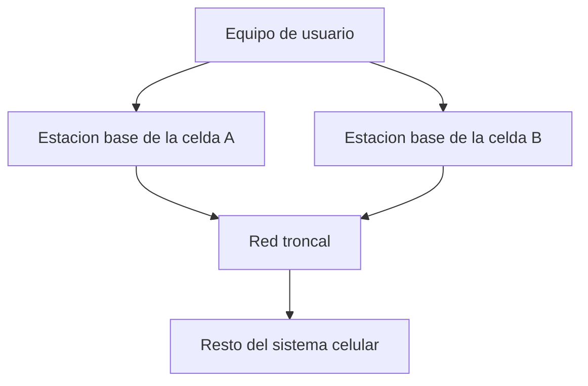
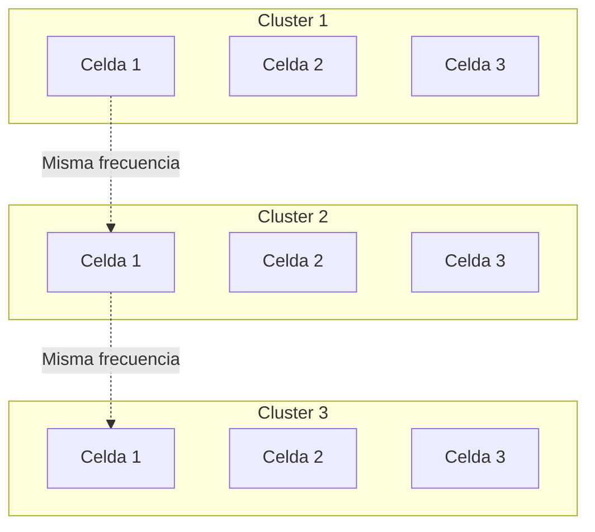
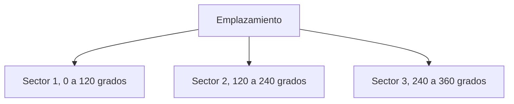
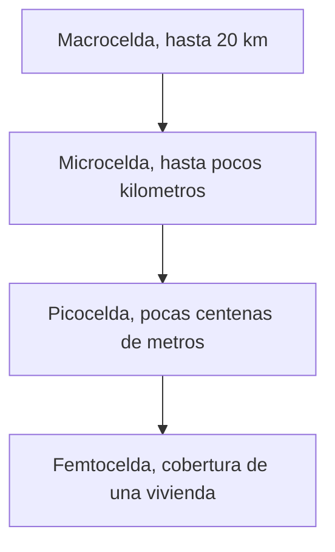

Este capítulo establece el vocabulario y los mecanismos con los que un sistema de acceso
radio organiza la cobertura de un área extensa mediante celdas, reutiliza el espectro
disponible entre ellas y clasifica los distintos tamaños de celda que conviven en una
red real.

## Introducción

Un sistema de comunicaciones móviles debe dar servicio a un número de usuarios muy
superior al que permitiría una única estación transmisora con el espectro disponible. La
solución adoptada por todos los sistemas celulares, desde la primera generación hasta el
5G, consiste en dividir el área de servicio en regiones de tamaño reducido, cada una
atendida por su propia estación transmisora, y en reutilizar el mismo conjunto de
frecuencias en regiones suficientemente alejadas entre sí. Esta idea, el **concepto
celular**, es la que permite que la capacidad de un sistema móvil crezca con el número
de regiones desplegadas en lugar de estar limitada por el ancho de banda de una única
estación.

## Sistema celular

Un **sistema celular** divide el área de cobertura en unidades geográficas llamadas
**celdas** (_cell_), cada una servida por una **estación base** (_base station_) que
proporciona acceso radio a los equipos de usuario situados dentro de su área. La
interconexión de las estaciones base a través de la red troncal permite que un equipo de
usuario se comunique desde cualquier punto cubierto por el sistema, sin que la
comunicación quede confinada al área de una sola celda.

### Estación base y equipo de usuario

La **estación base** aloja el equipo transmisor y receptor de radio de la celda,
generalmente en una ubicación fija, aunque en despliegues temporales para eventos o en
entornos móviles como trenes o drones puede tratarse de una estación no estacionaria. El
**equipo de usuario** (_user equipment_) es el terminal móvil que establece la
comunicación con la estación base de la celda en la que se encuentra. Cada celda puede
disponer de varios transceptores, cada uno gestionando un conjunto de frecuencias
distinto, todos coordinados por el mismo controlador de estación base.

### Enlace ascendente y enlace descendente

La comunicación entre la estación base y el equipo de usuario se organiza en dos
sentidos diferenciados. El **enlace descendente** (_downlink_) transporta la señal desde
la estación base hacia el equipo de usuario, mientras que el **enlace ascendente**
(_uplink_) transporta la señal en sentido contrario, desde el equipo de usuario hacia la
estación base. Ambos enlaces se separan en frecuencia, en tiempo o en ambos según la
técnica de acceso múltiple del sistema, y sus condiciones de propagación no son
necesariamente simétricas: el enlace ascendente parte de un terminal con menor potencia
disponible que la estación base, lo que en la práctica limita antes la calidad de este
enlace que la del descendente.

### Características de un sistema celular

Un sistema celular presenta un conjunto de rasgos que lo distinguen de una red fija y
que condicionan su diseño:

- La estación base suele ser estacionaria, aunque en despliegues especiales se recurre a
  estaciones temporales o móviles.
- Los usuarios son móviles o nómadas, incluyendo comunicaciones exclusivamente entre
  máquinas.
- El canal de comunicación es hostil, con atenuación variable en el tiempo y en la
  frecuencia. Los mecanismos que gobiernan esa variabilidad, pérdidas de propagación y
  desvanecimiento, se tratan en
  [propagación y pérdidas](../../01_fundamentos/02_canal/section_1_propagacion_y_perdidas.md)
  y en
  [desvanecimiento y respuesta del canal](../../01_fundamentos/02_canal/section_2_desvanecimiento_y_respuesta_del_canal.md).
- El espectro disponible es limitado y puede requerir licencia de uso o quedar abierto,
  como ocurre con las bandas de _Wi-Fi_.
- La potencia disponible está limitada, tanto en el terminal como en la estación base,
  lo que obliga a un uso eficiente del espectro y de la energía.
- El acceso al medio se comparte entre múltiples usuarios simultáneos dentro de la misma
  celda.

## Reutilización de frecuencias

La **reutilización de frecuencias** (_frequency reuse_) consiste en asignar el mismo
conjunto de canales a varias celdas del sistema, siempre que la distancia entre ellas
sea suficiente para que la interferencia mutua se mantenga en un nivel tolerable. Dos
celdas que comparten el mismo conjunto de canales se denominan **celdas cocanal**, y la
distancia mínima que las separa recibe el nombre de **distancia de reutilización** o
**distancia cocanal**.

### Geometría de celdas

El área de cobertura de una celda se modela habitualmente como un **hexágono regular**,
una aproximación que no describe la forma real del área de cobertura, gobernada por la
propagación y el terreno, sino que ofrece un empaquetado sin solapamientos ni huecos con
el que razonar de forma sistemática sobre la distribución de canales entre celdas
vecinas. Frente a este modelo sistemático de celdas regulares existe el despliegue _ad
hoc_, en el que las celdas tienen formas y tamaños irregulares que responden a la
orografía y a la densidad de tráfico real del área servida; el modelo hexagonal se
emplea en la fase de planificación y dimensionado, mientras que el despliegue real casi
siempre se aparta de él.

Un grupo de celdas adyacentes que, entre todas, utiliza el conjunto completo de canales
disponibles en el sistema sin que ninguna de ellas repita canal con otra del mismo grupo
se denomina **clúster** (_cluster_). El número de celdas que componen un clúster es el
**tamaño de agrupación** o **factor de reutilización**, representado por $N$. El sistema
completo se cubre repitiendo el mismo patrón de clúster de forma contigua, de modo que
cada celda cocanal de una celda dada pertenece a un clúster distinto.

### Tamaño de agrupación y distancia cocanal

No cualquier valor de $N$ permite construir una retícula de hexágonos regulares que
encaje sin huecos ni solapamientos alrededor de una celda central. La geometría
hexagonal solo admite valores de $N$ de la forma

$$
N = i^{2} + i j + j^{2}
$$

donde $i$ y $j$ son enteros no negativos, no simultáneamente nulos. Esta expresión
genera la secuencia de tamaños de agrupación admisibles

$$
N \in \lbrace 1, 3, 4, 7, 9, 12, 13, 16, 19, 21, 25, 27, 28, \ldots \rbrace
$$

de la que los sistemas celulares reales emplean con mayor frecuencia $N = 3$, $N = 4$,
$N = 7$ y $N = 12$, según el compromiso entre capacidad y calidad que se busque, tratado
en el apartado siguiente.

Fijado el tamaño de agrupación $N$ y el radio de celda $R$, la distancia entre los
centros de dos celdas cocanal más próximas, la distancia de reutilización $D$, se
obtiene de la geometría del empaquetado hexagonal como

$$
D = R\sqrt{3N}
$$

donde $R$ es el radio de la celda, definido como la distancia del centro de la celda al
vértice del hexágono, y $N$ es el tamaño de agrupación. El cociente $Q = D / R =
\sqrt{3N}$ se denomina **razón de reutilización de canales cocanal**: cuanto mayor es
$Q$, más separadas están las celdas cocanal en relación con su propio tamaño, y menor es
la interferencia cocanal que sufren, a costa de repartir el espectro entre un número
mayor de celdas por clúster.

La interferencia que recibe una celda de referencia no procede de una única celda
cocanal, sino de todas las celdas cocanal del primer anillo que la rodea, que en una
retícula hexagonal son seis. Bajo la aproximación de que las seis interferentes de
primer anillo están todas a la distancia $D$ del receptor y de que la propagación sigue
una ley de potencia con exponente de pérdidas $\gamma$, la **relación portadora a
interferencia** (_carrier-to-interference ratio_, $C/I$) en el punto más desfavorable
del borde de la celda, a distancia $R$ de su propia estación base, resulta

$$
\frac{C}{I} = \frac{1}{6}\left(\frac{D}{R}\right)^{\gamma} = \frac{1}{6}(3N)^{\gamma/2}
$$

donde $\gamma$ es el exponente de pérdidas del medio, introducido en
[propagación y pérdidas](../../01_fundamentos/02_canal/section_1_propagacion_y_perdidas.md),
y el factor $6$ da cuenta de las seis interferentes cocanal del primer anillo. Un valor
mayor de $N$ aumenta $D/R$ y, con ello, la relación $C/I$ disponible en el borde de
celda, a costa de reducir el número de canales que le corresponde a cada celda.

???+ example "Relación portadora a interferencia de un clúster de siete celdas"

    Un sistema celular con exponente de pérdidas $\gamma = 4$, representativo de un
    entorno urbano, planifica su reutilización de frecuencias con un tamaño de
    agrupación $N = 7$. El requisito de calidad exige una relación $C/I$ mínima de
    $18\ \text{dB}$ en el borde de celda para garantizar un enlace de voz aceptable.

    La razón de reutilización de canales cocanal es

    $$
    Q = \sqrt{3N} = \sqrt{21} \approx 4,58
    $$

    y la relación portadora a interferencia en el punto más desfavorable resulta

    $$
    \frac{C}{I} = \frac{1}{6}(3 \cdot 7)^{4/2} = \frac{441}{6} = 73,5
    $$

    que en decibelios equivale a

    $$
    10\log_{10}(73,5) \approx 18,66\ \text{dB}
    $$

    Este valor supera, con un margen ajustado de aproximadamente $0,66\ \text{dB}$, el
    requisito de $18\ \text{dB}$, por lo que el clúster de siete celdas satisface la
    calidad exigida. Reducir el tamaño de agrupación a $N = 3$ para ganar capacidad
    llevaría la relación a

    $$
    \frac{C}{I} = \frac{1}{6}(3 \cdot 3)^{4/2} = \frac{81}{6} = 13,5 \Rightarrow
    10\log_{10}(13,5) \approx 11,30\ \text{dB}
    $$

    que incumple el requisito con un margen de más de $6\ \text{dB}$, y confirma que la
    elección de $N$ no es libre una vez fijado el objetivo de calidad del enlace.

### Compromiso entre capacidad y calidad

El tamaño de agrupación $N$ gobierna un compromiso directo entre la capacidad de tráfico
de cada celda y la calidad de la señal recibida. Si el sistema dispone de un número
total de canales $C_{\text{total}}$, cada celda de un clúster de tamaño $N$ recibe

$$
c = \frac{C_{\text{total}}}{N}
$$

canales, suponiendo un reparto homogéneo. Un valor de $N$ pequeño concentra más canales
por celda, lo que aumenta la capacidad de tráfico que cada celda puede ofrecer, pero
acerca las celdas cocanal entre sí y reduce la relación $C/I$ disponible. Un valor de
$N$ grande separa más las celdas cocanal y mejora la calidad de la señal, a costa de
repartir el espectro total entre un número mayor de celdas y reducir así la capacidad de
tráfico por celda. El dimensionado del número de canales de tráfico necesario en cada
celda a partir de la demanda de tráfico y de un objetivo de calidad de servicio se apoya
en las fórmulas de Erlang B y Erlang C descritas en
[Erlang y dimensionado de recursos](../../06_trafico/01_colas/section_2_erlang_y_dimensionado.md).

???+ example "Capacidad de tráfico de una celda según el tamaño de agrupación"

    Un sistema dispone de un total de $C_{\text{total}} = 210$ canales duplex y evalúa
    dos tamaños de agrupación, $N = 7$ y $N = 3$, con un objetivo de calidad de servicio
    del $2\ \%$ de probabilidad de bloqueo.

    Con $N = 7$ cada celda recibe $210 / 7 = 30$ canales de tráfico. Aplicando la
    fórmula de Erlang B en su forma recursiva a $c = 30$ canales con un bloqueo
    objetivo del $2\ \%$, el tráfico que la celda puede cursar es de aproximadamente
    $21,9$ erlangs.

    Con $N = 3$ cada celda recibe $210 / 3 = 70$ canales de tráfico, y el mismo
    cálculo de Erlang B para $c = 70$ canales con el mismo bloqueo objetivo arroja un
    tráfico cursable de aproximadamente $59,1$ erlangs por celda, casi el triple que
    con $N = 7$.

    Reducir el tamaño de agrupación de $7$ a $3$ triplica, aproximadamente, la
    capacidad de tráfico de cada celda individual, pero según el ejemplo anterior
    también reduce la relación $C/I$ en el borde de celda de unos $18,7\ \text{dB}$ a
    unos $11,3\ \text{dB}$, un descenso que puede situar la calidad del enlace por
    debajo del umbral exigido. La
    decisión del tamaño de agrupación no puede tomarse, por tanto, mirando solo la
    capacidad o solo la calidad, sino el punto en el que ambas satisfacen
    simultáneamente los requisitos del sistema.

### Sectorización

La **sectorización** divide la cobertura de una celda en varios sectores angulares, cada
uno servido por una antena direccional distinta en el mismo emplazamiento, en lugar de
una única antena omnidireccional. El esquema más habitual reparte los $360°$ de la celda
en tres sectores de $120°$, con una antena por sector.

Al concentrar la energía radiada en un arco más estrecho, una antena sectorial reduce la
interferencia que genera hacia direcciones distintas de la de sus propios usuarios, lo
que permite acercar más las celdas cocanal para un mismo objetivo de calidad, o alcanzar
una relación $C/I$ mayor con el mismo tamaño de agrupación. Este efecto no procede de
ninguna reducción en la interferencia total generada por el sistema, sino de que cada
sector solo recibe interferencia de los sectores de las celdas vecinas orientados hacia
él, en lugar de recibirla de la celda vecina completa. La sectorización tiene coste en
señalización: un terminal que cambia de sector dentro del mismo emplazamiento requiere
un procedimiento equivalente al de un cambio de celda, cuyo tratamiento se retoma en
[movilidad y gestión de recursos radio](./section_2_movilidad_y_recursos_radio.md).

## Tipos de celda

Las celdas de un sistema celular no tienen todas el mismo tamaño ni el mismo papel: el
área de cobertura de una celda depende de la potencia de transmisión de su estación base
y del entorno en que se despliega, y sistemas de distintas generaciones combinan celdas
de tamaños muy diferentes dentro de la misma red.

### Macroceldas

Las **macroceldas** son las celdas de mayor tamaño, servidas por antenas tradicionales
instaladas en torres o en las azoteas de edificios, con un alcance de hasta unos $20\
\text{km}$. Constituyen la capa de cobertura básica de un sistema celular y son las
responsables de dar servicio continuo en áreas extensas, incluidas las zonas rurales de
baja densidad de tráfico.

### Microceldas

Las **microceldas** cubren un área más reducida que una macrocelda, del orden de varios
cientos de metros a unos pocos kilómetros, y se despliegan dentro del área de una
macrocelda para repartir el tráfico entre un número mayor de celdas y reducir así el
número de usuarios que compiten por los recursos de cada una. Su estación base suele
instalarse a una altura menor que la de una macrocelda, en mobiliario urbano o en
fachadas de edificios.

### Picoceldas y femtoceldas

Las **picoceldas** ofrecen cobertura de unas pocas centenas de metros y se emplean para
reforzar la capacidad o la cobertura en interiores de edificios grandes o en puntos de
alta concentración de usuarios. Las **femtoceldas** llevan la reducción de tamaño al
extremo: proporcionan cobertura móvil a una vivienda o a una oficina individual,
conectándose a la red troncal del operador a través de una conexión de acceso a Internet
del propio usuario en lugar de mediante el _backhaul_ dedicado de una estación base
convencional.

### Redes heterogéneas

Una **red heterogénea** (_heterogeneous network_) combina, dentro de la misma área de
servicio, estaciones base de tamaños y potencias de transmisión distintos: una capa de
macroceldas que garantiza la cobertura continua, superpuesta a microceldas, picoceldas o
femtoceldas que añaden capacidad allí donde la demanda de tráfico lo exige. Esta
combinación introduce un nuevo tipo de interferencia, la que se produce en la transición
entre una macrocelda y una celda de menor tamaño situada dentro de su área, y exige
mecanismos de gestión de recursos radio y de movilidad más elaborados que los de una red
de un solo tamaño de celda, tratados en
[movilidad y gestión de recursos radio](./section_2_movilidad_y_recursos_radio.md).

## Canales de tráfico y canales de señalización

Dentro de cada celda, los recursos radio se reparten entre dos tipos de canal lógico
según la naturaleza de la información que transportan. Los **canales de tráfico**
(_traffic channels_) transportan los datos propios del servicio del usuario, ya sea voz
o datos, y determinan de forma directa la capacidad de la celda tratada en el apartado
del compromiso entre capacidad y calidad. Los **canales de señalización** no transportan
datos de usuario, sino la información necesaria para que el sistema funcione: el acceso
inicial de un terminal a la red, la asignación de recursos radioeléctricos, la
información de sincronización y configuración de la celda, y el aviso de llamada
entrante. Ambos tipos de canal comparten, en general, las mismas capas de protocolo pero
se transportan sobre canales físicos distintos, y el dimensionado de los canales de
señalización, en particular del canal de aviso de llamada, sigue una lógica propia que
se trata en
[Erlang y dimensionado de recursos](../../06_trafico/01_colas/section_2_erlang_y_dimensionado.md).

## Limitaciones del sistema

La capacidad final de un sistema celular está determinada por dos tipos de limitación de
naturaleza distinta, que actúan de forma independiente y que un mismo sistema puede
sufrir simultáneamente en distintas condiciones de despliegue.

### Espectro con licencia y sin licencia

El espectro radioeléctrico que un sistema celular puede utilizar procede de dos
categorías. El **espectro con licencia** se asigna en exclusiva a un operador mediante
un proceso administrativo, generalmente de pago, y le garantiza el uso protegido de esa
banda frente a otros operadores. El **espectro sin licencia**, como el empleado por las
bandas de _Wi-Fi_, puede ser utilizado por cualquier sistema que cumpla las condiciones
técnicas del regulador, sin garantía de exclusividad ni de ausencia de interferencia de
otros sistemas que operen en la misma banda.

### Limitación por potencia y por interferencia

Un sistema celular puede estar **limitado por potencia** o **limitado por
interferencia**, según cuál de las dos magnitudes agote antes el margen disponible en el
balance de enlace. Un sistema limitado por potencia no dispone de suficiente energía
radiada para alcanzar la sensibilidad del receptor en el borde de la celda, con
independencia de la interferencia presente, y su solución pasa por aumentar la potencia
transmitida, la ganancia de antena o reducir el tamaño de celda. Un sistema limitado por
interferencia sí dispone de potencia suficiente en el borde de celda, pero la relación
$C/I$ cae por debajo del umbral de calidad debido a la interferencia cocanal de otras
celdas del sistema, y su solución exige actuar sobre la reutilización de frecuencias, el
tamaño de agrupación o la sectorización, no sobre la potencia transmitida. Distinguir
cuál de las dos limitaciones afecta a un sistema concreto es el primer paso de cualquier
proceso de optimización de su capacidad, y una técnica habitual para aumentar la
capacidad en una zona limitada por tráfico, sin degradar la calidad del resto del
sistema, es la división de celdas: sustituir una celda de radio $R$ por varias celdas
más pequeñas de radio $R/2$, cada una con su propia estación base de menor potencia.
Como las pérdidas de propagación crecen con la distancia elevada al exponente $\gamma$,
reducir a la mitad el radio de celda permite reducir la potencia transmitida por la
estación base en un factor $(1/2)^{\gamma}$ y mantener el mismo nivel de señal en el
nuevo borde de celda, mientras que el número de celdas, y con ello la capacidad total
del área, se multiplica aproximadamente por cuatro.

???+ example "Reducción de potencia al dividir una celda en cuatro"

    Un operador divide una macrocelda de radio $R$ en cuatro celdas de radio $R/2$ para
    aumentar la capacidad de una zona con alta demanda de tráfico, en un entorno con
    exponente de pérdidas $\gamma = 4$.

    Para mantener el mismo nivel de señal en el borde de la nueva celda, más pequeña, la
    potencia transmitida por cada nueva estación base debe reducirse en un factor

    $$
    \left(\frac{R/2}{R}\right)^{\gamma} = \left(\frac{1}{2}\right)^{4} = \frac{1}{16}
    $$

    que en decibelios equivale a una reducción de $10\log_{10}(1/16) \approx
    -12\ \text{dB}$ respecto a la potencia de la macrocelda original.

    El área servida previamente por una sola celda pasa a estar cubierta por cuatro
    celdas independientes, cada una con su propio reparto de canales de tráfico, lo
    que multiplica aproximadamente por cuatro la capacidad de tráfico de la zona. El
    coste de esta ganancia es el despliegue de tres estaciones base adicionales y el
    aumento del número de traspasos que experimentan los terminales que se mueven
    dentro del área dividida, un efecto que se retoma en
    [movilidad y gestión de recursos radio](./section_2_movilidad_y_recursos_radio.md).
