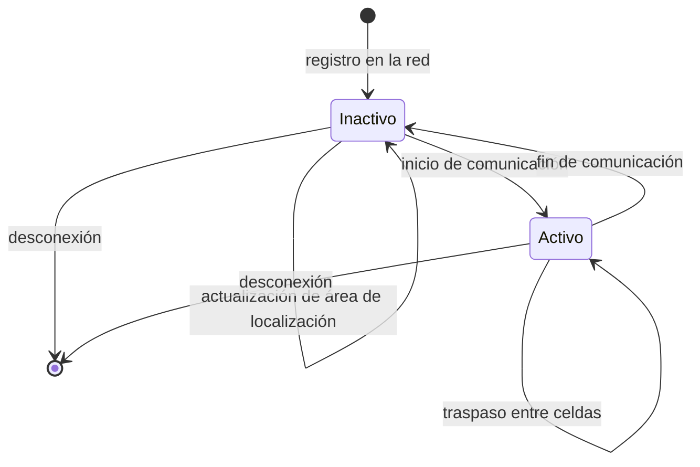
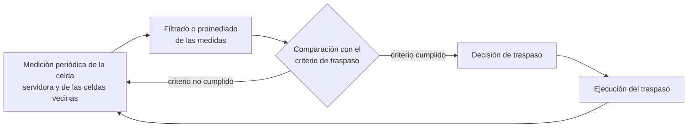
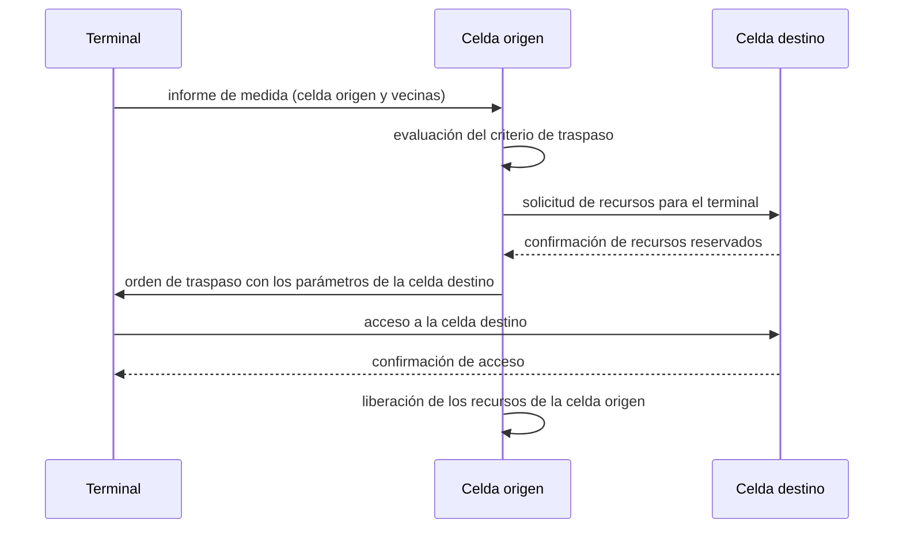

Un sistema celular reparte la cobertura entre celdas para reutilizar el espectro, según
el esquema de reutilización de frecuencias y de tamaños de celda descrito en
[concepto celular y reutilización de frecuencias](./section_1_concepto_celular.md), pero
esa organización obliga a resolver un problema que no existe en una red fija: un
terminal se desplaza, cambia de celda y espera seguir comunicado sin que el usuario
perciba el cambio. Este capítulo trata los mecanismos que resuelven ese problema con
independencia de la generación concreta que los implemente: cómo la red sabe en qué
celda se encuentra un terminal, cómo se le localiza cuando llega una llamada, cómo se le
traslada de una celda a otra sin interrumpir una comunicación en curso, cómo se
extienden estos mecanismos a una red de otro operador, y cómo se gestionan los recursos
radio comunes que sostienen toda esa movilidad.

## Introducción

Un terminal alterna entre dos situaciones frente a la red: mantiene una comunicación
activa, en cuyo caso su cambio de celda debe resolverse mediante un **traspaso**
(_handover_) sin que la comunicación se interrumpa, o permanece sin comunicación activa,
en cuyo caso a la red le basta con saber en qué zona aproximada se encuentra para poder
localizarlo cuando sea necesario. Esta distinción de fondo, entre seguir el movimiento
con precisión de celda o con precisión de zona, organiza buena parte de este capítulo y
se retoma en detalle en el primer apartado. A partir de ella se derivan la localización
del terminal, el traspaso propiamente dicho, la itinerancia entre redes de distintos
operadores, los identificadores que hacen posible seguir a un usuario y a una celda
concretos, y un conjunto de mecanismos de gestión de recursos radio que sostienen la
movilidad sin degradar la calidad del sistema.

## Modos de operación del terminal

### Modo activo

En **modo activo**, el terminal mantiene una comunicación establecida con la red: una
llamada de voz, una transferencia de datos o cualquier otro servicio que ocupe un canal
o un conjunto de recursos radio de forma continuada. Mientras permanece en este modo, la
red conoce con precisión la celda que sirve al terminal, porque necesita mantener el
enlace radio activo en todo momento. Un cambio de celda durante el modo activo no puede
resolverse con una simple actualización de información de localización, porque
interrumpiría la comunicación en curso: exige el mecanismo de traspaso que se describe
más adelante, capaz de trasladar la comunicación de una celda a otra sin que el usuario
perciba el cambio, o percibiéndolo como una interrupción mínima y controlada.

### Modo inactivo

En **modo inactivo**, o modo _Idle_, el terminal no mantiene ninguna comunicación
establecida, pero permanece registrado en la red y con su receptor encendido de forma
periódica para poder recibir un aviso de llamada entrante. Seguir la posición exacta,
celda a celda, de todos los terminales inactivos de una red exigiría una señalización
constante y desproporcionada frente al beneficio que aporta, porque la inmensa mayoría
de esos cambios de celda nunca llegan a necesitar servicio. La red opta, en
consecuencia, por un seguimiento de menor granularidad: agrupa varias celdas en una zona
y solo exige al terminal que informe cuando cambia de zona, no cuando cambia de celda.
Esa zona y el mecanismo de localización que sostiene son el objeto del siguiente
apartado.

El paso de un modo a otro es la transición más frecuente en la vida operativa de un
terminal conectado a la red, y ambas transiciones son simétricas: el inicio de cualquier
comunicación lleva al terminal de inactivo a activo, y la finalización de esa
comunicación lo devuelve a inactivo.

## Localización del terminal

### Áreas de localización

Una **área de localización** agrupa un conjunto de celdas contiguas bajo un único
identificador. Mientras un terminal inactivo permanece dentro de la misma área, no
necesita informar a la red de los cambios de celda que realice en su interior: la red
solo sabe, en todo momento, en qué área se encuentra, no en qué celda concreta. Esta
decisión de diseño traslada el problema de seguir la posición de un terminal inactivo a
un compromiso de dimensionado con dos fuerzas opuestas.

Un área de localización grande, con muchas celdas, reduce la frecuencia con la que un
terminal cruza una frontera de área y, por tanto, el número de actualizaciones de
localización que genera la red en su conjunto. Pero cuando llega una llamada para ese
terminal, la red desconoce su celda exacta y debe avisar de forma simultánea o
secuencial a todas las celdas del área, lo que eleva la carga sobre el canal de aviso de
llamada de cada una de ellas. Un área pequeña invierte ambos efectos: menos carga de
aviso de llamada por celda, a costa de más actualizaciones de localización. El
dimensionado de un área de localización consiste, en consecuencia, en encontrar el
reparto de celdas en áreas que minimiza las actualizaciones de localización sin superar
la capacidad del canal de aviso de llamada de ninguna celda. Las fórmulas con que se
calcula esa capacidad a partir del tráfico de avisos son las mismas que dimensionan
cualquier canal de señalización, tratadas en
[Erlang y dimensionado de recursos](../../06_trafico/01_colas/section_2_erlang_y_dimensionado.md).

???+ example "Reparto de celdas en áreas de localización con capacidad limitada"

    Seis celdas dispuestas en línea, numeradas de la 1 a la 6, generan avisos de
    llamada a las siguientes tasas horarias: $50\,000$, $60\,000$, $70\,000$,
    $80\,000$, $60\,000$ y $50\,000$ avisos por hora, respectivamente. Entre cada
    par de celdas contiguas se producen los siguientes traspasos por hora: $300$
    entre las celdas 1 y 2, $500$ entre las celdas 2 y 3, $100$ entre las celdas 3 y
    4, $500$ entre las celdas 4 y 5, y $300$ entre las celdas 5 y 6. La capacidad
    máxima del canal de aviso de llamada de cada celda es de $200\,000$ avisos por
    hora. Se pide el reparto de las seis celdas en áreas de localización que
    minimiza el número de actualizaciones de localización sin superar esa capacidad
    en ninguna área.

    La carga de aviso de llamada de un área es la suma de las cargas de sus celdas,
    y las actualizaciones de localización que genera un reparto son los traspasos
    que cruzan una frontera entre áreas, porque cada uno de ellos obliga al
    terminal inactivo a actualizar su área. Agrupar las celdas 1, 2 y 3 en una
    primera área supone una carga de $50\,000 + 60\,000 + 70\,000 = 180\,000$
    avisos por hora, por debajo del límite. Agrupar las celdas 4, 5 y 6 en una
    segunda área supone $80\,000 + 60\,000 + 50\,000 = 190\,000$ avisos por hora,
    también por debajo del límite. La única frontera entre áreas queda entre las
    celdas 3 y 4, de modo que las actualizaciones de localización de este reparto
    son los $100$ traspasos por hora que cruzan esa frontera.

    Un reparto alternativo en tres áreas de dos celdas, $\{1,2\}$, $\{3,4\}$ y
    $\{5,6\}$, respeta igualmente el límite de capacidad, con cargas de
    $110\,000$, $150\,000$ y $110\,000$ avisos por hora, pero deja dos fronteras
    entre áreas, entre las celdas 2 y 3 y entre las celdas 4 y 5, que suman
    $500 + 500 = 1000$ actualizaciones de localización por hora, diez veces más
    que el reparto anterior. Cualquier reparto que agrupe cuatro celdas
    consecutivas, como $\{1,2,3,4\}$, incumple el límite de capacidad, porque su
    carga conjunta asciende a $260\,000$ avisos por hora. El reparto óptimo corta,
    por tanto, la cadena de celdas exactamente por su enlace más débil en número
    de traspasos, la frontera entre las celdas 3 y 4, que es también la única
    frontera compatible con el límite de capacidad en solo dos áreas.

### Actualización de localización

La **actualización de localización** es el procedimiento por el que un terminal inactivo
informa a la red de que ha entrado en un área de localización distinta de la que tenía
registrada. El terminal compara de forma continua el identificador de área que difunde
la celda que mejor recibe con el identificador que tiene almacenado, y solo inicia el
procedimiento cuando ambos difieren. La red actualiza entonces el área asociada a ese
terminal, de modo que un aviso de llamada posterior se dirija a la nueva área y no a la
anterior. Una actualización de localización también puede dispararse de forma periódica,
con independencia de que el terminal haya cambiado o no de área, como mecanismo para que
la red detecte terminales que se han desconectado de forma anómala sin completar el
procedimiento de baja.

La frecuencia con la que un terminal genera actualizaciones de localización depende
directamente de la velocidad con la que se desplaza y del tamaño de las celdas que
atraviesa, porque solo las fronteras de área generan actualización, pero el número de
fronteras de celda que cruza fija un límite superior sobre cuántas de esas fronteras
pueden coincidir con una frontera de área.

???+ example "Frecuencia de cruce de celdas en función de la velocidad del terminal"

    Un terminal se desplaza a una velocidad constante de $90$ km/h por el interior
    de una zona cubierta por celdas circulares de $1$ km de radio. Se pide una
    estimación de cuántas veces por hora cruza de una celda a otra, en el supuesto
    más desfavorable de que su trayectoria atraviesa cada celda por su diámetro.

    La velocidad expresada en unidades coherentes con el radio es
    $v = 90\ \text{km/h} = 25$ m/s. Si la trayectoria atraviesa cada celda por su
    diámetro, la distancia recorrida dentro de una celda es $L = 2R = 2000$ m,
    donde $R$ es el radio de la celda, y el tiempo de permanencia en cada celda es

    $$
    T = \frac{L}{v} = \frac{2000}{25} = 80\ \text{s}
    $$

    La tasa de cruce de celdas es la inversa de ese tiempo de permanencia,
    $f = 1/T = 1/80$ cruces por segundo, equivalente a $f = 3600/80 = 45$ cruces
    por hora. Atravesar la celda por el diámetro es la trayectoria más larga
    posible dentro de una celda circular, de modo que este valor es una cota
    superior: una trayectoria real, que en general no pasa por el centro de la
    celda, produce un tiempo de permanencia menor y una tasa de cruce mayor que la
    aquí calculada solo en el caso de trayectorias más cortas que el diámetro, y
    menor en el caso general de cuerdas de longitud media inferior al diámetro.
    El resultado sirve como orden de magnitud para dimensionar cuántas
    actualizaciones de localización o traspasos por hora puede llegar a generar un
    terminal en movimiento a esa velocidad, en función del tamaño de celda
    elegido.

### Aviso de llamada

El **aviso de llamada** (_paging_) es el procedimiento con el que la red localiza a un
terminal inactivo cuando le llega una comunicación entrante. Puesto que la red solo
conoce el área de localización del terminal, no su celda exacta, el aviso se transmite
mediante un mensaje de difusión desde todas las celdas de esa área, de forma simultánea
o de forma secuencial según la política del sistema. El terminal, que mantiene su
receptor encendido de forma periódica precisamente para poder recibir este mensaje,
responde desde la celda en la que se encuentra, y a partir de esa respuesta la red pasa
a conocer su celda concreta durante el tiempo que dure la comunicación entrante.

El canal de aviso de llamada de una celda tiene una capacidad limitada de avisos por
unidad de tiempo, y esa capacidad es precisamente la magnitud que acota el tamaño
admisible de un área de localización, como se ha visto en el apartado anterior. El
procedimiento de dimensionado de ese canal, a partir de la tasa de avisos generados y de
un objetivo de calidad de servicio, se trata en detalle en
[Erlang y dimensionado de recursos](../../06_trafico/01_colas/section_2_erlang_y_dimensionado.md),
que dedica un apartado específico al canal de aviso de llamada.

### Canal de acceso aleatorio

El **canal de acceso aleatorio** es el canal común que un terminal utiliza para iniciar
cualquier intercambio de señalización con la red sin disponer todavía de un recurso
dedicado, ya sea para responder a un aviso de llamada, para solicitar el inicio de una
comunicación por iniciativa propia o para completar una actualización de localización.
Al ser un canal compartido por todos los terminales de una celda sin coordinación
previa, un terminal puede transmitir en él en el mismo instante que otro, lo que produce
una colisión. El acceso aleatorio se resuelve, en consecuencia, con un mecanismo de
contienda: el terminal transmite una petición breve, espera una respuesta de la red
dentro de una ventana de tiempo acotada y, si no la recibe, reintenta la transmisión
tras un tiempo de espera aleatorio, de forma análoga al mecanismo de acceso múltiple con
detección de colisión y espera aleatoria. Una vez que la red confirma la recepción de la
petición, asigna al terminal un recurso dedicado con el que continuar el procedimiento
que la motivó, ya sea completar el aviso de llamada, iniciar la comunicación solicitada
o confirmar la actualización de localización.

## Traspaso

El **traspaso** (_handover_) traslada una comunicación activa de una celda a otra sin
interrumpirla, o interrumpiéndola durante un intervalo lo bastante breve para que
resulte imperceptible o tolerable según el servicio. El procedimiento completo se
organiza en tres fases que se repiten de forma continua mientras la comunicación
permanece activa: una fase de medición, en la que el terminal evalúa la calidad de la
celda que le sirve y de las celdas vecinas; una fase de decisión, en la que esas medidas
se comparan con un criterio de traspaso; y una fase de ejecución, en la que, si la
decisión es afirmativa, la comunicación se traslada efectivamente a la nueva celda.

La fase de medición no puede compararse directamente con un umbral de decisión, porque
la señal recibida fluctúa de forma rápida por efecto del desvanecimiento multitrayecto,
según se explica en
[desvanecimiento y respuesta del canal](../../01_fundamentos/02_canal/section_2_desvanecimiento_y_respuesta_del_canal.md).
Una decisión basada en una medida instantánea reaccionaría a esas fluctuaciones de corto
plazo en lugar de a la tendencia real de la señal, de modo que la fase de medición
incluye siempre un filtrado o promediado temporal antes de comparar el resultado con el
criterio de traspaso.

El intercambio de mensajes que ejecuta un traspaso involucra, de forma genérica, a la
celda que sirve al terminal, a la celda destino y al propio terminal, con independencia
de qué entidad de red concreta arbitre la decisión en cada generación.

### Causas de traspaso

Un traspaso puede desencadenarse por dos tipos de causa, que no se excluyen entre sí y
que a menudo se combinan en la decisión final. La primera es la calidad del enlace
radio: la señal recibida de la celda servidora se degrada, o la de una celda vecina la
supera, hasta el punto de comprometer la comunicación si no se actúa. La segunda es la
gestión del tráfico de la red: una celda alcanza su capacidad máxima de usuarios o de
recursos y la red decide trasladar parte de su carga a una celda vecina con capacidad
disponible, con independencia de que la calidad radio lo exigiera o no. Los apartados
siguientes detallan las variantes más habituales de cada tipo de causa.

### Traspaso por balance de potencia

El **traspaso por balance de potencia** compara la potencia recibida de la celda
servidora con la potencia recibida de una celda candidata, y dispara el traspaso cuando
la segunda supera a la primera en más de un margen de histéresis fijado de antemano. Ese
margen no es un capricho de diseño: sin él, dos celdas con potencias muy próximas y en
constante fluctuación por efecto del desvanecimiento producirían traspasos repetidos de
ida y vuelta entre ambas, un efecto conocido como traspaso de vaivén, que consume
señalización sin beneficio real para la comunicación.

???+ example "Margen de histéresis en el traspaso por balance de potencia"

    Un terminal en movimiento mide, en cinco instantes consecutivos separados por
    un segundo, la potencia recibida de su celda servidora ($P_o$) y de una celda
    candidata ($P_d$), ambas en dBm:

    | Instante | $P_o$ (dBm) | $P_d$ (dBm) | $D = P_d - P_o$ (dB) |
    | -------- | ----------- | ----------- | --------------------- |
    | $t_1$    | $-85$       | $-88$       | $-3$                  |
    | $t_2$    | $-87$       | $-86$       | $1$                    |
    | $t_3$    | $-86$       | $-87$       | $-1$                   |
    | $t_4$    | $-88$       | $-84$       | $4$                    |
    | $t_5$    | $-90$       | $-83$       | $7$                    |

    Sin margen de histéresis, el criterio de traspaso es simplemente $D>0$. Se
    cumple en $t_2$, deja de cumplirse en $t_3$ y vuelve a cumplirse en $t_4$, lo
    que produce tres traspasos en cinco medidas: hacia la celda candidata en
    $t_2$, de vuelta a la celda servidora en $t_3$ y de nuevo hacia la candidata en
    $t_4$, el patrón característico del traspaso de vaivén.

    Con un margen de histéresis $H = 3$ dB, el criterio pasa a ser $D>H$. No se
    cumple en $t_1$, $t_2$ ni $t_3$, y se cumple por primera vez en $t_4$, donde
    permanece cumplido también en $t_5$. El margen de histéresis reduce el número
    de traspasos de tres a uno sobre la misma secuencia de medidas, al exigir que
    la ventaja de la celda candidata sea lo bastante amplia para no revertirse con
    las fluctuaciones habituales de la señal.

### Traspaso de paraguas

El **traspaso de paraguas** aparece en despliegues donde una celda de mayor tamaño
solapa la cobertura de varias celdas más pequeñas contiguas. Un terminal que se desplaza
con rapidez a través de esas celdas pequeñas generaría, de aplicarse el criterio de
balance de potencia sin más, un número de traspasos elevado en poco tiempo, porque
atraviesa muchas fronteras de celda por unidad de tiempo, como ilustra el cálculo de
frecuencia de cruce del apartado de actualización de localización. El traspaso de
paraguas evita esa sucesión de traspasos derivando a ese terminal hacia la celda de
mayor tamaño, aunque su potencia recibida sea algo inferior a la de la celda pequeña más
cercana, porque el beneficio de reducir la frecuencia de traspaso compensa la pérdida de
calidad radio marginal. Esta estrategia sacrifica capacidad, porque la celda de mayor
tamaño atiende a más terminales con los mismos recursos, a cambio de estabilidad para
los terminales de alta movilidad.

### Traspaso por motivos de tráfico y reintento dirigido

El **traspaso por motivos de tráfico** se decide sin que la calidad radio lo exija: una
celda alcanza su capacidad máxima de recursos simultáneos y la red traslada a una o
varias comunicaciones ya establecidas hacia una celda vecina con capacidad disponible,
para poder admitir nuevas comunicaciones en la celda congestionada. El **reintento
dirigido** aplica la misma lógica en el momento del establecimiento de una comunicación
nueva, no de una ya en curso: si la celda que debería atenderla está congestionada, la
red dirige la petición hacia una celda vecina con capacidad libre, aunque su potencia
recibida sea peor que la de la celda originalmente elegida. Ambos mecanismos persiguen
el mismo objetivo, redistribuir la carga entre celdas vecinas, y se diferencian solo en
si actúan sobre una comunicación ya establecida o sobre una que todavía no lo está.

### Traspaso duro, suave y más suave

Los traspasos anteriores se clasifican por su causa; esta clasificación los distingue,
en cambio, por cómo se ejecuta el cambio de celda una vez decidido. El **traspaso duro**
libera primero la conexión con la celda origen y solo después establece la conexión con
la celda destino, de modo que existe un intervalo, breve pero real, en el que el
terminal no está conectado a ninguna celda. El **traspaso suave** invierte ese orden: el
terminal mantiene conexiones simultáneas con la celda origen y con la celda destino
durante un intervalo de transición, y solo libera la conexión origen una vez que la
conexión destino se ha confirmado estable, lo que evita el intervalo sin conexión a
costa de duplicar temporalmente los recursos radio consumidos. El **traspaso más suave**
es una variante del traspaso suave que se produce entre sectores de una misma estación
base en lugar de entre estaciones base distintas, lo que permite resolver la transición
con menos señalización de red, porque la combinación de las señales de ambos sectores
puede realizarse localmente en el mismo equipo.

### Traspaso sin interrupción y sin pérdidas

Un traspaso **sin interrupción** es aquel en el que el usuario no percibe ninguna
discontinuidad perceptible en el servicio durante el cambio de celda, un objetivo
especialmente exigente para servicios en tiempo real como la voz, donde incluso una
interrupción de unas pocas decenas de milisegundos resulta audible. Un traspaso **sin
pérdidas** persigue, en cambio, que ningún dato en tránsito se descarte durante la
transición, un objetivo propio de servicios de datos que toleran cierto retardo
adicional pero no la pérdida de información. Ambos objetivos se alcanzan mediante
mecanismos de almacenamiento temporal y reenvío de los datos pendientes desde la celda
origen hacia la celda destino durante la ejecución del traspaso, de modo que ningún dato
quede huérfano en el instante en que la conexión cambia de celda. El traspaso suave
facilita de forma natural ambos objetivos, porque la conexión doble evita el intervalo
sin cobertura que el traspaso duro sí introduce.

## Itinerancia

La **itinerancia** (_roaming_) es la capacidad de un terminal para enviar y recibir
comunicaciones cuando se encuentra fuera del área de cobertura de la red a la que está
abonado, conectándose en su lugar a una red distinta, llamada red visitada, que coopera
con la red de origen del abonado para prestarle servicio. A diferencia del traspaso, que
traslada una comunicación activa entre celdas de la misma red, la itinerancia traslada
el registro completo del terminal a una red diferente, gestionada por un operador
distinto, y puede producirse tanto con el terminal en modo activo como en modo inactivo.

### Acuerdos entre operadores

La itinerancia solo es posible cuando el operador de la red de origen y el operador de
la red visitada mantienen un acuerdo previo que cubre, al menos, tres aspectos: la
autenticación del abonado visitante, de forma que la red visitada pueda verificar su
identidad sin necesidad de consultar cada vez a la red de origen para todo; la
tarificación y liquidación entre operadores, que determina cómo se compensa
económicamente a la red visitada por el servicio prestado a un abonado que no es suyo; y
la señalización de movilidad necesaria para que la red de origen sepa en todo momento a
través de qué red visitada puede alcanzarse a su abonado, de forma análoga a como una
red única sabe en qué área de localización se encuentra un terminal propio.

### Dependencia del espectro y del terminal

Que un acuerdo de itinerancia exista entre dos operadores no garantiza, por sí solo, que
el servicio funcione en la práctica, porque depende también de dos factores técnicos
ajenos al acuerdo comercial. El primero es el espectro radioeléctrico: la red visitada
debe operar en bandas de frecuencia para las que el terminal está preparado, algo que no
siempre coincide entre países o regiones con planes de asignación de espectro distintos.
El segundo es el propio terminal: debe incorporar el hardware de radiofrecuencia
necesario para transmitir y recibir en esas bandas, además de soportar la tecnología de
acceso radio de la red visitada. Un acuerdo de itinerancia entre operadores no supera
estas dos limitaciones técnicas, que dependen del despliegue de espectro de cada red y
de las capacidades de cada terminal concreto.

## Identificadores de usuario y de celda

La localización, el traspaso y la itinerancia descritos en los apartados anteriores
dependen de que la red pueda identificar sin ambigüedad tanto al usuario como a la celda
en la que se encuentra. La siguiente tabla resume los identificadores empleados con este
fin, comunes en su función a las distintas generaciones aunque su formato exacto varíe
entre ellas.

| Identificador                                     | Ámbito  | Descripción                                                                                                          |
| ------------------------------------------------- | ------- | -------------------------------------------------------------------------------------------------------------------- |
| Identidad internacional de abonado móvil (`IMSI`) | Usuario | Identifica de forma única al abonado ante la red, con independencia del terminal que utilice.                        |
| Identidad temporal de abonado móvil (`TMSI`)      | Usuario | Sustituye al identificador permanente en la mayor parte de la señalización, para no exponerlo por el interfaz radio. |
| Número de abonado (`MSISDN`)                      | Usuario | Número marcable con el que otros usuarios establecen comunicación con el abonado.                                    |
| Identidad internacional de equipo móvil (`IMEI`)  | Usuario | Identifica el terminal físico, con independencia del abonado que lo esté utilizando.                                 |
| Código de país móvil (`MCC`)                      | Red     | Identifica el país al que pertenece la red que presta servicio.                                                      |
| Código de red móvil (`MNC`)                       | Red     | Identifica al operador concreto dentro de ese país.                                                                  |
| Código de área de localización (`LAC`)            | Área    | Identifica el área de localización a la que pertenece una celda.                                                     |
| Identidad de área de localización (`LAI`)         | Área    | Combina `MCC`, `MNC` y `LAC` en un identificador único de área a nivel mundial.                                      |
| Identidad de celda (`CI`)                         | Celda   | Identifica una celda concreta dentro de su área de localización.                                                     |
| Identidad global de celda (`CGI`)                 | Celda   | Combina la `LAI` y la `CI` en un identificador único de celda a nivel mundial.                                       |

## Gestión de recursos radio

Los mecanismos de movilidad descritos hasta aquí se apoyan en un conjunto de técnicas de
gestión de recursos radio comunes a toda la red celular, cuyo propósito es preservar la
calidad del sistema frente a la variabilidad de carga y de condiciones radio que la
propia movilidad introduce.

### Limitación de carga de celda

En un sistema limitado por interferencia, admitir más comunicaciones simultáneas de las
que la celda puede sostener degrada la calidad de todas las comunicaciones ya
establecidas, no solo de la que se pretende admitir. La **limitación de carga de
celda**, o control de admisión, fija un umbral máximo de carga y rechaza o retrasa la
admisión de nuevas comunicaciones que lo superarían, aun cuando existan recursos libres
en sentido estricto, porque el criterio que importa no es la disponibilidad de recursos
sino el nivel de interferencia que la carga total genera sobre el conjunto de la celda.

### Reserva de recursos para traspasos

Rechazar una comunicación nueva por falta de recursos resulta menos perjudicial para la
percepción de calidad de un sistema que interrumpir una comunicación ya en curso porque
un traspaso no encuentra recursos libres en la celda destino. La **reserva de recursos
para traspasos** dedica una parte de la capacidad de cada celda en exclusiva a las
peticiones de traspaso entrante, bloqueando comunicaciones nuevas antes de agotar esa
reserva, con el fin de reducir la probabilidad de que una comunicación se caiga por no
encontrar recursos al cambiar de celda. Este mecanismo traslada una parte de la
probabilidad de bloqueo de las comunicaciones nuevas hacia una reducción de la
probabilidad de caída por traspaso, un compromiso que se dimensiona con las mismas
herramientas de teoría de tráfico que cualquier sistema con pérdidas.

### Salto de frecuencia

El **salto de frecuencia** cambia la frecuencia portadora utilizada por una comunicación
a lo largo del tiempo, en lugar de mantenerla fija durante toda su duración. Al
distribuir la transmisión entre varias frecuencias, ninguna interferencia puntual ni
ningún desvanecimiento profundo en una frecuencia concreta afecta a la totalidad de la
comunicación, sino solo a la fracción que coincide temporalmente con esa frecuencia. El
salto puede aplicarse sobre la señal en banda base, manteniendo fija la portadora física
y variando la asignación lógica de frecuencia, o directamente sobre la radiofrecuencia
transmitida, según lo permita la arquitectura del sistema.

### Control de potencia

El **control de potencia** ajusta la potencia transmitida por el terminal o por la
estación base en función de la calidad del enlace, con dos objetivos simultáneos:
mantener la potencia recibida en el nivel mínimo necesario para sostener la calidad
requerida, y no más, para reducir la interferencia generada hacia otras comunicaciones
que comparten el mismo espectro y para prolongar la autonomía de la batería del
terminal. Un terminal próximo a la estación base necesita transmitir con mucha menos
potencia que uno situado en el borde de la celda para alcanzar la misma calidad de
enlace, y el control de potencia adapta continuamente la transmisión a esa distancia
efectiva, entendida en términos de pérdidas de propagación y no de distancia física.

### Transmisión discontinua

La **transmisión discontinua** (`DTX`) suspende la transmisión durante los intervalos de
silencio de una comunicación de voz, en lugar de mantenerla activa de forma continua
durante toda su duración. Puesto que una conversación típica contiene una proporción
significativa de silencio, tanto por las pausas del propio hablante como por los
intervalos en los que solo escucha, suspender la transmisión durante esos intervalos
reduce el consumo de energía del terminal y disminuye la interferencia media que genera
sobre las comunicaciones vecinas, sin afectar a la información realmente transmitida.
