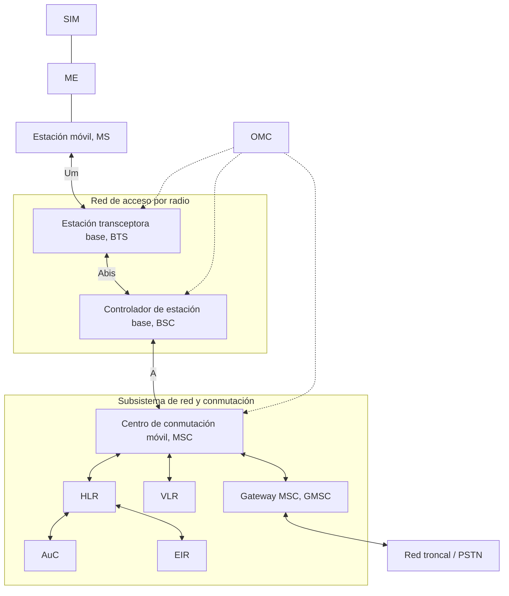
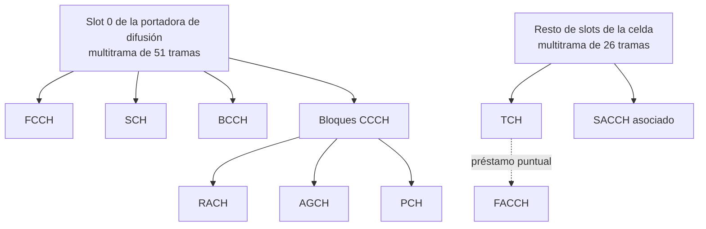
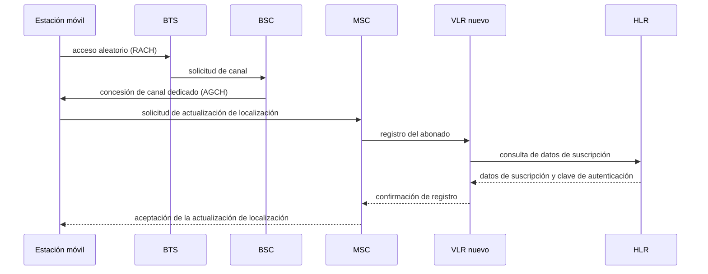

El **Global System for Mobile Communications** (GSM) es el sistema celular de segunda
generación que digitalizó las comunicaciones móviles y las dotó de un estándar único
adoptado a escala mundial. Este capítulo describe su arquitectura de red, la interfaz
radio que sostiene el acceso de los terminales, el catálogo de canales lógicos con su
correspondencia sobre el canal físico, la organización de sus protocolos y los
mecanismos de seguridad del abonado. La evolución hacia la conmutación de paquetes que
GSM hizo posible, con GPRS, UMTS y HSPA, se trata en un capítulo propio.

## Introducción

GSM utiliza conmutación de circuitos y ofrece servicios básicos de telefonía, mensajería
de texto, datos y fax, además de servicios suplementarios. Como cualquier sistema
celular, organiza la cobertura en celdas servidas por una estación base y reutiliza el
espectro disponible entre celdas suficientemente alejadas, según el principio general
descrito en
[concepto celular y reutilización de frecuencias](../01_fundamentos_celulares/section_1_concepto_celular.md).
GSM se compone de tres subsistemas: la **red de acceso por radio**, que conecta a los
usuarios móviles; el **subsistema de red**, que gestiona la conmutación, el registro de
abonados y la movilidad; y el **subsistema de operación y mantenimiento**, que se
encarga de la suscripción, la tarificación y la gestión del rendimiento de la red. Los
apartados siguientes desarrollan estos tres subsistemas, la interfaz radio que conecta
al terminal con la red de acceso, los canales lógicos que circulan por ella, la
organización de los protocolos de señalización y los mecanismos de seguridad del
abonado.

## Arquitectura

La arquitectura de GSM separa con claridad la red de acceso por radio, encargada de la
transmisión y de las funciones específicas del medio radioeléctrico, de la red central,
encargada de la conmutación y de la gestión de la movilidad y de los abonados. Ambas se
comunican a través de interfaces normalizadas que permiten sustituir el equipo de un
fabricante por el de otro en cualquiera de los dos extremos.

La interfaz `Um` conecta la estación móvil con la estación base y es la única que
atraviesa el medio radioeléctrico; el resto de interfaces, `Abis` entre la estación base
y su controlador y `A` entre el controlador y el centro de conmutación, transportan
tráfico y señalización sobre enlaces fijos.

### Estación móvil y módulo de identificación de abonado

La **estación móvil** (_mobile station_, MS) es el terminal del usuario y se compone de
dos partes independientes. El **equipo móvil** (_mobile equipment_, ME) es el hardware y
el sistema operativo del terminal, identificado de forma única por su `IMEI`. El
**módulo de identificación de abonado** (`SIM`) contiene la información de suscripción,
la clave secreta empleada en la autenticación y el cifrado, y la última área de
localización visitada. La separación entre ambos permite a un abonado cambiar de
terminal sin cambiar de identidad ante la red, y viceversa. Los identificadores que
distinguen al abonado del terminal, y las áreas y celdas por las que ambos se mueven, se
tratan de forma común a todas las generaciones en
[identificadores de usuario y de celda](../01_fundamentos_celulares/section_2_movilidad_y_recursos_radio.md#identificadores-de-usuario-y-de-celda).

### Subsistema de estaciones base

El **subsistema de estaciones base** (_base station subsystem_, BSS) forma la red de
acceso por radio y se compone de dos elementos. La **estación transceptora base** (_base
transceiver station_, BTS) proporciona la cobertura de una celda y realiza las funciones
propias del medio radioeléctrico: transmisión y recepción, cifrado, multiplexación y
recuperación del sincronismo. Una BTS puede alojar hasta 16 transceptores como valor
típico de equipo, no como límite normativo, cada uno operando sobre una portadora
distinta, todos gestionados por el mismo controlador. El **controlador de estación
base** (_base station controller_, BSC) envía órdenes a las BTS que tiene a su cargo,
recibe de ellas informes y alarmas, y ejecuta los comandos que le llegan del centro de
conmutación. Sus funciones incluyen la configuración de las BTS, la gestión de los
recursos de radio y el control de las conexiones.

### Subsistema de red y conmutación

El **subsistema de red** (_network switching subsystem_, NSS) gestiona la conmutación de
circuitos, el registro de los abonados y su movilidad. El **centro de conmutación
móvil** (_mobile switching center_, MSC) conmuta las llamadas entre estaciones móviles,
asigna los recursos de radio y ejecuta los procedimientos de registro de ubicación y de
traspaso. El **Gateway MSC** (GMSC) es un MSC especializado en la conexión con otras
redes, como la red pública de comunicaciones móviles terrestres (PLMN) o la red
telefónica pública conmutada (PSTN), y actúa como punto de entrada de las llamadas que
llegan desde el exterior hacia un abonado de la red.

### Registros de localización y centro de autenticación

Tres bases de datos completan el subsistema de red. El **registro de ubicación de
origen** (_home location register_, HLR) almacena de forma permanente los datos de
suscripción de todos los abonados de la red y conoce, en todo momento, el área de
localización en la que se encuentra cada uno de ellos. El **registro de ubicación de
visitante** (_visitor location register_, VLR) mantiene una copia local de los datos de
los abonados que se encuentran bajo la cobertura del MSC al que está asociado, lo que
reduce la señalización que de otro modo tendría que dirigirse al HLR para cada
procedimiento. El **centro de autenticación** (AuC) almacena las claves de autenticación
y de cifrado de cada abonado; ni la clave del abonado ni la clave de cifrado viajan
nunca por la interfaz radio, solo lo hace el valor aleatorio del que se derivan, según
se detalla en el apartado de seguridad de este capítulo. Un cuarto registro, el
**registro de identidad de equipos** (EIR), mantiene la lista de equipos móviles
reconocidos por la red y permite bloquear terminales robados o mal configurados a partir
de su `IMEI`.

La organización de las **áreas de localización** que agrupan las celdas bajo un mismo
`LAC`, y el procedimiento de **aviso de llamada** con el que la red localiza a un
terminal inactivo, siguen en GSM el mismo principio que en cualquier otra generación,
descrito en
[localización del terminal](../01_fundamentos_celulares/section_2_movilidad_y_recursos_radio.md#localizacion-del-terminal).
Lo específico de GSM es el canal por el que ese aviso circula, tratado más adelante en
el apartado de canales lógicos, y el registro en el que la red anota el área vigente de
cada abonado, que es el VLR bajo el que ese abonado se encuentra registrado en cada
momento.

### Subsistema de operación y mantenimiento

El **subsistema de operación y mantenimiento** (OSS) reduce los costes de explotación de
la red al centralizar la suscripción, la tarificación, la generación de estadísticas, la
configuración y la gestión del rendimiento. Su elemento operativo es el **centro de
operación y mantenimiento** (OMC), que supervisa el resto de elementos de la red,
incluidas las BTS, los BSC y los MSC, y desde el que se despliegan los cambios de
configuración y se recogen las alarmas de todo el sistema.

## Interfaz radio

### Multiplexación en frecuencia y en tiempo

GSM combina dos técnicas de multiplexación para repartir el espectro disponible entre
los usuarios de una celda. El **acceso múltiple por división en frecuencia** (`FDMA`)
divide la banda asignada al operador en **portadoras** de 200 kHz, cada una capaz de
soportar de forma independiente su propio tráfico. Sobre cada portadora actúa, además,
un **acceso múltiple por división en tiempo** (`TDMA`) que reparte su capacidad en 8
_slots_, de modo que hasta 8 usuarios distintos pueden compartir la misma portadora sin
interferirse entre sí. El enlace ascendente y el enlace descendente emplean portadoras
distintas separadas por una banda de duplexación fija, lo que constituye una duplexación
por división en frecuencia (`FDD`); los fundamentos generales de la multiplexación por
división en frecuencia y en tiempo, incluidos los conceptos de banda y de intervalo de
guarda, se tratan en
[multiplexación](../../01_fundamentos/04_acceso_al_medio/section_1_multiplexacion.md) y
no se repiten aquí. Lo propio de GSM es la cifra concreta de portadora y de _slot_ que
determina cuántos canales físicos caben en una asignación de espectro dada. GSM admite
además, de forma opcional, un
[salto de frecuencia](../01_fundamentos_celulares/section_2_movilidad_y_recursos_radio.md#salto-de-frecuencia)
lento que cambia la portadora de una comunicación una vez por trama TDMA, es decir, cada
$4{,}615$ ms, frente a los saltos mucho más rápidos que emplean otros sistemas de acceso
múltiple.

???+ example "Canales de tráfico disponibles en una asignación de espectro GSM"

    Un operador recibe una asignación de $2{,}6$ MHz por sentido de transmisión para
    desplegar GSM. Se pide el número de canales de tráfico simultáneos que soporta esa
    asignación, suponiendo que una de las portadoras actúa como portadora de difusión y
    dedica su primer _slot_ a un canal combinado de señalización común y dedicada, sin
    quedar disponible para tráfico.

    El número de portadoras que caben en la banda asignada, con un espaciado entre
    portadoras de 200 kHz, es

    $$
    N_\text{portadoras} = \frac{2600\ \text{kHz}}{200\ \text{kHz}} = 13\ \text{portadoras}
    $$

    Cada portadora aporta 8 canales físicos por división en tiempo. De las 13
    portadoras, 12 dedican sus 8 _slots_ íntegramente a tráfico, mientras que la
    portadora de difusión pierde un _slot_ para señalización y aporta solo 7. El número
    total de canales de tráfico simultáneos es, por tanto,

    $$
    N_\text{TCH} = 12 \times 8 + 1 \times 7 = 96 + 7 = 103\ \text{canales de tráfico}
    $$

    de modo que la celda puede atender hasta 103 comunicaciones de voz de forma
    simultánea con esa asignación de espectro.

### Trama, multitrama y ráfaga

La unidad de transmisión más pequeña de la interfaz radio de GSM es la **ráfaga**
(_burst_), el intervalo de tiempo que ocupa un _slot_ y que dura $0{,}577$ ms. Ocho
ráfagas consecutivas, una por cada _slot_, forman una **trama** TDMA de

$$
T_\text{trama} = 8 \times 0{,}577\ \text{ms} = 4{,}615\ \text{ms}
$$

La modulación empleada sobre cada ráfaga es `GMSK` (_Gaussian minimum shift keying_),
una modulación de fase continua de envolvente constante que tolera bien la no linealidad
de los amplificadores de los terminales.

Varias tramas se agrupan en una **multitrama** para organizar la señalización que no
cabe en una sola trama, siguiendo el mismo principio de jerarquía temporal que cualquier
sistema TDM, descrito con carácter general en
[multiplexación por división en tiempo](../../01_fundamentos/04_acceso_al_medio/section_1_multiplexacion.md#multiplexacion-por-division-en-tiempo).
GSM define dos multitramas de duración distinta según el tipo de canal que transportan:
la **multitrama de 26 tramas**, empleada por los canales de tráfico, y la **multitrama
de 51 tramas**, empleada por los canales de difusión y de control.

| Unidad         | Composición | Duración                               |
| -------------- | ----------- | -------------------------------------- |
| Ráfaga         | 1 _slot_    | $0{,}577$ ms                           |
| Trama TDMA     | 8 ráfagas   | $4{,}615$ ms                           |
| Multitrama TCH | 26 tramas   | $26 \times 4{,}615 = 120$ ms           |
| Multitrama CCH | 51 tramas   | $51 \times 4{,}615 \approx 235{,}4$ ms |

La multitrama de 26 tramas dedica 24 tramas a canales de tráfico, 1 trama a señalización
de control asociada lenta y 1 trama sin uso, de modo que un canal de tráfico ocupa su
_slot_ en 24 de cada 26 tramas y libera brevemente ese _slot_, cada 120 ms, para
transportar señalización asociada sin necesidad de un canal aparte. La multitrama de 51
tramas organiza en cambio los canales de difusión y de control común, descritos en el
apartado siguiente.

### Balance de potencia del enlace

El alcance de una celda GSM no depende de un solo enlace, sino del más restrictivo de
los dos: el enlace descendente, de la estación base hacia el terminal, y el enlace
ascendente, del terminal hacia la estación base. El **balance de potencia del enlace**
compara, para cada sentido, la potencia que llega al receptor con el umbral de
sensibilidad que ese receptor necesita para demodular correctamente la señal, siguiendo
el mismo modelo de cadena de transmisión que se describe con carácter general en
[pérdidas de propagación en espacio libre](../../01_fundamentos/02_canal/section_1_propagacion_y_perdidas.md#perdidas-de-propagacion-en-espacio-libre).
Las pérdidas de propagación máximas que tolera el enlace, $L_\text{max}$, resultan de
sumar la potencia transmitida $P_\text{tx}$ y las ganancias de antena $G_\text{tx}$ y
$G_\text{rx}$, y de restar las pérdidas de cable y duplexor $L_\text{cable}$ y el umbral
de sensibilidad del receptor $S_\text{rx}$, expresado en dBm y por tanto negativo:

$$
L_\text{max}\ \lbrack \text{dB}\rbrack = P_\text{tx} + G_\text{tx} + G_\text{rx} -
L_\text{cable} - S_\text{rx}
$$

???+ example "Balance de potencia de una celda GSM en enlace ascendente y descendente"

    Una estación base transmite con una potencia $P_\text{tx,BTS} = 43$ dBm y una
    ganancia de antena $G_\text{BTS} = 18$ dBi, con unas pérdidas de cable y duplexor de
    $L_\text{cable} = 3$ dB en cada sentido. El terminal transmite con una potencia
    $P_\text{tx,MS} = 33$ dBm y una ganancia de antena $G_\text{MS} = 0$ dBi. La
    sensibilidad del receptor del terminal es $S_\text{MS} = -102$ dBm y la del receptor
    de la estación base, algo mejor por disponer de diversidad de recepción, es
    $S_\text{BTS} = -104$ dBm. Se pide determinar cuál de los dos enlaces limita el
    alcance de la celda.

    Las pérdidas de propagación máximas que tolera el enlace descendente, de la
    estación base al terminal, son

    $$
    L_\text{DL} = 43 + 18 + 0 - 3 - (-102) = 160\ \text{dB}
    $$

    y las que tolera el enlace ascendente, del terminal a la estación base, son

    $$
    L_\text{UL} = 33 + 0 + 18 - 3 - (-104) = 152\ \text{dB}
    $$

    El enlace ascendente tolera 8 dB menos de pérdidas que el descendente, de modo que
    es el enlace ascendente el que limita el alcance máximo de la celda: aunque la
    estación base dispone de mejor sensibilidad y de ganancia de antena en ambos
    sentidos, la menor potencia de transmisión del terminal, 10 dB por debajo de la de
    la estación base, no llega a compensarse con esas ventajas. Este resultado es el
    habitual en GSM y justifica que el dimensionado de cobertura de una celda se realice
    normalmente a partir del enlace ascendente.

## Canales lógicos

La información que circula por la interfaz radio se organiza en tres capas. El **canal
lógico** identifica el tipo de información que se transporta, el **canal de transporte**
define cómo se transporta esa información y el **canal físico** define por dónde se
transporta, es decir, la combinación concreta de portadora, _slot_ y posición dentro de
la multitrama. Tráfico y señalización atraviesan las mismas capas de protocolo, pero
circulan por canales distintos. Los apartados siguientes catalogan los canales lógicos
de GSM; su correspondencia final sobre el canal físico se trata en el último apartado de
esta sección.

### Canales de tráfico

Los **canales de tráfico** (_traffic channels_, TCH) transportan el flujo de datos del
usuario mediante conmutación de circuitos. Existen a dos velocidades: el canal de
tráfico de tasa completa (_full rate_), que transporta la voz codificada a 13 kbit/s
netos dentro de un _slot_ completo, y el canal de tráfico de media tasa (_half rate_),
que comparte un mismo _slot_ entre dos usuarios a costa de una calidad de voz algo
inferior. Ambos admiten
[transmisión discontinua](../01_fundamentos_celulares/section_2_movilidad_y_recursos_radio.md#transmision-discontinua),
que suspende la transmisión durante los silencios de la conversación para reducir el
consumo de energía del terminal y la interferencia generada sobre las celdas vecinas.

### Canales de difusión

El **canal de difusión** (_broadcast channel_, BCH) transporta información común a todos
los terminales de una celda, sin destinatario individual. Incluye tres canales: el
**canal de control de difusión** (BCCH), que transmite la configuración de canales de la
celda, los parámetros de sincronización y la información necesaria para el aviso de
llamada; el **canal de corrección de frecuencia** (FCCH), que proporciona la referencia
de frecuencia exacta que deben emplear los terminales; y el **canal de sincronización**
(SCH), que contiene el código de identidad de la estación base y el número de trama
necesario para que el terminal se sincronice con ella.

### Canales de control común

El **canal de control común** (CCCH) transporta señalización punto a multipunto,
dirigida a cualquier terminal de la celda sin que exista todavía una conexión
individualizada. Incluye tres canales: el **canal de acceso aleatorio** (RACH), por el
que un terminal solicita a la red un canal de señalización sin reserva previa, descrito
con carácter general en
[canal de acceso aleatorio](../01_fundamentos_celulares/section_2_movilidad_y_recursos_radio.md#canal-de-acceso-aleatorio);
el **canal de concesión de acceso** (AGCH), por el que la red responde a esa solicitud
asignando un canal de control dedicado; y el **canal de aviso de llamada** (PCH), por el
que la red localiza a un terminal inactivo ante una comunicación entrante, siguiendo el
procedimiento descrito con carácter general en
[aviso de llamada](../01_fundamentos_celulares/section_2_movilidad_y_recursos_radio.md#aviso-de-llamada).
Lo propio de GSM es la estructura de bloques de la multitrama de 51 tramas sobre la que
circulan el PCH y el AGCH, que se retoma en el apartado de correspondencia con canales
físicos.

### Canales de control dedicado

El **canal de control dedicado** (DCCH) transporta señalización punto a punto, dirigida
a un terminal ya identificado por la red. Incluye tres canales: el **canal de control
dedicado independiente** (SDCCH), que transporta la señalización de un procedimiento,
como una actualización de localización o el establecimiento de una llamada, antes de que
se asigne un canal de tráfico; el **canal de control asociado lento** (SACCH), que
acompaña a un canal de tráfico o a un SDCCH ya asignados para transportar mediciones de
sincronización y control de potencia sin interrumpir el canal al que se asocia; y el
**canal de control asociado rápido** (FACCH), que sustituye de forma temporal a un canal
de tráfico para transmitir señalización de alta prioridad, como la orden de un traspaso,
tomando prestados los bits de un intervalo de tráfico cuando la urgencia de la
señalización lo justifica.

| Canal   | Nombre completo                       | Sentido       | Función                                              |
| ------- | ------------------------------------- | ------------- | ---------------------------------------------------- |
| `TCH`   | Traffic Channel                       | Bidireccional | Voz o datos de usuario                               |
| `BCCH`  | Broadcast Control Channel             | Descendente   | Configuración de la celda                            |
| `FCCH`  | Frequency Correction Channel          | Descendente   | Referencia de frecuencia                             |
| `SCH`   | Synchronization Channel               | Descendente   | Identidad de celda y sincronización de trama         |
| `RACH`  | Random Access Channel                 | Ascendente    | Solicitud de acceso sin reserva previa               |
| `AGCH`  | Access Grant Channel                  | Descendente   | Concesión de un canal dedicado                       |
| `PCH`   | Paging Channel                        | Descendente   | Aviso de llamada a un terminal inactivo              |
| `SDCCH` | Stand-alone Dedicated Control Channel | Bidireccional | Señalización sin canal de tráfico asignado           |
| `SACCH` | Slow Associated Control Channel       | Bidireccional | Medidas y control de potencia asociados a otro canal |
| `FACCH` | Fast Associated Control Channel       | Bidireccional | Señalización urgente sobre un canal de tráfico       |

### Correspondencia con canales físicos

La correspondencia entre canales lógicos y canal físico depende del _slot_ que ocupan.
El _slot_ 0 de la portadora de difusión de una celda transporta, dentro de su multitrama
de 51 tramas, el FCCH, el SCH, el BCCH y los bloques de CCCH que llevan el RACH, el AGCH
y el PCH, todos multiplexados en el tiempo sobre ese único _slot_. Los _slots_ restantes
de esa portadora, y todos los _slots_ del resto de portadoras de la celda, transportan
canales de tráfico junto con su SACCH asociado, organizados sobre la multitrama de 26
tramas descrita en el apartado de trama y multitrama. Un SDCCH, cuando la celda lo
dedica a un _slot_ propio en lugar de combinarlo con el canal de difusión, sigue el
mismo esquema de multitrama de 51 tramas que el CCCH.

???+ example "Capacidad del canal de aviso de llamada de una celda"

    Se supone, para este ejercicio, que una celda reserva 8 bloques de la multitrama de
    51 tramas a la señalización del canal de aviso de llamada, y que cada bloque
    transporta hasta 2 avisos cuando se emplea el formato de mensaje que codifica las
    identidades de los terminales avisados como identidades temporales. Se pide la
    capacidad máxima de la celda en avisos por hora, y si esa capacidad basta para
    atender una carga ofrecida de $200\,000$ avisos por hora.

    El número de multitramas de 51 tramas que se completan en una hora es

    $$
    N_\text{multitramas/h} = \frac{3600\ \text{s}}{51 \times 4{,}615\times 10^{-3}\
    \text{s}} = \frac{3600}{0{,}2354} \approx 15\,297\ \text{multitramas/h}
    $$

    Con 8 bloques de aviso por multitrama y 2 avisos por bloque, la capacidad máxima del
    canal de aviso de llamada de la celda es

    $$
    C_\text{PCH} = 15\,297 \times 8 \times 2 \approx 244\,752\ \text{avisos/h}
    $$

    Esa capacidad supera la carga ofrecida de $200\,000$ avisos por hora, de modo que la
    celda puede atenderla sin descartar avisos con la configuración de bloques
    considerada. El dimensionado de este canal, cuando el aviso no atendido se
    retransmite en lugar de descartarse, sigue el mismo procedimiento que cualquier
    canal de señalización con espera, tratado en
    [dimensionado del canal de aviso de llamada](../../06_trafico/01_colas/section_2_erlang_y_dimensionado.md#dimensionado-del-canal-de-aviso-de-llamada).

## Protocolos

### Plano de usuario y plano de control

GSM emplea protocolos separados para el plano de usuario y el plano de control. El
**plano de usuario** transporta los datos propios de la comunicación, voz o datos, sin
interpretarlos. El **plano de control** transporta la señalización que establece,
mantiene y libera esa comunicación, y que además gestiona procedimientos que no
requieren ninguna comunicación de usuario en curso, como la actualización de
localización o el aviso de llamada. Ambos planos comparten los mismos elementos de red,
pero circulan por canales lógicos distintos, catalogados en el apartado anterior.

### Señalización en la red troncal

La señalización de GSM se apoya en dos protocolos según el tramo de red que atraviesa.
En la red de acceso por radio, la interfaz `Um` emplea una variante del protocolo de
enlace de datos LAPD, denominada LAPDm, adaptada a la naturaleza por ráfagas del medio
radioeléctrico; la interfaz `Abis`, entre la estación base y su controlador, emplea LAPD
sin modificar. En la red central, la señalización entre el controlador de estación base,
el centro de conmutación y los registros de localización se apoya en el sistema de
señalización `SS7`, el mismo empleado en la red telefónica fija, lo que permite
reutilizar la infraestructura de señalización existente del operador.

La actualización de localización de la figura anterior asigna al abonado un nuevo VLR,
lo que obliga a este a consultar los datos de suscripción al HLR; una actualización
dentro del área servida por el mismo VLR no necesita repetir esa consulta, porque el VLR
ya dispone de una copia local de esos datos.

## Seguridad

### Autenticación del abonado

GSM autentica al abonado mediante un procedimiento de reto y respuesta que nunca expone
la clave secreta por la interfaz radio. La red envía al terminal un número aleatorio,
`RAND`, generado por el AuC. El terminal, empleando la clave secreta almacenada en su
SIM y un algoritmo de autenticación denominado `A3`, calcula una **respuesta firmada**
(`SRES`) a partir de ese número aleatorio y la devuelve a la red. La red, que ha
calculado de forma independiente el mismo `SRES` esperado a partir de la copia de la
clave que guarda el AuC, autentica al abonado si ambos valores coinciden. Ni la clave
secreta del abonado ni el `SRES` calculado viajan nunca en claro más allá de lo
estrictamente necesario para esta comparación, y la clave nunca sale del AuC ni de la
SIM.

### Cifrado de la comunicación

A partir del mismo número aleatorio `RAND` y de la clave secreta del abonado, un segundo
algoritmo, `A8`, deriva una **clave de cifrado** (`Kc`) distinta de la clave secreta y
específica de esa sesión. Esa clave alimenta el algoritmo de cifrado `A5`, que cifra la
información que circula por la interfaz radio entre el terminal y la estación base. El
cifrado de GSM protege únicamente el tramo radioeléctrico, `Um`; el resto de la red,
incluida la interfaz `Abis` y la red troncal, no queda cifrado por este mecanismo y su
protección, cuando existe, depende de mecanismos propios de esos tramos.

## Servicios ofrecidos

GSM ofrece servicios de voz sobre conmutación de circuitos a 13 kbit/s, mensajería corta
(`SMS`), fax, transmisión de datos sobre circuito conmutado y buzón de voz, además de
servicios suplementarios como el desvío o la retención de llamadas. La transmisión de
datos por conmutación de paquetes, con capacidades y servicios propios muy superiores a
los del circuito conmutado, llega a la red con GPRS y se trata en el capítulo siguiente.
