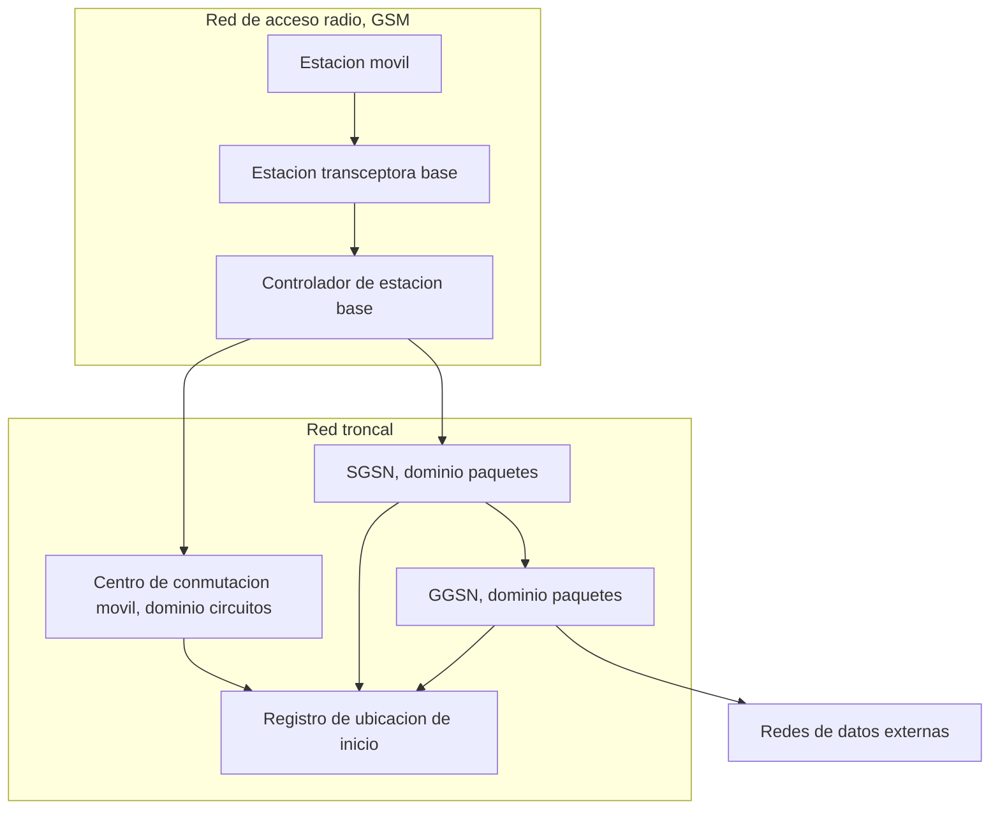
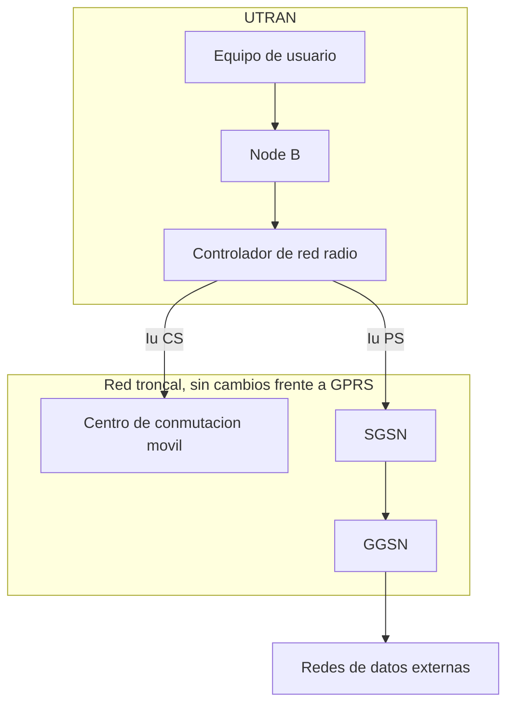

La arquitectura de segunda generación nace pensada para la voz conmutada por circuitos y
no incorpora ningún mecanismo para tratar el tráfico de datos como un flujo de paquetes
independiente. Este capítulo recorre la evolución que corrige esa limitación en dos
pasos sucesivos: primero la introducción de un dominio de paquetes sobre la arquitectura
existente, y después el reemplazo completo de la red de acceso radio por una diseñada
desde el origen para conmutación de paquetes y para un ancho de banda mayor. El
resultado final de ese recorrido es la familia de mejoras conocida como HSPA, que lleva
la capacidad de datos de la red de tercera generación a un orden de magnitud superior al
de su despliegue inicial.

## Introducción

El dominio de paquetes se incorpora a la red móvil sin sustituir el dominio de
circuitos, sino añadiéndose a él. Los nodos que gestionan ese dominio nuevo, el **nodo
de soporte de servicio GPRS** (_Serving GPRS Support Node_, SGSN) y el **nodo de soporte
de pasarela GPRS** (_Gateway GPRS Support Node_, GGSN), se incorporan a la red troncal
existente sin reemplazar ninguno de sus elementos de conmutación de circuitos. La
tercera generación aprovecha esos mismos nodos de paquetes como ancla del núcleo de red
y sustituye, en su lugar, la red de acceso radio completa: la estación base y su
controlador dan paso a una arquitectura de acceso radio terrestre diseñada para un
acceso múltiple por división de código, con un factor de ensanchamiento y un control de
potencia que exige el propio medio compartido en frecuencia. Sobre esa red de acceso ya
orientada a paquetes se despliega, por último, la evolución de alta velocidad que da
nombre a la última parte de este capítulo, HSPA, que introduce un planificador rápido en
la propia estación base y una adaptación de enlace agresiva para exprimir la capacidad
del canal compartido tanto en el enlace descendente como en el ascendente.

## GPRS

El **servicio general de paquetes por radio** (_General Packet Radio Service_, GPRS)
introduce la conmutación de paquetes en la red móvil como una evolución de la red GSM,
con la que ofrece una mayor capacidad de datos y una conexión más eficiente que la
conmutación de circuitos que GSM reserva para todo su tráfico. GPRS no reemplaza la red
de acceso radio de GSM: reutiliza su interfaz radio y añade, sobre la misma
infraestructura física, los elementos de núcleo de red y los mecanismos de asignación de
recursos que hacen posible tratar los datos del usuario como paquetes independientes en
lugar de como un circuito reservado durante toda la comunicación.

### Nodos de soporte de servicio y de pasarela

El **nodo de soporte de pasarela GPRS** (GGSN) actúa como punto de acceso principal
entre la red móvil y las redes de datos externas, con la capacidad de encaminar los
paquetes recibidos desde el exterior hacia la ubicación actual del terminal móvil al que
van dirigidos. Para resolver esa ubicación, el GGSN accede al registro de ubicación de
inicio, el mismo elemento de la red troncal que ya sostiene la movilidad del dominio de
circuitos en GSM. El **nodo de soporte de servicio GPRS** (SGSN) gestiona, por su parte,
la movilidad y el cifrado del tráfico de paquetes de los terminales que sirve, de forma
análoga a como el centro de conmutación móvil gestiona la movilidad del dominio de
circuitos. Ambos nodos comparten además una función que no tiene equivalente en el
dominio de circuitos original de GSM, tal como se describe para su arquitectura en
[GSM](section_1_gsm.md#arquitectura): recopilar los datos necesarios para la
tarificación del tráfico de paquetes, que se factura por volumen de datos transferido y
no por duración de conexión.

<figure markdown="span">

<figcaption>
Incorporación del dominio de paquetes GPRS sobre la arquitectura de red de acceso y de
red troncal de GSM.
</figcaption>

</figure>

### Asignación dinámica de recursos radio

El dominio de circuitos de GSM asigna a cada llamada de voz un canal de tráfico dedicado
durante toda la duración de la comunicación, con independencia de si el usuario está
hablando en cada instante concreto. GPRS invierte ese criterio para el tráfico de datos:
la asignación de recursos radio es **dinámica**, se determina únicamente cuando el
terminal realiza una solicitud de transmisión concreta, y se gestiona de forma
independiente para el enlace ascendente y para el enlace descendente, en lugar de
reservar un recurso simétrico y permanente como hace un canal de voz. Esta asignación
por demanda es la que permite que varios usuarios de datos compartan de forma eficiente
los mismos intervalos de tiempo de la trama GSM sin necesidad de que cada uno mantenga
un canal exclusivo mientras no transmite.

### Canales de datos por paquetes

Los canales de datos por paquetes (_Packet Data Traffic Channel_, PDTCH) transportan el
tráfico de usuario del dominio de paquetes sobre la misma estructura física de trama y
ráfaga que emplea GSM para sus canales de tráfico convencionales. La diferencia frente a
un canal de tráfico de voz no está en la forma física de la trama, sino en cómo se
asignan sus intervalos de tiempo: un PDTCH no pertenece en exclusiva a un único usuario
durante toda la comunicación, sino que la red puede reasignar sus intervalos entre
distintos usuarios de datos según la demanda instantánea de cada uno, siguiendo el mismo
principio de asignación dinámica del apartado anterior. Un terminal con tráfico
suficiente puede además recibir varios intervalos de tiempo simultáneos dentro de la
misma trama, lo que multiplica su régimen binario disponible frente al de un único
intervalo, sin que ello exija ningún cambio en el ancho de banda de portadora empleado
por el sistema.

### Convivencia con el tráfico de voz

GPRS comparte el espectro y la estructura de trama con el tráfico de voz de GSM en lugar
de disponer de una banda separada, de modo que la red debe repartir los mismos
intervalos de tiempo entre ambos dominios según la carga de cada uno en cada celda. Esa
convivencia se resuelve marcando qué intervalos de una trama están disponibles para
tráfico de paquetes en cada momento, de forma que la voz, con requisitos de retardo más
estrictos, mantiene la prioridad sobre la reserva base de intervalos, mientras que los
datos ocupan de forma flexible los intervalos que la voz deja libres y pueden expandirse
o contraerse según fluctúa esa demanda de voz. La ventaja de tratar los datos como
tráfico por paquetes, frente a asignarles también un canal dedicado como a la voz, se
aprecia con claridad al comparar cuánto tiempo ocupa realmente cada modo un recurso
radio durante una misma sesión de usuario.

???+ example "Ocupación de canal en modo circuitos y en modo paquetes en una sesión"

    Un usuario mantiene una sesión de datos de $T = 180$ s de duración, durante la cual
    transmite tres ráfagas de información de $2$ s, $3$ s y $1$ s respectivamente,
    separadas por intervalos de inactividad mientras consulta el contenido recibido. El
    tiempo total de transmisión activa es, por tanto,

    $$
    t_{\text{activo}} = 2 + 3 + 1 = 6\ \text{s}
    $$

    Si esa sesión se sirviera con un canal dedicado, como los que GSM reserva para la
    voz, el canal quedaría asignado en exclusiva a ese usuario durante los $180$ s
    completos, porque el procedimiento de asignación de un canal de circuitos fija el
    recurso para toda la duración de la llamada con independencia de cuándo fluyen
    datos por él. La fracción de ese tiempo reservado que corresponde a transmisión
    real es

    $$
    \frac{t_{\text{activo}}}{T} = \frac{6}{180} \approx 0{,}033
    $$

    es decir, solo un $3{,}3\ \%$ del tiempo de reserva se emplea en transmitir algo, y
    el $96{,}7\ \%$ restante mantiene el canal ocupado sin ningún dato en tránsito. Con
    asignación dinámica de recursos, el canal solo se ocupa durante los $6$ s de
    transmisión activa y queda libre para otros usuarios el resto de la sesión, de modo
    que la misma sesión permite repartir el recurso liberado entre hasta

    $$
    \frac{T}{t_{\text{activo}}} = \frac{180}{6} = 30
    $$

    sesiones equivalentes en el mismo intervalo de tiempo, si ese tiempo liberado se
    redistribuye de forma perfecta entre otros usuarios con un patrón de tráfico
    similar. El resultado ilustra por qué introducir conmutación de paquetes sobre el
    mismo espectro multiplica el número de usuarios de datos que una celda puede
    atender, sin necesidad de ningún ancho de banda adicional, para servicios cuyo
    tráfico es intermitente en lugar de continuo.

## UMTS

El **servicio universal de telecomunicaciones móviles** (_Universal Mobile
Telecommunication Service_, UMTS) sustituye la red de acceso radio de GSM por una
diseñada desde el origen para el acceso múltiple por división de código, mientras
conserva los nodos de paquetes que GPRS ya había incorporado a la red troncal. Es, en
ese sentido, la evolución que completa el tránsito hacia una red orientada a paquetes
que GPRS solo empieza: cambia por completo cómo el terminal accede al medio radio, pero
no cambia los nodos que anclan ese tráfico de paquetes en la red troncal.

### Red de acceso radio terrestre

La **red de acceso radio terrestre UMTS** (_UMTS Terrestrial Radio Access Network_,
UTRAN) es la parte de UMTS encargada de la gestión de la radio, y ocupa en la
arquitectura la misma posición funcional que la estación base y su controlador ocupan en
GSM. UTRAN se compone de dos tipos de elementos: el **Node B**, equivalente funcional de
la estación transceptora base, que transmite y recibe la señal radio en cada celda; y el
**controlador de red radio** (_Radio Network Controller_, RNC), equivalente funcional
del controlador de estación base, que gestiona los recursos radio de los Node B que
tiene bajo su control y toma las decisiones de
[traspaso](../01_fundamentos_celulares/section_2_movilidad_y_recursos_radio.md#traspaso)
y de
[control de potencia](../01_fundamentos_celulares/section_2_movilidad_y_recursos_radio.md#control-de-potencia)
que exige el acceso por división de código. El RNC se conecta con la red troncal
mediante la interfaz **Iu**, que se divide en una rama hacia el dominio de circuitos,
Iu-CS, y una rama hacia el dominio de paquetes, Iu-PS, reflejando en la propia interfaz
la coexistencia de ambos dominios que ya introdujo GPRS.

### Evolución desde la arquitectura GPRS

El cambio de red de acceso no exige sustituir el SGSN ni el GGSN: ambos nodos siguen
gestionando la movilidad, el cifrado y la tarificación del dominio de paquetes
exactamente con el mismo papel que tenían en GPRS, solo que ahora reciben el tráfico de
paquetes desde el RNC a través de la interfaz Iu-PS en lugar de recibirlo desde el
controlador de estación base de GSM. El dominio de circuitos experimenta un cambio
simétrico: el centro de conmutación móvil sigue gestionando la conmutación de circuitos
y la movilidad de ese dominio sin ninguna modificación de fondo, solo que ahora recibe
el tráfico desde el RNC a través de Iu-CS en lugar de hacerlo desde el controlador de
estación base. La migración de GPRS a UMTS es, en consecuencia, un cambio concentrado
por completo en la red de acceso radio, mientras la red troncal conserva su reparto
entre dominio de circuitos y dominio de paquetes sin alteración estructural.

<figure markdown="span">

<figcaption>
Sustitución de la red de acceso radio en la transición de GPRS a UMTS, con la interfaz
Iu repartida entre el dominio de circuitos y el dominio de paquetes.
</figcaption>

</figure>

### Acceso múltiple por división de código

UTRAN emplea el acceso múltiple por división de código como técnica de acceso radio,
sobre un enlace de ensanchado directo con un ritmo de chip fijo de $R_c = 3{,}84$
Mchip/s, común a todos los usuarios del sistema. La asignación de códigos ortogonales de
longitud variable a cada usuario, el mecanismo de ensanchamiento espectral que sostiene
esa técnica y los límites de capacidad que introduce se desarrollan en
[espectro ensanchado y CDMA](../../01_fundamentos/04_acceso_al_medio/section_3_espectro_ensanchado_y_cdma.md),
que no se repiten aquí. Lo que corresponde a este capítulo es cómo UMTS aplica esa
técnica genérica a un sistema real: el ritmo de chip fijo de $3{,}84$ Mchip/s determina,
junto con el factor de ensanchamiento asignado a cada usuario, el régimen binario bruto
disponible antes de aplicar la codificación de canal.

???+ example "Régimen binario bruto de un canal dedicado según su ensanchamiento"

    Un usuario de datos por paquetes recibe un canal físico dedicado con factor de
    ensanchamiento $SF = 32$, modulado en QPSK, que transporta dos bits por símbolo. La
    velocidad de símbolo que permite ese factor de ensanchamiento con el ritmo de chip
    fijo del sistema es

    $$
    R_s = \frac{R_c}{SF} = \frac{3{,}84 \cdot 10^6}{32} = 120\,000\ \text{simbolos/s}
    $$

    y el régimen binario bruto, antes de descontar la redundancia introducida por la
    codificación de canal, resulta de multiplicar esa velocidad de símbolo por los dos
    bits que transporta cada símbolo QPSK,

    $$
    R_b = 2 \, R_s = 2 \cdot 120\,000 = 240\,000\ \text{bit/s} = 240\ \text{kbit/s}
    $$

    Reducir el factor de ensanchamiento a la mitad, a $SF = 16$, duplicaría tanto la
    velocidad de símbolo como el régimen binario bruto resultante, hasta $480$ kbit/s,
    porque ambas magnitudes son inversamente proporcionales al factor de ensanchamiento
    a ritmo de chip constante. Esa misma relación inversa es la que, en el árbol de
    códigos OVSF, exige repartir la capacidad entre menos usuarios de régimen binario
    alto o más usuarios de régimen binario bajo, según se ilustra en el ejemplo
    siguiente.

    Un árbol de códigos OVSF proporciona exactamente $SF$ códigos mutuamente
    ortogonales en su nivel de factor de ensanchamiento $SF$, siempre que ninguno de
    ellos tenga un antecesor o un descendiente ya asignado en otro nivel del árbol,
    según se describe en detalle en el capítulo de espectro ensanchado. Si toda la
    capacidad del sistema se dedicara a servicios de $SF = 64$, como podría ser un
    servicio de datos de régimen binario moderado, el número máximo de usuarios
    simultáneos que el árbol de códigos admite a ese régimen, sin recurrir a ningún
    otro nivel de factor de ensanchamiento, es igual al propio factor de ensanchamiento
    empleado,

    $$
    N_{\max}(SF=64) = 64\ \text{usuarios}
    $$

    un límite que procede exclusivamente de la disponibilidad de códigos y que se suma,
    sin sustituirlo, al límite de interferencia que impone la relación señal a
    interferencia del sistema.

### Control de potencia en lazo abierto, interno y externo

El control de potencia en sus tres lazos, abierto, interno y externo, y el efecto
cerca-lejos que lo motiva en el enlace ascendente de un sistema por división de código
se describen en
[control de potencia](../../01_fundamentos/04_acceso_al_medio/section_3_espectro_ensanchado_y_cdma.md#efecto-cerca-lejos-y-control-de-potencia).
La particularidad de UTRAN frente a la descripción genérica de ese apartado es la
cadencia con la que opera su lazo interno: la trama radio de UMTS se divide en $15$
intervalos de $\frac{2}{3}$ ms cada uno, y el lazo interno ajusta la potencia una vez
por intervalo, lo que fija su frecuencia de actualización en $1500$ ajustes por segundo.
Esa cadencia, muy superior a la variación de las pérdidas de propagación por distancia,
es la que permite al lazo interno seguir de cerca las fluctuaciones rápidas del
desvanecimiento sin dejar que el efecto cerca-lejos degrade a los usuarios más alejados
del Node B.

### Traspaso suave

El traspaso suave, el traspaso duro y el traspaso más suave se definen con carácter
genérico, junto con el resto de causas y variantes de traspaso, en
[traspaso duro, suave y más suave](../01_fundamentos_celulares/section_2_movilidad_y_recursos_radio.md#traspaso-duro-suave-y-mas-suave).
UMTS es el caso donde el traspaso suave se vuelve especialmente relevante, porque un
sistema por división de código puede reutilizar la misma frecuencia portadora en celdas
vecinas sin planificación de frecuencias, a diferencia de GSM. Esa reutilización total
permite que un terminal mantenga conexiones simultáneas con el Node B origen y con el
Node B destino durante la transición sin necesidad de cambiar de frecuencia, y que el
receptor combine ambas señales mediante macrodiversidad en lugar de descartar una de
ellas, lo que mejora la calidad del enlace durante el propio traspaso en lugar de
limitarse a evitar la interrupción de la comunicación.

## Clases de calidad de servicio

GSM no incorpora ningún concepto de calidad de servicio diferenciada, porque su único
tráfico es voz conmutada por circuitos con un mismo tratamiento para todos los usuarios.
Esa diferenciación aparece precisamente con la introducción del dominio de paquetes,
porque un canal compartido y asignado dinámicamente sí necesita un criterio para decidir
qué tráfico se atiende con prioridad cuando varios usuarios compiten por el mismo
recurso.

### Clases conversacional, de flujo, interactiva y de fondo

Las clases de calidad de servicio se negocian entre la aplicación y la red en el momento
de establecer una conexión de datos, y predicen el tratamiento que recibirá ese tráfico
frente al resto de tráfico de la celda. La tabla siguiente resume las cuatro clases y el
tipo de servicio que cada una está pensada para atender.

| Clase          | Prioriza                                                                  | Servicio típico                                     |
| -------------- | ------------------------------------------------------------------------- | --------------------------------------------------- |
| Conversacional | Retardo y variación de retardo (_jitter_) mínimos, simetría entre enlaces | Voz, videotelefonía                                 |
| De flujo       | Preservar la relación temporal entre paquetes, tolera más retardo         | Vídeo o audio en continuo                           |
| Interactiva    | Tiempo de ida y vuelta reducido más que el retardo absoluto               | Navegación web, consultas a bases de datos          |
| De fondo       | Sin restricción de retardo, se sirve con recursos ya disponibles          | Descarga de correo, sincronización en segundo plano |

La clase de fondo no compite por recursos con las otras tres: se le asigna únicamente la
capacidad que queda libre una vez servidas las clases con requisitos de retardo más
estrictos, de modo que su tráfico se expande cuando la celda está poco cargada y se
contrae, sin degradar a las demás clases, cuando la carga aumenta.

## HSPA

**HSPA** agrupa las mejoras que UMTS incorpora sobre su red de acceso radio para
soportar mejor el tráfico de datos por paquetes, sin sustituir ni la arquitectura de red
troncal ni la técnica de acceso por división de código descritas en los apartados
anteriores. La mejora se reparte entre el enlace descendente, con **HSDPA** (_High Speed
Downlink Packet Access_), y el enlace ascendente, con **HSUPA** (_High Speed Uplink
Packet Access_), ambas apoyadas en un planificador más rápido situado en el propio Node
B y en una adaptación de enlace más agresiva que la de UMTS en su despliegue inicial.

### Enlace descendente de alta velocidad

HSDPA introduce un canal compartido de enlace descendente, el **canal compartido de
datos de alta velocidad** (_High Speed Downlink Shared Channel_, HS-DSCH), que un mismo
Node B reparte entre varios usuarios mediante multiplexación por división de tiempo en
lugar de asignar un canal dedicado a cada uno. Un usuario puede recibir de forma
simultánea hasta $15$ códigos OVSF sobre ese canal compartido, lo que multiplica su
régimen binario instantáneo frente al de un único código, y el sistema incorpora
esquemas de modulación adicionales, QPSK y $16$-QAM, junto con codificación adaptativa,
que se ajustan en cada intervalo de transmisión a la calidad del canal medida por el
terminal. La combinación de los $15$ códigos con $16$-QAM en la categoría de terminal
más extendida en el despliegue inicial de HSDPA sitúa el régimen binario de pico del
orden de $14$ Mbit/s, muy por encima del régimen binario bruto de un canal dedicado
convencional de UMTS calculado en el ejemplo anterior. El mecanismo de retransmisión de
paquetes que acompaña a esa adaptación de modulación y codificación no es propio de
HSDPA: es la retransmisión híbrida descrita en
[adaptación de enlace y retransmisión](../../01_fundamentos/05_codificacion/section_3_adaptacion_de_enlace_y_retransmision.md#harq),
que HSDPA aplica sin ninguna variante adicional sobre su canal compartido.

### Enlace ascendente de alta velocidad

HSUPA aplica al enlace ascendente el mismo principio que HSDPA aplica al descendente,
mediante un canal físico de datos dedicado mejorado, el **canal físico dedicado
ascendente mejorado** (_Enhanced Dedicated Physical Data Channel_, E-DPDCH), que admite
varios códigos en paralelo y una adaptación de modulación y codificación equivalente a
la del enlace descendente. El régimen binario de pico que alcanza HSUPA en su categoría
de terminal más extendida es del orden de $5$ a $6$ Mbit/s, sensiblemente inferior al de
HSDPA porque el enlace ascendente sigue estando limitado por la potencia máxima de
transmisión de un terminal móvil, una restricción que no afecta del mismo modo a un Node
B con alimentación fija. HSDPA y HSUPA no son mejoras independientes: se despliegan de
forma conjunta y complementaria en la práctica, y su combinación es precisamente la que
da nombre a HSPA como evolución única de UMTS orientada a paquetes.

### Planificación de paquetes y adaptación de enlace

El elemento que hace posible la velocidad de HSPA no es solo la modulación adicional,
sino trasladar la decisión de qué usuario transmite en cada intervalo desde el RNC hasta
el propio Node B, lo que reduce drásticamente el tiempo entre medir la calidad del canal
y aplicar esa decisión. Ese **planificador** de paquetes puede seguir una política tan
simple como el turno rotatorio entre usuarios activos, que reparte los intervalos por
igual sin considerar la calidad instantánea del canal de cada uno, o una política que
prioriza en cada intervalo al usuario con mejor calidad de canal en ese instante
concreto, a costa de una equidad menor entre usuarios. La decisión de qué modulación y
qué tasa de codificación emplear para el usuario seleccionado en cada intervalo es
exactamente la adaptación de enlace descrita con carácter general en
[adaptación de enlace y retransmisión](../../01_fundamentos/05_codificacion/section_3_adaptacion_de_enlace_y_retransmision.md),
que no se repite aquí: lo que aporta HSPA es situar esa decisión en el Node B, con un
intervalo de transmisión de pocos milisegundos, en lugar de en el RNC con la latencia
adicional que introduce la interfaz Iub.

## Limitaciones de capacidad y respiración de celda

Los dos límites de capacidad de un sistema por división de código, el límite de códigos
disponibles en el árbol OVSF y el límite de interferencia que fija la relación señal a
interferencia, se desarrollan con su fórmula completa en
[límites de capacidad de un sistema CDMA](../../01_fundamentos/04_acceso_al_medio/section_3_espectro_ensanchado_y_cdma.md#limites-de-capacidad-de-un-sistema-cdma),
junto con la respiración de celda que ambos límites provocan de forma conjunta al variar
la carga de tráfico. HSPA no introduce un tercer límite de capacidad distinto, pero
desplaza el peso relativo de los dos ya existentes: un canal compartido que asigna hasta
$15$ códigos a un único usuario, como se ha visto para HSDPA, consume de golpe una
fracción mucho mayor del árbol OVSF que cualquier canal dedicado de UMTS convencional,
de modo que en una celda con tráfico de datos de alta velocidad dominante el límite de
códigos tiende a alcanzarse antes que el límite de interferencia, invirtiendo el
equilibrio entre ambos límites que resulta más habitual en un sistema con tráfico de voz
predominante.
