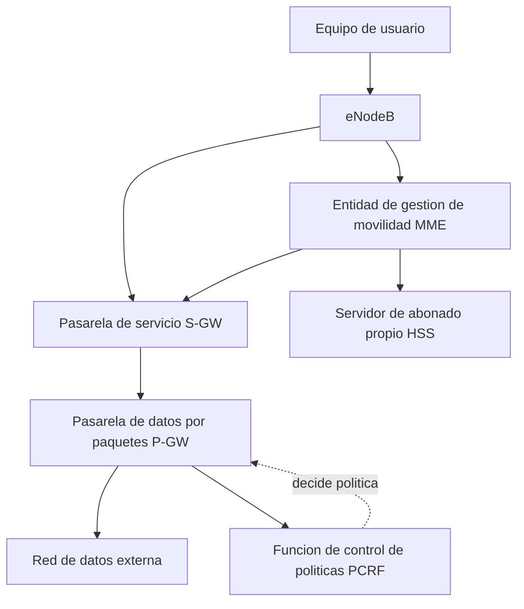
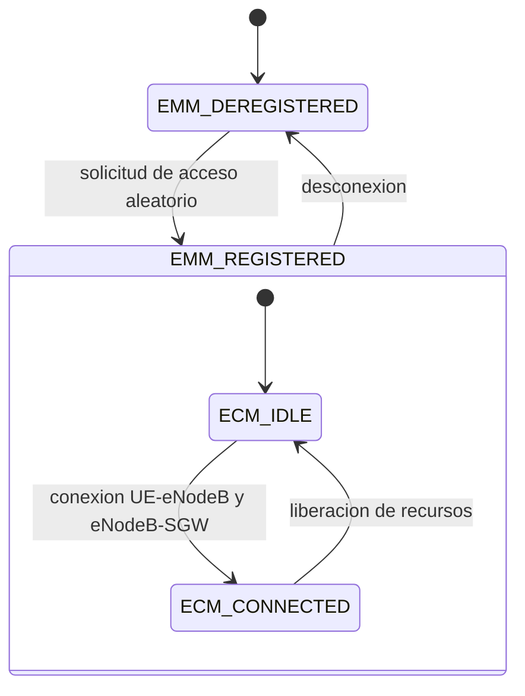

LTE se despliega sobre una infraestructura completa denominada **sistema de paquetes
evolucionado** (Evolved Packet System, `EPS`), formada por una red de acceso radio y una
red troncal rediseñadas desde cero para el transporte de paquetes. Este capítulo
describe esa red troncal: sus elementos, las interfaces que los conectan, los protocolos
de túnel que transportan el tráfico entre ellos, los mecanismos de movilidad a nivel IP
en los que se apoya, los estados por los que atraviesa un terminal y el modelo de
calidad de servicio que sostiene sus portadores.

## Introducción

El `EPS` divide sus responsabilidades en dos partes con papeles claramente separados. La
primera es la **red de acceso radio evolucionada** (Evolved UTRAN, `E-UTRAN`), que
conecta a los terminales con la red mediante la interfaz radio de LTE. La segunda es la
**red troncal evolucionada** (Evolved Packet Core, `EPC`), resultado del proyecto de
evolución de la arquitectura del sistema (System Architecture Evolution, `SAE`) que le
da nombre en parte de la literatura técnica: `SAE` designa el proyecto de rediseño y
`EPC` designa la red troncal que ese proyecto produjo, de modo que ambos términos
conviven en las fuentes para referirse al mismo conjunto de elementos.

Este capítulo se centra por completo en la `EPC`: sus elementos, las interfaces y
protocolos de túnel que los conectan, la movilidad a nivel IP que sostiene la
continuidad de una sesión mientras el terminal cambia de punto de conexión, los estados
por los que atraviesa un terminal frente a la red central y el modelo de calidad de
servicio con el que se gestionan sus **portadores** (_bearer_). La estructura de la
interfaz radio, su malla de recursos, sus canales físicos y la pila de protocolos que
gestiona la transmisión sobre esa interfaz se tratan en los capítulos siguientes de esta
generación, dedicados en exclusiva a la red de acceso.

## Visión general del sistema

### Red de acceso y red troncal

La **red de acceso radio evolucionada** (`E-UTRAN`) conecta a los terminales con la
`EPC` a través de la estación base de LTE, el `eNodeB`. Este capítulo no describe la
interfaz aérea que el `eNodeB` gestiona frente al terminal, tratada en los capítulos
siguientes de esta generación, sino su papel como puerta de entrada de la `E-UTRAN`
hacia la red troncal: el `eNodeB` implementa una arquitectura sin controlador
centralizado y puede depender de varios conjuntos de elementos de la red troncal a la
vez, lo que le da flexibilidad y redundancia frente al modelo jerárquico de generaciones
anteriores.

La **red troncal evolucionada** (`EPC`) admite la transmisión de paquetes de datos y
sostiene la infraestructura de servicios del sistema. Se centra en el transporte de
paquetes, mientras que las llamadas de voz se prestan mediante el subsistema multimedia
IP (`IMS`), una red de siguiente generación construida sobre la misma infraestructura de
paquetes pero ajena al alcance de este capítulo.

### Evolución de la arquitectura del sistema

La arquitectura de `LTE-SAE` reduce la latencia frente a las generaciones anteriores al
eliminar el controlador centralizado de la red de acceso. En las arquitecturas previas,
un controlador intermedio entre la estación base y la red troncal concentraba funciones
de gestión de movilidad y de recursos radio. `LTE-SAE` traslada parte de ese
procesamiento a la propia estación base, el `eNodeB`, y traslada el resto, en particular
el control de la ubicación del terminal, a la red troncal. El resultado es una
**arquitectura plana**, con un único salto lógico entre la estación base y los elementos
de la red troncal, en lugar de la jerarquía de varios niveles de las generaciones
anteriores.

Esta reorganización también redistribuye la función de autenticación. La entidad de
gestión de movilidad de la red troncal, junto con el servidor que almacena los datos de
suscripción del usuario, concentra en `EPS` la función que en generaciones anteriores
correspondía a un centro de autenticación independiente: no existe en `EPS` un elemento
equivalente y separado, sino que esa responsabilidad se reparte entre los dos elementos
que ya forman parte del modelo de la red troncal, descritos en el apartado siguiente.

!!! note

    Las femtoceldas, desplegadas como estaciones base domésticas en bandas licenciadas,
    dependen de una conexión seguridad hacia la red troncal para su _backhaul_, porque
    su ubicación en un entorno no controlado por el operador exige proteger ese enlace
    frente a accesos no autorizados. Este requisito de seguridad adicional complica su
    gestión frente a una estación base convencional, cuyo _backhaul_ discurre por
    infraestructura del propio operador.

## Elementos de la red troncal

Cada elemento de la `EPC` asume una responsabilidad concreta dentro del sistema, y su
combinación es lo que permite separar, según se detalla más adelante, el plano de
control centrado en la señalización del plano de usuario centrado en el transporte de
los datos.

### Entidad de gestión de movilidad

La **entidad de gestión de movilidad** (Mobility Management Entity, `MME`) actúa como
nodo de control de la red troncal. Procesa la señalización entre el terminal y la red
central, administra los portadores y las conexiones asociadas a cada terminal, y
garantiza la seguridad de las comunicaciones entre la red y el terminal mediante
autenticación mutua y establecimiento de claves. Cuando un terminal se conecta a la red,
el `MME` crea un contexto específico para él y le asigna una identidad temporal de
abonado, la `S-TMSI`, que sustituye a su identidad permanente en la mayor parte de la
señalización posterior. El `MME` gestiona también la movilidad del terminal mientras
permanece sin conectividad activa, coordinando el aviso de llamada hacia las celdas de
su área de seguimiento.

### Pasarela de servicio

La **pasarela de servicio** (Serving Gateway, `S-GW`) transmite todos los paquetes IP
del plano de usuario. Actúa como ancla de movilidad durante las transiciones de
traspaso, redirigiendo los paquetes hacia la nueva ubicación del terminal, y retiene la
información de los portadores mientras el terminal permanece inactivo, sin conectividad
activa con la red. Realiza además un seguimiento de la ubicación del usuario a nivel de
área de seguimiento cuando el terminal está inactivo, y facilita la conectividad en
situaciones de itinerancia, cuando el terminal se conecta desde una red visitada.

### Pasarela de red de datos por paquetes

La **pasarela de red de datos por paquetes** (PDN Gateway, `P-GW`) controla la
transmisión de paquetes hacia y desde las redes de datos externas. Asigna la dirección
IP a cada terminal, aplica las políticas de calidad de servicio siguiendo las reglas que
recibe de la función de control de políticas, y factura el tráfico de datos según los
flujos que gestiona. Filtra los paquetes IP del enlace descendente según su calidad de
servicio y funciona como punto de anclaje de movilidad para mantener la continuidad de
la comunicación mientras el terminal se desplaza.

### Servidor de abonado propio

El **servidor de abonado propio** (Home Subscriber Server, `HSS`) almacena los datos de
suscripción de cada usuario, sus perfiles de calidad de servicio y las restricciones de
acceso aplicables cuando el usuario se encuentra en itinerancia. Es el elemento que la
entidad de gestión de movilidad consulta para verificar la identidad de un terminal y
para obtener los parámetros con los que garantizar una experiencia de usuario
consistente, con independencia de la red visitada desde la que se conecte.

### Función de control de políticas y tarificación

La **función de control de políticas y tarificación** (Policy Control and Charging Rules
Function, `PCRF`) toma las decisiones de control de políticas y autoriza la calidad de
servicio de cada flujo de datos. No ejecuta esas decisiones directamente: se limita a
decidirlas y a supervisar su cumplimiento, mientras que la ejecución concreta, el
filtrado de paquetes y la aplicación efectiva de la calidad de servicio, corre a cargo
de una función de ejecución de políticas, la `PCEF`, que reside dentro de la pasarela de
red de datos por paquetes. La separación entre quién decide una política de calidad de
servicio, la `PCRF`, y quién la ejecuta sobre el tráfico real, la `PCEF` alojada en el
`P-GW`, es la clave para entender por qué una misma decisión de calidad de servicio
aparece descrita en ocasiones como una función del `PCRF` y en otras como una función
del `P-GW`: ambas descripciones son correctas porque se refieren a fases distintas del
mismo mecanismo.



## Interfaces y protocolos de túnel

### Interfaz S1

La **interfaz S1** conecta la red de acceso con la red troncal y se divide en dos planos
con protocolos y funciones distintas. El plano de control, `S1-MME`, utiliza el
protocolo `S1-AP` sobre `SCTP/IP` para la señalización entre el `eNodeB` y la entidad de
gestión de movilidad. A través de él se gestionan los portadores de acceso radio
(E-RAB), se transfiere el contexto inicial del terminal, se comunica su información de
capacidad, se da soporte a la movilidad de terminales dentro de LTE, se realiza el aviso
de llamada, se administra la propia interfaz `S1` y se transporta la señalización del
subsistema de acceso a la red junto con la información necesaria para las redes de
autooptimización.

El plano de usuario, `S1-U`, se encarga de la transferencia de los datos del usuario
entre el `eNodeB` y la pasarela de servicio. Transporta el tráfico de los portadores
identificado mediante puntos de túnel de origen y destino del protocolo de túnel `GPRS`,
junto con las direcciones IP correspondientes, lo que permite asignar categorías de
tráfico diferenciadas según su calidad de servicio.

### Interfaces S5 y S8

Las **interfaces S5 y S8** gestionan los túneles del plano de usuario entre la pasarela
de servicio y la pasarela de datos por paquetes. La interfaz `S5` es la variante que se
emplea cuando ambas pasarelas pertenecen a la misma red, mientras que `S8` es la
variante de itinerancia que se emplea cuando el terminal se encuentra conectado desde
una red visitada distinta de la de origen. Ambas interfaces se establecen y gestionan
mediante los protocolos `GTP` o `PMIP`, cuya elección determina el mecanismo de
movilidad a nivel IP que sostiene la sesión, según se detalla en el apartado siguiente.

| Interfaz | Plano   | Tramo             | Protocolo                    |
| -------- | ------- | ----------------- | ---------------------------- |
| `S1-MME` | Control | `eNodeB` a `MME`  | `S1-AP` sobre `SCTP/IP`.     |
| `S1-U`   | Usuario | `eNodeB` a `S-GW` | `GTP`.                       |
| `S5`     | Usuario | `S-GW` a `P-GW`   | `GTP` o `PMIP`, misma red.   |
| `S8`     | Usuario | `S-GW` a `P-GW`   | `GTP` o `PMIP`, itinerancia. |

### Protocolo de túnel GPRS

El **protocolo de túnel GPRS** (`GTP`) transporta los datos de usuario tanto en la
interfaz `S1` como en las interfaces `S5` y `S8`, encapsulando cada paquete IP dentro de
un túnel identificado por puntos de túnel de origen y destino específicos de cada
portador. Esta identificación por punto de túnel es la que permite a cada nodo de la red
mantener el registro de la correlación entre las identidades de portador que utiliza en
cada una de sus interfaces, un registro imprescindible para que la calidad de servicio
asignada a un portador se preserve de forma coherente a lo largo de todo su recorrido.

### Encapsulado genérico de encaminamiento

El **encapsulado genérico de encaminamiento** (Generic Routing Encapsulation, `GRE`) se
emplea para identificar y diferenciar flujos de tráfico individuales dentro de un mismo
túnel. Su papel es complementario al de `GTP` y al de `PMIP`: mientras estos gestionan
el establecimiento y el enrutamiento del túnel entre las pasarelas, `GRE` resuelve el
problema de multiplexar el tráfico de varios usuarios o de varios flujos distintos
dentro de ese mismo túnel sin confundir unos con otros.

???+ example "Recorrido de un paquete desde el terminal hasta una red externa"

    Un terminal conectado a una celda LTE envía un paquete IP destinado a un
    servidor de Internet. El paquete recorre tres tramos con protocolos de túnel
    distintos antes de abandonar la red del operador.

    En el primer tramo, entre el terminal y el `eNodeB`, el paquete viaja sobre el
    portador radio establecido para esa sesión, sin túnel `GTP` todavía, porque
    este primer salto pertenece a la red de acceso y no a la red troncal. En el
    segundo tramo, el `eNodeB` encapsula el paquete en un túnel `GTP` de la
    interfaz `S1-U` con destino la pasarela de servicio, identificado por los
    puntos de túnel de origen y destino asignados a ese portador. En el tercer
    tramo, la pasarela de servicio reencapsula el paquete en un nuevo túnel, esta
    vez sobre la interfaz `S5` si ambas pasarelas pertenecen a la misma red, con
    destino la pasarela de datos por paquetes. Ese tercer túnel puede establecerse
    con `GTP`, en cuyo caso conserva la misma lógica de puntos de túnel que el
    tramo anterior, o con `PMIP`, en cuyo caso la pasarela de servicio y la
    pasarela de datos por paquetes asumen los papeles de movilidad a nivel IP que
    se describen en el apartado siguiente. Al llegar a la pasarela de datos por
    paquetes, el paquete se desencapsula por completo y se encamina hacia la red
    externa como un datagrama IP ordinario, sin ningún resto de la encapsulación
    de túnel que ha atravesado.

## Movilidad en el nivel IP

### Limitaciones de la pila IP

La pila de protocolos IP básica no incorpora funcionalidades de movilidad por defecto.
Cuando un terminal cambia su punto de conexión a la red, debe obtener una nueva
dirección IP, lo que obliga a reiniciar cualquier sesión IP que tuviera en curso con la
dirección anterior. Esta limitación es la que motiva los mecanismos de movilidad a nivel
IP descritos a continuación, necesarios porque los túneles `GTP` y `PMIP` de las
interfaces `S5` y `S8` no bastan por sí solos para resolver la continuidad de sesión
cuando la pasarela de datos por paquetes cambia durante la movilidad del terminal.

### IP móvil

El **protocolo IP móvil** (Mobile IP) resuelve esta limitación permitiendo que el
terminal cambie su punto de conexión mientras mantiene activas las sesiones IP en curso.
Es una solución basada en el propio terminal, que requiere software de movilidad
instalado en él, y se apoya en dos direcciones: la **dirección de inicio** (Home
Address, `HoA`), fija y asociada a la red de origen del terminal, y la **dirección de
atención** (Care-of Address, `CoA`), que cambia cada vez que el terminal se conecta
desde una ubicación distinta. El resto de la red sigue dirigiendo el tráfico a la `HoA`,
y un agente en la red de origen se encarga de reenviarlo hacia la `CoA` vigente en cada
momento.

### IP móvil por delegación

El **IP móvil por delegación** (Proxy Mobile IPv6, `PMIPv6`) traslada la responsabilidad
de la movilidad desde el terminal hacia la red, de modo que el terminal mantiene su
sesión mientras se desplaza sin necesitar ningún software de movilidad propio. En
`PMIPv6`, la red asume por completo el seguimiento de los movimientos del terminal y
ejecuta en su nombre toda la señalización de movilidad necesaria para mantener la sesión
durante esos desplazamientos. Dos componentes concentran esa responsabilidad:

- **Gateway de acceso móvil** (`MAG`): actúa como cliente de IP móvil en nombre del
  terminal. Se encuentra en la red de acceso y gestiona las tareas de movilidad para los
  terminales dentro de su área de cobertura.
- **Anclaje de movilidad local** (`LMA`): desempeña un papel equivalente al del agente
  de inicio de IP móvil tradicional. Se encuentra en la red donde está topológicamente
  ubicada la dirección de inicio del terminal, sirve de punto de anclaje para su
  movilidad y garantiza que los paquetes se reenvíen correctamente a medida que el
  terminal se desplaza.

Cuando la interfaz `S5` o `S8` de una sesión concreta emplea `PMIP` en lugar de `GTP`,
la pasarela de servicio asume el papel de `MAG` y la pasarela de datos por paquetes
asume el papel de `LMA`, lo que reutiliza en la `EPC` los mismos dos elementos que ya
gestionan el plano de usuario para resolver también la movilidad a nivel IP, sin añadir
ningún elemento adicional al modelo descrito en el apartado de elementos de la red
troncal.

## Estados del terminal

### Gestión de movilidad

La **gestión de movilidad** del subsistema de acceso a la red (EPS Mobility Management,
`EMM`) sigue dos estados asociados al registro del terminal ante la entidad de gestión
de movilidad: `EMM-DEREGISTERED`, cuando el terminal no está registrado, por ejemplo
porque se encuentra apagado, y `EMM-REGISTERED`, cuando sí lo está. El paso de
`EMM-DEREGISTERED` a `EMM-REGISTERED` se inicia con una solicitud de acceso aleatorio
del terminal hacia el `eNodeB`, tras la cual la red le asigna los recursos necesarios
para comunicarse.

### Gestión de conectividad

La **gestión de conectividad** del subsistema de acceso a la red (EPS Connection
Management, `ECM`) sigue, de forma independiente al estado de registro, dos estados
asociados a la existencia de conectividad activa entre el terminal y la red troncal:
`ECM-IDLE`, cuando no existe esa conectividad, y `ECM-CONNECTED`, cuando sí existe. El
paso de `ECM-IDLE` a `ECM-CONNECTED` requiere establecer conexión tanto entre el
terminal y el `eNodeB` como entre el `eNodeB` y la pasarela de servicio, y se activa
cuando es necesario entregar datos de enlace descendente a un terminal que hasta ese
momento permanecía inactivo.



### Contexto de terminal y seguridad

Cuando un terminal se conecta a la red, la entidad de gestión de movilidad crea un
contexto específico para ese terminal y le asigna su identidad temporal, la `S-TMSI`,
con la que se le referencia en la mayor parte de la señalización posterior en lugar de
su identidad permanente. La seguridad de esa conexión es responsabilidad de la entidad
de gestión de movilidad, que lleva a cabo la autenticación y establece las claves de
seguridad correspondientes. En LTE, la autenticación es mutua: tanto el terminal como la
estación base son autenticados, a diferencia de esquemas anteriores en los que solo el
terminal se autenticaba frente a la red.

???+ example "Establecimiento inicial de conectividad de un terminal apagado"

    Un terminal que se enciende dentro de la cobertura de una celda LTE se
    encuentra en estado `EMM-DEREGISTERED`, sin registro previo ante la entidad de
    gestión de movilidad. El procedimiento por el que alcanza plena conectividad
    involucra a varios elementos de la red, cada uno con una función concreta.

    El terminal inicia el procedimiento con una solicitud de acceso aleatorio
    dirigida al `eNodeB`, sin disponer aún de ningún recurso dedicado. El `eNodeB`
    responde asignándole los recursos necesarios para continuar la señalización, y
    a través de la interfaz `S1-MME` transporta esa señalización hacia la entidad
    de gestión de movilidad. La entidad de gestión de movilidad crea entonces un
    contexto específico para el terminal, consulta al servidor de abonado propio
    los datos de suscripción necesarios para autenticarlo y le asigna su identidad
    temporal, la `S-TMSI`. Una vez completada la autenticación mutua entre el
    terminal y la red, la entidad de gestión de movilidad establece la conexión
    entre el `eNodeB` y la pasarela de servicio, momento en el que el terminal
    pasa de `ECM-IDLE` a `ECM-CONNECTED` y queda en disposición de transmitir y
    recibir datos de usuario a través de la pasarela de servicio y, más allá de
    ella, de la pasarela de datos por paquetes.

    ```mermaid linenums="1"
    sequenceDiagram
        participant UE as Terminal
        participant ENB as eNodeB
        participant MME as MME
        participant HSS as HSS
        participant SGW as S-GW
        UE->>ENB: solicitud de acceso aleatorio
        ENB-->>UE: asignacion de recursos
        ENB->>MME: señalizacion NAS via S1-MME
        MME->>HSS: consulta de datos de suscripcion
        HSS-->>MME: perfil de autenticacion
        MME->>UE: autenticacion mutua y asignacion de S-TMSI
        MME->>SGW: establecimiento de conexion S1-U
        SGW-->>MME: confirmacion de portador establecido
    ```

## Calidad de servicio y portadores

### Portadores con y sin tasa garantizada

Cada **portador EPS** se asocia a un portador de una capa inferior a lo largo de cada
interfaz que atraviesa, y cada uno de esos portadores de capa inferior lleva su propia
identificación. Por esta razón, cada nodo de la red debe mantener el registro de la
correlación entre las identificaciones de portador que emplea en sus distintas
interfaces, el mismo registro que sostiene el protocolo de túnel `GTP` descrito más
arriba. Un terminal puede ejecutar varias aplicaciones de forma simultánea, cada una con
requisitos de calidad de servicio distintos, lo que exige que cada portador cuente con
una configuración de calidad de servicio adecuada a la aplicación que transporta.

Existen dos categorías de portadores. Los **portadores de tasa de bits garantizada
mínima** (Guaranteed Bit Rate, `GBR`) están diseñados para aplicaciones que requieren un
rendimiento mínimo y un _throughput_ constante, como la voz sobre IP, y son esenciales
para servicios en tiempo real. Los **portadores no `GBR`** están destinados a
aplicaciones que no requieren una tasa de bits garantizada, como la navegación web o la
transferencia de ficheros, y se asemejan a los servicios de la categoría "_background_"
de generaciones anteriores.

### Plantillas de flujo de tráfico

Las **plantillas de flujo de tráfico** (Traffic Flow Templates, `TFT`) gestionan la
asignación de los paquetes de datos al portador que les corresponde. Utilizan
información de la cabecera IP de cada paquete para filtrarlo y dirigirlo hacia el
portador adecuado según su calidad de servicio, limitando su tasa máxima de
transferencia y garantizando, cuando corresponde, su tasa mínima, lo que asegura un
flujo de datos óptimo para cada aplicación.

### Identificador de clase de calidad

El **identificador de clase de calidad** (QoS Class Identifier, `QCI`) influye en la
gestión de colas, en la asignación de recursos y en el modo de funcionamiento de la capa
de control de enlace de radio, al especificar la prioridad del portador, el presupuesto
de retardo de paquete y la tasa de pérdida de paquetes aceptable. Estos parámetros son
los que permiten a la red distinguir, dentro de un mismo portador `GBR`, entre
aplicaciones con requisitos de latencia muy distintos entre sí.

### Prioridad de asignación y retención

El **parámetro de prioridad de asignación y retención** (Allocation and Retention
Priority, `ARP`) se utiliza para el control de admisión de llamadas y para priorizar la
asignación y la retención de recursos entre portadores en competencia. La componente de
asignación determina la prioridad con la que se conceden nuevos recursos, mientras que
la componente de retención determina qué portadores conservan sus recursos ya asignados
frente a otros de menor prioridad cuando la red se encuentra congestionada.

| Parámetro | Elemento que decide           | Efecto principal                                   |
| --------- | ----------------------------- | -------------------------------------------------- |
| `TFT`     | `P-GW`.                       | Filtra y dirige paquetes al portador correcto.     |
| `QCI`     | `PCRF`, ejecutado por `PCEF`. | Fija prioridad, retardo y pérdida admisibles.      |
| `ARP`     | `PCRF`, ejecutado por `PCEF`. | Prioriza la asignación y la retención de recursos. |

???+ example "Selección del portador para tres servicios de un mismo terminal"

    Un terminal mantiene simultáneamente tres servicios: una llamada de voz sobre
    IP, una sesión de navegación web y una reproducción de vídeo en directo. Se
    trata de decidir, para cada uno, si necesita un portador `GBR` o si puede
    resolverse con un portador no `GBR`, y qué elemento de la red troncal
    interviene en esa decisión.

    La llamada de voz sobre IP exige un portador `GBR`, porque su naturaleza en
    tiempo real no tolera una caída del _throughput_ por debajo de un mínimo sin
    degradar la conversación de forma perceptible. La sesión de navegación web se
    resuelve con un portador no `GBR`, porque tolera variaciones de velocidad sin
    que el usuario perciba una degradación equivalente. La reproducción de vídeo
    en directo ocupa una posición intermedia: aunque conceptualmente se beneficia
    de una tasa garantizada, en la práctica se transporta a veces sobre un
    portador no `GBR` cuando el operador prioriza el uso eficiente de los recursos
    radio sobre la garantía estricta de tasa, apoyándose en técnicas de
    almacenamiento en el propio terminal para absorber las variaciones de
    velocidad.

    La decisión de qué calidad de servicio corresponde a cada portador, expresada
    mediante su `QCI` y su `ARP`, la toma la función de control de políticas y
    tarificación, no la pasarela de datos por paquetes. La pasarela de datos por
    paquetes, a través de su función de ejecución de políticas, se limita a
    aplicar esa decisión sobre el tráfico real: filtra los paquetes según la
    plantilla de flujo de tráfico correspondiente y los dirige al portador ya
    decidido. Confundir estos dos papeles, quién decide la calidad de servicio y
    quién la ejecuta, es el error más habitual al describir este mecanismo, y la
    razón por la que conviene fijar con precisión qué elemento hace cada cosa.
