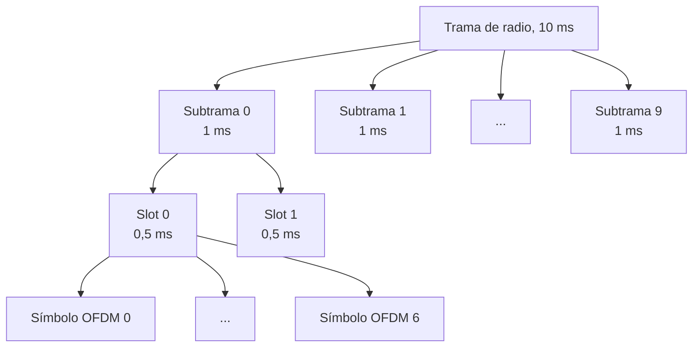
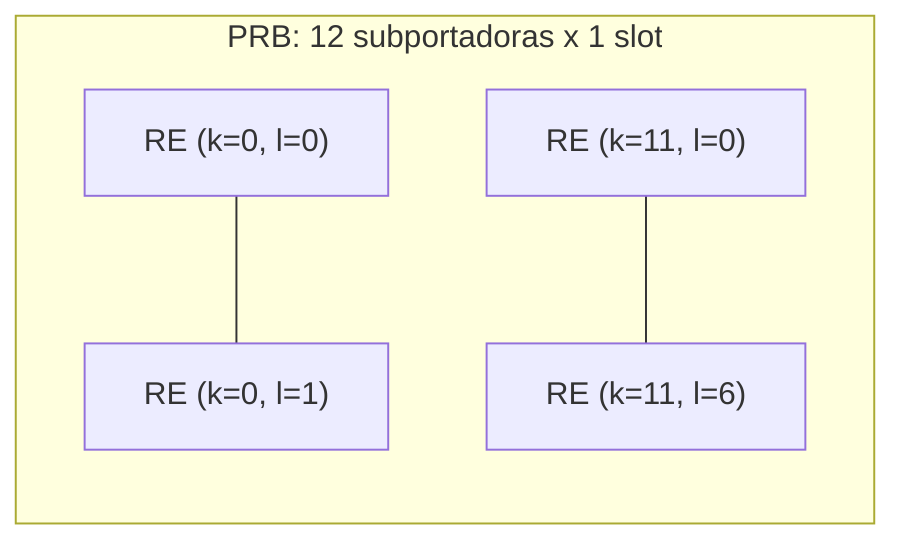

La red de acceso radio de LTE, la `E-UTRAN` introducida en
[arquitectura del sistema de paquetes evolucionado](section_1_arquitectura_eps.md),
transporta sus datos y su señalización sobre una interfaz aérea que particulariza las
técnicas multiportadora genéricas en una malla de recursos concreta, con una
duplexación, unos canales físicos y unas señales de referencia fijados por la norma.
Este capítulo describe esa particularización: cómo LTE genera la señal en cada sentido
del enlace, cómo organiza el tiempo y la frecuencia en tramas, subtramas y bloques de
recurso, cómo sincroniza el terminal con la celda y cómo distribuye las señales de
referencia y los canales físicos sobre la retícula resultante.

## Introducción

LTE hereda de la familia OFDM la solución al problema de transmitir a alta velocidad
sobre un canal con ecos, descrita en
[OFDM y SC-FDM](../../01_fundamentos/04_acceso_al_medio/section_4_ofdm_y_sc_fdm.md), y
fija los grados de libertad que ese capítulo deja abiertos: el número de portadoras, su
separación, la longitud del prefijo cíclico y el reparto de portadoras entre usuarios se
convierten aquí en un conjunto reducido de configuraciones normalizadas, elegidas para
cubrir con margen la dispersión temporal y la movilidad de los entornos de propagación
descritos en
[desvanecimiento y respuesta del canal](../../01_fundamentos/02_canal/section_2_desvanecimiento_y_respuesta_del_canal.md).
El resultado es una malla de recursos común a ambos sentidos del enlace, sobre la que se
distribuyen los canales físicos que transportan datos de usuario, señalización de
control y las señales de referencia que permiten al receptor estimar el canal.

## Generación de señal

LTE emplea generación de señal distinta en cada sentido del enlace, motivada por la
asimetría de recursos entre la estación base y el terminal que
[OFDM y SC-FDM](../../01_fundamentos/04_acceso_al_medio/section_4_ofdm_y_sc_fdm.md)
desarrolla en detalle: el enlace descendente prioriza la eficiencia espectral y la
adaptación selectiva por usuario, mientras que el enlace ascendente prioriza la
eficiencia de potencia del amplificador del terminal.

### OFDMA en el enlace descendente

El enlace descendente utiliza acceso múltiple por división ortogonal de frecuencia,
`OFDMA`, tal como se define en
[acceso múltiple por división ortogonal de frecuencia](../../01_fundamentos/04_acceso_al_medio/section_4_ofdm_y_sc_fdm.md#acceso-multiple-por-division-ortogonal-de-frecuencia).
La estación base calcula una única `IFFT` por símbolo OFDM, colocando en cada
subportadora el símbolo destinado al usuario al que esa subportadora esté asignada. Esta
elección explota la ausencia de restricción de energía del `eNodeB`: al no depender de
una batería, el equipo de la estación base puede operar su amplificador con el retroceso
que exige la relación de potencia de pico a media de OFDM, descrita en
[relación de potencia de pico a media](../../01_fundamentos/04_acceso_al_medio/section_4_ofdm_y_sc_fdm.md#relacion-de-potencia-de-pico-a-media),
a cambio de conservar la independencia entre subportadoras que permite adaptar la
modulación y asignar recursos con granularidad fina por usuario.

### SC-FDMA en el enlace ascendente

El enlace ascendente utiliza en cambio acceso múltiple de portadora única, `SC-FDMA`, la
variante de acceso múltiple de
[multiplexación de portadora única en frecuencia](../../01_fundamentos/04_acceso_al_medio/section_4_ofdm_y_sc_fdm.md#multiplexacion-de-portadora-unica-en-frecuencia).
Cada terminal precodifica sus símbolos con una `DFT` de tamaño igual al número de
subportadoras que tiene asignadas antes de la `IFFT` común de la trama, lo que reduce la
relación de potencia de pico a media en más de dos decibelios frente a OFDMA, con el
coste de perder la independencia entre subportadoras que sí conserva el enlace
descendente. Esa reducción, cuantificada en el ejemplo de
[consecuencias sobre el amplificador y la cobertura](../../01_fundamentos/04_acceso_al_medio/section_4_ofdm_y_sc_fdm.md#consecuencias-sobre-el-amplificador-y-la-cobertura),
es la que justifica destinar la técnica al sentido en el que la potencia disponible es
el recurso escaso: el amplificador del terminal, alimentado por batería y sin el margen
de diseño del equipo de la estación base.

### Modos de duplexación

LTE admite tres modos de duplexación entre el enlace ascendente y el enlace descendente.
La **duplexación por división de frecuencia** (_frequency division duplexing_, `FDD`)
asigna a cada sentido una banda de frecuencia distinta y permite la transmisión
simultánea en ambos sentidos. El **FDD semiduplex** comparte esa separación en
frecuencia pero no transmite en ambos sentidos a la vez, lo que reduce el coste del
terminal al evitar el filtro de separación entre las dos bandas a costa de un
rendimiento menor. La **duplexación por división de tiempo** (_time division duplexing_,
`TDD`) emplea una única banda de frecuencia y reparte el enlace ascendente y el
descendente en instantes de tiempo distintos dentro de la misma trama, lo que permite
ajustar de forma asimétrica la proporción de recursos entre ambos sentidos según la
carga de tráfico prevista, a costa de introducir un periodo de guarda para la
conmutación entre sentidos.

## Malla de recursos

La malla de recursos es la estructura común sobre la que ambos sentidos del enlace
organizan sus subportadoras y sus símbolos, particularizando en valores concretos los
parámetros genéricos de
[parámetros y fórmulas de un sistema OFDM](../../01_fundamentos/04_acceso_al_medio/section_4_ofdm_y_sc_fdm.md#parametros-y-formulas-de-un-sistema-ofdm).

### Intervalo de transmisión

El **intervalo de transmisión de tiempo** (_transmission time interval_, `TTI`) es la
unidad temporal mínima de adaptación y planificación del sistema, y en LTE coincide con
la duración de una subtrama: 1 milisegundo. Toda decisión de asignación de recursos, de
selección de esquema de modulación y codificación y de retransmisión se toma con esa
granularidad temporal.

### Trama, subtrama y slot

La **trama de radio** tiene una duración $T_f = 10\ \text{ms}$ y se divide en diez
subtramas de 1 milisegundo cada una, coincidiendo cada subtrama con un `TTI`. Cada
subtrama se divide a su vez en dos _slots_ de 0,5 milisegundos.

Cada _slot_ contiene un número de símbolos OFDM que depende de la configuración de
prefijo cíclico empleada, descrita más abajo: siete símbolos con prefijo cíclico normal
o seis con prefijo cíclico extendido. La separación entre subportadoras es de $\Delta f
= 15\ \text{kHz}$ en la configuración estándar, valor elegido, según la relación de
compromiso desarrollada en
[dimensionado de la separación entre portadoras y del prefijo cíclico](../../01_fundamentos/04_acceso_al_medio/section_4_ofdm_y_sc_fdm.md#numero-de-portadoras-periodo-de-simbolo-y-periodo-de-guarda),
para mantener el canal aproximadamente plano dentro de cada subportadora sin quedar
excesivamente expuesto al desplazamiento Doppler de un terminal en movimiento.

### Bloque de recurso físico y elemento de recurso

El **elemento de recurso** (_resource element_, `RE`) es la unidad mínima de la malla, y
queda identificado de forma única por un par de índices $(k, l)$ dentro de un `TTI`,
donde $k$ recorre las subportadoras y $l$ los símbolos OFDM del intervalo. El **bloque
de recurso físico** (_physical resource block_, `PRB`) agrupa doce subportadoras
consecutivas en frecuencia y todos los símbolos OFDM de un _slot_ en tiempo, y es la
unidad mínima que el planificador asigna a un usuario: ni el `scheduling` ni la
adaptación de enlace trabajan con una granularidad menor que un `PRB` completo. Su
extensión en frecuencia es fija:

$$
B_\text{PRB} = 12 \times \Delta f = 12 \times 15\ \text{kHz} = 180\ \text{kHz}
$$

y su extensión en tiempo coincide con un _slot_, 0,5 milisegundos, de modo que un par de
`PRB` consecutivos en el mismo par de subportadoras cubre una subtrama completa.

???+ example "Régimen binario máximo de una portadora de 20 MHz"

    Una portadora de 20 MHz aloja $N_\text{RB} = 100$ bloques de recurso con la
    separación estándar de $\Delta f = 15\ \text{kHz}$, cifra coherente con el ejemplo de
    dimensionado de
    [eficiencia y régimen binario](../../01_fundamentos/04_acceso_al_medio/section_4_ofdm_y_sc_fdm.md#eficiencia-y-regimen-binario),
    donde $N_u = 1200$ subportadoras útiles equivalen exactamente a
    $1200 / 12 = 100\ \text{PRB}$. Con prefijo cíclico normal, cada _slot_ contiene 7
    símbolos OFDM y cada subtrama, dos _slots_, aporta 14 símbolos.

    El número de elementos de recurso por subtrama en toda la portadora es el producto
    del número de bloques, las subportadoras por bloque y los símbolos por subtrama:

    $$
    N_\text{RE} = N_\text{RB} \times 12 \times 14 = 100 \times 12 \times 14 = 16\,800
    $$

    Con una modulación de 64-QAM, $\bar{B} = 6$ bits por símbolo, y una tasa de
    codificación $R = 3/4$, tomada del catálogo de esquemas de modulación y codificación
    de
    [esquemas de modulación y codificación](../../01_fundamentos/05_codificacion/section_3_adaptacion_de_enlace_y_retransmision.md#esquemas-de-modulacion-y-codificacion),
    cada elemento de recurso transporta

    $$
    b_\text{RE} = \bar{B}\, R = 6 \times 0{,}75 = 4{,}5\ \text{bit}
    $$

    de información útil. El régimen binario resulta de repartir esos bits entre la
    duración de la subtrama, $1\ \text{ms}$:

    $$
    R_B = N_\text{RE}\, b_\text{RE} \times 1000\ \text{subtramas/s}
    = 16\,800 \times 4{,}5 \times 1000 = 75{,}6\ \text{Mbit/s}
    $$

    Esta cifra es una cota superior teórica sobre los recursos de datos: no descuenta los
    elementos de recurso que ocupan las señales de sincronización, las señales de
    referencia y los canales de control descritos más adelante en este capítulo, cuya
    resta reduce el régimen útil en la práctica.

### Configuraciones de prefijo cíclico

LTE define tres configuraciones de prefijo cíclico (normal, extendida y extendida para
difusión multicelda), que reparten de forma distinta el compromiso entre inmunidad a los
ecos y eficiencia descrito en
[prefijo cíclico](../../01_fundamentos/04_acceso_al_medio/section_4_ofdm_y_sc_fdm.md#prefijo-ciclico).
Las tres comparten una frecuencia de muestreo de referencia $f_M = 30{,}72\ \text{MHz}$,
correspondiente a $N = 2048$ portadoras con $\Delta f = 15\ \text{kHz}$, salvo la
tercera configuración, que emplea una separación entre portadoras la mitad de esa
referencia.

| Configuración                  | Longitud del prefijo | Duración del prefijo   | Símbolos por _slot_ |
| ------------------------------ | -------------------- | ---------------------- | ------------------- |
| Normal, primer símbolo         | $E = 160$ muestras   | $5{,}21\ \mu\text{s}$  | 7                   |
| Normal, resto de símbolos      | $E = 144$ muestras   | $4{,}69\ \mu\text{s}$  | 7                   |
| Extendida                      | $E = 512$ muestras   | $16{,}67\ \mu\text{s}$ | 6                   |
| Extendida, difusión multicelda | $E = 1024$ muestras  | $33{,}33\ \mu\text{s}$ | 3                   |

La configuración normal reserva un prefijo ligeramente más largo para el primer símbolo
de cada _slot_ que para los seis restantes, de modo que la suma de las siete duraciones
complete exactamente los 0,5 milisegundos del _slot_ sin dejar ni sobrar muestras al
muestreo de $30{,}72\ \text{MHz}$. La configuración extendida amplía el prefijo hasta
$16{,}67\ \mu\text{s}$ a costa de reducir a seis los símbolos por _slot_, y se reserva
para entornos con una dispersión temporal mayor que la que cubre el prefijo normal. La
cuarta fila corresponde a la variante de difusión multicelda descrita en
[canales físicos del enlace descendente](#canales-fisicos-del-enlace-descendente), que
emplea además una separación entre portadoras de $\Delta f = 7{,}5\ \text{kHz}$, la
mitad de la estándar, con $N = 4096$ portadoras sobre la misma frecuencia de muestreo de
referencia.

???+ example "Cobertura de la dispersión temporal con prefijo normal o extendido"

    Un entorno urbano macrocelular presenta una dispersión temporal máxima de
    $\Delta\tau_\text{máx} = 4\ \mu\text{s}$, mientras que un entorno rural de celda
    grande, con trayectos reflejados a mayor distancia, alcanza
    $\Delta\tau_\text{máx} = 12\ \mu\text{s}$. La condición de diseño es la misma que
    fija
    [intervalo de guarda](../../01_fundamentos/04_acceso_al_medio/section_4_ofdm_y_sc_fdm.md#intervalo-de-guarda):
    el prefijo debe cubrir, sin margen negativo, la dispersión temporal máxima esperada.

    El prefijo normal de $4{,}69\ \mu\text{s}$ cubre con un margen ajustado el primer
    entorno, cuya dispersión de $4\ \mu\text{s}$ queda apenas por debajo del prefijo
    disponible, pero resulta claramente insuficiente para el segundo, cuyos
    $12\ \mu\text{s}$ de dispersión superan casi en tres veces esa misma cifra y dejarían
    al sistema expuesto a interferencia entre símbolos y entre portadoras. El prefijo
    extendido de $16{,}67\ \mu\text{s}$ sí cubre ambos entornos con margen, a costa de
    reducir la eficiencia del prefijo de

    $$
    \eta_\text{normal} = \frac{2048}{2048 + 144} = 0{,}9343
    $$

    a

    $$
    \eta_\text{extendida} = \frac{2048}{2048 + 512} = 0{,}8
    $$

    Esa caída de casi trece puntos porcentuales en la eficiencia es el precio que paga
    el entorno rural por su mayor dispersión temporal, y justifica que la configuración
    extendida se reserve para los entornos que efectivamente la necesitan, en lugar de
    emplearse de forma generalizada.

## Reutilización de frecuencias

La malla de recursos anterior describe cómo se organiza el espectro dentro de una celda.
La forma en que ese mismo conjunto de subportadoras se reutiliza entre celdas vecinas
sigue el marco general de
[reutilización de frecuencias](../01_fundamentos_celulares/section_1_concepto_celular.md#reutilizacion-de-frecuencias),
que LTE particulariza en tres esquemas.

### Red de frecuencia única

En la **red de frecuencia única** (_single frequency network_), todas las celdas emplean
la totalidad del ancho de banda disponible, sin ningún reparto de subportadoras entre
celdas vecinas. Este esquema equivale a un factor de reutilización $N = 1$ en los
términos de
[tamaño de agrupación y distancia cocanal](../01_fundamentos_celulares/section_1_concepto_celular.md#tamano-de-agrupacion-y-distancia-cocanal),
y su aplicación queda limitada a la zona central de la celda, donde la relación
portadora a interferencia es suficientemente favorable para tolerar la interferencia
cocanal de las celdas vecinas que comparten el mismo espectro.

### Reutilización clásica

La **reutilización clásica** aplica el reparto de canales entre celdas de un clúster,
descrito en el mismo capítulo de fundamentos celulares, en los bordes de la celda, donde
la relación portadora a interferencia es más desfavorable y la reutilización total del
espectro degradaría la calidad del enlace por debajo del umbral aceptable.

### Reutilización fraccional

La **reutilización fraccional de frecuencia** combina los dos esquemas anteriores
dividiendo la banda disponible en varias subbandas, habitualmente cuatro. Los usuarios
próximos al centro de la celda emplean una reutilización de $N = 1$ sobre toda la banda,
mientras que los usuarios del borde de la celda emplean una reutilización de $N = 3$
restringida a una de las subbandas, distinta para cada celda del clúster. El resultado
es un compromiso intermedio entre la capacidad que ofrece la reutilización total y la
calidad que exige el borde de celda, sin sacrificar ninguna de las dos de forma completa
en toda la superficie de la celda.

## Sincronización

Antes de que un terminal pueda decodificar cualquier canal físico, debe sincronizarse
con la trama de la celda y determinar su identidad. LTE resuelve ambos problemas
mediante dos señales de sincronización transmitidas en posiciones fijas de la trama.

### Señales de sincronización primaria y secundaria

La **señal de sincronización primaria** (_primary synchronization signal_, `PSS`)
permite al terminal alinearse con el límite de _slot_ y de símbolo, y transporta parte
de la identidad física de la celda. La **señal de sincronización secundaria**
(_secondary synchronization signal_, `SSS`) se transmite en una posición fija relativa a
la `PSS` y completa la identificación de la celda junto con la sincronización de trama,
al indicar en qué mitad de la trama se encuentra el terminal. La sincronización se
aplica tanto a la frecuencia portadora como a los límites de símbolo, subtrama y trama,
y es un requisito previo para la sincronización de las señales de referencia descritas a
continuación, que depende de conocer con precisión el instante y la frecuencia de
referencia de la celda.

### Identificación de celda

La combinación de las secuencias empleadas en la `PSS` y en la `SSS` codifica el
**identificador físico de celda**, un valor que el terminal recupera durante el proceso
de sincronización y que emplea para generar de forma determinista las secuencias
pseudoaleatorias de las señales de referencia de esa celda, según se describe en el
apartado siguiente. Esta dependencia hace de la sincronización el primer paso obligado
de cualquier procedimiento posterior de estimación de canal.

## Señales de referencia

### Estimación de canal con símbolos piloto

La demodulación coherente que exige el ecualizador de frecuencia de
[ecualizador de frecuencia](../../01_fundamentos/04_acceso_al_medio/section_4_ofdm_y_sc_fdm.md#ecualizador-de-frecuencia)
necesita conocer la ganancia compleja del canal en cada elemento de recurso, y esa
ganancia se estima a partir de **símbolos piloto**: símbolos conocidos de antemano por
el receptor que el transmisor inserta en posiciones predeterminadas de la malla. La
precisión de esa estimación condiciona directamente la calidad de la demodulación, de la
adaptación de modulación y codificación y de las técnicas MIMO, ya que todas ellas
consumen la ganancia de canal estimada como entrada.

### Patrones de pilotos

Las señales de referencia del enlace descendente se generan a partir de secuencias
pseudoaleatorias que se reinician en cada símbolo OFDM en función del identificador de
celda, lo que evita que la inserción de pilotos incremente la relación de potencia de
pico a media de la señal. Los patrones de pilotos evitan las posiciones de la malla
reservadas a las señales de sincronización, y se distribuyen tanto en tiempo como en
frecuencia dentro de cada _slot_, con una densidad suficiente para que la interpolación
posterior reconstruya la respuesta del canal en el resto de elementos de recurso. Los
símbolos piloto pueden transmitirse con hasta 6 decibelios más de potencia que los
símbolos de datos, lo que reduce el error de estimación a costa de aumentar la
interferencia que esa potencia adicional genera hacia celdas vecinas.

### Interpolación

Puesto que los pilotos ocupan solo una fracción de los elementos de recurso, la
respuesta del canal en el resto de posiciones se obtiene mediante **interpolación**
entre los pilotos conocidos, con métodos habituales como la interpolación lineal, la
interpolación mediante _splines_ o la interpolación basada en la transformada de
Fourier. La elección del método no está fijada por la norma, de modo que cada receptor
puede adoptar el algoritmo que mejor equilibre precisión y coste computacional, a costa
de que la calidad de la estimación resultante dependa tanto del ruido del canal como de
la imperfección propia del método de interpolación elegido.

### Señales de referencia del enlace ascendente

El enlace ascendente distingue dos señales de referencia con funciones distintas. La
**señal de referencia de demodulación** (_demodulation reference signal_, `DMRS`)
permite al `eNodeB` estimar el canal sobre los bloques de recurso que el terminal está
utilizando para transmitir datos, y es imprescindible para demodular esa transmisión. La
**señal de referencia de sondeo** (_sounding reference signal_, `SRS`) se transmite en
bandas de frecuencia que el terminal no está utilizando en ese instante, y permite al
`eNodeB` sondear la calidad del canal en esas bandas para decidir la asignación de
recursos en transmisiones futuras. A diferencia de las señales de referencia del enlace
descendente, ambas señales del enlace ascendente no se multiplexan junto con los datos
dentro del mismo símbolo OFDM, sino que ocupan un símbolo completo dedicado en exclusiva
a la señal de referencia, precisamente para no comprometer la ventaja de PAPR de la
precodificación `SC-FDMA`, tal como se justifica en
[secuencias de Zadoff-Chu](../../01_fundamentos/04_acceso_al_medio/section_4_ofdm_y_sc_fdm.md#secuencias-de-zadoff-chu).
Ambas señales se construyen con secuencias de Zadoff-Chu, elegidas por su amplitud
constante y su autocorrelación cíclica ideal.

### Salto de frecuencia

El **salto de frecuencia** de las señales de referencia del enlace ascendente desplaza
la banda de subportadoras empleada de un _slot_ a otro para cada terminal, con el
objetivo de mitigar la complejidad de estimar el canal siempre sobre la misma porción
del espectro. LTE define dos patrones de salto: uno **fijo**, denominado tipo 1, que
sigue una secuencia determinista conocida de antemano por el receptor, y otro
**pseudoaleatorio**, denominado tipo 2, cuya secuencia de saltos varía de forma menos
predecible entre terminales. En ambos casos, el cambio de banda ocurre en el límite
entre _slots_, de modo que dentro de un mismo _slot_ el terminal mantiene fija su
asignación de subportadoras.

## Canales físicos del enlace descendente

El enlace descendente transporta su información sobre varios canales físicos, cada uno
especializado en un tipo de contenido. El **canal físico compartido de enlace
descendente** (`PDSCH`) transporta los datos de usuario y parte de la señalización de
capas superiores. El **canal físico de multidifusión** (`PMCH`) transporta transmisiones
punto a multipunto, y es el canal que emplea la configuración de prefijo cíclico
extendido para difusión multicelda descrita más arriba. El **canal físico de difusión**
(`PBCH`) transporta la información esencial de la celda, y ocupa siempre la misma zona
central en frecuencia y tiempo, con independencia del ancho de banda con el que opere
esa celda, de modo que un terminal que aún no conoce el ancho de banda de la celda puede
localizarlo sin ambigüedad; a cambio, no se transmite en todas las subtramas. El **canal
físico de indicación de formato de control** (`PCFICH`) señala cuántos símbolos OFDM de
cada subtrama están dedicados al control. El **canal físico de indicador de HARQ**
(`PHICH`) transporta las confirmaciones y las peticiones de retransmisión, `ACK`/`NACK`,
para las transmisiones que el terminal ha realizado en el enlace ascendente, dentro del
esquema de retransmisión híbrida descrito en
[HARQ](../../01_fundamentos/05_codificacion/section_3_adaptacion_de_enlace_y_retransmision.md#harq).
El **canal físico de control de enlace descendente** (`PDCCH`) transporta la información
de asignación de recursos que indica a cada terminal qué bloques de recurso le
corresponden en esa subtrama.

## Canales físicos del enlace ascendente

El enlace ascendente reduce el número de canales físicos frente al descendente, en
correspondencia con la asimetría de tráfico habitual entre ambos sentidos. El **canal
físico compartido de enlace ascendente** (`PUSCH`) transporta los datos de usuario y
parte de la señalización de control asociada a esos datos. El **canal físico de control
de enlace ascendente** (`PUCCH`) transporta información de control que no acompaña a
datos en el mismo `TTI`, incluido el indicador de calidad del canal descrito en
[indicador de calidad del canal](../../01_fundamentos/05_codificacion/section_3_adaptacion_de_enlace_y_retransmision.md#indicador-de-calidad-del-canal),
las confirmaciones `ACK`/`NACK` de las transmisiones recibidas en el enlace descendente
y las solicitudes de recursos. El **canal físico de acceso aleatorio** (`PRACH`) permite
al terminal establecer una conexión inicial con la celda mediante preámbulos generados
con secuencias de Zadoff-Chu, cuya propiedad de correlación cruzada reducida entre
raíces distintas, descrita en
[secuencias de Zadoff-Chu](../../01_fundamentos/04_acceso_al_medio/section_4_ofdm_y_sc_fdm.md#secuencias-de-zadoff-chu),
permite que varios terminales transmitan preámbulos de forma simultánea sin que el
`eNodeB` los confunda entre sí.

## Agregación de portadoras

La **agregación de portadoras** (_carrier aggregation_) permite a un terminal transmitir
y recibir de forma simultánea sobre un conjunto de portadoras distintas, cada una
organizada como una malla de recursos independiente con su propia estructura de trama,
subtrama y bloques de recurso. Los datos de una misma conexión se dividen entre las
portadoras agregadas, lo que multiplica el régimen binario máximo alcanzable por el
terminal en la misma proporción en que se agregan portadoras. Cada una de las portadoras
componentes conserva su propia celda servidora, de modo que la cobertura efectiva de la
agregación puede diferir entre portadoras cuando estas operan en bandas de frecuencia
distintas con propagación distinta.

???+ example "Bloques de recurso necesarios para un servicio de vídeo"

    Un servicio de vídeo en directo exige un régimen binario mínimo de 10 Mbit/s. La
    celda dispone de una constelación de 16-QAM, $\bar{B} = 4$ bits por símbolo, y una
    tasa de codificación $R = 1/2$, con prefijo cíclico normal y catorce símbolos por
    subtrama.

    Cada bloque de recurso aporta, por subtrama, un número de elementos de recurso igual
    al producto de sus doce subportadoras por los catorce símbolos:

    $$
    N_\text{RE,PRB} = 12 \times 14 = 168
    $$

    y cada elemento de recurso transporta $\bar{B}\, R = 4 \times 0{,}5 = 2\ \text{bit}$
    de información útil, de modo que el régimen binario que aporta un único bloque de
    recurso resulta:

    $$
    R_\text{PRB} = 168 \times 2 \times 1000\ \text{subtramas/s} = 336\ \text{kbit/s}
    $$

    El número de bloques de recurso necesarios para alcanzar los 10 Mbit/s exigidos se
    obtiene redondeando al alza el cociente entre el régimen objetivo y esta cifra:

    $$
    N_\text{RB} = \left\lceil \frac{10\ \text{Mbit/s}}{336\ \text{kbit/s}} \right\rceil
    = \lceil 29{,}76 \rceil = 30\ \text{bloques de recurso}
    $$

    Treinta bloques de recurso entregan 10,08 Mbit/s, ligeramente por encima del
    objetivo, y ocupan $30 \times 180\ \text{kHz} = 5{,}4\ \text{MHz}$ de la portadora,
    una fracción compatible con una configuración de 10 MHz de ancho de banda, que aloja
    50 bloques de recurso en total. Si la calidad del canal permitiera elevar la
    constelación a 64-QAM con la misma tasa de codificación, el régimen por bloque de
    recurso se elevaría a 504 kbit/s y bastarían 20 bloques, liberando el resto de la
    portadora para otros usuarios de la misma celda.
