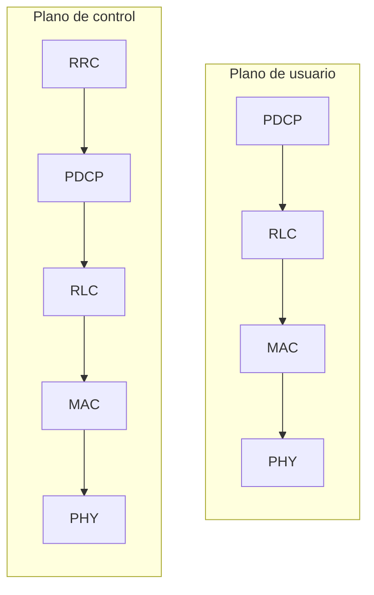
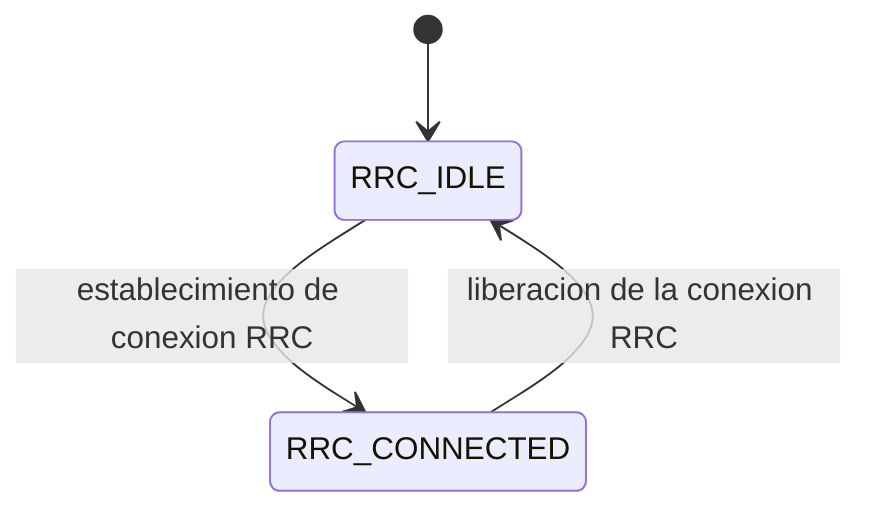
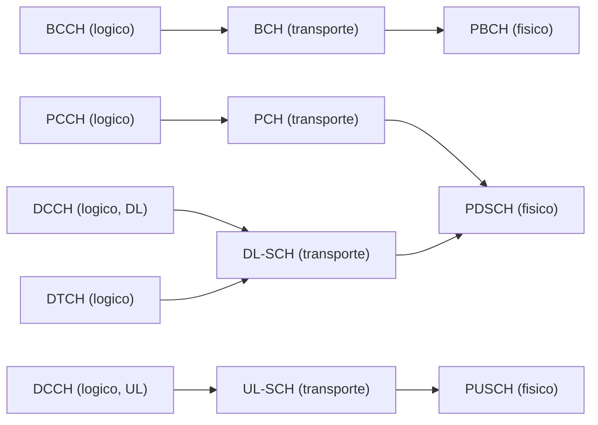
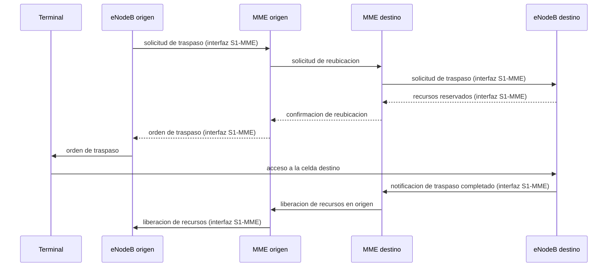

La arquitectura del sistema de paquetes evolucionado descrita en
[arquitectura del sistema de paquetes evolucionado](section_1_arquitectura_eps.md) fija
los elementos de la red troncal y sus interfaces, y la malla de recursos de
[interfaz radio de LTE](section_2_interfaz_radio.md) fija la estructura física sobre la
que esos elementos transmiten. Entre ambas capas se sitúa la pila de protocolos que
gobierna cómo el `eNodeB` y el terminal emplean esa malla: qué función añade cada capa a
un paquete, cómo se reparten los recursos de radio entre los usuarios activos, qué
técnicas de codificación y de transmisión con varias antenas aplica esta generación
sobre la interfaz aérea ya descrita, y cómo se ejecuta el traspaso de una comunicación
entre estaciones base sin interrumpirla. Este capítulo cierra la trilogía dedicada a LTE
describiendo esa pila de protocolos y las técnicas de transmisión que sostiene.

## Introducción

La pila de protocolos de la red de acceso radio se organiza en capas apiladas, comunes
en su mayor parte al plano de usuario y al plano de control, con una diferencia esencial
entre ambos: el plano de control añade una capa adicional, el control de recursos radio,
que no existe en el plano de usuario y que configura el resto de capas inferiores de
ambos planos.

| Capa   | Plano   | Función principal.                                                   |
| ------ | ------- | -------------------------------------------------------------------- |
| `RRC`  | Control | Configura las capas inferiores y gestiona la conexión del terminal.  |
| `PDCP` | Ambos   | Comprime cabeceras, cifra y ordena los paquetes.                     |
| `RLC`  | Ambos   | Segmenta, reordena y retransmite las unidades de datos.              |
| `MAC`  | Ambos   | Planifica los recursos radio y ejecuta la retransmisión híbrida.     |
| `PHY`  | Ambos   | Transmite sobre la malla de recursos descrita en el capítulo previo. |

Cada capa toma las unidades de datos de la capa superior, les añade su propia cabecera o
su propia función, y las entrega a la capa inferior. El resto del capítulo recorre esta
pila con más detalle, primero para el plano de usuario y después para el plano de
control, antes de tratar la planificación de recursos, la codificación de canal, la
retransmisión híbrida, las técnicas de transmisión con varias antenas y la movilidad
dentro de esta misma generación.

## Plano de usuario

El plano de usuario transporta los datos de las aplicaciones del terminal a través de
tres capas por encima de la capa física, cada una responsable de una función distinta
sobre las mismas unidades de datos.

### Protocolo de convergencia de datos de paquetes

El **protocolo de convergencia de datos de paquetes** (`PDCP`) desempeña varias
funciones sobre los paquetes del plano de usuario. Comprime las cabeceras IP, eliminando
su parte estática para reducir la sobrecarga (_overhead_) que introduce cada paquete.
Aplica cifrado para proteger la confidencialidad de los datos. Reordena los paquetes que
llegan fuera de secuencia desde la capa inferior. Y retransmite, cuando el modo de
operación configurado lo exige, los paquetes que se pierden durante un traspaso.

La seguridad del plano de usuario se apoya en un contador `COUNT`, mantenido de forma
independiente por el terminal y por el `eNodeB`, que nunca debe reutilizar el mismo
valor para cifrar dos paquetes distintos, porque esa reutilización comprometería la
confidencialidad del cifrado. Cada paquete se asocia además a un número de secuencia y,
en el plano de control, a un código de autenticación de mensaje que garantiza su
integridad.

Durante un traspaso, el comportamiento de `PDCP` depende de la clasificación descrita en
[movilidad intra-LTE](#movilidad-intra-lte). En un traspaso sin interrupciones, las
entidades `PDCP` se restablecen por completo, incluidos los contextos de compresión de
cabeceras, y los valores de `COUNT` se ponen a cero: los paquetes que el terminal aún no
había empezado a transmitir se reenvían después del traspaso hacia la celda destino,
mientras que los que ya se habían empezado a transmitir sin confirmación de entrega se
pierden. En un traspaso sin pérdidas, aplicable a los portadores radio que emplean el
modo con confirmación de la capa de control de enlace radio, el protocolo de compresión
de cabeceras se restablece en el terminal, pero los números de secuencia y los valores
de `COUNT` de `PDCP` se conservan, y es la propia capa de control de enlace radio la que
garantiza la entrega en secuencia de todo lo pendiente. Un **informe de estado de
`PDCP`** intercambiado tras el traspaso evita retransmisiones innecesarias, al indicar
qué unidades de datos de servicio ya se recibieron correctamente aunque no se hayan
podido descomprimir.

???+ example "Paquetes reenviados en un traspaso sin pérdidas"

    Un terminal transmite datos de usuario en el instante en que se decide ejecutar
    un traspaso sin pérdidas hacia una celda destino. En ese momento existen tres
    categorías de paquetes en las entidades `PDCP` del `eNodeB` origen: los que
    todavía no han comenzado a transmitirse hacia el terminal, los que han
    comenzado a transmitirse pero cuya recepción no se ha confirmado, y los que ya
    se han confirmado como recibidos correctamente.

    En un traspaso sin pérdidas, el `eNodeB` origen reenvía hacia el `eNodeB`
    destino tanto los paquetes que aún no había comenzado a enviar como los que
    había comenzado a enviar sin confirmación de recepción, porque de ambos no
    existe garantía de que el terminal los haya recibido. Los paquetes ya
    confirmados no se reenvían, porque reenviarlos sería una retransmisión sin
    ningún beneficio: el terminal ya los tiene. Esta distinción es la que
    diferencia un traspaso sin pérdidas de uno sin interrupciones, que renuncia a
    la garantía de entrega de los paquetes ya iniciados a cambio de una transición
    más rápida.

### Control de enlace radio

La **capa de control de enlace radio** (`RLC`) segmenta y concatena las unidades de
datos de servicio que recibe de `PDCP` para ajustarlas al tamaño que la capa de control
de acceso al medio determina en cada intervalo de transmisión, reordena las unidades de
datos de protocolo que le llegan fuera de secuencia y ejecuta la retransmisión mediante
repetición automática de solicitud (`ARQ`) cuando el modo de operación configurado lo
exige. En LTE, `RLC` también ordena los paquetes entregados a la capa superior, una
función que en 5G se traslada a otra capa, lo que hace de esta responsabilidad un rasgo
propio de esta generación y no un principio general de toda pila de protocolos móvil.

### Modos transparente, sin confirmación y con confirmación

La capa de control de enlace radio opera en tres modos, elegidos según el tipo de
tráfico que transporta cada portador radio.

| Modo                    | Función de `RLC` aplicada                              | Uso típico                                    |
| ----------------------- | ------------------------------------------------------ | --------------------------------------------- |
| `TM` (transparente)     | Ninguna: transmite sin segmentar ni reordenar.         | Mensajes de `RRC` sin configuración de `RLC`. |
| `UM` (sin confirmación) | Segmenta, concatena y reordena, sin confirmar entrega. | Tiempo real tolerante a pérdidas.             |
| `AM` (con confirmación) | Añade `ARQ` sobre las funciones del modo `UM`.         | Mensajes de `RRC` y transmisión fiable.       |

El **modo transparente** (`TM`) transmite los paquetes sin ninguna intervención de
`RLC`, ni segmentación ni reordenamiento, y se reserva para mensajes de `RRC` que no
necesitan ninguna de esas funciones. El **modo sin confirmación** (`UM`) no espera
confirmación de la recepción de los paquetes transmitidos, lo que lo hace adecuado para
aplicaciones en tiempo real sensibles al retardo y tolerantes a cierta pérdida de datos,
así como para servicios punto a multipunto en los que confirmar la recepción de cada
receptor sería impracticable. El **modo con confirmación** (`AM`) implementa la
operación `ARQ` completa: espera confirmación de cada unidad de datos, retransmite las
que no se confirman, y se emplea en mensajes de `RRC` y en aplicaciones que exigen una
transmisión fiable, como la transferencia progresiva de vídeo.

### Segmentación, concatenación y reordenamiento

El tamaño de las unidades de datos de protocolo de `RLC` lo decide la capa de control de
acceso al medio en función de la calidad del canal, no `RLC` mismo, lo que obliga a
`RLC` a segmentar y concatenar las unidades de datos de servicio recibidas de `PDCP`
para ajustarlas a ese tamaño variable. Las unidades del modo sin confirmación incluyen
un número de secuencia y una indicación del tamaño de cada segmento, información
necesaria porque el tamaño de los paquetes varía de una transmisión a otra. Con esa
información, el receptor reordena las unidades que llegan fuera de secuencia y elimina
los duplicados que pudieran producirse. Un temporizador de reordenamiento detecta los
fallos de recepción sin bloquear indefinidamente la entrega de lo ya recibido, y solo se
reensambla una unidad de datos de servicio completa cuando todos sus segmentos están
disponibles.

### Control de acceso al medio

La **capa de control de acceso al medio** (`MAC`) actúa como planificador (_scheduler_)
de los recursos de radio disponibles, distribuyéndolos entre los terminales activos en
los enlaces ascendente y descendente. Además de la planificación, que se detalla en
[planificación de recursos](#planificacion-de-recursos), `MAC` transfiere al terminal la
información de la asignación resultante, gestiona el procedimiento de acceso aleatorio,
mantiene alineada la temporización del enlace ascendente y ejecuta la retransmisión
híbrida descrita más adelante en este capítulo.

???+ example "Recorrido de un paquete de usuario por la pila del plano de usuario"

    Una aplicación del terminal genera un paquete IP destinado a un servidor
    externo. Antes de abandonar el terminal como señal radio, ese paquete atraviesa
    las cuatro capas del plano de usuario, y cada una le añade una función
    concreta.

    `PDCP` recibe primero el paquete IP y comprime su cabecera, eliminando la parte
    estática para reducir la sobrecarga que introduciría transmitirla completa en
    cada paquete. A continuación cifra el contenido con la clave de seguridad
    vigente y le asigna un número de secuencia dentro del contador `COUNT` del
    portador. El resultado pasa a `RLC`, que lo segmenta o lo concatena con otras
    unidades pendientes hasta ajustarlo al tamaño que `MAC` ha fijado para el
    siguiente intervalo de transmisión, y que, si el portador opera en modo con
    confirmación, prepara la unidad para su eventual retransmisión si no llega
    confirmación de recepción. `MAC` multiplexa esa unidad junto con las de otros
    canales lógicos activos del mismo terminal en un único bloque de transporte,
    de acuerdo con la asignación de recursos que el planificador le ha concedido
    en ese intervalo, y añade la información necesaria para la retransmisión
    híbrida. Por último, la capa física codifica y modula ese bloque de transporte
    sobre los elementos de recurso asignados de la malla descrita en
    [interfaz radio de LTE](section_2_interfaz_radio.md), y lo transmite sobre el
    canal físico compartido correspondiente. En el `eNodeB`, las mismas cuatro
    capas se recorren en sentido inverso hasta reconstruir el paquete IP original.

## Plano de control

El plano de control transporta la señalización que gestiona la conexión del terminal con
la red, en lugar de los datos de las aplicaciones. Las capas inferiores al control de
recursos radio realizan funciones similares a las del plano de usuario, con una
excepción: `PDCP` no comprime cabeceras en el plano de control, porque los mensajes de
señalización no comparten la estructura repetitiva de las cabeceras IP que justifica esa
compresión en el plano de usuario. En su lugar, `PDCP` recibe los paquetes de `RRC`, les
asigna un número de secuencia, calcula el código de autenticación de mensaje y cifra el
resultado antes de generar la unidad de datos de protocolo que entrega a `RLC`.

### Control de recursos radio

El **control de recursos radio** (`RRC`) es la capa que gobierna la relación entre el
terminal y la `E-UTRAN`. Su función principal es la configuración de los portadores
radio y de los parámetros de las capas inferiores, pero además difunde la información
del sistema, gestiona el aviso de llamada, establece y libera las conexiones y configura
las mediciones que el terminal reporta para decidir un traspaso.

### Estados inactivo y conectado

El terminal, frente a la `E-UTRAN`, se encuentra en uno de dos estados de `RRC`. En
`RRC_IDLE`, el terminal selecciona y reselecciona celda de forma autónoma y monitoriza
el canal de aviso de llamada para detectar si la red intenta localizarlo. En
`RRC_CONNECTED`, el terminal informa a la red de la asignación de recursos que necesita
y de la celda en la que se encuentra, en preparación de un eventual traspaso.

Estos dos estados de `RRC` son distintos de los estados `ECM-IDLE` y `ECM-CONNECTED`
descritos en [estados del terminal](section_1_arquitectura_eps.md#estados-del-terminal),
aunque están estrechamente acoplados entre sí: el paso de `ECM-IDLE` a `ECM-CONNECTED`
exige establecer conexión tanto entre el terminal y el `eNodeB` como entre el `eNodeB` y
la pasarela de servicio, y esa primera conexión es precisamente la que corresponde al
paso de `RRC_IDLE` a `RRC_CONNECTED`. El estado de `RRC` describe la relación del
terminal con la red de acceso radio, mientras que el estado `ECM` describe su relación
con la red troncal, y ambos avanzan de forma coordinada aunque residan en capas
distintas de la arquitectura.

### Portadores de señalización y de datos

`RRC` distingue dos tipos de portador radio según el contenido que transportan. Los
**portadores de señalización** (`SRB`) llevan los mensajes de `RRC` y la señalización
del estrato de no acceso, mientras que los **portadores de datos** (`DRB`) llevan los
datos de usuario del plano de usuario. Se emplean varios `SRB` para los mensajes de
`RRC`, cada uno con un propósito y un nivel de prioridad distintos, y los mensajes que
utilizan el canal de control dedicado se protegen mediante integridad y cifrado en la
capa `PDCP` y emplean el modo con confirmación de `RLC`.

Cada portador, de señalización o de datos, se mapea a través de `PDCP` y `RLC` hacia un
**canal lógico**, que a su vez se mapea en `MAC` hacia un **canal de transporte**, y
este finalmente hacia un **canal físico** en la capa física. La información del sistema
y el aviso de llamada, que no dependen de un portador dedicado a un terminal concreto,
se mapean directamente a canales lógicos comunes.

La información del sistema se transporta sin cifrar a través del canal de difusión
(`BCH`), y el aviso de llamada a través del canal de aviso de llamada (`PCH`). Un canal
de tráfico dedicado a un terminal concreto exige que este se encuentre en
`RRC_CONNECTED`, y su tráfico se transporta sobre el canal compartido de enlace
descendente (`DL-SCH`) o de enlace ascendente (`UL-SCH`) según el sentido, canales
compartidos entre varios terminales cuya multiplexación y cuyo control de la
retransmisión híbrida gestiona la planificación de `MAC`. Los canales físicos a los que
finalmente llegan estos canales de transporte, `PDSCH`, `PUSCH` y `PBCH` entre otros, se
describen con detalle en
[canales físicos del enlace descendente](section_2_interfaz_radio.md#canales-fisicos-del-enlace-descendente)
y en
[canales físicos del enlace ascendente](section_2_interfaz_radio.md#canales-fisicos-del-enlace-ascendente).

### Procedimientos del estrato de no acceso

El **estrato de no acceso** (`NAS`) define cómo el terminal se conecta a la red troncal,
por encima de la relación con la red de acceso radio que gestiona `RRC`. Sus mensajes
viajan encapsulados dentro de la señalización de `RRC`, mapeados a los portadores de
señalización descritos en el apartado anterior, lo que hace de `RRC` el transporte de
`NAS` sobre la interfaz radio del mismo modo en que la interfaz `S1-MME` lo transporta
entre el `eNodeB` y la entidad de gestión de movilidad, según se describe en
[interfaz S1](section_1_arquitectura_eps.md#interfaz-s1). El procedimiento de conexión
inicial de un terminal, que combina la solicitud de acceso aleatorio, la creación de
contexto en la entidad de gestión de movilidad y la autenticación mutua, se describe con
su intercambio completo de mensajes en
[establecimiento inicial de conectividad de un terminal apagado](section_1_arquitectura_eps.md#estados-del-terminal).
Además de esa conexión inicial, el estrato de no acceso ejecuta la **actualización de
área de seguimiento** (`TAU`) cuando el terminal, en `ECM-IDLE`, se desplaza fuera del
área de seguimiento que la red troncal tenía registrada para él, un procedimiento que
mantiene actualizada la localización aproximada del terminal sin exigirle permanecer
conectado de forma continua.

## Planificación de recursos

El planificador de `MAC` reparte los bloques de recurso físico disponibles entre los
terminales con datos pendientes en cada intervalo de transmisión, la misma unidad mínima
de asignación descrita en
[bloque de recurso físico y elemento de recurso](section_2_interfaz_radio.md#bloque-de-recurso-fisico-y-elemento-de-recurso).

### Información que utiliza el planificador

El planificador del `eNodeB` toma su decisión a partir de varias fuentes de información,
distintas según el sentido del enlace. En el enlace descendente, dispone de los datos ya
almacenados en el propio `eNodeB` esperando transmisión y de la calidad del canal medida
directamente por el `eNodeB` a partir de las señales que recibe del terminal. En el
enlace ascendente, depende en cambio de lo que el terminal le comunica: el indicador de
calidad de canal, tratado en detalle en
[indicador de calidad de canal](#indicador-de-calidad-de-canal), y los informes de
estado del búfer del terminal, que indican cuántos datos tiene pendientes de transmitir.
Con esa información, distintos algoritmos de planificación deciden qué terminales
reciben recursos y con qué esquema de modulación y codificación, considerando los
requisitos de calidad de servicio de cada portador radio configurado.

???+ example "Reparto de bloques de recurso entre dos usuarios con distinta calidad"

    Una portadora de 10 MHz aloja $N_\text{RB} = 50$ bloques de recurso, según la
    cifra ya establecida en
    [régimen binario máximo de una portadora de 20 MHz](section_2_interfaz_radio.md#malla-de-recursos),
    con prefijo cíclico normal y catorce símbolos OFDM por subtrama. En una
    subtrama concreta, dos terminales tienen datos pendientes: el terminal A, con
    una relación señal-ruido alta, y el terminal B, con una relación señal-ruido
    baja, según reflejan sus indicadores de calidad de canal más recientes.

    El planificador, a partir de esa información de calidad y de los informes de
    estado del búfer de cada terminal, decide asignar 30 bloques de recurso al
    terminal A con un esquema de modulación y codificación de `64-QAM` y tasa
    $R = 3/4$, y los 20 bloques de recurso restantes al terminal B con `QPSK` y
    tasa $R = 1/2$, agotando entre ambos la capacidad completa de la portadora en
    esa subtrama.

    Cada bloque de recurso aporta $12 \times 14 = 168$ elementos de recurso por
    subtrama. Para el terminal A, cada elemento transporta
    $\bar{B}\, R = 6 \times 0{,}75 = 4{,}5$ bit, de modo que sus 30 bloques
    entregan en esa subtrama

    $$
    b_A = 30 \times 168 \times 4{,}5 = 22\,680\ \text{bit}
    $$

    Para el terminal B, cada elemento transporta $\bar{B}\, R = 2 \times 0{,}5 =
    1\ \text{bit}$, de modo que sus 20 bloques entregan

    $$
    b_B = 20 \times 168 \times 1 = 3\,360\ \text{bit}
    $$

    Si esa asignación se mantuviera de forma sostenida, el terminal A alcanzaría un
    régimen binario de $22\,680 \times 1000 = 22{,}68\ \text{Mbit/s}$ y el
    terminal B, de $3\,360 \times 1000 = 3{,}36\ \text{Mbit/s}$. La diferencia de
    régimen entre ambos terminales no procede solo de que A reciba más bloques de
    recurso, sino también de que su mejor calidad de canal le permite un esquema
    de modulación y codificación más denso: con la misma cantidad de bloques que
    B, A habría obtenido igualmente un régimen muy superior. El planificador
    combina ambos efectos, el reparto de bloques y la elección del esquema, para
    aprovechar la capacidad total de la portadora sin exceder la tasa de error
    tolerable de ninguno de los dos terminales.

### Índice de equidad de Jain

El reparto de recursos del ejemplo anterior favorece de forma deliberada al terminal con
mejor calidad de canal, lo que maximiza el _throughput_ agregado de la portadora pero
reparte ese _throughput_ de forma desigual entre los dos terminales. El **índice de
equidad de Jain** cuantifica ese reparto con un único número, sin necesidad de examinar
la distribución completa de tasas:

$$
J(x_1, \dots, x_n) = \frac{\left( \sum_{i=1}^{n} x_i \right)^2}{n \sum_{i=1}^{n} x_i^2}
$$

donde $x_i$ es la magnitud repartida entre el usuario $i$, por ejemplo el _throughput_
que recibe, y $n$ es el número total de usuarios considerados. El índice toma valores en
el intervalo $\lbrack 1/n, 1 \rbrack$: el valor $J=1$ se alcanza cuando todos los
usuarios reciben exactamente la misma magnitud, con independencia de cuál sea esa
magnitud común, y el valor mínimo $J=1/n$ se alcanza cuando un único usuario concentra
la totalidad del recurso y el resto recibe cero. El índice no depende de la escala de
los $x_i$, solo de su reparto relativo, lo que permite comparar la equidad de dos
planificadores distintos aunque operen con _throughput_ agregados muy distintos entre
sí.

Esta métrica formaliza la tensión, ya presente en el ejemplo anterior, entre maximizar
el _throughput_ agregado y repartirlo de forma equitativa. Un planificador de tipo
_máximo throughput_ asigna siempre los recursos al terminal con mejor calidad de canal
en cada instante, lo que maximiza la capacidad cursada de la portadora a costa de un
índice de Jain bajo, porque los terminales con peor calidad reciben sistemáticamente
menos recursos o ninguno. Un planificador de tipo _turno rotatorio_ (_round robin_)
reparte los recursos por igual entre todos los terminales activos con independencia de
su calidad de canal, lo que alcanza el índice de Jain máximo pero desaprovecha parte de
la capacidad de la portadora al asignar recursos también a terminales con canales
peores. El planificador **proporcionalmente justo** (_proportional fair_) se sitúa entre
ambos extremos: pondera la calidad instantánea de cada terminal por su tasa media
reciente, de modo que favorece al terminal con mejor calidad relativa a su propio
historial en lugar de al mejor en términos absolutos, consiguiendo un índice de Jain
intermedio con una pérdida de capacidad agregada menor que la de un reparto por igual
estricto.

???+ example "Índice de Jain sobre el reparto de dos terminales"

    Retomando los dos terminales del ejemplo anterior, el terminal A recibe un
    régimen de $22{,}68$ Mbit/s y el terminal B, de $3{,}36$ Mbit/s. El índice de
    Jain de ese reparto es

    $$
    J = \frac{(22{,}68 + 3{,}36)^2}{2 \cdot (22{,}68^2 + 3{,}36^2)} =
    \frac{26{,}04^2}{2 \times 526{,}12} = 0{,}645
    $$

    Un reparto alternativo que mantuviera el mismo _throughput_ agregado de
    $26{,}04$ Mbit/s pero lo dividiera por igual entre ambos terminales,
    $13{,}02$ Mbit/s cada uno, alcanzaría $J=1$, el máximo posible con dos
    usuarios. La diferencia entre ambos valores, $0{,}645$ frente a $1$, mide en
    una sola cifra el precio en equidad que paga el planificador del ejemplo
    original por maximizar la capacidad total de la portadora: prioriza al
    terminal A porque su mejor calidad de canal permite transmitir más bits por
    elemento de recurso, pero deja al terminal B con menos de un séptimo del
    régimen de A, muy por debajo de un reparto proporcional a partes iguales.

### Recepción discontinua

La **recepción discontinua** (`DRX`) permite al terminal suspender la monitorización
continua del canal de control cuando no tiene datos pendientes, y reactivarla solo de
forma periódica o cuando la red le indica que existen datos que entregarle. Al reducir
el tiempo que el terminal mantiene activo su receptor de radiofrecuencia, `DRX` alarga
la autonomía de su batería a costa de introducir cierto retardo adicional en la entrega
de datos que llegan durante un intervalo de inactividad, un compromiso que la red ajusta
configurando la duración de esos intervalos según el tipo de tráfico que el terminal
recibe habitualmente.

### Alineación temporal del enlace ascendente

Los terminales conectados a una misma celda se encuentran a distancias distintas del
`eNodeB`, y cada distancia introduce un retardo de propagación distinto entre la
transmisión del terminal y su recepción en la estación base. Sin corrección, las
transmisiones de terminales a distinta distancia llegarían al `eNodeB` desalineadas en
el tiempo, lo que rompería la ortogonalidad entre usuarios que el acceso múltiple del
enlace ascendente exige. La **alineación temporal** corrige este efecto: el `eNodeB`
mide el desalineamiento de cada terminal a partir de sus transmisiones recibidas y le
envía un comando de adelanto o retraso de temporización, de modo que cada terminal
adelanta su transmisión en una cantidad proporcional a su distancia estimada, y todas
las transmisiones llegan alineadas en el tiempo a la antena receptora del `eNodeB` con
independencia de la distancia real de cada terminal.

## Codificación y adaptación de enlace

La codificación de canal de LTE combina varios mecanismos de protección aplicados en
cascada sobre cada bloque de transporte, antes de que la adaptación de enlace decida,
bloque a bloque, con qué modulación y con qué tasa de codificación transmitirlo.

### Comprobación de redundancia por bloque de transporte

Cada **bloque de transporte** recibe un elemento de comprobación de redundancia cíclica,
del tipo ya descrito en
[comprobación de redundancia cíclica](../../01_fundamentos/05_codificacion/section_1_codificacion_de_canal.md#comprobacion-de-redundancia-ciclica),
que permite al receptor verificar si el bloque completo ha llegado sin errores. Cuando
el bloque de transporte no cabe en un único bloque de código, porque su tamaño supera el
máximo que el turbocodificador admite, se **segmenta** en varios bloques de código, y
cada uno de ellos recibe además su propio elemento de comprobación de redundancia
cíclica, que en este caso no verifica la entrega correcta frente al receptor final, sino
que sirve como condición de parada del turbodecodificador iterativo: cuando la
comprobación de un bloque de código pasa durante la decodificación, el decodificador
puede detener las iteraciones sobre ese bloque sin esperar al número máximo configurado.

### Turbocodificación y ajuste de tasa

Los datos de usuario se protegen con un **código turbo**, del tipo descrito en
[turbo códigos](../../01_fundamentos/05_codificacion/section_2_codigos_convolucionales.md#turbo-codigos),
mientras que la señalización emplea en su lugar un código convolucional, una elección
que refleja el menor volumen y la mayor sensibilidad al retardo de decodificación de los
mensajes de señalización frente al tráfico de datos. El código turbo madre de LTE tiene
tasa $1/3$, y el **ajuste de tasa** (_rate matching_) recorta o repite esa salida
mediante el mismo mecanismo de perforado descrito en
[perforado](../../01_fundamentos/05_codificacion/section_2_codigos_convolucionales.md#perforado)
hasta ajustarla a los bits realmente disponibles en los bloques de recurso asignados por
el planificador, según la tasa de codificación efectiva que el esquema de modulación y
codificación elegido exige.

Para permitir que varios decodificadores trabajen en paralelo sobre un mismo bloque, y
así acelerar la decodificación, el código turbo de LTE incorpora un **entrelazador**
diseñado específicamente con ese objetivo de paralelización, distinto del entrelazador
genérico frente a errores en ráfaga que ya se trata en
[entrelazado](../../01_fundamentos/05_codificacion/section_1_codificacion_de_canal.md#entrelazado).

### Búfer circular y versiones de redundancia

El ajuste de tasa de LTE recorre un **búfer circular**, la misma estructura de datos
descrita en
[ajuste de tasa con búfer circular](../../01_fundamentos/05_codificacion/section_3_adaptacion_de_enlace_y_retransmision.md#ajuste-de-tasa-con-bufer-circular),
que almacena en orden fijo los bits sistemáticos seguidos de los bits de redundancia que
produce el código turbo. LTE define cuatro **versiones de redundancia**, cada una
correspondiente a un punto de inicio distinto dentro de ese búfer: la primera versión
comienza por los bits sistemáticos, lo que produce la tasa de codificación efectiva más
alta y el régimen binario más alto si el bloque se entrega al primer intento, y las
versiones siguientes desplazan el punto de inicio hacia tramos del búfer con más
redundancia y menos bits sistemáticos, la misma lógica de recorrido circular que emplea
la retransmisión híbrida descrita más adelante en este capítulo para generar cada
intento sucesivo.

### Indicador de calidad de canal

El terminal transmite el **indicador de calidad de canal** (`CQI`) hacia el `eNodeB` de
forma periódica o bajo demanda, según lo determine el propio `eNodeB`. El `CQI` puede
referirse al conjunto completo de la banda asignada, a subbandas concretas, o a las
mejores $M$ subbandas, una elección que equilibra la precisión de la información frente
a la sobrecarga de señalización que su transmisión introduce en el canal de
retroalimentación descrito de forma genérica en
[canal de retroalimentación](../../01_fundamentos/05_codificacion/section_3_adaptacion_de_enlace_y_retransmision.md#canal-de-retroalimentacion).
El indicador resume la relación señal-ruido medida por el terminal, y el `eNodeB` lo
traduce en la tasa de código y el esquema de modulación que debe emplear en su siguiente
transmisión hacia ese terminal: a mayor relación señal-ruido reportada, constelaciones
más densas y tasas de código más altas, siguiendo el mismo principio de adaptación de
enlace descrito en detalle en
[adaptación conjunta de modulación y codificación](../../01_fundamentos/05_codificacion/section_3_adaptacion_de_enlace_y_retransmision.md#adaptacion-conjunta-de-modulacion-y-codificacion).

## Retransmisión híbrida

LTE emplea **retransmisión híbrida** (`HARQ`) sobre el canal de datos de usuario,
aplicando la misma lógica de detección mediante comprobación de redundancia cíclica y de
confirmación positiva o negativa, y las mismas técnicas de combinación de búsqueda y de
redundancia incremental, descritas de forma general en
[protocolos de retransmisión](../../01_fundamentos/05_codificacion/section_3_adaptacion_de_enlace_y_retransmision.md#protocolos-de-retransmision)
y en
[combinación de versiones y redundancia incremental](../../01_fundamentos/05_codificacion/section_3_adaptacion_de_enlace_y_retransmision.md#combinacion-de-versiones-y-redundancia-incremental).
Lo que este capítulo añade es cómo LTE integra esa lógica genérica en su capa `MAC` y en
su interfaz aérea. Cada intento sucesivo emplea una versión de redundancia distinta de
las cuatro descritas en el apartado anterior, generadas recorriendo el mismo búfer
circular que produce la primera transmisión, de modo que el ajuste de tasa y la
retransmisión híbrida comparten un único mecanismo en lugar de dos independientes. Las
confirmaciones y las peticiones de retransmisión del enlace ascendente viajan sobre el
canal físico de indicador de `HARQ` (`PHICH`), descrito en
[canales físicos del enlace descendente](section_2_interfaz_radio.md#canales-fisicos-del-enlace-descendente),
mientras que las del enlace descendente se señalizan junto con la propia asignación de
recursos en el canal físico de control correspondiente.

## Técnicas MIMO en LTE

La norma LTE especifica las técnicas de transmisión con varias antenas únicamente para
el sentido de la transmisión, dejando el diseño del receptor a criterio del fabricante:
cada dispositivo puede implementar de forma distinta cómo recibe una señal `MIMO`, y el
estándar no impone ninguna técnica de recepción concreta. Las técnicas para un único
usuario se aplican de forma preferente en el enlace descendente, que cuenta con más
antenas transmisoras en el `eNodeB` que el terminal en el enlace ascendente, mientras
que para las técnicas multiusuario el estándar no impone su implementación pero sí
ofrece los mecanismos de soporte necesarios.

### Diversidad en transmisión con codificación espacio-frecuencia

La **codificación espacio-frecuencia en bloque** (`SFBC`) transmite sobre dos antenas y
dos subportadoras adyacentes, en lugar de sobre dos intervalos de símbolo consecutivos
como hace el esquema de Alamouti genérico descrito en
[esquema de Alamouti](../../01_fundamentos/06_mimo/section_1_fundamentos_mimo.md#esquema-de-alamouti).
Esta diferencia, cambiar el eje de la codificación de tiempo a frecuencia, es la que
distingue `SFBC` de los códigos de bloque espacio-temporales ortogonales genéricos
descritos en
[códigos de bloque espacio-temporales ortogonales](../../01_fundamentos/06_mimo/section_1_fundamentos_mimo.md#codigos-de-bloque-espacio-temporales-ortogonales),
y conserva la misma eficiencia espectral y la misma ganancia de diversidad máxima que la
familia genérica.

### Diversidad con conmutación de frecuencia

La combinación de **codificación espacio-frecuencia con conmutación de frecuencia en
transmisión** (`SFBC` & `FSTD`) extiende la técnica anterior a cuatro antenas y cuatro
subportadoras adyacentes, agrupando las antenas en dos pares que siguen cada uno un
esquema de Alamouti independiente. El resultado equivale a aplicar dos instancias de
`SFBC` en paralelo, una por cada par de antenas, lo que conserva la eficiencia espectral
máxima de la técnica de dos antenas mientras extrae diversidad de las cuatro antenas
disponibles.

### Multiplexación con precodificación

La **multiplexación con precodificación** transmite varios flujos de datos
simultáneamente sobre el conjunto de antenas, aplicando una matriz de precodificación
del tipo descrito en
[matriz de precodificación](../../01_fundamentos/06_mimo/section_2_multiplexacion_espacial.md#matriz-de-precodificacion)
para repartir cada flujo entre las antenas transmisoras. Tanto esta técnica como el
_beamforming_ descrito más adelante exigen que el terminal estime el canal y comunique
esa estimación al `eNodeB`, lo que supone un volumen apreciable de información de
retorno, y exigen además que el terminal decida cuántos flujos, o capas, le interesa
recibir, porque un mayor número de capas reparte la misma potencia total entre más
flujos y reduce la potencia disponible para cada uno.

### Libros de códigos e indicadores de matriz y de rango

Para reducir el volumen de información de retorno, LTE no transmite directamente los
elementos de la matriz de precodificación, sino dos índices que apuntan a una tabla
compartida entre el `eNodeB` y el terminal, el **libro de códigos**. El **indicador de
matriz de precodificación** (`PMI`) señala qué matriz o vector de la tabla ofrece el
mejor rendimiento estimado, y el **indicador de rango** (`RI`) señala cuántos flujos
deben emplearse. Los vectores del libro de códigos son unitarios, lo que preserva la
potencia total de cada flujo, y sus coeficientes tienen módulo constante, lo que
garantiza que todas las antenas transmitan con la misma potencia. La búsqueda del vector
óptimo se limita a la tabla disponible, de modo que el resultado es el más cercano al
óptimo real dentro de ese conjunto finito, no necesariamente el óptimo absoluto, y tanto
`PMI` como `RI` pueden calcularse para toda la banda asignada o por subbandas.

!!! note

    El catálogo completo del libro de códigos de LTE para cuatro antenas
    transmisoras y de una a cuatro capas no se ha podido recuperar con fiabilidad
    de las fuentes de origen, por lo que este capítulo describe el mecanismo de
    `PMI` y `RI` sin reproducir esa tabla concreta.

### Diversidad de retardo cíclico

La **diversidad de retardo cíclico** (`CDD`) se emplea cuando el `eNodeB` no recibe
información de `PMI` del terminal. En lugar de fijar una única matriz de
precodificación, selecciona una matriz distinta de un subconjunto del libro de códigos
para cada grupo de subportadoras, y aplica sobre cada antena una fase que varía
linealmente con la frecuencia. Esa variación lineal de fase entre subportadoras
equivale, tras el modulador OFDM, a un retardo circular de la señal en el dominio del
tiempo, la misma relación entre desplazamiento de fase en frecuencia y retardo en el
tiempo que rige cualquier sistema multiportadora. Aunque el retardo circular se propone
habitualmente como técnica de diversidad, en LTE se aprovecha además como mecanismo para
generar varias matrices de precodificación distintas a partir de una sola, con mejoras
en algunas subportadoras a costa de pérdidas en otras.

### Beamforming con señales de referencia específicas

El _beamforming_ con señales de referencia específicas resuelve un problema práctico de
la multiplexación con precodificación adaptativa: si el receptor estima la matriz del
canal a partir de los símbolos piloto, necesita conocer el vector de _beamforming_
empleado para poder deshacerlo, y comunicarle ese vector resulta difícil cuando no
procede de un libro de códigos compartido. LTE resuelve esta dificultad con una **señal
de referencia específica del usuario** (`DMRS`), precodificada con el mismo vector de
_beamforming_ que los datos, de modo que el terminal estima directamente el canal
equivalente sin necesitar conocer el vector por separado: desde su perspectiva, el
`eNodeB` parece transmitir a través de una única antena virtual, el puerto de antena de
LTE. El `eNodeB` puede conocer el canal por reciprocidad, si opera en `TDD`, o estimando
el ángulo de llegada de la señal del terminal, aunque LTE no fija ningún procedimiento
concreto para esa segunda vía. Desde la versión 10 de LTE Advanced, el precodificado sin
libro de códigos puede aplicarse hasta con ocho puertos de antena.

Dos familias de señales de referencia sirven a la estimación de canal en `MIMO`. Las
**señales de referencia específicas de celda** (`CRS`) se emplean para la estimación de
canal, la demodulación y el cálculo de `CQI`, `PMI` y `RI`. Las **señales de referencia
específicas del usuario o de demodulación** (`DMRS`) se emplean para la estimación de
canal en la demodulación cuando se aplica precodificación sin libro de códigos, según se
acaba de describir.

### MIMO multiusuario

El `MIMO` multiusuario permite a un `eNodeB` comunicarse simultáneamente con varios
terminales mediante _beamforming_, mejorando así la calidad de la señal y el rendimiento
agregado de la celda, un caso particular de la multiplexación espacial de usuarios ya
descrita en
[multiplexación espacial de usuarios en el enlace descendente](../../01_fundamentos/06_mimo/section_2_multiplexacion_espacial.md#multiplexacion-espacial-de-usuarios-en-el-enlace-descendente).
Su aplicación varía según el modo de duplexación. En `TDD`, el `eNodeB` estima el canal
por reciprocidad y aplica la precodificación adecuada de forma transparente para el
usuario, apoyándose en la señal de referencia específica del usuario. En `FDD`, la
técnica solo resulta eficaz cuando las direcciones de _beamforming_ que comunican los
distintos usuarios son aproximadamente ortogonales entre sí, la condición que permite
reducir la interferencia mutua entre los flujos dirigidos a cada uno. En ambos modos de
duplexación, el `eNodeB` puede además estimar el canal y aplicar la ecualización
espacial correspondiente apoyándose en la señal de referencia de demodulación.

???+ example "Efecto del tamaño del libro de códigos sobre el rendimiento"

    Un sistema `MIMO` adaptativo puede precodificar sus flujos de dos formas: con
    una matriz de precodificación calculada de forma continua a partir del canal
    estimado, o con una matriz seleccionada de un libro de códigos de tamaño
    finito. La primera opción exige comunicar la matriz completa al transmisor, lo
    que consume un canal de retorno mucho mayor que comunicar simplemente un
    índice `PMI`.

    Cuando el libro de códigos tiene un tamaño adecuado para las condiciones del
    canal, la tasa de bits que se alcanza con la matriz seleccionada del libro de
    códigos apenas se aleja de la que ofrecería la matriz óptima continua, porque
    el conjunto de matrices disponibles ya cubre con suficiente densidad las
    direcciones de canal más probables. La pérdida de rendimiento solo se hace
    apreciable cuando el libro de códigos es demasiado pequeño para el número de
    condiciones de canal distintas que debe representar, porque en ese caso la
    matriz más cercana disponible se aleja de forma significativa de la matriz
    óptima real. El compromiso de diseño, por tanto, no es evitar el libro de
    códigos, sino dimensionarlo con suficiente densidad frente a la variabilidad
    del canal que debe cubrir.

## Movilidad intra-LTE

La **movilidad intra-LTE** traslada una comunicación activa de un `eNodeB` a otro dentro
de la misma red LTE, aplicando a esta generación concreta el marco general de traspaso
ya descrito en
[traspaso](../01_fundamentos_celulares/section_2_movilidad_y_recursos_radio.md#traspaso).
La elección entre un traspaso sin interrupciones y uno sin pérdidas, en el sentido
genérico descrito en
[traspaso sin interrupción y sin pérdidas](../01_fundamentos_celulares/section_2_movilidad_y_recursos_radio.md#traspaso-sin-interrupcion-y-sin-perdidas),
la realiza el `eNodeB` origen para cada portador EPS por separado, según la calidad de
servicio que ese portador recibe a través de la interfaz `S1` y según el servicio
concreto que transporta, y su efecto sobre las entidades `PDCP` ya se ha descrito en
[protocolo de convergencia de datos de paquetes](#protocolo-de-convergencia-de-datos-de-paquetes).
Ambos tipos de traspaso se apoyan en el reenvío de los datos pendientes del enlace
descendente en el plano de usuario, con independencia de cuál de las dos interfaces
descritas a continuación ejecute la señalización.

### Traspaso sobre X2

LTE da preferencia al **traspaso sobre X2** siempre que existe interfaz `X2` entre el
`eNodeB` origen y el `eNodeB` destino, porque esa preferencia evita involucrar a la
entidad de gestión de movilidad en la decisión. La interfaz `X2` no exige que todos los
`eNodeB` de una red se conecten entre sí: solo se establece entre estaciones base
suficientemente relacionadas por su proximidad o por el volumen de traspasos que
intercambian, y puede además implementarse lógicamente sobre la propia interfaz `S1` sin
requerir una malla física completa. Las funciones del protocolo de aplicación `X2`
(`X2-AP`) abarcan la gestión de la movilidad, la gestión de la carga y de la
interferencia entre celdas vecinas, y el intercambio de información histórica entre
estaciones base, y el traspaso sobre `X2` puede ejecutarse sin requerir la aprobación de
la entidad de gestión de movilidad.

### Traspaso sobre S1

El **traspaso sobre S1** se emplea cuando no existe interfaz `X2` entre los dos `eNodeB`
implicados, o cuando la red configura explícitamente ese camino para un destino
concreto. A diferencia del traspaso sobre `X2`, en el que las estaciones base se
comunican de forma directa, el traspaso sobre `S1` señaliza a través de las entidades de
gestión de movilidad de origen y de destino, precisamente porque no existe entre las
estaciones base ningún enlace directo sobre el que negociar el traspaso.

El `eNodeB` origen decide iniciar el traspaso y comunica esa decisión a su entidad de
gestión de movilidad a través de la interfaz `S1-MME`, indicando la celda destino más
adecuada. La entidad de gestión de movilidad de origen traslada la solicitud a la
entidad de gestión de movilidad de destino, que a su vez señaliza al `eNodeB` destino,
de nuevo a través de `S1-MME`, para que reserve los recursos necesarios. Una vez
confirmada esa reserva, la confirmación recorre el mismo camino en sentido inverso hasta
llegar al `eNodeB` origen, que ordena entonces al terminal ejecutar el traspaso. Cuando
el terminal accede a la celda destino, el `eNodeB` destino lo notifica a través de su
entidad de gestión de movilidad, lo que permite liberar los recursos que la celda origen
mantenía reservados.

### Preparación múltiple y liberación de recursos

Tanto el traspaso sobre `X2` como el traspaso sobre `S1` admiten la **preparación
múltiple**: el `eNodeB` origen puede solicitar la reserva de recursos a varios `eNodeB`
destino candidatos en paralelo, aunque solo uno de ellos se señala finalmente al
terminal como destino real. Esta preparación en paralelo permite una recuperación más
rápida si el terminal no logra acceder a la celda elegida en primer lugar, porque ya
existe al menos otra celda con recursos reservados a la que redirigir el intento. Con
independencia de cuántas celdas candidatas se hayan preparado, el `eNodeB` origen recibe
un único mensaje de liberación de recursos, procedente exclusivamente del `eNodeB`
finalmente seleccionado como destino, lo que evita que la preparación múltiple se
traduzca en múltiples liberaciones parciales que habría que coordinar por separado.
