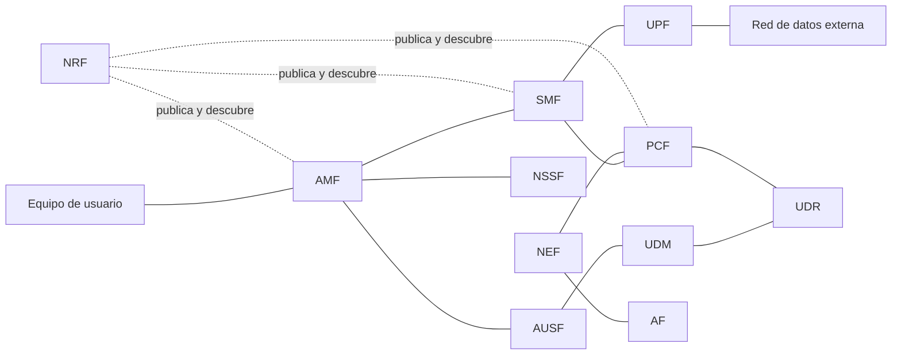

La quinta generación de comunicaciones móviles rediseña la red troncal para dar soporte
a servicios con requisitos muy distintos entre sí, desde el vídeo de alta definición
hasta el control de dispositivos industriales, sobre una misma infraestructura. Este
capítulo describe ese núcleo, conocido como `5GC`: sus funciones de red, el estilo de
interfaces que las conecta entre sí, el mecanismo de segmentación que le permite
adaptarse a servicios con requisitos opuestos y el modelo de calidad de servicio que
sostiene esa adaptación.

## Introducción

El núcleo de quinta generación (5G Core, `5GC`) abandona el modelo de elementos
monolíticos de generaciones anteriores en favor de un conjunto de **funciones de red**
independientes entre sí, que se comunican mediante interfaces basadas en servicios en
lugar de los puntos de referencia fijos de generaciones previas. Esta reorganización no
es un cambio cosmético: es la base que permite separar con precisión el plano de control
del plano de usuario, escalar cada función de forma independiente según la carga que
soporta y, sobre todo, ofrecer varias configuraciones de red distintas sobre una misma
infraestructura física mediante la **segmentación de red**, que este capítulo trata en
detalle porque es a este capítulo al que corresponde establecerla.

Esta reorganización se apoya en tecnologías de virtualización de funciones de red y de
redes definidas por software que hacen viable desplegar cada función como un servicio
software independiente en lugar de como equipo dedicado. Estas tecnologías son
habilitadoras de la arquitectura basada en servicios que se describe a continuación,
pero no son objeto de este capítulo. La interfaz radio de esta generación, con su
numerología flexible y su plano de protocolos, se trata en el capítulo siguiente de esta
misma generación.

## Objetivos y casos de uso

5G no diseña una red única y homogénea, sino una red capaz de adaptarse a tres familias
de casos de uso con requisitos que en algunos aspectos son opuestos entre sí. Esta
diversidad de objetivos es la razón última por la que el núcleo necesita un mecanismo
como la segmentación de red, descrito más adelante en este capítulo: ninguna
configuración única de red sirve simultáneamente a los tres casos de uso con la misma
eficiencia.

### Banda ancha móvil mejorada

La **banda ancha móvil mejorada** (enhanced Mobile Broadband, `eMBB`) cubre los
servicios que exigen grandes velocidades de datos y una cobertura homogénea, tanto en
entornos urbanos densos como en ubicaciones remotas. Es la continuación natural de los
servicios de datos de generaciones anteriores, con requisitos de _throughput_ y de
eficiencia espectral más exigentes que los de LTE.

### Comunicaciones masivas entre máquinas

Las **comunicaciones masivas de tipo máquina** (massive Machine-Type Communications,
`mMTC`) atienden aplicaciones con un número muy elevado de dispositivos conectados
simultáneamente, como redes de sensores, en las que cada dispositivo transmite poco
tráfico y no depende de una latencia reducida. El objetivo de diseño no es la velocidad
de transmisión de cada dispositivo, sino la densidad de dispositivos que la red puede
sostener a la vez sin saturar su señalización de control.

### Comunicaciones ultrafiables de baja latencia

Las **comunicaciones ultrafiables de baja latencia** (Ultra-Reliable Low-Latency
Communications, `URLLC`) sirven aplicaciones críticas, como los vehículos autónomos o el
control industrial, con requisitos estrictos tanto de retardo como de disponibilidad. A
diferencia de `eMBB`, donde una caída puntual de _throughput_ es tolerable, en `URLLC`
un paquete que llega tarde o que se pierde puede invalidar por completo la aplicación
que lo esperaba.

???+ example "Reparto de recursos entre un servicio de vídeo y uno de control"

    Un operador plantea si puede atender, con una única configuración de red, un
    servicio de streaming de vídeo en alta definición y un servicio de control remoto
    de brazos robóticos en una planta industrial. El servicio de vídeo tolera una
    reproducción con cierto retardo de buffer si a cambio recibe un caudal de datos
    elevado y sostenido, un perfil típico de `eMBB`. El servicio de control robótico, en
    cambio, no tolera un retardo apreciable en cada orden de movimiento, aunque el
    volumen de datos que intercambia sea pequeño, un perfil típico de `URLLC`. Ninguna
    configuración de red única sirve bien a ambos servicios: dimensionarla para el
    caudal del vídeo no reduce el retardo del control robótico, y dimensionarla para la
    latencia del control robótico no mejora el caudal del vídeo. La resolución de esta
    tensión mediante segmentos de red independientes sobre la misma infraestructura se
    retoma en el apartado de segmentación de este capítulo.

## Evolución desde el núcleo de cuarta generación

La arquitectura del `5GC` no parte de cero: evoluciona la red troncal de LTE, la
[`EPC`](../03_lte/section_1_arquitectura_eps.md#elementos-de-la-red-troncal), en dos
etapas sucesivas. La primera separa los planos de control y de usuario dentro de los
elementos que ya existían en `EPC`. La segunda reorganiza por completo esas funciones,
ya separadas, en un catálogo de servicios independientes.

### Separación de planos de control y de usuario

La primera etapa de la evolución, conocida como separación de planos de control y de
usuario (Control and User Plane Separation, `CUPS`), divide cada pasarela de la `EPC` en
un componente de control y un componente de usuario. La
[pasarela de servicio](../03_lte/section_1_arquitectura_eps.md#pasarela-de-servicio) se
divide en `SGW-C`, que conserva la señalización, y `SGW-U`, que conserva el reenvío de
paquetes. La
[pasarela de red de datos por paquetes](../03_lte/section_1_arquitectura_eps.md#pasarela-de-red-de-datos-por-paquetes)
se divide de forma equivalente en `PGW-C` y `PGW-U`. Esta separación permite escalar de
forma independiente la capacidad de señalización y la capacidad de reenvío de datos,
algo que la arquitectura original de `EPC`, con ambos planos integrados en el mismo
elemento, no permitía.

### Reorganización de funciones en servicios

La segunda etapa reorganiza los componentes de control ya separados por `CUPS` en un
catálogo de **funciones de red** independientes, cada una expuesta como un servicio con
un contrato de comunicación propio. Esta arquitectura basada en servicios sustituye los
puntos de referencia fijos de generaciones anteriores, con un protocolo y un propósito
prefijados para cada interfaz, por **interfaces basadas en servicios** (`SBI`), en las
que cualquier función de red puede exponer y consumir servicios de otras funciones a
través de un mecanismo de comunicación común, descrito en el apartado siguiente de este
capítulo. El resultado es una red central compuesta por funciones de aplicación y
protocolos de comunicación independientes de proveedor, en contraste con los protocolos
específicos de cada punto de referencia que caracterizaban a `EPC`.

## Funciones de red

El `5GC` reparte sus responsabilidades entre un conjunto de funciones de red, cada una
con un papel concreto. La tabla siguiente resume el catálogo antes de detallar cada
función en los apartados que siguen.

| Función                        | Sigla  | Papel principal                                                           |
| ------------------------------ | ------ | ------------------------------------------------------------------------- |
| Gestión de acceso y movilidad  | `AMF`  | Punto de terminación de la señalización de acceso, movilidad y seguridad. |
| Gestión de sesión              | `SMF`  | Creación, modificación y liberación de sesiones de datos.                 |
| Plano de usuario               | `UPF`  | Encaminamiento, reenvío y aplicación de calidad de servicio al tráfico.   |
| Servidor de autenticación      | `AUSF` | Ejecuta la autenticación del terminal y custodia sus claves.              |
| Gestión unificada de datos     | `UDM`  | Gestión de suscripción, identificación y autenticación del abonado.       |
| Repositorio de datos unificado | `UDR`  | Almacén común de datos estructurados de suscripción y de política.        |
| Datos no estructurados         | `UDSF` | Almacenamiento de datos no estructurados y de contexto de sesión.         |
| Control de políticas           | `PCF`  | Decide las políticas de movilidad y de calidad de servicio.               |
| Exposición de red              | `NEF`  | Traduce y expone de forma segura capacidades del núcleo al exterior.      |
| Repositorio de funciones       | `NRF`  | Publica y permite descubrir los perfiles de las funciones de red.         |
| Selección de segmento          | `NSSF` | Selecciona el segmento de red que atiende a cada terminal.                |
| Función de aplicación          | `AF`   | Servicio externo o interno que solicita capacidades de red al núcleo.     |



### Función de gestión de acceso y movilidad

La **función de gestión de acceso y movilidad** (Access and Mobility Management
Function, `AMF`) actúa como punto de terminación de las interfaces de la red de acceso
radio hacia el núcleo. Autentica al terminal en coordinación con `AUSF`, garantiza la
seguridad del acceso, gestiona la movilidad del terminal, sus estados de accesibilidad y
el registro y la conexión de cada terminal frente al núcleo. Es el equivalente funcional
de la
[entidad de gestión de movilidad](../03_lte/section_1_arquitectura_eps.md#entidad-de-gestion-de-movilidad)
de `EPC`, aunque en el `5GC` concentra únicamente las funciones de acceso y movilidad,
ya que la gestión de sesión se traslada a una función de red separada.

### Función de gestión de sesión

La **función de gestión de sesión** (Session Management Function, `SMF`) crea, modifica
y libera las sesiones de datos del terminal, y mantiene los túneles del plano de usuario
entre la función del plano de usuario y la estación base de esta generación. Esta
separación entre gestión de acceso y gestión de sesión, repartida en `EPC` entre un
único elemento, es una de las diferencias estructurales más visibles frente a la
generación anterior.

### Función del plano de usuario

La **función del plano de usuario** (User Plane Function, `UPF`) encamina y reenvía los
paquetes del usuario, inspecciona y clasifica ese tráfico, aplica la calidad de servicio
que le corresponde y actúa como punto de anclaje de movilidad tanto dentro de esta
generación como frente a tecnologías de acceso distintas. Sirve además como punto de
interconexión con las redes de datos externas y ejecuta, por delegación de la `SMF`, la
asignación de la dirección IP de cada terminal, un mecanismo de
[direccionamiento IP](../../02_redes/02_ip/section_1_protocolo_ip_y_direccionamiento.md#direccionamiento-ip)
común al resto de la red de datos: la decisión de qué dirección asignar corresponde a la
`SMF`, mientras que la `UPF` la ejecuta, en línea con el mismo patrón de separación
entre decisión y ejecución que rige el resto de funciones del plano de usuario. Los
paquetes del usuario se transportan en túneles del protocolo de túnel `GPRS` de usuario
(`GTP-U`) sobre las interfaces `N3`, entre la estación base y la `UPF`, y `N9`, entre
funciones del plano de usuario cuando el tráfico atraviesa más de una de ellas. La `UPF`
es el equivalente funcional de la
[pasarela de servicio](../03_lte/section_1_arquitectura_eps.md#pasarela-de-servicio) y
de la
[pasarela de red de datos por paquetes](../03_lte/section_1_arquitectura_eps.md#pasarela-de-red-de-datos-por-paquetes)
de `EPC`, ya separadas de sus componentes de control por `CUPS` y reunidas aquí en una
única función de plano de usuario.

### Funciones de autenticación y de datos de abonado

La **función de servidor de autenticación** (Authentication Server Function, `AUSF`)
ejecuta la autenticación del terminal y custodia las claves de seguridad derivadas de
ese proceso, en coordinación con la `AMF`. La **gestión unificada de datos** (Unified
Data Management, `UDM`) ofrece funcionalidades equivalentes a las del
[servidor de abonado propio](../03_lte/section_1_arquitectura_eps.md#servidor-de-abonado-propio)
de `EPC`, incluida la gestión de identificación y de autenticación del abonado.

A diferencia de `EPC`, el `5GC` separa el almacenamiento de datos de las funciones que
los consultan. El **repositorio de datos unificado** (Unified Data Repository, `UDR`) es
una base de datos común para las estructuras de datos estandarizadas de suscripción y de
política, consultada tanto por `UDM` como por `PCF`. La **función de almacenamiento de
datos no estructurados** (Unstructured Data Storage Function, `UDSF`) permite a
cualquier función de red almacenar y recuperar datos no estructurados, incluido el
contexto transitorio de la sesión de un terminal, lo que facilita que una función pueda
recuperar el estado de una sesión aunque la hubiera gestionado antes una instancia
distinta de esa misma función.

### Funciones de política, exposición y repositorio

La **función de control de políticas** (Policy Control Function, `PCF`) decide las
políticas de movilidad y de calidad de servicio que rigen cada sesión, consultando para
ello al `UDR`. Es el equivalente funcional de la
[función de control de políticas y tarificación](../03_lte/section_1_arquitectura_eps.md#funcion-de-control-de-politicas-y-tarificacion)
de `EPC`, aunque en el `5GC` sus políticas se estandarizan como parte del propio
catálogo de servicios en lugar de depender de un protocolo específico.

La **función de exposición de red** (Network Exposure Function, `NEF`) actúa como
traductor entre el núcleo y las aplicaciones externas: expone de forma segura
capacidades y eventos del núcleo hacia esas aplicaciones, representadas en el modelo del
`5GC` como **funciones de aplicación** (Application Function, `AF`). Una función de
aplicación de confianza para el operador puede acceder directamente a otras funciones de
red, mientras que una función de aplicación externa lo hace siempre a través de `NEF`,
que aplica las comprobaciones de seguridad correspondientes.

La **función de repositorio de funciones de red** (Network Repository Function, `NRF`)
mantiene los perfiles de las instancias de funciones de red disponibles y los servicios
que cada una admite. Cualquier función de red publica su perfil en el `NRF` al
desplegarse, y cualquier otra función consulta ese repositorio para descubrir qué
instancias concretas puede utilizar para un servicio dado, un mecanismo que se detalla
en el apartado de interfaces basadas en servicios más adelante en este capítulo.

???+ example "Puesta en marcha de una instancia nueva de gestión de sesión"

    Un operador añade una instancia adicional de `SMF` para atender el crecimiento de
    tráfico en una región. Al desplegarse, la nueva instancia publica en el `NRF` su
    perfil, que describe qué servicios puede prestar y con qué parámetros. A partir de
    ese momento, cualquier `AMF` que necesite establecer una sesión para un terminal de
    esa región puede consultar al `NRF`, obtener el perfil de la nueva instancia y
    dirigir hacia ella la solicitud de sesión, sin que haya sido necesario configurar de
    forma manual esa relación en ningún elemento de la red. El `NRF` no participa en el
    reenvío del tráfico de esa sesión ni decide qué segmento de red debe atenderla: se
    limita a publicar y a permitir el descubrimiento de los perfiles de las funciones
    disponibles, dos tareas distintas de la selección de segmento que corresponde a la
    `NSSF` y de la propia gestión de la sesión que corresponde a la `SMF`.

### Función de selección de segmento

La **función de selección de segmento de red** (Network Slice Selection Function,
`NSSF`) selecciona el segmento de red, o los segmentos, que deben atender a un terminal
concreto, a partir de los identificadores de segmento que ese terminal solicita durante
el registro. Esta función es la pieza que conecta el catálogo de funciones de red
descrito en este apartado con el mecanismo de segmentación de red que se desarrolla a
continuación en este capítulo.

## Interfaces basadas en servicios

Las funciones de red del `5GC` se comunican entre sí mediante **interfaces basadas en
servicios** (`SBI`), un modelo de comunicación común a toda la red central que sustituye
a los puntos de referencia fijos de `EPC`. Este apartado describe el protocolo que
sostiene esas interfaces, el mecanismo por el que una función descubre a otras y el caso
particular de la interfaz que gobierna el plano de usuario.

### Protocolo de aplicación y serialización

Las interfaces basadas en servicios emplean el protocolo `HTTP` sobre `TCP` como
protocolo de transporte de aplicación, con serialización de los mensajes en `JSON` y con
soporte del protocolo `TLS` para proteger las comunicaciones. Esta elección, común a
cualquier función de red del catálogo, es la que permite tratar la comunicación entre
funciones como un conjunto de llamadas a servicios web, en lugar de como un protocolo de
señalización específico para cada punto de referencia.

### Descubrimiento y selección de funciones

Cuando una función de red necesita un servicio de otra función, consulta primero al
`NRF` para descubrir qué instancias concretas prestan ese servicio, y a partir de esa
respuesta selecciona la instancia con la que va a comunicarse. Este descubrimiento
sucede cada vez que una función de red necesita localizar a otra, no solo en el momento
en que una instancia se despliega por primera vez.

???+ example "Registro de un terminal con selección de segmento y descubrimiento"

    Un terminal se conecta a la red y envía una solicitud de registro con los
    identificadores de segmento que necesita. La estación base de esta generación
    reenvía esa solicitud a una `AMF`, que autentica al terminal en coordinación con la
    `AUSF` y con la `UDM`. A continuación, la `AMF` consulta a la `NSSF`, que selecciona
    el segmento de red que va a atender al terminal a partir de los identificadores
    solicitados. Una vez seleccionado el segmento, la `AMF` necesita una `SMF` que
    pertenezca a ese segmento para establecer la sesión de datos, y para localizarla
    consulta al `NRF`, que le devuelve el perfil de una instancia de `SMF` disponible
    dentro de ese segmento. La `SMF` seleccionada establece entonces la sesión con la
    `UPF` correspondiente, que queda lista para transportar el tráfico del terminal.
    Cada función interviene en una fase distinta del procedimiento: la `NSSF` decide qué
    segmento atiende al terminal, y el `NRF` resuelve, dentro de ese segmento ya
    decidido, qué instancia concreta de `SMF` va a gestionarlo.

    ```mermaid linenums="1"
    sequenceDiagram
        participant UE as Terminal
        participant AMF as AMF
        participant AUSF as AUSF
        participant UDM as UDM
        participant NSSF as NSSF
        participant NRF as NRF
        participant SMF as SMF
        participant UPF as UPF
        UE->>AMF: solicitud de registro con identificadores de segmento
        AMF->>AUSF: autenticacion del terminal
        AUSF->>UDM: consulta de datos de suscripcion
        UDM-->>AUSF: perfil de autenticacion
        AUSF-->>AMF: autenticacion confirmada
        AMF->>NSSF: seleccion de segmento de red
        NSSF-->>AMF: segmento seleccionado
        AMF->>NRF: descubrimiento de instancia de SMF en el segmento
        NRF-->>AMF: perfil de instancia de SMF
        AMF->>SMF: solicitud de establecimiento de sesion
        SMF->>UPF: reglas de reenvio y de calidad de servicio
        UPF-->>SMF: sesion de plano de usuario establecida
    ```

### Interfaz de control del plano de usuario y sus reglas

La interfaz `N4` conecta a la `SMF` con la `UPF` y se distingue del resto de interfaces
del `5GC` en que no emplea el modelo `HTTP` de las interfaces basadas en servicios, sino
el **protocolo de control de reenvío de paquetes** (Packet Forwarding Control Protocol,
`PFCP`). A través de `N4`, la `SMF` añade, modifica y elimina reglas sobre la `UPF` para
gobernar cómo esta trata el tráfico de cada sesión.

Las reglas de `N4` se organizan en cuatro tipos, asociados entre sí dentro de una misma
sesión `PFCP`:

- **Regla de detección de paquetes** (`PDR`): identifica a qué paquetes de datos se
  aplica el resto de reglas asociadas.
- **Regla de cumplimiento de calidad de servicio** (`QER`): fija cómo aplicar la calidad
  de servicio a los paquetes detectados por su `PDR` asociada.
- **Regla de informes de uso** (`URR`): define qué mediciones de uso debe reportar la
  `UPF` para esos paquetes.
- **Regla de acción de reenvío** (`FAR`): determina hacia dónde y cómo se reenvían los
  paquetes ya tratados.

Una misma sesión `PFCP` puede contener varias `PDR`, cada una con sus propias reglas
`QER`, `URR` y `FAR` asociadas, lo que permite tratar de forma diferenciada, dentro de
la misma sesión de un terminal, los distintos flujos de tráfico que esa sesión
transporta.

## Segmentación de red

La **segmentación de red** (network slicing) es el mecanismo que permite ofrecer, sobre
una misma infraestructura física compartida, varias configuraciones de red adaptadas a
requisitos distintos, como los descritos en el apartado de objetivos y casos de uso al
inicio de este capítulo. No es una técnica exclusiva de 5G: existía ya en generaciones
anteriores en forma de redes centrales dedicadas, pero el `5GC` la incorpora como parte
nativa de su arquitectura basada en servicios en lugar de como una extensión añadida.

### Concepto de segmento

Un **segmento de red** (network slice) es una red lógica independiente que opera de
forma aislada dentro de la infraestructura compartida, formada por una combinación de
funciones de red, de recursos de acceso y de rutas de transporte, junto con las
políticas asociadas a esa combinación. Cada segmento cuenta con recursos y requisitos
personalizados para el servicio al que atiende. Un terminal puede acceder a varios
segmentos de forma simultánea manteniendo una única conexión de señalización con la red,
gestionada por la `AMF` que le atiende con independencia del número de segmentos a los
que pertenezca. La segmentación se aplica principalmente para particionar la red
central, aunque también puede extenderse a la red de acceso radio, cuya configuración de
recursos radio queda fuera del alcance de este capítulo.

### Tipos de servicio de segmento

El **tipo de servicio de segmento** (Slice Service Type, `SST`) define el comportamiento
de red que experimenta el usuario final de un segmento y las optimizaciones de funciones
de red asociadas a él. La siguiente tabla distingue los dos tratamientos posibles de un
valor de `SST`.

| Tipo de `SST`    | Alcance                                                              | Descripción                                                                         |
| ---------------- | -------------------------------------------------------------------- | ----------------------------------------------------------------------------------- |
| Estandarizado    | Global.                                                              | Comprensible entre operadores sin necesidad de acordar el segmento en itinerancia.  |
| No estandarizado | Único dentro de la red de acceso inalámbrico (`PLMN`) que lo define. | Identifica un segmento específico de ese operador, sin significado fuera de su red. |

### Aislamiento y priorización

El **aislamiento** entre segmentos es la propiedad que permite que la congestión o el
comportamiento anómalo de uno de ellos no afecte al resto de segmentos que comparten la
misma infraestructura. En momentos de congestión, las funciones de red de la capa de
control pueden priorizar unos segmentos frente a otros, mientras que en la capa de
usuario se aplican políticas de programación y de descarte de paquetes específicas de
cada segmento. La configuración de los recursos radio también puede variar entre
segmentos, un ajuste que corresponde a la interfaz radio de esta generación y que este
capítulo no desarrolla.

???+ example "Diseño de dos segmentos con requisitos opuestos en la misma red"

    Un operador despliega, sobre la misma infraestructura física, un segmento de tipo
    `eMBB` para un servicio de vídeo en directo y un segmento de tipo `URLLC` para un
    servicio de telecirugía. El segmento de vídeo prioriza un caudal de datos elevado y
    sostenido, y tolera que en momentos de congestión sus paquetes se retengan
    brevemente en el planificador antes de transmitirse. El segmento de telecirugía
    prioriza lo contrario: un retardo mínimo y predecible en cada paquete, aunque su
    volumen de tráfico sea reducido, y no tolera que sus paquetes esperen detrás de los
    del segmento de vídeo en ningún punto de la red. El aislamiento entre ambos
    segmentos es lo que permite que, ante una congestión puntual, las políticas de
    programación y de descarte de paquetes prioricen al segmento de telecirugía sin que
    el operador tenga que sacrificar el caudal contratado para el segmento de vídeo en
    el resto del tiempo, ni desplegar dos infraestructuras físicas separadas para
    conseguirlo.

    ```mermaid linenums="1"
    flowchart TB
        subgraph INFRA[Infraestructura fisica compartida]
            AMF1[AMF]
            UPF1[UPF]
        end
        subgraph SEGMENTO_EMBB[Segmento eMBB]
            SMF_A[SMF video]
            UPF_A[UPF video]
        end
        subgraph SEGMENTO_URLLC[Segmento URLLC]
            SMF_B[SMF telecirugia]
            UPF_B[UPF telecirugia]
        end
        AMF1 --> SMF_A
        AMF1 --> SMF_B
        SMF_A --> UPF_A
        SMF_B --> UPF_B
        UPF_A --> INFRA
        UPF_B --> INFRA
    ```

## Calidad de servicio en 5G

El modelo de calidad de servicio del `5GC` sustituye a los
[portadores de LTE](../03_lte/section_1_arquitectura_eps.md#calidad-de-servicio-y-portadores)
por un esquema de flujos y de identificadores que se detalla en los apartados
siguientes, cerrando este capítulo con una comparación explícita frente a ese modelo
anterior.

### Flujos de calidad e identificadores

El tráfico de una sesión de datos se organiza en **flujos de calidad de servicio** (QoS
flows), cada uno identificado por un **identificador de flujo de calidad de servicio**
(QoS Flow Identifier, `QFI`). Todos los paquetes marcados con el mismo `QFI` reciben el
mismo tratamiento de calidad de servicio a lo largo de la red, con independencia de por
cuántos túneles `N3` o `N9` distintos atraviesen esa red. Un mecanismo adicional, el
**atributo de calidad de servicio reflexiva** (Reflective QoS Attribute, `RQA`),
exclusivo de los flujos no `GBR`, permite que el terminal infiera la calidad de servicio
que debe aplicar en el enlace ascendente a partir de la que observa en el enlace
descendente, lo que reduce la señalización necesaria para configurar ambos sentidos por
separado.

### Perfiles y parámetros asociados

Cada flujo de calidad de servicio se configura mediante un conjunto de parámetros, cuyo
significado se resume en la siguiente tabla.

| Parámetro | Aplica a                           | Efecto principal                                                                |
| --------- | ---------------------------------- | ------------------------------------------------------------------------------- |
| `5QI`     | Todos los flujos.                  | Identificador de perfil de calidad de servicio, equivalente al `QCI` de LTE.    |
| `ARP`     | Todos los flujos.                  | Prioridad de asignación y de retención de recursos entre flujos en competencia. |
| `GFBR`    | Flujos `GBR`.                      | Tasa de bits garantizada reservada para el flujo.                               |
| `MFBR`    | Flujos `GBR`.                      | Tasa máxima de bits admisible para el flujo.                                    |
| `PDB`     | Flujos `GBR` críticos en latencia. | Presupuesto de retardo de paquete admisible.                                    |
| `PER`     | Flujos `GBR` críticos en latencia. | Tasa de error de paquete admisible.                                             |
| `MDBV`    | Flujos `GBR` críticos en latencia. | Volumen máximo de ráfaga de datos admisible.                                    |

Una **función de análisis de datos de red** (Network Data Analytics Function, `NWDAF`)
puede recopilar y analizar información de la red para asistir a la `PCF` en sus
decisiones de calidad de servicio, aunque la decisión última sobre qué perfil aplicar a
cada flujo sigue correspondiendo a la `PCF`.

???+ example "Mapeo de tres servicios simultáneos sobre sus flujos de calidad"

    Un terminal mantiene a la vez una llamada de voz, una sesión de mensajería con
    sensores de un vehículo compartido y una descarga de ficheros en segundo plano. La
    llamada de voz necesita un flujo `GBR` con un `5QI` de prioridad alta, un `PDB`
    reducido y una `GFBR` acorde al códec empleado, porque un retardo apreciable degrada
    la conversación de forma perceptible. La mensajería de los sensores del vehículo se
    resuelve con un flujo no `GBR`, ya que su volumen de datos es pequeño y no depende
    de una tasa garantizada, aunque puede beneficiarse del `RQA` para ajustar su enlace
    ascendente sin señalización adicional. La descarga de ficheros se resuelve también
    con un flujo no `GBR`, con el `5QI` de menor prioridad de los tres, porque tolera
    variaciones de velocidad sin que el usuario perciba una degradación equivalente a la
    de la llamada de voz. La decisión de qué `5QI` y qué `ARP` corresponde a cada flujo
    la toma la `PCF`, no la `UPF`: la `UPF` se limita a aplicar sobre el tráfico real la
    decisión que la `PCF` le ha comunicado a través de la `SMF`.

### Tasas agregadas por sesión y por terminal

Los flujos no `GBR` de una misma sesión comparten un límite agregado de tasa de bits, la
**tasa máxima agregada por sesión** (Session Aggregate Maximum Bit Rate,
`Session-AMBR`), que fija la tasa máxima conjunta para todos los flujos no `GBR` de esa
sesión. Un límite equivalente, la **tasa máxima agregada por terminal** (UE Aggregate
Maximum Bit Rate, `UE-AMBR`), fija la tasa máxima conjunta para todas las sesiones no
`GBR` de un mismo terminal. Ninguno de los dos límites se aplica a los flujos `GBR`, que
disponen de su propia `GFBR` y de su propia `MFBR` independientes.

### Comparación con el modelo de LTE

El modelo de calidad de servicio de 5G introduce varias diferencias frente al de LTE. Un
único túnel `GTP-U` puede transportar varios flujos de calidad de servicio diferenciados
por su `QFI`, mientras que en LTE cada
[portador `EPS`](../03_lte/section_1_arquitectura_eps.md#portadores-con-y-sin-tasa-garantizada)
requería su propio túnel y su propio identificador de portador de capa inferior. Esta
simplificación reduce la señalización del plano de control necesaria para gestionar la
calidad de servicio de una sesión con varios flujos. El `5QI` de 5G desempeña el mismo
papel que el
[`QCI`](../03_lte/section_1_arquitectura_eps.md#identificador-de-clase-de-calidad) de
LTE, y el `ARP` conserva el mismo nombre y el mismo propósito en ambas generaciones. La
calidad de servicio reflexiva, sin equivalente en el modelo de
[plantillas de flujo de tráfico](../03_lte/section_1_arquitectura_eps.md#plantillas-de-flujo-de-trafico)
de LTE, es la novedad que más reduce la señalización necesaria en el enlace ascendente.

## Interoperación con LTE

El despliegue de 5G no sustituye de forma inmediata a la infraestructura de LTE
existente. Este apartado describe cómo ambas generaciones pueden coexistir, tanto a
nivel de arquitectura de despliegue como a nivel de portador individual.

### Despliegues autónomos y no autónomos

Un despliegue **autónomo** (standalone, `SA`) conecta la estación base de esta
generación directamente al `5GC`, sin depender de ningún elemento de LTE. Un despliegue
**no autónomo** (non-standalone, `NSA`) permite en cambio activar 5G sin sustituir la
infraestructura de LTE existente: en la primera fase de esta variante, la estación base
de LTE actúa como nodo maestro, gestiona la señalización de la celda de esta generación
y se apoya en el núcleo de red de LTE ya desplegado, mientras que la estación base de
esta generación aporta únicamente capacidad de datos adicional. En una fase posterior,
los papeles se invierten y la estación base de esta generación pasa a actuar como nodo
maestro, conectada de forma autónoma al `5GC` mientras la estación base de LTE se
mantiene como apoyo de señalización.

???+ example "Decisión entre activar 5G de forma autónoma o apoyada en LTE"

    Un operador que ya dispone de una red LTE consolidada evalúa cómo activar servicio
    de 5G en una ciudad sin interrumpir el servicio existente. Optar por un despliegue
    no autónomo le permite activar estaciones base de esta generación de forma
    incremental, apoyándose en la estación base de LTE como nodo maestro y en el núcleo
    de LTE ya desplegado para la señalización, sin necesidad de desplegar de inmediato
    un `5GC` completo. Optar por un despliegue autónomo, en cambio, exige tener
    desplegado el `5GC` desde el principio y conectar a él directamente la estación base
    de esta generación, sin depender del núcleo de LTE, lo que retrasa la puesta en
    servicio pero evita mantener una dependencia sobre la infraestructura de la
    generación anterior. La elección entre ambas opciones no es una decisión técnica
    sobre la interfaz radio, sino una decisión de despliegue sobre qué núcleo de red
    gestiona la señalización de cada celda mientras dura la transición entre
    generaciones.

### División de portadores

La **división de portadores** (split bearer) permite ofrecer un mismo servicio repartido
entre la interfaz de LTE y la de esta generación, de modo que el terminal recibe datos
de una misma sesión a través de ambas tecnologías de acceso a la vez. Esta técnica
mejora la flexibilidad y la eficiencia en la entrega de datos, porque permite aprovechar
la capacidad disponible en ambas interfaces en lugar de limitar la sesión a una sola de
ellas, y una división precisa de los recursos y de las políticas de calidad de servicio
entre ambos tramos mejora tanto el retardo percibido como la gestión global del
servicio. La división de portadores es habitual precisamente en los despliegues no
autónomos descritos en el apartado anterior, donde ambas tecnologías de acceso ya
comparten un mismo núcleo de red durante la transición entre generaciones.
