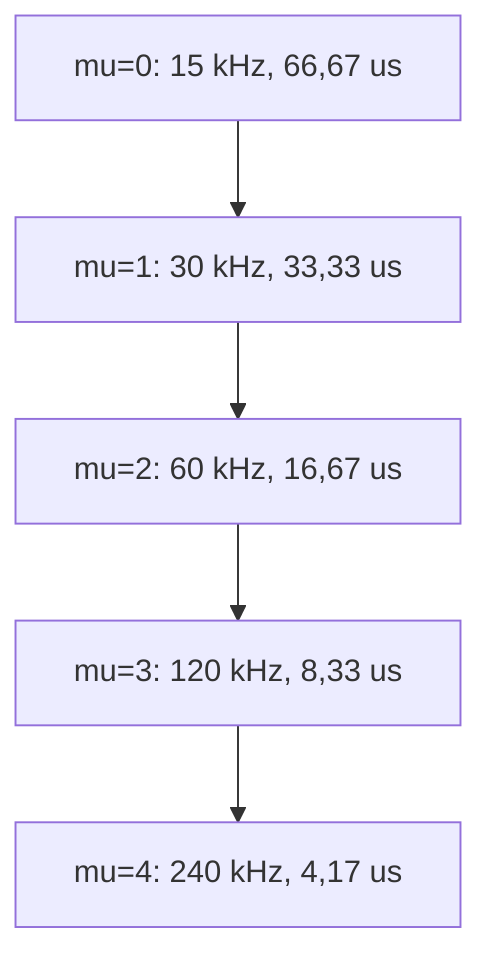
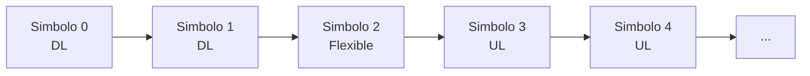
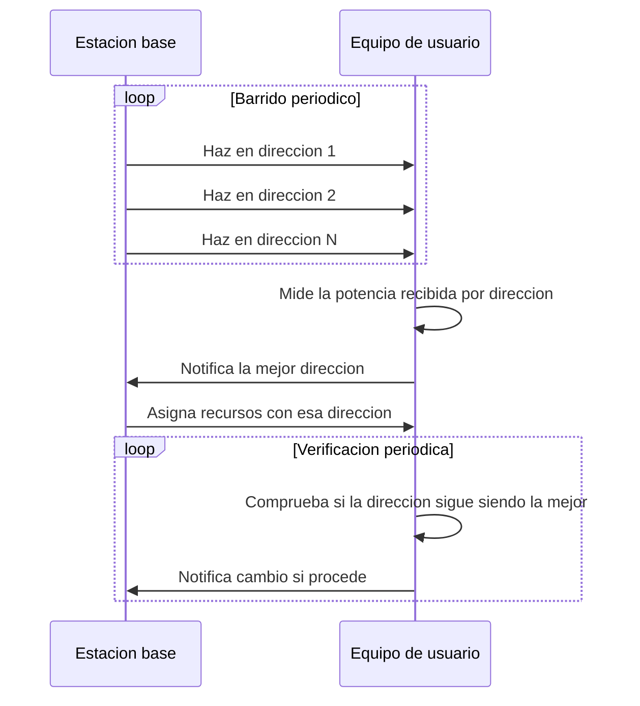

La interfaz radio de quinta generación, conocida como **New Radio** (`NR`), reutiliza la
familia OFDM descrita en
[OFDM y SC-FDM](../../01_fundamentos/04_acceso_al_medio/section_4_ofdm_y_sc_fdm.md) y la
malla de recursos que [interfaz radio de LTE](../03_lte/section_2_interfaz_radio.md)
particulariza en una única configuración fija de subportadoras y de prefijo cíclico. NR
generaliza esa particularización: en lugar de un único juego de parámetros, define un
conjunto reducido de configuraciones intercambiables dentro de la misma portadora, capaz
de servir simultáneamente bandas por debajo de 6 GHz y bandas de ondas milimétricas, y
de acomodar servicios con requisitos de latencia y de movilidad muy distintos. Este
capítulo recorre esa generalización desde los rangos de frecuencia hasta el MIMO masivo,
dejando fuera del alcance el núcleo de red y la segmentación de red, que pertenecen a la
arquitectura de la red central.

## Introducción

NR conserva de OFDM el mecanismo de resistencia frente a los ecos del canal, la
extensión cíclica de cada símbolo, y de la interfaz radio de LTE la organización del
tiempo en tramas de 10 milisegundos y subtramas de 1 milisegundo. Lo que NR añade es la
capacidad de variar, dentro de esa misma organización temporal, la separación entre
subportadoras y por tanto la duración del símbolo, en función de la banda de frecuencia
empleada y del servicio que se transporta. Esa variabilidad, denominada **numerología
variable**, es el rasgo que distingue la interfaz radio de quinta generación de sus
antecesoras y el que condiciona buena parte de las decisiones descritas en el resto del
capítulo: la duración de la ranura, el escalado del prefijo cíclico, la planificación de
recursos y la propia estructura de los canales de control.

## Nodos de la red de acceso

La red de acceso radio de NR, la `NG-RAN`, se apoya en dos tipos de nodo. El **gNB**
desempeña sobre NR la función equivalente al `eNodeB` de LTE: ofrece las terminaciones
de protocolo de la interfaz radio hacia el equipo de usuario, gestiona el acceso de
múltiples terminales, realiza las mediciones y el control de celda, el control de
admisión, el traspaso y la distribución de recursos. El **ng-eNB** ofrece en cambio
terminaciones de protocolo `E-UTRA`, la interfaz radio de LTE, pero conectado a la red
central de quinta generación, lo que permite a un terminal LTE obtener conectividad a
través de esa red central sin que la estación base tenga que implementar NR. Ambos tipos
de nodo se interconectan entre sí mediante la interfaz **Xn**, que en su plano de
control gestiona la movilidad del terminal, la transferencia de contexto entre celdas y
el aviso de llamada durante la conectividad dual, y en su plano de usuario se limita al
reenvío de datos y al control de flujo entre nodos vecinos.

Hacia la red central, cada nodo de la `NG-RAN` emplea la interfaz **NG**, dividida en un
plano de control que transporta el contexto del terminal, la señalización de movilidad,
los mensajes de la capa de no acceso y el aviso de llamada, y un plano de usuario que
entrega los paquetes de datos sin garantía de entrega extremo a extremo. Las funciones
de red que terminan esa interfaz por el lado de la red central quedan fuera del alcance
de este capítulo.

## Rangos de frecuencia

NR opera sobre un intervalo de frecuencias mucho más amplio que el de las generaciones
anteriores, dividido en dos rangos con propiedades de propagación y requisitos de antena
muy distintos, más una variante de enlace ascendente pensada específicamente para
extender la cobertura.

### Rango por debajo de 6 GHz

El **rango de frecuencia 1** (`FR1`) cubre las bandas por debajo de 6 GHz, hereda buena
parte de la propagación ya conocida de LTE y admite un ancho de banda de canal máximo de
100 MHz por portadora, con una modulación máxima de 256-QAM. Estas cifras no suponen una
mejora directa sobre LTE en ancho de banda ni en constelación: la ganancia de `FR1`
frente a la generación anterior procede de la numerología variable, de la eficiencia de
las señales de referencia y de las técnicas MIMO descritas más adelante, no de una banda
más ancha por sí misma. Las celdas en `FR1` son, en consecuencia, del mismo orden de
tamaño que las celdas macro de LTE.

### Rango de ondas milimétricas

El **rango de frecuencia 2** (`FR2`) cubre las bandas de ondas milimétricas: desde
$24{,}25$ hasta $52{,}6$ GHz en la definición inicial de la especificación, ampliada
hasta $71$ GHz en versiones posteriores mediante la banda adicional `FR2-2`. Permite
anchos de banda de canal de hasta 400 MHz por portadora, casi cuatro veces el máximo de
`FR1`. Ese ancho de banda adicional se paga con una propagación mucho más desfavorable:
a esas frecuencias las pérdidas de espacio libre son mayores y obstáculos relativamente
pequeños, como una persona o una hoja de vidrio, pueden bloquear la señal por completo.
La compensación pasa por el uso sistemático de _beamforming_ con arreglos de antenas de
gran tamaño, que se describe en la sección de MIMO masivo, y por el despliegue de
picoceldas que reducen la distancia entre la estación base y el terminal.

### Enlace ascendente suplementario

El **enlace ascendente suplementario** (_supplementary uplink_) añade una banda de
frecuencia adicional, más baja que la banda principal, dedicada exclusivamente al
sentido ascendente. Su propósito es compensar la asimetría de potencia entre estación
base y terminal cuando la banda principal opera en frecuencias altas: transmitir el
enlace ascendente en una frecuencia más baja reduce las pérdidas de propagación en el
sentido en el que la potencia disponible es más escasa, lo que resulta especialmente
útil para transmisiones de señalización ligera, como las confirmaciones de recepción,
que no requieren el ancho de banda de la banda principal pero sí se benefician de un
mayor alcance.

## Numerología variable

La numerología variable adapta la separación entre subportadoras, y por tanto la
duración del símbolo, a la frecuencia de la portadora y al servicio transportado. La
malla de recursos de LTE fija esa separación en 15 kHz para toda circunstancia; NR
convierte ese valor fijo en el primer término de una familia de configuraciones
relacionadas entre sí por una potencia de dos.

### Separación entre subportadoras y duración de símbolo

Cada numerología se identifica mediante un índice entero $\mu$, y determina la
separación entre subportadoras según:

$$
\Delta f_\mu = 2^\mu \times 15\ \text{kHz}
$$

donde $\Delta f_\mu$ es la separación entre subportadoras de la numerología $\mu$ y $15\
\text{kHz}$ es la separación de referencia, la misma que emplea LTE de forma fija. La
condición de ortogonalidad de OFDM, $\Delta f = 1/T_S$, deducida en
[portadoras complejas ortogonales](../../01_fundamentos/04_acceso_al_medio/section_4_ofdm_y_sc_fdm.md#portadoras-complejas-ortogonales),
liga esa separación con la duración útil del símbolo:

$$
T_{u,\mu} = \frac{1}{\Delta f_\mu} = \frac{T_{u,0}}{2^\mu}
$$

donde $T_{u,\mu}$ es la duración útil del símbolo de la numerología $\mu$, sin prefijo
cíclico, y $T_{u,0} = 66{,}67\ \mu\text{s}$ es la duración útil del símbolo de la
numerología de referencia $\mu = 0$, idéntica a la de LTE con prefijo cíclico normal.
Cada incremento de $\mu$ duplica la separación entre subportadoras y reduce a la mitad
la duración del símbolo, de modo que la numerología más ancha resulta la más adecuada
para transmisiones que necesitan símbolos cortos, como las de alta movilidad, y la más
estrecha resulta la más adecuada para entornos con mayor dispersión temporal del canal.

El estándar define la familia hasta $\mu = 4$, con las numerologías $\mu = 0$ y $\mu =
1$ reservadas a `FR1` y las numerologías $\mu = 2$ a $\mu = 4$ disponibles también en
`FR2`, donde el ruido de fase del oscilador local, más severo a frecuencias altas, hace
necesaria una separación entre subportadoras mayor para mantener una relación
señal-ruido de fase aceptable. La tabla siguiente reúne la familia completa, apoyada en
la duplicación anterior y verificada término a término a partir de ella, dado que las
fuentes de partida no conservan estas cifras con la precisión suficiente para
publicarlas sin reconstruirlas.

| Numerología $\mu$ | $\Delta f_\mu$ | $T_{u,\mu}$ (símbolo útil) | Rango habitual                        |
| ----------------- | -------------- | -------------------------- | ------------------------------------- |
| 0                 | 15 kHz         | 66,67 µs                   | `FR1`                                 |
| 1                 | 30 kHz         | 33,33 µs                   | `FR1`                                 |
| 2                 | 60 kHz         | 16,67 µs                   | `FR1` y `FR2`                         |
| 3                 | 120 kHz        | 8,33 µs                    | `FR2`                                 |
| 4                 | 240 kHz        | 4,17 µs                    | `FR2`, solo señales de sincronización |

### Escalado del prefijo cíclico

El prefijo cíclico de NR se escala con la misma proporción que el símbolo útil, en lugar
de mantener una duración fija como en LTE. La subtrama conserva su duración de 1
milisegundo, heredada de LTE, e incluye siempre 14 símbolos con prefijo cíclico normal,
de modo que la duración total de cada símbolo, prefijo incluido, resulta:

$$
T_{\text{símb},\mu} = \frac{T_{\text{ranura},\mu}}{14} = \frac{1\ \text{ms}}{2^\mu \times 14}
$$

donde $T_{\text{ranura},\mu}$ es la duración de la ranura de la numerología $\mu$,
introducida en el apartado siguiente, y $T_{\text{símb},\mu}$ es la duración de cada
símbolo con su prefijo. La duración del prefijo se obtiene por diferencia:

$$
T_{G,\mu} = T_{\text{símb},\mu} - T_{u,\mu}
$$

Al duplicarse $\mu$, tanto $T_{\text{símb},\mu}$ como $T_{u,\mu}$ se reducen a la mitad
en la misma proporción, de modo que $T_{G,\mu}$ también se reduce a la mitad y la
fracción de prefijo sobre el símbolo se mantiene aproximadamente constante en torno al
siete por ciento, la misma proporción que el prefijo cíclico normal de LTE guarda con su
símbolo útil, según
[configuraciones de prefijo cíclico](../03_lte/section_2_interfaz_radio.md#configuraciones-de-prefijo-ciclico).
Esa proporción constante es la que permite calificar la numerología variable como una
generalización de la malla de LTE y no como un esquema independiente: LTE es el caso
particular $\mu = 0$ de esta misma familia.

???+ example "Elección de numerología para un servicio con retardo ajustado"

    Un servicio de conducción asistida exige un presupuesto de retardo de transmisión
    por debajo de 0,5 milisegundos y opera en un entorno urbano con una dispersión
    temporal máxima estimada en $\Delta\tau_\text{máx} = 0{,}9\ \mu\text{s}$, propia de
    una picocelda con trayectos reflejados de corto alcance.

    La numerología $\mu = 2$, con $\Delta f_2 = 60\ \text{kHz}$, ofrece una duración de
    símbolo útil $T_{u,2} = 16{,}67\ \mu\text{s}$ y una duración de ranura
    $T_{\text{ranura},2} = 1\ \text{ms} / 2^2 = 0{,}25\ \text{ms}$, dentro del
    presupuesto de la aplicación. Su duración de símbolo con prefijo resulta

    $$
    T_{\text{símb},2} = \frac{0{,}25\ \text{ms}}{14} = 17{,}86\ \mu\text{s}
    $$

    de donde el prefijo cíclico mide
    $T_{G,2} = 17{,}86 - 16{,}67 = 1{,}19\ \mu\text{s}$. Esa duración supera con margen
    holgado la dispersión temporal del entorno, siguiendo
    la misma condición $T_G \ge \Delta\tau_\text{máx}$ que gobierna el dimensionado del
    prefijo en
    [intervalo de guarda](../../01_fundamentos/04_acceso_al_medio/section_4_ofdm_y_sc_fdm.md#intervalo-de-guarda),
    de modo que $\mu = 2$ resulta una elección válida tanto para el retardo como para la
    inmunidad a los ecos del entorno.

    La numerología $\mu = 3$ reduciría aún más el retardo por ranura, hasta
    $0{,}125\ \text{ms}$, pero su prefijo cíclico de $0{,}595\ \mu\text{s}$ deja un
    margen mucho más ajustado frente a la misma dispersión temporal, y en un entorno con
    trayectos algo más largos dejaría de cubrirla. La elección de numerología no puede
    resolverse mirando solo el presupuesto de retardo: exige comprobar, en el mismo
    paso, que el prefijo resultante siga cubriendo la dispersión temporal del entorno de
    despliegue.

### Interferencia entre numerologías

Cuando dos numerologías distintas coexisten dentro de la misma banda de frecuencia,
compartiendo la portadora entre servicios con requisitos distintos, sus subportadoras
dejan de ser mutuamente ortogonales: la condición de ortogonalidad de
[portadoras complejas ortogonales](../../01_fundamentos/04_acceso_al_medio/section_4_ofdm_y_sc_fdm.md#portadoras-complejas-ortogonales)
se define para un único valor de $\Delta f$, y dos numerologías con separaciones
distintas no completan un número entero de periodos la una respecto de la otra dentro
del intervalo de símbolo de la contraria. El resultado es una interferencia mutua entre
las subportadoras de ambas numerologías, denominada **interferencia entre
numerologías**, cuya magnitud crece con la diferencia entre las separaciones de
subportadora empleadas y con la proximidad espectral entre las asignaciones de cada
servicio. Mitigar esta interferencia exige dejar una banda de guarda entre las regiones
de espectro asignadas a cada numerología, en un compromiso similar al que ya resuelve el
prefijo cíclico frente a los ecos del canal, pero aplicado en el dominio de la
coexistencia entre configuraciones en lugar de entre símbolos consecutivos.

### Slots de duración variable

La **ranura** (_slot_) conserva en toda numerología un número fijo de 14 símbolos con
prefijo cíclico normal, de modo que su duración se deriva directamente de la duración
del símbolo con prefijo:

$$
T_{\text{ranura},\mu} = \frac{1\ \text{ms}}{2^\mu}
$$

Esta relación es la generalización directa de la subtrama de LTE, que en los términos de
[trama, subtrama y slot](../03_lte/section_2_interfaz_radio.md#trama-subtrama-y-slot)
coincide con dos _slots_ de 0,5 milisegundos bajo una única numerología fija. En NR, la
subtrama sigue durando 1 milisegundo y sigue conteniendo un número de _slots_ igual a
$2^\mu$, pero ese número varía con la numerología en lugar de ser siempre dos.

| Numerología $\mu$ | _Slots_ por subtrama | Duración de la ranura |
| ----------------- | -------------------- | --------------------- |
| 0                 | 1                    | 1 ms                  |
| 1                 | 2                    | 0,5 ms                |
| 2                 | 4                    | 0,25 ms               |
| 3                 | 8                    | 0,125 ms              |
| 4                 | 16                   | 0,0625 ms             |

???+ example "Comparación de la duración de ranura entre dos numerologías"

    Un planificador debe repartir recursos entre un servicio de banda ancha móvil, que
    opera con $\mu = 0$, y un servicio de baja latencia, que opera con $\mu = 3$ sobre
    la misma portadora mediante partes de ancho de banda distintas.

    Con $\mu = 0$, cada decisión de asignación cubre una ranura de $1\ \text{ms}$, el
    mismo intervalo que un `TTI` de LTE. Con $\mu = 3$, la ranura mide
    $1\ \text{ms} / 2^3 = 0{,}125\ \text{ms}$, ocho veces más corta. En el tiempo que el
    servicio de banda ancha tarda en completar una sola ranura, el servicio de baja
    latencia dispone de ocho oportunidades de planificación independientes.

    Esa diferencia es la que permite que el _scheduler_ de NR asigne recursos urgentes
    al servicio de baja latencia sin esperar a que termine la ranura larga del servicio
    de banda ancha en curso, mediante el adelantamiento de transmisión que se describe
    en la planificación de recursos: una ranura corta no acelera por sí misma la
    transmisión de un paquete, pero multiplica el número de instantes en los que esa
    transmisión puede comenzar.

## Duplexación y partes de ancho de banda

### Duplexación por división de frecuencia y de tiempo

NR admite tanto la **duplexación por división de frecuencia** (`FDD`) como la
**duplexación por división de tiempo** (`TDD`), en línea con los modos ya descritos para
LTE en
[modos de duplexación](../03_lte/section_2_interfaz_radio.md#modos-de-duplexacion). La
configuración `TDD` puede ser semiestática, con un patrón de asignación entre enlace
ascendente y descendente fijado por la red y conocido de antemano por el terminal, o
dinámica, adaptada en cada instante a la carga de tráfico real. La configuración
dinámica exige gestionar la interferencia entre celdas vecinas que en un instante dado
transmiten en sentidos distintos, un problema mucho más contenido en celdas pequeñas o
aisladas que en despliegues macrocelulares densos, donde esa asimetría instantánea entre
vecinos resulta más difícil de coordinar.

### Configuración flexible de símbolos en la ranura

Además de la asignación semiestática entre enlace ascendente y descendente, NR permite
declarar cada símbolo individual de una ranura como de enlace descendente, de enlace
ascendente o **flexible**, este último decidido de forma dinámica por la propia
señalización de control de esa ranura. Esta granularidad por símbolo, en lugar de por
subtrama completa como en el `TDD` de LTE, permite que una misma ranura sirva primero al
enlace descendente y, tras un breve periodo de conmutación, ceda el resto de sus
símbolos al enlace ascendente, sin necesidad de esperar al límite de la siguiente
ranura.

### Partes de ancho de banda

Una **parte de ancho de banda** (_bandwidth part_, `BWP`) es un subconjunto de bloques
de recursos comunes contiguos dentro del ancho de banda total de la celda, situado por
encima del _scheduler_ en la pila de procesado. Un terminal puede tener configuradas
hasta tres partes de ancho de banda y opera en un instante dado sobre una única parte
activa, a la que el gNB lo conmuta mediante señalización. Esta capacidad responde a que
NR puede ofrecer anchos de banda de celda muy superiores a los que un terminal de gama
básica necesita monitorizar de forma continua: mantener activo únicamente el subconjunto
de espectro que el terminal está usando en cada momento reduce su consumo de energía sin
renunciar al ancho de banda de celda completo cuando el tráfico lo exige. El **conjunto
de recursos de control** de cada parte de ancho de banda, descrito en el apartado de
canales de control, se sitúa siempre dentro de los límites de su parte activa: un
conjunto de recursos de control puede ser más o menos amplio en frecuencia, pero nunca
excede el ancho de banda de la parte a la que pertenece, ni tiene por qué ocupar todo el
ancho de banda de la celda.

## Modulación y codificación

NR emplea las mismas familias de modulación digital que LTE, desde `BPSK` hasta 256-QAM,
según el catálogo general descrito en
[modulaciones digitales](../../01_fundamentos/03_modulacion/section_2_modulaciones_digitales.md),
pero sustituye los códigos de canal empleados para los datos de usuario y añade una
familia distinta para la señalización de control.

### Codificación LDPC para datos

Los canales de datos de NR emplean **códigos de comprobación de paridad de baja
densidad** (`LDPC`), ya descritos en
[códigos de comprobación de paridad de baja densidad](../../01_fundamentos/05_codificacion/section_1_codificacion_de_canal.md#codigos-de-comprobacion-de-paridad-de-baja-densidad),
en sustitución de los turbocódigos que empleaba LTE. El codificador de NR trabaja con
dos matrices base y dos tasas de codificación distintas, y selecciona la matriz concreta
en función del tamaño del bloque de transporte, lo que fija a su vez el tamaño de la
submatriz que emplea el descodificador. Un **búfer circular** ajusta la tasa de
codificación efectiva mediante perforado y repetición, y mantiene varios índices de
versión de redundancia para las retransmisiones del esquema `HARQ` descrito en
[HARQ](../../01_fundamentos/05_codificacion/section_3_adaptacion_de_enlace_y_retransmision.md#harq).
La preferencia por LDPC sobre los turbocódigos sigue el mismo argumento de paralelismo
de descodificación desarrollado en
[códigos LDPC frente a turbo códigos](../../01_fundamentos/05_codificacion/section_2_codigos_convolucionales.md#codigos-ldpc-frente-a-turbo-codigos):
un descodificador LDPC propaga mensajes entre nodos de un grafo disperso sin depender de
una alternancia secuencial, lo que reduce la latencia y el consumo por bit decodificado
en los volúmenes de datos que maneja NR.

### Códigos polares para señalización

Los canales de control emplean en cambio **códigos polares**, descritos en
[códigos polares para señalización](../../01_fundamentos/05_codificacion/section_2_codigos_convolucionales.md#codigos-polares-para-senalizacion),
elegidos precisamente por su buen comportamiento con los bloques cortos que caracterizan
a la señalización de control, un régimen en el que ni LDPC ni los turbocódigos, pensados
para bloques largos, resultan competitivos.

### Entrelazado con prioridad de bits sistemáticos

Tras la codificación LDPC, NR aplica un **entrelazado con prioridad para bits
sistemáticos**: los bits sistemáticos y los bits de paridad producidos por el
codificador se introducen por filas en una memoria de entrelazado, y la extracción de
bits para la transmisión se realiza por columnas. Ese orden de extracción garantiza que
los primeros bits transmitidos de cada bloque sean sistemáticos, es decir, los que
transportan directamente la información y no la redundancia añadida por el código, lo
que concentra la protección donde resulta más valiosa si el canal degrada la transmisión
antes de completarse por entero.

## Planificación de recursos

### Asignación en slots

La asignación de recursos de radio en NR se realiza a nivel de ranura, considerando de
forma conjunta el estado del búfer de transmisión, los requisitos de calidad de servicio
del flujo y las condiciones instantáneas del canal radio, con el objetivo de determinar
en cada ranura la velocidad de transmisión más adecuada para las condiciones vigentes.
En el enlace ascendente, además, la programación de paquetes es sensible a la potencia
disponible en el terminal, de modo que la asignación de recursos no solo persigue la
máxima eficiencia espectral, sino también una utilización del margen de potencia del
terminal compatible con su presupuesto energético.

### Planificación semipersistente

La **planificación semipersistente** (`SPS`) reserva de antemano un patrón periódico de
recursos para tráficos cuya llegada es previsible, como los flujos de voz o de
telemetría con periodicidad fija, evitando así la señalización de control que
acompañaría a una asignación dinámica en cada ranura. Esta técnica sacrifica la
flexibilidad de adaptar la asignación a las condiciones instantáneas del canal a cambio
de reducir de forma sustancial el _overhead_ de señalización cuando el patrón de tráfico
es efectivamente estable.

### Prioridad para tráfico de baja latencia

Cuando llega tráfico con un requisito de latencia muy estricto mientras una transmisión
de menor prioridad ya está en curso, el gNB puede **adelantar** esa transmisión en
curso: interrumpe el canal físico compartido de enlace descendente de un terminal para
insertar de inmediato los recursos que necesita el terminal con la comunicación crítica
en latencia. Ese adelantamiento es la contrapartida operativa de la ranura corta
descrita en la numerología variable, porque una ranura corta por sí sola no basta si el
planificador no está dispuesto a interrumpir una asignación en marcha para aprovecharla.

## Canales de control físicos

### Conjunto de recursos de control del enlace descendente

El **canal de control físico de enlace descendente** (`PDCCH`) transporta la información
de asignación de recursos y se transmite sobre un **conjunto de recursos de control
configurable** (`CORESET`), un área de la malla de recursos configurable en tamaño y en
posición dentro de la parte de ancho de banda activa del terminal. Un `CORESET` puede
estar formado por bloques de recursos contiguos o no contiguos en frecuencia, y emplea
su propia señal de referencia de demodulación para permitir que su transmisión se
beneficie de _beamforming_ igual que los canales de datos. A diferencia del canal de
control de LTE, que ocupa siempre la misma región central de la portadora, un `CORESET`
de NR no tiene por qué ocupar todo el ancho de banda de la celda ni una posición fija,
lo que permite adaptar su ubicación a la parte de ancho de banda activa en cada
instante.

### Canal de control del enlace ascendente

El **canal de control físico de enlace ascendente** (`PUCCH`) transporta la señalización
de control que no acompaña a datos de usuario en la misma ranura, con una asignación
flexible tanto en tiempo como en frecuencia y con dos familias de formato: formatos
cortos, que ocupan uno o dos símbolos de la ranura y resultan adecuados para información
de control breve con baja latencia, y formatos largos, que ocupan varios símbolos y
ofrecen mayor cobertura a costa de una latencia mayor.

### Canal de difusión

El **canal físico de difusión** (`PBCH`) difunde de forma periódica la información
esencial que un terminal necesita para acceder por primera vez al sistema, de forma
análoga al canal de difusión de LTE descrito en
[canales físicos del enlace descendente](../03_lte/section_2_interfaz_radio.md#canales-fisicos-del-enlace-descendente),
aunque en NR se transmite junto con las señales de sincronización dentro de un bloque
conjunto, descrito en el apartado siguiente.

## Señales de referencia

### Señales de sincronización

Las **señales de sincronización** (`SS`) de NR emplean secuencias basadas en
m-secuencias, en lugar de las secuencias específicas de LTE, y a diferencia de la
posición fija de la señal primaria y secundaria de LTE descrita en
[señales de sincronización primaria y secundaria](../03_lte/section_2_interfaz_radio.md#senales-de-sincronizacion-primaria-y-secundaria),
su periodicidad y su posición dentro del ancho de banda son configurables. Las señales
de sincronización se transmiten junto con el canal de difusión dentro de un **bloque de
señal de sincronización** (`SSB`), cuya posición variable permite adaptar su barrido a
la estrategia de formación de haces de la celda, un requisito ausente en LTE que aquí
resulta imprescindible en `FR2`.

### Señal de referencia de demodulación

La **señal de referencia de demodulación** (`DMRS`) desempeña en NR la misma función que
en LTE, permitir al receptor estimar la ganancia compleja del canal para demodular de
forma coherente, según el principio general descrito en
[estimación de canal con símbolos piloto](../03_lte/section_2_interfaz_radio.md#estimacion-de-canal-con-simbolos-piloto).
NR extiende su uso a los canales de control además de a los de datos, de modo que el
`CORESET` descrito más arriba dispone de su propia `DMRS` para poder aplicar
_beamforming_ a la señalización de control con la misma flexibilidad que a los datos.

### Señales de seguimiento de fase

Las **señales de seguimiento de fase** (`PTRS`) son una señal de referencia adicional,
sin equivalente en LTE, orientada a rastrear las variaciones rápidas de fase de la
portadora que aparecen en frecuencias altas, por encima de 25 GHz, donde el ruido de
fase del oscilador local degrada la constelación incluso cuando la ganancia de amplitud
del canal está bien estimada por la `DMRS`. Las `PTRS` son un tipo particular de señal
de referencia de estado del canal, con periodicidad configurable, dedicadas
exclusivamente a esa componente de fase.

### Señales de sondeo y de estado de canal

La **señal de sondeo** (`SRS`), enviada por el terminal, permite a la red estimar la
calidad del canal en el enlace ascendente para optimizar la asignación de recursos y la
formación de haces en ese sentido, con un papel equivalente al que
[señales de referencia del enlace ascendente](../03_lte/section_2_interfaz_radio.md#senales-de-referencia-del-enlace-ascendente)
describe para la `SRS` de LTE. La **señal de referencia de estado del canal**
(`CSI-RS`), enviada por la red, proporciona información detallada sobre el estado del
canal en el enlace descendente, específica para cada usuario, y es la que sostiene las
técnicas avanzadas de _beamforming_ y de MIMO descritas al cierre del capítulo. A
diferencia de la `DMRS`, tanto la `SRS` como la `CSI-RS` pueden programarse de forma
periódica, semiperiódica o puntual, según convenga sondear el canal de forma continua o
solo ante un evento concreto, lo que reduce el consumo de recursos frente a una
señalización siempre periódica.

## Arquitectura de protocolos radio

### Protocolo de adaptación de datos de servicio

El plano de usuario de NR añade, sobre la pila de protocolos ya conocida de LTE, una
capa adicional situada por encima del **protocolo de control de datos de paquete**
(`PDCP`): el **protocolo de adaptación de datos de servicio** (`SDAP`). Su función es
gestionar la calidad de servicio marcando cada paquete con el flujo de calidad de
servicio al que pertenece, adaptar los datos procedentes de las aplicaciones y servicios
de la red central a esa marca, y contribuir así a reducir la latencia de extremo a
extremo. El `PDCP`, por su parte, conserva en NR las mismas funciones que en LTE:
compresión de cabeceras, cifrado, gestión de errores y adaptación de los datos que
recibe del `SDAP`.

### Estado inactivo con contexto almacenado

El plano de control de NR conserva el protocolo `RRC` para gestionar los recursos radio,
con tres estados posibles. El estado **RRC_IDLE** no mantiene ninguna conexión
establecida, ni con la red de acceso radio ni con la red central: el terminal se limita
a seleccionar la red pública, recibir la difusión de información del sistema,
reseleccionar celda de forma autónoma cuando la calidad lo justifica, atender el aviso
de llamada y aplicar la configuración de recepción discontinua correspondiente. El
estado **RRC_CONNECTED** mantiene en cambio una conexión completa, con contexto del
terminal almacenado en la red de acceso radio, transferencia de datos punto a punto y
movilidad controlada por la red mediante medidas periódicas.

Entre ambos, NR introduce el estado **RRC_INACTIVE**, ausente en LTE, que mantiene el
contexto del terminal almacenado en la red de acceso radio sin mantener una conexión de
datos activa. En ese estado se gestiona un área de notificación basada en la red de
acceso radio, con su propia configuración de recepción discontinua para el aviso de
llamada dentro de esa área, y el terminal desencadena una actualización de esa área
cuando se desplaza fuera de sus límites o de forma periódica. El contexto almacenado
evita repetir la señalización completa de establecimiento de conexión con la red central
cada vez que el terminal retoma actividad, a diferencia de una transición desde
`RRC_IDLE`, que sí exige ese establecimiento completo. `RRC_INACTIVE` reduce así la
señalización de terminales con actividad intermitente frente a alternar siempre entre
`RRC_IDLE` y `RRC_CONNECTED`, sin llegar a mantener los recursos dedicados que exige
permanecer en `RRC_CONNECTED` durante los periodos de inactividad.

## MIMO masivo y beamforming

### Arreglos de antenas de gran tamaño

NR extiende las técnicas MIMO descritas en
[fundamentos de los sistemas MIMO](../../01_fundamentos/06_mimo/section_1_fundamentos_mimo.md)
y en
[multiplexación espacial y MIMO multiusuario](../../01_fundamentos/06_mimo/section_2_multiplexacion_espacial.md)
a arreglos de antenas de gran tamaño, con matrices de 64 por 64 elementos o más en las
frecuencias más altas de `FR2`. Esa escala resulta viable precisamente por trabajar a
frecuencias elevadas: la longitud de onda más corta permite antenas físicamente más
pequeñas y una separación entre elementos también más reducida, de modo que un arreglo
con un número de antenas muy superior al de las bandas bajas ocupa un volumen físico
comparable. La contrapartida es que cada elemento de antena controlable exige, en el
caso más general, su propia cadena de radiofrecuencia independiente, lo que complica de
forma directa el hardware de la estación base y motiva las estructuras híbridas
descritas más abajo.

### Barrido de haces

El **barrido de haces** (_beam sweeping_) resuelve el problema de establecer un enlace
inicial con un terminal cuando la estación base concentra su energía en haces estrechos
en lugar de irradiar de forma omnidireccional. La estación base transmite de forma
periódica un conjunto de haces con direcciones predefinidas, cambiadas de forma
analógica una tras otra, típicamente asociados a los bloques de señal de sincronización
descritos más arriba. El terminal mide la potencia recibida en cada dirección de barrido
e informa a la red de la que le resulta más favorable, tras lo cual la estación base le
asigna recursos empleando esa dirección concreta. Una vez establecido el enlace, el
terminal continúa verificando de forma periódica que esa dirección sigue siendo la más
favorable, y notifica a la red cuando deja de serlo para que se reasigne otra dirección
si el despliegue lo permite.

### Estructuras híbridas analógicas y digitales

Las estaciones base de `FR2` recurren habitualmente a **estructuras híbridas** de panel
de antena, que combinan un _beamforming_ analógico aplicado a todo el panel sobre el
rango de frecuencia de uso con un _beamforming_ digital adicional aplicado por cada
bloque de recursos, que combina las señales procedentes de los distintos paneles. Esta
combinación permite emplear más elementos de antena que cadenas de radiofrecuencia
disponibles: el _beamforming_ analógico se encarga del enfoque grueso mediante
desfasadores pasivos, de coste reducido, mientras que el _beamforming_ digital, aplicado
sobre un número mucho menor de cadenas activas, aporta el enfoque preciso hacia cada
usuario y permite servir a varios usuarios de forma simultánea desde el mismo panel. Es
la misma disyuntiva entre ganancia de matriz y complejidad de hardware que
[fundamentos de los sistemas MIMO](../../01_fundamentos/06_mimo/section_1_fundamentos_mimo.md)
plantea de forma general, resuelta aquí mediante una arquitectura de dos etapas en lugar
de una cadena de radiofrecuencia por antena.

### MIMO distribuido y transmisión coordinada

El **MIMO distribuido** (`dMIMO`), también conocido como transmisión coordinada
multipunto, extiende la multiplexación espacial más allá de una única estación base:
varias celdas transmiten de forma coordinada hacia el mismo terminal en el enlace
descendente, o reciben de forma coordinada desde el mismo terminal en el enlace
ascendente. Esta coordinación mejora de forma directa el rendimiento en el borde de la
celda, la zona más penalizada por la interferencia cocanal en cualquier despliegue
celular: en lugar de que las celdas vecinas compitan por servir al mismo terminal, sus
señales se combinan de forma constructiva y la interferencia entre ellas se convierte en
la señal útil adicional que aportan varios puntos de transmisión o recepción
simultáneos.

???+ example "Estimación del régimen binario máximo con numerología media"

    Una portadora de `FR1` con 100 MHz de ancho de banda emplea la numerología
    $\mu = 1$, con $\Delta f_1 = 30\ \text{kHz}$. El número de bloques de recursos que
    caben en ese ancho de banda, descontando la banda de guarda necesaria en los
    extremos del canal, es $N_\text{RB} = 273$, cifra estándar para esta combinación de
    ancho de banda y separación entre subportadoras.

    Con $\mu = 1$, cada subtrama de 1 milisegundo contiene $2^1 = 2$ ranuras, y cada
    ranura conserva los 14 símbolos por ranura ya fijados para toda numerología con
    prefijo cíclico normal. El número de elementos de recurso por subtrama en toda la
    portadora resulta:

    $$
    N_\text{RE} = N_\text{RB} \times 12 \times 14 \times 2 = 273 \times 12 \times 28
    = 91\,728
    $$

    Con una modulación de 256-QAM, $\bar{B} = 8$ bits por símbolo, y una tasa de
    codificación próxima al máximo del catálogo, $R \approx 0{,}926$, cada elemento de
    recurso transporta $\bar{B}\, R = 8 \times 0{,}926 = 7{,}41\ \text{bit}$ de
    información útil, siguiendo el mismo procedimiento que
    [bloques de recurso necesarios para un servicio de vídeo](../03_lte/section_2_interfaz_radio.md#agregacion-de-portadoras)
    aplica a LTE. El régimen binario resulta de repartir esos bits entre la duración de
    la subtrama:

    $$
    R_B = N_\text{RE}\, \bar{B}\, R \times 1000\ \text{subtramas/s}
    = 91\,728 \times 7{,}41 \times 1000 \approx 679\ \text{Mbit/s}
    $$

    Esta cifra es una cota superior por capa espacial, sin descontar los elementos de
    recurso que ocupan las señales de sincronización, las señales de referencia y los
    canales de control descritos en este capítulo, y sin incluir todavía la ganancia de
    multiplexación espacial de un arreglo MIMO masivo. Multiplicar este resultado por el
    número de capas espaciales simultáneas, siguiendo el criterio de
    [selección del número de flujos](../../01_fundamentos/06_mimo/section_2_multiplexacion_espacial.md#seleccion-del-numero-de-flujos),
    es lo que separa esta estimación por capa de las cifras de varios gigabits por
    segundo que anuncian los despliegues comerciales de `FR1` con varias antenas.

La combinación de numerología variable, MIMO masivo y _beamforming_ adaptativo descrita
en este capítulo es la que sostiene, en la práctica, los objetivos de banda ancha móvil
mejorada, comunicaciones masivas y comunicaciones ultrarreliables de baja latencia que
motivan el despliegue de la quinta generación, mientras que la orquestación de esos
objetivos entre distintos servicios y su aislamiento mutuo son responsabilidad de la
arquitectura de la red central.
