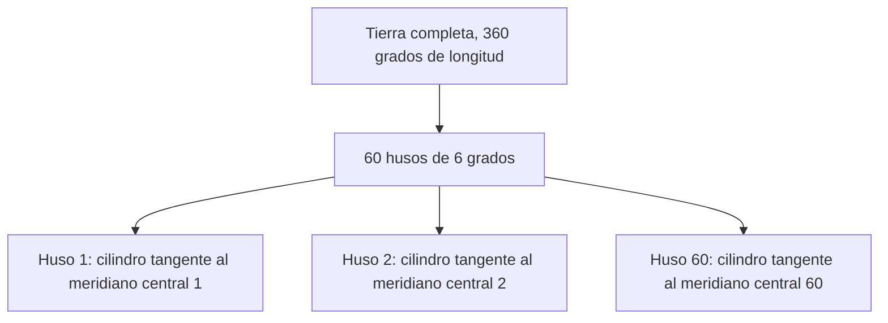

Antes de decidir dónde se coloca una estación base es necesario disponer de un mapa
fiable del terreno, conocer cómo se comporta la antena que va a instalarse y saber
calcular, a partir de un balance de potencias, hasta qué distancia puede llegar la
señal. Este capítulo reúne esas tres herramientas y las combina en un procedimiento de
dimensionado que estima el número de emplazamientos necesarios para cubrir un área
geográfica antes de que exista ningún emplazamiento real sobre el que trabajar.

## Introducción

El dimensionado de una red celular es la primera actividad técnica del ciclo de vida de
la red: antes de seleccionar una parcela concreta, negociar un contrato de alquiler o
tramitar un permiso de obra, es necesario saber cuántos emplazamientos hacen falta y qué
características debe tener cada uno. Esa estimación se apoya en tres bloques de
conocimiento distintos. El primero es cartográfico y geodésico: sin un mapa fiable y sin
un sistema de coordenadas bien identificado, cualquier cálculo posterior de distancias o
de alturas queda comprometido. El segundo es el propio equipo radiante, la antena de
estación base, cuyo patrón de radiación, inclinación y configuración de diversidad
determinan cuánta energía llega realmente a un punto del terreno. El tercero es el
balance del enlace, la contabilidad ordenada de todas las potencias, pérdidas y
ganancias que intervienen entre el transmisor y el receptor, que permite traducir un
requisito de cobertura en una distancia máxima de celda y, de ahí, en un número de
emplazamientos.

## Ciclo de vida de una red celular

El dimensionado que ocupa el resto del capítulo es solo la primera etapa de un proceso
más amplio que acompaña a una red celular durante toda su vida operativa. Ese proceso se
organiza en tres fases sucesivas que se repiten de forma continua, porque una red nunca
deja de evolucionar una vez desplegada.

### Planificación

Durante la **planificación** se establece la visión tecnológica del sistema, se
desarrolla el caso de negocio que justifica la inversión y se define una arquitectura
conceptual de alto nivel. A partir de ahí se diseñan los sistemas que deben cumplir los
requisitos técnicos y comerciales fijados, se identifican y adquieren los
emplazamientos, se gestionan los permisos administrativos necesarios y se ejecuta el
proceso de ingeniería y construcción de cada sitio. Todo el contenido de este capítulo y
del siguiente pertenece a esta fase.

### Despliegue

En la fase de **despliegue** la solución diseñada se integra en la red ya existente sin
interrupciones del servicio y sin introducir puntos vulnerables en la infraestructura en
producción. Una vez completada la integración, se procede al lanzamiento comercial de la
capacidad o de la cobertura añadida.

### Operación

La fase de **operación** mantiene la salud de la red mediante monitorización continua y
persigue la excelencia operativa ajustando la arquitectura, el rendimiento y la
configuración de la red para adaptarse a unos objetivos comerciales que cambian con el
tiempo. Las medidas recogidas durante la operación realimentan a la fase de
planificación, de modo que el ciclo completo no es lineal sino iterativo: cada fase
contribuye al refinamiento continuo de las que la preceden.

## Cartografía

Todo el proceso de planificación que sigue a este apartado parte de un mapa del área que
se quiere cubrir. Un **mapa** es una representación gráfica idealizada de la superficie
terrestre, y la calidad de las decisiones de planificación posteriores está limitada,
desde el principio, por la calidad de ese mapa.

### Tipos de mapa y capas de información

Existen dos tipos básicos de mapa según la magnitud que representan. El mapa
**planimétrico** es una representación bidimensional que recoge la posición horizontal
de los elementos del terreno, sin información de altura. El mapa **hipsométrico** añade
a esa representación la información de elevación, habitualmente mediante curvas de nivel
o mediante una codificación de color asociada a la cota.

Sobre esa base, un mapa de planificación celular puede incorporar varias capas de
información superpuestas:

| Capa        | Contenido                                                                                                                             |
| ----------- | ------------------------------------------------------------------------------------------------------------------------------------- |
| Ortofoto    | Imagen aérea corregida de las distorsiones de perspectiva, que permite medir distancias directamente sobre ella.                      |
| Topografía  | Información de altura del terreno, mediante curvas de nivel o modelo digital de elevación.                                            |
| Morfografía | Clasificación del uso del suelo (urbano, suburbano, rural, agua, vegetación).                                                         |
| Vectorial   | Elementos discretos del terreno, como edificios, carreteras o límites administrativos, representados como puntos, líneas o polígonos. |

La **ortofoto** se obtiene mediante fotogrametría, que consiste en tomar una fotografía
aérea y corregirla para eliminar la distorsión de perspectiva propia de la toma desde un
ángulo no cenital, lo que permite medir distancias sobre la imagen resultante con
garantías. Para resoluciones inferiores al metro, la fotogrametría clásica no basta y se
recurre a sensores LIDAR, que generan una nube de puntos tridimensional mediante
telemetría láser y permiten reconstruir con precisión la altura de edificios y de la
vegetación.

### Resolución, precisión y actualidad

La calidad de un mapa de planificación se caracteriza mediante varias propiedades
independientes entre sí, y conviene no confundirlas porque cada una limita un aspecto
distinto del cálculo posterior.

- **Resolución**: tamaño del elemento mínimo representable, por ejemplo una celda de
  rejilla de 50 m o de 200 m de lado. Una resolución más fina permite representar
  objetos más pequeños, como edificios aislados, a costa de un volumen de datos mayor.
- **Precisión**: grado de acierto de la posición representada respecto a la posición
  real, independiente de la resolución nominal del mapa.
- **Actualidad**: antigüedad de la captura de los datos que forman el mapa. Un mapa
  desactualizado puede representar edificios que ya no existen o no representar
  construcciones nuevas.
- **Completitud**: grado en que el mapa cubre la totalidad del área de interés sin
  huecos de información, una propiedad que depende directamente de la resolución
  elegida.
- **Consistencia lógica**: coherencia interna entre las distintas capas de un mismo
  mapa, de forma que un edificio de la capa vectorial no aparezca desplazado respecto a
  la misma estructura visible en la ortofoto.

En la práctica, un mapa de planificación se adquiere y se procesa una sola vez al
comienzo del ciclo de planificación, y no vuelve a actualizarse durante la vida
operativa de la red salvo que se emprenda un nuevo ejercicio de planificación sobre la
misma área.

## Sistemas geodésicos de referencia

Situar una estación base sobre un mapa exige expresar su posición mediante un sistema de
coordenadas, y ese sistema de coordenadas depende, a su vez, del modelo matemático que
se haya elegido para representar la forma de la Tierra.

### Coordenadas geográficas y cartesianas

Existen dos familias de sistemas de coordenadas geodésicas. Las **coordenadas
geográficas** son esféricas: la latitud se mide en paralelos y la longitud en
meridianos, y describen la posición de un punto directamente sobre la superficie curva
de la Tierra. Las **coordenadas cartesianas** son planas: se obtienen proyectando la
superficie curva sobre un plano bidimensional. Calcular distancias y ángulos sobre
coordenadas geográficas exige trigonometría esférica, mientras que sobre coordenadas
cartesianas basta con geometría plana, mucho más sencilla de manejar en una herramienta
de planificación. Por ese motivo, la práctica habitual convierte las coordenadas
geográficas de partida a un sistema cartesiano antes de realizar ningún cálculo de
distancia.

### Proyección universal transversa de Mercator

Convertir la superficie curva de la Tierra en un plano exige una **proyección
cartográfica**, y toda proyección distorsiona al menos tres, y con frecuencia las
cuatro, de las siguientes propiedades del terreno original: la forma, el área, la
distancia y la dirección. La proyección habitual en planificación celular es la
**proyección universal transversa de Mercator** (UTM), una proyección cilíndrica que
preserva la forma local de los objetos.

La proyección de Mercator estándar envuelve la Tierra con un cilindro tangente al
ecuador. La variante transversa gira ese cilindro 90°, de modo que su eje queda
contenido en el plano ecuatorial en lugar de coincidir con el eje de rotación terrestre.
El sistema UTM repite esa proyección transversa 60 veces, una por cada **huso** de 6° de
longitud en que se divide la circunferencia completa de 360°, y en cada repetición el
cilindro rota ligeramente para que su línea de tangencia coincida con el meridiano
central de ese huso.

Dentro de cada huso, la posición de un punto se expresa mediante dos coordenadas
cartesianas: el **Este** (_easting_), la distancia horizontal medida desde el meridiano
central del huso, y el **Norte** (_northing_), la distancia vertical medida desde el
ecuador o desde el paralelo de referencia del hemisferio sur. Ambas coordenadas se
expresan en metros, lo que hace directo el cálculo de una distancia entre dos puntos
situados dentro del mismo huso mediante el teorema de Pitágoras, sin necesidad de
trigonometría esférica.

### Geoide, esferoide y datum

El modelo matemático de la forma de la Tierra que subyace a cualquier proyección se
construye a partir de tres conceptos relacionados pero distintos.

El **geoide** es la superficie equipotencial del campo gravitatorio terrestre, es decir,
la forma que tomaría la superficie del océano bajo la influencia exclusiva de la
gravedad y de la rotación de la Tierra, sin viento ni marea, y extendida de forma
hipotética a través de los continentes. El geoide es la representación físicamente más
exacta de la forma de la Tierra, pero su superficie irregular la hace poco práctica para
el cálculo directo de coordenadas.

El **esferoide** es un elipsoide de revolución, la superficie que se obtiene al girar
una elipse alrededor de uno de sus ejes principales, y se emplea como aproximación
matemática manejable del geoide. Si el eje de giro es el eje menor de la elipse, el
esferoide resultante se llama **oblato**, y es la forma que aproxima razonablemente a la
Tierra real, ligeramente achatada en los polos. Si el eje de giro es el eje mayor, el
esferoide se llama **prolato**.

El **datum geodésico** fija, sobre un esferoide de referencia concreto, un origen y una
orientación para el sistema de coordenadas. Existen dos tipos de datum: el **datum
horizontal**, que fija las coordenadas de latitud y longitud habituales, y el **datum
vertical**, que fija la referencia de altura, típicamente el nivel medio del mar. Según
su alcance, un datum puede ser **global**, geocéntrico y válido para todo el planeta
(como WGS84), o **local**, ajustado a la geometría de un país o región concretos y no
necesariamente centrado en el centro de masas de la Tierra.

???+ example "Efecto de un datum geodésico incorrecto sobre un emplazamiento"

    Una herramienta de planificación importa las coordenadas de un emplazamiento
    existente asumiendo el datum WGS84, mientras que el fichero de origen se generó en
    realidad con un datum local de referencia distinta, una situación habitual cuando se
    combinan bases de datos de operadores o de administraciones distintas. La diferencia
    entre ambos datums se traduce en un desplazamiento sistemático de las coordenadas
    resultantes, típicamente de varios metros a varias decenas de metros según la pareja
    de datums implicada, aunque en ejes concretos el desplazamiento puede llegar a ser de
    solo unos pocos metros y en otros superar los cien metros.

    Ese desplazamiento no es aleatorio ni se puede promediar: afecta por igual a todos
    los puntos importados con el mismo datum incorrecto, de modo que la posición relativa
    entre dos emplazamientos de la misma base de datos se mantiene aproximadamente
    correcta, mientras que la posición absoluta de cualquiera de ellos respecto al
    terreno real queda desplazada. Un error de esta magnitud es suficiente para calcular
    de forma incorrecta la altura de la estación base sobre el terreno real, para asignar
    mal la morfología del entorno inmediato al emplazamiento y, en el caso más grave,
    para emplazar un cálculo de línea de visión sobre un obstáculo que en realidad no
    está en esa posición.

### Identificación del sistema de referencia

Dado que existen múltiples combinaciones de esferoide, datum y proyección en uso
simultáneo según el país y la fuente de datos, cualquier fichero de coordenadas debe
llevar asociado un identificador inequívoco de su sistema de referencia, normalmente un
**código EPSG**. Comprobar ese código antes de combinar dos fuentes de datos
geográficos, o antes de introducir manualmente unas coordenadas en una herramienta de
planificación, es la comprobación más barata y más frecuentemente omitida de todo el
proceso cartográfico, y evita precisamente el tipo de error de posicionamiento descrito
en el ejemplo anterior.

## Antenas de estación base

Una vez resuelta la localización sobre el mapa, el segundo bloque de herramientas de
planificación es el propio equipo radiante. El tamaño de celda que cada tipo de estación
base es capaz de sostener, desde la macrocelda hasta la femtocelda, se trata en
[concepto celular y reutilización de frecuencias](../01_fundamentos_celulares/section_1_concepto_celular.md);
este apartado se ocupa, en cambio, de cómo esa antena distribuye la energía radiada en
el espacio y de las técnicas que permiten controlar esa distribución.

### Antenas omnidireccionales y sectoriales

Una antena **omnidireccional** radia con la misma intensidad en todas las direcciones
del plano horizontal, un patrón adecuado para un entorno rural abierto en el que no
existe una dirección de demanda de tráfico predominante. Una antena **sectorial**
concentra, en cambio, la energía radiada en un arco angular limitado, lo que reduce la
interferencia generada hacia el resto de direcciones y permite, tal como se desarrolla
en
[concepto celular y reutilización de frecuencias](../01_fundamentos_celulares/section_1_concepto_celular.md#sectorizacion),
acercar más las celdas cocanal para un mismo objetivo de calidad. El esquema más
habitual de sectorización reparte los 360° de un emplazamiento en tres sectores de 120°,
cada uno con su propia antena y su propio acimut de apuntamiento.

### Inclinación mecánica y eléctrica

La **inclinación** de una antena de estación base (_tilt_) dirige la energía radiada
hacia el área concreta del sector que se quiere cubrir, en lugar de dejar que una parte
de esa energía se pierda por encima del horizonte o llegue con exceso de potencia a
zonas próximas al emplazamiento, donde generaría interferencia hacia celdas vecinas.
Existen dos mecanismos para introducir esa inclinación.

La **inclinación mecánica** modifica físicamente el ángulo de montaje de la antena
mediante un soporte ajustable, típicamente un tornillo. Es un mecanismo sencillo y de
bajo coste de fabricación, pero lento y costoso de operar, porque cualquier ajuste exige
el desplazamiento de personal técnico hasta el emplazamiento. Además, al inclinar
mecánicamente toda la antena, distorsiona la forma del diagrama de radiación en el plano
horizontal: los lóbulos laterales dejan de apuntar exactamente donde lo hacían con la
antena en posición vertical.

La **inclinación eléctrica** modifica, en cambio, la fase relativa de la señal que
alimenta cada uno de los elementos radiantes que forman el array vertical de la antena,
sin mover ningún componente mecánico. Es un mecanismo más costoso de fabricación, pero
permite el ajuste remoto, sin desplazamiento de personal, y preserva la forma del
diagrama de radiación horizontal, porque la inclinación se introduce electrónicamente
sobre el array y no sobre el conjunto físico de la antena.

La técnica de inclinación resulta, en la práctica, más eficaz que la regulación de la
potencia transmitida para optimizar de forma conjunta la cobertura y la capacidad de una
red. Reducir la potencia transmitida atenúa la señal por igual en todas las direcciones,
lo que reduce la interferencia hacia las celdas vecinas pero también reduce la cobertura
en la propia dirección de servicio. Inclinar la antena, por el contrario, redirige la
energía sin reducir la potencia total radiada, concentrando la cobertura en el área de
interés y reduciendo la energía que se escapa hacia zonas donde solo generaría
interferencia, lo que mejora simultáneamente la relación señal a interferencia en el
borde de celda y el rendimiento del traspaso al definir áreas de dominancia más nítidas
entre celdas vecinas.

La geometría que determina el ángulo de inclinación relaciona la altura de la antena
sobre el terreno, la distancia al punto que se quiere cubrir y la anchura del haz
vertical de la antena.

El ángulo que apunta el eje del haz directamente hacia un punto del terreno situado a
una distancia $R$ de la base de la antena, a una altura $h$ sobre la altura del
terminal, es

$$
\theta_{\text{apuntamiento}} = \arctan\left(\frac{h}{R}\right)
$$

donde $h$ es la diferencia de altura entre la antena de la estación base y la antena del
terminal, y $R$ es la distancia horizontal al punto objetivo. Sin embargo, apuntar el
eje del haz directamente al borde de celda deja la mitad del haz vertical, la que queda
por debajo de la línea de apuntamiento, radiando hacia distancias más cortas que el
borde, y solo la mitad superior del haz alcanza distancias iguales o mayores. Para que
sea el punto de media potencia del haz, y no su eje, el que llegue exactamente al borde
de celda, la inclinación total debe añadir la mitad del ancho de haz vertical a mitad de
potencia:

$$
\theta_{\text{tilt}} = \arctan\left(\frac{h}{R}\right) + \frac{\text{HPBW}_v}{2}
$$

donde $\text{HPBW}_v$ es el ancho de haz vertical a mitad de potencia de la antena, un
parámetro de fabricante típicamente comprendido entre 4° y 10° para una antena sectorial
de estación base.

???+ example "Cálculo del ángulo de inclinación para un borde de celda objetivo"

    Una antena sectorial se instala a $h = 28{,}5\ \text{m}$ por encima de la altura del
    terminal (una estación base de 30 m de altura y un terminal a 1,5 m del suelo) y
    debe dirigir su punto de media potencia hacia un borde de celda situado a
    $R = 3{,}24\ \text{km}$, la distancia obtenida en el ejemplo de radio máximo de celda
    desarrollado más adelante en este capítulo. El fabricante especifica un ancho de haz
    vertical a mitad de potencia $\text{HPBW}_v = 6{,}5°$, un valor típico de antena
    sectorial de banda ancha.

    El ángulo de apuntamiento directo al borde de celda es

    $$
    \theta_{\text{apuntamiento}} = \arctan\left(\frac{28{,}5}{3240}\right) \approx 0{,}50°
    $$

    un valor pequeño porque la distancia horizontal es casi tres órdenes de magnitud
    mayor que la diferencia de altura. Añadiendo la mitad del ancho de haz vertical se
    obtiene la inclinación total requerida:

    $$
    \theta_{\text{tilt}} = 0{,}50° + \frac{6{,}5°}{2} = 0{,}50° + 3{,}25° = 3{,}75°
    $$

    Una inclinación de aproximadamente $3{,}75°$ hacia abajo respecto a la horizontal
    asegura que el punto de media potencia del haz vertical, y no el eje del haz, sea el
    que llegue al borde de celda calculado, de modo que el interior de la celda recibe
    una potencia superior a la del borde en todo su recorrido, en lugar de quedar por
    debajo de la mitad de potencia disponible antes de llegar a él.

### Diversidad espacial y por polarización

La **diversidad de antenas** combina las señales recibidas por varias antenas
independientes para mejorar la calidad de la señal recibida, particularmente en el
enlace ascendente, donde el terminal dispone de menos potencia de transmisión que la
estación base. Existen dos principios físicos de diversidad y, para cada uno, una
variante con y sin duplexor.

La **diversidad espacial** separa físicamente dos antenas receptoras una distancia
suficiente para que el desvanecimiento que sufre cada una sea aproximadamente
independiente del que sufre la otra, de modo que resulta improbable que ambas se
desvanezcan de forma simultánea. La variante **sin duplexor** dedica cada antena en
exclusiva a la recepción, lo que exige una antena adicional solo para transmitir y
requiere una separación física considerable entre las antenas de recepción para lograr
la independencia del desvanecimiento. La variante **con duplexor** conecta un transmisor
y un receptor a la misma antena física, discriminando ambas señales mediante el propio
duplexor.

La **diversidad por polarización** obtiene sus dos señales independientes no separando
antenas en el espacio, sino orientando dos elementos radiantes con polarizaciones
distintas, habitualmente ortogonales entre sí, dentro de la misma carcasa de antena. Al
igual que en la diversidad espacial, existe una variante sin duplexor, con un elemento
dedicado a transmisión y los dos elementos polarizados dedicados a recepción, y una
variante con duplexor, en la que una antena de dos puertos combina transmisión y
recepción sobre cada una de las dos polarizaciones.

La combinación controlada de varios elementos radiantes, ajustando de forma
independiente la amplitud y la fase de la señal en cada uno, es también la base de la
técnica de _beamforming_: dirigir el lóbulo principal de radiación hacia la posición
concreta de un terminal en lugar de mantener un patrón fijo, lo que mejora la calidad de
la señal recibida, aumenta el alcance efectivo y reduce la interferencia generada hacia
otros terminales que no se encuentran en la dirección del haz.

### Duplexores

Un **duplexor** es el componente que permite conectar simultáneamente un transmisor y un
receptor a una única antena física, discriminando entre la señal transmitida y la señal
recibida según su nivel de potencia o según su banda de frecuencia, en lugar de exigir
una antena independiente para cada función. El duplexor es, por tanto, el componente que
hace posibles las variantes con duplexor de diversidad espacial y de diversidad por
polarización descritas en el apartado anterior, y permite reducir el número físico de
antenas instaladas en un emplazamiento sin renunciar a las funciones de transmisión, de
recepción y de diversidad.

## Fases de la planificación

Con el mapa, el sistema de coordenadas y las antenas ya caracterizados, el proceso de
planificación propiamente dicho se organiza en tres fases sucesivas.

La **preplanificación** dimensiona la red: estima cuántos emplazamientos, y de qué tipo,
son necesarios para satisfacer los criterios de cobertura, calidad y capacidad exigidos,
sin llegar todavía a decidir la ubicación concreta de ninguno de ellos. La
**planificación nominal** parte de esa estimación para seleccionar la ubicación real de
cada emplazamiento y producir el plan de cobertura y el plan de capacidad de la red. La
**planificación detallada** ajusta, sobre los emplazamientos ya seleccionados, el plan
de celdas vecinas, el plan de frecuencias, el plan de identificadores y el resto de
parámetros de configuración de la red. Este capítulo desarrolla en detalle la
preplanificación; la planificación nominal y la planificación detallada, que parten de
sus resultados, se tratan en el capítulo siguiente de este mismo tema.

## Preplanificación

La preplanificación traduce un conjunto de criterios de diseño y una descripción del
área de despliegue en una estimación del número de emplazamientos necesarios, sin
necesidad de conocer todavía la ubicación real de ninguno de ellos.

### Criterios de cobertura, calidad y capacidad

El diseño de una red celular se rige por tres criterios que compiten entre sí por los
mismos recursos de potencia y de espectro, y que se revisan de forma continua a lo largo
de todo el ciclo de vida de la red.

- **Cobertura**: área geográfica que debe quedar servida, nivel de señal mínimo exigido
  en esa área y probabilidad de cobertura objetivo, es decir, la fracción del área que
  debe alcanzar ese nivel mínimo.
- **Calidad de señal**: tasa de caída de llamadas, tasa de traspasos fallidos y tasa de
  medidas de calidad de señal por debajo de un umbral mínimo.
- **Capacidad**: ancho de banda disponible, tasa de bloqueo de llamadas admisible y
  tiempo de encolado tolerable para las peticiones que sí se atienden, ambos
  dimensionados según los métodos desarrollados en
  [Erlang y dimensionado de recursos](../../06_trafico/01_colas/section_2_erlang_y_dimensionado.md).

Existe un compromiso directo entre los tres: exigir un nivel de señal mínimo más alto
reduce el área que una misma estación base puede cubrir con esa calidad, lo que exige
más emplazamientos para el mismo territorio; exigir una tasa de bloqueo más baja exige
más canales de tráfico por celda para el mismo tráfico ofrecido. El objetivo del área de
cobertura, además, no es cubrir la totalidad del territorio, sino cubrir a la población
que lo habita, de modo que zonas despobladas pueden quedar deliberadamente fuera del
área de diseño incluso en tecnologías maduras.

Algunas consideraciones prácticas condicionan estos criterios según el entorno y la
tecnología. Las zonas rurales, con menor densidad de usuarios y menor exigencia
comercial de continuidad de cobertura, admiten umbrales de señal más laxos que las zonas
urbanas. Un entorno de interior exige una probabilidad de cobertura menor que un entorno
de exterior para el mismo nivel de señal, porque penetrar en el interior de un edificio
ya introduce una pérdida adicional que el balance del enlace debe absorber. Tecnologías
más recientes, con llamadas de menor duración media, presentan tasas de caída y de
traspasos fallidos menores que tecnologías anteriores para una misma calidad de red
subyacente, simplemente porque cada llamada individual está expuesta durante menos
tiempo al riesgo de caer.

### Morfología del área y configuración de despliegue

El proceso de dimensionado no trata el área de cobertura como un bloque homogéneo, sino
que la divide primero en zonas de morfología similar, porque cada morfología admite un
criterio de diseño y una configuración de despliegue distintos. Este primer paso, la
identificación de la morfología, es imprescindible porque el radio máximo de celda que
se calcula más adelante en el capítulo depende del entorno de propagación asociado a
cada morfología, y aplicar un único radio a un área heterogénea sobreestimaría la
cobertura en las zonas más densas y la subestimaría en las más abiertas.

Para cada zona de morfología homogénea se selecciona una configuración de despliegue de
red que fija el orden de magnitud del radio de celda esperado antes incluso de calcular
el balance del enlace: una configuración **macro**, con radios de celda de hasta varias
decenas de kilómetros, para áreas rurales o suburbanas abiertas; una configuración
**micro**, con radios del orden del kilómetro, para áreas urbanas de densidad media; y
una configuración **pico**, con radios del orden de varios cientos de metros, para
puntos de muy alta concentración de tráfico o para interiores. La correspondencia
completa entre estas configuraciones y los tamaños de celda de una red real, incluida la
femtocelda, se trata en
[concepto celular y reutilización de frecuencias](../01_fundamentos_celulares/section_1_concepto_celular.md#tipos-de-celda).

### Entorno de propagación y movilidad

Junto con la morfología del área, el dimensionado exige fijar un entorno de propagación
y de movilidad normalizado, de los catalogados en
[desvanecimiento y respuesta del canal](../../01_fundamentos/02_canal/section_2_desvanecimiento_y_respuesta_del_canal.md#entornos-de-propagacion-normalizados):
`RAx`, `TUx` o `HTx` para GSM, y `EPAx`, `EVAx`, `ETUx` o `HSTx` para UMTS y LTE, donde
el sufijo `x` fija la velocidad del terminal en kilómetros por hora que debe asumirse
durante el dimensionado. Esta elección no es un simple etiquetado descriptivo: fija la
dispersión temporal y la dispersión Doppler que condicionan, respectivamente, el ancho
de banda de coherencia y el tiempo de coherencia del canal, y ambos determinan a su vez
qué margen adicional debe reservarse en el balance del enlace frente al desvanecimiento
rápido, un margen distinto del margen de desvanecimiento lento que se desarrolla en el
apartado siguiente. Fijar el entorno de propagación y movilidad es, junto con la
morfología del área, la última decisión de entrada antes de ejecutar el balance del
enlace propiamente dicho.

## Balance del enlace

El **balance del enlace** es la contabilidad ordenada de todas las potencias, ganancias
y pérdidas que intervienen entre el transmisor y el receptor de un enlace radio. Omitir
un término de esa contabilidad, o contarlo dos veces por error, invalida el resultado
completo, de modo que cada término del balance debe verificarse de forma explícita antes
de aceptar el resultado final.

### Potencias, pérdidas y ganancias

El balance del enlace ascendente, desde el terminal hasta la estación base, encadena los
siguientes términos:

???+ example "Balance del enlace ascendente para voz en una macrocelda urbana"

    Un terminal transmite con una potencia $P_{tx} = 21\ \text{dBm}$ (125 mW) y sufre
    una pérdida corporal $L_{bl} = 2\ \text{dB}$ por la proximidad de la cabeza y la mano
    del usuario durante una llamada de voz, de modo que su potencia radiada isotrópica
    equivalente es

    $$
    \text{EIRP}_{ms} = P_{tx} - L_{bl} = 21 - 2 = 19\ \text{dBm}
    $$

    La estación base recibe esa señal con una antena sectorial de ganancia
    $G_{bs} = 18\ \text{dBi}$, un valor típico de fabricante para una antena de banda
    ancha, tras atravesar un cable de conexión con una pérdida $L_c = 2\ \text{dB}$. El
    receptor incorpora diversidad espacial de dos ramas, con una ganancia típica
    $G_d = 5\ \text{dB}$, y la red aplica macrodiversidad por traspaso suave con una
    ganancia $G_{sh} = 2\ \text{dB}$. La sensibilidad del receptor, calculada en el
    apartado siguiente, es $S_{\min} = -123{,}06\ \text{dBm}$ referida a la entrada del
    receptor, o $-121{,}06\ \text{dBm}$ referida al conector de antena una vez repuesta la
    pérdida de cable que la señal atraviesa antes de llegar al receptor. El entorno es
    urbano con una desviación típica de desvanecimiento lento $\sigma_{sf} =
    8{,}5\ \text{dB}$, y el objetivo de probabilidad de cobertura del $90\,\%$ corresponde
    a un cuantil normal $z_{0{,}90} \approx 1{,}28$, de modo que el margen de
    desvanecimiento lento es

    $$
    M_{sf} = z_{0{,}90} \cdot \sigma_{sf} = 1{,}28 \times 8{,}5 \approx 10{,}88\ \text{dB}
    $$

    Encadenando todos los términos, sin omitir ni repetir ninguno, las pérdidas máximas
    admisibles del enlace son

    $$
    \text{MAPL} = \text{EIRP}_{ms} + G_{bs} + G_d + G_{sh} -
    S_{\min,\text{antena}} - M_{sf}
    $$

    $$
    \text{MAPL} = 19 + 18 + 5 + 2 - (-121{,}06) - 10{,}88 = 154{,}18\ \text{dB}
    $$

    El resultado, unas $154{,}2\ \text{dB}$, es el presupuesto de pérdidas de propagación
    que el enlace puede permitirse antes de que la señal caiga por debajo de la
    sensibilidad del receptor, y es el valor que se utiliza en el apartado de radio
    máximo de celda para obtener una distancia a partir de un modelo de propagación.

La siguiente tabla resume los términos del balance anterior, distinguiendo cuáles
proceden de un dato de partida del enlace y cuáles se han tomado como valor típico de
equipo:

| Término                              | Símbolo       | Valor              | Origen                 |
| ------------------------------------ | ------------- | ------------------ | ---------------------- |
| Potencia de transmisión del terminal | $P_{tx}$      | $21\ \text{dBm}$   | Dato de partida        |
| Pérdida corporal                     | $L_{bl}$      | $2\ \text{dB}$     | Dato de partida        |
| Ganancia de antena en la BS          | $G_{bs}$      | $18\ \text{dBi}$   | Valor típico de equipo |
| Pérdida de cable en la BS            | $L_c$         | $2\ \text{dB}$     | Dato de partida        |
| Ganancia de diversidad               | $G_d$         | $5\ \text{dB}$     | Valor típico de equipo |
| Ganancia de macrodiversidad          | $G_{sh}$      | $2\ \text{dB}$     | Dato de partida        |
| Desviación de desvanecimiento lento  | $\sigma_{sf}$ | $8{,}5\ \text{dB}$ | Dato de partida        |
| Cuantil de probabilidad de cobertura | $z_{0{,}90}$  | $1{,}28$           | Dato de partida        |

### Sensibilidad del receptor y ruido térmico

La **sensibilidad** de un receptor es la potencia mínima de señal, en su entrada, que
permite alcanzar la calidad de demodulación exigida por el servicio, y se calcula a
partir del ruido térmico del propio receptor y de la relación señal a ruido que ese
servicio necesita.

El **ruido térmico** que genera cualquier resistencia o componente disipativo a una
temperatura $T$ tiene una densidad espectral de potencia dada por

$$
N_0\ \lbrack \text{dBm/Hz}\rbrack = 10\log_{10}(kT) + 30
$$

donde $k = 1{,}38 \times 10^{-23}\ \text{J/K}$ es la constante de Boltzmann, $T$ es la
temperatura de ruido de referencia en kelvin y la constante $30$ convierte la potencia
de vatios a milivatios antes del logaritmo. Integrando esa densidad sobre el ancho de
banda del sistema $W$, la potencia total de ruido térmico es

$$
N\ \lbrack \text{dBm}\rbrack = N_0 + 10\log_{10}(W)
$$

y añadiendo la **cifra de ruido** del propio receptor, $NF$, que recoge el ruido
adicional introducido por sus componentes reales frente al límite térmico ideal, el
suelo de ruido efectivo a la entrada del receptor es $N + NF$.

Sobre ese suelo de ruido, el servicio exige una relación señal a ruido mínima. Para un
sistema de espectro ensanchado como UMTS, esa relación se expresa habitualmente como
$E_b/N_0$, la energía por bit de información entregada frente a la densidad de ruido, y
se relaciona con la relación señal a ruido en el ancho de banda del sistema mediante la
**ganancia de procesado**

$$
PG\ \lbrack \text{dB}\rbrack = 10\log_{10}\left(\frac{W}{R_b}\right)
$$

donde $R_b$ es la velocidad binaria del servicio. La relación señal a ruido necesaria en
el ancho de banda completo del sistema es, entonces, $E_b/N_0 - PG$, casi siempre
negativa en un sistema de espectro ensanchado porque la ganancia de procesado supera con
holgura al requisito de $E_b/N_0$, y la sensibilidad del receptor resulta

$$
S_{\min}\ \lbrack \text{dBm}\rbrack = N + NF + \left(\frac{E_b}{N_0} - PG\right)
$$

???+ example "Cálculo de la sensibilidad del receptor de estación base"

    La estación base del ejemplo anterior emplea una temperatura de ruido de referencia
    $T = 293\ \text{K}$ y un ancho de banda de sistema $W = 3{,}84\ \text{MHz}$, el ancho
    de banda de canal de UMTS. La densidad de ruido térmico es

    $$
    N_0 = 10\log_{10}(1{,}38\times 10^{-23}\times 293) + 30 \approx -173{,}93\ \text{dBm/Hz}
    $$

    y la potencia de ruido en el ancho de banda completo del sistema es

    $$
    N = -173{,}93 + 10\log_{10}(3{,}84\times 10^{6}) = -173{,}93 + 65{,}85 = -108{,}08\ \text{dBm}
    $$

    Con una cifra de ruido de receptor $NF = 5\ \text{dB}$, el suelo de ruido efectivo es
    $N + NF = -103{,}08\ \text{dBm}$. El servicio es voz `AMR` de $R_b = 12{,}2\ \text{kbps}$
    con un requisito $E_b/N_0 = 5\ \text{dB}$, un valor típico para este servicio. La
    ganancia de procesado es

    $$
    PG = 10\log_{10}\left(\frac{3{,}84\times 10^{6}}{12{,}2\times 10^{3}}\right) \approx
    24{,}98\ \text{dB}
    $$

    de modo que la relación señal a ruido necesaria en el ancho de banda completo es
    $5 - 24{,}98 \approx -19{,}98\ \text{dB}$, y la sensibilidad resultante es

    $$
    S_{\min} = -103{,}08 + (-19{,}98) = -123{,}06\ \text{dBm}
    $$

    Este es el valor referido a la entrada del receptor que se ha empleado en el
    balance del enlace del apartado anterior, antes de reponer la pérdida de cable para
    referirlo al conector de antena.

### Márgenes y reparto de potencia entre canales

El **margen de desvanecimiento lento** compensa la variabilidad estadística de las
pérdidas de propagación alrededor del valor medio que predice un modelo como
Okumura-Hata, descrita en detalle en
[propagación y pérdidas](../../01_fundamentos/02_canal/section_1_propagacion_y_perdidas.md).
Sin ese margen, la mitad de los puntos del borde de celda quedarían por debajo del
umbral de cobertura, porque el valor medio del modelo es, por construcción, superado la
mitad de las veces. El enfoque simplificado empleado en los ejemplos de este capítulo
calcula ese margen como el producto de la desviación típica de desvanecimiento lento por
el cuantil de la distribución normal correspondiente a la probabilidad de cobertura de
borde que se persigue,

$$
M_{sf} = z_{Y} \cdot \sigma_{sf}
$$

una aproximación que trata la probabilidad de cobertura como una probabilidad de borde
de celda y no como una probabilidad de área completa, y que resulta razonable en la
mayoría de los ejercicios de dimensionado inicial, aunque una planificación nominal
posterior sobre un mapa real recalcula la probabilidad de cobertura efectiva punto por
punto, tal como se trata en el capítulo siguiente.

Además del margen frente al desvanecimiento, la potencia disponible en la estación base
debe repartirse entre los distintos canales que coexisten en el enlace descendente. En
UMTS, la potencia total del nodo B se comparte entre los canales de control, el canal
piloto y los canales de datos de usuario, de modo que el balance de enlace de un usuario
concreto no dispone de la potencia total del equipo, sino de la fracción que le
corresponde según el reparto de potencia vigente en ese instante. En LTE, el reparto
equivalente se realiza entre los bloques de recursos físicos (`PRB`) que se asignan a
cada usuario, de modo que la potencia disponible por usuario depende del número de PRB
que la planificación de recursos le asigna en cada intervalo de tiempo.

### Particularidades por tecnología

El balance del enlace comparte la misma estructura general en todas las tecnologías
celulares, pero cada una introduce particularidades propias en algunos de sus términos.

GSM no emplea espectro ensanchado, de modo que no existe una ganancia de procesado
equivalente a la de UMTS: el balance de GSM opera directamente sobre la relación señal a
interferencia del canal físico asignado, y su sensibilidad depende principalmente del
ancho de banda del canal GSM y de la cifra de ruido del receptor, sin el término de
ganancia de procesado desarrollado en el apartado anterior.

En UMTS, la calidad de la señal antes de aplicar cualquier ganancia de procesado se mide
habitualmente como $E_c/N_0$, la relación entre la energía del código piloto recibido y
la densidad de ruido total, en lugar de $E_b/N_0$. La conversión entre ambas magnitudes
exige tener en cuenta el factor de ensanchado (_spreading factor_) del canal concreto
que se está evaluando, porque $E_c/N_0$ se refiere a un símbolo de código completo y
$E_b/N_0$ se refiere a un bit de información, y ambos coinciden únicamente cuando el
factor de ensanchado vale uno.

En LTE, un bloque de recursos físicos tiene un ancho de banda fijo de $180\ \text{kHz}$,
independiente de la configuración de ancho de banda total del sistema, de modo que la
ganancia de procesado efectiva de un usuario depende del número de PRB que se le asignan
y no de un factor de ensanchado fijo como en UMTS.

## Estimación del número de emplazamientos

Con el balance del enlace resuelto, el último paso de la preplanificación traduce el
presupuesto de pérdidas obtenido en una distancia máxima de celda y, a partir de esa
distancia, en un número de emplazamientos, evaluado tanto por el criterio de cobertura
como por el criterio de capacidad.

### Radio máximo de celda

El presupuesto de pérdidas máximas admisibles calculado en el balance del enlace se
convierte en una distancia máxima de celda invirtiendo el modelo de propagación elegido
según los criterios desarrollados en
[propagación y pérdidas](../../01_fundamentos/02_canal/section_1_propagacion_y_perdidas.md#eleccion-de-modelo-segun-entorno-y-resolucion).
Este apartado no repite la derivación de ese modelo, ya presentada en detalle en el
capítulo enlazado, sino que lo aplica al presupuesto de pérdidas obtenido en este
capítulo, que es precisamente el paso que ese capítulo deja pendiente para la
planificación celular.

???+ example "Radio máximo de celda a partir del balance del enlace"

    Se reutiliza la expresión numérica de Okumura-Hata obtenida en
    [propagación y pérdidas](../../01_fundamentos/02_canal/section_1_propagacion_y_perdidas.md)
    para una estación base urbana a $1800\ \text{MHz}$, con antena de estación base a
    $30\ \text{m}$ de altura y terminal a $1{,}5\ \text{m}$, en una ciudad de tamaño
    pequeño o mediano:

    $$
    L_b\ \lbrack \text{dB}\rbrack \approx 136{,}19 + 35{,}23 \log_{10}\lbrack d_{\text{km}}
    \rbrack
    $$

    Igualando $L_b$ a las pérdidas máximas admisibles obtenidas en el balance del
    enlace, $\text{MAPL} = 154{,}18\ \text{dB}$, y despejando la distancia:

    $$
    \log_{10}(d_{\text{km}}) = \frac{154{,}18 - 136{,}19}{35{,}23} \approx 0{,}5108
    $$

    $$
    d_{\text{km}} = 10^{0{,}5108} \approx 3{,}24\ \text{km}
    $$

    El radio máximo de celda compatible con el balance del enlace calculado en este
    capítulo es, por tanto, de aproximadamente $3{,}24\ \text{km}$. Este valor es el que
    se emplea en los dos apartados siguientes para estimar el número de emplazamientos
    necesarios, tanto por criterio de cobertura como por criterio de capacidad.

### Área de emplazamiento según sectorización

El radio máximo de celda no se traduce directamente en un área de cobertura circular,
porque el modelo geométrico habitual de planificación, introducido en
[concepto celular y reutilización de frecuencias](../01_fundamentos_celulares/section_1_concepto_celular.md#geometria-de-celdas),
aproxima cada celda como un hexágono regular. El área servida por un **emplazamiento**
completo, sin embargo, depende también de cuántos sectores comparten esa ubicación
física, porque el conjunto de sectores de un mismo emplazamiento reparte entre ellos la
cobertura de un área mayor que la de un solo sector aislado.

La práctica de planificación resume esa relación mediante una constante $K$ que depende
del número de sectores del emplazamiento, de forma que el área servida por un
emplazamiento es

$$
A_{\text{emp}} = K \cdot R^{2}
$$

| Sectorización              | Constante $K$ (valor típico) |
| -------------------------- | ---------------------------- |
| Omnidireccional (1 sector) | $2{,}6$                      |
| Trisectorial (3 sectores)  | $1{,}95$                     |
| Hexasectorial (6 sectores) | $1{,}3$                      |

donde $R$ es el radio máximo de celda obtenido en el apartado anterior. Un emplazamiento
trisectorial cubre, para el mismo radio de celda, un área menor por emplazamiento que un
emplazamiento omnidireccional, porque su patrón de radiación sectorizado deja zonas de
solapamiento entre sectores adyacentes que un patrón omnidireccional no necesita.

### Número de emplazamientos por cobertura

El número mínimo de emplazamientos que exige el criterio de cobertura se obtiene
dividiendo el área geográfica total que debe cubrirse entre el área servida por un solo
emplazamiento:

$$
N_{\text{cobertura}} = \left\lceil \frac{A_{\text{objetivo}}}{A_{\text{emp}}}
\right\rceil
$$

donde $A_{\text{objetivo}}$ es el área total a cubrir y el redondeo hacia el entero
superior refleja que un emplazamiento no puede desplegarse de forma parcial.

???+ example "Número de emplazamientos por criterio de cobertura"

    Un operador debe cubrir un área urbana de $A_{\text{objetivo}} = 25\ \text{km}^2$
    con emplazamientos trisectoriales, empleando el radio máximo de celda de
    $R = 3{,}24\ \text{km}$ calculado en el apartado anterior. El área servida por cada
    emplazamiento trisectorial, con $K = 1{,}95$, es

    $$
    A_{\text{emp}} = 1{,}95 \times 3{,}24^{2} \approx 20{,}5\ \text{km}^2
    $$

    y el número de emplazamientos que exige el criterio de cobertura es

    $$
    N_{\text{cobertura}} = \left\lceil \frac{25}{20{,}5} \right\rceil =
    \lceil 1{,}22 \rceil = 2
    $$

    Con un radio de celda tan amplio frente al área objetivo, dos emplazamientos
    trisectoriales bastan para satisfacer el criterio de cobertura. El apartado
    siguiente comprueba si ese mismo número de emplazamientos también es suficiente
    para atender la demanda de tráfico esperada en esa área.

### Número de emplazamientos por capacidad

El criterio de capacidad exige un cálculo independiente del anterior, porque no depende
del radio de celda sino de la demanda de tráfico del área y de la capacidad de tráfico
que cada emplazamiento puede cursar con el grado de servicio exigido. El dimensionado de
esa capacidad por sector se apoya directamente en la fórmula de Erlang B desarrollada en
[Erlang y dimensionado de recursos](../../06_trafico/01_colas/section_2_erlang_y_dimensionado.md#formula-de-erlang-b),
sin necesidad de repetir aquí su derivación: basta con fijar el número de canales
equivalentes de un sector y el grado de servicio objetivo, y leer el tráfico máximo
admisible correspondiente.

$$
N_{\text{capacidad}} = \left\lceil \frac{A_{\text{ofrecido,total}}}{n_{\text{sect}}
\cdot A_{\max}(c, B)} \right\rceil
$$

donde $A_{\text{ofrecido,total}}$ es el tráfico ofrecido total del área durante la hora
cargada, $n_{\text{sect}}$ es el número de sectores por emplazamiento y $A_{\max}(c, B)$
es el tráfico máximo que admite un sector con $c$ canales equivalentes para un grado de
servicio objetivo $B$, obtenido de la fórmula de Erlang B.

???+ example "Comparación entre el dimensionado por cobertura y por capacidad"

    El mismo emplazamiento trisectorial del ejemplo anterior admite, según su
    especificación de equipo, un máximo de $c = 65$ usuarios simultáneos por sector, una
    cifra que se trata aquí como canales equivalentes de un sistema con pérdidas.
    Evaluando la fórmula recursiva de Erlang B para $c = 65$ canales con un grado de
    servicio objetivo del $2\,\%$ se obtiene un tráfico máximo admisible de
    aproximadamente $A_{\max} \approx 54{,}4$ erlangs por sector, de modo que cada
    emplazamiento trisectorial cursa hasta $3 \times 54{,}4 \approx 163{,}1$ erlangs.

    El área de $25\ \text{km}^2$ del ejemplo anterior corresponde a un distrito urbano
    de negocio con una densidad de tráfico ofrecido asumida de $60$ erlangs por
    kilómetro cuadrado en la hora cargada, un valor de entrada propio de este ejercicio
    y no del balance del enlace. El tráfico ofrecido total del área es, entonces,

    $$
    A_{\text{ofrecido,total}} = 60 \times 25 = 1500\ \text{erlangs}
    $$

    y el número de emplazamientos que exige el criterio de capacidad es

    $$
    N_{\text{capacidad}} = \left\lceil \frac{1500}{163{,}1} \right\rceil =
    \lceil 9{,}19 \rceil = 10
    $$

    Frente a los dos emplazamientos que bastaban por criterio de cobertura, la demanda
    de tráfico de este distrito exige diez, cinco veces más. En este escenario la red
    está **limitada por capacidad**: el radio máximo de celda calculado a partir del
    balance del enlace nunca llega a aprovecharse por completo, porque la densidad de
    tráfico agota los canales disponibles de cada emplazamiento mucho antes de que se
    agote su alcance de cobertura. El emplazamiento final se dimensiona, en
    consecuencia, para el mayor de los dos números obtenidos, y el motivo concreto de la
    limitación, cobertura o capacidad, condiciona además qué palanca de optimización
    resulta eficaz: en una red limitada por capacidad, reducir el tamaño de celda para
    añadir emplazamientos adicionales aporta más beneficio que ajustar la inclinación de
    antena o la potencia transmitida, porque el margen de cobertura disponible ya excede
    con holgura lo estrictamente necesario.

La selección de la ubicación concreta de cada uno de estos emplazamientos, y el ajuste
fino de sus parámetros radio a partir de mediciones sobre un modelo de propagación
aplicado punto por punto, pertenecen ya a la planificación nominal y a la planificación
detallada, que se desarrollan en el capítulo siguiente de este mismo tema.
