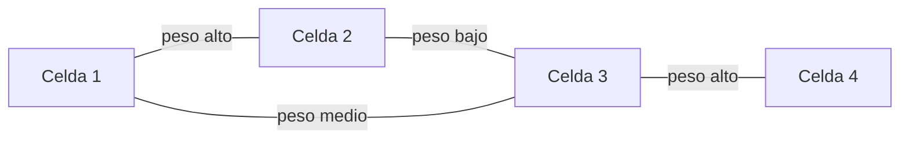

La preplanificación entrega un número de emplazamientos y un tipo de configuración de
despliegue, pero ninguna ubicación real sobre el terreno. Este capítulo retoma el
proceso exactamente en ese punto: la planificación nominal selecciona la posición
concreta de cada emplazamiento y produce el plan de cobertura y el plan de capacidad de
la red, y la planificación detallada ajusta, sobre esos emplazamientos ya fijados, el
plan de celdas vecinas, el plan de frecuencias o de códigos, el plan de identificadores
y el resto de parámetros de configuración. El capítulo cierra con la replanificación que
las medidas tomadas sobre la red ya desplegada realimentan hacia el propio modelo de
propagación empleado en las dos fases anteriores.

## Introducción

Una herramienta de planificación radio automatiza buena parte de este proceso, pero no
sustituye la interpretación del ingeniero: cada mapa que produce, sea de nivel de señal,
de solapamiento o de interferencia, condensa una gran cantidad de cálculos punto por
punto en una imagen que hay que saber leer para decidir qué emplazamiento añadir, qué
parámetro ajustar o qué plan aceptar como definitivo. Las fuentes de este tema recurren
de forma constante a mapas de color en escala de grises para representar esos
indicadores sobre el escenario planificado. Este capítulo no puede reproducir esas
imágenes rasterizadas, pero describe en cada caso qué representa el mapa y qué patrón
visual debe buscar quien lo interpreta.

## Planificación de cobertura

El objetivo de la planificación de cobertura es encontrar la ubicación real de las
estaciones base que logra una cobertura continua del área de interés, maximizando la
probabilidad de cobertura efectiva en lugar de conformarse con la estimación agregada de
la preplanificación. El procedimiento parte de una herramienta de planificación radio
que primero acota el área geográfica que se va a planificar y después selecciona las
ubicaciones candidatas, es decir, los emplazamientos posibles sobre los que situar cada
estación base. En esta selección se prefiere reutilizar emplazamientos ya desplegados
con tecnologías anteriores siempre que la geometría lo permita, porque un emplazamiento
existente ya dispone de suministro eléctrico, de acceso físico y de los permisos
administrativos que exige levantar uno nuevo.

Sobre cada ubicación candidata se aplica un modelo de propagación semideterminista, casi
siempre Walfish-Ikegami o un trazado de rayos, sobre los mapas de resolución fina
introducidos en
[herramientas de planificación y dimensionado](section_1_herramientas_y_dimensionado.md#tipos-de-mapa-y-capas-de-informacion).
En entornos urbanos, donde los edificios cercanos a la estación base condicionan de
forma decisiva la propagación, la resolución del mapa debe ser de al menos cinco metros
para representar esos objetos con fidelidad suficiente. La elección concreta del modelo,
y los criterios que gobiernan cuándo usar uno u otro según el entorno y la resolución
disponible, se tratan en
[propagación y pérdidas](../../01_fundamentos/02_canal/section_1_propagacion_y_perdidas.md#eleccion-de-modelo-segun-entorno-y-resolucion);
este capítulo aplica ese modelo ya elegido a la selección de emplazamientos reales.

### Matrices de propagación

La **matriz de propagación** de una estación base recoge, para cada punto del mallado
del escenario, la pérdida de propagación calculada entre esa estación base y ese punto.
Una herramienta de planificación calcula una matriz de este tipo por cada emplazamiento
candidato, de modo que el conjunto completo de matrices de propagación es la materia
prima sobre la que se construyen todos los indicadores del resto del capítulo: el nivel
de señal recibido en un punto, la celda que domina ese punto o la interferencia que unas
celdas generan sobre otras se obtienen todos comparando o combinando los valores de
estas matrices, sin necesidad de recalcular la propagación en ningún paso posterior.

### Áreas de dominancia

Antes de calcular estas matrices es necesario fijar una configuración de parámetros
radio por defecto para cada emplazamiento candidato, en particular la potencia
transmitida y el acimut e inclinación de cada antena, porque el nivel de señal recibido
en cualquier punto depende de esa configuración tanto como de la propagación. Con esa
configuración fija, el **área de dominancia** de una celda es el conjunto de puntos del
escenario en los que esa celda ofrece el mejor nivel de señal o la menor pérdida de
propagación de entre todas las celdas candidatas, es decir, la celda que un terminal
situado en ese punto seleccionaría como celda servidora.

El área de dominancia resultante no coincide con el hexágono regular del modelo
geométrico introducido en
[concepto celular y reutilización de frecuencias](../01_fundamentos_celulares/section_1_concepto_celular.md#geometria-de-celdas):
su contorno es irregular y sigue la topografía real y la disposición efectiva de acimut
e inclinación de cada antena. El cálculo de estas áreas se apoya en el algoritmo de
Voronói, que particiona un plano en regiones asociadas a un conjunto de puntos de
referencia de forma que cada región agrupa los puntos más próximos a su referencia; en
planificación celular, la métrica de proximidad no es la distancia euclídea sino la
pérdida de propagación de la matriz correspondiente, de modo que la región de cada celda
es su área de dominancia geométrica.

El modelo de Okumura-Hata, uno de los modelos empíricos introducidos en
[propagación y pérdidas](../../01_fundamentos/02_canal/section_1_propagacion_y_perdidas.md#modelos-empiricos-okumura-hata),
converge hacia el comportamiento del espacio libre a medida que aumenta la altura de la
antena, porque una antena más alta reduce la influencia relativa de los obstáculos
cercanos al suelo sobre la trayectoria dominante de la señal. Esa propiedad hace que las
áreas de dominancia calculadas con Okumura-Hata para estaciones base muy elevadas se
aproximen más a la geometría regular del modelo hexagonal que las calculadas con un
modelo semideterminista sobre el mismo escenario urbano.

### Mapas de nivel de señal y cifras de mérito

Con las áreas de dominancia fijadas, el siguiente paso construye un **mapa de nivel de
señal piloto**, que representa en cada punto del escenario la potencia recibida
procedente de la celda dominante en ese punto. Sobre ese mapa se define un nivel de
señal mínimo requerido y se calcula la **cifra de mérito de cobertura**, la tasa de
cobertura insuficiente del área, es decir, la fracción del escenario en la que ningún
emplazamiento alcanza ese nivel mínimo. Un mapa de nivel de señal en escala de grises
muestra tonos claros en el centro de cada celda, donde la señal es más intensa, y tonos
oscuros hacia los bordes y en las zonas de sombra generadas por obstáculos, y una cifra
de mérito de cobertura alta señala que existen demasiadas zonas oscuras extendidas, no
solo bordes de celda estrechos.

Cuando una zona concreta no alcanza el nivel mínimo exigido con ninguna tecnología
disponible en ese emplazamiento, una opción de mitigación consiste en redirigir a los
terminales de esa zona hacia otra tecnología capaz de ofrecer una cobertura adecuada,
por ejemplo hacia una banda de frecuencia más baja con mejor propagación, en lugar de
añadir directamente un nuevo emplazamiento.

### Solapamiento entre celdas

El **solapamiento entre celdas**, también llamado **dominancia** en algunas fuentes de
planificación, mide cuántas celdas ofrecen a un punto un nivel de señal comparable al de
su celda servidora. El indicador con el que se caracteriza este solapamiento es la media
o un percentil de la distribución del número de celdas vecinas relevantes, calculado a
partir de las medidas de nivel de señal de la celda servidora y de sus celdas vecinas en
cada punto del escenario. Una celda vecina se considera relevante en un punto cuando su
nivel de señal en ese punto queda por encima de un umbral de diferencia respecto al
nivel de la celda servidora, no por el mero hecho de estar geográficamente próxima.

Un cierto grado de solapamiento es deseable y no un defecto de planificación, porque
ofrece redundancia frente al fallo de la celda servidora y sostiene el proceso de
traspaso desarrollado en
[movilidad y recursos radio](../01_fundamentos_celulares/section_2_movilidad_y_recursos_radio.md#traspaso).
El valor recomendado del número de celdas vecinas relevantes por punto se sitúa en torno
a dos, suficiente para ese respaldo sin comprometer la calidad de la señal. Un número
sensiblemente mayor no aporta redundancia adicional útil: indica más bien que la celda
servidora tiene un nivel de señal bajo en ese punto, de modo que la diferencia frente al
resto de celdas circundantes se estrecha y muchas de ellas quedan dentro del umbral de
relevancia sin que ninguna domine con claridad, una situación que degrada la calidad de
la señal en lugar de mejorar la resiliencia del punto.

???+ example "Lectura de un mapa de solapamiento y decisión sobre el plan de cobertura"

    Una herramienta de planificación produce, sobre un escenario urbano de
    emplazamientos trisectoriales, un mapa de color en escala de grises del número de
    celdas vecinas relevantes por punto. El mapa muestra tonos oscuros, de una a dos
    celdas relevantes, en la mayor parte del escenario, con manchas claras aisladas de
    hasta diecisiete celdas relevantes alrededor de un punto muy concreto. La cifra de
    mérito de dominancia calculada para el conjunto del escenario es de $0{,}6872$, un
    valor que se interpreta como que la celda dominante ofrece, en promedio, un nivel de
    señal aproximadamente un $68\,\%$ más intenso que la media del resto de celdas
    circundantes en cada punto.

    El punto con diecisiete celdas relevantes, dieciséis vecinas y la propia celda
    servidora, no representa una redundancia beneficiosa sino un fallo de cobertura: se
    ubica en el extremo de alcance de su celda servidora, con un nivel de señal muy bajo
    en términos absolutos, de modo que la diferencia entre esa celda y el resto de
    celdas circundantes se reduce hasta el punto de que casi todas ellas superan el
    umbral de relevancia sin que ninguna domine con claridad. La decisión correcta ante
    este punto no es aceptar el solapamiento como una fortaleza del plan, sino tratarlo
    como una advertencia de cobertura insuficiente en esa zona y revisar si un
    emplazamiento adicional, o un ajuste de inclinación en los emplazamientos próximos,
    resuelve el déficit de nivel de señal absoluto que lo produce. El resto del
    escenario, con una o dos celdas relevantes por punto, no requiere ninguna
    intervención: es precisamente el rango recomendado de solapamiento.

### Matriz de interferencias

La **matriz de interferencias** resume, para cada pareja de celdas del escenario, un
percentil de la relación entre la potencia de la celda considerada como portadora y la
potencia recibida de la otra celda como interferente, evaluada en el enlace descendente
y en el conjunto de puntos donde ambas celdas resultan relevantes. El valor habitual
introducido en esta matriz es el percentil del cinco por ciento de esa relación
portadora a interferente, porque representa a los usuarios en las condiciones menos
favorables de la distribución en lugar de a un usuario medio, y es precisamente ese
extremo el que condiciona el peor caso que la red debe soportar.

La matriz de interferencias no es simétrica en general: la interferencia que la celda
$A$ genera sobre la celda $B$ no coincide con la que la celda $B$ genera sobre la celda
$A$, porque ambas direcciones dependen de magnitudes distintas, entre ellas la potencia
de transmisión de cada celda, la altura de cada antena, la topografía concreta entre
ambas y los obstáculos físicos que afectan de forma distinta a cada sentido de
propagación. Esta asimetría complica la gestión de la matriz porque obliga a evaluar y
almacenar ambos sentidos de cada pareja de celdas en lugar de aprovechar la simetría
para reducir a la mitad el volumen de cálculo, como sí sería posible si la matriz fuera
simétrica.

Una vez calculada, la matriz de interferencias sirve como entrada directa para asignar
de forma automática las celdas vecinas de cada celda: las celdas con mayor interferencia
mutua son también las candidatas más plausibles a aparecer en la lista de vecinas de
traspaso de la otra, porque una interferencia significativa solo se produce entre celdas
cuyas áreas de dominancia son próximas o se solapan.

### Factor de geometría

El **factor de geometría** de una celda en un punto se define como la relación entre la
potencia de la señal deseada, la de la celda servidora, y la interferencia co-canal
total recibida en ese punto, calculada bajo el supuesto de que todas las celdas
interferentes transmiten con una carga del cien por cien. Este factor evalúa la calidad
de la señal potencial que un punto puede alcanzar en el peor caso de carga de la red, y
se emplea durante la planificación nominal para ajustar la configuración de
emplazamientos antes de que exista tráfico real sobre el que medir.

$$
G = \frac{P_{\text{deseada}}}{\sum_{i} P_{\text{interferente},i}}
$$

donde $P_{\text{deseada}}$ es la potencia recibida de la celda servidora en el punto
considerado y $\sum_{i} P_{\text{interferente},i}$ es la suma de las potencias recibidas
de todas las celdas interferentes co-canal, ambas evaluadas con la configuración de
carga máxima del cien por cien. Sobre el mapa resultante se calcula una cifra de mérito
de calidad de señal, agregada para el conjunto del escenario, que resume en un solo
número el comportamiento de $G$ en todos los puntos planificados.

Un mapa de color en escala de grises del factor de geometría muestra tonos claros, de
mayor calidad, en el centro de cada celda, donde la señal deseada domina con holgura
sobre cualquier interferencia co-canal recibida desde emplazamientos distantes, y tonos
oscuros hacia los bordes de celda y hacia las zonas laterales respecto a la dirección de
apuntamiento de cada sector, donde la señal deseada se debilita mientras la
interferencia procedente de celdas vecinas cocanal se mantiene comparativamente estable.

???+ example "Lectura de un mapa de factor de geometría junto al mapa de solapamiento"

    Sobre el mismo escenario urbano trisectorial del ejemplo anterior, la herramienta de
    planificación produce también el mapa del factor de geometría, con una cifra de
    mérito de calidad de señal del escenario de $3{,}5248$. El patrón visual de este
    mapa es coherente con el de solapamiento pero no idéntico: los tonos claros se
    concentran en el interior de cada sector, en la dirección exacta de apuntamiento de
    la antena, mientras que los tonos oscuros aparecen tanto en los bordes de celda como
    en los laterales de cada sector, una zona que el mapa de solapamiento anterior no
    señalaba como problemática porque en esos laterales suele dominar con claridad una
    única celda, sin apenas vecinas relevantes.

    La lectura conjunta de ambos mapas evita una conclusión errónea: un punto con poco
    solapamiento no es automáticamente un punto de buena calidad de señal, porque el
    factor de geometría puede ser bajo en ese mismo punto si la interferencia co-canal
    recibida desde un emplazamiento distante, aunque no compita por la dominancia,
    resulta suficiente para degradar la relación señal a interferencia bajo el supuesto
    de carga máxima. Un plan de cobertura completo revisa los dos indicadores de forma
    conjunta antes de aceptar un emplazamiento como definitivo, en lugar de optimizar
    uno de ellos de forma aislada.

### Selección de emplazamientos candidatos

La selección final de emplazamientos que compone el plan de cobertura sigue tres pasos.
En el primero se define el espacio de soluciones aprobadas, es decir, el conjunto
completo de emplazamientos candidatos que ha superado los criterios administrativos y
técnicos previos. En el segundo se modela la evaluación de cada emplazamiento candidato
asignando un peso a cada punto de la matriz de interferencias, de forma que la
contribución de un emplazamiento a la interferencia total del escenario se puede
comparar de forma homogénea con la de cualquier otro candidato. En el tercero se aplica
un algoritmo de optimización de selección que recorre el espacio de soluciones aprobadas
y devuelve el subconjunto de emplazamientos que mejor equilibra cobertura e
interferencia, produciendo así el plan de cobertura definitivo.

## Planificación de capacidad

El objetivo de la planificación de capacidad es estimar la capacidad de datos y de
señalización que necesita cada celda para sostener una accesibilidad, una retención y
una integridad de la comunicación adecuadas frente a la demanda de tráfico prevista, en
lugar de limitarse al recuento agregado de emplazamientos que produce la
preplanificación.

### Métodos analíticos, de simulación y empíricos

Existen tres familias de métodos para estimar esta capacidad. Los **métodos analíticos**
aplican fórmulas cerradas, como las de Erlang B y Erlang C desarrolladas en
[Erlang y dimensionado de recursos](../../06_trafico/01_colas/section_2_erlang_y_dimensionado.md),
junto con ecuaciones de carga, de interferencia y de requisitos de servicio propias de
cada tecnología. Los **métodos de simulación** recurren a modelos de colas con
mecanismos de reintento o a simuladores estáticos de nivel de sistema, que reproducen el
comportamiento agregado de muchas celdas y muchos usuarios sin resolver explícitamente
la propagación punto por punto. Los **métodos empíricos**, por último, ajustan
ecuaciones de regresión a partir de medidas de rendimiento reales de la red, y su
precisión depende en buena medida del equipo concreto sobre el que se han tomado esas
medidas.

La elección entre familias responde a un compromiso de fidelidad frente a coste
computacional: un método analítico es inmediato de evaluar pero ignora efectos de
interacción entre celdas que un simulador de nivel de sistema sí captura, mientras que
un simulador exige un tiempo de cómputo mucho mayor y, igual que los métodos analíticos,
no modela la propagación explícita de la señal sobre el terreno real, a diferencia de la
herramienta de planificación de cobertura del apartado anterior.

### Canales de voz y probabilidad de bloqueo

El canal de voz de una red celular, el `TCH` en GSM, se comporta como un sistema con
pérdidas frente a la demanda de tráfico: una llamada que no encuentra canal libre se
rechaza en el momento, sin encolarse a la espera de un recurso. El proceso de llegada de
llamadas se modela como una distribución de Poisson y la duración de cada llamada como
una distribución exponencial, las mismas hipótesis del modelo `M/M/c` con pérdidas
introducido en
[Erlang y dimensionado de recursos](../../06_trafico/01_colas/section_2_erlang_y_dimensionado.md#hipotesis-del-modelo).
El dimensionado del número de canales de voz de una celda aplica, en consecuencia, la
fórmula de Erlang B desarrollada en ese capítulo para obtener la probabilidad de bloqueo
correspondiente a un número de canales dado.

???+ example "Dimensionado de los canales de voz frente a un crecimiento de tráfico"

    Una celda cursa un tráfico ofrecido de voz de $A = 20$ erlangs en la hora cargada y
    dispone de $c = 24$ canales de tráfico equivalentes. Evaluando la fórmula recursiva
    de Erlang B para $c = 24$ se obtiene una probabilidad de bloqueo
    $B(24, 20) \approx 6{,}61\,\%$, por encima del grado de servicio objetivo del
    $2\,\%$ que exige el operador. Aumentando el número de canales hasta $c = 29$, la
    probabilidad de bloqueo cae a $B(29, 20) \approx 1{,}28\,\%$, ya por debajo del
    objetivo, mientras que con $c = 28$ el bloqueo es de $1{,}88\,\%$, todavía
    conforme. El número mínimo de canales que satisface el grado de servicio con este
    tráfico ofrecido es, por tanto, $28$.

    Si la demanda crece hasta $A = 25$ erlangs, manteniendo los $c = 28$ canales
    anteriores, el bloqueo sube a $B(28, 25) \approx 8{,}28\,\%$, de nuevo incumpliendo
    el objetivo. La celda necesita entonces $c = 34$ canales, con los que el bloqueo
    baja a $B(34, 25) \approx 1{,}65\,\%$. Un crecimiento del tráfico ofrecido del
    $25\,\%$ exige, en este caso concreto, un incremento del número de canales de solo
    el $21{,}4\,\%$, porque la relación entre tráfico ofrecido y canales necesarios no es
    lineal: la fórmula de Erlang B exhibe economía de escala, de modo que cuantos más
    canales agrupa ya una celda, menor es el incremento relativo de canales que exige
    absorber un mismo incremento relativo de tráfico.

### Canales de señalización dedicada y sistemas con espera

Los canales de señalización dedicada que gestionan el establecimiento de una llamada,
como el `SDCCH` de GSM, se comportan de forma distinta frente a la saturación: una
petición que no encuentra recurso libre no se descarta, sino que se almacena en una cola
y espera a que quede uno disponible, porque el propio protocolo de señalización tolera
ese retardo como parte normal de su funcionamiento. El dimensionado de estos canales
aplica, en consecuencia, la fórmula de Erlang C introducida en
[Erlang y dimensionado de recursos](../../06_trafico/01_colas/section_2_erlang_y_dimensionado.md#formula-de-erlang-c),
y el criterio de calidad ya no es un grado de servicio máximo sobre la probabilidad de
rechazo, sino un tiempo medio de espera máximo tolerable antes de que el protocolo
interprete ese retardo como un fallo de establecimiento.

???+ example "Dimensionado de los canales de señalización dedicada de una celda"

    Una celda recibe un tráfico de señalización de establecimiento de $A = 2$ erlangs
    en la hora cargada y dispone de $c = 4$ canales `SDCCH`, cada uno con un tiempo
    medio de ocupación de $1/\mu = 3$ segundos. El factor de utilización es
    $\rho = A/c = 0{,}5$, por debajo de la unidad, lo que garantiza un régimen
    estacionario. La probabilidad de bloqueo de Erlang B para este par es
    $B(4, 2) \approx 9{,}52\,\%$, y sustituyendo en la fórmula de Erlang C la
    probabilidad de que una petición de señalización tenga que esperar es
    $C(4, 2) \approx 17{,}39\,\%$. Con $\mu = 1/3$ peticiones por segundo, el tiempo
    medio de espera de las peticiones que sí esperan es
    $W = C(4, 2) / (c\mu - A\mu) \approx 0{,}261$ segundos.

    Si el operador exige que ninguna petición de señalización espere más de $0{,}2$
    segundos en promedio, este reparto de cuatro canales no lo cumple, y la celda
    necesita un canal `SDCCH` adicional para reducir tanto la probabilidad de espera
    como el tiempo medio de espera resultante.

### Canales de señalización común y capacidad de aviso de llamada

Los canales de señalización común, como el `PCH`/`AGCH` de GSM, dependen a su vez de la
estructura del `BCCH`, el canal que transmite la información general de la celda. La
capacidad del canal de aviso de llamada de cada celda es precisamente la magnitud que
acota el tamaño admisible de un área de localización completa, como se desarrolla en
[movilidad y recursos radio](../01_fundamentos_celulares/section_2_movilidad_y_recursos_radio.md#areas-de-localizacion),
y su dimensionado sigue exactamente el mismo procedimiento de Erlang B o Erlang C que un
canal de tráfico o de señalización dedicada, aplicando la fórmula que corresponda al
comportamiento del sistema concreto ante la saturación, tal como se detalla en
[Erlang y dimensionado de recursos](../../06_trafico/01_colas/section_2_erlang_y_dimensionado.md#dimensionado-del-canal-de-aviso-de-llamada).

### Capacidad en redes de paquetes

En una red de conmutación de paquetes, la capacidad de una celda no se mide en canales
equivalentes de un sistema con pérdidas o con espera, sino en un rendimiento de datos
agregado que depende de la eficiencia espectral efectivamente alcanzada. Una cota
superior teórica de esa eficiencia la ofrece el teorema de Shannon-Hartley, que
establece la capacidad máxima de un canal en función de su relación señal a ruido, pero
la eficiencia espectral real de un sistema celular queda por debajo de esa cota, porque
el teorema no tiene en cuenta las pérdidas introducidas por la codificación práctica de
canal, la señalización de control ni las técnicas de acceso múltiple reales del sistema.
El dimensionado de una red de paquetes debe apoyarse, en consecuencia, en la eficiencia
espectral medida o simulada de la tecnología concreta, y tratar el límite de Shannon
únicamente como una referencia de orden de magnitud, nunca como un valor de diseño.

### Planificación conjunta de cobertura y capacidad

GSM trata la planificación de cobertura y la planificación de capacidad como dos
procesos independientes, resueltos con herramientas y en momentos distintos del proceso
de planificación. UMTS y las tecnologías posteriores rompen esa separación porque la
capacidad de una celda condiciona directamente su alcance de cobertura: en un sistema de
acceso múltiple por división de código, un aumento de la carga de usuarios eleva el
nivel de interferencia intracelular, lo que reduce el alcance efectivo de la celda para
un mismo nivel de calidad exigido, un efecto conocido como respiración de celda (_cell
breathing_). En consecuencia, la planificación de UMTS y de las tecnologías siguientes
resuelve cobertura y capacidad de forma conjunta mediante modelos analíticos basados en
ecuaciones de carga, que en la práctica se sustituyen casi siempre por simuladores de
nivel de sistema capaces de capturar esa interacción sin resolver explícitamente cada
ecuación de carga por separado.

### Medidores de señal por tecnología

Cada tecnología emplea medidores propios para alimentar el proceso conjunto de cobertura
y capacidad. GSM se apoya en la calidad de recepción `RxQual`, con una escala de calidad
creciente. UMTS y HSPA emplean la relación portadora a interferencia `C/I` además de la
potencia del piloto `CPICH`. LTE y las tecnologías posteriores sustituyen estos
medidores por la potencia de referencia recibida `RSRP` y la calidad de referencia
recibida `RSRQ`, que combinan la potencia útil con la interferencia y el ruido de forma
más directa que los medidores de generaciones anteriores.

## Planificación detallada

Con el plan de cobertura y el plan de capacidad ya fijados sobre los emplazamientos
reales, la planificación detallada ajusta el resto de parámetros de configuración de la
red: la lista de celdas vecinas de cada celda, la asignación de frecuencias o de
códigos, los identificadores, la orientación de las antenas, la potencia de los canales
comunes, los parámetros de gestión de recursos radio, la coexistencia entre bandas y
tecnologías, la capacidad de procesado en banda base y la estructura de la red en
controladores.

### Plan de celdas vecinas

El **plan de celdas vecinas** determina, para cada celda, la lista de celdas candidatas
a recibir un traspaso desde ella. Esta lista se rige por tres principios. El primero
incluye celdas geográficamente cercanas, con solapamiento de señal suficiente para que
el traspaso sea viable, y la práctica habitual se limita a las dos coronas de vecinas
más próximas a la celda considerada. El segundo asegura adyacencias bidireccionales: si
la celda $A$ incluye a la celda $B$ como vecina, la celda $B$ debe incluir también a la
celda $A$, para que un usuario que se traspasa de una a otra pueda regresar si las
condiciones cambian. El tercero reduce el número de celdas vecinas al mínimo compatible
con los dos principios anteriores, porque una lista más corta permite una decodificación
más rápida en el terminal.

Existen dos métodos para construir esta lista. El **método geométrico** se basa
únicamente en la ubicación geográfica de las celdas candidatas, sin considerar sus
niveles de señal reales. El **método de matriz de interferencia**, en cambio, parte
directamente de la matriz de interferencias calculada durante la planificación de
cobertura, y selecciona como vecinas las celdas con mayor interferencia mutua, porque
una interferencia significativa entre dos celdas solo se produce cuando sus áreas de
dominancia son próximas o se solapan, la misma condición geométrica que exige el primer
método pero derivada de una medida de señal real en lugar de solo de la posición.

En UMTS, la lista de vecinas define de forma más estricta el conjunto de celdas que un
terminal monitoriza para un posible traspaso, con un límite máximo de noventa y seis
celdas vecinas por celda. La pérdida de una celda vecina por interferencia del código
piloto es un problema habitual en esta tecnología, agravado porque las medidas previas
al traspaso solo se generan a partir de eventos concretos, no de forma periódica. La
estrategia habitual para acotar el tamaño de la lista consiste en reducir el número de
celdas vecinas interfrecuencia y de otro sistema, que solo se monitorizan mediante un
modo comprimido de medida más costoso en recursos que la monitorización intrafrecuencia
habitual. En LTE, el objetivo principal de la planificación de vecinas es complementar,
no sustituir, a la función de definición automática de vecinas, conocida como `ANR`
(_Automatic Neighbour Relation_), que añade de forma dinámica relaciones de vecindad no
previstas en el plan inicial; una lista negra de celdas excluidas evita que esa función
automática incorpore relaciones que el plan detallado descarta de forma deliberada.

???+ example "Compromiso de longitud en la lista de vecinas de una celda urbana densa"

    Una celda urbana con seis coronas de vecinas potenciales dentro de su alcance de
    interferencia debe decidir cuántas de ellas incluir en su lista final de vecinas de
    traspaso. Ampliar la lista a las seis coronas mejora la probabilidad de encontrar
    una celda de destino adecuada en cualquier dirección de movimiento del usuario, lo
    que reduce la tasa de traspasos fallidos y mejora la calidad de señal percibida en
    los bordes de celda menos favorables. Sin embargo, cada celda añadida a la lista
    exige que la propia celda, y cada una de las vecinas incluidas, mantengan y
    actualicen la relación de vecindad correspondiente, lo que eleva la carga de
    señalización de la red de forma proporcional al tamaño de la lista.

    Limitar la lista a las dos coronas más próximas, la práctica habitual introducida
    antes en este apartado, reduce esa carga de señalización y acelera la decodificación
    en el terminal, pero puede dejar fuera una celda de destino relevante en una
    dirección concreta de movimiento, lo que degrada la calidad de la señal y aumenta
    el riesgo de traspaso fallido precisamente en las zonas de alta movilidad donde el
    usuario cruza con mayor frecuencia el borde de su celda servidora. La decisión
    correcta no es maximizar ni minimizar la lista de forma uniforme para toda la red,
    sino ajustar su longitud celda por celda a partir de la matriz de interferencias
    real: una celda con vecinas muy asimétricas en interferencia solo necesita incluir a
    las relevantes, mientras que una celda con seis coronas de interferencia comparable
    justifica una lista más larga que la práctica habitual de dos coronas.

### Plan de frecuencias y tamaño de agrupación

El **plan de frecuencias** divide el espectro disponible en subconjuntos de canales y
asigna cada subconjunto a una celda, de forma que se respete la distancia mínima de
reutilización entre celdas cocanal desarrollada en
[concepto celular y reutilización de frecuencias](../01_fundamentos_celulares/section_1_concepto_celular.md#tamano-de-agrupacion-y-distancia-cocanal).
Un tamaño de agrupación mayor aumenta la distancia de reutilización disponible entre
celdas cocanal y, con ella, reduce la interferencia cocanal esperada, al precio de
repartir el mismo espectro entre más celdas y reducir así el número de canales
disponibles por celda, exactamente el mismo compromiso entre capacidad y calidad
introducido en el capítulo de concepto celular.

### Reutilización con múltiples factores

La **estrategia de reutilización con múltiples factores** (`MRP`, _Multiple Reuse
Pattern_) supera la limitación de aplicar un único tamaño de agrupación uniforme a toda
la red, dividiendo en su lugar el problema de planificación de frecuencias por capas de
transceptores. Cada capa recibe un subconjunto de canales de tamaño distinto y un
esquema de reutilización propio, de forma que las capas menos expuestas a interferencia,
por ejemplo la capa que sirve el tráfico más próximo a la propia estación base, pueden
adoptar un factor de reutilización más ajustado que las capas que cubren zonas más
alejadas o más expuestas a interferencia cocanal. Esta división por capas aprovecha
además la distribución irregular del tráfico real de la red: las zonas de mayor demanda
reciben un factor de reutilización más bajo para maximizar la capacidad disponible,
mientras que las zonas de menor demanda emplean un factor más alto que prioriza la
calidad de la señal sobre la densidad de canales.

### Formulación como coloración de grafos

El problema de asignación de frecuencias, de códigos o de identificadores admite una
formulación común como un problema de **coloración de grafos**. La red celular se modela
como un grafo $G$ cuyos vértices $V$ son las celdas y cuyas aristas $E$ conectan pares
de celdas que mantienen una relación de vecindad relevante, con un peso asociado a cada
arista que refleja la importancia de esa relación, por ejemplo el nivel de interferencia
mutua o el volumen de traspasos entre ambas celdas. Colorear el grafo consiste en
asignar un color, es decir, un canal de frecuencia, un código o un identificador, a cada
vértice, de forma que dos vértices unidos por una arista de peso alto reciban colores
distintos siempre que sea posible.

El objetivo de optimización no es minimizar de forma absoluta el número de colores
empleados, como en la coloración de grafos clásica, sino maximizar la suma de los pesos
de las aristas cuyos dos vértices reciben colores distintos, porque el recurso de
colores disponible, el número de canales, de códigos o de identificadores del sistema,
está fijado de antemano por el propio estándar o por el espectro asignado al operador, y
lo que hay que optimizar es qué relaciones de alto peso, de mayor interferencia o de
mayor riesgo, quedan efectivamente resueltas con colores distintos dentro de ese recurso
limitado.

En UMTS en modo `FDD`, este mismo problema asigna ocho mil ciento noventa y dos códigos
de enlace descendente organizados en quinientos doce grupos asignadores a cada celda,
respetando la distancia mínima de reutilización de código y asegurando que toda pareja
de celdas vecinas directas reciba grupos distintos, de nuevo una coloración de grafos
sobre el mismo grafo de vecindad que en la planificación de frecuencias de GSM.

### Plan de códigos e identificadores de celda

En LTE, la asignación del identificador físico de celda `PCI` persigue tres objetivos
simultáneos: respetar la distancia mínima de reutilización del propio identificador,
garantizar que toda pareja de celdas vecinas primarias reciba identificadores distintos
y asegurar que el desplazamiento en frecuencia de la señal de referencia piloto entre
celdas próximas sea el adecuado, porque el valor del `PCI` determina también ese
desplazamiento y una mala asignación puede hacer que las señales de referencia de dos
celdas próximas colisionen en frecuencia dentro del mismo símbolo `OFDM`.

???+ example "Plan de PCI en emplazamientos trisectoriales regulares"

    Una red se despliega mediante emplazamientos trisectoriales distribuidos según la
    retícula hexagonal regular introducida en
    [concepto celular y reutilización de frecuencias](../01_fundamentos_celulares/section_1_concepto_celular.md#geometria-de-celdas).
    Cada emplazamiento aporta tres vértices al grafo de vecindad, uno por sector, y cada
    sector es vecino directo de los sectores más próximos de los seis emplazamientos que
    lo rodean. El plan de identificadores asigna, en primer lugar, tres identificadores
    distintos a los tres sectores de un mismo emplazamiento, porque comparten ubicación
    física y su proximidad angular los convierte en vecinos directos entre sí con
    seguridad. En segundo lugar, comprueba que ningún sector de un emplazamiento vecino
    recibe el mismo identificador que el sector con el que linda directamente,
    recorriendo el patrón hexagonal emplazamiento por emplazamiento.

    Con solo tres identificadores distintos repartidos de forma rotatoria entre
    emplazamientos vecinos, cualquier pareja de sectores directamente adyacentes de
    emplazamientos distintos acaba, tarde o temprano en la retícula, recibiendo el
    mismo identificador, porque tres colores no bastan para colorear correctamente un
    grafo con la conectividad de una retícula hexagonal trisectorial completa. El plan
    detallado necesita, en consecuencia, un número de identificadores distintos mayor
    que el número de sectores de un solo emplazamiento, de forma que la rotación entre
    emplazamientos
    vecinos evite la colisión que un esquema de solo tres identificadores no puede
    resolver en toda la retícula.

### Ángulos de orientación de antena

La planificación de los ángulos de orientación de antena selecciona, para cada celda, el
acimut y la inclinación que maximizan la cobertura y la capacidad del conjunto de la
red. El acimut se dirige horizontalmente hacia las zonas de mayor demanda de tráfico
dentro del sector, mientras que la inclinación se dirige verticalmente hacia el borde de
la celda, siguiendo el procedimiento de cálculo del ángulo de inclinación desarrollado
en
[herramientas de planificación y dimensionado](section_1_herramientas_y_dimensionado.md#inclinacion-mecanica-y-electrica).
Esta orientación vertical hacia el borde de celda es necesaria porque, en el borde
mismo, el ancho de haz de tres decibelios de la antena resulta insuficiente para cubrir
esa zona con margen suficiente en GSM, en UMTS y en LTE por igual, de modo que dirigir
el punto de media potencia exactamente al borde, y no más allá, es la única forma de
aprovechar la energía radiada disponible sin desperdiciarla fuera del área de servicio.

### Potencia de los canales comunes de control

La planificación de la potencia de los canales comunes de control selecciona la potencia
de transmisión de esos canales para lograr una cobertura adecuada del canal de control
en todo el área de servicio de la celda. Aumentar esta potencia mejora la estimación del
canal en el borde de celda y acelera la sincronización de un terminal que se incorpora a
la red, pero introduce a la vez más interferencia hacia las celdas vecinas que comparten
el mismo canal, porque el canal de control transmite de forma continua y con una
potencia habitualmente fija, a diferencia de los canales de tráfico o de datos que
varían su potencia con la carga instantánea.

Cada tecnología traslada este compromiso a un recurso distinto. En GSM, el ajuste actúa
sobre la potencia del transceptor que porta el `BCCH`, con el riesgo de elevar la
interferencia hacia celdas cocanal vecinas. En UMTS, actúa sobre la potencia de los
códigos de los canales de control común, lo que resta potencia disponible para los
canales de voz y de datos del nodo B y aumenta igualmente la interferencia percibida por
otras celdas. En LTE, actúa sobre la potencia de las subportadoras y de los símbolos que
transportan los canales de control común, con el mismo efecto de reducir la potencia
disponible para los canales de datos y de elevar la interferencia hacia celdas vecinas.
En los tres casos, el ajuste correcto no maximiza la potencia de control de forma
aislada, sino que busca el punto de equilibrio entre el rendimiento de la señalización
de control y el rendimiento de los canales de tráfico y de datos.

UMTS presenta, además, un problema específico de este compromiso: la recepción del
código piloto `CPICH` de varias celdas con un nivel similar en entornos urbanos densos
degrada a la vez a los usuarios ociosos, que necesitan más señalización porque no
identifican con claridad una única celda de referencia, a los usuarios en proceso de
conexión, cuyo establecimiento de llamada se deteriora por la ambigüedad de celda
servidora, y a los usuarios ya conectados, que sufren interferencia de pilotos que no
pertenecen a su conjunto de celdas activas de traspaso. La solución no incrementa ni
reduce de forma uniforme la potencia del piloto en toda la red, sino que reduce el
solapamiento entre celdas ajustando de forma conjunta la potencia del `CPICH` y el
ángulo de inclinación de las antenas afectadas, la misma palanca de inclinación que
domina sobre el ajuste de potencia en el resto de compromisos de cobertura y capacidad
tratados en este tema.

### Parámetros de gestión de recursos radio

La planificación de los parámetros de gestión de recursos radio ajusta el funcionamiento
de los algoritmos que gobiernan el acceso a la celda, la reselección de celda en modo
inactivo, el traspaso en modo conectado, el control de potencia y el control de
congestión, todos ellos introducidos como mecanismos en
[movilidad y recursos radio](../01_fundamentos_celulares/section_2_movilidad_y_recursos_radio.md#gestion-de-recursos-radio).
El plan detallado no diseña estos mecanismos, que son propios de cada tecnología y de
cada fabricante, sino que fija los valores concretos de sus parámetros de configuración
para el escenario real que resulta de las fases anteriores, y esos valores concretos son
precisamente los que la optimización basada en medidas de red revisa una vez la red
entra en servicio.

### Coexistencia de bandas y tecnologías

La planificación de la coexistencia de bandas y tecnologías evita la interferencia entre
sistemas que comparten un área geográfica, ya sea entre bandas de frecuencia distintas o
entre tecnologías distintas sobre la misma banda. Dos mecanismos concretos producen esta
interferencia: la fuga de energía fuera de banda hacia canales adyacentes de otro
sistema, y la generación de señales espurias como producto de intermodulación entre
transmisores próximos. El criterio de diseño en ambos casos es minimizar la degradación
de la sensibilidad del receptor, tanto del terminal como de la propia estación base,
frente a esas fuentes de interferencia externas al sistema propio.

### Capacidad de procesado en banda base

La planificación de la capacidad de procesado en banda base dimensiona los recursos de
cómputo necesarios para ejecutar, en un emplazamiento concreto, todo el procesado en
banda base que exige la carga de tráfico prevista para ese emplazamiento: modulación,
demodulación, codificación de canal y las demás funciones de la unidad de banda base
introducida en
[herramientas de planificación y dimensionado](section_1_herramientas_y_dimensionado.md).
La unidad habitual de este dimensionado es el elemento de canal, la capacidad de
procesamiento necesaria para gestionar un único canal, entendiendo por canal una
combinación concreta de frecuencia y código, de forma que el número de elementos de
canal necesarios en un emplazamiento se deriva directamente del número de canales
simultáneos que el plan de capacidad del apartado anterior exige sostener en ese
emplazamiento.

### Estructuración de la red en controladores

La estructuración de la red en controladores asigna cada celda a un controlador o a un
área de control concreta, procurando que las celdas vecinas entre las que se producen
muchos traspasos queden bajo el mismo controlador, porque un traspaso entre celdas de
controladores distintos exige señalización adicional entre esos controladores que un
traspaso interno al mismo controlador no necesita. El objetivo secundario, una vez
satisfecho el primero, reparte la carga de tráfico de forma equitativa entre
controladores para que ninguno quede sobredimensionado ni infrautilizado. Este problema
se formula como una **partición de grafos**: el mismo grafo de vecindad y de tráfico que
sirve de base a la coloración de frecuencias de este capítulo, pero resuelto ahora
agrupando vértices en particiones en lugar de asignando colores a cada vértice por
separado.

## Replanificación con medidas de red

Los planes de cobertura, de capacidad y de configuración detallada de los apartados
anteriores se calculan sobre un modelo de propagación y sobre una estimación de tráfico
que preceden al despliegue real de la red. Una vez la red entra en servicio, las medidas
que los propios terminales y la propia infraestructura recogen permiten corregir ambos
puntos de partida, en un ciclo de realimentación hacia la planificación que cierra el
ciclo de vida introducido en
[herramientas de planificación y dimensionado](section_1_herramientas_y_dimensionado.md#ciclo-de-vida-de-una-red-celular).

### Ajuste del modelo de propagación con medidas

El **modelo de propagación basado en medidas de red** mejora la exactitud del modelo
empírico o semideterminista empleado durante la planificación nominal a partir de
medidas reales tomadas por terminales geolocalizados. En GSM, estas medidas se recopilan
extendiendo las listas de vecinas incluidas en los informes de medida habituales de la
propia señalización. En UMTS y en LTE, la recopilación exige activar medidas periódicas
en lugar de depender únicamente de las medidas basadas en eventos que estas tecnologías
emplean por defecto para el traspaso. Esta activación tiene un coste operativo que no es
gratuito: incrementa la carga de procesado de la estación base, que debe procesar un
volumen de informes de medida mayor del habitual, y aumenta el consumo de batería de
cada terminal que reporta, lo que exige controlar de forma explícita qué porcentaje de
los terminales activos participa en la campaña de medida en cada momento, en lugar de
activar el reporte periódico en la totalidad del parque de terminales.

A partir del conjunto de medidas recopiladas se construye un **mapa de pérdidas por
intervalo**, que agrupa las medidas de pérdida de propagación observadas según un
intervalo de distancia o de otra variable relevante del modelo, y sobre ese mapa se
ajustan las constantes del modelo de propagación elegido para que su predicción se
acerque a las pérdidas medidas realmente en el escenario. Dos enfoques distintos
afrontan ese ajuste. El ajuste **por intervalos** (_bins_) sustituye directamente la
predicción del modelo teórico por el valor medido en cada intervalo, lo que ofrece una
precisión mayor porque se adapta a las particularidades locales de obstáculos y de
variación geográfica de cada intervalo concreto, al precio de una mayor complejidad de
mantenimiento y de una degradación notable en los intervalos donde apenas existen
medidas disponibles. El ajuste **por calibración de constantes** conserva en cambio la
forma funcional del modelo teórico original y solo reajusta sus parámetros a partir de
las medidas, lo que simplifica el mantenimiento y facilita las actualizaciones
periódicas, aunque sacrifica precisión porque sigue asumiendo la homogeneidad del
entorno que supone el modelo original, una homogeneidad que el ajuste por intervalos no
necesita asumir.

???+ example "Recalibración de Okumura-Hata a partir de medidas de campo"

    Se reutiliza la expresión numérica de Okumura-Hata para una estación base urbana a
    $1800\ \text{MHz}$ introducida en
    [herramientas de planificación y dimensionado](section_1_herramientas_y_dimensionado.md#radio-maximo-de-celda),

    $$
    L_b\ \lbrack \text{dB}\rbrack \approx 136{,}19 + 35{,}23 \log_{10}\lbrack
    d_{\text{km}} \rbrack
    $$

    y se dispone de cuatro medidas de campo tomadas por terminales geolocalizados a
    distancias de $0{,}5$, $1$, $2$ y $4\ \text{km}$ de la estación base, con pérdidas
    medidas de $129{,}6$, $140{,}5$, $150{,}3$ y $161{,}9\ \text{dB}$ respectivamente. La
    predicción del modelo sin recalibrar en esas mismas distancias es de $125{,}58$,
    $136{,}19$, $146{,}80$ y $157{,}40\ \text{dB}$, de modo que el residuo, medida menos
    predicción, es de $4{,}02$, $4{,}31$, $3{,}50$ y $4{,}50\ \text{dB}$. El error
    cuadrático medio del modelo sin recalibrar frente a estas medidas es de
    $4{,}10\ \text{dB}$.

    El enfoque de calibración de constantes más simple, aplicable con solo cuatro
    medidas, ajusta el término constante del modelo sumándole el residuo medio de la
    campaña, $4{,}08\ \text{dB}$, sin modificar la pendiente logarítmica original. El
    modelo recalibrado resulta

    $$
    L_b\ \lbrack \text{dB}\rbrack \approx 140{,}27 + 35{,}23 \log_{10}\lbrack
    d_{\text{km}} \rbrack
    $$

    y el error cuadrático medio de este modelo recalibrado frente a las mismas cuatro
    medidas cae a $0{,}375\ \text{dB}$, una reducción de aproximadamente el $90{,}8\,\%$
    respecto al modelo original. La recalibración no ha cambiado la forma del modelo,
    solo su término constante, y ya con una campaña de medida modesta de cuatro puntos
    reduce el error de forma sustancial porque el sesgo dominante del modelo original en
    este escenario concreto era, precisamente, un desajuste sistemático de nivel y no de
    pendiente con la distancia.

### Grafos de movilidad de usuarios

Además de la recalibración del modelo de propagación, las medidas de la red alimentan la
construcción de **grafos de tendencias de movilidad** de los usuarios, tanto de los que
permanecen ociosos como de los que están conectados, a partir de las medidas recopiladas
por el sistema de soporte de operaciones (`OSS`). Para los usuarios conectados, el grafo
se construye midiendo el número de traspasos que se producen entre cada pareja de celdas
vecinas durante un periodo de referencia, la misma magnitud que alimentaba el ejemplo de
reparto en áreas de localización de
[movilidad y recursos radio](../01_fundamentos_celulares/section_2_movilidad_y_recursos_radio.md#areas-de-localizacion).
Para los usuarios ociosos, el grafo se construye en cambio midiendo el número de
actualizaciones de localización no periódicas que se producen en las celdas situadas en
el borde de cada área de localización, porque esas actualizaciones son la única señal de
movilidad disponible sobre un terminal que no mantiene una comunicación activa.

Estos grafos de movilidad no son un fin en sí mismos dentro de la planificación: son la
entrada de datos reales que sustituye, en un ciclo de replanificación, a las
estimaciones teóricas de tráfico y de patrones de movimiento empleadas en la
preplanificación y en la planificación nominal iniciales, y son también la entrada que
el ciclo de optimización de la red retoma para ajustar de forma continua los parámetros
de movilidad una vez la red está en servicio.
