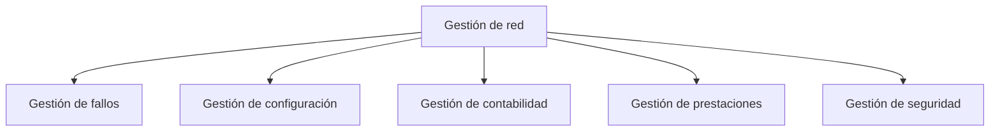
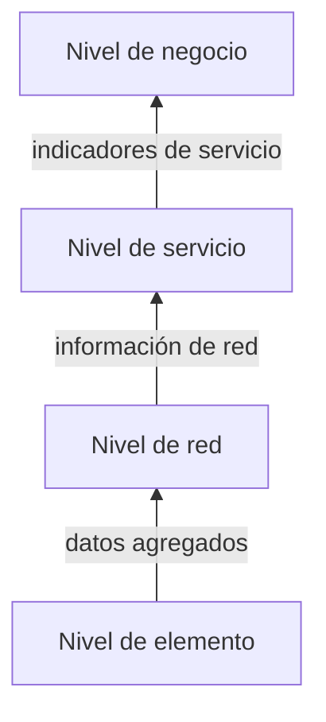
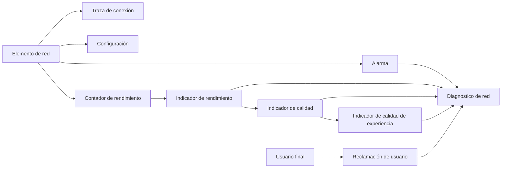

Una red celular en operación no se sostiene solo con el diseño que produjo la fase de
planificación: necesita un aparato de gestión permanente que vigile su estado, detecte
sus fallos, mantenga la consistencia de su configuración y mida su rendimiento de forma
continua. Este capítulo describe ese aparato de gestión y, sobre todo, el marco de
medida que lo sostiene: cómo un elemento de red produce contadores brutos, cómo esos
contadores se agregan en indicadores con significado operativo, y qué familias de
indicador existen según lo que evalúan. Ese marco de medida es el que la optimización de
red, tratada en el siguiente capítulo, consume para decidir qué ajustar y cuándo.

## Introducción

La gestión de una red celular se apoya en tres piezas que se relacionan entre sí de
forma jerárquica. La primera es un conjunto de **funciones de gestión** que cubre todo
el ciclo de vida operativo de la red, desde la resolución de fallos hasta la seguridad
de sus elementos. La segunda es un **sistema de información** organizado en niveles, que
traslada los datos crudos de la red hasta las decisiones de negocio que dependen de
ellos. La tercera es un conjunto de **fuentes de información** concretas, desde las
trazas de conexión hasta las reclamaciones de un usuario, que alimentan tanto a las
funciones de gestión como al sistema de información. Las tres piezas convergen en un
ciclo cerrado de monitorización, diagnóstico y ajuste que se describe más adelante en
este capítulo, y que retoma el ciclo de vida de planificación, despliegue y operación ya
introducido en
[herramientas de planificación y dimensionado](../05_planificacion/section_1_herramientas_y_dimensionado.md).

## Funciones de gestión de red

El modelo **FCAPS** agrupa las funciones de gestión de una red de comunicaciones en
cinco áreas, cuyo nombre es el acrónimo de sus iniciales en inglés: fallos (_fault_),
configuración, contabilidad (_accounting_), prestaciones (_performance_) y seguridad.
Cada área cubre una responsabilidad distinta y necesaria para mantener la red operativa,
y las cinco se ejercen de forma simultánea y continua, no de forma secuencial.

### Gestión de fallos

La **gestión de fallos** detecta y resuelve las interrupciones de la red. Abarca la
identificación del error, el aislamiento de los elementos afectados para evitar que el
fallo se propague, la notificación oportuna a quien deba actuar, el diagnóstico de la
causa subyacente y, finalmente, la restauración de la red a su estado normal de
funcionamiento. Es la función que consume las alarmas generadas por los elementos de
red, tratadas más adelante como una de las fuentes de información disponibles para la
gestión.

### Gestión de configuración

La **gestión de configuración** define y verifica la consistencia de los parámetros de
funcionamiento de cada elemento de red. Un elemento de red mal configurado, o
configurado de forma incoherente con sus vecinos, degrada el rendimiento de la red
aunque ninguno de sus componentes esté averiado, de modo que esta función es
independiente de la gestión de fallos y se ejerce de forma preventiva más que reactiva.

### Gestión de contabilidad

La **gestión de contabilidad** registra el consumo de recursos de red por parte de cada
usuario o servicio, con fines de tarificación y de reparto de costes entre las partes
que comparten la infraestructura, un escenario habitual en los acuerdos de itinerancia
entre operadores. Esta función queda fuera del alcance de las fuentes que documentan
este capítulo, que no detallan sus mecanismos concretos de medida.

### Gestión de prestaciones

La **gestión de prestaciones** asegura que la red ofrezca sus servicios con una calidad
mínima garantizada. Para ello monitoriza y analiza de forma continua las medidas
producidas por los elementos de red, así como el rendimiento de los servicios de extremo
a extremo que esos elementos sostienen. Es la función de la que dependen, de forma
directa, los indicadores de rendimiento y de calidad que ocupan la mayor parte de este
capítulo: sin gestión de prestaciones no habría un proceso sistemático que convirtiera
los contadores brutos de un elemento de red en una medida interpretable del estado de la
red.

### Gestión de seguridad

La **gestión de seguridad** controla el acceso a los recursos de gestión de la propia
red, protege la integridad y la confidencialidad de la información que circula entre sus
elementos y detecta los intentos de acceso no autorizado a la infraestructura de
gestión. Al igual que la gestión de contabilidad, las fuentes de este capítulo no
detallan sus mecanismos concretos, de modo que se describe aquí únicamente su alcance
dentro del modelo FCAPS.

## Sistemas de información para la gestión de red

El modelo **TMN** (_Telecommunications Management Network_) estructura los sistemas de
información que sostienen la gestión de red en cuatro niveles, dispuestos de forma
piramidal. Cada nivel recibe datos agregados del nivel inmediatamente inferior y
entrega, a su vez, información más agregada al nivel inmediatamente superior, de modo
que el detalle disminuye y el alcance de la decisión aumenta a medida que se asciende en
la pirámide.

### Nivel de negocio

El **nivel de negocio** (_Business Management System_, BMS) ocupa la cúspide de la
pirámide. Formula los planes de inversión, define los criterios de calidad de servicio y
observa la red en su totalidad para sostener las decisiones estratégicas del operador.
No gestiona elementos de red de forma directa: consume la información que le entregan
los niveles inferiores, ya reducida a un conjunto de indicadores agregados.

### Nivel de servicio

El **nivel de servicio** actúa como puente entre la red y el mercado. Su función
principal es mantener los servicios ofrecidos a los usuarios, traduciendo el estado
técnico de la red, que expresa el nivel de red inmediatamente inferior, en una medida de
la calidad que el mercado percibe.

### Nivel de red

El **nivel de red** (_Network Management System_, NMS) recopila la información que
procede de los elementos de red, la procesa y la analiza con el propósito de optimizar
el rendimiento general de la red. Es el nivel bajo el que trabajan de forma directa los
ingenieros especializados en optimización, y el punto en el que los contadores de cada
elemento se convierten por primera vez en indicadores con significado operativo.

### Nivel de elemento

El **nivel de elemento** (_Element Management System_, EMS) gestiona y controla los
elementos de red concretos que constituyen la columna vertebral de la infraestructura.
En este nivel se sitúan los sensores que recopilan la información en su forma más
detallada y menos agregada de toda la pirámide, la que da origen a los contadores de
rendimiento tratados más adelante.

## Flujo del proceso de optimización

El proceso de optimización de red se organiza como un ciclo cerrado de tres fases que se
repiten de forma continua mientras la red permanece en operación. Este apartado describe
el flujo en sí. Las técnicas concretas con que se ejecuta cada fase, y en particular el
reajuste de parámetros de cobertura, movilidad y carga, se tratan en el capítulo
siguiente.

### Monitorización

La **monitorización** observa de forma detallada la red y sus elementos, y recopila los
datos sobre su estado actual. Considera los parámetros de configuración de la red de
acceso radio, de la red troncal y del núcleo de red, junto con las funcionalidades
específicas de cada fabricante, y reúne los indicadores diversos que informan del estado
de la red. Es la fase que produce la materia prima sobre la que actúan las dos fases
siguientes, y la que consume de forma más directa las fuentes de información descritas
en el apartado siguiente.

### Gestión de fallos

Dentro del ciclo de optimización, la gestión de fallos resuelve los problemas detectados
durante la fase de monitorización que comprometen el rendimiento de la red. Es la misma
función descrita como área de FCAPS, aplicada aquí de forma específica al ciclo
operativo de optimización en lugar de al conjunto completo de responsabilidades de
gestión.

### Reajuste de parámetros

El **reajuste de parámetros** ajusta las configuraciones de la red a partir del
diagnóstico obtenido en las dos fases anteriores, con el fin de mejorar su eficiencia y
su rendimiento general. El resultado de este reajuste retroalimenta de nuevo a la fase
de monitorización, cerrando el ciclo. Los planes de parámetros que se ajustan en esta
fase, y las técnicas concretas de optimización de vecinas, cobertura, movilidad y carga
que los sustentan, son el objeto del capítulo siguiente.

## Fuentes de información

La optimización de red dispone de ocho fuentes de información distintas, que difieren
entre sí en su granularidad, en su coste de obtención y en el tipo de decisión que
permiten sostener. Las cinco primeras proceden de forma directa de los elementos de red,
y las tres últimas incorporan, en distinto grado, la perspectiva del usuario final.

| Fuente                              | Sigla | Qué aporta                                                       |
| ----------------------------------- | ----- | ---------------------------------------------------------------- |
| Traza de conexión                   | `TR`  | Registro continuo de eventos entre la red y un usuario concreto. |
| Configuración de elementos de red   | `CM`  | Parámetros de configuración vigentes de cada elemento.           |
| Contador de rendimiento             | `PM`  | Agregado numérico de eventos a nivel de celda o de adyacencia.   |
| Alarma                              | `FM`  | Notificación de un evento anómalo, clasificada por importancia.  |
| Indicador de rendimiento            | `KPI` | Fórmula derivada de contadores, asociada a un segmento de red.   |
| Indicador de calidad                | `KQI` | Calidad de servicio percibida, calculada a partir de KPI.        |
| Indicador de calidad de experiencia | `QoE` | Grado de satisfacción del usuario, mediante una puntuación.      |
| Reclamación de usuario              | `TT`  | Queja registrada por el centro de atención al cliente.           |

### Trazas de conexión

Una **traza de conexión** (_Traffic Recording_, `TR`) registra de forma continua todos
los eventos que ocurren entre la red y un usuario concreto. No permanece siempre activa
ni disponible para todos los usuarios de la red, porque el volumen de datos que
implicaría mantenerla activa de forma permanente sobre toda la base de usuarios resulta
desproporcionado frente al beneficio que aporta.

### Configuración de elementos de red

La **configuración de elementos de red** (_Configuration Management_, `CM`) recoge los
detalles de la configuración vigente de cada elemento de red. Esta información es
específica de cada fabricante, tanto en su formato como en el conjunto de parámetros que
expone, lo que dificulta comparar directamente la configuración de elementos de
fabricantes distintos sin una capa de normalización previa.

### Contadores de rendimiento

Los **contadores de rendimiento** (_Performance Management_, `PM`) agregan eventos a
nivel de celda o de adyacencia entre celdas, generando un nuevo evento cada vez que se
produce una transición relevante, como el establecimiento de una llamada o un traspaso
entre dos celdas concretas. Son dependientes del fabricante del elemento de red que los
genera y se envían de forma periódica al sistema de gestión, con un periodo de
agregación que fija el propio sistema, habitualmente la hora. Un contador de rendimiento
es la unidad mínima a partir de la cual se construye cualquier indicador posterior: un
KPI no es más que una fórmula que combina uno o varios contadores de este tipo.

### Alarmas

Una **alarma** (_Fault Management_, `FM`) representa un evento que indica que algo ha
sucedido en la red, típicamente un error o una condición anómala, y se clasifica según
su importancia para priorizar la atención de quien la recibe. Las alarmas alimentan de
forma directa la gestión de fallos descrita tanto en el modelo FCAPS como en el flujo
del proceso de optimización.

### Indicadores de rendimiento

Un **indicador de rendimiento** (_Key Performance Indicator_, `KPI`) es una fórmula
derivada de uno o varios contadores de rendimiento, calculada por las herramientas del
sistema de gestión de red. Un KPI está asociado a un segmento concreto de la red, ya sea
la red de acceso radio, la red troncal o el núcleo de red, y depende del fabricante que
lo calcula, aunque su definición conceptual sea independiente del fabricante. La
formulación completa de un KPI debe fijar sin ambigüedad tres elementos: el numerador,
el denominador y el periodo de agregación sobre el que se calcula, porque el mismo
cociente de contadores calculado sobre periodos distintos, por ejemplo la hora cargada
frente al día completo, produce valores que no son comparables entre sí.

Los KPI se agrupan por familias según el aspecto del rendimiento de red que evalúan. La
tabla siguiente resume las familias habituales, con un indicador representativo de cada
una a modo de ejemplo, sin agotar el catálogo completo de indicadores que puede definir
un fabricante concreto.

| Familia        | Qué evalúa                                                         | Indicador representativo                          |
| -------------- | ------------------------------------------------------------------ | ------------------------------------------------- |
| Accesibilidad  | La capacidad de iniciar un servicio cuando se solicita.            | Tasa de éxito en el establecimiento de llamada.   |
| Retenibilidad  | La capacidad de mantener un servicio activo sin interrupción.      | Tasa de llamadas caídas.                          |
| Movilidad      | El comportamiento de la red frente a los traspasos entre celdas.   | Tasa de traspasos fallidos.                       |
| Integridad     | La calidad del servicio mientras permanece activo.                 | _Throughput_ medio por usuario.                   |
| Disponibilidad | La proporción de tiempo en que un elemento de red presta servicio. | Tiempo de actividad de la celda sobre el periodo. |

La **accesibilidad** mide si un servicio llega a establecerse cuando el usuario lo
solicita, con independencia de lo que ocurra después de ese establecimiento. La tasa de
éxito en el establecimiento de llamada es su indicador más representativo, y se define
como

$$
\text{CSSR} = \frac{N_{\text{establecidas}}}{N_{\text{intentos}}}
$$

donde $N_{\text{establecidas}}$ es el número de intentos de llamada que llegan a
establecerse con éxito y $N_{\text{intentos}}$ es el número total de intentos
registrados, ambos contabilizados sobre el mismo periodo de agregación, típicamente la
hora cargada de la celda, cuyo papel en el dimensionado de tráfico se trata en
[Erlang y dimensionado de recursos](../../06_trafico/01_colas/section_2_erlang_y_dimensionado.md).
El propio grado de servicio que dimensiona un sistema con pérdidas es, en este sentido,
el antecesor conceptual de la accesibilidad: ambos miden la fracción de demanda que la
red consigue atender, aunque el grado de servicio se calcula en fase de dimensionado
sobre tráfico previsto y la accesibilidad se mide en operación sobre tráfico real.

???+ example "Comprobación de la accesibilidad de una celda frente a un objetivo"

    Una celda registra, durante la hora cargada, $12\,000$ intentos de
    establecimiento de llamada, de los cuales $11\,760$ se establecen con éxito.
    El operador exige un objetivo de accesibilidad no inferior al $97\,\%$ para
    considerar la celda dentro de umbral. La tasa de éxito de establecimiento de
    llamada de esa hora es

    $$
    \text{CSSR} = \frac{11\,760}{12\,000} = 0{,}98 = 98\,\%
    $$

    El resultado supera el objetivo del $97\,\%$, de modo que la celda cumple su
    umbral de accesibilidad en esa hora cargada concreta. El indicador no informa,
    sin embargo, de la causa de los $240$ intentos fallidos: distinguir si se
    deben a falta de recursos radio, a fallos de señalización o a otra causa
    exige descender al detalle de los contadores individuales que componen el
    numerador y el denominador de la fórmula.

La **retenibilidad** mide, en cambio, si un servicio ya establecido se mantiene activo
sin interrupción hasta su finalización normal. Su indicador más representativo es la
tasa de llamadas caídas, que se define como

$$
\text{CDR} = \frac{N_{\text{caídas}}}{N_{\text{establecidas}}}
$$

donde $N_{\text{caídas}}$ es el número de llamadas que se interrumpen de forma anómala
antes de su finalización normal y $N_{\text{establecidas}}$ es el número de llamadas que
llegaron a establecerse con éxito en ese mismo periodo, el mismo denominador que aparece
como numerador en la fórmula de accesibilidad. Esta relación entre ambas fórmulas
refleja que la retenibilidad solo tiene sentido calcularse sobre las llamadas que la
accesibilidad ya dejó pasar.

???+ example "Un promedio diario que oculta un problema de hora cargada"

    Una celda registra, a lo largo de un día completo, $100\,000$ llamadas
    establecidas, de las cuales $1\,200$ se caen de forma anómala. La tasa de
    llamadas caídas del día completo es

    $$
    \text{CDR}_{\text{día}} = \frac{1\,200}{100\,000} = 0{,}012 = 1{,}2\,\%
    $$

    valor por debajo del objetivo habitual del $2\,\%$, que llevaría a considerar
    la celda sin problemas de retenibilidad. Sin embargo, durante la hora cargada
    de esa misma celda, entre las 18:00 y las 19:00, se establecen $8\,000$
    llamadas y se caen $280$ de ellas, lo que da

    $$
    \text{CDR}_{\text{hora cargada}} = \frac{280}{8\,000} = 0{,}035 = 3{,}5\,\%
    $$

    casi el doble del objetivo. El promedio diario diluye el problema porque
    reparte las $280$ caídas de la hora cargada entre las $100\,000$ llamadas de
    todo el día, mientras que la mayoría de esas caídas se concentra en una única
    hora de alta demanda. Calcular el indicador sobre el periodo de agregación
    correcto, la hora cargada y no el día completo, es indispensable para que un
    indicador de retenibilidad detecte un problema real de capacidad o de
    cobertura en las horas de mayor tráfico.

La **movilidad** evalúa el comportamiento de la red frente a los traspasos entre celdas
descritos en
[movilidad y gestión de recursos radio](../01_fundamentos_celulares/section_2_movilidad_y_recursos_radio.md),
con indicadores como la tasa de traspasos fallidos sobre el total de traspasos
intentados. La **integridad** evalúa la calidad del servicio mientras permanece activo,
con indicadores como el _throughput_ medio o la tasa de error de bloque, sin entrar en
si el servicio llegó a establecerse o se mantuvo hasta el final. La **disponibilidad**
evalúa la proporción de tiempo en que un elemento de red presta servicio con normalidad,
sin contar los periodos de fallo o de mantenimiento programado, y es la familia de
indicador más directamente ligada a la gestión de fallos.

### Indicadores de calidad

Un **indicador de calidad** (_Key Quality Indicator_, `KQI`) representa la calidad de
servicio percibida por el usuario final, calculada a partir de uno o varios KPI en lugar
de directamente a partir de contadores. Mientras que un KPI está asociado a un segmento
técnico concreto de la red, un KQI se clasifica según el aspecto de la experiencia del
usuario que refleja: accesibilidad, integridad o retención del servicio percibidas de
extremo a extremo, no ya en un segmento aislado de la red. Esta distinción importa
porque un KPI puede estar dentro de umbral en cada segmento por separado, red de acceso,
red troncal y núcleo de red, y el KQI de extremo a extremo puede seguir estando fuera de
umbral si los efectos de cada segmento se acumulan a lo largo de la ruta completa del
servicio.

???+ example "De una queja de servicio a la familia de indicador correcta"

    Un operador despliega un servicio de vídeo en continuo y recibe quejas de
    usuarios que describen cortes completos en la reproducción, no una pérdida de
    calidad de imagen ni una demora al iniciar el vídeo. Decidir qué familia de
    indicador comprobar primero exige distinguir entre lo que cada familia
    evalúa. Si el vídeo llegara a iniciarse con demora pero sin cortes
    posteriores, el problema apuntaría a la accesibilidad, porque afecta al
    establecimiento del servicio. Si la imagen se mantuviera activa pero con
    calidad degradada, apuntaría a la integridad. La descripción de la queja,
    cortes que interrumpen una reproducción ya en marcha, no fallos al iniciarla
    ni degradación sin interrupción, señala en cambio a la retenibilidad del
    servicio a nivel de red de acceso radio: los KPI que conviene comprobar son
    los que miden caídas de portador de datos y fallos de traspaso durante una
    sesión activa, no los que miden el éxito de establecimiento inicial.

### Indicadores de calidad de experiencia

Un **indicador de calidad de experiencia** (_Quality of Experience_, `QoE`) evalúa el
grado de satisfacción de los usuarios mediante una puntuación, generalmente obtenida por
funciones de utilidad calculadas por las herramientas del sistema de gestión de red. La
puntuación MOS aplicada a la calidad de servicios de voz es su ejemplo más extendido. A
diferencia de un KQI, que se deriva de forma objetiva a partir de KPI medidos por la
red, un indicador de QoE incorpora un modelo de percepción subjetiva que traduce esas
medidas objetivas en una puntuación pensada para aproximarse a la valoración que haría
un usuario real.

### Reclamaciones de usuario

Una **reclamación de usuario** (_Trouble Ticket_) es una queja recopilada por el centro
de atención al cliente. Es la fuente de información más directamente ligada a la
percepción real del usuario, porque no se deriva de ninguna medida automática de la red,
pero también la más costosa de procesar, porque exige la intervención de personal para
recoger, clasificar y correlacionar cada queja individual con el resto de fuentes de
información antes de que resulte útil para el diagnóstico.

## Limitaciones de las medidas disponibles

El conjunto completo de fuentes de información descrito en este capítulo comparte una
limitación estructural: ninguna de sus medidas está asociada a un dispositivo concreto,
sino a un elemento de red, a una celda o a una adyacencia entre celdas. Un contador de
rendimiento no distingue si las llamadas que agrega proceden de un terminal de gama alta
o de uno antiguo, ni si un usuario concreto experimenta más caídas que la media de la
celda que le sirve. Diagnosticar un problema específico de un dispositivo o de un
usuario exige recurrir a la traza de conexión de ese usuario en particular, con el coste
de disponibilidad y de volumen de datos ya señalado en el apartado dedicado a esa
fuente.

A esta limitación se suma la sensibilidad de cualquier indicador al periodo de
agregación sobre el que se calcula, ilustrada en el ejemplo de la hora cargada de este
mismo capítulo: un mismo par de contadores puede producir un KPI dentro de umbral o
fuera de umbral según se agregue sobre una hora, sobre un día o sobre una semana
completa, sin que ninguno de esos cálculos sea en sí mismo incorrecto. Interpretar
correctamente un indicador exige, por tanto, conocer no solo su fórmula sino también el
periodo sobre el que se agregó, y complementar los contadores automáticos con campañas
de medida específicas, como pruebas de campo o análisis de trazas de usuarios concretos,
cuando el diagnóstico lo requiere.
