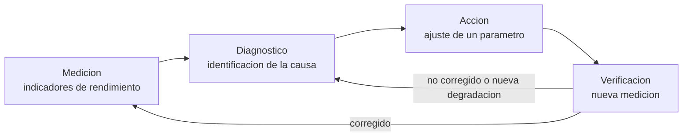
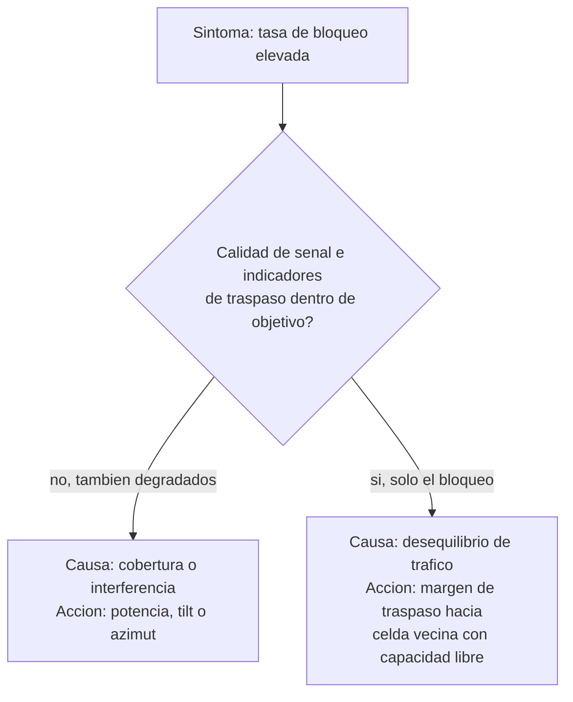
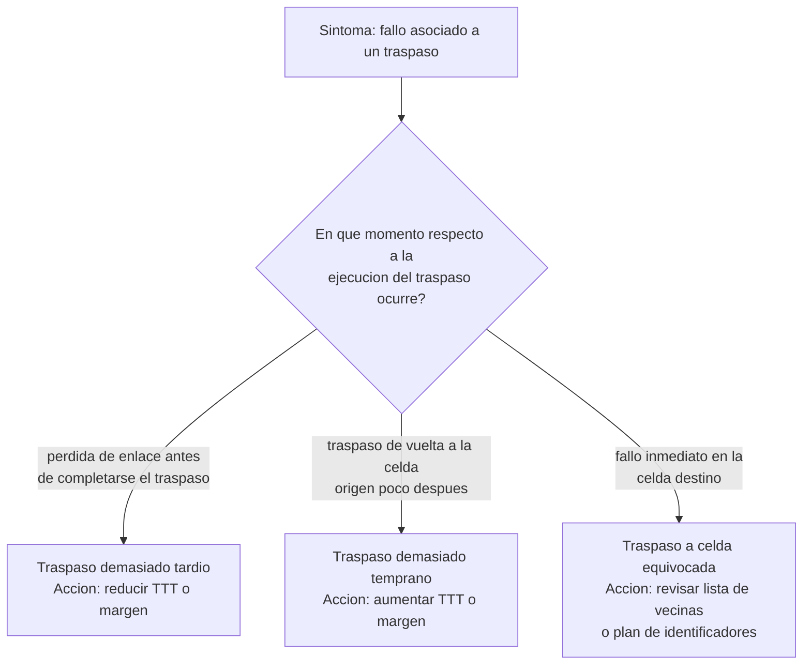
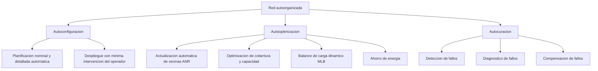

Una red celular ya desplegada y en servicio no deja de ajustarse una vez terminada la
planificación. El tráfico real se distribuye de forma distinta a la prevista, los
usuarios se desplazan de forma imprevisible y el entorno de propagación cambia con las
estaciones, la vegetación o las construcciones nuevas. Este capítulo desarrolla las
tareas de ajuste fino que mantienen la red dentro de sus objetivos de cobertura, calidad
y capacidad una vez en operación, y la automatización de esas tareas mediante funciones
de red autoorganizada.

## Introducción

Cada acción de optimización, con independencia del parámetro concreto que ajuste,
recorre el mismo ciclo: una fase de medición que aporta los indicadores ya establecidos
sobre el estado de la red, una fase de diagnóstico que interpreta esos indicadores para
identificar la causa de una degradación, una fase de acción que modifica el parámetro
elegido para corregirla y una fase de verificación que comprueba, con una nueva
medición, si la corrección ha producido el efecto esperado sin introducir una
degradación distinta en otro punto de la red.

La dificultad central de este ciclo no está en identificar qué parámetro corrige una
degradación concreta, sino en que casi ningún parámetro de una celda afecta solo a esa
celda. Endurecer un ajuste para resolver un problema local traslada con frecuencia parte
de ese problema a una celda vecina, de modo que la fase de verificación debe comprobar
el efecto en la celda ajustada y en su entorno inmediato, no solo en la celda que
originó la acción.

## Optimización de listas de vecinas

La **optimización de listas de vecinas** actualiza, para cada celda, el conjunto de
celdas candidatas a las que un terminal puede traspasarse. La actualización elimina las
adyacencias infrautilizadas, identificadas a partir de las estadísticas de traspaso
acumuladas, para acelerar la fase de medición y mejorar la precisión de la decisión: una
lista con adyacencias que casi nunca reciben un traspaso obliga al terminal a medir y
comparar candidatas que raramente aportan valor. La actualización añade, en sentido
contrario, nuevas adyacencias a partir de las medidas de señales piloto que los propios
terminales reportan, con el fin de evitar caídas de llamada por no incluir en la lista
la celda que en la práctica ofrece la mejor señal en una zona determinada.

La longitud de la lista de vecinas resulta, en consecuencia, un compromiso entre dos
riesgos opuestos. Una lista demasiado corta arriesga dejar fuera a la celda candidata
más adecuada en algún punto del área de servicio, lo que se traduce en traspasos tardíos
o en caídas de llamada evitables. Una lista demasiado larga obliga al terminal a medir y
reportar un número mayor de celdas candidatas de las que casi nunca se necesita, lo que
consume más señalización y retarda la decisión de traspaso al aumentar el tiempo
dedicado a la fase de medición.

## Optimización de cobertura y capacidad

La optimización de cobertura y capacidad gestiona el grado de solapamiento entre celdas
adyacentes para ampliar el área de servicio en las zonas de mala cobertura, aumentar el
tráfico cursado y reducir las llamadas caídas y los traspasos fallidos, sin generar por
ello un exceso de interferencia en las celdas vecinas.

### Gestión del solapamiento

Un solapamiento insuficiente entre celdas deja zonas del área de servicio sin cobertura
sólida de ninguna celda, lo que degrada la calidad recibida y dificulta el traspaso, ya
que el terminal no dispone de tiempo suficiente para completarlo antes de perder la
señal de la celda origen. Un solapamiento excesivo, en el sentido contrario, incrementa
la interferencia mutua en la zona compartida y reduce la eficiencia espectral del
conjunto, porque dos o más celdas compiten por servir a los mismos terminales con el
mismo espectro. El objetivo de la gestión del solapamiento no es eliminarlo, ya que un
margen de solapamiento moderado es precisamente lo que permite ejecutar el traspaso,
sino mantenerlo dentro del rango que sostiene el traspaso sin generar una interferencia
innecesaria.

### Celdas con exceso de alcance

Una celda con **exceso de alcance** (_overshooting_) proyecta su cobertura mucho más
allá del área que le correspondería según la distribución de emplazamientos de su
entorno, habitualmente por una potencia transmitida excesiva o por una inclinación de
antena insuficiente. El efecto es doble: por un lado, la celda compite por usuarios en
un área que en principio pertenece a otras celdas vecinas, incrementando la
interferencia que genera sobre ellas; por otro, esos usuarios lejanos experimentan una
calidad de enlace pobre a pesar de estar nominalmente cubiertos, porque las pérdidas de
propagación a esa distancia son altas y el margen de traspaso hacia una celda más
próxima puede tardar en dispararse. Reducir el área de servicio de una celda con exceso
de alcance, mediante una mayor inclinación de antena o una reducción de potencia,
disminuye tanto las llamadas caídas de esos usuarios lejanos como la interferencia que
la celda genera sobre sus vecinas.

### Parámetros y métricas de evaluación

Los parámetros que un ingeniero de optimización ajusta para actuar sobre la cobertura y
la capacidad son, principalmente, la potencia transmitida por la estación base, el
ángulo de acimut de cada sector y la inclinación de la antena, mecánica o eléctrica, ya
descrita en
[herramientas de planificación y dimensionado](../05_planificacion/section_1_herramientas_y_dimensionado.md).
La evaluación del efecto de un ajuste se apoya habitualmente en la relación
señal-interferencia-ruido y en el _throughput_ del percentil 5%, es decir, el valor por
debajo del cual se sitúa el 5% de los usuarios peor servidos, que corresponden en la
práctica a los usuarios del borde de celda. Emplear el percentil 5% en lugar de la media
evita que una mejora en el centro de la celda, donde la calidad ya es buena, oculte una
degradación en el borde, que es precisamente la zona donde actúan la mayoría de los
ajustes de cobertura.

La estrategia de ajuste no es la misma en todos los entornos: un entorno urbano, con
alta densidad de tráfico y emplazamientos próximos entre sí, prioriza la capacidad y
tolera un solapamiento menor, mientras que un entorno suburbano o rural, con
emplazamientos más espaciados, prioriza extender la cobertura incluso a costa de aceptar
un solapamiento mayor en los bordes.

???+ example "Percentiles de SINR frente a la media en la caracterización de una celda"

    La misma lógica que justifica evaluar el _throughput_ por el percentil 5%
    en lugar de por su media se aplica también a la relación
    señal-interferencia-ruido de una celda. Dos celdas con idéntica SINR media
    pueden presentar comportamientos muy distintos en sus extremos: una celda
    homogénea, con SINR concentrada en torno a la media en toda su área de
    servicio, y una celda con fuerte interferencia localizada en el borde, cuya
    media queda igual de alta gracias a un centro de celda con muy buena señal
    que compensa un borde degradado. La media por sí sola no distingue entre
    ambos casos.

    El **percentil 10%** ($P_{10}$) de la distribución de SINR medida en la
    celda, el valor por debajo del cual se sitúa el 10% de las muestras peor
    servidas, caracteriza la calidad del borde de celda con el mismo criterio
    que el percentil 5% de _throughput_ ya introducido: aísla la cola inferior
    de la distribución en lugar de diluirla en un promedio. El **percentil 90%**
    ($P_{90}$) caracteriza, de forma simétrica, la calidad del centro de celda.
    La diferencia entre ambos, $P_{90} - P_{10}$, resume en una sola cifra la
    dispersión de calidad radio dentro de la celda: un valor alto indica una
    celda con un centro muy bien servido y un borde muy penalizado, la situación
    que una media agregada oculta con mayor facilidad.

???+ example "Diagnóstico de una sobrecarga de tráfico sin modificar la cobertura"

    Una celda GSM presenta una tasa de bloqueo de llamadas elevada mientras que sus
    indicadores de calidad de señal, tasa de caída de llamadas y tasa de traspasos
    fallidos, se mantienen dentro de los objetivos habituales. El árbol de diagnóstico
    descarta primero un problema de cobertura o de calidad radio, precisamente porque
    esos indicadores están sanos, y dirige la causa hacia un desequilibrio de tráfico:
    la celda recibe más demanda de la que puede cursar con sus recursos actuales,
    mientras alguna celda vecina dispone de capacidad libre.

    Modificar la potencia transmitida o la inclinación de la antena resolvería la
    sobrecarga desplazando usuarios hacia la celda vecina, pero al precio de alterar la
    cobertura de ambas celdas y, con ella, la calidad radio que el enunciado exige
    preservar. El parámetro que corrige el desequilibrio sin tocar la cobertura es el
    margen de traspaso hacia la celda vecina con capacidad disponible: al reducirlo, se
    facilita que los terminales situados en la zona de solapamiento se traspasen hacia
    esa celda vecina antes de lo que lo harían con el margen original, redistribuyendo
    tráfico sin desplazar el límite físico de cobertura de ninguna de las dos celdas.

## Optimización de movilidad

La optimización de movilidad ajusta el instante en que se dispara el traspaso entre
celdas para facilitar la transición de los terminales en movimiento, especialmente en
entornos con áreas de solapamiento reducidas entre celdas, y para reducir el número de
traspasos innecesarios y la señalización que conllevan.

### Márgenes de traspaso e histéresis

El margen de traspaso y el papel del margen de histéresis frente al traspaso de vaivén
ya se han introducido en
[movilidad y recursos radio](../01_fundamentos_celulares/section_2_movilidad_y_recursos_radio.md#traspaso-por-balance-de-potencia).
En la fase de optimización, ese mismo margen deja de fijarse una vez en la planificación
y pasa a revisarse de forma periódica a partir de las estadísticas reales de traspaso,
tanto de forma manual por un ingeniero de optimización como, según se desarrolla más
adelante en este capítulo, de forma automática mediante una función de autoorganización.

### Tiempo de disparo

El **tiempo de disparo** (_time to trigger_, `TTT`) exige que la condición de traspaso
se mantenga cumplida durante un intervalo mínimo antes de ejecutar la decisión, en lugar
de disparar el traspaso en el instante en que la condición se cumple por primera vez. Un
`TTT` demasiado corto reacciona a fluctuaciones de muy corto plazo de la señal que el
filtrado de la fase de medición no llega a suavizar por completo, lo que favorece
traspasos hacia la celda equivocada o traspasos que se revierten enseguida. Un `TTT`
demasiado largo, en el sentido contrario, retrasa un traspaso que la condición de
cobertura ya justificaba, con el riesgo de que la calidad del enlace con la celda origen
se degrade por debajo de lo sostenible antes de que el traspaso llegue a ejecutarse.

Los traspasos fallidos que resultan de una mala configuración del `TTT`, o del margen de
traspaso asociado, se clasifican según el momento en que se produce el fallo respecto a
la ejecución del traspaso. Un **traspaso demasiado tardío** deja que el enlace con la
celda origen se degrade hasta perderse antes de que el traspaso llegue a completarse, lo
que se traduce en una caída de llamada justo antes o durante la transición. Un
**traspaso demasiado temprano** ejecuta el cambio de celda antes de que la celda destino
ofrezca realmente una señal mejor de forma sostenida, lo que provoca que el terminal
deba traspasarse de vuelta a la celda origen poco después, el patrón de traspaso de
vaivén ya descrito. Un **traspaso a la celda equivocada** ejecuta correctamente el
traspaso en el instante adecuado, pero hacia una celda candidata que no es la que
realmente ofrece la mejor señal en ese punto, lo que provoca un fallo inmediato en la
celda destino y un traspaso de emergencia posterior hacia la celda que debería haberse
elegido en primer lugar.

Esta clasificación es la base del caso de uso de autoorganización que ajusta de forma
automática estos mismos parámetros a partir de las estadísticas de traspasos fallidos,
descrito más adelante en este capítulo.

### Efecto ping-pong

El **efecto ping-pong** es el nombre operativo con el que se conoce en optimización al
traspaso de vaivén ya presentado como consecuencia de un traspaso demasiado temprano: un
terminal alterna repetidamente entre dos celdas en un intervalo de tiempo corto, sin que
su posición real justifique más de un cambio de celda. El margen de histéresis
introducido en el capítulo de movilidad reduce este efecto cuando la causa es el balance
de potencia entre celdas; cuando la causa es, en cambio, un ajuste de balance de carga
que modifica el margen de traspaso de forma simultánea en ambas direcciones de una misma
pareja de celdas, el efecto ping-pong puede reaparecer incluso con un margen de
histéresis correctamente dimensionado, según se desarrolla en el apartado siguiente.

## Balance de carga

El **balance de carga** ajusta el área de servicio de las celdas para equilibrar una
demanda de tráfico distribuida de forma irregular en el espacio, reduciendo el bloqueo y
la caída de llamadas en las celdas más cargadas y homogeneizando la distribución de
interferencia en el conjunto de la red.

### Ajuste del área de servicio

El área de servicio efectiva de una celda se puede reducir o ampliar mediante los mismos
parámetros que gobiernan la cobertura, potencia, acimut e inclinación, o de forma más
selectiva mediante el margen de traspaso hacia cada celda vecina en particular. Ajustar
el margen de traspaso resulta preferible cuando el objetivo es exclusivamente
redistribuir tráfico entre dos celdas concretas sin alterar el área de servicio
percibida por el resto de la red, mientras que ajustar potencia o inclinación afecta a
la totalidad del entorno de la celda, incluidas las direcciones donde no existe ningún
desequilibrio de carga que corregir. El balance de carga contribuye además a posponer el
despliegue de nuevos emplazamientos como respuesta a una demanda de capacidad creciente,
porque aprovecha la capacidad ya instalada en las celdas vecinas menos cargadas antes de
que la ampliación física de la red resulte estrictamente necesaria.

### Distribución de interferencia

Redistribuir tráfico hacia una celda vecina con capacidad libre no traslada solo
tráfico: traslada también la interferencia que ese tráfico genera. Aumentar la carga de
una celda vecina para aliviar la de una celda congestionada eleva el nivel de
interferencia que esa celda vecina recibe y genera, lo que puede degradar la relación
señal-interferencia-ruido en su propio borde de celda, especialmente si ese borde
coincide con la zona de solapamiento hacia una tercera celda que no participa en el
ajuste. Este es el motivo por el que la fase de verificación del ciclo de optimización
debe comprobar el efecto de un ajuste de balance de carga tanto en la celda que originó
el problema como en las celdas vecinas que absorben el tráfico redistribuido.

???+ example "Efecto de un ajuste de balance de carga en las celdas vecinas"

    Una celda congestionada bloquea llamadas de forma sistemática mientras dos celdas
    vecinas mantienen capacidad disponible. Reducir el margen de traspaso hacia esas
    celdas vecinas facilita la salida de tráfico desde la celda congestionada: tras el
    ajuste, el número de traspasos entrantes hacia la celda congestionada cae a
    prácticamente cero en todas las adyacencias, mientras que el número de traspasos
    salientes aumenta de forma notable. La tasa de caída de llamadas de la celda
    congestionada se reduce y el número de llamadas completadas con éxito aumenta, el
    resultado que perseguía el ajuste.

    Sin embargo, el mismo ajuste que alivia la celda congestionada empeora la relación
    señal-interferencia-ruido en el borde de las celdas vecinas que ahora atienden a
    más terminales, porque esos terminales adicionales incrementan la interferencia
    total en la zona de solapamiento. Si el ajuste del margen se lleva demasiado lejos,
    algunas de esas celdas vecinas pueden empezar a mostrar niveles de interferencia
    superiores a los que tenían antes del ajuste, con el riesgo de aumentar allí la
    propia tasa de caída de llamadas que se buscaba reducir en origen. Esto ilustra la
    dificultad central de la optimización: la corrección de una celda no es gratuita
    para sus vecinas, y todo ajuste debe verificarse también en el entorno de la celda
    ajustada.

    Reducir el margen de traspaso de forma simultánea en ambas direcciones de una misma
    pareja de celdas, en lugar de solo en la dirección que aleja tráfico de la celda
    congestionada, agrava además el riesgo de traspaso demasiado temprano: los
    terminales pueden empezar a conectarse a celdas más distantes o con peor señal, lo
    que aumenta el número de traspasos totales y con ellos el número de traspasos
    fallidos, incluido el efecto ping-pong entre las dos celdas ajustadas.

## Redes autoorganizadas

Las tareas anteriores, actualización de vecinas, ajuste de cobertura y capacidad,
optimización de movilidad y balance de carga, se pueden ejecutar de forma manual, con un
ingeniero de optimización interpretando indicadores y proponiendo cambios de parámetros,
o de forma automática, mediante funciones de **red autoorganizada** (_self organizing
network_, `SON`) que cierran el ciclo de medición, diagnóstico, acción y verificación
sin intervención humana en cada iteración.

### Motivación y beneficios

La automatización de estas tareas se ha vuelto necesaria porque libera a los ingenieros
de trabajo repetitivo y mejora la eficiencia operativa de la red. Entre sus beneficios
se cuentan la reducción del gasto operativo por menor trabajo manual, la minimización de
errores humanos en la configuración de parámetros, el aumento de la capacidad efectiva
de la red, la postergación del gasto de capital que exigiría ampliar físicamente la red,
la mejora de la calidad de servicio y de la calidad de experiencia percibidas por el
usuario, una mayor disponibilidad del servicio gracias a una respuesta más rápida ante
problemas, y un ahorro de energía sin deterioro apreciable de la calidad ofrecida.

Las funciones SON se agrupan en tres familias según el momento del ciclo de vida de la
red en el que actúan.

### Autoconfiguración

La **autoconfiguración** automatiza la planificación nominal y detallada y el propio
despliegue de un nuevo emplazamiento, con una intervención mínima del operador. Cubre
desde la selección asistida del emplazamiento y la configuración inicial del equipo
radiante hasta el establecimiento de los enlaces de transporte hacia la red troncal y la
notificación automática del inventario de equipos instalado, de modo que un
emplazamiento nuevo se incorpore a la red operativa con la menor cantidad de
configuración manual posible.

### Autooptimización

La **autooptimización** regula y ajusta de forma continua los parámetros de una red ya
en servicio para adaptarla a condiciones cambiantes del entorno, sin que ese ajuste
requiera desplegar equipos nuevos. Es la familia que automatiza directamente las tareas
descritas en los apartados anteriores de este capítulo: la actualización de la lista de
vecinas, la optimización de cobertura y capacidad, el balance de carga y la optimización
de movilidad, entre otras funciones que mejoran aspectos concretos del acceso a la red,
como el canal de acceso aleatorio.

### Autocuración

La **autocuración** monitoriza y analiza de forma automática los datos de configuración
y de rendimiento de la red para detectar, notificar, registrar, diagnosticar, compensar
y resolver fallos, correlacionando información que puede llegar incompleta, imprecisa o
errónea, y procurando en todo momento la mínima degradación posible del servicio
mientras el fallo persiste o se resuelve.

## Arquitecturas de red autoorganizada

Las funciones SON, con independencia de la familia a la que pertenezcan, se despliegan
sobre una de dos arquitecturas posibles, que determinan dónde se ejecuta la lógica de
decisión y cómo se coordina con el resto de funciones de la red.

### Arquitectura distribuida

La arquitectura **distribuida** ejecuta la función SON en el propio nodo de la red que
gestiona la celda afectada, sin depender de un sistema central. Sus ventajas son la
ejecución en tiempo real, la reducción del intercambio de información entre nodos y una
mayor robustez frente a fallos de un elemento individual, porque cada nodo sigue
operando su propia función con independencia del estado de los demás. Sus desventajas
son una optimización necesariamente local, la dificultad de correlacionar información de
configuración, de rendimiento y de fallos procedente de distintos sistemas de acceso
radio, una menor flexibilidad al quedar la lógica implementada en nodos concretos y
dependiente del fabricante de cada uno, y una coordinación más difícil entre funciones
SON distintas que compiten por ajustar parámetros relacionados.

### Arquitectura centralizada

La arquitectura **centralizada** ejecuta la función SON en un sistema único que recoge
información de toda la red o de una porción amplia de ella antes de decidir. Sus
ventajas son la optimización global, la posibilidad de correlacionar información de
configuración, de rendimiento y de fallos de distintos sistemas de acceso radio, una
mayor flexibilidad al residir la lógica en un único equipo independiente del fabricante
de cada nodo, y una coordinación más sencilla entre funciones SON distintas. Sus
desventajas son una ejecución en tiempo diferido en lugar de tiempo real, un mayor
volumen de información que debe transportarse desde los nodos hasta el sistema central,
y una menor robustez frente a fallos, porque una interrupción del sistema central afecta
a la optimización de toda la red que depende de él.

Ninguna de las dos arquitecturas domina a la otra en todos los criterios, y la elección
entre ambas depende de qué ventaja resulta más valiosa para la función SON concreta que
se está desplegando: una función que exige reacción inmediata, como la evitación de
interferencia instantánea, encaja mejor en una arquitectura distribuida, mientras que
una función que se beneficia de una visión de conjunto, como el balance de carga entre
un número elevado de celdas, encaja mejor en una arquitectura centralizada.

## Técnicas de autoorganización

Los métodos que implementan una función SON se clasifican, en primer lugar, según el
enfoque matemático en el que se apoyan. Los métodos basados en la teoría de optimización
garantizan encontrar la solución óptima al problema planteado, pero exigen una carga
computacional elevada y un modelo preciso del comportamiento de la red, un requisito
difícil de satisfacer cuando las condiciones del entorno cambian con rapidez. Los
métodos basados en la teoría de control prescinden de ese modelo preciso y resultan más
simples y menos costosos computacionalmente, a costa de no garantizar la optimalidad, la
mejora efectiva ni la estabilidad del sistema controlado.

### Métodos basados en optimización

Un método basado en optimización formula el ajuste de parámetros como un problema
matemático con una función objetivo, por ejemplo maximizar la capacidad cursada o
minimizar la tasa de caída de llamadas, sujeto a restricciones sobre los valores
admisibles de cada parámetro. La solución de ese problema exige, en general, evaluar el
efecto de muchas combinaciones de parámetros sobre un modelo de la red, lo que resulta
adecuado para decisiones poco frecuentes y de alto impacto, como una revisión completa
del plan de frecuencias, pero poco práctico para un ajuste que debe repetirse cada pocos
minutos sobre miles de celdas.

### Métodos basados en control

Un método basado en control observa el error entre el estado actual de un indicador y su
valor objetivo, y calcula el ajuste de un parámetro a partir de ese error, sin necesidad
de resolver un problema de optimización completo en cada iteración. Esta familia se
subdivide, a su vez, según la estrategia de control empleada: en **lazo abierto**, el
ajuste se calcula a partir de una regla fija sin comprobar su efecto real sobre la red,
y en **lazo cerrado**, el ajuste se recalcula de forma continua a partir de la medida
más reciente del propio efecto que produjo el ajuste anterior. Un mecanismo en lazo
cerrado resulta más robusto frente a errores del modelo, porque corrige su propia
desviación en la siguiente iteración, mientras que uno basado en un modelo preciso puede
alcanzar el objetivo en menos iteraciones si el modelo describe la red con fidelidad, a
costa de degradarse si esa descripción deja de ser válida.

### Controladores proporcional-integral-derivativo

Un **controlador proporcional-integral-derivativo** (`PID`) calcula el ajuste de un
parámetro como la suma de tres términos que reaccionan, respectivamente, al valor
presente del error, a su acumulación histórica y a su tendencia de cambio:

$$
u(t) = K_p\, e(t) + K_i \int_0^t e(\tau)\, d\tau + K_d\, \frac{de(t)}{dt}
$$

donde $e(t)$ es el error entre el valor objetivo de un indicador y su valor medido en el
instante $t$, $u(t)$ es el ajuste resultante del parámetro controlado, y $K_p$, $K_i$ y
$K_d$ son las ganancias proporcional, integral y derivativa que determinan cuánto pesa
cada término en el ajuste final. En el balance de carga entre celdas, un controlador
`PID` puede tomar como error la diferencia de carga entre una celda y sus vecinas y como
salida el margen de traspaso entre ambas: el término proporcional reacciona al
desequilibrio actual, el término integral corrige un desequilibrio persistente que el
término proporcional por sí solo no llega a eliminar, y el término derivativo modera el
ajuste cuando el desequilibrio ya está cambiando de signo rápidamente, para reducir el
riesgo de sobrecorrección.

### Controladores basados en reglas

Un **controlador basado en reglas**, o sistema experto, codifica el conocimiento de
optimización como un conjunto de reglas del tipo si-entonces que un ingeniero de
optimización aplicaría manualmente, y las ejecuta de forma automática sobre cada medida
nueva. Su principal ventaja frente a un controlador basado en un modelo matemático es
que no exige ese modelo, sino únicamente la experiencia de ingeniería que las reglas
capturan, lo que facilita su interpretación y su ajuste posterior por un ingeniero
humano.

???+ example "Amortiguación asimétrica en un controlador de balance de carga"

    Un controlador basado en reglas para el balance de carga dinámico entre una celda y
    su adyacente aplica el siguiente criterio en cada ciclo de medición: si la tasa de
    caída de llamadas de la celda adyacente supera un umbral y la tasa de bloqueo de la
    celda propia está por debajo de otro umbral, el margen de traspaso hacia la
    adyacente aumenta en una cantidad fija $\Delta$; si ocurre la condición contraria,
    el margen disminuye en $0{,}7\Delta$. La asimetría entre el incremento y la
    reducción, con un factor $0{,}7$ tomado directamente de la regla, no es simétrica
    por descuido: amortigua la corrección de vuelta para reducir el riesgo de que el
    margen oscile de forma continua entre dos valores, el equivalente, a nivel de
    parámetro, del efecto ping-pong entre celdas.

    Con un valor típico $\Delta = 2\ \text{dB}$, tres ciclos consecutivos en los que se
    cumple la primera condición incrementan el margen en

    $$
    3 \cdot \Delta = 3 \cdot 2 = 6\ \text{dB}
    $$

    Si a continuación se cumple dos veces la condición contraria, el margen se reduce en

    $$
    2 \cdot 0{,}7\Delta = 2 \cdot 0{,}7 \cdot 2 = 2{,}8\ \text{dB}
    $$

    de modo que, tras los cinco ciclos, el margen neto ha variado

    $$
    6 - 2{,}8 = 3{,}2\ \text{dB}
    $$

    respecto a su valor original. Un controlador simétrico, con la misma magnitud
    $\Delta$ para ambas direcciones, habría producido en la misma secuencia una
    variación neta de solo $(3-2)\cdot 2 = 2\ \text{dB}$, una diferencia que ilustra
    cómo la asimetría de la regla desplaza el punto de equilibrio del margen hacia el
    lado que alivia la congestión, sin dejar de responder también cuando la congestión
    remite.

### Controladores de lógica difusa

Un **controlador de lógica difusa** describe las entradas y las salidas del sistema con
adjetivos calificativos, por ejemplo carga baja, media o alta, en lugar de con umbrales
numéricos exactos, y expresa sus reglas mediante antecedentes y consecuentes formulados
con esos mismos adjetivos. A diferencia de un controlador basado en reglas convencional,
donde una regla se cumple o no se cumple de forma binaria, en un controlador de lógica
difusa cada regla dispone de una fuerza de disparo distinta según el grado en que su
antecedente se cumple, y la salida final se calcula como un promedio ponderado de las
salidas de todas las reglas activas, no solo de la que mejor se ajusta. Esta diferencia
le permite tomar decisiones con información imprecisa, incompleta o incluso errónea, y
producir un ajuste gradual del parámetro controlado en lugar de un salto brusco, algo
que un controlador basado en reglas exactas, con condiciones estrictamente verdaderas o
falsas, no ofrece de forma natural.

## Casos de uso

Las funciones SON descritas anteriormente se materializan en la práctica en un conjunto
de casos de uso concretos, agrupados según la familia a la que pertenecen.

### Lista de vecinas automática

La **lista de vecinas automática** (_automatic neighbor relation_, `ANR`) actualiza en
tiempo real las adyacencias de cada celda a partir de las medidas piloto reportadas por
los propios terminales, automatizando la tarea de optimización de listas de vecinas
descrita al inicio de este capítulo sin esperar a una revisión periódica manual.

### Balance de carga dinámico

El **balance de carga dinámico** (_mobility load balancing_, `MLB`) equilibra en tiempo
real la carga entre celdas vecinas ajustando de forma automática el margen de traspaso
entre ellas, según el mecanismo descrito en el apartado de controladores basados en
reglas. Resulta especialmente útil cuando la demanda de tráfico se concentra de forma
persistente en unas pocas celdas mientras otras próximas mantienen capacidad libre, una
situación habitual cuando un servicio nuevo se despliega de forma progresiva y sus
usuarios iniciales no se distribuyen de manera uniforme por el área de cobertura.

### Ahorro de energía

El caso de uso de **ahorro de energía** (_energy saving_, `ES`) reduce el consumo
eléctrico de la red apagando de forma dinámica elementos que no son necesarios durante
los periodos de baja demanda de tráfico, por ejemplo desactivando sectores completos en
horas o días concretos con tráfico previsiblemente escaso, siempre que las celdas
vecinas puedan absorber temporalmente esa cobertura sin degradar la calidad de servicio
ofrecida.

### Detección, diagnóstico y compensación de fallos

Este caso de uso encadena las tres etapas propias de la autocuración. La **detección**
identifica celdas con un problema real sin que necesariamente se haya generado ninguna
alarma explícita, por ejemplo reconociendo una celda dormida, una celda que permanece
operativa a nivel de red pero deja de cursar tráfico, a partir de estadísticas de
tráfico por celda y por hora que se desvían de su patrón habitual. El **diagnóstico**
identifica la causa concreta del fallo detectado correlacionando eventos y trazas de
llamada, por ejemplo analizando de forma automática las trazas de las llamadas caídas
para localizar en qué punto del procedimiento se produce el fallo de forma sistemática.
La **compensación** palía la degradación mientras el fallo de origen se resuelve, por
ejemplo ajustando el ángulo de inclinación de las antenas de los sectores vecinos a una
estación base caída para reducir el hueco de cobertura que esa caída ha introducido,
hasta que la estación afectada se restablece.

Un cambio repentino en los patrones de movilidad de los usuarios, motivado por un suceso
externo a la propia gestión de la red, reduce la movilidad entre unas celdas y la
incrementa entre otras, lo que desplaza el patrón de traspasos habitual y puede degradar
tanto la tasa de traspasos fallidos como el balance de carga vigente hasta ese momento.
La combinación de autooptimización de movilidad y balance de carga dinámico, descritas
ambas en este capítulo, es la que permite que la red readapte sus márgenes de traspaso a
la nueva distribución de tráfico sin exigir una intervención manual específica para ese
suceso puntual.

Con la optimización y las redes autoorganizadas se cierra el área de redes móviles de
esta wiki, que ha recorrido el sistema celular desde sus fundamentos de reutilización de
frecuencias y movilidad, a través de las generaciones GSM, UMTS, LTE y 5G, hasta la
planificación y el ajuste continuo de una red ya en servicio. La automatización de la
red de acceso radio sobre infraestructura virtualizada, que extiende varias de las
funciones de autoorganización presentadas aquí a un entorno de red definida por
software, pertenece a un ámbito propio de virtualización de redes, fuera del alcance de
esta área.
