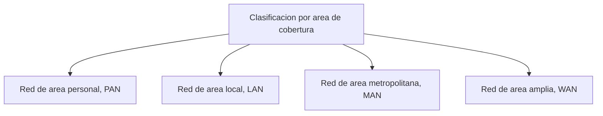
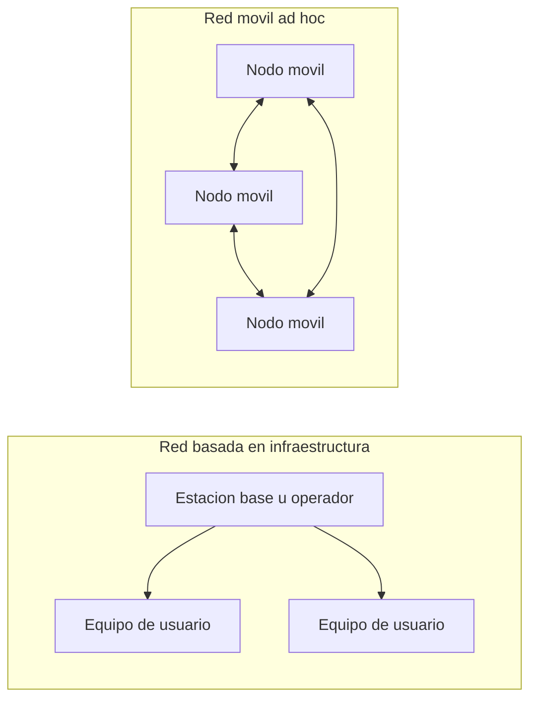
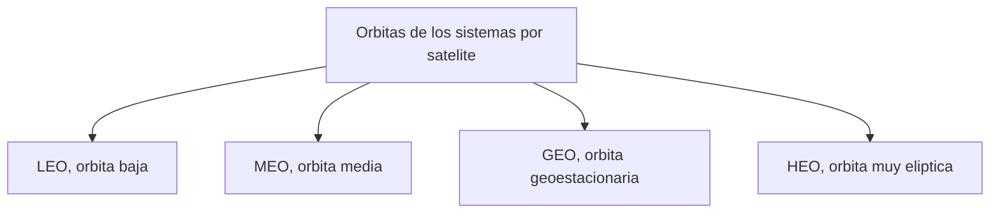

Este capítulo abre el área de redes inalámbricas y traza el mapa completo del terreno
antes de que los capítulos siguientes entren en cada tecnología concreta. Presenta qué
distingue a una red inalámbrica de una red guiada, los ejes con los que se clasifican
las redes inalámbricas y los dos modelos de formación de red que las sustentan, con o
sin infraestructura, incluidas las redes por satélite.

## Introducción

Una **red de telecomunicaciones** es una infraestructura de nodos y enlaces
interconectados que permite la comunicación entre terminales, cada uno identificado por
una dirección única dentro de la red. La **comunicación inalámbrica** es el caso
particular en el que esos enlaces no son un conductor eléctrico ni una fibra, sino el
espacio radioeléctrico: la información viaja mediante ondas de radio entre puntos que no
están físicamente conectados. Esta ausencia de conductor es la que da forma a todo lo
que sigue en el capítulo, desde las ventajas que ofrece frente al medio guiado hasta las
limitaciones que impone sobre el alcance, el consumo y la tasa de datos alcanzables.

## Comunicación inalámbrica

La comunicación inalámbrica no es una variante menor de la comunicación guiada, sino un
medio con propiedades físicas propias que condicionan el diseño de cualquier red que lo
emplee. El espacio radioeléctrico es un recurso compartido por naturaleza, sujeto a
regulación cuando el espectro está licenciado, y su calidad de propagación varía con el
entorno y con el tiempo de una forma que un cable no experimenta. Los mecanismos que
gobiernan esa variabilidad, las pérdidas de propagación y el desvanecimiento, se tratan
en detalle en
[propagación y pérdidas](../../01_fundamentos/02_canal/section_1_propagacion_y_perdidas.md)
y en
[desvanecimiento y respuesta del canal](../../01_fundamentos/02_canal/section_2_desvanecimiento_y_respuesta_del_canal.md),
y son la base física sobre la que se apoyan todas las clasificaciones que introduce este
capítulo.

### Ventajas frente al medio guiado

Frente a un despliegue cableado, una red inalámbrica reduce el coste de la
infraestructura de acceso porque no exige tender ni mantener un conductor físico entre
cada terminal y la red, permite la movilidad de los terminales durante la comunicación,
y facilita la distribución de la señal a puntos donde el cableado resultaría costoso o
inviable, como un edificio histórico, un área rural extensa o un entorno temporal. Estas
ventajas tienen una contrapartida directa: el medio compartido que hace posible la
movilidad es también el que introduce interferencia, atenuación variable y limitación de
espectro, de modo que la elección entre un despliegue guiado y uno inalámbrico no es
gratuita, sino un compromiso entre flexibilidad y control del medio.

### Entornos y servicios

El desarrollo de las tecnologías de red inalámbrica está ligado a los servicios que
ofrece en distintos entornos. En el ámbito civil aparecen lugares de reuniones y
congresos, museos, aeropuertos, estadios deportivos, entornos domésticos y
comunicaciones entre vehículos. En el ámbito militar, la red da servicio a vehículos y a
la comunicación entre soldados sobre el terreno. En situaciones de desastre natural, la
red resulta esencial para las operaciones de búsqueda y rescate y para la gestión de
incendios, precisamente porque en esas condiciones no existe ni puede desplegarse a
tiempo una infraestructura cableada.

Sobre esos entornos se apoya un catálogo de servicios amplio: proveedores de servicio de
acceso, servicios de salud, automatización del hogar, servicios contextuales y de
localización, servicios de información, educativos y empresariales. Cada combinación de
entorno y servicio impone requisitos distintos de alcance, consumo, tasa de datos y
fiabilidad, y es precisamente esa diversidad de requisitos la que exige clasificar las
redes inalámbricas según varios ejes independientes en lugar de según uno solo.

## Clasificación por área de cobertura

El primer eje de clasificación ordena las redes inalámbricas según la extensión
geográfica que cubren. Es el criterio más intuitivo, pero conviene no confundirlo con la
tecnología de acceso empleada: dos redes con el mismo alcance geográfico pueden emplear
tecnologías de acceso completamente distintas, y una misma tecnología de acceso, como se
verá en el eje siguiente, puede en ocasiones dar servicio a más de un ámbito de
cobertura.

### Redes de área personal

Una **red de área personal** (_personal area network_, PAN) cubre un espacio reducido,
del orden de una habitación, con una cobertura típica de $1$ a $10$ metros, y conecta
dispositivos de uso personal que un mismo usuario porta o tiene a su alcance inmediato.
El capítulo dedicado a Bluetooth y BLE, más adelante en esta área, sitúa la tecnología
de acceso de referencia para este ámbito.

### Redes de área local

Una **red de área local** (_local area network_, LAN) cubre un campus universitario o un
edificio de oficinas, con una cobertura típica de $100$ a $500$ metros. Incluye la
compartición de recursos de software y hardware sobre un medio compartido, y sus
estaciones se conectan a través de un punto de acceso, lo que introduce una necesidad de
infraestructura y, con ella, cierta limitación en la movilidad frente a una red sin
infraestructura. El capítulo de arquitectura y capa física de WLAN, más adelante en esta
área, desarrolla la tecnología de acceso local de referencia, IEEE 802.11.

### Redes de área metropolitana

Una **red de área metropolitana** (_metropolitan area network_, MAN) extiende la
cobertura a la escala de una ciudad completa. La fuente de este capítulo no fija una
cifra de alcance para este ámbito, a diferencia de lo que ocurre con la red de área
personal y la red de área local, porque su cobertura depende en la práctica del número y
la disposición de las estaciones desplegadas más que de un límite físico único de la
tecnología de acceso.

### Redes de área amplia

Una **red de área amplia** (_wide area network_, WAN) cubre un país o un continente
completo, y es el ámbito propio de las tecnologías celulares y de los sistemas
satelitales que se presentan más adelante en este mismo capítulo. Al igual que ocurre
con la red de área metropolitana, tampoco existe aquí una cifra de alcance única, sino
una cobertura que resulta de la superposición de muchas estaciones o de la altura de la
órbita del sistema satelital empleado.

## Clasificación por tecnología de acceso

El segundo eje clasifica las redes según la tecnología de acceso que emplean, un
criterio distinto del área de cobertura porque una misma tecnología puede dar servicio a
más de un ámbito geográfico. Wi-Fi (IEEE 802.11) es una tecnología de acceso de alta
velocidad sin necesidad de licencia, empleada principalmente en redes de área local y,
en sus variantes de mayor alcance, de área metropolitana. Bluetooth es una tecnología de
corto alcance sin licencia, propia de las redes de área corporal y de área personal.
WiMAX es una tecnología de alta velocidad orientada a redes de área metropolitana y de
área amplia. Las familias GSM, GPRS, HSPA, LTE y 5G son tecnologías de acceso celular
que dan cobertura de área amplia; su arquitectura y su interfaz radio se desarrollan en
detalle en el área de redes móviles de esta wiki, empezando por el
[concepto celular](../../03_redes_moviles/01_fundamentos_celulares/section_1_concepto_celular.md).

Cada una de estas tecnologías puede operar en capas distintas del modelo OSI, y esa
diversidad ha dado lugar a soluciones propietarias que, típicamente, no son compatibles
entre sí, o lo son solo de forma parcial, y que suelen requerir módulos de radio
diferentes en el terminal.

### Criterios de elección

La elección de una tecnología de acceso concreta depende de la capacidad de transmisión
que necesita el servicio, la distancia que debe cubrir el enlace, el tipo de servicio
que se presta, el coste del despliegue y de los terminales, y la fiabilidad exigida.
Ninguno de estos criterios se aplica de forma aislada: una tecnología que ofrece una
tasa de datos muy alta a corta distancia no es sustituible por una tecnología de largo
alcance y baja tasa sin cambiar también el tipo de servicio que la red puede prestar.

### Compromisos entre alcance, consumo y velocidad

Detrás de la elección de tecnología existe un compromiso estructural entre el alcance,
la cobertura geográfica, el coste de despliegue, el coste del chip de radio, la relación
entre rendimiento y coste, la duración de la batería del terminal, la calidad de
servicio exigida, la tasa de datos, la latencia y la escalabilidad del sistema a medida
que crece el número de terminales. Ampliar el alcance de una tecnología de acceso sin
aumentar su potencia de transmisión exige, en general, reducir su tasa de datos o
aumentar su latencia, y sostener una tasa de datos alta a largo alcance exige, a su vez,
un mayor consumo energético o una infraestructura de estaciones más densa. Ninguna
tecnología de acceso resuelve simultáneamente los tres extremos del compromiso, y esa es
la razón última por la que coexisten tantas tecnologías de acceso distintas en lugar de
una sola tecnología universal.

???+ example "Elección de tecnología de acceso para una red de sensores agrícola"

    Una explotación agrícola extensa necesita desplegar varios cientos de sensores de
    humedad de suelo repartidos en un área de varios kilómetros cuadrados, cada uno
    alimentado por una batería que debe durar años sin mantenimiento y que solo envía
    unas pocas decenas de bytes al día.

    Wi-Fi ofrece una tasa de datos muy superior a la que este servicio necesita, pero
    su alcance de unos cientos de metros exigiría desplegar un número de puntos de
    acceso incompatible con el presupuesto de la explotación, y su consumo energético en
    modo de recepción constante agotaría la batería de cada sensor en pocos días.
    Bluetooth resuelve el consumo, pero su alcance de unos pocos metros lo descarta de
    inmediato para un área de varios kilómetros cuadrados. El servicio descrito, alcance
    largo, tasa de datos mínima y consumo muy reducido, corresponde al compromiso que
    resuelven las tecnologías de área amplia y bajo consumo que se presentan con detalle
    en el capítulo dedicado a LPWAN e Internet de las cosas de esta misma área, no a una
    red de área local ni a una red de área personal.

## Clasificación por aplicación

El tercer eje no clasifica la red por su alcance ni por su tecnología de acceso, sino
por el tipo de aplicación al que da servicio, un criterio que en la práctica reduce el
espacio de tecnologías candidatas mucho antes de llegar al compromiso de alcance,
consumo y velocidad del eje anterior.

### Redes de área corporal

Una **red de área corporal** (_body area network_, BAN) facilita la comunicación entre
sensores ubicados sobre o dentro del cuerpo humano, con una cobertura de $1$ a $5$
metros. Se caracteriza por un consumo energético muy reducido y una capacidad de
transmisión limitada, ya que los sensores que la componen suelen ser dispositivos
pequeños alimentados por baterías de vida útil larga.

### Internet de las cosas

El **Internet de las cosas** (_Internet of Things_, IoT) engloba la conexión de objetos
cotidianos a Internet, y la tecnología de acceso que emplea varía según el alcance
requerido. Para distancias cortas se recurre a identificación por radiofrecuencia (RFID)
y a redes de sensores de corto alcance; para distancias largas se recurre a tecnologías
de área amplia y bajo consumo como LoRaWAN, Sigfox o NB-IoT. Estas tecnologías, sus
técnicas de capa física y sus arquitecturas de red concretas son el objeto del capítulo
dedicado a LPWAN e Internet de las cosas, más adelante en esta área; este capítulo se
limita a situar el Internet de las cosas como una aplicación entre otras dentro de la
clasificación general.

### Redes de sensores

Una **red de sensores inalámbricos** (_wireless sensor network_, WSN) recolecta
información de sensores distribuidos sobre un área específica. Sus nodos, equipados con
un sensor y una radio de corto alcance, permanecen inactivos la mayor parte del tiempo
para conservar energía, y una o varias estaciones base recogen y procesan la información
recolectada. El despliegue de los nodos puede ser denso y aleatorio, como al esparcir
sensores sobre un terreno extenso, u organizado, como al fijar un sensor en cada punto
de una instalación industrial.

## Clasificación por tipo de terminal

El cuarto eje clasifica la red según qué tipo de terminal se comunica con qué otro, un
criterio ortogonal a los tres anteriores: la misma tecnología de acceso puede emplearse
tanto en una comunicación entre dos máquinas como en una comunicación entre un vehículo
y otro.

### Comunicación entre máquinas

La comunicación **máquina a máquina** (_machine to machine_, M2M) conecta dispositivos
automatizados entre sí sin intervención humana directa en cada intercambio, y es el
patrón de comunicación subyacente a buena parte de las aplicaciones de Internet de las
cosas descritas en el eje anterior.

### Comunicación entre vehículos

La comunicación **vehículo a vehículo** (_vehicle to vehicle_, V2V) facilita el
intercambio de información entre vehículos, principalmente para aportar seguridad y
comodidad al conductor y a los pasajeros mediante alertas de colisión, advertencias de
frenado o notificaciones de mantenimiento. Cuando esta comunicación se organiza como una
red móvil sin infraestructura fija entre los propios vehículos y, en ocasiones, con
dispositivos de tráfico fijos, se denomina **red ad hoc vehicular** (_vehicular ad hoc
network_, VANET). El encaminamiento entre nodos que carecen de infraestructura, que una
VANET necesita igual que cualquier otra red móvil sin infraestructura, es el objeto del
capítulo dedicado a redes ad hoc y encaminamiento de esta misma área.

### Comunicación entre dispositivos

La comunicación **dispositivo a dispositivo** (_device to device_, D2D) posibilita el
intercambio directo de información entre dispositivos personales, sin que el tráfico
tenga que atravesar necesariamente la infraestructura de red del operador para llegar de
un terminal a otro próximo.

## Clasificación por topología

El quinto y último eje de la taxonomía clasifica la red según la forma en que sus
elementos se conectan entre sí y con elementos externos a la red, un criterio que afecta
directamente a cómo se comunican los elementos entre ellos y a cómo se encamina el
tráfico. Una misma tecnología de radio puede soportar más de una topología y más de un
modelo de formación de red, con o sin infraestructura, de los que se presentan en la
sección siguiente.

### Malla

En una topología en **malla** (_mesh_), cada nodo se conecta con varios otros nodos de
la red. Una **red mesh inalámbrica** (_wireless mesh network_, WMN) es un sistema rico
en conexiones sin llegar a estar completamente conectado, formado por routers y clientes
con movilidad limitada y una estructura relativamente estable. Sus aplicaciones
principales incluyen el acceso a Internet en zonas sin cableado, las comunicaciones de
emergencia, la vigilancia de seguridad ciudadana y las aplicaciones militares. La
consecuencia cuantitativa de esta clasificación, el número de enlaces que exige una
malla completa a medida que crece el número de nodos, se desarrolla en
[escalabilidad de la topología en malla](../../02_redes/01_arquitectura/section_1_capas_y_encapsulado.md#escalabilidad-de-la-topologia-en-malla).

### Estrella, anillo y bus

En una topología en **estrella**, todos los nodos se conectan con un nodo central, que
media cualquier comunicación entre dos nodos periféricos. En una topología en
**anillo**, los nodos se conectan en una configuración circular, cada uno con
exactamente dos vecinos. En una topología en **bus**, los nodos se conectan sobre una
configuración lineal compartida. Las tres son configuraciones clásicas de la
comunicación de datos, no exclusivas del medio inalámbrico, y su elección para una red
inalámbrica concreta responde al mismo compromiso entre coste de infraestructura,
robustez frente a fallos de un nodo y facilidad de encaminamiento que en una red guiada.

### Redes capilares

Una **red capilar** (_capillary network_) resuelve la situación en la que una tecnología
de área amplia y bajo consumo resulta demasiado limitada, o proporciona una tasa de
datos demasiado baja, para el tráfico que debe transportar. En lugar de conectar cada
dispositivo final directamente al enlace de área amplia, la red capilar reparte el
despliegue en secciones y emplea una tecnología de corto alcance entre los dispositivos
finales y un _gateway_ o concentrador intermedio, que es el único elemento que consume
un enlace de área amplia licenciado. El resultado es que un número reducido de enlaces
licenciados se comparte entre muchos más dispositivos finales de los que podría atender
de forma directa.

## Redes basadas en infraestructura

Cerrados los cinco ejes de clasificación, el capítulo se ocupa de los dos modelos según
los que una red inalámbrica puede formarse: con infraestructura fija o sin ella. Una
**red basada en infraestructura** se caracteriza por la presencia de elementos de red
fijos, en general propiedad de un operador que emplea espectro licenciado, que
proporcionan comunicación a los equipos finales. La telefonía móvil y las redes
satelitales que se presentan en la sección siguiente son los dos ejemplos principales de
este modelo. La arquitectura celular por la que un operador organiza la cobertura de un
área extensa mediante celdas y reutiliza el espectro entre ellas se desarrolla en
detalle en el
[concepto celular](../../03_redes_moviles/01_fundamentos_celulares/section_1_concepto_celular.md),
que este capítulo no repite.

### Ventajas e inconvenientes

Una red basada en infraestructura aporta un sistema ordenado y coordinado, con
fiabilidad y seguridad centralizadas, y con independencia respecto del comportamiento de
otros terminales: un equipo de usuario obtiene servicio de la estación base más cercana
sin depender de que otros terminales retransmitan su tráfico. A cambio, el despliegue de
la infraestructura tiene un coste elevado, la movilidad del sistema queda limitada al
área que la infraestructura efectivamente cubre, y el operador asume unos costes
operativos continuos que no existen en una red sin infraestructura.

## Redes por satélite

Las **redes por satélite** son un tipo de red basada en infraestructura, en la que la
estación fija no está en tierra sino en órbita, empleada para dar servicio de
transmisión de datos, de televisión y de radio, y servicios de localización a escala
global. Comparten con las redes celulares el mismo modelo de infraestructura licenciada,
pero alcanzan una cobertura de área amplia que ninguna red terrestre puede igualar sin
desplegar un número enorme de estaciones.

### Clasificación por órbita

Los sistemas satelitales se clasifican según la altura de la órbita en la que operan:
**LEO** (_low Earth orbit_, órbita baja), **MEO** (_medium Earth orbit_, órbita media),
**GEO** (_geostationary Earth orbit_, órbita geoestacionaria) y **HEO** (_highly
elliptical orbit_, órbita muy elíptica). La fuente de este capítulo nombra las cuatro
familias sin fijar una cifra de altitud para cada una; las órbitas LEO se sitúan, como
referencia general de la mecánica orbital, entre unos pocos cientos de kilómetros y unos
$2000\ \text{km}$ de altitud, las órbitas MEO entre unos $2000\ \text{km}$ y unos
$35\,786\ \text{km}$, y la órbita GEO es una altitud fija de aproximadamente $35\,786\
\text{km}$, a la que un satélite completa una vuelta a la Tierra en el mismo tiempo que
la Tierra completa una rotación sobre su eje, de modo que permanece siempre sobre el
mismo punto del ecuador. Cuanto menor es la altitud de la órbita, menor es el retardo de
propagación del enlace y menor el área de cobertura instantánea de un único satélite, y
cuanto mayor es la altitud, mayor es el retardo y mayor la cobertura, lo que explica que
los sistemas de comunicaciones en tiempo real prefieran órbitas bajas y los sistemas de
difusión y navegación prefieran órbitas altas o geoestacionarias.

???+ example "Retardo de propagación de un enlace geoestacionario"

    Una estación terrena transmite hacia un satélite en órbita geoestacionaria, situado
    a una altitud aproximada de $35\,786\ \text{km}$ sobre el ecuador, y la señal viaja
    a la velocidad de la luz, $c = 3 \times 10^{8}\ \text{m/s}$.

    El retardo de propagación de un solo salto, de la estación terrena al satélite,
    resulta

    $$
    t_{prop} = \frac{35\,786 \times 10^{3}\ \text{m}}{3 \times 10^{8}\ \text{m/s}}
    \approx 119{,}3\ \text{ms}
    $$

    Un enlace completo entre dos estaciones terrenas que solo pueden comunicarse a
    través del satélite exige dos saltos, estación de origen a satélite y satélite a
    estación de destino, de modo que el retardo de propagación de un solo sentido se
    duplica hasta aproximadamente $238{,}6\ \text{ms}$. Este valor por sí solo ya se
    aproxima al umbral de unos $150\ \text{ms}$ de retardo de un solo sentido a partir
    del cual una conversación de voz en tiempo real comienza a resultar incómoda, sin
    contar el retardo adicional de procesado y de acceso al medio, lo que explica por
    qué los servicios de voz interactiva evitan los sistemas geoestacionarios y
    recurren, cuando necesitan cobertura por satélite, a constelaciones en órbita baja.

### Tecnologías de acceso por satélite

Entre las tecnologías de acceso por satélite se encuentran DVB-S2/RCS y 3GPP NTN.
DVB-S2/ RCS se emplea para la transmisión de datos sobre enlaces satelitales de difusión
y de retorno. 3GPP NTN (_non-terrestrial network_) se emplea para integrar las redes
satelitales con las tecnologías de acceso celular, de modo que un mismo terminal pueda
recurrir a un satélite cuando la cobertura terrestre no alcanza, empleando una
arquitectura de protocolo compatible con la que ya utiliza para acceder a una red
celular terrestre.

### Sistemas de navegación por satélite

Los **sistemas globales de navegación por satélite** (_global navigation satellite
system_, GNSS), entre los que se encuentran GPS, GLONASS y Galileo, proporcionan
servicios de localización a partir de constelaciones de satélites en órbita media que
transmiten señales de baja potencia recibidas por receptores en la superficie terrestre.
Este capítulo los sitúa como una tecnología de acceso por satélite más dentro de la
taxonomía general; el cálculo de posición a partir de esas señales y los servicios de
localización que se construyen sobre él, tanto en exteriores como en interiores, se
desarrollan con detalle en el capítulo dedicado a sistemas y servicios de localización,
dentro del área de redes ad hoc de esta misma sección.

## Redes móviles sin infraestructura

Frente al modelo de infraestructura fija, una **red móvil ad hoc** (_mobile ad hoc
network_, MANET) está compuesta por un conjunto de estaciones móviles que se comunican
entre sí mediante tecnología inalámbrica sin necesidad de ninguna infraestructura
preexistente. Este modelo resulta especialmente útil cuando el despliegue de
infraestructura es difícil o imposible, como en operaciones de emergencia, actividades
militares, áreas remotas o entornos civiles donde no conviene o no da tiempo a instalar
estaciones fijas, y su contrapartida frente al modelo de infraestructura descrito antes
es directa: gana en facilidad y rapidez de despliegue, en independencia y en coste, y
pierde el orden centralizado, la cobertura garantizada y la estabilidad de una red con
infraestructura.

Una MANET puede adoptar distintas topologías, incluidas la malla y la estrella descritas
en la clasificación por topología de este capítulo, y emplear tecnologías de acceso tan
distintas entre sí como una radio de corto alcance propia de redes de sensores o Wi-Fi,
ampliamente disponible en entornos domésticos y empresariales. Las ventajas y los
desafíos de este modelo frente al de infraestructura, junto con un ejemplo civil de
despliegue y los protocolos de encaminamiento que resuelven la falta de infraestructura,
se desarrollan con detalle en el capítulo dedicado a
[redes ad hoc y encaminamiento](../03_ad_hoc/section_1_manet_y_encaminamiento.md), que
abre a continuación esta misma área.
