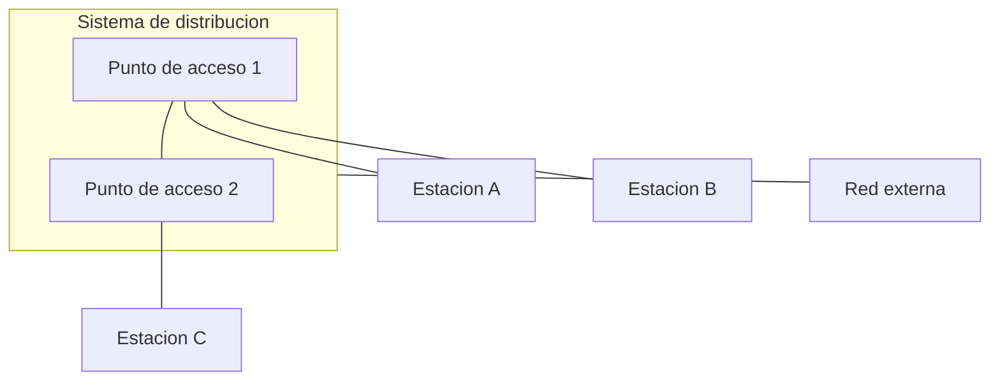
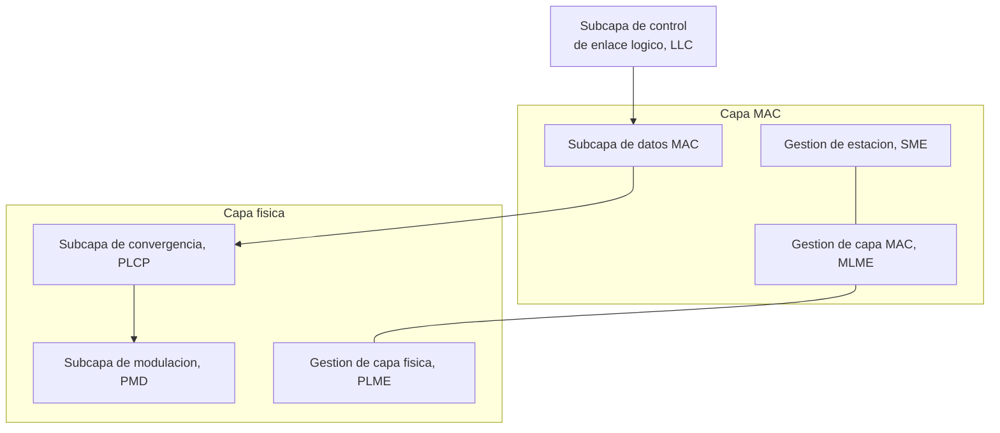

Este capítulo abre el área de redes locales inalámbricas y desarrolla el estándar IEEE
802.11, la tecnología de acceso local que la
[taxonomía de redes inalámbricas](../01_panorama/section_1_taxonomia_y_arquitecturas.md)
sitúa como referencia de la red de área local. Presenta las características del medio
que distinguen a una WLAN de una red cableada, las dos configuraciones en que puede
formarse, la organización interna del estándar en capas y subcapas, el catálogo de capas
físicas que ha empleado a lo largo de sus enmiendas y el protocolo que estructura los
datos antes de entregarlos a la capa de acceso al medio. La capa de acceso al medio
propiamente dicha, su formato de trama y sus mecanismos de calidad de servicio se tratan
en el capítulo siguiente de esta misma área.

## Introducción

Una **red local inalámbrica** (_wireless local area network_, WLAN) proporciona acceso
de banda ancha a una red de datos sin recurrir a un cableado entre el terminal y el
punto de acceso. Diseñada originalmente para entornos de interior, se emplea hoy en
escenarios heterogéneos que incluyen dispositivos de electrónica de consumo, sensores y
equipos industriales. El estándar que domina este ámbito es **IEEE 802.11**, cuya
estandarización corre a cargo del IEEE y, en su vertiente europea de armonización del
espectro, del ETSI.

802.11 se diseñó para emular, de cara a los protocolos de capa superior, un enlace LAN
cableado convencional a través de su subcapa de control de enlace lógico (LLC). Esa
emulación obliga a la capa de acceso al medio del estándar a asumir funciones que un
enlace cableado no necesita, entre ellas la movilidad del terminal, la protección del
enlace radioeléctrico frente a terceros y la calidad de servicio, que se desarrollan con
detalle en el capítulo siguiente.

## Características del medio inalámbrico local

El medio radioeléctrico impone a una WLAN un conjunto de condiciones que un cable no
presenta y que condicionan tanto la arquitectura del estándar como sus capas físicas.

### Interferencia y variabilidad

El medio de transmisión de una WLAN es la radiofrecuencia, y sus características de
propagación varían en el espacio y en el tiempo. La atenuación con la distancia, el
desvanecimiento multitrayecto y la dispersión temporal que sufre cualquier enlace de
radio se desarrollan en detalle en
[propagación y pérdidas](../../01_fundamentos/02_canal/section_1_propagacion_y_perdidas.md)
y en
[desvanecimiento y respuesta del canal](../../01_fundamentos/02_canal/section_2_desvanecimiento_y_respuesta_del_canal.md).
Una WLAN hereda íntegramente esa variabilidad y, además, está expuesta a interferencia
procedente de dispositivos 802.11 ajenos a la propia red y de dispositivos que no siguen
el estándar pero comparten la misma banda.

### Medio compartido y espectro sin licencia

El medio radioeléctrico es, por naturaleza, un **medio compartido**: cualquier
dispositivo dentro del alcance de una transmisión recibe energía de ella, la desee o no.
802.11 opera predominantemente en bandas del espectro **ISM** (Industrial, Científico y
Médico), gestionadas por regulaciones internacionales distintas según la región
geográfica, y no exige licencia individual para su uso. Esa ausencia de licencia reduce
la barrera de entrada para desplegar una red, pero también implica que ningún operador
controla en exclusiva el medio, a diferencia de las bandas licenciadas que emplean las
tecnologías celulares.

### Movilidad y consumo

La movilidad del terminal introduce una fiabilidad de conexión variable, porque las
condiciones de propagación cambian con la posición del equipo, y exige una gestión
eficiente de la energía en dispositivos alimentados por batería para sostener la
conexión sin agotarla. En una configuración sin infraestructura, el alcance de la red se
logra mediante comunicación de salto a salto entre estaciones, en lugar de depender de
un punto de acceso fijo.

## Configuraciones de red

802.11 admite dos configuraciones de formación de red, que la
[taxonomía de redes inalámbricas](../01_panorama/section_1_taxonomia_y_arquitecturas.md)
sitúa como los dos modelos generales de red inalámbrica, con y sin infraestructura.

### Conjunto de servicios básicos

El **conjunto de servicios básicos** (_basic service set_, BSS) es la unidad
arquitectónica fundamental de 802.11: un conjunto de estaciones que se comunican entre
sí bajo un mismo control de acceso al medio. Un BSS puede formarse en modo ad hoc, sin
ningún elemento de infraestructura, o en modo infraestructura, coordinado por un punto
de acceso.

### Modo ad hoc

En una configuración **ad hoc**, un BSS permite la formación de una red mediante
comunicación directa entre estaciones, sin ningún punto de acceso que coordine el
tráfico. El área de cobertura queda limitada al alcance radioeléctrico directo entre las
estaciones que la componen, lo que corresponde al modelo de red sin infraestructura
descrito en
[taxonomía y arquitecturas](../01_panorama/section_1_taxonomia_y_arquitecturas.md#redes-moviles-sin-infraestructura).

### Modo infraestructura y sistema de distribución

En una configuración de **infraestructura**, uno o varios **puntos de acceso** (_access
point_, AP) y las estaciones asociadas a ellos se interconectan mediante un **sistema de
distribución** (_distribution system_, DS) para formar una red unificada. El sistema de
distribución transporta el tráfico entre los distintos puntos de acceso y hacia una red
externa, típicamente cableada, de modo que dos estaciones asociadas a puntos de acceso
distintos pueden comunicarse a través de él sin alcance radioeléctrico directo entre sí.

## Arquitectura del estándar

La arquitectura interna de 802.11 organiza sus funciones en un conjunto de bloques de
gestión y una pila de capas y subcapas que separan la parte común a cualquier tecnología
de acceso al medio de la parte específica de cada variante de capa física.

### Gestión de estación, de capa MAC y de capa física

El estándar define tres bloques de gestión que operan sobre la pila de protocolos. La
**gestión de la estación** (_station management_, SME) coordina las decisiones globales
del terminal, entre ellas la selección de punto de acceso y la política de ahorro de
energía. La **gestión de la capa MAC** (_MAC layer management_, MLME) controla las
funciones de la capa de acceso al medio, como la asociación y la sincronización. La
**gestión de la capa física** (_PHY layer management_, PLME) controla los parámetros de
la capa física, como el canal en uso y la potencia de transmisión. Estos tres bloques se
comunican entre sí mediante primitivas de gestión y son comunes a cualquier variante de
capa física del estándar.

### Subcapas de convergencia y de modulación

La capa física de 802.11 se divide en dos subcapas. El **protocolo de convergencia de la
capa física** (_physical layer convergence protocol_, PLCP) estructura los datos
procedentes de la capa MAC en un formato común, independiente de la tecnología de
modulación concreta, y se desarrolla en detalle más adelante en este capítulo. La
**dependencia del medio físico** (_physical medium dependent_, PMD) contiene la
modulación y la codificación específicas de cada variante de capa física, y es el bloque
que cambia de una enmienda del estándar a otra. Esta separación es la que permite que
enmiendas sucesivas del estándar introduzcan capas físicas radicalmente distintas, de
DSSS a OFDM, sin alterar la interfaz que la capa MAC ve hacia abajo.

## Capas físicas

802.11 ha definido, a lo largo de sus sucesivas enmiendas, varias familias de capa
física que comparten la misma capa MAC. El estándar original de 1997 incluía tres capas
físicas alternativas, DSSS, FHSS e infrarrojo, y las enmiendas posteriores sustituyeron
progresivamente el espectro ensanchado por OFDM como técnica de modulación dominante.

### Espectro ensanchado por secuencia directa

La **secuencia directa de espectro ensanchado** (_direct sequence spread spectrum_,
DSSS) multiplica cada símbolo de información por una secuencia pseudoaleatoria de ritmo
mucho más rápido, lo que ensancha el espectro de la señal transmitida por debajo del
umbral de detección de otros sistemas y aporta resistencia frente a interferencia de
banda estrecha. El fundamento de esta técnica, el factor de ensanchamiento, el
desensanchado en recepción y su empleo en el acceso múltiple se desarrollan con detalle
en
[espectro ensanchado y CDMA](../../01_fundamentos/04_acceso_al_medio/section_3_espectro_ensanchado_y_cdma.md),
y este capítulo no repite esa teoría. La versión original de 802.11 emplea DSSS en la
banda de 2,4 GHz, y la enmienda 802.11b la mantiene como base de sus tasas de datos
superiores mediante una variante de codificación complementaria.

### Espectro ensanchado por salto de frecuencia

El **salto de frecuencia de espectro ensanchado** (_frequency hopping spread spectrum_,
FHSS) reparte la transmisión entre un conjunto de subcanales estrechos, saltando de uno
a otro según una secuencia pseudoaleatoria conocida por transmisor y receptor. A
diferencia de DSSS, que ensancha el espectro de forma continua sobre toda la banda, FHSS
ocupa en cada instante solo un subcanal estrecho y evita la interferencia concentrada en
cualquier otro subcanal simplemente saltando fuera de él. Fue una de las capas físicas
alternativas del estándar original de 1997, y quedó relegada a un papel marginal frente
a DSSS y, después, frente a OFDM.

### Capas físicas basadas en OFDM

La **multiplexación por división ortogonal de frecuencia** es la técnica que domina las
capas físicas de 802.11 desde la enmienda 802.11a en adelante. El fundamento de la
técnica, la condición de ortogonalidad entre portadoras, el papel del prefijo cíclico
frente a los ecos del canal y las fórmulas que relacionan el número de portadoras, la
separación entre ellas y el régimen binario se desarrollan íntegramente en
[OFDM y SC-FDM](../../01_fundamentos/04_acceso_al_medio/section_4_ofdm_y_sc_fdm.md).
Este capítulo se limita a mostrar cómo cada enmienda de 802.11 particulariza esos
parámetros generales, un ejercicio que retoma la sección siguiente.

La constelación empleada sobre cada portadora, desde BPSK hasta 256-QAM según la
enmienda y la relación señal-ruido disponible, sigue las familias de modulación digital
descritas en
[modulaciones digitales](../../01_fundamentos/03_modulacion/section_2_modulaciones_digitales.md),
en particular la QAM y su compromiso entre régimen binario y probabilidad de error.

???+ example "Tasa de datos nominal de 802.11a a partir de sus parámetros OFDM"

    802.11a organiza cada símbolo OFDM en 52 portadoras, de las cuales 48 transportan
    datos y 4 son portadoras piloto de referencia de canal, sobre un canal de 20 MHz. El
    símbolo OFDM dura $4\ \mu\text{s}$ en total, de los cuales $3{,}2\ \mu\text{s}$ son
    la parte útil y $0{,}8\ \mu\text{s}$ el prefijo cíclico, siguiendo la misma
    estructura de intervalo de guarda que
    [OFDM y SC-FDM](../../01_fundamentos/04_acceso_al_medio/section_4_ofdm_y_sc_fdm.md#prefijo-ciclico)
    describe en general.

    La tasa máxima que fija el estándar corresponde a modulación 64-QAM, con
    $\bar{B} = 6$ bits por símbolo de constelación, y a una tasa de codificación de
    canal $R_c = 3/4$, que añade redundancia de corrección de errores y reduce en esa
    misma proporción el número de bits de información por bit transmitido. Cada símbolo
    OFDM transporta entonces:

    $$
    \bar{B}\, N_u\, R_c = 6 \times 48 \times \frac{3}{4} = 216\ \text{bits de
    informacion}
    $$

    Dividiendo por la duración total del símbolo OFDM se obtiene el régimen binario:

    $$
    R_B = \frac{216\ \text{bits}}{4\ \mu\text{s}} = 54\ \text{Mbit/s}
    $$

    El resultado coincide exactamente con la tasa máxima de 54 Mbit/s que el estándar
    atribuye a 802.11a, lo que confirma que esa cifra no es un valor arbitrario sino la
    consecuencia directa de multiplicar el número de portadoras de datos por los bits
    por símbolo de la constelación y por la tasa de codificación, y dividir entre la
    duración del símbolo OFDM con su prefijo cíclico incluido.

### Comunicación por infrarrojos y por luz visible

La capa física de **infrarrojos** (IR) opera en la banda de 850 a 950 nanómetros,
resulta adecuada para entornos de interior y tiene un alcance limitado de unos 10
metros. Fue, junto con DSSS y FHSS, una de las tres capas físicas alternativas del
estándar original de 1997, y quedó en la práctica sin adopción comercial significativa.

La enmienda **802.11bb**, mucho más reciente, retoma la comunicación óptica bajo el
nombre de comunicación por luz visible, y permite la operación en la banda de 800 a 1000
nanómetros con transmisión bidireccional. Su rendimiento varía entre 10 Mbit/s y 9,6
Gbit/s según la fuente de luz de estado sólido empleada, y el estándar persigue la
interoperabilidad entre distintas fuentes de luz de ese tipo.

## Evolución de las enmiendas

Las enmiendas sucesivas de 802.11 amplían el estándar original con nuevas capas físicas
que aumentan la banda de frecuencia disponible, el ancho de canal y el orden de la
constelación empleada, y con ellos la tasa de datos máxima alcanzable.

### Bandas, anchos de canal y modulaciones

La tabla siguiente reúne las enmiendas basadas en OFDM que definen una capa física
completa, con su banda de frecuencia, su ancho de canal máximo, su modulación de mayor
orden y su tasa de datos máxima tal como las fija el estándar.

| Enmienda   | Banda       | Ancho de canal máximo           | Modulación máxima | Tasa máxima |
| ---------- | ----------- | ------------------------------- | ----------------- | ----------- |
| `802.11a`  | 5 GHz       | 20 MHz                          | 64-QAM            | 54 Mbit/s   |
| `802.11g`  | 2,4 GHz     | 20 MHz                          | 64-QAM            | 54 Mbit/s   |
| `802.11n`  | 2,4 o 5 GHz | 40 MHz                          | 64-QAM            | 600 Mbit/s  |
| `802.11ac` | 5 GHz       | 160 MHz                         | 256-QAM           | 6,9 Gbit/s  |
| `802.11ad` | 60 GHz      | no aplica (canalización propia) | no aplica         | 7 Gbit/s    |
| `802.11ax` | 2,4 y 5 GHz | 160 MHz                         | 1024-QAM          | 9,6 Gbit/s  |

802.11a, introducida en 1999, ofrece tasas de hasta 54 Mbit/s en la banda de 5 GHz y
comparte parámetros de capa física con el estándar HiperLAN2 europeo; admite reducir la
tasa de datos para ampliar la cobertura, un compromiso propio de cualquier enlace de
radio entre régimen binario y alcance. 802.11g, introducida en 2003, traslada el mismo
esquema OFDM a la banda de 2,4 GHz y mantiene compatibilidad hacia atrás con 802.11b.

802.11n, introducida en 2009, alcanza una tasa máxima de 600 Mbit/s combinando **MIMO**
de hasta 4 flujos espaciales, un ancho de canal de 40 MHz y modulación 64-QAM. Esa cifra
se deriva de la misma fórmula que el ejemplo anterior aplica a 802.11a, multiplicada por
el número de flujos espaciales y con un intervalo de guarda corto de 400 ns en lugar de
800 ns, lo que reduce la duración total del símbolo OFDM a 3,6 microsegundos, tal como
detalla el ejemplo siguiente.

???+ example "Verificación de la tasa máxima de 802.11n"

    Con 40 MHz de ancho de canal, 802.11n dispone de 108 subportadoras de datos, y su
    modulación de mayor orden es 64-QAM con $\bar{B} = 6$ bits por símbolo, sobre una
    tasa de codificación $R_c = 5/6$. Con el intervalo de guarda corto de 400 ns, el
    símbolo OFDM completo dura $3{,}2 + 0{,}4 = 3{,}6\ \mu\text{s}$. Cada flujo espacial
    transporta entonces:

    $$
    \bar{B}\, N_u\, R_c = 6 \times 108 \times \frac{5}{6} = 540\ \text{bits por
    simbolo OFDM}
    $$

    Con los 4 flujos espaciales que MIMO permite multiplexar de forma simultánea sobre
    el mismo canal, el régimen binario resulta:

    $$
    R_B = \frac{540 \times 4\ \text{bits}}{3{,}6\ \mu\text{s}} = 600\ \text{Mbit/s}
    $$

    El resultado reproduce con exactitud la cifra de 600 Mbit/s que el estándar atribuye
    a la configuración de mayor prestación de 802.11n, y muestra que la ganancia frente
    a 802.11a no procede de una técnica de modulación distinta, sino de la combinación
    de un canal más ancho, un intervalo de guarda más corto y la multiplicación por el
    número de flujos espaciales que aporta MIMO.

802.11ac, introducida en 2013, alcanza una tasa máxima de aproximadamente 6,9 Gbit/s en
la banda de 5 GHz, combinando anchos de canal de hasta 160 MHz, modulación 256-QAM y
MIMO de hasta 8 flujos espaciales, con soporte de **MU-MIMO** para atender a varios
terminales de forma simultánea sobre el mismo canal.

802.11ax, introducida en 2019 bajo el nombre comercial Wi-Fi 6, alcanza una tasa máxima
de aproximadamente 9,6 Gbit/s en las bandas de 2,4 y 5 GHz, combinando MIMO, MU-MIMO,
anchos de canal de hasta 160 MHz y modulación 1024-QAM, junto con técnicas de
reutilización espacial mejoradas como la coloración de BSS y mecanismos de menor consumo
energético. La banda de 6 GHz amplía esta misma generación bajo la denominación
comercial Wi-Fi 6E.

???+ example "Verificación de la tasa máxima de 802.11ax"

    Con 160 MHz de ancho de canal, 802.11ax dispone de 1960 subportadoras de datos, y su
    modulación de mayor orden es 1024-QAM con $\bar{B} = 10$ bits por símbolo, sobre una
    tasa de codificación $R_c = 5/6$. El símbolo HE dura $12{,}8\ \mu\text{s}$ de parte
    útil más $0{,}8\ \mu\text{s}$ de intervalo de guarda corto, es decir
    $13{,}6\ \mu\text{s}$ en total. Cada flujo espacial transporta entonces:

    $$
    \bar{B}\, N_u\, R_c = 10 \times 1960 \times \frac{5}{6} \approx 16\,333{,}3\
    \text{bits por simbolo HE}
    $$

    Dividiendo por la duración del símbolo se obtiene la tasa por flujo espacial:

    $$
    \frac{16\,333{,}3\ \text{bits}}{13{,}6\ \mu\text{s}} \approx 1{,}20\ \text{Gbit/s}
    $$

    Con los 8 flujos espaciales que MIMO permite multiplexar de forma simultánea, la
    tasa total resulta $1{,}20 \times 8 \approx 9{,}61\ \text{Gbit/s}$, que redondeada
    coincide con los 9,6 Gbit/s citados arriba y con la cifra que fija de forma
    consistente la documentación del estándar y de la industria para Wi-Fi 6.

802.11ad, ratificada en 2012 y popularizada comercialmente más tarde bajo el nombre
WiGig, opera en la banda de 60 GHz sin licencia y alcanza una tasa máxima de 7 Gbit/s, a
costa de un alcance reducido de 1 a 10 metros propio de un entorno de interior,
consecuencia directa de la atenuación mucho más severa que sufre la propagación a esa
frecuencia.

### Generaciones comerciales de Wi-Fi

La denominación comercial **Wi-Fi** con un número de generación, adoptada por la
industria a partir de 802.11n, simplifica ante el usuario final la correspondencia entre
enmiendas técnicas y prestaciones. Wi-Fi 4 corresponde a 802.11n, Wi-Fi 5 a 802.11ac, y
Wi-Fi 6 y Wi-Fi 6E a 802.11ax en sus bandas de 2,4/5 GHz y de 6 GHz respectivamente. Las
enmiendas anteriores a 802.11n, entre ellas 802.11a, 802.11b y 802.11g, no recibieron
esta numeración comercial y se identifican únicamente por su designación técnica.

### Enmiendas para entornos vehiculares y de largo alcance

Un segundo grupo de enmiendas adapta la capa física de OFDM a entornos que la familia
principal no cubre bien, ya sea por la movilidad extrema o por la necesidad de un
alcance mucho mayor a costa de la tasa de datos.

802.11p, ratificada en 2010, opera en la banda con licencia de 5,9 GHz destinada a
sistemas de comunicación de corto alcance dedicado (DSRC) para redes vehiculares de área
ad hoc (VANET), mencionadas en
[taxonomía y arquitecturas](../01_panorama/section_1_taxonomia_y_arquitecturas.md#comunicacion-entre-vehiculos).
Modifica tanto la capa MAC como la capa física de 802.11a, pero reduce el ancho de canal
a 10 MHz, la mitad del de su enmienda base, para hacer frente a la mayor dispersión
Doppler que introduce la movilidad vehicular sobre el canal de radio.

802.11ah, introducida en 2017 bajo el nombre comercial Wi-Fi HaLow, opera en una banda
sin licencia por debajo de 1 GHz, en torno a 900 MHz según la región, y soporta tasas de
datos desde 150 kbit/s hasta 86,7 Mbit/s, con un alcance de hasta 1 kilómetro. Esa
combinación de bajo consumo, largo alcance y tasa reducida sitúa a esta enmienda en un
compromiso similar al de las tecnologías de área amplia y bajo consumo descritas en
[taxonomía y arquitecturas](../01_panorama/section_1_taxonomia_y_arquitecturas.md), sin
llegar a compartir con ellas la misma capa MAC.

802.11af opera en la banda con licencia de espacios blancos de televisión, entre 54 y
790 MHz según la región, con una tasa de datos máxima de 568,9 Mbit/s y un alcance del
orden de kilómetros. A diferencia de 802.11ah, esta enmienda opera en espectro con
licencia, aprovechando los huecos de canal de televisión no utilizados en una zona
geográfica concreta.

???+ example "Canales no solapados en la banda de 2,4 GHz para un despliegue denso"

    La banda ISM de 2,4 GHz que emplean 802.11b, 802.11g y 802.11n define catorce
    canales separados 5 MHz entre sí, del canal 1, centrado en 2412 MHz, al canal 14. El
    ancho de canal ocupado por DSSS y por las capas físicas basadas en OFDM de esta
    banda es de 22 MHz, sensiblemente mayor que la separación de 5 MHz entre canales
    contiguos.

    Dos canales solo dejan de solaparse cuando la distancia entre sus centros supera su
    ancho de canal. Con 22 MHz de ancho y 5 MHz de separación entre canales
    consecutivos, hacen falta al menos $22 / 5 \approx 4{,}4$ pasos de canal, es decir 5
    canales de distancia, para que dos canales no se solapen en absoluto. En la región
    donde están disponibles los canales 1 a 11, esa condición selecciona exactamente
    los canales 1, 6 y 11, centrados en 2412, 2437 y 2462 MHz, con 25 MHz entre centros
    consecutivos.

    La consecuencia práctica es que, en la banda de 2,4 GHz, un despliegue denso de
    puntos de acceso solo dispone de **tres** canales que no interfieren entre sí, frente
    a los catorce canales nominales de la banda. Un edificio con muchos puntos de acceso
    próximos entre sí debe repartirlos entre esos tres canales y aceptar que puntos de
    acceso vecinos en el mismo canal compartan el medio, o bien migrar el despliegue a la
    banda de 5 GHz, donde el número de canales no solapados de 20 MHz es sustancialmente
    mayor precisamente porque la banda disponible es más ancha.

## Protocolo de convergencia de la capa física

El **protocolo de convergencia de la capa física** (_physical layer convergence
protocol_, PLCP) es la subcapa que adapta las unidades de datos de la capa MAC a un
formato común, independiente de la capa PMD concreta que module y transmita la señal.

### Unidad de datos física

El PLCP estructura los datos en una **unidad de datos del protocolo físico** (_physical
layer convergence protocol data unit_, PPDU). Un PPDU incluye el preámbulo, la cabecera,
la **unidad de datos del servicio físico** (_physical layer service data unit_, PSDU),
que transporta la trama MAC recibida desde la capa superior, y bits de cola y de relleno
que ajustan la longitud del PPDU a un múltiplo entero de símbolos de la capa física
subyacente.

### Preámbulo y cabecera

El **preámbulo** es una secuencia conocida por el receptor que se emplea para ajustar la
ganancia del receptor, detectar la presencia de energía en el canal, seleccionar la
antena en un receptor con diversidad, y sincronizar la frecuencia y el instante de
muestreo antes de que comience la parte útil de la transmisión. La **cabecera** contiene
la tasa de bits (_RATE_) a la que se transmitirá la PSDU y la longitud en bytes de la
PSDU, información que el receptor necesita para decodificar correctamente el resto del
PPDU. La cabecera incluye además bits de paridad para detectar errores en sus propios
campos y campos de servicio adicionales, de modo que un error en la cabecera pueda
detectarse antes de intentar decodificar una PSDU cuya tasa o longitud reales se
desconocen.

La capa de acceso al medio que recibe la PSDU entregada por el PLCP, el formato de la
trama que contiene y las funciones de coordinación que determinan cuándo una estación
puede transmitir se desarrollan en el siguiente capítulo de esta área. </content>
</file>
