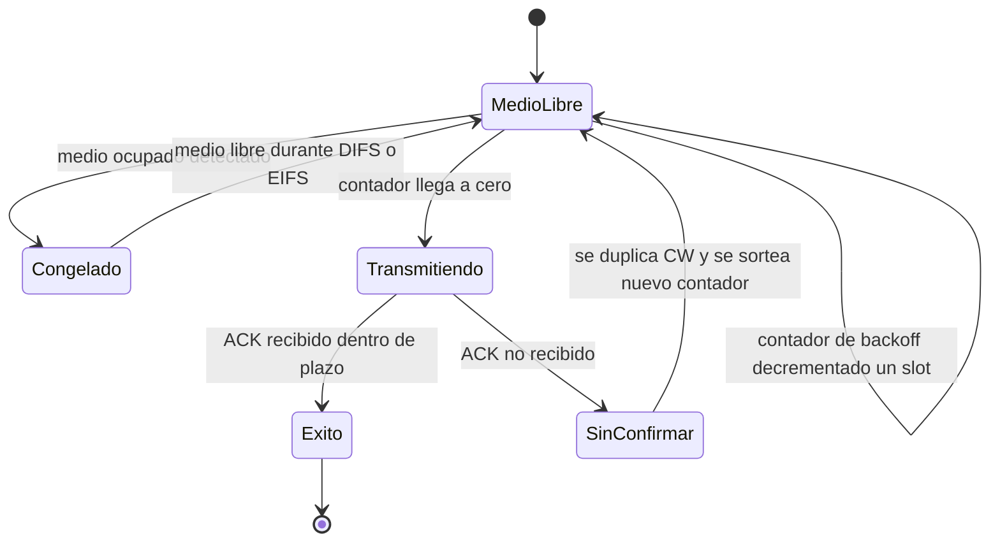
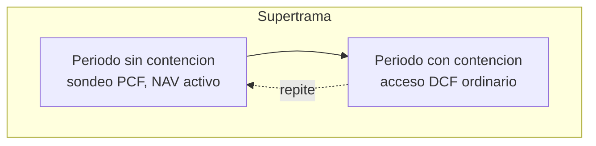
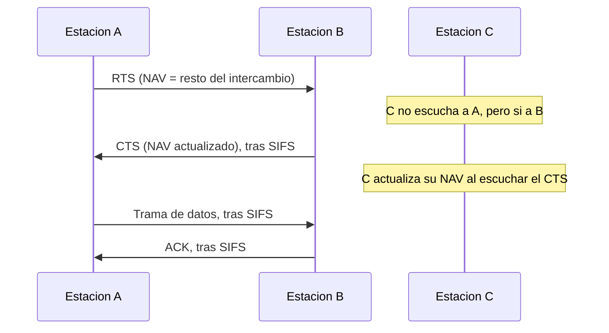

Sobre la arquitectura y la capa física ya descritas en
[arquitectura y capa física de IEEE 802.11](./section_1_802_11_arquitectura_y_capa_fisica.md)
se levanta una capa de acceso al medio que decide, instante a instante, qué estación
tiene derecho a ocupar el canal compartido, qué forma toma la información que
intercambia con sus vecinas y qué mecanismos adicionales permiten diferenciar el tráfico
sensible al retardo del tráfico de mejor esfuerzo. Este capítulo recorre esa capa MAC de
principio a fin: las funciones de coordinación que arbitran el acceso, el formato de
trama que transporta los datos y el control, el problema de la estación oculta y su
solución mediante un intercambio de reserva, el conjunto de mecanismos de calidad de
servicio que introdujo la enmienda 802.11e, los mecanismos que mejoran la eficiencia del
canal más allá de la contienda básica, la gestión del consumo de energía y, por último,
el proceso completo por el que una estación descubre, autentica y asocia con un punto de
acceso.

## Introducción

La capa de acceso al medio de IEEE 802.11 se diseñó para emular, de cara a las capas
superiores, el comportamiento de una red local cableada, pero debe asumir funciones que
una capa MAC cableada no necesita: gestionar la movilidad de la estación y ofrecer,
opcionalmente, garantías de calidad de servicio sobre un medio que ninguna estación
controla en exclusiva. El reparto del medio entre las estaciones de una misma célula, es
decir, quién puede transmitir y en qué instante, es la función de coordinación, y es el
punto de partida de todo lo que sigue en este capítulo.

## Funciones de coordinación

Una **función de coordinación** determina, en cada instante, si una estación tiene
derecho a transmitir sobre el medio compartido. El estándar define dos funciones de
coordinación con un alcance muy distinto: una obligatoria y de contienda, y otra
opcional y de sondeo centralizado.

### Función de coordinación distribuida

La **función de coordinación distribuida** (`DCF`) es obligatoria en toda estación
802.11 y ofrece un servicio de mejor esfuerzo sin diferenciación de prioridad entre
estaciones. `DCF` implementa el acceso múltiple con detección de portadora y evitación
de colisiones, `CSMA/CA`, cuyos fundamentos teóricos, incluida la detección de
portadora, el mecanismo de espera aleatoria y su refinamiento como _backoff_ exponencial
binario, ya se desarrollan en detalle en el capítulo dedicado a
[acceso múltiple al medio](../../01_fundamentos/04_acceso_al_medio/section_2_acceso_multiple.md).
Este capítulo no repite esa teoría general, sino que describe cómo `DCF` la
particulariza mediante los espacios entre tramas y los parámetros de contienda propios
del estándar 802.11.

Antes de transmitir, una estación que opera bajo `DCF` debe encontrar el medio libre
durante un intervalo llamado **espacio entre tramas distribuido** (`DIFS`), el más largo
de los espacios ordinarios de esta capa. `DIFS` se compone del espacio entre tramas
corto, `SIFS`, más dos _slots_ de tiempo:

$$
\text{DIFS} = \text{SIFS} + 2 \cdot \text{aSlotTime}
$$

Sobre una capa física OFDM de referencia como la de 802.11a, con `aSlotTime = 9` µs y
`aSIFSTime = 16` µs, `DIFS` resulta $16 + 2 \cdot 9 = 34$ µs. Si, transcurrido `DIFS`,
el medio sigue libre, la estación transmite de inmediato; si el medio está ocupado, o si
ya existe una transmisión pendiente, la estación entra en el procedimiento de _backoff_
descrito en el capítulo de acceso múltiple, sorteando un número entero de _slots_ dentro
de una **ventana de contienda** cuyo tamaño mínimo, `aCWmin`, y máximo, `aCWmax`, fija
la propia capa física. El valor de referencia para 802.11a es `aCWmin = 15` y
`aCWmax = 1023`.

La particularidad que introduce `DCF` frente al modelo genérico de _backoff_ es que el
contador de _slots_ **se congela** mientras el medio está ocupado, en lugar de seguir
descontando o de reiniciarse. La estación solo reanuda la cuenta cuando el medio vuelve
a estar libre durante un `DIFS` completo, lo que evita que dos estaciones que llevan
esperando tiempos distintos converjan de nuevo sobre el mismo instante de transmisión en
cuanto el medio se libera.

Cuando una trama se recibe con errores detectados por la comprobación de la trama, la
estación receptora no puede emitir la confirmación esperada, y la estación que escuchó
esa transmisión defectuosa sin poder decodificarla debe esperar un espacio más largo, el
**espacio entre tramas extendido** (`EIFS`), antes de intentar acceder de nuevo al
medio. `EIFS` da tiempo a que el emisor original de la trama dañada reciba, si
corresponde, la confirmación que esperaba, evitando que un tercero ocupe el medio en ese
margen.

???+ example "Throughput util de una transmision tras restar espacios y cabeceras"

    Una estacion transmite un `MSDU` de $1500$ bytes sobre una capa fisica OFDM de
    referencia con tasa nominal $R = 54$ Mbps, `aSlotTime = 9` µs, `aSIFSTime = 16` µs y
    un _overhead_ fijo de preambulo y senalizacion de $20$ µs por cada unidad de datos
    fisica transmitida. Se pide el _throughput_ util que obtiene esa estacion mediante
    acceso basico de `DCF`, sin `RTS`/`CTS`, suponiendo un unico intento de acceso con
    la espera aleatoria media de la ventana de contienda inicial.

    La unidad de datos `MAC` completa suma la cabecera de $24$ bytes, sin campo de
    control de `QoS` ni de control `HT`, mas la secuencia de comprobacion de $4$ bytes,
    de modo que la `MPDU` total ocupa $1500 + 24 + 4 = 1528$ bytes, es decir,
    $12\,224$ bits. El tiempo que ocupa esa `MPDU` a la tasa nominal es
    $12\,224 / 54 \times 10^{6} \approx 226{,}37$ µs, al que se suma el _overhead_ fijo
    de $20$ µs, resultando una unidad de datos fisica de datos de
    $\text{PPDU}_{\text{datos}} \approx 246{,}37$ µs.

    La confirmacion `ACK`, de $14$ bytes, $112$ bits, ocupa a la misma tasa
    $112/54\times 10^{6} \approx 2{,}07$ µs de transmision mas el mismo _overhead_ fijo,
    resultando $\text{PPDU}_{\text{ACK}} \approx 22{,}07$ µs. Con
    $\text{DIFS} = 34$ µs y una espera aleatoria media de `CWmin`$/2 = 7{,}5$ _slots_,
    es decir $67{,}5$ µs, el tiempo total del intercambio completo es

    $$
    T = \text{DIFS} + \overline{\text{backoff}} + \text{PPDU}_{\text{datos}} +
    \text{SIFS} + \text{PPDU}_{\text{ACK}}
    $$

    que sustituyendo resulta $34 + 67{,}5 + 246{,}37 + 16 + 22{,}07 \approx 385{,}9$ µs.
    El _throughput_ util es el cociente entre los $12\,000$ bits de carga de usuario del
    `MSDU` original y ese tiempo total,

    $$
    S = \frac{12\,000\ \text{bits}}{385{,}9\ \text{µs}} \approx 31{,}1\ \text{Mbps}
    $$

    apenas el $57{,}6\,\%$ de la tasa nominal de $54$ Mbps. El resto de la capacidad
    nominal se consume en el espacio `DIFS`, la espera aleatoria, el _overhead_ fijo de
    preambulo de ambas unidades de datos fisicas, la cabecera y la comprobacion de
    errores de la `MPDU`, y la propia confirmacion `ACK`, ninguno de los cuales
    transporta carga util del usuario.

### Función de coordinación puntual

La **función de coordinación puntual** (`PCF`) es opcional y solo está disponible en
redes con infraestructura, porque exige un punto de acceso que actúe como coordinador
centralizado. Bajo `PCF`, el punto de acceso sondea a las estaciones asociadas y les
concede el turno de transmisión de forma ordenada, sin que ninguna estación deba
competir por el medio. El acceso con `PCF` se activa mediante un espacio entre tramas
más corto que `DIFS`, el **espacio entre tramas de prioridad** (`PIFS`), definido como

$$
\text{PIFS} = \text{SIFS} + \text{aSlotTime}
$$

que sobre la misma referencia de 802.11a resulta $16 + 9 = 25$ µs. Al ser más corto que
`DIFS`, `PIFS` permite que el punto de acceso capture el medio con prioridad sobre
cualquier estación que esté aplicando `DCF`, garantizando que el sondeo de `PCF` siempre
gana la contención frente al acceso ordinario.

### Supertrama y vector de asignación de red

`DCF` y `PCF` no operan de forma excluyente, sino que se alternan dentro de una
estructura periódica llamada **supertrama**. Cada supertrama se divide en un **periodo
sin contención**, durante el cual el punto de acceso sondea a las estaciones mediante
`PCF`, y un **periodo con contención**, durante el cual las estaciones acceden mediante
`DCF` ordinario. Al comienzo del periodo sin contención, el punto de acceso anuncia su
duración mediante el **vector de asignación de red** (`NAV`), un contador que todas las
estaciones cargan y decrementan de forma local, y que les impide intentar transmitir por
`DCF` mientras permanece por encima de cero, con independencia de si detectan el medio
libre en ese intervalo. El `NAV` es, en este sentido, un mecanismo de reserva virtual
del canal que complementa a la detección física de portadora, y reaparece más adelante
en este capítulo como la pieza central que resuelve el problema de la estación oculta.

## Servicio que ofrece la capa MAC

La capa MAC de 802.11 presta a las entidades pares de la capa de control de enlace
lógico un servicio de intercambio de unidades de datos de servicio MAC (`MSDU`). Ese
servicio es, por defecto, sin conexión y de mejor esfuerzo, sin garantía de entrega ni
de retardo acotado. Sobre esa base, la capa MAC añade un conjunto de facilidades
adicionales que no forman parte del servicio de datos en sí, pero que resultan
necesarias para operar sobre un medio inalámbrico compartido: facilidades de calidad de
servicio opcionales para diferenciar tráfico, gestión de la movilidad mediante los
procesos de asociación, reasociación y desasociación descritos al final de este
capítulo, y gestión del consumo de energía de las estaciones alimentadas por batería. La
propia capa MAC incorpora, además, los mecanismos de eficiencia del canal y de
sincronización que se describen en las secciones siguientes de este capítulo.

## Formato de trama

Toda trama 802.11 comparte una estructura común de campos, aunque no todos están
presentes en todas las tramas: una trama de control, como una confirmación o una
solicitud de envío, prescinde de varios campos que sí aparecen en una trama de datos.

| Campo                     | Longitud                 | Contenido                                                        |
| ------------------------- | ------------------------ | ---------------------------------------------------------------- |
| Control de trama          | 2 bytes                  | Versión, tipo, subtipo e indicadores de la trama.                |
| Duración/ID               | 2 bytes                  | Valor de `NAV` a reservar, o identificador en tramas de control. |
| Direcciones 1 a 4         | hasta $4 \times 6$ bytes | Emisor, receptor, origen y destino según el modo de reenvío.     |
| Control de secuencia      | 2 bytes                  | Número de secuencia y de fragmento de la `MSDU`.                 |
| Control de `QoS`          | 2 bytes, opcional        | Categoría de acceso y otros indicadores de calidad de servicio.  |
| Cuerpo de la trama        | variable                 | La `MSDU`, o un fragmento de ella, cuando la trama es de datos.  |
| Secuencia de comprobación | 4 bytes                  | Código de redundancia cíclica para la detección de errores.      |

### Campo de control de trama

El **campo de control de trama** ocupa los primeros 16 bits de toda trama 802.11 y fija
su naturaleza y su comportamiento.

| Subcampo                                     | Longitud | Función                                                                     |
| -------------------------------------------- | -------- | --------------------------------------------------------------------------- |
| Versión de protocolo                         | 2 bits   | Fijo en la versión vigente del estándar.                                    |
| Tipo                                         | 2 bits   | Distingue trama de gestión, de control o de datos.                          |
| Subtipo                                      | 4 bits   | Identifica la trama concreta dentro de su tipo.                             |
| Hacia el sistema de distribución (`To DS`)   | 1 bit    | Indica si la trama va dirigida al sistema de distribución.                  |
| Desde el sistema de distribución (`From DS`) | 1 bit    | Indica si la trama procede del sistema de distribución.                     |
| Más fragmentos                               | 1 bit    | Señala que siguen más fragmentos de la misma `MSDU`.                        |
| Reintento                                    | 1 bit    | Marca una retransmisión de una trama ya enviada.                            |
| Gestión de energía                           | 1 bit    | Anuncia el estado de ahorro de energía que adoptará el emisor.              |
| Más datos                                    | 1 bit    | Indica que el emisor tiene tramas adicionales almacenadas para el receptor. |
| Trama protegida                              | 1 bit    | Indica que el cuerpo de la trama está cifrado.                              |
| Orden                                        | 1 bit    | Exige entrega en orden estricto, o transporta el campo de control HT.       |

Los indicadores `To DS` y `From DS` combinados determinan cuántas direcciones lleva la
trama y qué significa cada una: una trama entre dos estaciones de una red ad hoc no
activa ninguno de los dos bits, mientras que una trama que atraviesa un sistema de
distribución de un punto de acceso a otro los activa ambos y necesita las cuatro
direcciones posibles.

### Campos de dirección y de secuencia

Una trama de datos porta hasta cuatro campos de dirección, aunque solo la combinación de
tráfico entre dos puntos de acceso a través de un enlace inalámbrico entre ellos, `WDS`,
exige las cuatro simultáneamente.

| Campo               | Longitud | Contenido según el modo de reenvío                                               |
| ------------------- | -------- | -------------------------------------------------------------------------------- |
| Dirección 1         | 48 bits  | Receptor inmediato de la trama sobre el medio radio.                             |
| Dirección 2         | 48 bits  | Emisor inmediato de la trama sobre el medio radio.                               |
| Dirección 3         | 48 bits  | Dirección de origen, de destino final o `BSSID`, según `To DS` y `From DS`.      |
| Dirección 4         | 48 bits  | Solo presente en tráfico `WDS` entre dos puntos de acceso.                       |
| Número de fragmento | 4 bits   | Orden del fragmento dentro de una `MSDU` fragmentada.                            |
| Número de secuencia | 12 bits  | Identifica la `MSDU` o la unidad de gestión de origen, para detectar duplicados. |

El campo de control de secuencia cumple una función que enlaza con la fiabilidad del
servicio descrita más arriba: como el acceso al medio puede retrasar una retransmisión
lo suficiente para que llegue después de otras tramas más recientes, el número de
secuencia permite al receptor descartar duplicados sin depender del orden de llegada.

## Problema de la estación oculta

El **problema de la estación oculta** aparece cuando dos estaciones de la misma célula
no pueden escucharse directamente entre sí, aunque ambas alcancen a un tercer nodo
común, típicamente el punto de acceso. En esa situación, cada una detecta el medio libre
antes de transmitir, porque ninguna percibe la señal de la otra, y ambas pueden iniciar
una transmisión simultánea que colisiona en el receptor común sin que ninguna de las dos
emisoras llegue a advertirlo por detección de portadora.

### Intercambio de solicitud y autorización de envío

La solución que adopta 802.11 es un intercambio de reserva previo a la transmisión de
datos, mediante dos tramas de control cortas: **solicitud de envío** (`RTS`) y
**autorización de envío** (`CTS`). Una estación que desea transmitir envía primero una
trama `RTS` dirigida a su receptor, indicando en su campo de duración el tiempo total
que necesita ocupar el medio para completar el intercambio completo. El receptor
responde con una trama `CTS`, tras esperar `SIFS`, confirmando la reserva con una
duración actualizada que cubre lo que queda del intercambio. Toda estación que escuche
cualquiera de las dos tramas, ya sea el `RTS` del emisor o el `CTS` del receptor,
actualiza su `NAV` local y se abstiene de transmitir durante ese intervalo, con
independencia de que perciba o no la transmisión de datos que sigue. De esta forma, una
estación oculta para el emisor pero visible para el receptor, o viceversa, queda
igualmente advertida a través de cualquiera de las dos tramas que sí alcanza a escuchar.

???+ example "Duracion reservada por el intercambio RTS/CTS de una transmision"

    Dos estaciones completan un intercambio con solicitud y autorizacion de envio sobre
    una capa fisica OFDM con `aSlotTime = 9` µs y `aSIFSTime = 16` µs. La trama de datos
    ocupa una PPDU de $246{,}37$ µs, calculada mas adelante en este mismo capitulo, y la
    confirmacion `ACK` ocupa una PPDU de $22{,}07$ µs. Las tramas `RTS` y `CTS` son
    tramas de control cortas: el `RTS` porta dos direcciones de 48 bits mas control de
    trama y duracion, 20 bytes en total, y el `CTS` porta una sola direccion, 14 bytes,
    igual que el `ACK`. A la misma tasa de $54$ Mbps y con el mismo _overhead_ fijo de
    preambulo y senalizacion de $20$ µs por PPDU, la PPDU del `RTS` ocupa
    $20 + 160/54 \times 10^{6} \approx 22{,}96$ µs y la del `CTS` ocupa
    $22{,}07$ µs, igual que el `ACK`.

    El campo de duracion del `RTS` debe cubrir el resto del intercambio a partir de si
    mismo: un `SIFS`, la PPDU del `CTS`, otro `SIFS`, la PPDU de datos, otro `SIFS` y la
    PPDU del `ACK`,

    $$
    D_{\text{RTS}} = \text{SIFS} + \text{PPDU}_{\text{CTS}} + \text{SIFS} +
    \text{PPDU}_{\text{datos}} + \text{SIFS} + \text{PPDU}_{\text{ACK}}
    $$

    que sustituyendo resulta $16 + 22{,}07 + 16 + 246{,}37 + 16 + 22{,}07 \approx
    338{,}5$ µs. El `CTS`, emitido despues del `RTS`, ya no necesita cubrir su propia
    duracion ni la del `SIFS` que le precede, de modo que su campo de duracion es mas
    corto,

    $$
    D_{\text{CTS}} = \text{SIFS} + \text{PPDU}_{\text{datos}} + \text{SIFS} +
    \text{PPDU}_{\text{ACK}} \approx 16 + 246{,}37 + 16 + 22{,}07 \approx
    300{,}4\ \text{µs}
    $$

    Una estacion que solo escucha el `CTS`, por ser oculta para el emisor original,
    carga su `NAV` con este segundo valor, mas corto pero suficiente para cubrir todo lo
    que resta del intercambio desde el instante en que lo recibe.

## Calidad de servicio

`DCF` no distingue entre tipos de tráfico: todas las estaciones compiten por el medio en
igualdad de condiciones, lo que basta para un servicio de mejor esfuerzo pero resulta
insuficiente para tráfico sensible al retardo, como la voz o el vídeo en tiempo real. La
enmienda 802.11e introdujo un conjunto de mecanismos de calidad de servicio que
diferencian el acceso al medio según cuatro categorías de tráfico, sin abandonar el
esquema de contienda de `DCF`.

### Acceso distribuido mejorado

El **acceso distribuido mejorado** (`EDCA`) generaliza `DCF` sustituyendo un único
conjunto de parámetros de contienda por cuatro conjuntos distintos, uno por cada
**categoría de acceso** (`AC`): tráfico en segundo plano (`AC_BK`), tráfico de mejor
esfuerzo (`AC_BE`), vídeo (`AC_VI`) y voz (`AC_VO`). Cada categoría de acceso se
comporta, en la práctica, como una instancia independiente de `DCF` dentro de la misma
estación, con su propio contador de _backoff_ y su propia cola, de modo que una estación
con tráfico de voz y de mejor esfuerzo simultáneo ejecuta dos procesos de acceso al
medio en paralelo, uno por categoría, y resuelve cualquier colisión interna entre sus
propias categorías concediendo la transmisión a la de mayor prioridad.

`EDCA` sustituye `DIFS` por un espacio entre tramas específico de cada categoría, el
**espacio entre tramas de acceso** (`AIFS`), definido de forma análoga a `DIFS` pero con
un número de _slots_ propio de cada categoría, `AIFSN`:

$$
\text{AIFS}\lbrack \text{AC} \rbrack = \text{AIFSN}\lbrack \text{AC} \rbrack \cdot
\text{aSlotTime} + \text{aSIFSTime}
$$

donde $\text{AIFSN}\lbrack \text{AC} \rbrack$ es el número entero de _slots_ asignado a
la categoría y las magnitudes `aSlotTime` y `aSIFSTime` son las mismas que fija la capa
física para `DCF`. Cuanto menor es `AIFSN`, antes puede transmitir esa categoría frente
a una categoría con `AIFSN` mayor, en igualdad del resto de condiciones.

### Categorías de acceso y espaciados

El conjunto de parámetros por defecto que fija el estándar para una capa física OFDM,
sin dispositivos ocultos por posibles ajustes de fabricante, es el siguiente.

| Categoría de acceso      | `AIFSN` | `CWmin` | `CWmax` | `TXOP` límite |
| ------------------------ | ------- | ------- | ------- | ------------- |
| `AC_BK` (segundo plano)  | 7       | 15      | 1023    | 0             |
| `AC_BE` (mejor esfuerzo) | 3       | 15      | 1023    | 0             |
| `AC_VI` (vídeo)          | 2       | 7       | 15      | $3{,}008$ ms  |
| `AC_VO` (voz)            | 2       | 3       | 7       | $1{,}504$ ms  |

Las categorías más prioritarias combinan un `AIFSN` menor, que adelanta el instante en
que pueden empezar a transmitir, con una ventana de contienda más estrecha, que reduce
el tiempo medio de espera aleatoria una vez alcanzado ese instante. Ambos efectos se
suman en la misma dirección, de modo que la diferenciación de prioridad no depende de un
único parámetro sino de la combinación de los dos.

???+ example "Ventaja media de acceso entre voz y trafico en segundo plano"

    Sobre la misma referencia de capa fisica OFDM con `aSlotTime = 9` µs y
    `aSIFSTime = 16` µs, se comparan los tiempos medios que tardan en poder transmitir
    una estacion con trafico de voz, `AC_VO`, y una estacion con trafico en segundo
    plano, `AC_BK`, suponiendo que ambas encuentran el medio libre de forma continua
    desde el instante en que tienen una trama pendiente.

    El `AIFS` de cada categoria es
    $\text{AIFS}\lbrack \text{AC\_VO} \rbrack = 2 \cdot 9 + 16 = 34$ µs, coincidiendo
    con el `DIFS` ordinario, y
    $\text{AIFS}\lbrack \text{AC\_BK} \rbrack = 7 \cdot 9 + 16 = 79$ µs. El numero medio
    de _slots_ de espera aleatoria, para una ventana de contienda inicial uniforme entre
    $0$ y `CWmin`, es `CWmin`$/2$: $1{,}5$ _slots_ para `AC_VO`, es decir $13{,}5$ µs, y
    $7{,}5$ _slots_ para `AC_BK`, es decir $67{,}5$ µs.

    El tiempo medio total hasta que el contador de cada categoria llega a cero es, por
    tanto, $34 + 13{,}5 = 47{,}5$ µs para `AC_VO` y $79 + 67{,}5 = 146{,}5$ µs para
    `AC_BK`, una diferencia de $99$ µs a favor de la voz en cada intento de acceso. Esa
    ventaja se repite en cada ciclo de contienda mientras ambas categorias compiten
    sobre el mismo canal congestionado, lo que explica por que un flujo de voz mantiene
    un retardo de acceso acotado incluso cuando el trafico en segundo plano satura el
    resto de la capacidad disponible.

### Oportunidad de transmisión

Una **oportunidad de transmisión** (`TXOP`) es el intervalo de tiempo durante el cual
una estación que ha ganado el acceso al medio puede transmitir, de forma consecutiva y
sin volver a competir, una o varias tramas de la misma categoría de acceso. El límite de
`TXOP` de cada categoría, recogido en la tabla anterior, acota ese intervalo: las
categorías `AC_BK` y `AC_BE` tienen un límite de `TXOP` nulo por defecto, de modo que
solo pueden transmitir una trama por cada acceso al medio, mientras que `AC_VI` y
`AC_VO` disponen de un margen de varios milisegundos que les permite agrupar varias
tramas consecutivas dentro de un mismo acceso, reduciendo el número de veces que deben
volver a competir por el canal frente al resto de estaciones.

### Acceso controlado por coordinación híbrida

El **acceso controlado por coordinación híbrida** (`HCCA`) extiende el sondeo
centralizado de `PCF` para operar también con calidad de servicio diferenciada. Un
coordinador híbrido, típicamente integrado en el punto de acceso, concede a cada
estación una `TXOP` programada mediante una trama de sondeo específica, con una duración
negociada de antemano a partir de las necesidades de tráfico que la propia estación
declara. A diferencia de `EDCA`, en el que cada categoría compite por el medio de forma
distribuida, `HCCA` asigna el turno de forma explícita, lo que permite garantizar un
reparto de capacidad más predecible a costa de exigir la coordinación centralizada de un
punto de acceso.

### Correspondencia de prioridades

El tráfico que llega a la capa MAC procedente de capas superiores porta, en muchos
casos, una prioridad de usuario definida por el estándar 802.1D, pensada originalmente
para redes cableadas con puentes. `EDCA` traduce esa prioridad de usuario (`UP`) a una
de las cuatro categorías de acceso mediante una correspondencia fija.

| Prioridad de usuario (`UP`) | Designación 802.1D         | Categoría de acceso |
| --------------------------- | -------------------------- | ------------------- |
| 1                           | Segundo plano              | `AC_BK`             |
| 2                           | Segundo plano (reserva)    | `AC_BK`             |
| 0                           | Mejor esfuerzo             | `AC_BE`             |
| 3                           | Esfuerzo excelente         | `AC_BE`             |
| 4                           | Vídeo con control de carga | `AC_VI`             |
| 5                           | Vídeo                      | `AC_VI`             |
| 6                           | Voz                        | `AC_VO`             |
| 7                           | Control de red             | `AC_VO`             |

La correspondencia no es lineal con el valor numérico de la prioridad: la prioridad `0`,
pensada como valor por defecto para tráfico sin marcar, cae en `AC_BE` y no en `AC_BK`,
de modo que el tráfico sin clasificar recibe un trato de mejor esfuerzo ordinario en
lugar de la prioridad más baja posible.

## Mecanismos de eficiencia del canal

Más allá de la contienda y de la diferenciación de prioridad, el estándar incorpora un
conjunto de mecanismos orientados a reducir la fracción de tiempo de canal que se
consume en tareas de control frente al tiempo dedicado a transportar datos útiles.

### Confirmación por bloques

La **confirmación por bloques** (`Block Ack`) sustituye una confirmación individual por
cada trama de datos por una única confirmación que cubre varias tramas a la vez,
mediante un mapa de bits que indica cuáles de ellas se recibieron correctamente. Dos
estaciones que van a intercambiar varias tramas consecutivas negocian previamente esta
modalidad mediante una trama de configuración específica, y a partir de ese momento el
emisor puede transmitir un bloque de tramas seguido de una única solicitud de
confirmación por bloques, en lugar de esperar un `ACK` después de cada trama individual.
El ahorro procede de eliminar el espacio `SIFS` y la propia trama `ACK` que, de otro
modo, se repetirían una vez por cada trama del bloque.

### Agregación de tramas

La **agregación de tramas** reduce el número de veces que una estación debe competir por
el medio para transmitir un volumen de datos dado, empaquetando varias unidades de datos
dentro de una sola transmisión física. El estándar define dos niveles de agregación que
pueden combinarse entre sí. La **agregación a nivel de `MSDU`** (`A-MSDU`) empaqueta
varias `MSDU` dentro del cuerpo de una única `MPDU`, compartiendo una sola cabecera
`MAC` y un solo cálculo de comprobación de errores para todo el conjunto. La
**agregación a nivel de `MPDU`** (`A-MPDU`) empaqueta, en cambio, varias `MPDU`
completas, cada una con su propia cabecera `MAC` y su propia comprobación de errores,
dentro de una única transmisión física delimitada por marcadores que permiten al
receptor separarlas de nuevo. `A-MPDU` resulta más robusto frente a errores porque una
`MPDU` dañada dentro del agregado no invalida a las demás, mientras que `A-MSDU` reduce
más la sobrecarga de cabecera por unidad de datos al compartirla entre varias `MSDU`, a
costa de que un solo error de recepción invalide el conjunto completo.

### Transmisión bidireccional en una oportunidad

El **protocolo de dirección inversa** permite que la estación que recibe tráfico dentro
de una `TXOP` ajena aproveche ese mismo intervalo para transmitir sus propios datos de
vuelta, en lugar de esperar a que termine la `TXOP` del emisor original y competir de
nuevo por el medio. La estación que posee la `TXOP` concede explícitamente ese permiso
dentro de la propia trama que transmite, y la estación receptora responde con sus datos
sin necesidad de un nuevo acceso al medio, lo que reduce el número de veces que ambas
partes deben pasar por la contienda ordinaria cuando el tráfico circula en ambos
sentidos de forma sostenida, como ocurre en muchas sesiones de datos bidireccionales.

### Tramas de datos nulos

Una **trama de datos nula** es una trama de datos cuyo cuerpo no transporta ninguna
`MSDU`, y se emplea para transmitir únicamente la información que porta su cabecera. Su
uso más habitual dentro de la gestión de energía, que se desarrolla en la sección
siguiente, es que una estación anuncie un cambio de estado de ahorro de energía mediante
el propio indicador del campo de control de trama, sin necesidad de esperar a tener
datos reales que enviar. Una variante distinta, el **paquete de datos nulo** (`NDP`), es
una trama de control sin cuerpo de datos en absoluto, empleada en procedimientos de
gestión de red que no requieren transportar información de usuario, como determinadas
medidas de sondeo del canal.

## Gestión del consumo de energía

Las estaciones alimentadas por batería no pueden mantener su receptor activo de forma
permanente sin agotar su autonomía con rapidez, de modo que el estándar define un
procedimiento por el cual una estación puede permanecer en un **estado de ahorro de
energía**, con su receptor apagado la mayor parte del tiempo, sin perder por ello las
tramas que otras estaciones o el punto de acceso le dirigen mientras duerme.

### Mapas de indicación de tráfico

El punto de acceso almacena las tramas dirigidas a cualquier estación que se encuentre
en estado de ahorro de energía, y anuncia su existencia mediante un **mapa de indicación
de tráfico** (`TIM`), un mapa de bits que se transmite en cada baliza e indica qué
estaciones tienen tramas pendientes de entrega. Una variante especial, el **mapa de
indicación de tráfico de entrega** (`DTIM`), se transmite con una periodicidad menor que
la del `TIM` ordinario y anuncia específicamente las tramas de difusión o de
multidifusión almacenadas, que solo se entregan tras una baliza `DTIM` para que todas
las estaciones en ahorro de energía tengan oportunidad de recibirlas a la vez.

### Modo infraestructura

En modo infraestructura, una estación en ahorro de energía debe activar su receptor
antes de cada baliza `DTIM` para comprobar el `TIM`. Si el mapa indica que el punto de
acceso tiene tramas almacenadas para ella, la estación envía una trama de **sondeo de
ahorro de energía** (`PS-Poll`) y permanece activa hasta recibir esas tramas; si el mapa
no indica ninguna trama pendiente, la estación vuelve de inmediato a su estado de ahorro
de energía hasta la siguiente baliza `DTIM` que le corresponda comprobar.

### Modo ad hoc

En una red sin infraestructura, la ausencia de un punto de acceso que centralice el
almacenamiento de tramas exige un procedimiento distinto. Las estaciones deben
permanecer activas durante un intervalo dedicado, el **periodo de indicación de tráfico
ad hoc** (`ATIM`), inmediatamente después de cada baliza. Una estación con tráfico
pendiente para otra envía dentro de ese periodo una trama `ATIM`, que la estación
destino debe reconocer, y ambas permanecen activas a la espera de la trama anunciada. Si
ninguna estación recibe una trama `ATIM` dirigida a ella durante ese periodo, todas
pueden volver a su estado de ahorro de energía hasta la baliza siguiente.

## Sincronización y balizas

Toda estación de una misma célula debe compartir una misma referencia de tiempo, tanto
para coordinar los procedimientos de ahorro de energía descritos arriba como para
sostener el resto de la temporización de la capa MAC. La **función de sincronización de
temporización** (`TSF`) mantiene los relojes de todas las estaciones de una misma célula
alineados entre sí. En modo infraestructura, el punto de acceso transmite **balizas** de
forma periódica, cada una con una marca de tiempo de su propio reloj `TSF`, y cada
estación ajusta su reloj local al recibirla. En modo ad hoc, sin un punto de acceso que
actúe como referencia única, la sincronización es distribuida: cualquier estación puede
transmitir una baliza, y las demás ajustan su reloj a la marca de tiempo más avanzada
que reciben, de modo que el reloj de la célula converge hacia el de la estación cuyo
reloj local corre más rápido.

## Escaneo, autenticación y asociación

Antes de que una estación pueda intercambiar datos a través de un punto de acceso debe
completar una secuencia de tres procesos: descubrir las redes disponibles, autenticarse
ante la red elegida y asociarse formalmente con un punto de acceso concreto de esa red.

### Escaneo pasivo y activo

El **escaneo pasivo** consiste en que la estación recorre cada canal disponible y
escucha las balizas que los puntos de acceso emiten de forma periódica en él, sin
transmitir nada, hasta reunir la información suficiente sobre las redes al alcance. El
**escaneo activo** invierte la iniciativa: la estación transmite una trama de
**solicitud de sondeo** en cada canal y espera la **respuesta de sondeo** de los puntos
de acceso que la reciben, lo que acelera el descubrimiento a costa de consumir capacidad
de canal con las propias tramas de sondeo. Tanto las balizas del escaneo pasivo como las
respuestas de sondeo del escaneo activo transportan la misma información esencial para
que la estación pueda sincronizarse y evaluar la compatibilidad de cada red.

### Autenticación

Concluido el escaneo, la estación elige una de las redes descubiertas y solicita
**autenticación** de bajo nivel ante el punto de acceso correspondiente. Este proceso de
autenticación 802.11 es previo e independiente de cualquier mecanismo de seguridad de
capas superiores que la red pueda exigir después: una estación autenticada a este nivel
todavía no está asociada y, por tanto, todavía no puede intercambiar datos a través de
la red.

### Asociación

Tras autenticarse, la estación envía una **solicitud de asociación** que declara los
tipos de cifrado que admite y el resto de sus capacidades compatibles con 802.11. Si
esas capacidades coinciden con las que el punto de acceso soporta, este responde con una
**respuesta de asociación** que acepta la solicitud, y a partir de ese momento la
estación queda asociada y lista para transferir datos a través de ese punto de acceso.

### Reasociación y cambio de punto de acceso

Cuando la calidad del enlace entre una estación asociada y su punto de acceso se degrada
por debajo de un umbral aceptable, la estación repite el escaneo para localizar un punto
de acceso alternativo dentro del mismo conjunto de servicios extendido, y le envía una
**solicitud de reasociación** en lugar de una solicitud de asociación ordinaria. Si el
nuevo punto de acceso acepta, responde con una **respuesta de reasociación**, la
estación queda enlazada a él, y el propio punto de acceso notifica el cambio al sistema
de distribución, que a su vez informa al punto de acceso anterior para que este pueda
liberar los recursos que mantenía reservados para esa estación. Este procedimiento de
transferencia entre puntos de acceso de la misma red comparte, con el traspaso entre
celdas de una red celular, el mismo propósito de preservar la continuidad del servicio
durante el desplazamiento del usuario, aunque los mecanismos concretos de decisión y de
señalización sean propios de cada tecnología.

El acceso al medio que describe este capítulo condiciona directamente el rendimiento que
un usuario percibe en la práctica, y su efecto agregado sobre muchas estaciones es
precisamente lo que las medidas de
[integridad y accesibilidad](../../03_redes_moviles/06_optimizacion/section_1_gestion_de_red_y_kpis.md)
observan a nivel de red, del mismo modo en que la ocupación de un enlace compartido, ya
tratada en general en la
[teoría de colas](../../06_trafico/01_colas/section_1_teoria_de_colas.md), determina el
retardo que experimenta cada trama antes de que la capa MAC consiga transmitirla con
éxito.
