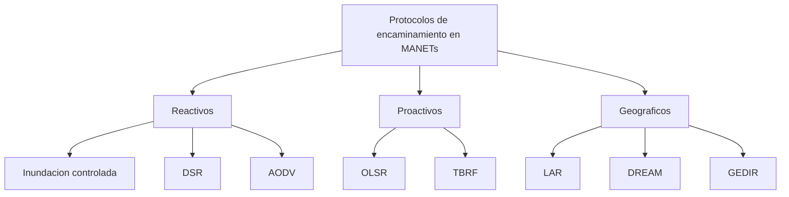

Este capítulo abre el estudio de las redes que se forman sin ningún elemento de
infraestructura fijo y presenta los protocolos de encaminamiento que resuelven, sobre
ese tipo de red, el mismo problema que ya se plantea para una red con infraestructura:
llevar un paquete de un nodo origen a un nodo destino. El capítulo no repite los
algoritmos de encaminamiento generales, sino que muestra cómo la inundación, el vector
distancia y el estado del enlace se adaptan a un escenario en el que ningún nodo puede
confiar en la presencia de un vecino ni en la estabilidad de un enlace.

## Introducción

Frente al modelo de
[redes basadas en infraestructura](../01_panorama/section_1_taxonomia_y_arquitecturas.md#redes-basadas-en-infraestructura),
una **red móvil ad hoc** (_mobile ad hoc network_, MANET) está compuesta por un conjunto
de estaciones móviles que se comunican entre sí mediante tecnología inalámbrica sin
necesidad de ningún elemento de red preexistente. La comunicación entre dos nodos que no
se encuentran dentro del alcance directo de sus radios depende por completo de que otros
nodos de la red acepten retransmitir el tráfico ajeno, una función que en una red con
infraestructura asume la estación base o el encaminador del operador. Esa dependencia
mutua entre nodos, sin ningún elemento privilegiado que la coordine, es el rasgo que
distingue a una MANET de cualquier otra red inalámbrica y el que obliga a diseñar
protocolos de encaminamiento específicos para ella.

## Redes móviles ad hoc

### Nodos simétricos y asimétricos

Los nodos de una MANET pueden ser **simétricos**, cuando todos disponen de las mismas
capacidades de cómputo, de batería y de alcance radio, o **asimétricos y heterogéneos**,
cuando esas capacidades varían de un nodo a otro. En una red asimétrica, algunos nodos
pueden asumir responsabilidades adicionales sobre el resto, actuando como líderes que
concentran tareas de coordinación o de reenvío que en una red simétrica se reparten por
igual entre todos los nodos.

### Ventajas

Una MANET se despliega con rapidez y facilidad, porque no exige instalar ni configurar
ningún elemento de red antes de que los nodos empiecen a comunicarse entre sí. Esa misma
ausencia de infraestructura la hace independiente de cualquier operador o autoridad
central, y reduce su coste económico frente a una red que sí necesita desplegar y
mantener estaciones fijas.

### Desafíos

La contrapartida de esas ventajas es un conjunto de desafíos que no aparecen, o aparecen
en menor medida, en una red con infraestructura. La cobertura de la red queda limitada
al alcance radio agregado de sus nodos, sin ninguna estación fija que la extienda. El
medio de transmisión se comparte entre todos los nodos que se encuentran dentro de
alcance mutuo, con los mismos mecanismos de acceso múltiple que resuelven ese problema
en cualquier otra red de radio, descritos en
[acceso múltiple al medio](../../01_fundamentos/04_acceso_al_medio/section_2_acceso_multiple.md).
La movilidad de los nodos provoca que la red se particione con frecuencia, dejando a
algunos nodos temporalmente inalcanzables desde el resto. La batería de cada nodo es un
recurso limitado que se consume no solo con el tráfico propio, sino también con el
tráfico ajeno que el nodo retransmite en beneficio de otros. A estos desafíos se suman
una alta probabilidad de fallo de enlace, una topología que cambia de forma continua y
no planificada, un ancho de banda limitado por el propio medio de radio compartido, y la
ausencia de cualquier administrador que pueda intervenir manualmente sobre la red.

### Escenarios de aplicación

Las MANETs resultan especialmente útiles en escenarios donde desplegar una
infraestructura fija es difícil, lento o directamente imposible. Entre ellos se
encuentran las operaciones de emergencia, las actividades militares sobre el terreno,
las áreas remotas sin cobertura de ningún operador, y entornos civiles donde no conviene
levantar una infraestructura permanente. Un ejemplo civil habitual es una flota de taxis
que emplea una MANET para comunicarse entre vehículos y optimizar sus rutas en tiempo
real, sin depender de la cobertura de ningún operador de red celular.

## Encaminamiento en redes ad hoc

### Criterios de ruta óptima

El objetivo del encaminamiento en una MANET es el mismo que en cualquier otra red: hacer
llegar un mensaje de un nodo origen a un nodo destino. Lo que cambia es el criterio con
el que se decide cuál es la mejor ruta entre las posibles, que no siempre coincide con
la ruta de menor número de saltos. La ruta óptima puede ser la más corta, la más rápida,
o depender de otros factores propios de un nodo móvil alimentado por batería, como la
carga restante de cada nodo intermedio o el ancho de banda disponible en cada enlace.

Esa decisión, además, puede tomarla el propio nodo fuente antes de enviar el paquete, o
bien dejarla en manos de cada nodo intermedio a medida que el paquete avanza por la red.
Esta es la misma distinción entre **encaminamiento en origen** y **encaminamiento salto
a salto** que se introduce con carácter general en
[encaminamiento orientado a conexión y sin conexión](../../02_redes/04_encaminamiento/section_1_fundamentos_de_encaminamiento.md#encaminamiento-orientado-a-conexion-y-sin-conexion),
y que en una MANET adopta cada uno de los protocolos que se presentan en el resto de
este capítulo.

### Protocolos reactivos y proactivos

Los protocolos de encaminamiento para MANETs se dividen en dos grandes familias según
cuándo obtienen la información de ruta. Un protocolo **reactivo** solo busca una ruta
hacia un destino cuando un nodo necesita enviarle tráfico y no dispone ya de una ruta
conocida, lo que evita mantener información de rutas que nunca llegan a usarse pero
introduce una latencia inicial mientras la ruta se descubre. Un protocolo **proactivo**
envía información de ruta de forma periódica, con independencia de que exista o no
tráfico que la necesite, lo que reduce esa latencia inicial a cambio de un tráfico de
control constante. Entre ambos extremos, algunos protocolos recurren a la posición
geográfica de los nodos en lugar de a la topología de la red para decidir la ruta, una
tercera familia que este capítulo trata en su último bloque.



Un protocolo proactivo de estado del enlace, como TBRF (_Topology-Based Reverse Path
Forwarding_), construye a partir de esa información topológica un árbol de difusión y
reenvía los paquetes siguiendo ese árbol, en lugar de recalcular una ruta específica
para cada destino.

???+ example "Overhead de control en una red de 50 nodos con sesiones esporádicas"

    Una red ad hoc de $N = 50$ nodos emplea, en un primer escenario, un protocolo
    reactivo, y en un segundo escenario, un protocolo proactivo. El objetivo es
    comparar el _overhead_ de control que genera cada familia bajo dos condiciones de
    tráfico distintas, empleando un modelo simplificado con parámetros supuestos para
    ilustrar la tendencia, no una medición de un despliegue real.

    En el protocolo reactivo, cada descubrimiento de ruta inunda en el peor de los
    casos a los $N$ nodos de la red una única vez. Si se producen $R$ descubrimientos
    de ruta por minuto, el _overhead_ reactivo por minuto es aproximadamente

    $$
    O_{reactivo} \approx R \cdot N
    $$

    donde $R$ es el número de descubrimientos de ruta iniciados por minuto y $N$ es el
    número de nodos de la red, que acota el número de retransmisiones de un único
    _flood_ de control.

    En el protocolo proactivo, cada nodo emite un mensaje de control cada $T$ segundos,
    con independencia de si hay tráfico de datos que lo necesite. El _overhead_
    proactivo por minuto es aproximadamente

    $$
    O_{proactivo} \approx N \cdot \frac{60}{T}
    $$

    donde $T$ es el periodo, en segundos, entre mensajes de control sucesivos de un
    mismo nodo.

    Con $R = 2$ descubrimientos por minuto y $T = 5\ \text{s}$, resulta $O_{reactivo}
    \approx 2 \cdot 50 = 100$ mensajes por minuto frente a $O_{proactivo} \approx 50
    \cdot 12 = 600$ mensajes por minuto: con tráfico esporádico, el protocolo reactivo
    genera menos _overhead_. Si la movilidad obliga a reducir $T$ a $1\ \text{s}$ para
    detectar antes los enlaces rotos, y el número de sesiones activas crece a $R = 20$
    descubrimientos por minuto, la comparación se invierte: $O_{reactivo} \approx 20
    \cdot 50 = 1000$ frente a $O_{proactivo} \approx 50 \cdot 60 = 3000$, y ambos
    crecen, pero la ventaja relativa del reactivo se reduce a medida que aumenta el
    número de sesiones que necesitan descubrir ruta. El punto de equilibrio entre ambas
    familias depende, en concreto, de la relación entre la frecuencia de las sesiones
    de tráfico y la frecuencia con la que la movilidad exige refrescar la información
    de control.

## Inundación controlada

La estrategia de enrutamiento más elemental para una MANET es la **inundación
controlada** (_controlled flooding_), una aplicación directa del mecanismo de
[inundación](../../02_redes/04_encaminamiento/section_1_fundamentos_de_encaminamiento.md#inundacion)
ya descrito con carácter general: el nodo emisor S transmite el paquete de datos a todos
sus vecinos, y cada nodo que lo recibe lo reenvía a sus propios vecinos, hasta que el
paquete alcanza al nodo destino D, siempre que D sea alcanzable desde S. El nodo D no
reenvía el paquete una vez que lo recibe.

### Control por número de secuencia

La inundación controlada aplica el mismo mecanismo de números de secuencia que evita la
circulación indefinida de un paquete en cualquier protocolo de inundación. El mecanismo
concreto se conoce como SNCF (_sequence-number-controlled flooding_): cada nodo
transmisor incluye su propia dirección y un número de secuencia en el paquete, y cada
nodo receptor mantiene un registro de las parejas dirección y número de secuencia que ya
ha reenviado. Si un nodo recibe un paquete con una pareja que ya tiene registrada, lo
descarta en lugar de reenviarlo de nuevo.

### Coste en tráfico redundante

A pesar de su simplicidad, la inundación controlada puede generar un volumen de tráfico
redundante muy elevado: en el peor de los casos, todos los nodos alcanzables desde la
fuente llegan a recibir el paquete, aunque solo uno de ellos sea el destino real. La
entrega puede además resultar poco fiable, porque el modo de difusión que emplea la
inundación no lleva asociado ningún paquete de reconocimiento (`ACK`), de modo que dos
nodos que transmiten simultáneamente hacia un mismo receptor pueden provocar una
colisión y la pérdida del paquete sin que ningún nodo lo detecte.

Buena parte de los protocolos que se presentan en el resto de este capítulo no aplican
la inundación a los paquetes de datos, sino únicamente a los paquetes de control que
descubren la ruta. Una vez establecida la ruta, los paquetes de datos siguen esa ruta
sin necesidad de volver a inundar la red, de modo que el _overhead_ que introduce cada
inundación de paquetes de control queda compensado por los paquetes de datos que se
transmiten entre dos inundaciones consecutivas.

## Encaminamiento de origen dinámico

El **encaminamiento de origen dinámico** (_dynamic source routing_, DSR) es un protocolo
reactivo que aplica el encaminamiento en origen descrito en
[criterios de ruta óptima](#criterios-de-ruta-optima): cuando un nodo fuente S necesita
enviar un paquete a un nodo destino D pero no conoce ninguna ruta hacia él, inicia un
proceso de descubrimiento de ruta basado en inundación limitada a los paquetes de
control.

### Descubrimiento de ruta

S difunde un paquete de solicitud de ruta (`RREQ`) que identifica al nodo origen, al
nodo destino y un número de solicitud, y que lleva asociado un registro de ruta
inicialmente vacío. Cada nodo que recibe el `RREQ` por primera vez añade su propia
dirección a ese registro de ruta y reenvía el paquete a sus propios vecinos, salvo al
nodo del que lo recibió. Cada nodo mantiene además una lista de las parejas origen y
número de solicitud que ya ha procesado, y descarta cualquier copia adicional del mismo
`RREQ` que le llegue por otro camino, sea porque ya lo reenvió como nodo intermedio o
porque ya lo descartó antes por el mismo motivo. Cuando el `RREQ` alcanza al nodo
destino D, este no lo reenvía: en su lugar, construye un paquete de respuesta de ruta
(`RREP`) que contiene la ruta completa acumulada en el registro, y lo envía de vuelta a
S siguiendo esa misma ruta invertida.

???+ example "Descubrimiento de ruta DSR sobre una topología de cinco nodos"

    Sea la red de la figura, con enlaces bidireccionales entre S y A, entre S y B, entre
    A y C, entre B y C, y entre C y D. Ningún otro par de nodos se encuentra dentro de
    alcance mutuo. El nodo S necesita enviar un paquete a D y no conoce ninguna ruta.

    ```mermaid linenums="1"
    graph LR
        S["S"] --- A["A"]
        S --- B["B"]
        A --- C["C"]
        B --- C
        C --- D["D"]
    ```

    S difunde un `RREQ` con registro de ruta vacío hacia A y B. A lo recibe con
    registro `[S]`, añade su dirección y lo reenvía a sus vecinos distintos de S, es
    decir, a C, con registro `[S, A]`. B lo recibe también con registro `[S]`, añade su
    dirección y lo reenvía a sus vecinos distintos de S, es decir, a C, con registro
    `[S, B]`.

    C recibe primero la copia de A, con registro `[S, A]`. Como es la primera vez que C
    ve esta pareja origen y número de solicitud, añade su propia dirección y reenvía el
    `RREQ` a sus vecinos distintos de A, es decir, a B y a D, con registro `[S, A, C]`.
    Poco después, C recibe la copia de B, con registro `[S, B]`, pero esta pareja
    origen y número de solicitud ya está en su lista de solicitudes procesadas, de modo
    que la descarta sin reenviarla de nuevo.

    B recibe entonces la copia que C reenvió, con registro `[S, A, C]`, pero B también
    reconoce la pareja origen y número de solicitud como ya procesada, puesto que ya
    reenvió su propia copia al recibir el `RREQ` original de S, y la descarta. D recibe
    la copia que C reenvió, con registro `[S, A, C]`. D es el destino, así que no
    reenvía el paquete: construye un `RREP` con la ruta completa `[S, A, C, D]` y lo
    envía de vuelta invirtiendo esa ruta.

    ```mermaid linenums="1"
    sequenceDiagram
        participant S
        participant A
        participant B
        participant C
        participant D
        S->>A: RREQ ruta=[S]
        S->>B: RREQ ruta=[S]
        A->>C: RREQ ruta=[S,A]
        B->>C: RREQ ruta=[S,B]
        Note over C: C procesa la copia de A y descarta la de B
        C->>D: RREQ ruta=[S,A,C]
        C->>B: RREQ ruta=[S,A,C]
        Note over B: B ya proceso esta solicitud, la descarta
        D->>C: RREP ruta=[S,A,C,D]
        C->>A: RREP ruta=[S,A,C,D]
        A->>S: RREP ruta=[S,A,C,D]
    ```

    El `RREP` recorre la ruta `[S, A, C, D]` en sentido inverso, de D a C, de C a A y de
    A a S, y S termina almacenando en su caché la única ruta descubierta hacia D, sin
    que ningún nodo haya reenviado el mismo `RREQ` dos veces gracias al control de
    duplicados por pareja origen y número de solicitud.

### Caché de rutas

Cada nodo puede almacenar en una **caché de rutas** todas las rutas que llega a
descubrir, no solo las que él mismo solicitó. Esa caché permite a un nodo aprender rutas
parciales a partir del tráfico de otros nodos que atraviesa por él, y completar una ruta
incompleta sin tener que iniciar un nuevo descubrimiento, lo que acelera el
encaminamiento y reduce la propagación de nuevas solicitudes de ruta. Cuando S envía
finalmente un paquete de datos a D, incluye la ruta completa obtenida de su caché en la
propia cabecera del paquete, de modo que cada nodo intermedio se limita a leerla y
reenviar sin necesidad de consultar ninguna tabla propia.

### Notificación de rutas rotas

Si un nodo detecta que un enlace de una ruta ya no está operativo, envía un paquete de
error de ruta (`RERR`) a los nodos que puedan estar utilizando esa ruta. Cualquier nodo
que reciba el `RERR` elimina de su caché la ruta que depende del enlace roto. El
crecimiento del encabezado del paquete con la longitud de la ruta, y la posibilidad de
que varios nodos intermedios respondan a la vez con su propia copia cacheada de una
ruta, produciendo una tormenta de respuestas, son las principales desventajas de este
esquema; un retraso aleatorio antes de responder reduce la probabilidad de que varias
respuestas coincidan en el tiempo.

## Encaminamiento por vector distancia bajo demanda

El **encaminamiento por vector distancia bajo demanda** (_ad hoc on-demand distance
vector routing_, AODV) es un protocolo reactivo que aplica la misma idea del
[encaminamiento por vector distancia](../../02_redes/04_encaminamiento/section_1_fundamentos_de_encaminamiento.md#encaminamiento-por-vector-distancia)
descrito con carácter general, con dos diferencias impuestas por la ausencia de
infraestructura: las rutas se calculan solo cuando se necesitan, y cada nodo mantiene
únicamente las entradas que están en uso activo, no un vector completo hacia todos los
destinos posibles.

### Tablas de encaminamiento por nodo

A diferencia de DSR, en AODV la ruta no viaja en la cabecera de cada paquete de datos.
Cuando S necesita enviar un paquete a D y no conoce la ruta, difunde un `RREQ` igual que
en DSR, pero cada nodo que lo retransmite no añade su dirección al paquete: en su lugar,
crea en su propia tabla de encaminamiento una entrada de ruta inversa hacia S, con
siguiente salto el nodo del que recibió el `RREQ`. Cuando el `RREQ` llega a D, este
responde con un `RREP` que sigue exactamente la ruta inversa activada por el `RREQ`, y
cada nodo que reenvía el `RREP` crea, a su vez, una entrada de ruta hacia D con
siguiente salto el nodo del que recibió el `RREP`. Al final del proceso, ningún paquete
de datos necesita llevar la ruta completa: cada nodo intermedio consulta su propia tabla
y reenvía al siguiente salto correspondiente, exactamente como en el vector distancia
general.

### Temporizadores y mensajes de saludo

AODV emplea temporizadores para expulsar de la tabla de encaminamiento las entradas que
llevan un tiempo sin usarse, lo que mantiene la tabla de cada nodo limitada a las rutas
realmente activas. Además, cada nodo envía periódicamente un mensaje de saludo (`HELLO`)
a sus vecinos para detectar fallos de enlace: si un nodo deja de recibir los mensajes de
saludo esperados de un vecino, concluye que el enlace hacia él, o el propio vecino, ha
dejado de estar operativo, y notifica el fallo mediante un paquete de error de ruta
(`RERR`) a todos los nodos activos que dependían de esa ruta.

???+ example "Deteccion y reparacion de un enlace roto en AODV"

    Retomando la topología S-A-C-D y S-B-C del bloque anterior, supóngase que ya existe
    una ruta activa de S hacia D, establecida con las siguientes entradas de tabla:
    S tiene como siguiente salto hacia D al nodo A, A tiene como siguiente salto hacia D
    al nodo C, y C tiene como siguiente salto hacia D al propio D.

    El enlace C-D falla. C deja de recibir los mensajes `HELLO` que esperaba de D, y
    tras agotarse el número de intervalos permitido sin respuesta, concluye que el
    enlace hacia D ya no está operativo. C elimina de su tabla la entrada que apunta a D
    y envía un `RERR` a los nodos activos que dependen de esa ruta a través de él, en
    este caso A, que es el único nodo que tiene registrada una ruta hacia D con
    siguiente salto C.

    A recibe el `RERR`, elimina de su propia tabla la entrada hacia D, y reenvía a su
    vez el `RERR` a los nodos que dependen de su propia ruta hacia D, en este caso S,
    que tenía registrado a A como siguiente salto hacia D. S recibe el `RERR` y elimina
    su entrada hacia D. Ningún nodo dispone ya de una ruta hacia D, y si S necesita
    seguir enviando tráfico hacia ese destino, debe iniciar un nuevo descubrimiento de
    ruta mediante un `RREQ`, exactamente como si nunca hubiera conocido una ruta previa.
    La ruta que ese nuevo descubrimiento encuentre, en esta topología, es S-B-C
    seguida del tramo que C descubra hacia D si existe algún otro enlace hacia ese nodo,
    o ninguna ruta si D ha quedado desconectado del resto de la red.

### Números de secuencia de ruta

Cada nodo asocia a su propia dirección un número de secuencia de ruta que incrementa
cada vez que detecta un cambio relevante en su vecindad, y cada entrada de ruta que
mantiene incluye el número de secuencia del destino en el momento en que se creó esa
entrada. Un nodo que recibe información sobre una ruta hacia un destino solo la acepta
si su número de secuencia es mayor que el que ya tenía registrado, o igual pero con un
coste menor, lo que evita que un nodo adopte una ruta obsoleta o rota, y previene además
la formación de bucles de encaminamiento entre nodos que actualizan su información de
forma asíncrona. AODV se ha aplicado además como base de protocolos de encaminamiento en
Zigbee, donde constituye una característica normalizada del propio estándar, y también,
como línea de investigación puntual y no como uso estándar equivalente, sobre Bluetooth;
además cuenta con variantes propias como ZAODV, EAODV o AODV con componentes proactivos.

## Encaminamiento proactivo de estado del enlace optimizado

El **encaminamiento proactivo de estado del enlace optimizado** (_optimized link-state
routing_, OLSR) adapta a una MANET la misma idea del
[encaminamiento por estado del enlace](../../02_redes/04_encaminamiento/section_1_fundamentos_de_encaminamiento.md#encaminamiento-por-estado-del-enlace)
descrita con carácter general: cada nodo difunde información sobre sus propios vecinos,
y todos los nodos terminan disponiendo de la misma información topológica con la que
calcular sus rutas de forma independiente, en este caso mediante el mismo
[algoritmo de Dijkstra](../../02_redes/04_encaminamiento/section_1_fundamentos_de_encaminamiento.md#algoritmo-de-dijkstra)
ya descrito. La diferencia que introduce OLSR frente al estado del enlace clásico es una
optimización pensada para reducir el tráfico de control que la inundación periódica de
esa información generaría en una red sin infraestructura y con enlaces que cambian con
frecuencia.

### Relés multipunto

En lugar de que cada nodo reenvíe la información de estado de enlace de todos sus
vecinos, OLSR selecciona, dentro de cada vecindad, un subconjunto de nodos vecinos
denominados **relés multipunto** (_multipoint relays_, MPR), que son los únicos
encargados de reenviar esa información. Cada nodo transmite periódicamente la lista de
sus propios vecinos directos, lo que permite a cada nodo conocer no solo a sus vecinos a
un salto, sino también a los vecinos de sus vecinos, es decir, su vecindad a dos saltos.
A partir de ese conocimiento, cada nodo selecciona como MPR al subconjunto mínimo de sus
vecinos directos que, entre todos ellos, cubre a la totalidad de su vecindad a dos
saltos, de modo que la información que un nodo necesita hacer llegar a dos saltos de
distancia se reenvía a través de muchos menos nodos que si todos sus vecinos
retransmitieran.

### Construcción de la base topológica

La información de estado de enlace que cada nodo difunde se propaga por la red
exclusivamente a través de los nodos que actúan como MPR de algún otro nodo, no mediante
una inundación sin restricciones. Cada nodo de la red recibe así, con el tiempo, la
información necesaria para construir su propia base de datos topológica de la red
completa, calcular sobre ella el árbol de rutas de coste mínimo mediante Dijkstra, y
establecer a partir de ese árbol una tabla de encaminamiento hacia todos los destinos
posibles. OLSR se emplea de forma habitual en redes comunitarias inalámbricas con
enlaces de alto ancho de banda y muy entrelazados entre sí, un escenario en el que la
topología cambia con poca frecuencia y el coste de mantener información proactiva se
amortiza mejor que en una red con movilidad elevada. Una versión posterior, OLSRv2,
añade un diseño modular con componentes compartidos entre distintos protocolos de la
familia MANET, sin alterar la idea central de los relés multipunto.

## Encaminamiento geográfico

Los protocolos anteriores calculan la ruta a partir de la topología de la red, expresada
como una relación de vecindad entre nodos. Los **protocolos de encaminamiento
geográfico** sustituyen esa información por la posición física de los nodos, obtenida
mediante un sistema de localización, y dirigen los paquetes hacia la zona geográfica
donde se presume que se encuentra el destino en lugar de hacia un identificador de nodo
concreto. Los mecanismos con los que un nodo obtiene su propia posición y consulta la de
otro nodo, necesarios para que estos protocolos funcionen en la práctica, se tratan en
la sección de esta misma área dedicada a los sistemas y servicios de localización; este
bloque se limita a describir cómo cada protocolo emplea esa posición una vez obtenida.

### Encaminamiento asistido por ubicación

El protocolo **LAR** (_location-aided routing_, encaminamiento asistido por ubicación)
es un protocolo reactivo, similar a DSR en su mecánica de descubrimiento por inundación,
pero que limita esa inundación con la información de posición del destino. A partir de
la última posición conocida del destino y de su velocidad estimada, el protocolo calcula
una **zona esperada**, la región donde se presume razonablemente que se encuentra el
destino en el momento del descubrimiento. La solicitud de ruta se propaga únicamente
dentro de una **zona de solicitud** que contiene tanto la zona esperada como la posición
del propio nodo emisor, de modo que los nodos situados fuera de esa zona no reciben ni
reenvían el `RREQ`, lo que reduce el _overhead_ de la inundación frente a DSR sin
renunciar a su mecánica reactiva.

### Encaminamiento basado en distancia y movilidad

El protocolo **DREAM** (_distance routing effect algorithm for mobility_, algoritmo de
efecto de enrutamiento a distancia para movilidad) adopta, en cambio, un enfoque
proactivo basado en posición: todos los nodos mantienen información de la ubicación de
todos los demás nodos de la red, obtenida mediante la transmisión periódica de la propia
posición por inundación de paquetes de datos. La frecuencia de esa transmisión no es
uniforme: los nodos cercanos se actualizan entre sí con más frecuencia que los nodos
lejanos, porque un error de posición tiene un efecto proporcionalmente mayor sobre la
decisión de reenvío cuanto más cerca está el nodo que la consulta, y los nodos que se
desplazan más rápido actualizan su posición con mayor frecuencia que los nodos casi
estáticos, porque su posición queda obsoleta antes.

### Reenvío al vecino más próximo al destino

El protocolo **GEDIR** (_geographic distance routing_, encaminamiento de distancia
geográfica) asume que se conoce la posición del nodo destino y que cada nodo conoce la
posición de sus propios vecinos directos. Sobre esa base, la regla de reenvío es
extremadamente simple: cada nodo que recibe el paquete lo reenvía al vecino que se
encuentra más cercano en distancia euclidiana al destino, sin necesidad de mantener
ninguna tabla de encaminamiento ni de ejecutar ningún descubrimiento de ruta previo.

### Entrega garantizada y rodeo de obstáculos

La regla de GEDIR falla cuando un nodo no tiene ningún vecino más cercano al destino que
él mismo, aunque exista una ruta hacia el destino que se aleje temporalmente de él en
línea recta, una situación habitual cuando la red rodea un obstáculo o presenta un hueco
de cobertura. El **encaminamiento con entrega garantizada** mejora GEDIR para cubrir
precisamente ese caso: garantiza la entrega del paquete, apoyándose en información de
posición, siempre que exista alguna ruta entre origen y destino, y establece rutas que
rodean los obstáculos o los huecos de cobertura cuando el reenvío al vecino más próximo
por sí solo no basta para completar la entrega.

## Redes en malla inalámbricas

Las
[redes mesh inalámbricas](../01_panorama/section_1_taxonomia_y_arquitecturas.md#malla)
(_wireless mesh networks_, WMN), ya presentadas como una de las topologías posibles de
una red inalámbrica, son en la práctica uno de los escenarios de despliegue habituales
de los protocolos de encaminamiento descritos en este capítulo. A diferencia de una
MANET formada por terminales de usuario en movimiento constante, una WMN combina un
conjunto de _routers_ con movilidad limitada y una estructura relativamente estable, que
forman el esqueleto de la red, con clientes que sí pueden moverse con mayor libertad.
Esa estabilidad relativa de los _routers_ que forman la malla hace que un protocolo
proactivo como OLSR, cuyo coste de mantenimiento se amortiza mejor cuanto menos cambia
la topología, resulte particularmente adecuado para el esqueleto de la red, mientras que
los clientes más móviles pueden seguir apoyándose en un protocolo reactivo para alcanzar
destinos fuera de su alcance directo.
