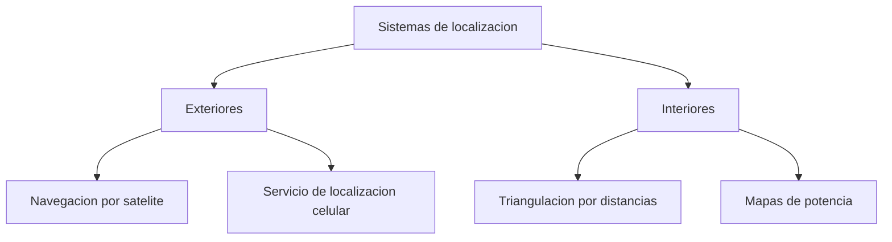

Este capítulo describe cómo un terminal obtiene su propia posición geográfica y cómo esa
posición se pone a disposición de otros nodos de la red. Ambas cuestiones son
independientes entre sí y se tratan por separado: primero los principios de medida y los
sistemas que calculan una posición, después los servicios que almacenan esa posición y
responden a una consulta sobre ella.

## Introducción

Un **sistema de localización** es el mecanismo que determina la ubicación geográfica de
una entidad móvil con un grado de precisión determinado, y responde a la pregunta de
cómo se obtiene una posición. Un **servicio de localización**, en cambio, es la base de
datos que almacena esa posición una vez calculada y responde a la pregunta de cómo se
consulta la posición de un nodo concreto. La distinción importa porque ambos elementos
son intercambiables de forma independiente: el mismo servicio de localización puede
apoyarse en un sistema por satélite o en uno basado en la señal de una red local, y el
mismo sistema de localización puede alimentar un servicio centralizado o uno distribuido
entre los propios nodos de una red sin infraestructura.

## Sistema de localización frente a servicio de localización

En una red con infraestructura, como una red celular, el servicio de localización se
apoya en servidores centralizados de la propia red. En una red sin infraestructura, ese
servicio no puede delegarse en ningún elemento fijo, y son los propios nodos quienes
deben implementarlo: el servidor de localización queda distribuido entre ellos, y cada
nodo mantiene una copia total o parcial de la base de datos de posiciones. Un servicio
de localización se apoya siempre en dos operaciones básicas, la **actualización**, con
la que un nodo informa de su posición actual, y la **consulta**, con la que otro nodo
solicita la posición de un destino, y la forma concreta en que se implementan ambas
operaciones es lo que distingue a los distintos servicios que se describen más adelante
en este capítulo.

La aplicación más directa de un sistema de localización dentro de una red ad hoc es el
[encaminamiento geográfico](./section_1_manet_y_encaminamiento.md#encaminamiento-geografico),
que sustituye la topología de la red por la posición física de los nodos para decidir la
ruta de un paquete. Ese uso concreto de la posición ya calculada se retoma al cierre de
este capítulo; el resto de las secciones se dedica a cómo se obtiene esa posición y a
cómo se consulta.

## Medidas radio utilizadas

Todo sistema de localización basado en radio parte de una o varias medidas físicas
tomadas sobre la señal recibida, y traduce esa medida en información de posición. Cuatro
principios de medida cubren la práctica totalidad de los sistemas empleados: el tiempo
que tarda la señal en llegar, el nivel de potencia con el que llega, la identidad del
transmisor que la envía y el ángulo con el que llega.

### Tiempo de vuelo

La medida de **tiempo de vuelo** (_time of flight_) obtiene una distancia a partir del
tiempo que tarda una señal en recorrer el trayecto entre el transmisor y el receptor,
multiplicado por la velocidad de la luz $c \approx 3 \times 10^8\ \text{m/s}$. Cada
medida de este tipo, tomada frente a una única estación de referencia, define como lugar
geométrico posible de la entidad localizada una circunferencia centrada en esa
referencia, de radio igual a la distancia calculada. Dos circunferencias procedentes de
dos referencias distintas se cortan, en general, en dos puntos, de modo que una tercera
referencia resulta necesaria para descartar la solución espuria y fijar una posición
única en el plano. Esta técnica de intersección de distancias se conoce como **tiempo de
llegada** (_time of arrival_, ToA) cuando la medida se toma de forma independiente
frente a cada referencia, y exige que el receptor conozca con precisión el instante
exacto en que la señal fue transmitida, lo que en la práctica requiere que el reloj del
emisor esté sincronizado con el de cada estación de referencia con una precisión del
orden del nanosegundo, dada la velocidad de propagación de la señal.

Cuando esa sincronización no puede garantizarse, como ocurre con un terminal móvil de
bajo coste, aparece una incógnita adicional en el sistema de ecuaciones: el desfase
constante y desconocido del reloj del terminal respecto a la base de tiempo de las
referencias. En el plano, donde la posición añade dos incógnitas, ese desfase eleva a
tres el número total de incógnitas y, por tanto, a tres el número mínimo de referencias
necesarias para resolverlas, exactamente el mismo número que ya exigía la ambigüedad
geométrica del caso sincronizado.

La **diferencia de tiempos de llegada** (_time difference of arrival_, TDOA) resuelve el
problema de la sincronización del terminal de otra forma: en lugar de estimar una
distancia absoluta frente a cada referencia, resta dos medidas de tiempo de llegada
tomadas frente a un par de referencias. El desfase desconocido del reloj del terminal
aparece por igual en ambas medidas y se cancela exactamente en la resta, de modo que la
ecuación resultante ya no depende de ese desfase, sino únicamente de la diferencia de
distancias del terminal a las dos referencias del par. El lugar geométrico que define
esa diferencia constante de distancias a dos puntos fijos no es una circunferencia, sino
una **hipérbola** con foco en cada una de las dos referencias. En el plano, tres
referencias siguen siendo necesarias, porque dos diferencias independientes exigen tres
medidas de tiempo de llegada tomadas como base, pero el conjunto de relojes que debe
mantenerse sincronizado se reduce en una unidad exacta: basta con que las estaciones de
referencia compartan entre sí una base de tiempo común, sin que el reloj del propio
terminal forme parte de ese conjunto sincronizado en ningún momento.

???+ example "Por qué la diferencia de tiempos exige sincronizar una referencia menos"

    Un esquema de tiempo de llegada con reloj de terminal no sincronizado, como el que
    emplea un receptor GNSS, trata el desfase de ese reloj como una incógnita más del
    sistema: en el plano, las incógnitas son las dos coordenadas de posición más el
    desfase de reloj, tres en total, y el sistema exige tres estaciones sincronizadas
    entre sí y, además, un mecanismo que permita al terminal resolver su propio desfase
    junto con la posición a partir de esas tres medidas.

    Un esquema de diferencia de tiempos parte de las mismas tres medidas de tiempo de
    llegada, pero las combina en dos diferencias antes de plantear el sistema de
    ecuaciones. El desfase del terminal, al ser común a las tres medidas originales, se
    cancela en cada resta, y el sistema resultante depende únicamente de las dos
    coordenadas de posición. El número de estaciones necesarias en el plano no cambia,
    tres en ambos casos, pero el conjunto de relojes que debe compartir una base de
    tiempo común sí lo hace: en el primer esquema son las tres estaciones más el propio
    terminal, y en el segundo son solo las tres estaciones entre sí. El esquema de
    diferencia de tiempos evita, por construcción, la exigencia de sincronización más
    difícil de cumplir en la práctica, la que recae sobre un terminal móvil de bajo
    coste, a cambio de resolver la posición a partir de hipérbolas en lugar de
    circunferencias.

### Nivel de señal recibida

La medida de **nivel de señal recibida** (_received signal strength_, RSS) estima una
distancia a partir de la potencia con la que llega la señal, invirtiendo el modelo de
[pérdidas de propagación](../../01_fundamentos/02_canal/section_1_propagacion_y_perdidas.md#exponente-de-perdidas-del-medio)
que relaciona la atenuación con la distancia mediante un exponente de pérdidas propio
del entorno. Igual que en el tiempo de vuelo, cada medida frente a una referencia define
una circunferencia posible, con el radio determinado ahora por la potencia recibida en
lugar de por un tiempo de propagación. La ventaja de este método es que no exige ninguna
sincronización de reloj, solo un modelo de propagación calibrado para el entorno; su
desventaja es que ese modelo describe una atenuación media con la distancia, y no recoge
las fluctuaciones rápidas de
[desvanecimiento](../../01_fundamentos/02_canal/section_2_desvanecimiento_y_respuesta_del_canal.md#desvanecimiento-de-rayleigh)
que la propagación multitrayecto superpone a esa media, de modo que la distancia
estimada a partir de la potencia arrastra siempre el error que introduce el
desvanecimiento no modelado.

???+ example "De cuántos metros de error es responsable un margen de desvanecimiento"

    Un nodo estima su distancia a una referencia invirtiendo un modelo de pérdidas con
    exponente $n = 3$, típico de un entorno con obstáculos moderados, sobre una
    referencia de pérdidas $L_{fs}(d_0)$ a una distancia $d_0 = 1\ \text{m}$. El modelo
    de pérdidas es

    $$
    L\ \lbrack \text{dB}\rbrack = L_{fs}(d_0) + 10\, n \log_{10}\left(\frac{d}{d_0}\right)
    $$

    donde $d$ es la distancia que se quiere estimar. Despejando $d$ en función de las
    pérdidas medidas $L$:

    $$
    d = d_0 \cdot 10^{\frac{L - L_{fs}(d_0)}{10 n}}
    $$

    Si el desvanecimiento por multitrayecto añade, en un instante dado, un margen
    adicional de $\Delta L = 6\ \text{dB}$ de atenuación no explicado por el modelo de
    pérdidas medio, ese margen se traslada al exponente de la expresión anterior como un
    factor multiplicativo sobre la distancia estimada:

    $$
    \frac{d_{\text{estimada}}}{d_{\text{real}}} = 10^{\frac{\Delta L}{10 n}} =
    10^{\frac{6}{30}} \approx 1{,}58
    $$

    Un margen de solo 6 dB de desvanecimiento, indistinguible por el receptor de un
    cambio real de distancia, se traduce en una distancia estimada un 58 % mayor que la
    real con este exponente de pérdidas. Cuanto menor es el exponente $n$ del entorno,
    mayor es la sensibilidad de la distancia estimada a un mismo margen de
    desvanecimiento en decibelios, porque el mismo salto de potencia debe repartirse
    entre un exponente más pequeño. Esta sensibilidad es la razón de que el método de
    nivel de señal recibida se considere, de forma típica, menos preciso que un método
    basado en tiempo de vuelo en el mismo entorno, aunque no exija sincronización de
    reloj.

### Identificador del transmisor

La medida por **identificador del transmisor** (_cell ID_) no calcula una distancia ni
un ángulo, sino que aproxima la posición del terminal a la posición conocida de la
estación o del punto de acceso con el que mantiene asociación, obtenida a partir de la
identidad que ese transmisor incluye en su señal. Es el método menos preciso de los
cuatro, porque su resolución queda limitada al tamaño de la celda o del área de
cobertura del transmisor identificado, pero también el más simple, porque no exige
ninguna medida adicional sobre la señal más allá de decodificar el identificador que ya
se transmite con otros fines.

### Ángulo de llegada

La medida de **ángulo de llegada** (_angle of arrival_, AoA) se obtiene con una antena
capaz de discriminar la dirección de procedencia de la señal, típicamente un array de
varios elementos. Cada medida de ángulo frente a una única referencia define, como lugar
geométrico posible de la entidad localizada, una semirrecta que parte de esa referencia
en la dirección medida, en lugar de la circunferencia que definen las medidas basadas en
distancia. Dos semirrectas procedentes de dos referencias distintas se cortan, en
general, en un único punto, salvo que ambas referencias, el punto buscado y la propia
geometría del problema coloquen a las tres en una configuración degenerada; con esa
salvedad, dos referencias bastan para fijar una posición en el plano, una referencia
menos que las tres que exige cualquier método basado en distancias. Esa ventaja
geométrica se paga con una antena más compleja y más sensible a errores de apuntamiento
que un simple receptor de potencia o de tiempo, y con una degradación más severa cuando
el trayecto directo hacia la referencia no es el dominante, porque el array puede
entonces estimar el ángulo de un componente reflejado en lugar del ángulo real hacia el
transmisor.

## Localización en exteriores

En un entorno exterior, con visión razonablemente despejada del cielo o con una
infraestructura celular ya desplegada, la localización se apoya en dos familias de
sistemas que no compiten entre sí, sino que atienden escenarios distintos según exista o
no cobertura de un operador.

### Sistemas globales de navegación por satélite

Los **sistemas globales de navegación por satélite** (_global navigation satellite
system_, GNSS), ya presentados como una tecnología de acceso por satélite en
[redes por satélite](../01_panorama/section_1_taxonomia_y_arquitecturas.md#sistemas-de-navegacion-por-satelite),
calculan la posición del receptor a partir de medidas de tiempo de vuelo tomadas frente
a varios satélites de una constelación en órbita media, cada uno de los cuales actúa
como una referencia sincronizada con las demás mediante relojes atómicos a bordo. El
receptor del terminal, de bajo coste y sin un reloj atómico propio, no está sincronizado
con esa base de tiempo, de modo que el cálculo de posición debe resolver simultáneamente
las tres coordenadas espaciales y el desfase del reloj del receptor, lo que exige un
mínimo de cuatro satélites visibles en lugar de los tres que bastarían con un reloj de
receptor ya sincronizado. El **GPS** estadounidense y el **Galileo** europeo son los dos
exponentes de esta familia citados en la clasificación por tecnología de acceso; Galileo
ofrece de forma gratuita un servicio de localización con un error inferior a los 5
metros, y reserva una precisión mayor a servicios de pago.

### Servicios de localización en redes celulares

En una red celular, el propio operador ofrece un **servicio de localización** (_location
services_, LCS) que sitúa un terminal dentro de su área de cobertura sin necesidad de
que el terminal disponga de un receptor GNSS propio, apoyándose en cambio en las medidas
radio que la propia interfaz celular ya realiza frente a sus estaciones base. Este
servicio admite una naturaleza comercial, cuando localiza a un terminal para ofrecerle
información dependiente de su posición; interna, cuando la propia red utiliza la
posición para optimizar su funcionamiento; de emergencia, cuando una llamada de socorro
exige situar al llamante sin depender de su cooperación activa; o legal, cuando una
autoridad solicita la posición de un terminal por motivos de investigación.

## Localización en interiores

En interiores, la señal de los satélites GNSS se atenúa por la estructura del propio
edificio hasta quedar habitualmente por debajo del umbral de recepción, lo que obliga a
recurrir a sistemas apoyados en la infraestructura de radio ya presente en el interior,
como puntos de acceso de una red local inalámbrica, balizas Bluetooth o etiquetas RFID.

### Triangulación

La **triangulación de radiofrecuencia** mide, frente a varios puntos de referencia
dentro del edificio, la distancia o el ángulo mediante alguno de los principios de
medida descritos en la sección anterior, y calcula la posición del terminal como la
intersección de los lugares geométricos que esas medidas definen: circunferencias en el
caso de una medida de distancia por tiempo de vuelo o por nivel de señal, semirrectas en
el caso de una medida de ángulo. El término agrupa, por tanto, cualquier método de
interiores que resuelva la posición por intersección geométrica, con independencia del
principio de medida concreto que emplee cada referencia.

### Mapas de potencia

Los sistemas basados en **mapas de potencia** (_fingerprinting_) sustituyen el cálculo
geométrico explícito por una fase previa de calibración: durante esa fase, se recorre el
edificio registrando, en un conjunto de puntos conocidos, el nivel de señal recibido
desde cada baliza o estación base visible, y ese conjunto de medidas forma un mapa de
huellas de potencia asociado a cada punto. Durante la operación normal, el terminal mide
el nivel de señal que recibe desde las mismas balizas y lo compara con el mapa de
huellas almacenado, estimando su posición como la del punto de calibración cuya huella
se parece más a la medida actual. Esta estrategia evita necesitar un modelo de
propagación explícito del entorno, a cambio de exigir una fase de calibración previa que
debe repetirse si el entorno cambia de forma apreciable, por ejemplo si se reorganiza el
mobiliario de una planta o se instala una nueva partición.

## Servicios de localización

Una vez calculada la posición de un nodo mediante alguno de los sistemas anteriores, un
servicio de localización debe almacenarla y responder a las consultas que otros nodos
realicen sobre ella. En una red con infraestructura, como una red celular GSM, esa
función recae en servidores centralizados de la propia red, análogos en su papel al
registro de posición de un abonado. En una red ad hoc, sin ningún elemento centralizado
disponible, el servicio debe implementarse de forma distribuida entre los propios nodos,
y las estrategias que resuelven esa distribución se organizan según el momento en que
obtienen la información de posición y según cómo la almacenan.

### Servicios reactivos

Un servicio **reactivo** no mantiene ninguna información de posición mientras no existe
necesidad de ella: cuando un nodo necesita localizar a otro, envía una petición que se
propaga por la red en busca del nodo destino, de forma análoga a como un protocolo de
encaminamiento reactivo descubre una ruta solo cuando hay tráfico que enviar. El coste
de esa consulta se paga en el momento en que se necesita, sin ningún mantenimiento
previo de información que pueda no llegar a usarse.

### Servicios proactivos

Un servicio **proactivo** construye y mantiene, en cambio, estructuras de datos que
almacenan la información de posición de los nodos con independencia de que exista o no
una consulta pendiente sobre ella, de modo que la consulta se resuelve de forma
inmediata sobre esa estructura ya construida a cambio de un tráfico de actualización
constante. DREAM, ya presentado como protocolo de encaminamiento geográfico en
[encaminamiento basado en distancia y movilidad](./section_1_manet_y_encaminamiento.md#encaminamiento-basado-en-distancia-y-movilidad),
es también, desde el punto de vista de los servicios de localización, un servicio
proactivo: todos los nodos mantienen información de posición de todos los demás nodos, y
cada nodo transmite su propia posición por inundación con una frecuencia que depende de
la distancia y de la velocidad relativa entre emisor y receptor.

### Almacenamiento distribuido de la posición

El enfoque de **hogar virtual** (_virtual home_) reparte el almacenamiento de la
posición sin exigir que todos los nodos conozcan la posición de todos los demás, como sí
exige un servicio proactivo del tipo DREAM. Cada nodo se asocia, mediante una función
hash aplicada a su propio identificador, a uno o varios nodos de la red que actúan como
su hogar virtual, y es en esos nodos concretos donde se almacena su posición actual. Un
nodo que quiere consultar la posición de un destino aplica la misma función hash sobre
el identificador de ese destino, obtiene la identidad de su hogar virtual, y dirige la
consulta directamente a él en lugar de propagarla por toda la red.

### Estructuras jerárquicas de servidores de localización

La **estructura tipo cuadrícula** superpone sobre la red ad hoc una cuadrícula lógica
conocida a priori por todos los nodos, organizada en una jerarquía de cuadrados de
tamaño creciente, dentro de la cual un subconjunto de nodos asume el papel de servidor
de localización de su propia celda de la cuadrícula. Esa jerarquía simplifica tanto la
actualización como la consulta, porque ambas operaciones quedan acotadas a la estructura
de cuadrados en lugar de tener que resolverse frente a la totalidad de la red, con un
coste que crece con el nivel de la jerarquía en lugar de con el número total de nodos.

## Aplicación al encaminamiento geográfico

Los tres servicios de localización descritos, hogar virtual, estructura en cuadrícula y
el enfoque proactivo de tipo DREAM, existen para resolver un mismo problema práctico:
dar soporte a los
[protocolos de encaminamiento geográfico](./section_1_manet_y_encaminamiento.md#encaminamiento-geografico)
que se presentan en el capítulo anterior de esta misma área, los cuales asumen que un
nodo puede conocer, con un coste razonable, la posición de otro nodo de la red antes de
reenviarle un paquete siguiendo la regla del vecino más próximo al destino en distancia
euclidiana. El sistema de localización de este capítulo resuelve cómo se calcula esa
posición, y el servicio de localización resuelve cómo se consulta, mientras que la forma
concreta en que cada protocolo de encaminamiento explota esa posición ya calculada
pertenece al capítulo que la precede.
