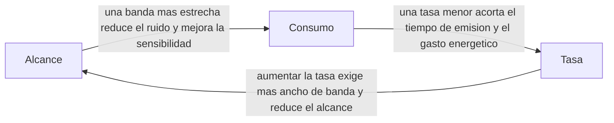
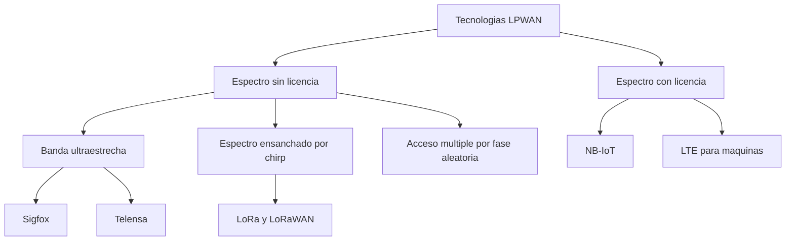

Este capítulo desarrolla la familia de tecnologías de área amplia y bajo consumo que la
taxonomía general de redes inalámbricas sitúa como respuesta al Internet de las cosas de
largo alcance. Presenta el compromiso físico que distingue a esta familia de las demás
tecnologías de acceso, la clasifica según el espectro que emplea, describe las técnicas
de capa física y las arquitecturas de red que comparten sus miembros, analiza las
tecnologías concretas que la componen y cierra con sus escenarios de aplicación y con
las tecnologías de corto alcance que completan el catálogo de acceso para el Internet de
las cosas.

## Introducción

La
[taxonomía y arquitecturas inalámbricas](../01_panorama/section_1_taxonomia_y_arquitecturas.md#compromisos-entre-alcance-consumo-y-velocidad)
sitúa a esta familia como la solución al compromiso entre alcance, consumo y velocidad
cuando el servicio exige una cobertura de área amplia con una tasa de datos mínima y un
consumo energético muy reducido, el caso descrito allí de una red de sensores agrícola
extensa. Ese mismo documento presenta el **Internet de las cosas** (_Internet of
Things_, IoT) como una de las clasificaciones por aplicación de una red inalámbrica, y
señala que las distancias largas dentro del IoT recurren a tecnologías de área amplia y
bajo consumo. Este capítulo desarrolla esa familia en detalle.

Una **red de área amplia y bajo consumo** (_Low Power Wide Area Network_, LPWAN) es una
tecnología de comunicación diseñada para aplicaciones de Internet de las cosas y de
comunicación
[máquina a máquina](../01_panorama/section_1_taxonomia_y_arquitecturas.md#comunicacion-entre-maquinas)
(_machine to machine_, M2M). Se caracteriza por un consumo energético bajo, que permite
una mayor duración de batería en los dispositivos conectados, y por una capacidad de
transmisión a largo alcance que cubre tanto interiores como exteriores. A cambio de
estas dos propiedades, LPWAN ofrece una tasa de datos baja. El bajo coste del
dispositivo y del despliegue, junto con una topología de red simplificada, facilitan su
implementación, y su escalabilidad la hace adecuada para una amplia gama de aplicaciones
de IoT.

## Características de una red de área amplia y bajo consumo

La tasa de datos baja de LPWAN no es una limitación incidental, sino la consecuencia
física directa de perseguir alcance y bajo consumo a la vez. El
[presupuesto de enlace](../../01_fundamentos/02_canal/section_1_propagacion_y_perdidas.md#perdidas-de-propagacion-en-espacio-libre)
de cualquier enlace radio compara la potencia recibida con la sensibilidad del receptor,
el nivel mínimo de señal que este puede detectar de forma fiable. La sensibilidad
depende del ruido térmico presente en el ancho de banda del receptor, cuya densidad
espectral de potencia a temperatura ambiente es un valor estándar de la ingeniería de
comunicaciones,

$$
N_0 = -174\ \text{dBm/Hz}
$$

de modo que la potencia de ruido total en un receptor de ancho de banda $B$ resulta

$$
N = N_0 + 10 \log_{10}(B)
$$

con $N_0$ expresado en $\text{dBm/Hz}$, $B$ en hercios y $N$ en $\text{dBm}$. Cuanto más
estrecho es el ancho de banda del receptor, menor es la potencia de ruido que integra y
menor, por tanto, la señal mínima que necesita para superar ese ruido: un receptor de
banda estrecha es más sensible que uno de banda ancha para la misma relación señal a
ruido exigida. Como las pérdidas de propagación crecen con la distancia, una mayor
sensibilidad tolera más pérdidas para la misma potencia de transmisión, y por tanto
alcanza más lejos. Esta cadena, banda estrecha implica menor ruido implica mayor
sensibilidad implica mayor alcance, es el argumento físico central de toda la familia
LPWAN, y el motivo por el que reducir la tasa de datos, que exige un ancho de banda
menor, es el precio que estas tecnologías pagan por su alcance.

???+ example "Ganancia de alcance al estrechar el canal de recepción"

    Un canal de banda ultraestrecha, como el que emplea Sigfox, ocupa del orden de $100\
    \text{Hz}$. Un canal NB-IoT, dentro de la misma familia LPWAN pero en espectro con
    licencia, ocupa $200\ \text{kHz}$. Ambos receptores comparten la misma relación
    señal a ruido mínima exigida y la misma potencia de transmisión, y la pregunta es
    cuánto alcance adicional permite el canal más estrecho solo por su menor ruido.

    La diferencia de potencia de ruido entre ambos receptores es

    $$
    \Delta N = 10 \log_{10}\left(\frac{200\,000\ \text{Hz}}{100\ \text{Hz}}\right)
    = 10 \log_{10}(2000) \approx 33{,}0\ \text{dB}
    $$

    Esos $33\ \text{dB}$ de menor ruido se traducen directamente en $33\ \text{dB}$ de
    pérdidas de propagación adicionales que el enlace de banda ultraestrecha puede
    tolerar. Con el modelo de espacio libre, las pérdidas crecen $20\ \text{dB}$ por cada
    década de distancia, de modo que el factor de alcance adicional resulta

    $$
    \frac{d_2}{d_1} = 10^{\Delta N / 20} = 10^{33{,}0/20} \approx 44{,}7
    $$

    El canal de banda ultraestrecha alcanza, solo por este efecto, casi $45$ veces más
    lejos que el canal NB-IoT para la misma potencia de transmisión. El resultado es una
    cota superior del mecanismo físico, sin contar diferencias de codificación, de
    ganancia de antena ni de margen de desvanecimiento entre ambas tecnologías, pero
    explica por qué las tecnologías de banda ultraestrecha son, de toda la familia LPWAN,
    las de mayor alcance a costa de la menor tasa de datos.

La regulación del espectro sin licencia impone además un límite de ciclo de trabajo que
acota directamente cuántos mensajes puede emitir un dispositivo, con independencia de su
tasa de datos instantánea. La banda sub-GHz europea, regulada por ETSI EN 300 220, no
fija un único límite para toda la banda, sino distintos límites de ciclo de trabajo
según la subbanda concreta, con valores habituales del $0{,}1\,\%$, el $1\,\%$ y el
$10\,\%$ según el canal, un límite que afecta a cualquier tecnología LPWAN que opere en
espectro sin licencia en esa región, LoRaWAN y Sigfox incluidas.

???+ example "Número de mensajes bajo un límite de ciclo de trabajo del 1 %"

    Un dispositivo transmite tramas cuyo tiempo de emisión, dato de partida asumido para
    este ejercicio, es de $400\ \text{ms}$ por trama. Tomando como referencia el valor
    de $1\,\%$, representativo de una de las subbandas sub-GHz europeas y no un límite
    uniforme para toda la banda, el presupuesto de tiempo de emisión disponible en un
    día completo es

    $$
    T_{emision} = 0{,}01 \times 86\,400\ \text{s} = 864\ \text{s por día}
    $$

    y el número máximo de tramas que ese presupuesto permite es

    $$
    n_{max} = \frac{T_{emision}}{t_{trama}} = \frac{864\ \text{s}}{0{,}4\ \text{s}}
    = 2160\ \text{tramas por día}
    $$

    Esta cifra es una cota impuesta únicamente por la regulación del ciclo de trabajo,
    sin contar la contienda de acceso aleatorio de la red ni el consumo energético
    asociado. Descarta de inmediato cualquier aplicación que necesite un flujo
    cuasicontinuo de datos o un intercambio de varios mensajes por minuto, y confirma que
    el dispositivo solo puede sostener un patrón de reporte esporádico.

El consumo derivado de ese patrón de reporte esporádico es lo que permite estimar la
duración de la batería de un dispositivo LPWAN.

???+ example "Estimación de la duración de batería a partir de un patrón de reporte"

    Los siguientes son datos de partida asumidos para este ejercicio, no la
    especificación de un dispositivo comercial concreto. Una batería primaria de $2000\
    \text{mAh}$ a $3{,}6\ \text{V}$ almacena una energía de

    $$
    E_{bateria} = 2\ \text{Ah} \times 3{,}6\ \text{V} \times 3600\
    \text{s/h} = 25\,920\ \text{J}
    $$

    El dispositivo transmite una trama de $400\ \text{ms}$ cada $15$ minutos, es decir
    $96$ tramas por día, consumiendo durante la emisión una corriente de $30\ \text{mA}$.
    La energía de una sola transmisión es

    $$
    E_{tx} = 3{,}6\ \text{V} \times 0{,}03\ \text{A} \times 0{,}4\ \text{s}
    \approx 0{,}0432\ \text{J}
    $$

    y la energía diaria de transmisión resulta $96 \times 0{,}0432\ \text{J} \approx
    4{,}15\ \text{J}$. El resto del día, el dispositivo permanece en reposo con una
    corriente de fuga de $5\ \mu\text{A}$, durante aproximadamente $86\,362\ \text{s}$:

    $$
    E_{reposo} = 3{,}6\ \text{V} \times 5 \times 10^{-6}\ \text{A} \times 86\,362\
    \text{s} \approx 1{,}55\ \text{J}
    $$

    La energía diaria total es $E_{dia} \approx 4{,}15 + 1{,}55 = 5{,}70\ \text{J}$, y la
    duración de la batería resulta

    $$
    t_{vida} = \frac{E_{bateria}}{E_{dia}} = \frac{25\,920\ \text{J}}{5{,}70\
    \text{J/día}} \approx 4547\ \text{días} \approx 12{,}5\ \text{años}
    $$

    El resultado ignora la autodescarga de la batería y la tensión de corte del
    circuito, de modo que constituye una cota superior antes que una garantía. Aun así,
    confirma el orden de magnitud de años sin mantenimiento que caracteriza a la familia
    LPWAN cuando el patrón de tráfico es esporádico.

## Clasificación

Las tecnologías LPWAN no constituyen un único estándar, sino un conjunto de tecnologías
que operan en espectro con y sin licencia, y que pueden ser propietarias, de una alianza
de fabricantes o basadas en un estándar abierto. La elección de una tecnología concreta
depende de la tasa de datos, el alcance, el presupuesto de energía, la banda de
frecuencia, la bidireccionalidad, el coste, la escalabilidad y la seguridad exigidos por
la aplicación, criterios que particularizan, para esta familia, los
[criterios de elección](../01_panorama/section_1_taxonomia_y_arquitecturas.md#criterios-de-eleccion)
generales de tecnología de acceso ya presentados en la taxonomía inalámbrica.

### Tecnologías en espectro sin licencia

Entre las tecnologías LPWAN sin licencia se encuentran Sigfox, Telensa y LoRa, que
emplean técnicas de capa física distintas entre sí. Sigfox y Telensa recurren a banda
ultraestrecha, mientras que LoRa recurre a espectro ensanchado por _chirp_. A esta misma
categoría pertenece RPMA, basada en acceso múltiple por fase aleatoria. Operar en
espectro sin licencia evita el coste de una licencia de operador, a cambio de aceptar la
regulación del ciclo de trabajo descrita en la sección anterior y la coexistencia con
cualquier otro sistema que comparta la misma banda.

### Tecnologías en espectro con licencia

Las tecnologías LPWAN con licencia incluyen LTE-M, NB-IoT y EC-GSM-IoT, basadas en
variantes simplificadas de OFDMA derivadas de LTE. Estas tecnologías reducen la
capacidad, la complejidad, el coste y los requisitos de energía de los dispositivos
finales respecto a un terminal LTE convencional, y a cambio de renunciar al espectro
gratuito, un operador móvil garantiza la ausencia de interferencia de sistemas ajenos y
ofrece cobertura sobre la infraestructura celular ya desplegada.

### Criterios de elección

La tasa de datos, el alcance, el presupuesto de energía, la banda de frecuencia, la
bidireccionalidad, el coste, la escalabilidad y la seguridad no se aplican de forma
aislada: una aplicación que exige comunicación bidireccional fiable y baja latencia,
como un aviso de emergencia, descarta de entrada una tecnología pensada solo para
tráfico esporádico de enlace ascendente, con independencia de lo bien que esa tecnología
resuelva el alcance o el consumo.

## Técnicas de capa física

Las tecnologías LPWAN recurren a tres familias de técnicas de capa física, cada una con
un mecanismo distinto para sostener el compromiso entre alcance, consumo y tasa de datos
presentado antes.

### Banda ultraestrecha

En la **banda ultraestrecha** (_ultra narrow band_, UNB) se emplea un canal espectral de
menos de $1\ \text{kHz}$, lo que permite establecer enlaces de larga distancia entre el
transmisor y el receptor. Este enfoque ofrece un presupuesto de enlace excelente porque
concentra la potencia disponible en una banda de frecuencia estrecha y porque el ruido
de recepción en banda es bajo, gracias a filtros de recepción estrechos que eliminan la
mayor parte del ruido, exactamente el mecanismo cuantificado en el primer ejemplo de
este capítulo. La alta densidad espectral de potencia que resulta de esa concentración
proporciona además resistencia frente a interferencias, lo que permite la coexistencia
de UNB con otros sistemas en bandas de frecuencia compartidas.

### Espectro ensanchado por chirp

El **espectro ensanchado por _chirp_** (_chirp spread spectrum_, CSS) es la técnica de
capa física de LoRa. Comparte con el
[espectro ensanchado](../../01_fundamentos/04_acceso_al_medio/section_3_espectro_ensanchado_y_cdma.md#factor-de-ensanchamiento)
que emplea CDMA el principio general de intercambiar ancho de banda por robustez frente
al ruido y por alcance, pero difiere en el mecanismo de ensanchamiento: en lugar de
multiplicar el símbolo por una secuencia pseudoaleatoria de _chips_, CSS desplaza en el
tiempo un barrido lineal de frecuencia, el _chirp_, y codifica cada símbolo como un
desplazamiento cíclico del instante en que ese barrido comienza dentro del ancho de
banda del canal. El resultado es una señal ensanchada, igual de resistente a la
interferencia de banda estrecha y al desvanecimiento selectivo en frecuencia que una
señal de espectro ensanchado por secuencia directa, pero generada y detectada mediante
un correlador de _chirp_ en lugar de un correlador de código, lo que simplifica el
receptor a costa de una eficiencia espectral algo menor.

### Variantes simplificadas de OFDMA

Las tecnologías LPWAN con licencia recurren a variantes simplificadas de
[OFDMA y SC-FDMA](../../01_fundamentos/04_acceso_al_medio/section_4_ofdm_y_sc_fdm.md#acceso-multiple-por-division-ortogonal-de-frecuencia),
integradas en el estándar LTE pero reducidas para eliminar características que un
dispositivo LPWAN no necesita, como el traspaso entre celdas, las medidas de calidad del
canal, la agregación de portadoras y la conectividad dual. Estas variantes emplean
modulación QPSK sobre subportadoras específicas de enlace descendente y de enlace
ascendente, dentro de la banda de frecuencia licenciada de LTE, lo que permite
reutilizar la infraestructura celular del operador sin desplegar una red de acceso
nueva.

## Arquitecturas de red

Con independencia de la técnica de capa física empleada, toda red LPWAN comparte una
arquitectura de cuatro elementos: el dispositivo final, que genera los datos; una
_estación base_ o _gateway_ que retransmite el tráfico de radio; un servidor de red que
gestiona el acceso y las claves de los dispositivos; y un servidor de aplicación que
entrega los datos a la aplicación final.

La tecnología más sencilla de esta familia, Sigfox, se apoya en
[acceso aleatorio no coordinado](../../01_fundamentos/04_acceso_al_medio/section_2_acceso_multiple.md#aloha-puro):
un dispositivo transmite en cuanto tiene datos, sin reservar antes el canal ni esperar
una concesión de la red, de la misma forma que un terminal Aloha puro. LoRaWAN, en su
modo de operación más simple, adopta el mismo principio para el enlace ascendente. Esta
falta de coordinación es lo que permite a ambas tecnologías prescindir de un
planificador central y mantener el dispositivo final simple y de bajo consumo, a costa
de la probabilidad de colisión que ya cuantifica el capítulo de acceso al medio para
cualquier esquema de acceso aleatorio.

### Arquitectura de LoRaWAN

LoRaWAN define el protocolo de comunicación y la arquitectura del sistema, mientras que
LoRa se limita a la capa física. LoRaWAN especifica los protocolos de acceso al medio
propios de las comunicaciones LPWAN, y organiza la red como una topología en estrella de
estrellas, ampliamente documentada por la alianza que mantiene el estándar: los
dispositivos finales se comunican por radio con una o varias estaciones base cercanas, y
cada estación base retransmite ese tráfico hacia un servidor de red central a través de
un enlace de _backhaul_ IP, típicamente celular o por cable. Un mismo dispositivo puede
llegar a varias estaciones base a la vez, y es el servidor de red el que descarta las
copias duplicadas del mismo mensaje.

### Arquitectura de NB-IoT

La red troncal de NB-IoT se apoya en el sistema de paquetes evolucionado (EPS), con
optimizaciones para el Internet de las cosas celular (CIoT). El procedimiento de acceso
a la celda es similar al de LTE, y la entrega de datos que no son IP sobre el plano de
control emplea la función de exposición de capacidades del servicio (SCEF). La pila de
protocolos de NB-IoT es una versión simplificada de la pila de LTE, reducida al mínimo
imprescindible para evitar el _overhead_ innecesario en aplicaciones de IoT. Esta
arquitectura está definida por 3GPP a partir de la Release 13, la misma _release_ que
introduce LTE-M como variante hermana orientada a mayor movilidad y mayor tasa de datos.

## Tecnologías concretas

### Sigfox

Sigfox emplea banda ultraestrecha y opera en espectro sin licencia, en bandas de
frecuencia sub-GHz, ofreciendo una tasa de datos muy baja y un alcance de transmisión
grande. Es una tecnología propietaria operada por un único operador, que generalmente no
permite despliegues privados: cualquier dispositivo Sigfox depende de la cobertura que
ese operador haya desplegado en la región. La fuente de este capítulo no fija una cifra
de alcance para Sigfox, a diferencia de lo que ocurre con LoRa más adelante.

### LoRa y LoRaWAN

LoRa, desarrollado por Semtech, emplea espectro ensanchado por _chirp_ y permite
desplegar infraestructura de IoT sobre espectro sin licencia. Puede cubrir distancias
superiores a $15\ \text{km}$ en áreas suburbanas y superiores a $2\ \text{km}$ en áreas
urbanas, cifras coherentes con el mecanismo de banda estrecha frente a sensibilidad
descrito en la sección de características de este capítulo, aunque limitadas a un orden
de magnitud menor que la banda ultraestrecha por emplear un ancho de banda de canal
mayor.

### Telensa

Telensa emplea banda ultraestrecha, la misma técnica de capa física que Sigfox, y se
utiliza ampliamente para la gestión de alumbrado público inteligente en un gran número
de países. La fuente de este capítulo no detalla su arquitectura de red más allá de esta
aplicación característica.

### Acceso múltiple por fase aleatoria

El **acceso múltiple por fase aleatoria** (_random phase multiple access_, RPMA),
desarrollado por Ingenu, emplea la banda ISM sin licencia y ofrece comunicaciones con
cifrado AES de $128$ bits. Es, junto con Sigfox, una tecnología propietaria, y su
disponibilidad depende del fabricante que la mantiene.

### NB-IoT y LTE para máquinas

NB-IoT es una tecnología de IoT de banda estrecha que emplea un canal de $200\
\text{kHz}$ y puede soportar hasta $50\,000$ conexiones por celda. Se caracteriza por su
bajo consumo y por una latencia de enlace ascendente inferior a $10\ \text{segundos}$.
LTE para máquinas (LTE-M, también LTE Cat-M1) comparte con NB-IoT la variante
simplificada de OFDMA descrita antes y la misma red troncal basada en EPS, pero admite
mayor movilidad y mayor tasa de datos a costa de un dispositivo algo más complejo, lo
que la orienta a aplicaciones que necesitan más ancho de banda que un contador
inteligente sin llegar a exigir la movilidad completa de un terminal LTE convencional.

## Comparación entre tecnologías

La comparación entre tecnologías LPWAN considera la tasa de datos, el consumo de
energía, el alcance, el coste, la escalabilidad y la seguridad de cada una, contrastando
las tecnologías de banda ultraestrecha con las de espectro ensanchado y con las
variantes licenciadas. La tabla siguiente recoge solo los rasgos que las fuentes de este
capítulo enuncian con una cifra o una característica concreta; no incluye una
comparación numérica fila a fila de tasa de datos y alcance para todas las tecnologías
porque esa comparación no está disponible con el detalle necesario para publicarla sin
riesgo de error.

| Tecnología        | Espectro y técnica de capa física                | Rasgo distintivo verificado                                                                                                |
| ----------------- | ------------------------------------------------ | -------------------------------------------------------------------------------------------------------------------------- |
| Sigfox            | Sin licencia, banda ultraestrecha                | Operador único global, sin despliegues privados.                                                                           |
| Telensa           | Sin licencia, banda ultraestrecha                | Alumbrado público inteligente.                                                                                             |
| LoRa y LoRaWAN    | Sin licencia, espectro ensanchado por _chirp_    | Más de $15\ \text{km}$ en áreas suburbanas y más de $2\ \text{km}$ en áreas urbanas.                                       |
| RPMA              | Sin licencia, acceso múltiple por fase aleatoria | Cifrado AES de $128$ bits.                                                                                                 |
| NB-IoT            | Con licencia, variante simplificada de OFDMA     | Canal de $200\ \text{kHz}$, hasta $50\,000$ conexiones por celda, latencia de enlace ascendente inferior a $10\ \text{s}$. |
| LTE para máquinas | Con licencia, variante simplificada de OFDMA     | Mayor movilidad y mayor tasa de datos que NB-IoT.                                                                          |

## Escenarios de aplicación

NB-IoT y LTE Cat-M1 resultan idóneos para aplicaciones de IoT que exigen bajo consumo de
energía y conectividad de larga distancia sobre infraestructura celular ya desplegada.
Despliegues de operadores como SK Telecom, Softbank y China Telecom muestran el
potencial de LPWAN en aplicaciones que van desde la medición inteligente hasta el
monitoreo ambiental y el estacionamiento inteligente, todas ellas caracterizadas por un
tráfico esporádico de pocos bytes por dispositivo, exactamente el perfil de tráfico que
sostiene la estimación de duración de batería de varios años calculada en la sección de
características de este capítulo.

## Tecnologías de corto alcance para el Internet de las cosas

No todo el Internet de las cosas necesita el alcance de un enlace de área amplia. Cuando
la distancia entre el dispositivo y el punto de recogida de datos se mide en metros y no
en kilómetros, dos tecnologías de corto alcance completan el catálogo de acceso para el
IoT.

### ZigBee

ZigBee se emplea en redes de sensores y en la automatización del hogar, un ámbito de
aplicación de corto alcance que no compite con LPWAN sino que lo complementa: una
instalación doméstica puede emplear ZigBee entre sus sensores internos y, si necesita
comunicar esa información fuera del hogar, recurrir a una de las tecnologías de área
amplia presentadas antes.

### Banda ultraancha

La **banda ultraancha** (_ultra wideband_, UWB) para redes de área personal utiliza un
ancho de banda superior a $500\ \text{MHz}$ y un tiempo de pulso inferior a $1\
\text{ns}$. Esa duración de pulso extremadamente corta es la que permite emplearla en
situaciones como la conexión USB o HDMI inalámbrica y en aplicaciones de posicionamiento
de alta precisión, un uso muy distinto del reporte esporádico de pocos bytes que
caracteriza a las tecnologías LPWAN de este capítulo.
