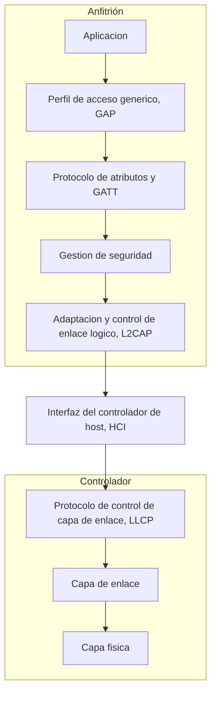
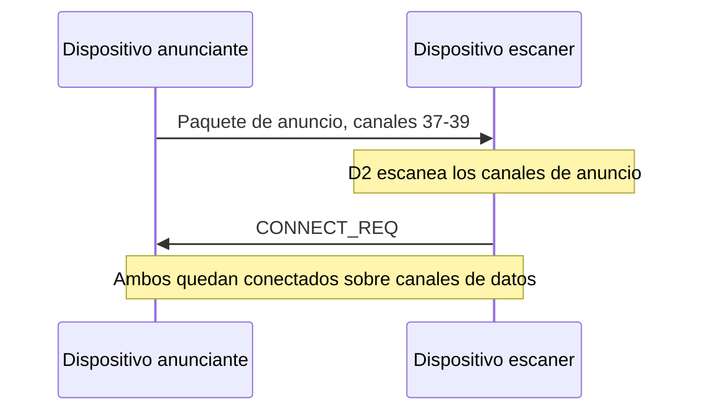
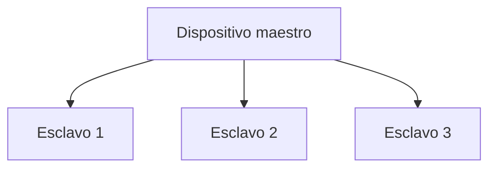
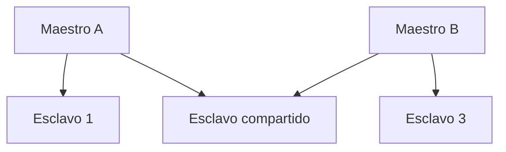

Este capítulo cierra el área de redes inalámbricas con la tecnología de acceso de
referencia para la red de área personal presentada al abrir esta misma área. Recorre el
origen del estándar Bluetooth, sus variantes clásica y de bajo consumo, la arquitectura
de protocolos que comparten, el direccionamiento de dispositivos y de servicios, la capa
física y el procedimiento de conexión propios de la variante de bajo consumo, las
topologías que forma y la pila de protocolos y los perfiles que garantizan la
interoperabilidad entre fabricantes.

## Introducción

**Bluetooth** es un estándar inalámbrico global de corto alcance que sustituye el cable
de datos entre dispositivos electrónicos personales, como teléfonos móviles,
auriculares, altavoces, impresoras, teclados y ratones, por un enlace radio de bajo
coste y bajo consumo. El estándar sitúa su tecnología de acceso en el ámbito de la red
de área personal de la
[taxonomía inalámbrica](../01_panorama/section_1_taxonomia_y_arquitecturas.md#redes-de-area-personal)
presentada al abrir esta área, con una cobertura del orden de la decena de metros y un
consumo muy por debajo del que exige una red de área local.

## Evolución del estándar

En 1994, Ericsson investigó un sistema de radio de bajo consumo y bajo coste para la
interfaz entre teléfonos móviles y sus accesorios. De ese trabajo nació el **Grupo de
Interés Especial de Bluetooth** (Bluetooth SIG), fundado con Ericsson, Intel, Nokia,
Toshiba e IBM como miembros originales y que, a partir de 2015, superaba los 26 000
miembros.

El estándar ha evolucionado a través de varias versiones sucesivas, cada una mejorando o
añadiendo funcionalidades sobre la anterior:

- Bluetooth 1.0, 1.0B, 1.1 y 1.2, publicadas entre 1999 y 2003, y Bluetooth 2.0, de
  2004, son versiones hoy obsoletas.
- Bluetooth 2.1 (2007) introduce `EDR` (_enhanced data rate_, tasa de datos mejorada) y
  un emparejamiento simple y seguro.
- Bluetooth 3.0 (2009) introduce `HS` (_high speed_, velocidad alta), que incorpora
  WiMedia UWB y 802.11 como capas físicas alternativas de alta velocidad.
- Bluetooth 4.0 (2010), 4.1 (2013) y 4.2 (2014) introducen el bajo consumo, es decir, la
  variante BLE que desarrolla el resto de este capítulo.
- Bluetooth 5 (2016) mejora el alcance, la velocidad y la capacidad de transmisión de
  datos.
- Bluetooth 5.1 (2019) introduce la estimación de
  [ángulo de llegada](../03_ad_hoc/section_2_localizacion.md#angulo-de-llegada) y de
  ángulo de salida (`AoA`/`AoD`), que permiten una localización direccional del
  dispositivo.
- Bluetooth 5.2 (2020) mejora la seguridad y la eficiencia energética.
- Bluetooth 5.3 (2021) añade funciones de localización y de detección de direcciones.

Estas versiones sucesivas mejoran, en conjunto, la velocidad de transferencia, el
alcance, la eficiencia energética, la seguridad y la compatibilidad con otros estándares
inalámbricos, sin alterar el propósito original del estándar como sustituto del cable de
datos entre dispositivos personales.

## Variantes

El estándar Bluetooth se divide en tres tipos principales, que se diferencian por el
compromiso que adoptan entre ancho de banda, consumo de energía y alcance.

### Bluetooth clásico

**Bluetooth clásico** (`BR/EDR`, _basic rate / enhanced data rate_) está diseñado para
aplicaciones de transferencia de datos de alto ancho de banda, con velocidades de hasta
3 Mbit/s y un alcance de aproximadamente 100 metros. Es la variante que emplea la
canalización de siete dispositivos por _piconet_ que se describe más adelante en las
topologías de este capítulo.

### Modo dual

**Bluetooth Smart Ready**, o modo dual, combina la funcionalidad del Bluetooth clásico y
del Bluetooth de bajo consumo en un mismo dispositivo, lo que le permite comunicarse
indistintamente con equipos de uno u otro tipo. Es el modo habitual de un teléfono móvil
o un ordenador, que necesita interoperar tanto con auriculares clásicos de alto ancho de
banda como con sensores de bajo consumo.

### Bluetooth de bajo consumo

**Bluetooth Smart**, de modo único, es la variante de bajo consumo (`BLE`, _Bluetooth
low energy_), optimizada para aplicaciones de baja transferencia de datos y consumo de
energía reducido, con un alcance de aproximadamente 50 metros. Su velocidad máxima
depende del esquema de capa física que emplea, `LE 1M` o `LE 2M`, descritos más adelante
en este capítulo: la capa física original de BLE, `LE 1M`, alcanza 1 Mbit/s, mientras
que `LE 2M`, introducida en Bluetooth 5 y hoy la más extendida en dispositivos
compatibles, duplica esa cifra hasta 2 Mbit/s a cambio de exigir una relación
señal-ruido más favorable en el receptor. Resulta idónea para dispositivos alimentados
por batería, como sensores y dispositivos de _fitness_, que deben operar durante meses o
años sin recambio ni recarga. La elección entre las tres variantes depende de los
requisitos concretos de la aplicación en ancho de banda, consumo de energía y alcance,
el mismo compromiso estructural entre alcance, consumo y velocidad que rige la elección
de tecnología de acceso en general.

## Arquitectura

La arquitectura de Bluetooth se organiza en dos partes principales, el anfitrión y el
controlador, comunicadas mediante una interfaz estándar entre ambas.

### Anfitrión y controlador

El **anfitrión** aloja las capas superiores de la pila, desde la aplicación hasta el
protocolo de adaptación y control de enlace lógico, y suele ejecutarse en el procesador
principal del dispositivo. El **controlador** aloja la capa de enlace y la capa física,
y suele residir en un chip de radio dedicado. Existen dos tipos de controladores
primarios, `BR/EDR` y `LE`, uno por cada variante clásica y de bajo consumo, además de
controladores secundarios denominados **controladores MAC/PHY alternos** (`AMP`), que
Bluetooth 3.0 introduce para incorporar capas físicas de alta velocidad ajenas a la
especificación principal, como WiMedia UWB o 802.11.

### Interfaz entre anfitrión y controlador

La **interfaz del controlador de host** (`HCI`, _host controller interface_) es la
interfaz estándar que separa el subsistema del controlador Bluetooth del anfitrión. Esta
separación en dos bloques comunicados por una interfaz bien definida permite que un
mismo anfitrión de propósito general se combine con controladores de fabricantes
distintos sin que el software de las capas superiores necesite conocer los detalles del
chip de radio concreto que tiene debajo, un principio de diseño análogo a la separación
entre la parte de convergencia y la parte dependiente del medio físico que estructura la
capa física de 802.11.

## Direccionamiento

Bluetooth necesita identificar tanto a los dispositivos que participan en una conexión
como, dentro de cada dispositivo BLE, los servicios y las características concretas que
ofrece a sus pares.

### Dirección de dispositivo

Cada dispositivo Bluetooth tiene una dirección única (`bd_addr`) de 48 bits, compuesta
por tres campos: la **parte inferior de la dirección** (`LAP`), de 24 bits; la **parte
no significativa de la dirección** (`NAP`), de 16 bits; y la **parte superior de la
dirección** (`UAP`), de 8 bits.

| Campo | Longitud | Contenido                               |
| ----- | -------- | --------------------------------------- |
| `LAP` | 24 bits  | Parte inferior de la dirección.         |
| `NAP` | 16 bits  | Parte no significativa de la dirección. |
| `UAP` | 8 bits   | Parte superior de la dirección.         |

### Tipos de dirección en bajo consumo

BLE define cuatro tipos de dirección de dispositivo, que se diferencian por cómo se
asignan y por si un observador externo puede vincularlas a la identidad real del
dispositivo:

- La **dirección pública de dispositivo** la asigna el fabricante de forma fija y no
  cambia durante la vida del dispositivo.
- La **dirección estática aleatoria** se genera de forma aleatoria al encender el
  dispositivo y puede mantenerse fija hasta el siguiente encendido.
- La **dirección privada no resoluble** es una dirección aleatoria que ningún otro
  dispositivo puede vincular a la identidad del emisor.
- La **dirección privada resoluble** es una dirección aleatoria que sí puede resolverse,
  mediante una tabla hash y una clave de resolución que solo conocen los dispositivos ya
  vinculados con el emisor.

Las dos últimas son la base de la protección de privacidad de BLE frente al rastreo por
proximidad: un dispositivo que cambia periódicamente su dirección privada resoluble
sigue siendo identificable por sus pares vinculados, que conocen la clave de resolución,
pero resulta indistinguible para cualquier otro observador que solo vea direcciones
cambiando sin poder relacionarlas entre sí.

### Identificadores de servicio y de característica

Dentro de un dispositivo BLE, el direccionamiento a nivel de aplicación no identifica
dispositivos sino servicios y características, mediante un **identificador único
universal** (`UUID`). Existen `UUID` de 16 bits, reservados por el Bluetooth SIG para
servicios y características estándar, y `UUID` de 128 bits, para aplicaciones
personalizadas que no necesitan registrar su identificador ante el SIG. Esta distinción
entre identificadores estándar y personalizados es la que permite que un mismo
dispositivo BLE combine servicios genéricos, reconocibles de inmediato por cualquier
aplicación cliente, con servicios propios de un fabricante concreto.

## Capa física de bajo consumo

La capa física de BLE opera en la banda sin licencia de 2,4 GHz, la misma banda que
comparten otras tecnologías de corto alcance presentadas en esta área, y organiza esa
banda en un conjunto de canales estrechos sobre los que aplica un transceptor de salto
de frecuencia.

### Canalización de la banda de 2,4 GHz

La banda de 2,4 GHz, que abarca de 2400 MHz a 2483,5 MHz, se divide en 40 canales de
radiofrecuencia con un espaciado de 2 MHz cada uno. De esos 40 canales, tres, los
canales 37, 38 y 39, se designan como **canales de anuncio**, empleados para configurar
conexiones y transmitir información antes de que exista un enlace establecido; los 37
canales restantes se emplean como **canales de datos**, una vez la conexión ya está
establecida.

| Canales                  | Cantidad | Uso                                              |
| ------------------------ | -------- | ------------------------------------------------ |
| 37, 38 y 39              | 3        | Canales de anuncio: configuración de conexiones. |
| Los 37 canales restantes | 37       | Canales de datos, sobre conexión ya establecida. |

### Modulación y esquemas de velocidad

BLE emplea **desplazamiento de frecuencia gaussiana** (`GFSK`, _Gaussian frequency shift
keying_), la variante de la familia FSK descrita en
[modulaciones digitales](../../01_fundamentos/03_modulacion/section_2_modulaciones_digitales.md#fsk)
que suaviza la transición entre frecuencias con un filtro gaussiano antes de modular,
para reducir la ocupación espectral fuera de la banda de cada canal. Sobre esa
modulación, BLE define dos esquemas de capa física de velocidad de datos estándar:
`LE 1M`, la capa física original de BLE desde su primera especificación, a 1 Mbit/s, y
`LE 2M`, introducida en Bluetooth 5, que duplica esa velocidad a 2 Mbit/s a cambio de
exigir una relación señal-ruido más favorable en el receptor. Un dispositivo que admite
`LE 2M` sigue soportando `LE 1M` para mantener compatibilidad con pares más antiguos, de
modo que la velocidad máxima que alcanza una conexión BLE concreta depende de si ambos
extremos negocian el esquema de mayor velocidad, no de un único valor fijo para toda la
variante de bajo consumo. Un tercer esquema, denominado en ocasiones `LE 3M`, no forma
parte de la especificación estándar de BLE, cuyas velocidades normalizadas son
únicamente `LE 1M` y `LE 2M`.

### Salto de frecuencia

BLE emplea un **transceptor de salto de frecuencia** para combatir la interferencia de
banda estrecha y el desvanecimiento selectivo en frecuencia: en lugar de permanecer en
un único canal durante toda la conexión, transmisor y receptor cambian de canal de datos
siguiendo una secuencia pseudoaleatoria conocida por ambos, de modo que una
interferencia sostenida sobre un canal concreto solo afecta a una fracción de las
transmisiones. Esta técnica aplica, sobre la canalización de la banda de 2,4 GHz
descrita arriba, el mismo principio de ensanchamiento por salto que emplea la capa
física FHSS de
[IEEE 802.11](../02_wlan/section_1_802_11_arquitectura_y_capa_fisica.md#espectro-ensanchado-por-salto-de-frecuencia),
que este capítulo no repite. A diferencia del ensanchamiento por secuencia directa
descrito para
[espectro ensanchado y CDMA](../../01_fundamentos/04_acceso_al_medio/section_3_espectro_ensanchado_y_cdma.md),
que ensancha la señal de forma continua sobre toda la banda disponible, el salto de
frecuencia ocupa en cada instante un único canal estrecho de 2 MHz y evita la
interferencia simplemente saltando fuera de ella en el siguiente intervalo.

## Establecimiento de conexión

El procedimiento de conexión de BLE distingue una fase de anuncio y escaneo, previa a
cualquier enlace, de una fase de emparejamiento y cifrado, posterior al establecimiento
del enlace de datos.

### Canales de anuncio

Antes de que exista ninguna conexión, un dispositivo **anunciante** transmite paquetes
de anuncio de forma periódica sobre los tres canales de anuncio, 37, 38 y 39, para darse
a conocer a cualquier dispositivo próximo que esté escaneando. El intervalo con el que
se repiten esos paquetes, el **intervalo de anuncio**, es un parámetro configurable que
enfrenta directamente la latencia de descubrimiento con el consumo del dispositivo
anunciante, como se cuantifica en el ejemplo siguiente.

### Proceso de anuncio y escaneo

El proceso de conexión sigue una secuencia de cuatro pasos entre el dispositivo
anunciante y el dispositivo que busca conectarse:

El dispositivo anunciante transmite en los canales de anuncio. El dispositivo escáner
escanea esos paquetes y selecciona un anunciante con el que conectarse. El escáner se
convierte entonces en el **iniciador** y envía una solicitud de conexión
(`CONNECT_REQ`). Una vez que el anunciante ha recibido ese paquete, ambos dispositivos
quedan conectados y pasan a comunicarse sobre los canales de datos con salto de
frecuencia descritos en la capa física.

???+ example "Compromiso entre intervalo de anuncio, intervalo de conexión y consumo"

    Un sensor BLE alimentado por una pila de botón debe permanecer detectable por un
    teléfono cercano sin agotar su batería en pocas semanas. El fabricante evalúa dos
    configuraciones del intervalo de anuncio, el tiempo que transcurre entre paquetes
    de anuncio consecutivos mientras el sensor todavía no está conectado.

    Con un intervalo de anuncio corto, de unas decenas de milisegundos, el sensor
    resulta detectable casi de inmediato en cuanto el teléfono entra en su alcance, a
    costa de transmitir muchos más paquetes de anuncio por segundo y consumir energía
    de forma proporcional a esa frecuencia de transmisión. Con un intervalo de anuncio
    largo, de varios segundos, el sensor reduce su consumo de anuncio en la misma
    proporción, pero el teléfono puede tardar ese mismo margen de varios segundos en
    detectarlo, porque solo lo encuentra si su ventana de escaneo coincide con uno de
    los paquetes de anuncio, cada vez más espaciados entre sí.

    El mismo compromiso se repite, una vez establecida la conexión, con el
    **intervalo de conexión**, el periodo con el que transmisor y receptor se
    despiertan para intercambiar datos sobre el canal ya establecido: un intervalo de
    conexión corto reduce el retardo de cualquier intercambio de datos a costa de
    mantener la radio activa con más frecuencia, mientras que un intervalo de conexión
    largo prolonga la vida de la batería a costa de introducir más retardo en cada
    intercambio. Este compromiso entre latencia y consumo, resuelto ajustando dos
    intervalos independientes según la fase de la comunicación, es la decisión de
    diseño central de la variante de bajo consumo del estándar.

### Emparejamiento y vinculación

El **emparejamiento** autentica la identidad de los dos dispositivos, cifra el enlace
mediante una **clave a corto plazo** (`STK`) y distribuye **claves a largo plazo**
(`LTK`) que sobreviven a la desconexión. La **vinculación** (_bonding_) almacena esas
claves a largo plazo para que dos dispositivos ya emparejados puedan reconectarse de
forma automática, sin repetir el proceso de emparejamiento completo, en cuanto vuelven a
estar dentro de alcance.

### Cifrado y autenticación

El cifrado del enlace BLE se basa en `AES-CCM` de 128 bits, aplicado sobre las claves
distribuidas durante el emparejamiento. La autenticación de los datos se proporciona
mediante firma digital de los mensajes, utilizando la **clave de resolución de firma de
conexión** (`CSRK`), que permite a un dispositivo verificar que un dato firmado procede
efectivamente del par con el que se emparejó, sin necesidad de cifrar ese dato concreto.

## Topologías

Bluetooth forma dos topologías básicas, según cuántos dispositivos participan y cómo se
agrupan los canales físicos entre ellos.

### Piconet

En Bluetooth clásico, el canal físico puede compartirse entre hasta 7 dispositivos
esclavos alrededor de un único dispositivo maestro, que coordina el acceso al medio de
todos ellos. Esa agrupación de un maestro y sus esclavos, sincronizados sobre el mismo
canal físico, es una **_piconet_**. En BLE, la organización de la _piconet_ es distinta:
cada conexión establecida mediante el procedimiento descrito arriba vincula directamente
al dispositivo que inició la conexión con el dispositivo anunciante, sin el límite fijo
de siete esclavos propio de Bluetooth clásico.

???+ example "Número máximo de dispositivos activos en una _piconet_ clásica"

    Una _piconet_ de Bluetooth clásico agrupa un único dispositivo maestro y hasta 7
    dispositivos esclavos sobre el mismo canal físico. El número total de dispositivos
    que participan en la _piconet_, maestro incluido, es por tanto de

    $$
    N_\text{piconet} = 1 + 7 = 8\ \text{dispositivos}
    $$

    Ese límite de siete esclavos por maestro es una propiedad de la canalización de
    Bluetooth clásico, no de BLE, cuya organización de conexiones, descrita arriba, no
    impone el mismo tope fijo.

### Scatternet

Una **_scatternet_** es la unión de varias _piconets_ que comparten al menos un
dispositivo. En una _scatternet_, cada dispositivo esclavo compartido se comunica con
cada uno de sus maestros en un canal físico separado, lo que le permite participar en
más de una _piconet_ sin que ambas interfieran entre sí, a costa de tener que repartir
su tiempo de radio entre los distintos canales físicos en los que participa.

???+ example "Capacidad de dispositivos de una _scatternet_ frente a una _piconet_"

    Dos _piconets_ de Bluetooth clásico, cada una con su propio maestro y hasta 7
    esclavos, comparten un único dispositivo esclavo que actúa de puente entre ambas.
    El número de dispositivos distintos que la _scatternet_ resultante llega a
    sostener, sin contar dos veces al esclavo compartido, es

    $$
    N_\text{scatternet} = \underbrace{2}_\text{maestros} +
    \underbrace{(7 + 7 - 1)}_\text{esclavos, uno compartido} = 15\ \text{dispositivos}
    $$

    frente a los 8 dispositivos que sostiene una única _piconet_ aislada. La
    _scatternet_ multiplica así el alcance del conjunto a costa de que el esclavo
    compartido reparta su tiempo de radio entre los canales físicos de sus dos
    maestros, en lugar de dedicarlo por completo a uno solo.

## Pila de protocolos

La **arquitectura del sistema central de BLE** (_BLE core system architecture_) organiza
la pila de protocolos en un controlador y un anfitrión, sobre la separación ya
introducida en la arquitectura general del estándar.

### Capa de enlace y su protocolo de control

La **capa de enlace**, dentro del controlador, define la estructura del paquete y los
procedimientos de descubrimiento, escaneo y publicidad descritos en el establecimiento
de conexión de este capítulo. Sobre ella opera el **protocolo de control de capa de
enlace** (`LLCP`), que controla y negocia los aspectos de la operación de una conexión
ya establecida entre las dos capas de enlace de los dispositivos conectados. La capa de
enlace admite dos formatos de paquete, `LE Uncoded PHYs` y `LE Coded PHYs`, este último
pensado para extender el alcance a costa de una tasa de codificación menor.

### Control y adaptación de enlace lógico

El **protocolo de adaptación y control de enlace lógico** (`L2CAP`), dentro del
anfitrión, transmite paquetes hacia la `HCI` o directamente hacia la capa de enlace en
un sistema sin anfitrión separado. `L2CAP` multiplexa entre sí los protocolos superiores
de la pila, el protocolo de atributos, el protocolo de gestión de seguridad y la
señalización de control de capa de enlace, de modo que todos ellos comparten el mismo
canal físico subyacente sin interferirse.

### Gestión de seguridad

El **protocolo de gestión de seguridad** gestiona la integridad, la autenticación y el
cifrado entre dispositivos, aplicando en la práctica los mecanismos de emparejamiento,
vinculación, cifrado y autenticación descritos en el establecimiento de conexión de este
capítulo.

### Protocolo de atributos y perfil genérico de atributos

El **protocolo de atributos** (`ATT`) define el mecanismo de intercambio de datos una
vez establecida una conexión, en términos de atributos individuales identificados por un
`UUID`. El **perfil genérico de atributos** (`GATT`) define cómo se organizan e
intercambian los mensajes estándar utilizando `ATT` como mecanismo de transporte,
agrupando los atributos individuales en los servicios y características cuyo
direccionamiento se describe en este capítulo.

### Perfil de acceso genérico

El **perfil de acceso genérico** (`GAP`) define los requisitos básicos de un dispositivo
Bluetooth y sus operaciones fundamentales: descubrir y conectarse con pares, difundir
datos, establecer conexiones seguras y definir la topología de la pila de red. Es el
perfil que toda implementación de BLE debe admitir, con independencia de qué otros
perfiles de aplicación adopte además.

## Perfiles de aplicación

Los **perfiles Bluetooth** definen las funciones y las características requeridas en
cada capa del sistema, desde la capa física hasta `L2CAP` y cualquier protocolo ajeno a
la especificación principal, y son el mecanismo que garantiza la interoperabilidad entre
dispositivos de fabricantes distintos: dos dispositivos Bluetooth solo resultan
compatibles entre sí si ambos admiten el mismo perfil.

Para `BR/EDR`, existe una amplia gama de perfiles orientados a aplicaciones de alto
ancho de banda, como la transferencia de audio o de ficheros. Para `LE`, los perfiles
son más simples y, con frecuencia, cada uno proporciona un único servicio. Algunos
perfiles `LE` representativos son:

| Perfil                                | Función                                                                   |
| ------------------------------------- | ------------------------------------------------------------------------- |
| Notificación de alerta (`ANP`)        | Expone información de alerta de un dispositivo.                           |
| Búsqueda de dispositivo (`FMP`)       | Define el comportamiento de alerta al pulsar un botón en un dispositivo.  |
| Termómetro de salud (`HTP`)           | Envía datos desde un sensor de termómetro.                                |
| Frecuencia cardíaca (`HRP`)           | Envía datos desde un sensor de frecuencia cardíaca.                       |
| Estado de alerta de teléfono (`PASP`) | Envía el estado de alerta y de timbre del teléfono y permite modificarlo. |

Bluetooth y su variante de bajo consumo cierran así el recorrido de esta área por las
redes inalámbricas: desde la taxonomía y las arquitecturas que abren el área, a través
de la red de área local de IEEE 802.11, las redes móviles sin infraestructura y las
tecnologías de área amplia y bajo consumo, hasta la red de área personal que Bluetooth
representa como referencia de acceso de corto alcance y consumo mínimo. Cada tecnología
de esta área resuelve el mismo compromiso estructural entre alcance, consumo y velocidad
en un punto distinto, y Bluetooth ocupa el extremo de menor alcance y menor consumo del
conjunto.
