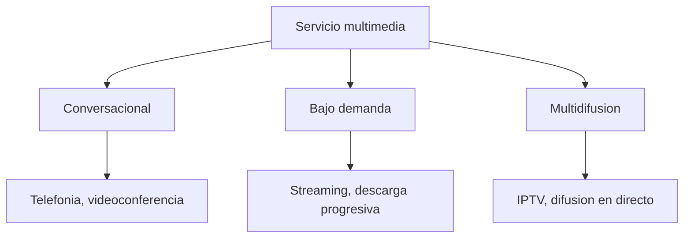

Un servicio multimedia combina varios tipos de información, como voz, audio, vídeo e
imagen, en un mismo flujo de comunicación, y esa combinación le impone a la red unos
requisitos que un servicio de datos convencional no exige. Este capítulo abre el área de
servicios estableciendo qué hace multimedia a un servicio, cómo se clasifican según su
patrón de interactividad y dirección, qué requisitos de calidad impone cada clase en
términos de velocidad, retardo, variación del retardo y pérdida de paquetes, y cómo se
caracteriza el tráfico que generan el audio y el vídeo comprimidos. El resto del área
retoma, en capítulos sucesivos, la señalización que establece estas sesiones, los
protocolos de transporte en tiempo real que llevan sus flujos, el subsistema que integra
estos servicios sobre una red celular, la distribución en modo difusión y la calidad de
servicio y de experiencia que perciben sus usuarios.

## Introducción

Un **servicio multimedia** es un servicio de telecomunicación que integra varios tipos
de información, entre ellos texto, imagen, audio y vídeo, en una única sesión de
comunicación, con el objetivo de ofrecer al usuario una experiencia más completa que la
que ofrecería cualquiera de esos tipos de información por separado. Un servicio de voz
convencional o un servicio de transferencia de ficheros no son multimedia porque
transportan un único tipo de información, mientras que una videollamada, que combina
audio y vídeo sincronizados, sí lo es.

Frente a un servicio de datos convencional, un servicio multimedia introduce tres
diferencias que atraviesan todo este capítulo. La primera es un requisito de velocidad
mucho más exigente, porque el audio y sobre todo el vídeo generan un volumen de
información por segundo muy superior al de un texto o una página web. La segunda es que
buena parte de estos servicios exige entrega en tiempo real, de modo que el retraso o la
irregularidad con que llega la información degradan directamente la experiencia del
usuario, algo que no ocurre con un fichero que se descarga completo antes de utilizarse.
La tercera es que sus requisitos de velocidad, retardo, variación del retardo y pérdida
de paquetes no son uniformes: varían de una clase de servicio a otra, y esa variación es
precisamente lo que impone diseñar la red, y elegir el protocolo de transporte, de forma
distinta según la clase de servicio que se atiende.

## Clasificación de los servicios multimedia

Los servicios multimedia se clasifican en tres categorías según el patrón de
interactividad y de dirección que establecen entre los usuarios que participan en ellos.
Esta clasificación es la que determina, más adelante en el capítulo, qué requisitos de
calidad impone cada categoría a la red.

### Servicios conversacionales

Un **servicio conversacional** permite la comunicación en tiempo real entre dos o más
usuarios, con flujo de información en ambos sentidos y con cada extremo generando y
consumiendo información de forma simultánea. La telefonía sobre IP y la videoconferencia
son los ejemplos característicos de esta categoría. Lo que define a un servicio
conversacional no es tanto el tipo de contenido que transporta, sino que ambos extremos
participan de forma activa y encadenada: lo que un extremo dice condiciona lo que el
otro responde, de modo que cualquier retraso introducido en un sentido se traslada de
inmediato a la fluidez de la conversación completa.

### Servicios bajo demanda

Un **servicio bajo demanda** ofrece acceso a contenido multimedia ya almacenado, que un
único usuario solicita y consume en el momento que elige, sin que exista una
comunicación bidireccional entre participantes equivalente a la de un servicio
conversacional. El vídeo y el audio en _streaming_, así como la descarga progresiva de
contenido, son los ejemplos característicos. El flujo de información relevante es
unidireccional, del servidor que almacena el contenido hacia el usuario que lo consume,
aunque exista un canal de señalización en sentido contrario para controlar la
reproducción.

### Servicios de multidifusión

Un **servicio de multidifusión** distribuye el mismo contenido multimedia a un grupo de
usuarios de forma simultánea, con un único origen y muchos destinos que reciben idéntica
información al mismo tiempo. La televisión sobre IP y la difusión de audio o vídeo en
directo son los ejemplos característicos de esta categoría. A diferencia de un servicio
bajo demanda, donde cada usuario controla de forma independiente cuándo consume el
contenido, un servicio de multidifusión impone un mismo instante de consumo a todos sus
destinatarios, lo que introduce requisitos propios de distribución que se retoman en un
capítulo posterior de esta área dedicado específicamente a los servicios de difusión.

## Requisitos que imponen a la red

Cada una de las tres clases anteriores impone a la red un perfil distinto de exigencia,
que se describe mediante cuatro magnitudes de calidad de servicio: la velocidad
necesaria, el retardo tolerable, la variación de ese retardo y la fracción de paquetes
que el servicio puede perder sin que la experiencia del usuario se degrade de forma
perceptible. Estas cuatro magnitudes no se fijan de forma independiente entre sí: el
motivo por el que un servicio conversacional tolera mal el retardo pero tolera bien la
pérdida, mientras que un servicio bajo demanda invierte exactamente ese compromiso, es
el hilo conductor de esta sección. El capítulo de
[calidad de servicio en redes IP](../05_qos_y_qoe/section_1_qos_en_redes_ip.md#indicadores-de-calidad-de-servicio)
retoma estas mismas magnitudes ya aplicadas específicamente al transporte sobre una red
IP, con sus propios componentes de retardo y sus propios mecanismos de garantía.

### Velocidad

La **velocidad** que exige un servicio multimedia es la tasa de bits necesaria para
transmitir su contenido sin interrupciones, y depende de la naturaleza de la fuente y
del algoritmo de compresión que se le aplica. La derivación de esa tasa a partir de la
frecuencia de muestreo, la resolución y la profundidad de color de la fuente sin
comprimir se trata en el capítulo que
[caracteriza las señales de audio y de vídeo](../../01_fundamentos/01_senales/section_1_senales_e_informacion.md);
lo que añade este capítulo es que la tasa resultante de aplicar compresión no es fija
para todos los servicios, sino que depende de la clase de servicio y del algoritmo
elegido, como se detalla en la sección de compresión más adelante.

???+ example "Régimen binario de una videollamada frente a la capacidad de un enlace"

    Una videollamada codifica vídeo a una resolución de 640 por 480 píxeles, con una
    profundidad de color de 24 bits por píxel y una tasa de 25 fotogramas por segundo, sin
    aplicar todavía ninguna compresión. Se pide el régimen binario sin comprimir que
    exige esa fuente de vídeo y si un enlace de acceso de 2 Mbit/s podría cursarla sin
    compresión.

    El régimen binario sin comprimir es
    $R_{\text{video}} = \text{fps} \cdot \text{resolución} \cdot \text{bpp} =
    25 \cdot (640 \cdot 480) \cdot 24 \approx 184$ Mbit/s, casi cien veces superior a la
    capacidad del enlace de 2 Mbit/s. Un enlace de acceso típico no puede cursar vídeo
    sin comprimir en ningún escenario doméstico razonable, lo que es precisamente la
    razón por la que ningún servicio de vídeo real se transmite sin aplicar antes un
    algoritmo de compresión, tratado en la sección dedicada a ese tema en este mismo
    capítulo.

### Retardo

El **retardo** es el tiempo que tarda la información en llegar desde la fuente hasta el
usuario que la consume. Su origen y su modelado mediante teoría de colas se desarrollan
en el capítulo dedicado a la
[teoría de colas](../../06_trafico/01_colas/section_1_teoria_de_colas.md); lo que
importa aquí es cuánto retardo tolera cada clase de servicio antes de que la experiencia
del usuario se degrade de forma perceptible.

Un servicio conversacional exige un retardo extremo a extremo bajo, del orden de 200 ms
o menos, porque el retardo interfiere directamente con el propio mecanismo de la
conversación: un retardo elevado obliga a los interlocutores a esperar antes de
responder, produce solapamientos entre turnos de palabra y, superado un umbral, hace la
conversación impracticable. Un servicio bajo demanda o de multidifusión, en cambio,
tolera un retardo inicial de varios segundos sin que la experiencia se vea afectada de
forma apreciable, porque ese retardo se traduce únicamente en un tiempo de arranque
antes de que comience la reproducción, no en una interferencia con ningún intercambio en
curso.

### Variación del retardo

La **variación del retardo**, o _jitter_, mide cuánto fluctúa el retardo de un paquete a
otro dentro del mismo flujo. A diferencia del retardo medio, que un usuario percibe como
una latencia constante, la variación del retardo es perjudicial porque introduce
irregularidad en la llegada de la información: si el receptor reproduce las muestras al
ritmo con que llegan, esa irregularidad se traduce en cortes y cambios de velocidad
perceptibles en el audio o el vídeo reproducido.

La técnica habitual para absorber esta variación es el **búfer de reproducción**, una
memoria intermedia en el receptor que retiene las muestras recibidas durante un tiempo
fijo antes de empezar a reproducirlas, de modo que las fluctuaciones del retardo se
absorben dentro del propio búfer y la reproducción avanza a un ritmo constante mientras
la variación observada no exceda el margen que el búfer ofrece. Dimensionar este búfer
exige un compromiso: un búfer grande absorbe una variación del retardo mayor, pero añade
el mismo margen como retardo adicional antes de que empiece la reproducción, lo que
penaliza a los servicios conversacionales, que ya operan con un presupuesto de retardo
ajustado. Este mismo mecanismo, aplicado específicamente al vídeo en flujo continuo con
sus valores típicos de margen, se trata en detalle como almacenamiento de desacoplo en
el capítulo de
[calidad de experiencia](../05_qos_y_qoe/section_2_calidad_de_experiencia.md#almacenamiento-inicial-y-rellenado-de-buffer).

???+ example "Dimensionado de un búfer de reproducción frente a variaciones de retardo"

    Un receptor de audio en _streaming_ mide que el retardo de los paquetes que le
    llegan fluctúa entre 40 ms y 160 ms, con un valor típico en torno a 80 ms. Se pide un
    tamaño de búfer de reproducción, expresado en tiempo, que absorba esa variación sin
    introducir cortes en la reproducción.

    El margen de variación observado es la diferencia entre el retardo máximo y el
    mínimo, $160 - 40 = 120$ ms. Un búfer que retiene las muestras durante al menos
    120 ms antes de empezar a reproducirlas asegura que, incluso en el caso más
    desfavorable en que un paquete llega con el retardo máximo de 160 ms, la muestra ya
    está disponible en el búfer cuando le corresponde reproducirse, porque el búfer
    empezó a acumular datos 120 ms antes tomando como referencia el paquete que llegó
    con el retardo mínimo. En la práctica se añade un margen adicional sobre ese mínimo
    teórico para cubrir variaciones puntuales mayores que las observadas durante la
    medida, a costa de aumentar el retardo total antes de que comience la reproducción.

### Pérdida de paquetes

La **pérdida de paquetes** es la fracción de la información transmitida que no llega a
su destino, ya sea porque se descarta en un nodo intermedio congestionado o porque llega
fuera del margen de tiempo que el receptor puede seguir esperando. A diferencia del
retardo y de su variación, la pérdida de paquetes admite tolerancias muy distintas según
la clase de servicio, y esa diferencia es la más ilustrativa de todo el capítulo.

Un servicio conversacional de voz tolera una pérdida de paquetes moderada, porque el
oído humano interpola de forma natural fragmentos breves de audio ausente sin que la
inteligibilidad de la conversación se vea comprometida, y porque retransmitir un paquete
perdido casi siempre llega demasiado tarde para ser útil dentro de su presupuesto de
retardo de 200 ms. Un servicio bajo demanda, en cambio, no tolera bien la pérdida sin
corrección, porque cada muestra ausente en un vídeo o en un fichero de audio resulta
perceptible como un artefacto visual o sonoro, pero sí dispone de margen para
retransmitir lo perdido, porque su presupuesto de retardo se mide en segundos y no en
milisegundos.

Esta asimetría es la que explica por qué un servicio conversacional prioriza minimizar
el retardo sobre garantizar la entrega completa, mientras que un servicio bajo demanda
invierte exactamente esa prioridad y tolera un retardo inicial mayor a cambio de
garantizar que todo el contenido llegue sin pérdidas. La elección del protocolo de
transporte que cada clase de servicio utiliza, descrita en la sección siguiente y
desarrollada en detalle en un capítulo posterior de esta área, es la consecuencia
directa de este compromiso.

???+ example "Por qué un servicio conversacional prefiere perder un paquete a esperarlo"

    Una llamada de voz sobre IP tiene un presupuesto de retardo extremo a extremo de
    150 ms. Un paquete de voz se pierde en la red, y el emisor podría retransmitirlo, lo
    que añadiría al menos un tiempo de ida y vuelta completo, del orden de 60 ms en una
    red de área metropolitana, antes de que la retransmisión llegue. Se pide razonar si
    conviene retransmitir ese paquete o descartarlo.

    Si el paquete original ya ha consumido una parte apreciable del presupuesto de
    150 ms cuando se detecta su pérdida, la retransmisión difícilmente llega dentro del
    tiempo que queda de presupuesto, y aunque llegara, el receptor ya habría tenido que
    reproducir el silencio o la interpolación correspondiente a ese instante para no
    introducir un retardo adicional en el resto de la conversación. Por eso los servicios
    conversacionales descartan el paquete perdido y confían en la tolerancia del oído
    humano a fragmentos breves de audio ausente, en lugar de retransmitirlo como haría un
    servicio de datos convencional.

## Clasificaciones normalizadas

Además de la clasificación funcional anterior, existen dos clasificaciones normalizadas
que fijan requisitos de calidad de servicio como categorías cerradas, pensadas para que
la red pueda reservar recursos o priorizar tráfico de forma automática según la
categoría declarada de cada flujo.

### Categorías de tráfico en redes ATM

Las redes ATM clasifican el tráfico en cinco categorías según su comportamiento de
velocidad y su exigencia de tiempo real: `CBR`, de velocidad constante; `rt-VBR`, de
velocidad variable en tiempo real; `nrt-VBR`, de velocidad variable sin tiempo real;
`ABR`, de ancho de banda variable con una tasa mínima garantizada; y `UBR`, sin ninguna
garantía de ancho de banda. Un servicio conversacional de voz sobre circuitos encaja de
forma natural en la categoría `CBR`, mientras que un servicio de vídeo comprimido con
tasa variable, que se describe más adelante en este capítulo, encaja en `rt-VBR` si
exige tiempo real o en `nrt-VBR` si no lo exige.

### Clases de servicio en redes celulares

Las redes celulares definidas por el 3GPP clasifican el tráfico en cuatro categorías
según sus requisitos de tiempo real y de tasa de error: conversacional, para telefonía y
videoconferencia; _streaming_, para vídeo bajo demanda; interactivo, para navegación web
y juegos en red; y _background_, para correo electrónico y transferencia de ficheros sin
requisito de tiempo real. Las dos primeras categorías corresponden directamente a los
servicios conversacionales y bajo demanda descritos al inicio del capítulo, mientras que
las dos últimas cubren tráfico de datos convencional que queda fuera del ámbito de este
capítulo. Cómo estas categorías se traducen en indicadores concretos de rendimiento
sobre una red celular en operación se trata en el capítulo dedicado a la
[gestión de red e indicadores](../../03_redes_moviles/06_optimizacion/section_1_gestion_de_red_y_kpis.md).

La siguiente tabla resume los presupuestos de calidad de servicio orientativos que
imponen las tres clases funcionales presentadas al inicio del capítulo.

| Clase de servicio | Retardo objetivo      | Variación del retardo | Pérdida tolerable               |
| ----------------- | --------------------- | --------------------- | ------------------------------- |
| Conversacional    | Menor de 200 ms       | Mínima                | Moderada, sin retransmisión     |
| Bajo demanda      | Del orden de segundos | Absorbible con búfer  | Baja, con retransmisión posible |
| Multidifusión     | Del orden de segundos | Absorbible con búfer  | Baja, con retransmisión posible |

## Servicios de audio y de vídeo

Los servicios multimedia más extendidos son los que transportan audio y vídeo, y se
organizan según el mismo patrón de interactividad y dirección descrito al inicio del
capítulo, aplicado ahora a las combinaciones concretas de protocolos que cada modalidad
utiliza.

### Conferencia y difusión

Una **conferencia** es un servicio conversacional en el que dos o más usuarios
intercambian audio y vídeo en tiempo real y en ambos sentidos, con cada extremo
generando y consumiendo información de forma simultánea. Una **difusión** entrega el
mismo contenido de audio o de vídeo a un grupo de usuarios de forma simultánea, sin
canal de retorno de contenido equivalente al de una conferencia. La señalización que
establece una sesión de conferencia y los protocolos de transporte en tiempo real que
llevan sus flujos de audio y de vídeo se describen en capítulos posteriores de esta
misma área, dedicados específicamente a esos dos aspectos.

### Streaming convencional

El **_streaming_ convencional** transmite el contenido en un flujo continuo que la
aplicación del receptor consume a medida que llega, sin necesidad de descargar el
fichero completo antes de empezar la reproducción. Se apoya en un protocolo de control
de la reproducción, que permite operaciones equivalentes a las de un reproductor de
vídeo doméstico, sobre un protocolo de transporte en tiempo real que lleva los datos de
audio y de vídeo propiamente dichos. La naturaleza de este transporte, orientado a
minimizar el retardo por encima de garantizar la entrega completa, admite una posible
degradación perceptible de la calidad cuando la red se congestiona, porque el protocolo
de transporte que utiliza no retransmite lo perdido. Ambos protocolos, el de control de
la reproducción y el de transporte en tiempo real, se tratan en el capítulo siguiente de
esta área.

### Descarga progresiva

La **descarga progresiva** transmite igualmente el contenido en flujo, pero se apoya en
un
[protocolo de transporte orientado a conexión y fiable](../../02_redes/02_ip/section_2_protocolos_de_transporte.md)
en lugar de en un protocolo de transporte en tiempo real. Esa elección invierte el
compromiso del _streaming_ convencional: la descarga progresiva no degrada la calidad de
imagen o de sonido, porque todo lo perdido se retransmite, pero una congestión de la red
se traduce en cortes de la reproducción mientras el búfer se vacía y espera a que la
retransmisión complete los datos que faltan, en lugar de en una pérdida de calidad
tolerada.

## Caracterización del tráfico

Una vez establecidas las clases de servicio y sus requisitos, esta sección caracteriza
el tráfico que el audio y el vídeo comprimidos generan realmente sobre la red, que es lo
que un dimensionado de recursos necesita como dato de entrada.

### Tasa constante y tasa variable

Un algoritmo de compresión de audio o de vídeo puede producir una salida de **tasa
constante**, `CBR`, en la que el número de bits por segundo generado no varía con el
tiempo, o una salida de **tasa variable**, `VBR`, en la que ese número fluctúa según la
complejidad instantánea del contenido que se comprime. Una fuente `CBR` es más sencilla
de codificar, de decodificar y de dimensionar en la red, porque su tasa es predecible y
constante. Una fuente `VBR` exige más cómputo y una gestión más cuidadosa del tráfico en
la red, porque su tasa fluctúa, pero a cambio ofrece una calidad más constante para un
mismo presupuesto medio de bits, porque asigna más bits a los instantes de contenido más
complejo y menos a los instantes más simples, en lugar de forzar una tasa uniforme que
penaliza a los primeros o desperdicia capacidad en los segundos.

En audio, los compresores de la familia MPEG ofrecen la mayor eficiencia y la mejor
calidad, pero exigen mucho cómputo e introducen un retardo de codificación considerable,
lo que los hace adecuados para audio de alta fidelidad no interactivo y poco adecuados
para servicios conversacionales. Los compresores de la familia G.72x son menos
eficientes, pero mucho más rápidos, lo que los hace la elección habitual para servicios
interactivos que operan bajo un presupuesto de retardo ajustado. En vídeo, los
estándares de compresión más extendidos emplean tasa variable, porque la compresión
espacial y temporal que aplican, descrita en la sección siguiente, produce de forma
natural una tasa de bits que varía con la complejidad de cada fotograma.

### Influencia del muestreo y de la resolución

La tasa que produce un algoritmo de compresión de audio depende de la frecuencia de
muestreo, del número de bits por muestra y de si la fuente es monoaural o estéreo,
además del propio algoritmo de compresión aplicado. En vídeo, la tasa depende de la
resolución de la pantalla, del número de fotogramas por segundo y de la profundidad de
color, además del algoritmo de compresión. La relación exacta entre estos parámetros y
la tasa binaria de la fuente sin comprimir se desarrolla en el capítulo que
[caracteriza las señales analógicas y digitales](../../01_fundamentos/01_senales/section_1_senales_e_informacion.md);
lo que aporta este capítulo es que, tras aplicar compresión, esa relación deja de ser
lineal y pasa a depender también del contenido concreto que se comprime, no solo de sus
parámetros de captura.

### Modelado de ráfagas y periodos de silencio

El tráfico de audio no presenta periodos de silencio propiamente dichos: incluso cuando
un interlocutor no está hablando, un compresor de voz convencional sigue generando
paquetes a un ritmo fijo o variable, aunque de menor tamaño, y el tiempo entre paquetes
y el tamaño de cada paquete resultan poco eficientes en una red IP debido al peso
relativo de las cabeceras de protocolo frente a un contenido de datos tan pequeño por
paquete.

El tráfico de voz sobre conmutación de paquetes se modela habitualmente distinguiendo
dos estados alternos: un periodo de actividad, `ON`, durante el que el interlocutor
habla y se generan paquetes con un tamaño medio y un intervalo medio entre ellos que se
asumen constantes, y un periodo de inactividad, `OFF`, durante el que el interlocutor
permanece en silencio y la generación de paquetes se reduce o se detiene. Este modelo de
ráfagas alternas es el que un dimensionado de recursos para tráfico de voz utiliza como
entrada, en lugar de tratar el tráfico como una fuente continua de tasa constante.

## Compresión

La compresión es la técnica que hace viable transmitir audio y vídeo sobre redes de
capacidad finita, reduciendo el volumen de información a transmitir a costa de una
complejidad de cómputo adicional en los dos extremos de la comunicación.

### Compresión espacial y temporal

La **compresión espacial** reduce la redundancia presente dentro de un mismo fotograma,
de forma análoga a como se comprime una imagen fija, explotando que regiones vecinas de
una misma imagen suelen tener valores de color parecidos entre sí. La **compresión
temporal** reduce la redundancia entre fotogramas consecutivos de una misma secuencia de
vídeo, explotando que buena parte del contenido de un fotograma no cambia respecto al
fotograma anterior, de modo que basta con codificar las diferencias entre fotogramas
sucesivos en lugar de cada fotograma completo de forma independiente. La combinación de
ambas técnicas es la que permite a los estándares de compresión de vídeo alcanzar
factores de reducción muy superiores a los que lograría cualquiera de las dos técnicas
por separado, y es también la razón por la que estos estándares producen de forma
natural una salida de tasa variable: los fotogramas que introducen más información nueva
respecto al anterior exigen más bits, y los que apenas cambian exigen menos.

### Estándares de codificación de vídeo

Los estándares de codificación de vídeo evolucionan buscando una eficiencia de
compresión cada vez mayor para una misma calidad percibida, desde los primeros
estándares orientados únicamente a compresión espacial, como `MJPEG`, hasta los
estándares que combinan compresión espacial y temporal, como la familia `MPEG`,
incluidas sus variantes posteriores orientadas a un mayor factor de compresión para el
mismo contenido. Cada estándar concreto establece un compromiso propio entre eficiencia
de compresión, complejidad de cómputo en los dos extremos y retardo de codificación
introducido, y ese compromiso es el que determina qué estándar resulta adecuado para un
servicio conversacional, que exige baja complejidad y bajo retardo, frente a un servicio
de difusión de alta calidad, que puede permitirse una complejidad de codificación mayor
porque solo se codifica una vez en el origen para toda la audiencia.

## Protocolos implicados

Cubrir un servicio multimedia exige, además de los mecanismos de calidad de servicio y
de compresión descritos en este capítulo, un conjunto específico de protocolos que se
reparten tres funciones complementarias: establecer y controlar la sesión, transportar
los flujos de medios propiamente dichos, y proporcionar retroalimentación sobre la
calidad de esa entrega. Cada una de estas tres funciones se desarrolla con el detalle
que merece en un capítulo propio de esta misma área, dedicado a la señalización de
sesiones y a los protocolos de transporte en tiempo real. El resto del área retoma
también el subsistema que integra estos servicios sobre una red celular, la distribución
en modo difusión y la calidad de servicio y de experiencia que perciben sus usuarios,
cerrando así el recorrido que este capítulo abre.
