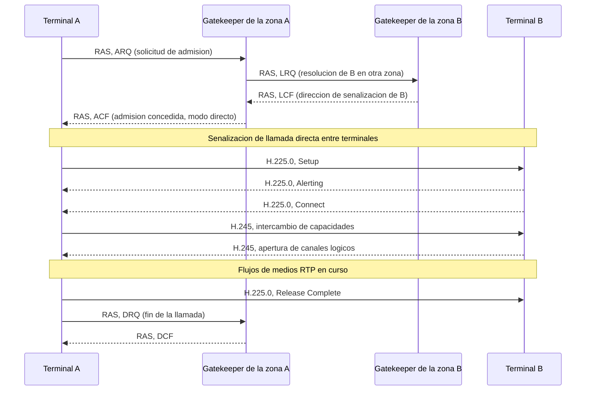
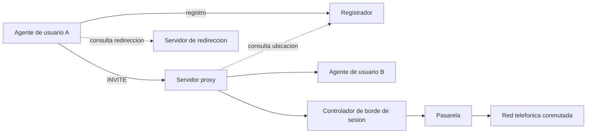

Antes de que circule un solo paquete de medios, alguien tiene que decidir quién
participa en la sesión, qué flujos se van a intercambiar y sobre qué direcciones y
puertos viaja cada uno. Ese acuerdo previo es responsabilidad de un protocolo de
señalización y de un protocolo que describe la sesión negociada dentro de los mensajes
de ese primero. Este capítulo retoma la señalización que el capítulo dedicado a los
[servicios multimedia](../01_multimedia/section_1_servicios_multimedia.md) dejó
pendiente y desarrolla ambos protocolos: el que establece, modifica y termina la sesión,
y el que describe sus flujos y los negocia entre los dos extremos. El transporte en
tiempo real de esos flujos, una vez negociados, se retoma en el capítulo siguiente.

## Introducción

El **Protocolo de Inicio de Sesión** (Session Initiation Protocol, `SIP`) es un
protocolo de señalización de nivel de aplicación que crea, modifica y termina sesiones
de comunicación con uno o varios usuarios. No transporta él mismo los medios de la
sesión ni describe su contenido: se limita a coordinar el establecimiento, la
negociación y la finalización, delegando la descripción de los flujos en el **Protocolo
de Descripción de Sesión** (Session Description Protocol, `SDP`), que viaja en el cuerpo
de los mensajes `SIP`. Ambos protocolos se estudian juntos en este capítulo porque
ninguno de los dos completa por separado la función de establecer una sesión multimedia:
`SIP` decide cuándo y con quién se establece la sesión, y `SDP` decide qué se va a
intercambiar dentro de ella.

## Motivación

### Limitaciones de la conmutación de paquetes para tiempo real

Una red telefónica clásica reserva un canal dedicado para cada llamada mediante
conmutación de circuitos, lo que garantiza de forma directa un retardo y una tasa de
entrega estables durante toda la comunicación. Una red de datos, en cambio, utiliza
conmutación de paquetes, donde ningún canal queda reservado de antemano y la calidad de
servicio disponible en cada instante depende del número de usuarios activos y de la
demanda que generan. Ofrecer un mínimo de calidad de servicio y hacer posible la
comunicación en tiempo real sobre una red de este tipo exige, por tanto, un mecanismo
que reserve ancho de banda para cada sesión y que adapte la comunicación al ancho de
banda disponible cuando la reserva no puede cumplirse por completo. Ese mecanismo de
reserva y adaptación se negocia con la señalización que desarrolla este capítulo, antes
de que empiece a fluir un solo paquete de medios.

### Señalización distribuida frente a señalización centralizada

Las redes telefónicas heredadas señalizan sus llamadas con protocolos centralizados,
donde un conjunto reducido de nodos de la red concentra la lógica de control de la
llamada. `SIP` invierte esa relación: los servicios que ofrece los implementan los
propios puntos finales de la comunicación, y la red se limita a encaminar los mensajes
de señalización entre ellos. Esta distribución de la lógica de control hacia los
extremos es lo que permite que una red `SIP` escale con el número de usuarios sin
necesitar un crecimiento proporcional de la infraestructura central de señalización, una
propiedad que la sitúa como protocolo de control de la capa de gestión de red de las
arquitecturas convergentes descritas en
[convergencia de redes y redes de nueva generación](../../02_redes/05_redes_de_operador/section_1_convergencia_y_ngn.md#redes-de-nueva-generacion).

## Señalización multimedia anterior a SIP: H.323

Antes de que el `IETF` publicara `SIP`, la Unión Internacional de Telecomunicaciones ya
disponía de una recomendación completa para señalizar sesiones multimedia sobre redes de
conmutación de paquetes: la recomendación `ITU-T H.323`, publicada en 1996, tres años
antes que la primera versión de `SIP`. `H.323` no es un protocolo único sino una familia
de recomendaciones que cubre, de forma centralizada y con herencia directa de la
señalización telefónica clásica, exactamente las mismas funciones que `SIP` resolvería
después de forma distribuida y basada en texto. Entender `H.323` como el modelo previo
resulta necesario para valorar por qué `SIP` se diseñó como se diseñó: cada decisión de
arquitectura de `SIP` que este capítulo desarrolla, la identificación mediante `URI` en
lugar de direcciones numéricas, la independencia del transporte, el formato de mensaje
basado en texto y la distribución de la lógica de control hacia los extremos, responde,
de forma explícita o implícita, a una limitación conocida del modelo que `H.323` había
establecido antes.

### Arquitectura de H.323

Una red `H.323` reparte sus funciones entre cuatro tipos de entidades. El **terminal**
es el equipo del usuario final que origina o recibe llamadas, equivalente al agente de
usuario de `SIP`. La **pasarela** (_gateway_) traduce la señalización y los medios entre
la red `H.323` y otras redes, típicamente la red telefónica conmutada, de forma análoga
a la pasarela `SIP` ya descrita. La **unidad de control multipunto** (`MCU`) gestiona
las conferencias con más de dos participantes, mezclando o conmutando los flujos de
medios entre todos los terminales de la conferencia, una función que en una red `SIP`
asumen normalmente servidores de aplicación específicos y no una entidad nombrada en el
propio protocolo de señalización.

La diferencia arquitectónica más relevante frente a `SIP` es el **controlador de
acceso** (_gatekeeper_), una entidad opcional en la recomendación pero omnipresente en
cualquier despliegue real, que concentra el control de admisión, la resolución de
direcciones y la gestión del ancho de banda de todos los terminales de su dominio o
**zona**. Un gatekeeper puede operar en dos modos de señalización: en **modo directo**,
solo interviene en la fase de admisión y los propios terminales intercambian después la
señalización de llamada entre sí, mientras que en **modo encaminado**
(_gatekeeper-routed_) el propio gatekeeper retransmite también toda la señalización de
llamada, de forma similar a como lo hace un proxy `SIP` con estado. Esta concentración
de funciones de control en un nodo central por zona es precisamente el rasgo que la
señalización distribuida de `SIP`, descrita en la sección de motivación de este
capítulo, evita de forma deliberada.

### Señalización de control de admisión: H.225.0 y RAS

El estándar `H.225.0` define dos subsistemas de señalización distintos que viajan sobre
transporte `IP` independiente. El subsistema de **registro, admisión y estado** (`RAS`)
gestiona la relación entre un terminal y su gatekeeper mediante cuatro procedimientos:
el **registro** (`RRQ`/`RCF`), por el que el terminal se da a conocer ante su gatekeeper
de forma análoga al `REGISTER` de `SIP`; la **admisión** (`ARQ`/`ACF` o `ARJ`), por la
que el terminal solicita permiso para originar o aceptar una llamada y el gatekeeper
responde con la confirmación de admisión o su rechazo, comprobando el ancho de banda
disponible en la zona; los **cambios de estado y de ancho de banda** (`BRQ`/`BCF`), que
permiten renegociar la capacidad reservada durante una llamada en curso; y la
**desconexión** (`DRQ`/`DCF`), que libera los recursos reservados cuando la llamada
termina. El propio subsistema `H.225.0` define además la **señalización de llamada**,
basada en el protocolo `Q.931` de la red digital de servicios integrados, que transporta
los mensajes que abren y cierran la propia llamada (`Setup`, `Alerting`, `Connect`,
`Release Complete`) una vez que el gatekeeper ha concedido la admisión.

### Negociación de capacidades: H.245

Una vez admitida la llamada, `H.245` negocia los aspectos que en una red `SIP` resuelve
`SDP` dentro del propio cuerpo del mensaje: el intercambio de capacidades de cada
terminal (códecs de audio y de vídeo soportados, resoluciones, tasas de bits máximas) y
la **apertura de canales lógicos**, el equivalente de `H.245` a un flujo de medios de
`SDP`, con su propio identificador, su formato y su dirección de transporte. A
diferencia de `SDP`, que viaja como texto dentro del cuerpo de un mensaje `SIP`, los
mensajes `H.245` se transportan sobre su propia conexión de control, que puede abrirse
de forma separada o **tunelizarse** dentro de los mismos mensajes `H.225.0` de
señalización de llamada para evitar el coste de abrir una conexión `TCP` adicional. Esta
separación entre señalización de llamada (`H.225.0`), control de medios (`H.245`) y
control de admisión (`RAS`) como tres subsistemas independientes, cada uno con su propio
formato de mensaje, contrasta con el diseño de `SIP`, que resuelve las tres funciones
equivalentes, salvo la admisión de ancho de banda, dentro de un único protocolo y un
único intercambio de mensajes.

### Codificación binaria ASN.1 frente a codificación de texto

La diferencia de diseño con mayor impacto práctico entre ambas familias de protocolos es
la codificación de los mensajes. `H.323` define sus mensajes mediante la notación de
sintaxis abstracta uno (`ASN.1`) y los codifica en binario con las reglas de
codificación compacta (`PER`, por _Packed Encoding Rules_), lo que produce mensajes
notablemente más pequeños que su equivalente en texto y reduce el coste de análisis
sintáctico en el receptor, una ventaja relevante cuando el equipamiento de señalización
de mediados de los años noventa disponía de una capacidad de procesamiento muy inferior
a la actual. `SIP`, en cambio, codifica sus mensajes como texto legible, siguiendo el
mismo principio que `HTTP`, a costa de un mensaje más voluminoso y de un coste de
análisis sintáctico mayor por carácter. La ventaja del texto no es de rendimiento sino
de **extensibilidad y de depuración**: un nuevo campo de cabecera `SIP` se añade sin
alterar ningún esquema `ASN.1` compilado, un desarrollador puede leer una traza de
señalización `SIP` directamente en una captura de red sin herramienta de decodificación
adicional, y las cabeceras cuyo significado un intermediario no reconoce simplemente se
ignoran o se reenvían sin interpretar, mientras que extender `H.323` con una capacidad
nueva exige coordinar la actualización del esquema `ASN.1` en todos los fabricantes de
equipamiento que deban seguir interoperando con la extensión.



???+ example "Llamada H.323 entre gatekeepers de dominios distintos en modo directo"

    El terminal A, registrado ante el gatekeeper de la zona A, quiere establecer una
    llamada con el terminal B, registrado ante un gatekeeper distinto en la zona B. Se
    pide describir la secuencia de mensajes necesaria hasta que ambos terminales
    intercambian medios, suponiendo que ambas zonas operan en modo directo.

    A envía primero una solicitud de admisión (`ARQ`) a su propio gatekeeper, que
    comprueba el ancho de banda disponible en la zona A. Como el destino pertenece a
    otra zona, el gatekeeper de A no conoce la dirección de señalización de B y necesita
    resolverla mediante una petición de localización (`LRQ`) dirigida al gatekeeper de
    la zona B, que responde con una confirmación de localización (`LCF`) que incluye la
    dirección de señalización de B. Con esa dirección resuelta, el gatekeeper de A
    concede la admisión a A mediante una confirmación de admisión (`ACF`). A partir de
    ese punto, al operar ambas zonas en modo directo, ningún gatekeeper vuelve a
    intervenir en la señalización de la llamada: A dirige su mensaje `Setup` de
    `H.225.0` directamente a B, que responde con `Alerting` y `Connect`, y a
    continuación ambos terminales negocian sus capacidades y abren los canales lógicos
    mediante `H.245` sin que ningún gatekeeper reenvíe ese intercambio. La diferencia
    frente al modo encaminado es precisamente esta: en modo encaminado, tanto `Setup`
    como el resto de mensajes de `H.225.0` y `H.245` pasarían por el gatekeeper de cada
    zona, lo que le otorga control total sobre la llamada a cambio de convertirlo en un
    punto de paso obligado para todo el tráfico de señalización de su zona.

La tabla siguiente resume la comparación entre ambos modelos de señalización en los
cuatro ejes que determinan su idoneidad según el contexto de despliegue.

| Aspecto        | H.323                                                     | SIP                                                   |
| -------------- | --------------------------------------------------------- | ----------------------------------------------------- |
| Arquitectura   | Centralizada por zona, gatekeeper obligatorio de _facto_. | Distribuida, lógica de control en los extremos.       |
| Codificación   | Binaria, `ASN.1` con reglas `PER`.                        | Texto legible, similar a `HTTP`.                      |
| Extensibilidad | Exige actualizar el esquema `ASN.1` en todo el dominio.   | Cabeceras nuevas ignoradas por quien no las reconoce. |
| Origen         | `ITU-T`, herencia de la señalización telefónica.          | `IETF`, herencia de los protocolos de Internet.       |

`H.323` sigue presente en equipamiento de videoconferencia empresarial y en pasarelas de
interconexión entre operadores que lo desplegaron antes de la generalización de `SIP`,
pero su modelo centralizado y su codificación binaria resultaron menos adecuados que
`SIP` para el crecimiento de Internet como red de transporte de servicios multimedia, lo
que explica por qué prácticamente toda la señalización multimedia desplegada después de
los años dos mil, incluida la que sostiene el subsistema `IP` multimedia descrito en
capítulos posteriores, adoptó `SIP` en lugar de extender `H.323`. Frente a este modelo
previo se define el resto de este capítulo, que retoma `SIP` desde su motivación
original.

## Protocolo de inicio de sesión

### Modelo de transacción

`SIP` es un protocolo basado en texto que adopta un modelo de interacción similar al de
`HTTP`: una petición de un cliente activa una función en un servidor, que responde con
uno o varios mensajes de respuesta. Cada intercambio de una petición y sus respuestas
constituye una **transacción**. Una sesión completa, desde su establecimiento hasta su
liberación, encadena varias transacciones relacionadas entre los mismos dos extremos, y
esa secuencia de transacciones asociadas a una misma sesión es lo que constituye un
**diálogo** entre ambos agentes de usuario. Una sesión `SIP` se define, en este modelo,
como una colección de participantes y de los flujos multimedia que se intercambian entre
ellos, y la información detallada de esos flujos no se codifica en el propio protocolo
`SIP`, sino en el cuerpo del mensaje mediante otro protocolo, normalmente `SDP`.

### Identificación de usuarios

Los usuarios y los recursos de una red `SIP` se identifican mediante un identificador
uniforme de recursos (Uniform Resource Identifier, `URI`), con el esquema `sip:` para un
usuario en una red `IP`, `sips:` cuando la señalización exige transporte seguro, y
`tel:` cuando el identificador es un número de la red telefónica conmutada en lugar de
una dirección `IP`. Esta identificación mediante `URI`, en lugar de una dirección de red
fija, es lo que permite que un mismo usuario conserve su identidad aunque cambie de
dispositivo o de punto de acceso a la red, delegando en el registrador la asociación
entre esa identidad y la ubicación física donde el usuario se encuentra en cada momento.

### Independencia del transporte

`SIP` es independiente de la capa de transporte sobre la que se apoya y puede funcionar
indistintamente sobre `TCP`, `UDP` o `SCTP`, con soporte tanto para sesiones unicast
como para sesiones multicast. Esta elección de transporte tiene consecuencias directas
sobre la fiabilidad de la señalización: si un mensaje se pierde sobre `UDP`, el propio
`UDP` no lo retransmite, tal como se describe en el capítulo de
[protocolos de transporte](../../02_redes/02_ip/section_2_protocolos_de_transporte.md#udp).
`SIP` no delega esa fiabilidad en `TCP` de forma exclusiva, sino que define su propia
técnica de retransmisión de mensajes de señalización a nivel de aplicación, distinta de
la retransmisión de segmentos que aplica `TCP`, de modo que la señalización queda
protegida frente a pérdidas incluso cuando se transporta sobre un servicio sin conexión.
La seguridad del transporte de señalización, cuando es necesaria, se añade con `TLS`
sobre el transporte elegido.

## Entidades de una red SIP

Una red `SIP` reparte sus funciones entre seis tipos de entidades, que colaboran entre
sí para establecer, encaminar y terminar sesiones.



### Agentes de usuario

Los **agentes de usuario** son los puntos finales de la comunicación: crean las
peticiones `SIP` que inician, modifican o terminan una sesión, y reciben las peticiones
y respuestas dirigidas a ellos. Un teléfono `IP`, una aplicación de videollamada o un
terminal de una pasarela hacia la red telefónica actúan, todos ellos, como agentes de
usuario.

### Registradores

Los **registradores** aceptan las peticiones de registro que envía un agente de usuario
para dar de alta su ubicación actual y proporcionan, a partir de ese registro, un
mecanismo de localización de usuarios. Su función es asociar la identidad lógica de un
usuario, expresada como `URI`, con la dirección física en la que ese usuario puede ser
alcanzado en cada momento, de forma que las peticiones dirigidas a esa identidad lógica
puedan encaminarse hasta la ubicación correcta.

### Servidores proxy

Los **servidores proxy** actúan como intermediarios que encaminan peticiones y aplican
políticas de la red antes de reenviarlas, verificando la validez de cada mensaje. Un
proxy dirige una petición de una `URI` a otra y puede operar en dos modos: sin estado
(`stateless`), cuando se limita a reenviar cada mensaje sin conservar información sobre
la transacción a la que pertenece, o con estado (`stateful`), cuando mantiene esa
información para poder reintentar el envío, bifurcar la petición hacia varios destinos o
cancelar transacciones en curso.

### Servidores de redirección

Los **servidores de redirección** no reenvían la petición en nombre del solicitante,
sino que generan una respuesta de redirección cuando la dirección de destino no se
encuentra en la ubicación registrada actualmente, o cuando esa dirección exige un
mecanismo de transporte distinto del que empleó la petición original. El propio agente
de usuario que originó la petición es quien reintenta el envío hacia la nueva ubicación
indicada.

### Controladores de borde de sesión

Los **controladores de borde de sesión** se sitúan en el límite entre dos dominios de
señalización y realizan funciones de intermediación sobre el tráfico que los cruza,
entre ellas el control de admisión, la ocultación de la topología interna de una red y
la aplicación de políticas de seguridad en el punto de interconexión.

### Pasarelas

Las **pasarelas** conectan una red `SIP` con redes que emplean protocolos o tecnologías
distintas, como la red telefónica conmutada, traduciendo tanto la señalización como,
cuando es necesario, el propio formato de los medios entre ambos dominios.

## Métodos y respuestas

### Métodos definidos

`SIP` define seis métodos con los que un agente de usuario controla el ciclo de vida de
una sesión.

| Método   | Función                                                                   |
| -------- | ------------------------------------------------------------------------- |
| INVITE   | Solicita el inicio de una sesión.                                         |
| ACK      | Confirma la recepción de la respuesta final a un INVITE.                  |
| CANCEL   | Cancela una petición INVITE que aún está pendiente de respuesta final.    |
| BYE      | Termina una sesión ya establecida.                                        |
| REGISTER | Asocia una `URI` de usuario con su ubicación actual.                      |
| OPTIONS  | Consulta las capacidades que soporta otro extremo, sin establecer sesión. |

Toda petición `SIP` la procesa el agente de usuario destinatario, que responde con una
respuesta o, si no reconoce el método o no puede atenderlo, la descarta sin generar
ninguna acción adicional.

### Familias de códigos de respuesta

Cada respuesta `SIP` lleva un código de tres dígitos cuya primera cifra indica la
familia a la que pertenece.

| Familia | Significado        | Descripción                                                           |
| ------- | ------------------ | --------------------------------------------------------------------- |
| 1xx     | Provisional        | La petición se está procesando y aún no hay una respuesta definitiva. |
| 2xx     | Éxito              | La petición se ha aceptado y completado correctamente.                |
| 3xx     | Redirección        | El recurso solicitado se encuentra en otra ubicación.                 |
| 4xx     | Error del cliente  | La petición contiene un error o no puede atenderse tal como llegó.    |
| 5xx     | Error del servidor | El servidor no ha podido procesar una petición correcta.              |
| 6xx     | Fallo global       | Ningún servidor de la red puede atender la petición.                  |

### Formato del mensaje

Un mensaje `SIP` sigue una estructura de tres bloques: una línea inicial, un conjunto de
cabeceras y un cuerpo opcional, separado de las cabeceras por una línea en blanco. En
una petición, la línea inicial es la línea de petición, con el método, la `URI` de
destino y la versión del protocolo. En una respuesta, es la línea de estado, con la
versión del protocolo, el código de respuesta y una frase explicativa. Las cabeceras
identifican la transacción y el diálogo (`Via`, `From`, `To`, `Call-ID`, `CSeq`), la
ubicación de contacto del emisor (`Contact`) y, cuando el mensaje lleva cuerpo, el tipo
y la longitud de ese cuerpo (`Content-Type`, `Content-Length`). El cuerpo transporta la
descripción de sesión codificada en `SDP` cuando el mensaje forma parte de una
negociación de medios.

```plaintext linenums="1"
INVITE sip:bob@dominio.example SIP/2.0
Via: SIP/2.0/UDP host.alicia.example;branch=z9hG4bK776asdhds
From: Alicia <sip:alicia@dominio.example>;tag=1928301774
To: Bob <sip:bob@dominio.example>
Call-ID: a84b4c76e66710@host.alicia.example
CSeq: 314159 INVITE
Contact: <sip:alicia@host.alicia.example>
Content-Type: application/sdp
Content-Length: 142

v=0
o=alicia 2890844526 2890844526 IN IP4 host.alicia.example
s=
c=IN IP4 host.alicia.example
t=0 0
m=audio 49170 RTP/AVP 0
a=rtpmap:0 PCMU/8000
```

???+ example "Establecimiento y liberación de una sesión a través de un proxy"

    Dos agentes de usuario, A y B, establecen una sesión de voz a través de un
    servidor proxy que ninguno de los dos conoce por adelantado, salvo por el
    dominio al que pertenece B.

    ```mermaid linenums="1"
    sequenceDiagram
        participant A as Agente de usuario A
        participant P as Servidor proxy
        participant B as Agente de usuario B
        A->>P: INVITE (oferta SDP)
        P->>B: INVITE (oferta SDP)
        B-->>P: 180 Ringing
        P-->>A: 180 Ringing
        B-->>P: 200 OK (respuesta SDP)
        P-->>A: 200 OK (respuesta SDP)
        A->>P: ACK
        P->>B: ACK
        Note over A,B: Sesion establecida, flujos de medios en curso
        A->>P: BYE
        P->>B: BYE
        B-->>P: 200 OK
        P-->>A: 200 OK
    ```

    El INVITE inicial de A lleva la oferta SDP con los medios que A propone. El
    proxy lo encamina hacia B sin modificar su contenido, aplicando únicamente
    la política de encaminamiento de su dominio. El 180 Ringing informa a A de
    que el terminal de B está alertando al usuario, y el 200 OK, que ya lleva
    la respuesta SDP de B, marca la aceptación de la sesión. El ACK de A cierra
    la transacción INVITE y da paso a los flujos de medios, negociados según el
    modelo de oferta y respuesta que se describe más adelante en este capítulo.
    El BYE, en cualquier sentido, termina la sesión, y su 200 OK confirma la
    liberación.

## Protocolo de descripción de sesión

### Estructura del mensaje

`SDP` no es en sí mismo un protocolo de transporte de mensajes, sino un formato estándar
para describir una sesión multimedia dentro del cuerpo de otro protocolo, típicamente
`SIP`. Una descripción `SDP` se organiza en una sección de sesión, una sección de tiempo
y una sección por cada flujo de medios que participa en la sesión, en ese orden. La
sección de sesión fija la versión del protocolo, el origen y el nombre de la sesión y la
dirección de conexión por defecto. La sección de tiempo fija el intervalo de vigencia de
la sesión. Cada sección de flujo describe el tipo de medio, el puerto en el que se
recibe, el protocolo de transporte y los formatos que admite ese flujo concreto.

???+ example "Lectura de una descripción con dos flujos de audio y uno de vídeo"

    La siguiente descripción `SDP` corresponde a una sesión con dos flujos de audio y
    un flujo de vídeo, cada uno con sus propios formatos admitidos.

    ```plaintext linenums="1"
    v=0
    o=anibal 2990844372 2990845839 IN IP4 anfitrion.example
    s=
    c=IN IP4 anfitrion.example
    t=0 0
    m=audio 53340 RTP/AVP 4 97 15
    a=rtpmap:4 G723/8000
    a=rtpmap:97 iLBC/8000
    a=rtpmap:15 G728/8000
    m=video 51372 RTP/AVP 34 32
    a=rtpmap:34 H263/90000
    a=rtpmap:32 MPV/90000
    m=audio 62986 RTP/AVP 4
    a=rtpmap:4 G723/8000
    a=sendrecv
    ```

    La línea `v=0` fija la versión de `SDP`. La línea `o=` identifica el origen de la
    sesión: el usuario, dos identificadores que numeran la sesión y su versión, y la
    dirección del host que la origina, con `IN IP4` indicando una dirección de
    Internet en formato `IPv4`. La línea `s=` es el nombre de la sesión, vacío en este
    caso, y `c=` fija la dirección de conexión por defecto. La línea `t=0 0` indica una
    sesión sin límite de duración fijado por adelantado.

    Cada línea `m=` abre un flujo nuevo: puerto de recepción, protocolo de transporte
    y lista de identificadores de formato de _payload_ que ese flujo admite. El primer
    flujo de audio, en el puerto `53340`, admite tres formatos, `4`, `97` y `15`, y las
    tres líneas `a=rtpmap` que le siguen traducen cada identificador a un códec
    concreto y a su frecuencia de muestreo. El flujo de vídeo, en el puerto `51372`,
    admite los formatos `34` y `32`, resueltos de la misma manera. El segundo flujo de
    audio, en el puerto `62986`, admite un único formato, `4`, y el atributo
    `a=sendrecv` que lo sigue indica que ese flujo concreto puede tanto enviar como
    recibir medios.

### Atributos de sesión y de flujo

Los atributos `a=` extienden `SDP` con información que las líneas obligatorias no
cubren. Un atributo puede aplicarse a toda la sesión, si aparece antes de la primera
línea `m=`, o a un único flujo, si aparece después de la línea `m=` que lo abre y antes
de la siguiente. Entre los atributos más habituales están la asignación de formatos de
_payload_ a códecs (`a=rtpmap`), la calidad de codificación, la orientación de un flujo
de vídeo, el tipo de conferencia, el idioma del contenido y los parámetros de
codificación específicos de un formato concreto (`a=fmtp`). También pertenecen a este
grupo los atributos de dirección de flujo, que fijan si un extremo puede enviar y
recibir (`a=sendrecv`), solo enviar (`a=sendonly`), solo recibir (`a=recvonly`) o
ninguna de las dos cosas mientras el flujo permanece descrito pero inactivo
(`a=inactive`).

### Modelo de oferta y respuesta

Dos agentes de usuario negocian los medios de una sesión mediante un intercambio de dos
descripciones `SDP` completas. Uno de los extremos genera una **oferta**, con la lista
completa de flujos que propone y los formatos que admite para cada uno, y el otro
extremo genera una **respuesta** que indica qué flujos de esa oferta acepta, con qué
códec de entre los propuestos y sobre qué direcciones y puertos. La oferta y la
respuesta se intercambian siempre completas, nunca como una modificación parcial de la
anterior, y cada flujo ofrecido puede aceptarse o rechazarse de forma independiente sin
afectar al resto de la sesión.

???+ example "Negociación de una sesión de audio y vídeo hasta un códec común"

    A ofrece una sesión con un flujo de audio con dos códecs posibles y un flujo de
    vídeo, y B responde aceptando únicamente el audio, con el códec común a ambos.

    ```plaintext linenums="1"
    v=0
    o=a 2890844526 2890844526 IN IP4 host.a.example
    s=
    c=IN IP4 host.a.example
    t=0 0
    m=audio 49170 RTP/AVP 0 8
    a=rtpmap:0 PCMU/8000
    a=rtpmap:8 PCMA/8000
    m=video 51372 RTP/AVP 31
    a=rtpmap:31 H261/90000
    ```

    ```plaintext linenums="1"
    v=0
    o=b 2890844527 2890844527 IN IP4 host.b.example
    s=
    c=IN IP4 host.b.example
    t=0 0
    m=audio 3456 RTP/AVP 0
    a=rtpmap:0 PCMU/8000
    m=video 0 RTP/AVP 31
    ```

    La oferta de A admite dos códecs de audio, `PCMU` y `PCMA`, y un flujo de vídeo con
    `H261`. La respuesta de B conserva el flujo de audio pero reduce la lista de
    formatos a uno solo, `PCMU`, que es el códec común elegido para la sesión, y fija
    su propio puerto de recepción, `3456`. El flujo de vídeo se rechaza fijando su
    puerto a `0`, sin eliminar la línea `m=` correspondiente, de modo que la estructura
    de la respuesta sigue enumerando los mismos flujos que la oferta, uno aceptado y
    otro rechazado.

### Modificación de una sesión establecida

Una sesión ya establecida se modifica repitiendo el intercambio de oferta y respuesta
con una nueva descripción `SDP`, transportada dentro de una nueva transacción `SIP`
sobre el diálogo ya existente. Las modificaciones posibles incluyen añadir un flujo
nuevo, eliminar uno existente, cambiar sus direcciones o sus puertos, o poner un flujo
en espera sin eliminarlo de la descripción, cambiando su atributo de dirección a
`a=sendonly` o `a=inactive` según si el extremo que lo pone en espera sigue enviando
medios o no. El extremo que recibe la modificación responde con su propia descripción
`SDP`, que puede aceptar la modificación propuesta o proponer una alternativa dentro de
los mismos flujos.

???+ example "Retención y reanudación de una sesión de audio en curso"

    A pone la sesión en espera y, más tarde, la reanuda, mediante dos negociaciones
    sucesivas sobre el mismo flujo de audio ya establecido.

    ```plaintext linenums="1"
    m=audio 49170 RTP/AVP 0
    a=rtpmap:0 PCMU/8000
    a=sendonly
    ```

    ```plaintext linenums="1"
    m=audio 49170 RTP/AVP 0
    a=rtpmap:0 PCMU/8000
    a=sendrecv
    ```

    La primera descripción conserva el mismo puerto y el mismo códec que la sesión
    original, y cambia únicamente el atributo de dirección a `a=sendonly`: A sigue
    enviando datos hacia B pero indica que no espera recibir nada mientras dura la
    espera. La segunda descripción, enviada cuando A reanuda la sesión, restaura el
    atributo `a=sendrecv` sin tocar el resto de la línea, devolviendo el flujo a su
    estado bidireccional original.

El transporte de los flujos de medios que esta señalización acaba de negociar, junto con
la realimentación de calidad sobre esa entrega y el control remoto de la reproducción,
se desarrolla en el capítulo siguiente,
[RTP, RTCP y RTSP](section_2_rtp_rtcp_y_rtsp.md).
