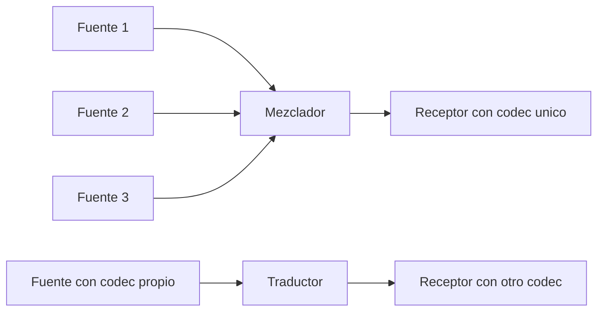
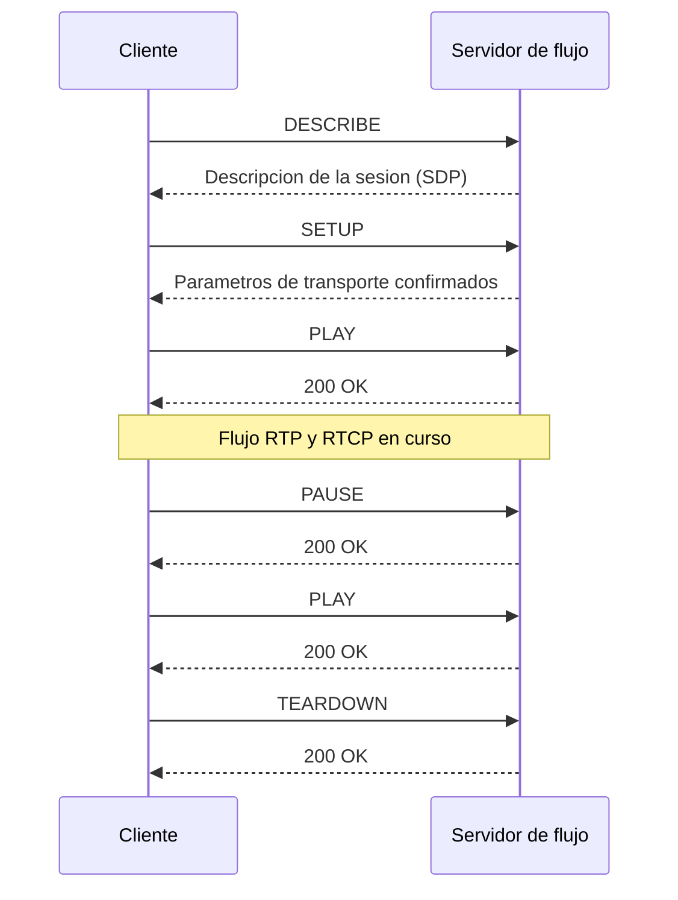

Una vez que la señalización descrita en el capítulo anterior ha negociado quién
participa en la sesión y qué flujos va a intercambiar, queda por resolver cómo viajan
esos flujos por la red, cómo se informa a cada extremo de la calidad con la que están
llegando y cómo se controla a distancia una reproducción ya en curso. Estas tres
funciones las cubren, respectivamente, un protocolo de transporte en tiempo real, su
protocolo de control asociado y un protocolo de control de flujo pensado para
_streaming_. Este capítulo retoma la [señalización de sesiones](section_1_sip_y_sdp.md)
exactamente donde la dejó el capítulo anterior, en el instante en que los dos extremos
ya han acordado direcciones, puertos y formatos, y desarrolla el transporte, la
realimentación de calidad y el control remoto que hacen posible que esos flujos lleguen
y se reproduzcan correctamente.

## Introducción

El **Protocolo de Transporte en Tiempo Real** (Real-time Transport Protocol, `RTP`)
ofrece funciones de transporte extremo a extremo para aplicaciones en tiempo real, como
audio o vídeo, sobre un servicio de red que no garantiza por sí mismo ni la entrega ni
el orden de llegada de los paquetes. `RTP` no reserva recursos de red ni garantiza
calidad de servicio: se limita a añadir a cada paquete la información que el receptor
necesita para reproducir el contenido con la sincronización correcta, incluso cuando
algunos paquetes se pierden o llegan desordenados. Esa carencia deliberada de garantías
es consecuente con la elección de transporte que
[el capítulo de servicios multimedia](../01_multimedia/section_1_servicios_multimedia.md#streaming-convencional)
ya anticipó para el _streaming_ convencional: un
[protocolo de transporte no orientado a conexión](../../02_redes/02_ip/section_2_protocolos_de_transporte.md#udp)
que prioriza la entrega puntual sobre la entrega completa, porque retransmitir un
paquete de audio o de vídeo perdido casi siempre llega demasiado tarde para ser útil.

`RTP` se complementa con el **Protocolo de Control en Tiempo Real** (Real-time Transport
Control Protocol, `RTCP`), que viaja junto a los datos y proporciona estadísticas sobre
la calidad de la entrega, e independientemente con el **Protocolo de Flujo en Tiempo
Real** (Real-time Streaming Protocol, `RTSP`), que ofrece un control remoto de la
reproducción similar al de un reproductor de vídeo doméstico. Los tres protocolos
resuelven problemas distintos y complementarios: `RTP` transporta los medios, `RTCP`
informa de cómo está llegando ese transporte, y `RTSP` controla cuándo y qué parte de
ese transporte se reproduce.

## Protocolo de transporte en tiempo real

### Sesión, flujo y fragmentos de muestra

Una **sesión `RTP`** es la asociación entre un conjunto de participantes que
intercambian paquetes `RTP`, identificada por una dirección de red y un par de puertos:
un puerto par para los datos `RTP` y el puerto impar inmediatamente siguiente para los
mensajes `RTCP` asociados a esa misma sesión. Una sesión de audio y vídeo simultáneos no
comparte una única sesión `RTP` para ambos medios, sino que abre una sesión
independiente para cada uno, con su propio par de puertos, y sincroniza ambas mediante
la información que aporta `RTCP`, tal como se desarrolla más adelante en este capítulo.

Dentro de una sesión, un **flujo** es la secuencia de paquetes `RTP` procedentes de una
misma fuente. `RTP` transmite uno o varios **fragmentos de muestra** consecutivos por
paquete, donde cada fragmento corresponde a un intervalo temporal de la señal de origen,
por ejemplo un bloque de muestras de audio codificadas o un fotograma de vídeo.
Empaquetar varios fragmentos de muestra pequeños en un único paquete `RTP` reduce el
número de paquetes por segundo a costa de un mayor retardo de empaquetado, un compromiso
análogo al que ya introdujo el
[capítulo de servicios multimedia](../01_multimedia/section_1_servicios_multimedia.md#modelado-de-rafagas-y-periodos-de-silencio)
al describir el tráfico de voz en ráfagas.

### Marcas de tiempo y números de secuencia

El **número de secuencia** es un contador de 16 bits que se incrementa en una unidad por
cada paquete `RTP` enviado dentro de la misma sesión. Su función es exclusivamente de
transporte: permite al receptor detectar paquetes perdidos y reordenar los que llegan
fuera de orden, algo que puede ocurrir porque el servicio de red subyacente no garantiza
el orden de entrega.

La **marca de tiempo** (_timestamp_) es un valor de 32 bits que refleja el instante de
muestreo del primer fragmento de datos contenido en el paquete, expresado en las
unidades del reloj que fija el perfil de uso de `RTP` para ese tipo de medio. Ese reloj
no cuenta segundos de reloj de pared, sino muestras de la señal de origen: para un códec
de audio muestreado a una frecuencia dada, el reloj de la marca de tiempo avanza a esa
misma frecuencia de muestreo, de modo que el incremento de la marca de tiempo entre dos
paquetes consecutivos depende directamente de cuántas muestras transporta cada paquete.
Esta relación entre frecuencia de muestreo y avance de la marca de tiempo es la que el
receptor utiliza para reproducir las muestras en el instante correcto y para estimar la
variación del retardo, como se muestra en los dos ejemplos siguientes.

???+ example "Incremento de la marca de tiempo por paquete en un códec de audio"

    Un flujo de audio se codifica con un códec muestreado a 8000 Hz y se empaqueta con
    un intervalo de empaquetado de 20 ms. Se pide el incremento de la marca de tiempo
    `RTP` entre dos paquetes consecutivos de ese flujo.

    El número de muestras que contiene cada paquete es
    $N_{\text{muestras}} = f_{\text{muestreo}} \cdot T_{\text{empaquetado}} =
    8000\ \text{Hz} \cdot 0{,}020\ \text{s} = 160$ muestras, donde $f_{\text{muestreo}}$
    es la frecuencia de muestreo del códec y $T_{\text{empaquetado}}$ es el intervalo de
    empaquetado elegido. Como el reloj de la marca de tiempo avanza una unidad por cada
    muestra codificada, la marca de tiempo del paquete siguiente es exactamente 160
    unidades mayor que la del paquete anterior, sin que existan huecos ni solapes entre
    los dos paquetes mientras no se pierda ninguna muestra en el origen.

### Identificador de fuente de sincronización

El **identificador de fuente de sincronización** (Synchronization Source, `SSRC`) es un
valor de 32 bits elegido aleatoriamente por cada participante al comenzar una sesión,
que identifica de forma única el flujo que ese participante genera durante toda la
sesión. Todos los paquetes `RTP` de un mismo flujo comparten el mismo `SSRC`, lo que
permite al receptor separar entre sí los flujos que llegan mezclados en una misma
sesión, por ejemplo cuando varios participantes envían a la misma dirección de
multidifusión.

### Identificadores de fuente contribuyente

Los **identificadores de fuente contribuyente** (Contributing Source, `CSRC`) enumeran
los `SSRC` de las fuentes originales cuyo contenido se combinó para producir el paquete
que se está transmitiendo. Un paquete `RTP` ordinario, generado directamente por su
fuente, no lleva ningún `CSRC`. Un paquete producido por un **mezclador**, en cambio,
lleva en su lista de `CSRC` los `SSRC` de todas las fuentes que contribuyeron al
contenido combinado, mientras que el propio `SSRC` del paquete pasa a identificar al
mezclador. El campo que cuenta cuántos `CSRC` acompañan a la cabecera admite como máximo
15 identificadores, límite que fija la anchura de ese campo en el formato del mensaje
descrito más abajo.

### Sincronización entre flujos

Cuando un mismo participante envía audio y vídeo como dos sesiones `RTP` independientes,
cada sesión avanza su propia marca de tiempo con el reloj de muestreo de su propio
medio, y esos dos relojes no guardan entre sí ninguna relación fija: el reloj de audio y
el reloj de vídeo arrancan en instantes distintos y avanzan a frecuencias distintas. La
sincronización entre ambos flujos, necesaria para que el vídeo y el audio se reproduzcan
alineados, no la resuelve `RTP` por sí solo, sino que se apoya en la información que
cada participante incluye en sus informes `RTCP`: cada informe de emisor asocia la marca
de tiempo `RTP` de ese flujo con una marca de tiempo de referencia común a todos los
flujos del mismo participante, tal como se describe en la sección dedicada al informe de
emisor más adelante en este capítulo. Con esa asociación, el receptor puede traducir la
marca de tiempo de un flujo a la del otro y reproducir ambos con el desfase relativo
correcto.

### Formato del mensaje

Un paquete `RTP` consta de una cabecera fija de 12 bytes, una lista opcional de `CSRC` y
el fragmento de muestra que transporta como carga útil.

| Campo                     | Longitud         | Descripción                                                                            |
| ------------------------- | ---------------- | -------------------------------------------------------------------------------------- |
| `V` (versión)             | 2 bits           | Versión del protocolo `RTP`.                                                           |
| `P` (relleno)             | 1 bit            | Indica bytes de relleno al final de la carga útil.                                     |
| `X` (extensión)           | 1 bit            | Indica una cabecera de extensión adicional tras la cabecera fija.                      |
| `CC` (conteo de `CSRC`)   | 4 bits           | Número de identificadores `CSRC` que siguen a la cabecera fija, de 0 a 15.             |
| `M` (marcador)            | 1 bit            | Señala un evento significativo definido por el perfil, por ejemplo un inicio de trama. |
| `PT` (tipo de carga útil) | 7 bits           | Identifica el formato de la carga útil y, con ello, el códec empleado.                 |
| Número de secuencia       | 16 bits          | Numera consecutivamente los paquetes de la sesión.                                     |
| Marca de tiempo           | 32 bits          | Instante de muestreo del primer fragmento de datos del paquete.                        |
| `SSRC`                    | 32 bits          | Identificador de la fuente de sincronización del flujo.                                |
| `CSRC` (0 a 15)           | 32 bits cada uno | Identificadores de las fuentes que contribuyeron a un paquete combinado.               |

La cabecera fija ocupa $2 + 1 + 1 + 4 + 1 + 7 + 16 + 32 + 32 = 96$ bits, es decir, 12
bytes, sin contar la lista opcional de `CSRC` ni la carga útil que transporta.

???+ example "Overhead total de un paquete de voz sobre IP con un códec de baja tasa"

    Un flujo de voz se codifica con un códec de 8 kbit/s y se empaqueta con un intervalo
    de empaquetado de 20 ms, transportado sobre `RTP` sobre `UDP` sobre `IPv4` sin
    opciones. Se pide el _overhead_ total de cabeceras de ese paquete, en bytes, y su
    peso relativo frente al _payload_ de datos de voz.

    El tamaño del _payload_ de voz es
    $L_{\text{payload}} = R_{\text{codec}} \cdot T_{\text{empaquetado}} =
    8000\ \text{bit/s} \cdot 0{,}020\ \text{s} = 160$ bits $= 20$ bytes, donde
    $R_{\text{codec}}$ es la tasa binaria del códec. El _overhead_ de cabeceras suma la
    cabecera `RTP` de 12 bytes, la cabecera `UDP` de 8 bytes y la cabecera `IPv4` mínima
    de 20 bytes, es decir $12 + 8 + 20 = 40$ bytes. El paquete completo ocupa
    $40 + 20 = 60$ bytes, de los cuales el _overhead_ representa
    $40 / 60 \approx 66{,}7\,\%$, más del doble del propio _payload_ de voz que
    transporta. Este resultado, que a primera vista puede parecer despilfarro, es el que
    motiva las técnicas de compresión de cabeceras en el enlace de acceso de las redes
    celulares y explica por qué codificar la voz a tasas cada vez más bajas deja de
    reducir proporcionalmente el ancho de banda ocupado en la red: por debajo de un
    cierto punto, quien domina el tamaño del paquete es la cabecera, no el _payload_.

## Sistemas intermedios

Un flujo `RTP` no siempre viaja sin cambios entre la fuente y el destino: dos tipos de
sistemas intermedios pueden modificarlo por el camino, según si su función es adaptar el
formato de un único flujo o combinar varios flujos en uno.

### Traductores

Un **traductor** adapta un único flujo `RTP` al formato que necesita su destinatario,
sin combinarlo con ningún otro flujo. El caso característico es la transcodificación:
cuando el receptor no admite el códec con el que se codificó el flujo original, el
traductor lo decodifica y lo vuelve a codificar con un códec compatible, o adapta el
protocolo de transporte subyacente cuando el segmento de red hacia el receptor lo
requiere. El `SSRC` del flujo se conserva sin cambios a través del traductor, porque el
contenido sigue perteneciendo a la misma fuente original.

### Mezcladores

Un **mezclador** combina dos o más flujos `RTP` en un único flujo de salida,
resincronizando sus fragmentos de muestra si sus marcas de tiempo de origen no
coinciden, y genera un `SSRC` propio para el flujo combinado que produce. El mezclador
incluye en cada paquete combinado, dentro de la lista de `CSRC` descrita más arriba, los
`SSRC` de todas las fuentes originales cuyo contenido participó en esa combinación, de
modo que el receptor puede seguir identificando a los participantes individuales aunque
reciba un único flujo mezclado. El caso característico es una conferencia de audio con
muchos participantes, en la que un mezclador combina las señales de voz activas en cada
instante para que un receptor de capacidad limitada no tenga que decodificar un flujo
independiente por cada participante.

## Protocolo de control en tiempo real

`RTCP` viaja junto a los datos de una sesión `RTP`, sobre el puerto impar adyacente al
puerto `RTP` de esa misma sesión, y proporciona información de control fuera de banda
que `RTP` no transporta por sí mismo.

### Funciones

`RTCP` cumple tres funciones dentro de una sesión. La primera es proporcionar
realimentación sobre la calidad de la distribución de datos, mediante estadísticas de
paquetes enviados, paquetes perdidos y variación del retardo, que las aplicaciones
utilizan para ajustar parámetros como la tasa de codificación o para diagnosticar
problemas de distribución cuando estos afectan a un único participante o a toda la
sesión. La segunda es identificar a los participantes de la sesión mediante un nombre
canónico persistente, `CNAME`, distinto del `SSRC`, que puede cambiar si se detecta una
colisión de identificadores durante la sesión. La tercera es proporcionar la información
de sincronización entre flujos del mismo participante descrita más arriba en este
capítulo, asociando las marcas de tiempo `RTP` de cada flujo con una referencia de
tiempo común.

### Frecuencia de envío y reparto de ancho de banda

El tráfico `RTCP` de una sesión debe mantenerse acotado como una fracción pequeña y
conocida del tráfico total de la sesión, para que la propia realimentación de control no
llegue a degradar el transporte que pretende monitorizar. La recomendación general fija
ese límite en el 5 % del ancho de banda total de la sesión. Dentro de ese 5 %, una
cuarta parte se reserva para los participantes que están enviando datos activamente y
las tres cuartas partes restantes se reparten entre los participantes que solo reciben,
salvo que los emisores sean más de una cuarta parte del total de participantes, en cuyo
caso el reparto pasa a ser proporcional al número de participantes de cada tipo. El
intervalo real entre informes `RTCP` de un participante concreto se calcula a partir de
ese límite de ancho de banda, del tamaño medio de los paquetes `RTCP` observado en la
sesión y del número de participantes, de modo que el intervalo crece con el número de
participantes para mantener acotada la fracción de ancho de banda total que consume el
conjunto de informes de control.

### Informe de emisor

El **informe de emisor** (Sender Report, `SR`) lo envía un participante que ha
transmitido paquetes de datos desde su último informe. Además de los bloques de
información de recepción comunes a los dos tipos de informe, un `SR` incluye información
propia del emisor: una marca de tiempo de referencia común, expresada tanto en formato
de reloj de pared como en las unidades del reloj `RTP` del propio flujo, junto con el
número total de paquetes y de bytes que ha enviado desde el inicio de la sesión. Esa
marca de tiempo de referencia es precisamente la que permite asociar entre sí las marcas
de tiempo `RTP` de distintos flujos del mismo participante, tal como exige la
sincronización entre flujos descrita más arriba.

### Informe de receptor

El **informe de receptor** (Receiver Report, `RR`) lo envía un participante que no ha
transmitido paquetes de datos desde su último informe, y contiene únicamente bloques de
información de recepción, uno por cada fuente `SSRC` de la que ha recibido paquetes.
Cada bloque incluye la fracción de paquetes perdidos desde el informe anterior, el
número acumulado de paquetes perdidos desde el inicio de la sesión, el número de
secuencia más alto recibido y una estimación de la variación del retardo de llegada, o
_jitter_, de esa fuente.

La estimación de _jitter_ que transporta cada bloque de recepción se calcula a partir de
la diferencia entre dos magnitudes: cuánto se separan en el tiempo dos paquetes
consecutivos al llegar al receptor, y cuánto se separaban sus marcas de tiempo `RTP` al
salir del emisor. Si ambas separaciones coincidieran exactamente, la red habría
entregado los dos paquetes con el mismo retardo relativo y no existiría variación del
retardo entre ellos.

???+ example "Estimación de la variación del retardo entre dos paquetes RTP"

    Un receptor recibe dos paquetes `RTP` consecutivos de un flujo con reloj de 8000 Hz.
    El primero lleva la marca de tiempo $S_i = 160000$ y llega cuando el reloj local del
    receptor, expresado en las mismas unidades, marca $R_i = 161200$. El segundo lleva
    la marca de tiempo $S_j = 160160$, coherente con un incremento de 160 unidades por
    paquete como en el ejemplo anterior, y llega cuando el reloj local marca
    $R_j = 161500$. El receptor mantenía, antes de este par de paquetes, una estimación
    de _jitter_ acumulada $J = 100$ unidades de reloj. Se pide la variación del retardo
    entre ambos paquetes y la estimación de _jitter_ actualizada tras procesar el
    segundo.

    La diferencia entre las dos separaciones es
    $D = (R_j - R_i) - (S_j - S_i) = (161500 - 161200) - (160160 - 160000) =
    300 - 160 = 140$ unidades de reloj, donde $R$ es el instante de llegada y $S$ es la
    marca de tiempo `RTP` de cada paquete. Convertida a tiempo con la frecuencia de
    reloj de 8000 Hz, esa diferencia equivale a $140 / 8000 = 17{,}5$ ms de variación del
    retardo entre los dos paquetes. La estimación de _jitter_ se actualiza de forma
    incremental como
    $J_{\text{nuevo}} = J + \dfrac{\lvert D \rvert - J}{16} =
    100 + \dfrac{140 - 100}{16} = 102{,}5$ unidades de reloj, equivalentes a unos
    12,8 ms, donde el divisor 16 fija cuánto pesa cada nueva medida frente al historial
    acumulado. La estimación se actualiza con cada paquete recibido, en lugar de
    recalcularse desde cero, para que una fluctuación puntual no distorsione de golpe el
    valor que se reporta.

### Descripción de fuente

El paquete de **descripción de fuente** (Source Description, `SDES`) transporta
información sobre los participantes de la sesión, con el `CNAME` como único elemento
obligatorio. El `CNAME` identifica de forma persistente a un participante durante toda
la sesión, incluso si su `SSRC` cambia por una colisión detectada durante la sesión, y
es el identificador que permite asociar entre sí los distintos flujos `SSRC` que un
mismo participante envía, por ejemplo audio y vídeo en sesiones `RTP` independientes. De
forma opcional, un `SDES` puede incluir también el nombre del participante, su dirección
de correo, su número de teléfono, su ubicación y la herramienta con la que genera el
flujo.

### Mensajes de despedida y de aplicación

El mensaje de **despedida** (`BYE`) indica que un participante abandona la sesión, lo
que permite a los demás participantes distinguir de inmediato entre un abandono
deliberado y una simple interrupción temporal por pérdida de paquetes. El mensaje
**definido por la aplicación** (`APP`) proporciona un mecanismo de extensión para que
una aplicación concreta transporte información de control propia que ninguno de los
tipos anteriores cubre, sin necesidad de definir un protocolo de control independiente
para ese propósito.

La siguiente tabla resume los cinco tipos de paquete `RTCP`.

| Tipo   | Nombre                     | Función                                                                      |
| ------ | -------------------------- | ---------------------------------------------------------------------------- |
| `SR`   | Informe de emisor          | Estadísticas de emisión y recepción de un participante que ha enviado datos. |
| `RR`   | Informe de receptor        | Estadísticas de recepción de un participante que no ha enviado datos.        |
| `SDES` | Descripción de fuente      | Identidad persistente del participante y datos opcionales asociados.         |
| `BYE`  | Despedida                  | Fin de la participación de un miembro en la sesión.                          |
| `APP`  | Definido por la aplicación | Extensión de control específica de una aplicación concreta.                  |

## Protocolo de flujo en tiempo real

`RTSP` proporciona un mecanismo de control remoto de la reproducción de contenido
multimedia, equivalente al de un reproductor de vídeo doméstico: reproducción,
detención, pausa, avance rápido, retroceso y acceso aleatorio a cualquier instante del
contenido. A diferencia de `RTP`, que transporta los datos, `RTSP` separa por completo
el flujo de control de la entrega de esos datos, lo que permite controlar de forma
independiente cada flujo de una misma presentación. `RTSP` está pensado sobre todo para
servicios bajo demanda y, a diferencia de `HTTP`, cuyo modelo de interacción comparte en
buena parte, `RTSP` es un protocolo con estado: el servidor recuerda en qué situación se
encuentra cada sesión de control entre una petición y la siguiente.

### Operaciones soportadas

`RTSP` admite tres operaciones características. La primera es solicitar un flujo desde
un servidor de flujo, la operación habitual de un servicio bajo demanda. La segunda es
invitar a un servidor de flujo a participar en una conferencia, de modo que el propio
servidor se comporta como un participante más de una sesión conversacional. La tercera
es añadir un flujo adicional a una presentación que ya está en curso, por ejemplo
incorporar una pista de subtítulos o un idioma adicional de audio a una reproducción de
vídeo que el usuario ya ha iniciado.

### Métodos

`RTSP` reutiliza la sintaxis y el modelo de interacción de `HTTP`, con un conjunto
propio de métodos orientados al control de una sesión de reproducción.

| Método          | Función                                                                    |
| --------------- | -------------------------------------------------------------------------- |
| `OPTIONS`       | Consulta los métodos que admite el servidor o el cliente.                  |
| `DESCRIBE`      | Solicita la descripción de la sesión, típicamente en `SDP`.                |
| `ANNOUNCE`      | Publica o actualiza la descripción de una presentación en el servidor.     |
| `SETUP`         | Reserva los parámetros de transporte de un flujo antes de reproducirlo.    |
| `PLAY`          | Inicia o reanuda la reproducción de uno o varios flujos.                   |
| `PAUSE`         | Detiene temporalmente la reproducción sin liberar los recursos reservados. |
| `RECORD`        | Inicia la grabación de un flujo hacia el servidor.                         |
| `TEARDOWN`      | Libera los recursos asociados a la sesión y la termina.                    |
| `REDIRECT`      | Indica al cliente que continúe la sesión en otro servidor.                 |
| `GET_PARAMETER` | Consulta el valor de un parámetro de la sesión o de la presentación.       |
| `SET_PARAMETER` | Fija el valor de un parámetro de la sesión o de la presentación.           |

### Estados de la sesión

Al ser un protocolo con estado, una sesión `RTSP` avanza por una secuencia de
situaciones bien definidas. Comienza en un estado inicial en el que el cliente conoce la
descripción de la sesión pero todavía no ha reservado transporte para ningún flujo. Tras
un `SETUP` correcto, la sesión pasa a un estado preparado, con los parámetros de
transporte ya confirmados pero sin datos fluyendo todavía. Un `PLAY` la lleva a un
estado de reproducción, en el que los flujos `RTP` y `RTCP` de la sesión están activos,
desde el que un `PAUSE` puede devolverla al estado preparado sin liberar los recursos
reservados, y al que un nuevo `PLAY` puede regresar directamente. Un `RECORD`, cuando el
servidor lo admite, lleva a la sesión a un estado de grabación equivalente al de
reproducción pero en sentido inverso. Un `TEARDOWN`, desde cualquiera de los estados
anteriores, libera los recursos reservados y termina la sesión.

### Relación con la señalización de sesión

`RTSP` y la [señalización de sesión](section_1_sip_y_sdp.md) resuelven problemas
distintos aunque comparten rasgos superficiales: ambos adoptan un modelo de interacción
similar al de `HTTP`, y ambos pueden transportar una descripción `SDP` de los flujos que
gestionan. La diferencia sustancial es que la señalización de sesión establece, modifica
y termina la propia sesión entre participantes, negociando qué flujos existen y sobre
qué direcciones y puertos viajan, mientras que `RTSP` controla la reproducción de un
flujo ya negociado, sin ocuparse de establecer la sesión entre los participantes que lo
consumen. Un servicio de vídeo bajo demanda necesita únicamente `RTSP`, porque no existe
ninguna sesión que negociar entre participantes, mientras que una conferencia necesita
señalización de sesión para establecer quién participa y, si además ofrece control de
reproducción sobre contenido grabado, puede necesitar `RTSP` sobre esa misma sesión ya
establecida.

El transporte de medios que este capítulo desarrolla se integra sobre una red de
operador dentro del subsistema que controla las sesiones multimedia, tratado en el
capítulo siguiente de esta área,
[subsistema IP multimedia](../03_ims_y_voz/section_1_ims.md). La calidad con la que
llegan estos flujos, medida sobre una red celular en producción, se retoma en el
capítulo dedicado a la
[gestión de red e indicadores](../../03_redes_moviles/06_optimizacion/section_1_gestion_de_red_y_kpis.md).
