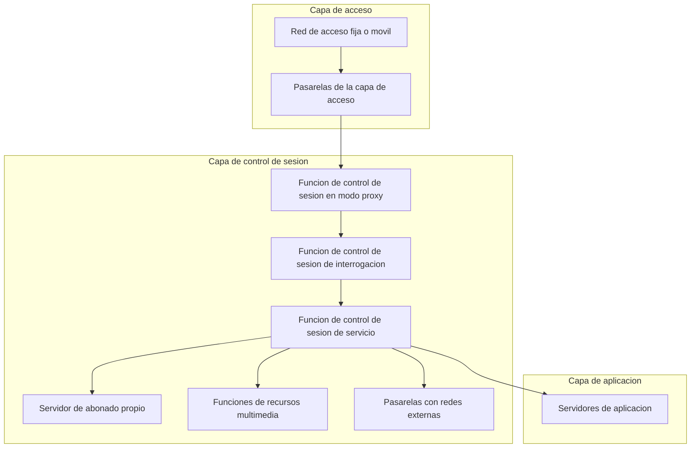
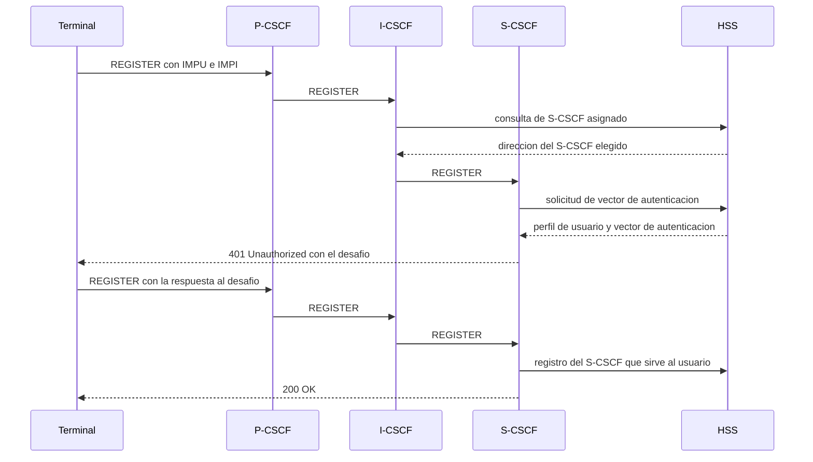
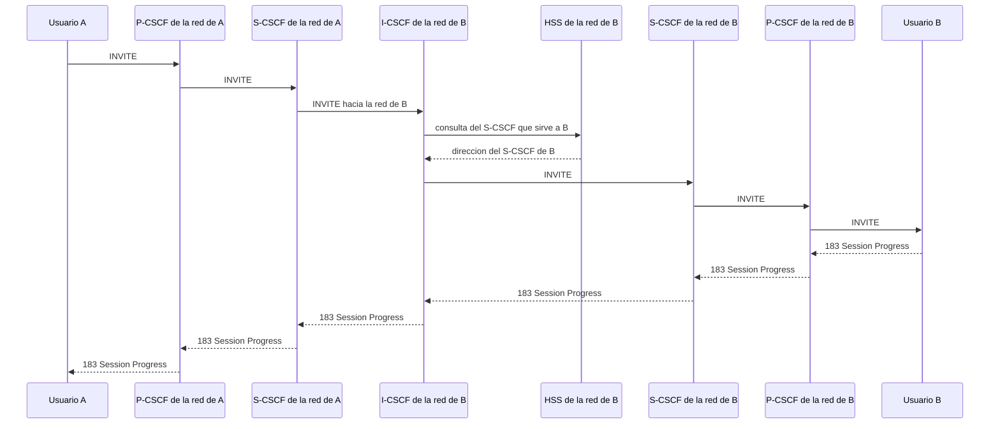

Un operador que ya converge su transporte sobre IP necesita, además de esa
infraestructura de paquetes, un subsistema capaz de controlar quién puede establecer una
sesión multimedia, con quién, y con qué calidad de servicio, sin importar si el usuario
accede desde una red fija o desde una red móvil. Ese subsistema es el **subsistema IP
multimedia** (IP Multimedia Subsystem, `IMS`). Este capítulo describe su motivación, su
arquitectura en capas, los elementos funcionales que la componen y las interfaces que
los conectan, las identidades con las que distingue a un usuario, y los dos
procedimientos centrales que sostiene: el registro de un usuario y el establecimiento de
una sesión entre dos usuarios, incluida la calidad de servicio que negocia durante ese
establecimiento. Cierra con los servicios que se apoyan directamente sobre el propio
subsistema sin depender del transporte de voz, tratado en el capítulo siguiente de esta
misma área.

## Introducción

El `IMS` es un subsistema de red dedicado al control e integración de servicios
multimedia sobre conmutación de paquetes. El 3GPP lo definió inicialmente para redes de
tercera generación, con soporte para GSM, WCDMA y CDMA2000, y en versiones posteriores
le añadió interoperabilidad con redes inalámbricas de área local, soporte para redes
fijas y soporte para redes de nueva generación. El `IMS` no define un protocolo propio
de señalización ni de descripción de sesión: se apoya en protocolos ya estandarizados
por el Grupo de Trabajo de Ingeniería de Internet, en particular el Protocolo de Inicio
de Sesión (`SIP`) y el Protocolo de Descripción de Sesión (`SDP`). Las primeras
especificaciones de `IMS` contemplaron también el Protocolo de Control de Operaciones
Comunes Abiertas (`COPS`) para la gestión de políticas de calidad de servicio, pero
desde la Release 7 esa señalización de políticas migró a `DIAMETER`, el mismo protocolo
que las interfaces descritas más adelante en este capítulo emplean frente al `HSS`, que
es el mecanismo vigente. La señalización `SIP` y la descripción `SDP` de una sesión se
tratan con el detalle que merecen en un capítulo dedicado de esta misma área, mientras
que este capítulo se centra en el subsistema que las utiliza para controlar sesiones, no
en los propios protocolos.

## Motivación y ventajas

Antes del `IMS`, cada tecnología de acceso, red fija, GSM o una red de paquetes móvil,
resolvía el control de sus propios servicios multimedia de forma aislada, con un
desarrollo de servicios atado a la tecnología de acceso concreta sobre la que corría. El
`IMS` rompe esa dependencia al situar el control de sesión en una capa común, por encima
de cualquier tecnología de acceso concreta, lo que le permite ofrecer un mismo catálogo
de servicios con independencia de cómo se conecte el usuario a la red.

### Independencia de la tecnología de acceso

El `IMS` proporciona un acceso a los servicios independiente de la tecnología de acceso,
lo que facilita la migración de aplicaciones desde redes fijas a redes móviles sin
rediseñarlas para cada tecnología de acceso concreta. Esta independencia es la misma
propiedad que distingue a una red de nueva generación del modelo en silos que la
precede, tal como se describe en el capítulo dedicado a la
[convergencia de redes](../../02_redes/05_redes_de_operador/section_1_convergencia_y_ngn.md#redes-de-nueva-generacion):
el `IMS` es, en la práctica, la capa de servicio de una red de ese tipo, aplicada de
forma específica al control de sesiones multimedia.

### Perfiles de usuario centralizados

Los perfiles de usuario del `IMS` están centralizados en un único elemento de la red
troncal, lo que permite un desarrollo más rápido de servicios basados en una
arquitectura estándar y evita que cada servicio mantenga su propia copia, potencialmente
inconsistente, de los datos de suscripción de un mismo usuario. Esa centralización
facilita además la creación de nuevas aplicaciones y la integración de servicios entre
sí, como la información de presencia, la videoconferencia, los juegos en red y las redes
sociales, y sostiene el control de las sesiones multimedia, que incluye la calidad de
servicio y la tarificación de esos servicios, sobre una única fuente de datos por
usuario en lugar de sobre copias dispersas por cada aplicación.

## Evolución de la arquitectura de red que lo introduce

La arquitectura de las redes celulares del 3GPP evolucionó desde la Release 99 hasta la
Release 6 transformando su red troncal desde una red basada en `ATM` y en multiplexación
por división en el tiempo (`TDM`) hasta una red troncal completamente basada en IP. Esa
transformación es la que hizo viable introducir el `IMS`: un subsistema de control de
sesión multimedia sobre paquetes no tiene sentido operativo mientras la red troncal que
lo sostiene siga conmutando circuitos. El 3GPP introdujo el `IMS` en la Release 5 de
esta evolución y lo consolidó en la Release 6.

Esta misma transición se repite, más adelante, en cada generación posterior: la red
troncal de LTE, la
[red troncal evolucionada](../../03_redes_moviles/03_lte/section_1_arquitectura_eps.md#red-de-acceso-y-red-troncal),
se centra en el transporte de paquetes de datos y delega la prestación de las llamadas
de voz precisamente en el `IMS`, construido sobre esa misma infraestructura de paquetes
pero ajeno al alcance de ese capítulo. La red troncal de quinta generación,
[el núcleo `5GC`](../../03_redes_moviles/04_5g/section_1_arquitectura_5gc.md#funciones-de-red),
mantiene esa misma separación de responsabilidades: el núcleo de paquetes transporta y
encamina, y el `IMS` sigue siendo la capa de control de sesión multimedia que se apoya
sobre ese transporte, con independencia de si el terminal accede a través de una red de
cuarta o de quinta generación.

## Arquitectura en capas

El `IMS` estructura sus funciones en tres capas, cada una con una responsabilidad
distinta y sin apenas dependencia de los detalles internos de las capas vecinas, lo que
permite hacer evolucionar cada una por su lado.

### Capa de acceso

La **capa de acceso** facilita el acceso al `IMS` desde redes fijas o desde redes
móviles, y establece y controla los servicios portadores (_bearer services_) de extremo
a extremo que transportan los propios flujos de medios. Las pasarelas de esta capa
convierten los formatos de voz telefónica en paquetes IP, y viceversa, cuando la sesión
cruza entre un dominio de conmutación de circuitos y el dominio de paquetes del `IMS`.
La capa de acceso es, precisamente, el punto en el que el `IMS` se apoya sobre la red
troncal de paquetes de la tecnología de acceso concreta que esté en uso, sea la
[red troncal evolucionada de LTE](../../03_redes_moviles/03_lte/section_1_arquitectura_eps.md#elementos-de-la-red-troncal)
o el
[núcleo `5GC`](../../03_redes_moviles/04_5g/section_1_arquitectura_5gc.md#funcion-del-plano-de-usuario),
sin que el resto del `IMS` necesite conocer los detalles internos de esa red troncal
subyacente.

### Capa de control de sesión

La **capa de control de sesión** permite el registro de los usuarios en el `IMS` y el
establecimiento de las sesiones multimedia entre ellos, y controla a su vez los
servidores de aplicaciones y las pasarelas de las otras dos capas. Es la capa donde
residen los elementos que se detallan en el apartado siguiente de este capítulo, y donde
transcurren los dos procedimientos centrales que se describen más adelante: el registro
de un usuario y el establecimiento de una sesión.

### Capa de aplicación

La **capa de aplicación** facilita la interacción con los servidores de aplicaciones que
almacenan y ejecutan la lógica de cada servicio concreto. Es la capa que un
desarrollador de servicios ve directamente: se apoya en la capa de control de sesión
para toda la señalización de establecimiento y de registro, sin necesidad de implementar
esa lógica de control de sesión dentro de cada servidor de aplicaciones.

## Elementos

Cada elemento del `IMS` asume una responsabilidad concreta dentro de la capa de control
de sesión o de aplicación descritas en el apartado anterior. La tabla siguiente resume
el catálogo completo antes de detallar cada elemento en los apartados que siguen.

| Elemento                              | Sigla    | Papel principal                                                  |
| ------------------------------------- | -------- | ---------------------------------------------------------------- |
| Servidor de abonado propio            | `HSS`    | Base de datos centralizada de usuarios y servicios.              |
| Servidor de aplicaciones              | `AS`     | Almacena y ejecuta los servicios.                                |
| Control de sesión en modo proxy       | `P-CSCF` | Primer punto de contacto del terminal dentro del `IMS`.          |
| Control de sesión de interrogación    | `I-CSCF` | Localiza el `S-CSCF` que sirve a un usuario destino.             |
| Control de sesión de servicio         | `S-CSCF` | Nodo central del plano de control de sesión.                     |
| Pasarela de control de encaminamiento | `BGCF`   | Encaminamiento hacia la red telefónica según número de teléfono. |
| Controlador de pasarela de medios     | `MGCF`   | Controla la `SGW` y la `MGW`.                                    |
| Pasarela de señalización              | `SGW`    | Conversión entre señalización `SIP` e `ISUP`.                    |
| Pasarela de medios                    | `MGW`    | Conversión entre `RTP` y `TDM`.                                  |
| Controlador de recursos multimedia    | `MRFC`   | Interfaz de control del `MRF` hacia el `S-CSCF`.                 |
| Procesador de recursos multimedia     | `MRFP`   | Implementa la mezcla, la transcodificación y el reconocimiento.  |

Las interfaces que conectan a estos elementos entre sí utilizan, en su mayoría, `SIP`
como protocolo de señalización, con la excepción de las que consultan al `HSS`, basadas
en `DIAMETER`, y de las que gobiernan directamente la conversión de medios en las
pasarelas.

| Interfaz | Extremos                       | Protocolo                      |
| -------- | ------------------------------ | ------------------------------ |
| `Gm`     | Terminal y `P-CSCF`.           | `SIP`.                         |
| `Mw`     | `P-CSCF`, `I-CSCF` y `S-CSCF`. | `SIP`.                         |
| `Cx`     | `I-CSCF` o `S-CSCF` y `HSS`.   | `DIAMETER`.                    |
| `ISC`    | `S-CSCF` y `AS`.               | `SIP`.                         |
| `Mg`     | `MGCF` y `S-CSCF`.             | `SIP`.                         |
| `Mn`     | `MGCF` y `MGW`.                | Control de pasarela de medios. |
| `Mr`     | `S-CSCF` y `MRFC`.             | `SIP`.                         |

### Servidor de abonado propio

El **servidor de abonado propio** (`HSS`) es la base de datos centralizada del `IMS` que
se utiliza para la gestión de usuarios y de servicios. Contiene la información de
suscripción de cada usuario, realiza su autenticación y su autorización, y puede
proporcionar información sobre su ubicación. El `HSS` del `IMS` desempeña, dentro de
este subsistema, el mismo papel funcional que el
[servidor de abonado propio](../../03_redes_moviles/03_lte/section_1_arquitectura_eps.md#servidor-de-abonado-propio)
de la red troncal de LTE, aunque almacena y expone los datos de suscripción de las
sesiones multimedia del `IMS` en lugar de los de las sesiones de datos de la red troncal
de paquetes.

### Servidores de aplicación

Los **servidores de aplicación** (`AS`) almacenan y ejecutan los servicios del `IMS`.
Implementan sus interfaces con el `S-CSCF` basadas en `SIP`, y pueden estar ubicados en
la red propia del operador o en una red externa, ofreciendo un entorno de creación de
servicios sobre el que un tercero puede desplegar aplicaciones nuevas. Existen tres
categorías de `AS`, según el modelo de servicio al que dan soporte:

- **`SIP AS`**: es el `AS` nativo para servicios basados en `SIP`. Todas las
  aplicaciones de nueva creación deben ejecutarse sobre este tipo de servidor.
- **`OSA-SCS`**: actúa de pasarela con servidores que siguen el marco de Acceso a
  Servicios Abiertos (Open Services Access, `OSA`), pensado para exponer capacidades de
  red a aplicaciones de terceros sin darles acceso directo a la señalización `SIP`.
- **`IM-SSF`**: da soporte a servicios heredados de GSM y de otras redes europeas
  anteriores al propio `IMS`, permitiendo reutilizar lógica de servicio ya desplegada en
  esas redes sin reescribirla íntegramente sobre `SIP`.

### Función de control de sesión en modo proxy

La **función de control de sesión en modo proxy** (Proxy-CSCF, `P-CSCF`) es el primer
punto de contacto del terminal dentro del `IMS`, y actúa como proxy `SIP` frente a él.
Proporciona seguridad y autenticación de usuarios, comprime las cabeceras `SIP` para
reducir el volumen de señalización sobre el enlace de acceso, y se ubica habitualmente
en la red propia del usuario, aunque también puede ubicarse en una red visitada. Incluye
funciones de decisión de política (Policy Decision Function, `PDF`) para gestionar la
calidad de servicio de la sesión, basándose en los atributos de calidad de servicio que
se negocian a nivel de aplicación, por ejemplo dentro de la propia descripción `SDP` de
la sesión. En redes móviles de segunda y tercera generación, el nodo de soporte `GGSN`
de la red de paquetes actúa como punto de aplicación de esa política (Policy Enforcement
Point, `PEP`), ejecutando sobre el tráfico real la decisión que el `PDF` del `P-CSCF` ha
tomado.

### Función de control de sesión de interrogación

La **función de control de sesión de interrogación** (Interrogating-CSCF, `I-CSCF`) es
un proxy `SIP` ubicado al borde de un dominio administrativo. Se sitúa en la red propia
del operador y es el punto de contacto dentro de esa red para todas las conexiones
destinadas a un cliente propio, con su dirección IP publicada en el DNS del dominio del
operador para que cualquier red externa pueda localizarlo. Su función principal es
encontrar el `S-CSCF` asociado al usuario destino, consultando al `HSS`, y enrutar hacia
él los mensajes `SIP` entrantes, actuando de proxy entre el `P-CSCF` de origen y el
`S-CSCF` de destino.

### Función de control de sesión de servicio

La **función de control de sesión de servicio** (Serving-CSCF, `S-CSCF`) es el nodo
central del plano de control de sesión del `IMS`. Realiza el registro del usuario,
actuando como registrador `SIP`, y se ubica en la red propia del usuario. Toda la
señalización `SIP` de una sesión atraviesa al `S-CSCF`, que la redirige hacia los
servidores de aplicación apropiados cuando el servicio lo requiere. Al recibir una
petición de registro procedente de un `I-CSCF`, el `S-CSCF` registra en el `HSS` que el
terminal queda servido por él, comunicándose con el `HSS` mediante `DIAMETER`. El
`S-CSCF` mantiene, además, el control de la sesión en curso, interpretando la
señalización `SIP` y enrutando sus mensajes hacia los `AS` que correspondan.

### Pasarelas con redes externas

Las **pasarelas con redes externas** permiten la interconexión del `IMS` con otras
redes, en particular con la red telefónica conmutada, y realizan la conversión entre los
protocolos y los formatos de señalización y de medios de cada dominio. Este mismo
conjunto de funciones se describe, con un nivel de detalle equivalente pero desde la
perspectiva de una red de nueva generación genérica, en el apartado dedicado a la
[interconexión con la red telefónica conmutada](../../02_redes/05_redes_de_operador/section_1_convergencia_y_ngn.md#interconexion-con-la-red-telefonica-conmutada);
lo que sigue es la instancia concreta de esos mismos papeles dentro del `IMS`. Incluyen
tres elementos:

- **`BGCF`** (Breakout Gateway Control Function): realiza el encaminamiento de una
  sesión hacia la red telefónica conmutada según el número de teléfono de destino,
  decidiendo por qué pasarela de salida concreta debe abandonar el dominio `IMS`.
- **`MGCF`** (Media Gateway Control Function): es el nodo central que controla tanto a
  la `SGW` como a la `MGW`, y cumple dentro del `IMS` el mismo papel que el
  [controlador de pasarela de medios](../../02_redes/05_redes_de_operador/section_1_convergencia_y_ngn.md#controlador-de-pasarela-de-medios)
  de una `NGN` genérica.
- **`MGW`** (Media Gateway Function): realiza la conversión entre `RTP` y `TDM`,
  encapsulando la voz que circula en `TDM` sobre el lado de conmutación de circuitos en
  paquetes `RTP` para el lado `IMS`, y viceversa.
- **`SGW`** (Signalling Gateway): realiza la conversión entre la señalización `SIP` del
  lado `IMS` y `ISUP`, el protocolo de señalización de la red telefónica conmutada,
  adaptando únicamente la señalización sin tocar el contenido de la conversación.

### Funciones de recursos multimedia

La **función de recursos multimedia** (`MRF`) realiza la mezcla de flujos multimedia en
una conferencia, la transcodificación en tiempo real entre formatos de medios distintos,
y el reconocimiento de voz, por ejemplo la conversión de voz a texto. El servicio de
conferencia que sostiene, ya presentado en términos generales en el capítulo que
[clasifica los servicios multimedia](../01_multimedia/section_1_servicios_multimedia.md#conferencia-y-difusion),
se apoya precisamente en esta función para mezclar los flujos de los participantes. El
`MRF` se divide en dos componentes:

- **`MRFC`** (Multimedia Resource Function Controller): proporciona la interfaz de
  control hacia el `S-CSCF`, recibiendo de él las órdenes de qué mezcla o qué
  transcodificación debe realizarse.
- **`MRFP`** (Multimedia Resource Function Processor): implementa efectivamente esas
  funciones sobre los flujos de medios, siguiendo las órdenes que recibe del `MRFC`.

## Procedimientos

Antes de describir el registro y el establecimiento de sesión, conviene fijar qué
identidad emplea el `IMS` en cada momento, porque ambos procedimientos alternan entre
dos tipos de identidad con papeles distintos. La **identidad privada de usuario** (IMS
Private User Identity, `IMPI`) identifica de forma única la suscripción de un usuario
frente al `HSS`, cumple un papel equivalente al de una identidad de abonado permanente y
solo se emplea para autenticación: nunca aparece en la señalización `SIP` que enruta una
sesión entre usuarios. La **identidad pública de usuario** (IMS Public User Identity,
`IMPU`) tiene el formato de una URI `SIP` o de una URI telefónica, y es la que un
usuario publica para que otros lo contacten y la que efectivamente circula en la
señalización `SIP` de registro y de establecimiento de sesión. Un mismo `IMPI` puede
tener asociadas varias `IMPU`, lo que permite a un usuario recibir sesiones bajo
distintas identidades públicas mientras conserva una única suscripción y una única
autenticación frente al `HSS`.

???+ example "Identidades usadas en el registro y en el establecimiento de sesión"

    Un usuario enciende su terminal `IMS` y, a continuación, recibe una llamada de otro
    usuario. Se pide identificar qué identidad se emplea en cada uno de los dos
    procedimientos y por qué no basta con una sola.

    Durante el registro, el terminal presenta su `IMPI` frente al `HSS`, a través del
    `S-CSCF`, para que la red verifique que la suscripción es válida y calcule las claves
    de seguridad correspondientes. Esa `IMPI` nunca se expone hacia el otro usuario ni
    viaja en los mensajes `SIP` que anuncian la llamada entrante. Durante el
    establecimiento de la sesión, en cambio, el mensaje `INVITE` que anuncia la llamada
    contiene la `IMPU` del usuario llamante y la `IMPU` del usuario llamado, con formato
    de URI `SIP` o de URI telefónica, porque es esa identidad pública la que el `I-CSCF`
    y el `S-CSCF` de la red destino necesitan para localizar al usuario correcto y
    enrutar hacia él la sesión. Dicho de otro modo, la `IMPI` resuelve el problema de
    autenticar una suscripción frente al operador, mientras que la `IMPU` resuelve el
    problema de enrutar una sesión entre dos usuarios con independencia de los detalles
    de esa suscripción, y ninguna de las dos identidades puede sustituir a la otra en su
    respectivo procedimiento.

### Registro de usuario

El proceso de registro en el `IMS` consta de dos fases: una primera fase en la que la
red desafía al terminal, y una segunda fase en la que el terminal responde a ese desafío
con sus credenciales. Este proceso permite al usuario, una vez completado, iniciar y
recibir sesiones. Durante su transcurso, tanto el usuario como el `P-CSCF` aprenden qué
`S-CSCF` va a servir a ese usuario, y ese `S-CSCF` no cambia mientras el registro
permanezca activo. El usuario envía periódicamente refrescos de registro para mantenerlo
vigente; si deja de hacerlo, el `S-CSCF` lo desregistra en cuanto vence el lapso de
registro concedido.

???+ example "Recorrido del registro por cada elemento y lo que cada uno retiene"

    Un usuario enciende su terminal `IMS` por primera vez en una sesión de acceso. Se
    pide trazar el registro por cada elemento que participa y precisar qué información
    retiene cada uno al finalizar el proceso.

    El terminal envía su primer `REGISTER` al `P-CSCF`, que lo reenvía sin todavía
    conocer qué `S-CSCF` debe atenderlo, porque el terminal aún no está registrado. El
    `P-CSCF` retiene, a partir de este primer intercambio, la dirección del terminal y la
    del `S-CSCF` que finalmente quede asignado, información que necesitará para todos
    los mensajes posteriores de esa sesión de registro. El `I-CSCF` recibe ese primer
    `REGISTER`, consulta al `HSS` qué `S-CSCF` debe servir a este usuario y reenvía el
    mensaje hacia él, sin retener ningún estado propio de la sesión una vez completado el
    reenvío. El `S-CSCF` seleccionado solicita al `HSS` el perfil del usuario y un vector
    de autenticación, y responde al terminal con un desafío `401 Unauthorized`. El
    terminal calcula la respuesta a ese desafío con sus credenciales y repite el
    `REGISTER`, esta vez con la respuesta correcta, que atraviesa de nuevo `P-CSCF` e
    `I-CSCF` hasta el mismo `S-CSCF`. Al validar la respuesta, el `S-CSCF` retiene el
    perfil del usuario y la asociación entre su `IMPU` y su ubicación durante todo el
    lapso de registro, y confirma al `HSS` que es él quien sirve a ese usuario a partir
    de ese momento, de modo que el `HSS` retiene, a su vez, qué `S-CSCF` concreto atiende
    a esa suscripción. Ninguno de los tres elementos duplica el estado que retienen los
    otros dos: el `P-CSCF` recuerda por dónde llegar al terminal, el `S-CSCF` recuerda el
    perfil y la ubicación del usuario mientras dura el registro, y el `HSS` recuerda,
    de forma permanente, qué `S-CSCF` lo sirve en cada momento.

### Establecimiento de sesión

El proceso de establecimiento de una sesión en el `IMS` se realiza en varios pasos que
alternan entre la red del usuario que origina la sesión y la red del usuario que la
recibe, sin que ambas redes tengan que pertenecer necesariamente al mismo operador. El
usuario A envía un mensaje `INVITE` a su `P-CSCF`, que lo procesa, descomprimiendo las
cabeceras y verificando la identidad del usuario, y lo envía al `S-CSCF` ya conocido
para A a partir de su registro. El `S-CSCF` de A procesa el mensaje y, a partir de la
identidad del usuario B que figura en él, encuentra el `I-CSCF` de la red de B y le
reenvía la petición. El `I-CSCF` de la red de B pregunta al `HSS` de esa misma red por
el `S-CSCF` que sirve a B, y reenvía el mensaje hacia él. El `S-CSCF` de B procesa el
mensaje, interactuando en su caso con algún `AS` si el servicio lo requiere, y lo pasa
al `P-CSCF` de B, que comprime las cabeceras y entrega el mensaje al propio usuario B.
El usuario B genera entonces una respuesta `183 Session Progress`, que viaja por la ruta
inversa hasta el usuario A. Tras varias interacciones adicionales que siguen el mismo
procedimiento de enrutamiento, la sesión se establece de manera efectiva y ambos
usuarios pueden emplear la aplicación.

???+ example "Sesion entre abonados de dos operadores distintos"

    Un abonado de un operador establece una llamada con un abonado de otro operador
    distinto, ambos registrados en su propio `IMS`. Se pide identificar qué elemento
    realiza la interconexión entre las dos redes.

    La señalización de A recorre su propia red hasta llegar al `S-CSCF` de A, que
    reconoce, a partir de la identidad de B, que el destino pertenece a un dominio
    administrativo distinto del suyo. En ese punto, el `S-CSCF` de A no puede localizar
    directamente al `S-CSCF` que sirve a B, porque ese dato solo existe en el `HSS` de la
    red de B, y el `S-CSCF` de A no tiene por qué tener visibilidad de la base de datos
    de otro operador. El elemento que resuelve esta frontera administrativa es el
    `I-CSCF` de la red de B: es el punto de contacto publicado en el DNS del dominio de B
    para cualquier conexión entrante destinada a uno de sus clientes, y es él quien
    consulta al `HSS` de su propia red para encontrar el `S-CSCF` correcto y completar el
    encaminamiento dentro de su dominio. La interconexión entre operadores, por tanto, no
    la realiza el `S-CSCF` de origen ni el de destino, sino el `I-CSCF` que actúa como
    frontera de entrada del dominio administrativo receptor.

### Control de calidad de servicio durante el establecimiento

El control de la calidad de servicio de una sesión se realiza mediante la función de
decisión de política del `P-CSCF` y se inicia con el propio `INVITE` que abre el
establecimiento de sesión, portando una oferta `SDP` inicial con los parámetros de
medios propuestos. A partir de esa oferta se realiza una negociación de la descripción
de sesión, con el detalle que corresponde al capítulo dedicado a esa señalización dentro
de esta misma área, y un control de reserva de recursos que verifica que la red dispone
de capacidad suficiente para los flujos de medios propuestos antes de aceptarlos. Una
vez completada esa negociación, se confirma la reserva de recursos y se inician los
propios flujos de medios, que ya no atraviesan el plano de control de sesión sino que
circulan directamente entre los extremos, o entre los extremos y el `MRF` cuando la
sesión los requiere.

## Servicios sobre IMS

Sobre la arquitectura y los procedimientos descritos en este capítulo se apoyan
servicios que no requieren transportar voz sobre la red de acceso radio, a diferencia de
los que se tratan en el capítulo siguiente de esta misma área. Estos servicios
reutilizan el registro y el establecimiento de sesión ya descritos, y en algunos casos
se apoyan en métodos `SIP` adicionales a los que intervienen en una llamada
convencional.

### Presencia

El **servicio de presencia** permite a los usuarios publicar su propio estado y conocer
el de otros usuarios, utilizando el método `SIP PUBLISH` para publicar esa información
de presencia hacia el `IMS`. Otros usuarios suscritos a esa información reciben una
notificación cada vez que el estado publicado cambia, sin necesidad de consultarlo de
forma activa y repetida.

### Pulsar para hablar

El servicio de **pulsar para hablar sobre red celular** (Push to talk over Cellular,
`PoC`) es un servicio de tipo _walkie-talkie_ que proporciona voz sobre IP
unidireccional, permitiendo la comunicación de uno a uno o de uno a varios receptores
simultáneos. A diferencia de una llamada de voz convencional, en la que ambos extremos
transmiten y reciben de forma simultánea, `PoC` solo permite que un participante
transmita en cada instante, mientras el resto escucha, de forma análoga a una radio
bidireccional tradicional.

### Mensajería instantánea

La **mensajería instantánea** permite el intercambio de información en tiempo real,
generalmente texto, entre dos o más usuarios del `IMS`. Puede integrarse con el servicio
de presencia descrito más arriba, de modo que un usuario vea el estado de disponibilidad
de sus contactos antes de iniciar una conversación, y también con otros servicios como
los juegos en red o la propia voz, combinando en una misma sesión varios tipos de
información multimedia.

El transporte de la voz sobre este mismo subsistema, incluida la voz sobre redes de
cuarta generación y los servicios de misión crítica que se apoyan en una arquitectura
muy similar a la descrita en este capítulo, se retoma en el capítulo siguiente de esta
misma área.
