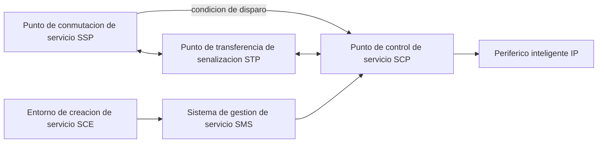
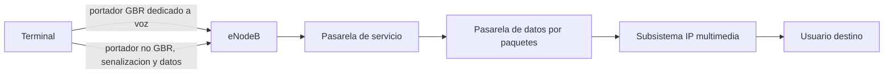
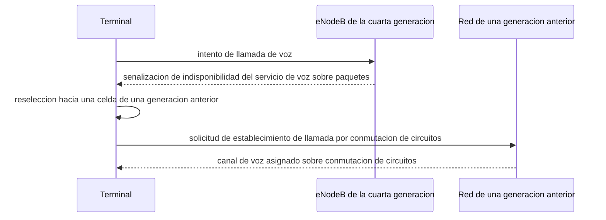
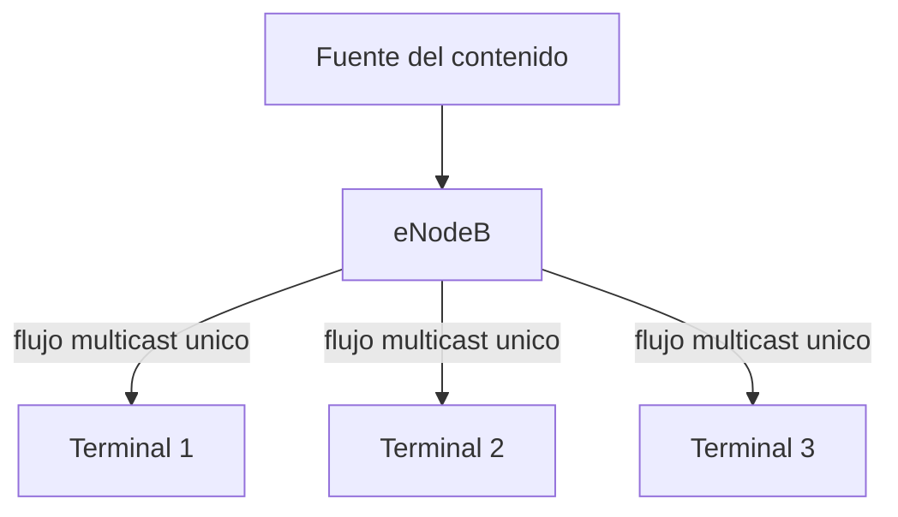

Trasladar la voz desde una red de conmutación de circuitos hasta una red de paquetes
exige resolver un conjunto de problemas que la telefonía clásica no tenía: empaquetar
una señal continua en unidades discretas, transportarlas con un retardo y una variación
del retardo acotados, y traducir la señalización hacia las redes de circuitos con las
que la nueva red convive durante toda la transición. A cambio, la voz sobre paquetes
gana la posibilidad de compartir la misma infraestructura que el resto del tráfico de
datos, de integrarse con servicios que la conmutación de circuitos nunca pudo ofrecer y
de evolucionar hacia el acceso radio de las generaciones móviles más recientes sin
depender de un canal dedicado exclusivo. Este capítulo recorre esa transición: el
servicio telefónico tradicional y la red inteligente que lo sostiene, la voz sobre IP y
sus componentes, las características del tráfico de voz y los requisitos que impone a la
red, los servicios que operan por encima de esa red sin integrarse con ella, la voz
sobre el acceso radio de la cuarta generación y su continuidad con las generaciones
anteriores, la voz sobre una red inalámbrica local, los servicios de misión crítica y la
difusión sobre una red móvil.

## Introducción

El **servicio telefónico** es el conjunto de facilidades y medios que un proveedor de
servicio pone a disposición de un usuario para comunicarse con otro, e incluye tanto los
elementos físicos y lógicos que sostienen esa comunicación como la información que se
intercambia durante ella. La Unión Internacional de Telecomunicaciones clasifica los
servicios de telecomunicación en dos categorías: los **servicios portadores**, que
proporcionan únicamente la capacidad de transmitir señales entre dos puntos de
terminación de red, y los **servicios finales** o **teleservicios**, que proporcionan la
capacidad completa para la comunicación entre usuarios, incluida la propia aplicación
que da sentido a esa comunicación. El servicio telefónico es, en este sentido, un
teleservicio: no basta con transmitir la señal de voz, sino que además hay que
establecer la llamada, facturarla y ofrecer los servicios suplementarios que la
acompañan.

## Servicio telefónico tradicional

El **servicio telefónico básico** consiste en la comunicación de voz entre terminales
conectados a puntos de terminación de red de la red telefónica básica (`RTB`), con un
canal vocal limitado a la banda de 300 a 3400 Hz. La transmisión es analógica en el
bucle de abonado, el tramo final entre el domicilio del usuario y la central de
conmutación más próxima, y digital en el resto de la red. Este servicio básico incluye
la asignación de un número de teléfono, la instalación de un punto de terminación de
red, un buzón de voz y la facturación detallada de las llamadas realizadas, y admite
además la contratación de servicios suplementarios sobre esa base.

### Arquitectura de la red inteligente

La **red inteligente** es una plataforma basada en la interconexión de nodos donde
residen aplicaciones informáticas, centrales de conmutación y bases de datos, que
facilita el desarrollo, el control y la gestión de servicios sin necesidad de modificar
las centrales de conmutación cada vez que se introduce un servicio nuevo. Seis elementos
funcionales componen su arquitectura, cada uno con una responsabilidad concreta dentro
del tratamiento de una llamada.

| Elemento                               | Sigla | Función principal                                                                                                                |
| -------------------------------------- | ----- | -------------------------------------------------------------------------------------------------------------------------------- |
| Punto de conmutación de servicio       | `SSP` | Intercepta las solicitudes de servicios de red inteligente mediante condiciones de disparo.                                      |
| Periférico inteligente                 | `IP`  | Captura o genera información adicional para el servicio mediante interacción con el usuario.                                     |
| Punto de transferencia de señalización | `STP` | Nodo de conmutación de paquetes de señalización.                                                                                 |
| Punto de control de servicio           | `SCP` | Cerebro de la red inteligente, con acceso a la base de datos y a la lógica que responde a las llamadas del `SSP` en tiempo real. |
| Sistema de gestión de servicio         | `SMS` | Recoge estadísticas y alarmas, y despliega nuevos servicios.                                                                     |
| Entorno de creación de servicio        | `SCE` | Facilita la creación de nuevos servicios.                                                                                        |

El `SSP` detecta, mediante una condición de disparo previamente configurada, que una
llamada requiere un tratamiento especial, y suspende su procesamiento normal para
consultar al `SCP`. El `SCP` accede a su base de datos y a la lógica de servicio
correspondiente, decide en tiempo real cómo continuar la llamada, y puede recurrir al
`IP` cuando el servicio necesita interactuar directamente con el usuario, por ejemplo
para solicitar un código o reproducir un mensaje. La señalización entre el `SSP` y el
`SCP` atraviesa la red de señalización a través del `STP`. El `SMS` y el `SCE` operan en
un plano distinto, de gestión y de creación de servicios, sin intervenir en el
tratamiento de una llamada concreta en curso.

### Servicios que habilita

La red inteligente habilita varias categorías de servicios que no dependen de modificar
la central de conmutación para cada nuevo despliegue:

- **Encaminamiento y traducción de número**: reescribe o redirige el número marcado
  antes de completar la llamada, por ejemplo para servicios de numeración especial o de
  portabilidad.
- **Redes privadas virtuales**: ofrece a una organización un plan de numeración y de
  tarificación propio sobre la infraestructura de la `RTB`, sin necesidad de una red
  física dedicada.
- **Tarificación especial**: aplica un esquema de facturación distinto del habitual a un
  número concreto, como las llamadas de coste compartido o gratuitas para quien llama.
- **Servicios orientados al operador**: facilita funciones de gestión de red que el
  propio operador consume internamente, en lugar de ofrecerlas directamente al usuario
  final.

## Voz sobre IP

La **voz sobre IP** (`VoIP`) consiste en la transmisión de voz utilizando el protocolo
de Internet como portador, en lugar de un canal de circuito dedicado. La señal de voz se
codifica en forma digital y se transmite en paquetes sobre una red de conmutación de
paquetes, que ofrece además todas las funciones propias de una red telefónica:
establecimiento y terminación de la llamada, señalización, servicios suplementarios y
facturación. Frente a la conmutación de circuitos, esta solución exige resolver tres
problemas que la telefonía clásica no tenía que afrontar: garantizar un retardo extremo
a extremo compatible con una conversación, absorber la variación de ese retardo cuando
la red no reserva un canal dedicado, y traducir la señalización hacia la `RTB` en los
puntos donde ambas redes se interconectan. A cambio, gana la posibilidad de compartir la
misma infraestructura que el resto del tráfico de datos, de desplegar servicios
suplementarios como software sin intervenir en la central de conmutación, y de
evolucionar hacia el acceso radio de las generaciones móviles más recientes sin depender
de un canal de circuito exclusivo, según se detalla en el resto de este capítulo.

### Componentes de una solución de voz sobre IP

Una solución de voz sobre IP se compone de tres tipos de elementos:

- **Clientes**: establecen y terminan las llamadas de voz, y son el punto donde el
  usuario codifica y descodifica la señal de voz.
- **Servidores**: se encargan de las operaciones de registro y de validación de los
  usuarios que participan en el servicio.
- **Pasarelas** (_gateways_): convierten los paquetes de voz de la red IP en señales que
  un teléfono convencional pueda interpretar, y viceversa.

Una variante de `VoIP` es la comunicación **pulsar para hablar**, de tipo unidireccional
y semidúplex, en la que un usuario transmite mientras el resto escucha. El subsistema
que sostiene esta variante sobre una red de operador y sus identidades de usuario se
describen en el capítulo que
[presenta el subsistema IP multimedia](section_1_ims.md#pulsar-para-hablar).

### Centralita privada virtual

Una **centralita privada virtual** (Private Branch Exchange, `PBX`) es una centralita
telefónica privada que conecta a una organización con la `RTB` y permite, además,
realizar llamadas internas entre sus propios usuarios sin ningún coste adicional. Una
`PBX` sobre `VoIP` sustituye la conmutación de circuitos interna de una centralita
tradicional por conmutación de paquetes, sin alterar su función frente al exterior:
sigue actuando como un único punto de conexión de la organización hacia la red
telefónica pública.

### Pasarelas hacia la red telefónica

Las pasarelas hacia la red telefónica resuelven la interconexión entre el dominio de
paquetes de una solución `VoIP` y el dominio de circuitos de la `RTB`, convirtiendo
tanto la señalización como los propios flujos de voz entre ambos dominios. Esta misma
función, descrita con mayor detalle desde la perspectiva de una red de nueva generación
genérica, se trata en el capítulo dedicado a la
[interconexión con la red telefónica conmutada](../../02_redes/05_redes_de_operador/section_1_convergencia_y_ngn.md#interconexion-con-la-red-telefonica-conmutada):
la pasarela de señalización adapta el protocolo de señalización de cada dominio, y la
pasarela de medios convierte entre la voz empaquetada en `RTP` y la voz multiplexada por
división en el tiempo (`TDM`) del lado de circuitos.

## Características del tráfico de voz

El tráfico de voz se caracteriza de forma distinta según viaje sobre conmutación de
circuitos o sobre conmutación de paquetes, porque el propio mecanismo de transporte
condiciona qué parámetros describen ese tráfico y qué exigencias impone a la red que lo
cursa.

### Voz sobre conmutación de circuitos

Sobre conmutación de circuitos, el tráfico de voz se caracteriza mediante la
**intensidad de tráfico**, la duración media de las llamadas y la probabilidad de
bloqueo que sufren cuando no hay circuitos disponibles. La unidad de intensidad de
tráfico es el **erlang**: un erlang equivale a un circuito ocupado de forma continua
durante una hora, o de forma equivalente, a un conjunto de llamadas cuya duración total
sumada equivale a una hora de ocupación. El modelado formal de esta intensidad, la
fórmula de Erlang B que la relaciona con la probabilidad de bloqueo y el dimensionado de
canales que se deriva de ella se desarrollan en detalle en el capítulo dedicado al
[dimensionado de tráfico](../../06_trafico/01_colas/section_2_erlang_y_dimensionado.md#definicion-de-erlang);
lo que interesa aquí es que ese modelo es el mismo que dimensiona los canales de voz de
cualquier red de conmutación de circuitos, desde la `RTB` hasta la interfaz radio de las
generaciones móviles que reservan un canal de voz dedicado, como la voz sobre
[conmutación de circuitos de la segunda generación](../../03_redes_moviles/02_gsm_y_umts/section_1_gsm.md#servicios-ofrecidos).

### Voz sobre conmutación de paquetes

Sobre conmutación de paquetes, el tráfico de voz se modela distinguiendo dos estados
alternos de la conversación: un periodo de actividad, `ON`, durante el que el
interlocutor habla y genera paquetes, y un periodo de inactividad, `OFF`, durante el que
permanece en silencio. Durante el periodo `ON` se asumen constantes los dos parámetros
básicos que describen la fuente: el tamaño medio de paquete y el tiempo medio entre
paquetes consecutivos. La duración de cada periodo, tanto `ON` como `OFF`, se modela
habitualmente mediante una distribución exponencial,

$$
f(t) = \frac{1}{t_0} e^{-t / t_0}
$$

donde $t$ es la duración del periodo considerado y $t_0$ es su valor medio, el parámetro
que fija tanto la duración típica de una ráfaga de actividad como la de un silencio
entre ráfagas. Este modelo de ráfagas alternas es el mismo que caracteriza, de forma más
general, el tráfico de audio comprimido descrito en el capítulo que
[caracteriza el tráfico multimedia](../01_multimedia/section_1_servicios_multimedia.md#modelado-de-rafagas-y-periodos-de-silencio);
lo que aporta esta sección es su instancia concreta para la voz, con sus dos estados
`ON` y `OFF` y sus dos parámetros de tamaño y de intervalo entre paquetes.

| Parámetro            | Conmutación de circuitos                            | Conmutación de paquetes                                                      |
| -------------------- | --------------------------------------------------- | ---------------------------------------------------------------------------- |
| Unidad de intensidad | Erlang, circuito-hora.                              | Tamaño medio de paquete y tiempo medio entre paquetes.                       |
| Modelo de actividad  | Ocupación continua del circuito durante la llamada. | Alternancia de periodos `ON` y `OFF` modelados con distribución exponencial. |
| Recurso reservado    | Canal dedicado durante toda la llamada.             | Ninguno, capacidad compartida con el resto del tráfico.                      |

### Requisitos de retardo, variación y tasa de error

El servicio de voz impone a la red que lo transporta cuatro requisitos de calidad. Exige
una **velocidad garantizada**, que depende de la tasa binaria del códec empleado; una
**calidad de voz** mínima, expresada como una tasa de error de bit inferior a $10^{-6}$;
un **retardo** bajo, inferior a 200 ms de extremo a extremo; y un **_jitter_** mínimo,
la variación de ese retardo entre paquetes consecutivos del mismo flujo. Estos cuatro
requisitos son la instancia concreta, para la voz, del presupuesto de calidad que un
[servicio conversacional](../01_multimedia/section_1_servicios_multimedia.md#retardo)
impone de forma general a cualquier flujo multimedia en tiempo real: la voz es,
precisamente, el ejemplo canónico de esa categoría.

???+ example "Presupuesto de retardo de una llamada sobre el acceso radio LTE"

    Una llamada de voz sobre IP se transporta sobre el acceso radio de la cuarta
    generación empleando un códec que empaqueta la voz en tramas de 20 ms. Se asume
    que, en el peor caso considerado, un paquete sufre una retransmisión híbrida en el
    enlace ascendente de origen, que la red troncal y el subsistema multimedia
    introducen un retardo de transporte de 10 ms hasta la interconexión con el
    destino, que la transmisión sobre el enlace descendente hacia el destino no
    requiere retransmisión, que el receptor introduce un retardo de descodificación de
    5 ms y que el búfer de reproducción del receptor retiene las muestras durante
    60 ms para absorber la variación del retardo. Se pide comprobar si ese presupuesto
    respeta el límite de 200 ms extremo a extremo que exige un servicio conversacional
    de voz.

    El intervalo de transmisión de la interfaz radio de la cuarta generación dura
    1 ms, y una retransmisión híbrida completa añade un tiempo de ida y vuelta de
    8 ms, de modo que el enlace ascendente de origen contribuye con
    $1 + 8 = 9$ ms en el peor caso considerado. Sumando cada contribución del
    presupuesto:

    $$
    T = T_\text{codec} + T_\text{ascendente} + T_\text{troncal} +
    T_\text{descendente} + T_\text{decod} + T_\text{bufer}
    $$

    $$
    T = 20 + 9 + 10 + 1 + 5 + 60 = 105\ \text{ms}
    $$

    donde $T_\text{codec}$ es el retardo de empaquetado del códec, $T_\text{ascendente}$
    y $T_\text{descendente}$ son las contribuciones de cada tramo del acceso radio,
    $T_\text{troncal}$ es el retardo de transporte por la red troncal y por el
    subsistema multimedia, $T_\text{decod}$ es el retardo de descodificación en el
    receptor y $T_\text{bufer}$ es el margen que retiene el búfer de reproducción. El
    resultado, 105 ms, respeta el límite de 200 ms con un margen de 95 ms disponible
    para absorber variaciones adicionales de propagación o retransmisiones que el
    escenario considerado no ha incluido, lo que confirma que un portador dedicado con
    tasa garantizada, descrito más adelante en este capítulo, resulta suficiente para
    sostener una llamada de voz dentro de su presupuesto conversacional.

### Amortiguamiento de la variación del retardo

Para reducir el _jitter_ percibido por el usuario resulta necesario reducir el búfer a
nivel de aplicación, amortiguar las variaciones del retardo mediante un búfer de
reproducción y descartar los paquetes cuyo retardo supera el margen que ese búfer puede
absorber. El mecanismo general de este búfer, su dimensionado y el compromiso entre el
margen de variación que absorbe y el retardo adicional que introduce se describen en el
capítulo que
[dimensiona el búfer de reproducción](../01_multimedia/section_1_servicios_multimedia.md#variacion-del-retardo);
lo que añade esta sección es que, para la voz, ese margen compite directamente con un
presupuesto de retardo extremo a extremo mucho más ajustado que el de un servicio bajo
demanda, lo que obliga a mantener el búfer de voz considerablemente más pequeño que el
de un servicio de _streaming_ de audio o de vídeo.

## Servicios sobre la cima de la red

Los **servicios sobre la cima de la red** (Over The Top, `OTT`) son aplicaciones y
contenido digital que se entregan a través de Internet utilizando la conectividad
existente, sin intervención directa del operador que presta esa conectividad. La voz
sobre IP como servicio `OTT` opera bajo un compromiso de mejor esfuerzo (_best effort_):
la red no reserva recursos específicos para ella, a diferencia de la voz sobre LTE que
se describe más adelante en este capítulo.

### Soluciones propietarias y basadas en estándares

Existen dos aproximaciones a la voz sobre IP como servicio `OTT`. Las **soluciones
propietarias**, como Skype, definen su propio protocolo de señalización y de transporte
sin publicarlo como estándar abierto. Las **soluciones basadas en estándares** se apoyan
en protocolos ya normalizados, en particular el protocolo de inicio de sesión y el
protocolo de transporte en tiempo real que se describen en los capítulos dedicados a la
[señalización de sesiones multimedia](../02_protocolos/section_1_sip_y_sdp.md) y al
transporte de sus flujos, apoyado a su vez en el protocolo de transporte
[sin conexión de la capa de transporte de Internet](../../02_redes/02_ip/section_2_protocolos_de_transporte.md#udp).

### Limitaciones de calidad, numeración y seguridad

La compatibilidad entre distintas soluciones `OTT` de voz sobre IP no está asegurada,
del mismo modo que tampoco lo están su calidad ni su seguridad, precisamente porque
operan bajo un compromiso de mejor esfuerzo: la red puede introducir pérdida de
paquetes, retardo elevado o _jitter_ excesivo sin que ningún mecanismo de la propia red
lo evite. La numeración tampoco sigue los estándares tradicionales de la telefonía,
porque estas soluciones suelen emplear identificadores propios en lugar de un número de
la red telefónica pública. A pesar de estas limitaciones, una ventaja notable de estos
servicios es que suelen resultar más asequibles que la telefonía convencional y ofrecen
una misma solución tanto para redes fijas como para redes móviles, sin coste adicional
por cambiar de una a otra.

## Voz sobre LTE

La **voz sobre LTE** (`VoLTE`) lleva las capacidades de una llamada de voz a la red de
acceso radio de la cuarta generación, igualando o superando la calidad y la eficiencia
de las redes de generaciones anteriores. A diferencia de la voz sobre IP como servicio
`OTT`, `VoLTE` no opera bajo un compromiso de mejor esfuerzo: se apoya en un portador de
acceso radio con tasa de bits garantizada, dimensionado específicamente para el tráfico
de voz.

### Integración con el subsistema multimedia

`VoLTE` se apoya en el [subsistema IP multimedia](section_1_ims.md) para todo el control
de la sesión de voz: el registro del usuario, el establecimiento de la llamada y la
negociación de sus parámetros de medios siguen exactamente los procedimientos que ese
capítulo describe, sin ninguna variante específica de `VoLTE` en ese plano de control.
Lo que sí es específico de `VoLTE` es el portador que transporta los propios paquetes de
voz sobre la interfaz radio: un
[portador de tasa de bits garantizada mínima](../../03_redes_moviles/03_lte/section_1_arquitectura_eps.md#portadores-con-y-sin-tasa-garantizada),
reservado para aplicaciones que exigen un rendimiento mínimo y un _throughput_
constante, como la propia voz sobre IP.

### Continuidad con tecnologías previas

`VoLTE` enfrenta la compatibilidad del dispositivo y la gestión de la transición entre
las tecnologías de voz antiguas y la nueva como uno de sus principales desafíos. Un
terminal que se encuentra bajo cobertura de la cuarta generación pero que no dispone de
`VoLTE`, o cuya red no ofrece todavía el servicio en esa celda, recurre a un
procedimiento de continuidad hacia una generación anterior que sí ofrece voz sobre
conmutación de circuitos, en lugar de dejar la llamada sin cursar.

???+ example "Coste en tiempo de un traspaso hacia una generación anterior"

    Un terminal que no dispone de voz sobre LTE, o cuya celda no la ofrece todavía,
    intenta cursar una llamada de voz. Se pide razonar por qué ese procedimiento de
    continuidad hacia una generación anterior introduce un tiempo de establecimiento
    mayor que una llamada `VoLTE` directa, y qué le cuesta al usuario esa diferencia.

    Una llamada `VoLTE` establece su portador de voz sobre la misma celda en la que el
    terminal ya se encuentra registrado, sin necesidad de cambiar de tecnología de
    acceso: el establecimiento se completa en el orden de cientos de milisegundos,
    dominado por la señalización del subsistema multimedia descrita en el capítulo
    anterior. El procedimiento de continuidad hacia una generación anterior, en
    cambio, exige que el terminal abandone la celda de cuarta generación, busque y
    seleccione una celda de una generación anterior, y complete sobre ella un
    establecimiento de llamada por conmutación de circuitos completo, con su propia
    señalización de acceso y de autenticación. Esa secuencia añade, de forma
    característica, varios segundos al tiempo de establecimiento percibido por el
    usuario frente al establecimiento sub-segundo de una llamada `VoLTE` directa. El
    coste no se limita al tiempo: mientras la llamada se cursa por conmutación de
    circuitos, el terminal pierde también la conectividad de datos por paquetes de
    alta velocidad que la cuarta generación le ofrecía, porque la generación anterior
    a la que ha retrocedido no sostiene ambos servicios de forma simultánea con la
    misma capacidad.

### Requisitos en terminal y en red

Desplegar `VoLTE` exige mecanismos específicos de calidad de servicio y de seguridad
tanto en la red como en el propio terminal, un esquema de numeración similar al que ya
emplean las generaciones anteriores, una implementación concreta en la tarjeta `SIM` y
en el software del terminal, y la posibilidad de facturar servicios adicionales sobre la
llamada básica. La red debe establecer además mecanismos específicos para interoperar
con soluciones de voz previas, incluidos los servicios de misión crítica que se
describen más adelante en este capítulo, de modo que un usuario de una de esas
soluciones pueda comunicarse con un usuario `VoLTE` sin percibir la frontera entre ambas
tecnologías.

## Voz sobre Wi-Fi

La **voz sobre Wi-Fi** (`VoWi-Fi`) es una variante de `VoLTE`, respaldada por la GSMA,
pensada para zonas con cobertura de la cuarta generación deficiente. Ofrece al usuario
una experiencia de llamada continua con independencia del tipo de dispositivo, facilita
el traspaso entre una red Wi-Fi y una red móvil, y soporta itinerancia sin
interrupciones perceptibles, descargando tráfico de la red de la cuarta generación
cuando el terminal se conecta a través de una red Wi-Fi estable. Su despliegue exige
cambios tanto en los dispositivos como en la red: los terminales compatibles incorporan
una pila de protocolos específica que emplea señalización `SIP` e `IMS` para el control
de la llamada, exactamente la misma que utiliza `VoLTE`, y transporta la propia voz
mediante `RTP`, lo que permite integrar `VoWi-Fi` en la red del operador e
interconectarlo con otros métodos de llamada sin un tratamiento diferenciado en el
subsistema multimedia.

## Servicios críticos

Los **servicios de misión crítica** (Mission Critical Services, `MCS`) del 3GPP ofrecen
una solución integral de comunicaciones para grupos cerrados de usuarios, diseñada
específicamente para cuerpos de seguridad y de emergencias, y construida como una
extensión de `VoLTE` sobre la misma arquitectura de acceso radio y de subsistema
multimedia descrita en este capítulo.

### Comunicaciones en grupo cerrado

Además de admitir llamadas de voz instantáneas, `MCS` se extiende a la transmisión de
datos y de vídeo en tiempo real, lo que facilita la coordinación eficiente y el
intercambio de información crítica entre los miembros de un grupo cerrado de usuarios.
Al seguir los estándares del 3GPP, garantiza interoperabilidad y calidad de servicio
como una extensión directa de `VoLTE`, en lugar de como un servicio construido sobre una
arquitectura independiente.

???+ example "Qué necesita un servicio de misión crítica frente a una llamada de voz"

    Un cuerpo de seguridad evalúa sustituir su sistema de radio troncal privado por
    un servicio de comunicaciones sobre la red móvil de un operador. Se pide razonar
    qué requisitos adicionales, más allá de los de una llamada de voz convencional,
    debe cumplir esa sustitución.

    Una llamada de voz convencional conecta a dos usuarios de forma individual, con un
    portador dedicado por llamada y sin ninguna noción de grupo. Un servicio de
    misión crítica, en cambio, necesita establecer comunicación con un grupo cerrado
    completo de forma prácticamente instantánea, de modo que cualquier miembro pueda
    hablar y ser escuchado por el resto sin repetir un establecimiento de llamada
    individual por cada destinatario. Necesita, además, combinar voz con datos y con
    vídeo en tiempo real dentro de la misma sesión de grupo, algo que una llamada de
    voz convencional no contempla. Y necesita, por su ámbito de aplicación en
    seguridad y en emergencias, una disponibilidad y una prioridad de acceso a los
    recursos radio superiores a las de un usuario de datos convencional, precisamente
    el requisito que se detalla en el apartado siguiente.

### Requisitos de disponibilidad

`MCS` busca reemplazar las soluciones propietarias de radio troncal más antiguas y
ampliar la cobertura de la cuarta generación hacia áreas que esas soluciones
propietarias no cubrían. Se implementa tanto en los dispositivos móviles como en la
infraestructura de la red, y utiliza el mismo protocolo de señalización, `SIP` e `IMS`,
y el mismo transporte de voz extremo a extremo mediante `RTP` que `VoLTE`, lo que le
permite integrarse con otros métodos de llamada de la red y garantizar interoperabilidad
entre usuarios de misión crítica y usuarios de una llamada de voz convencional.

## Difusión y multidifusión sobre red móvil

El **servicio de difusión y multidifusión multimedia evolucionado** (Evolved Multicast
Broadcast Multimedia Service, `eMBMS`) es una tecnología del 3GPP diseñada para la
transmisión eficiente de contenido multimedia sobre la red de la cuarta generación,
complementaria a la entrega individual que describe el resto de este capítulo.

Su característica principal es la **implementación de tráfico multicast**: un único
flujo de datos se transmite a múltiples usuarios de forma simultánea, en lugar de
replicar ese mismo flujo una vez por cada usuario receptor, lo que optimiza de forma
notable el uso de los recursos de la red frente a la entrega individual. Para
soportarlo, la infraestructura de la red móvil se extiende con nuevos componentes e
interfaces tanto en la estación base como en la red troncal de paquetes, y los propios
terminales deben ser compatibles con `eMBMS` para poder recibir sus transmisiones
multicast. Esta tecnología se aplica a servicios de difusión concretos, como la
televisión sobre el terminal móvil, que entregan el mismo contenido multimedia a un
número elevado de usuarios de forma simultánea con un consumo de recursos muy inferior
al que exigiría entregar ese mismo contenido de forma individual a cada uno de ellos.
