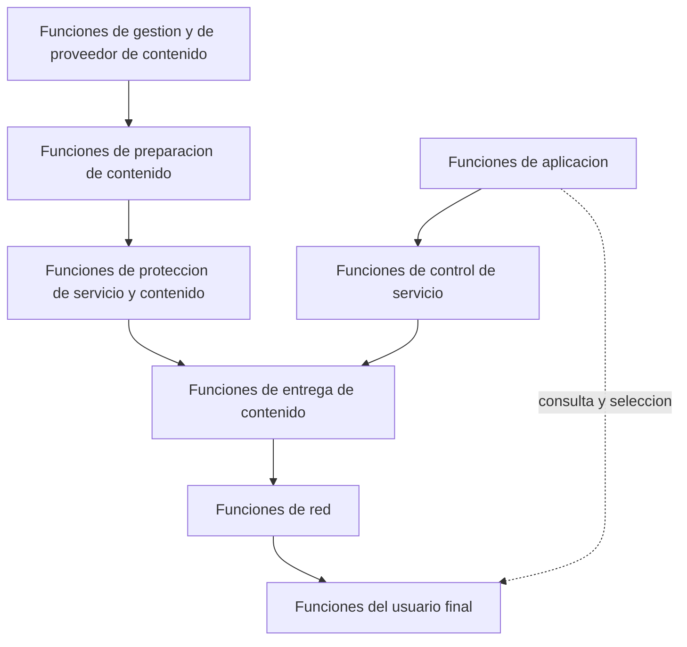
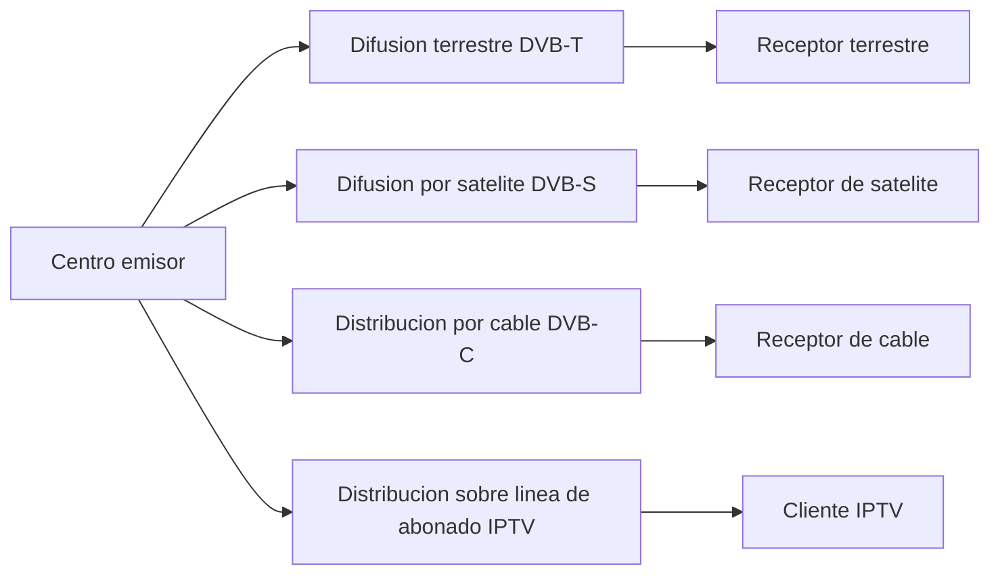
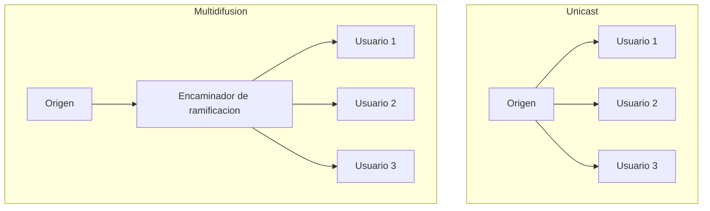

Un canal de televisión o una emisora de radio comparten un mismo problema de
distribución: un único origen de contenido debe alcanzar a una audiencia amplia y
dispersa, sin que la red conozca de antemano cuántos receptores hay ni dónde están. Este
capítulo recorre las soluciones que la industria ha dado a ese problema, desde la
televisión sobre IP entregada por un operador de red gestionada hasta la radiodifusión
sonora y la televisión digital entregadas sobre ondas terrestres, satélite o cable.
Cierra el catálogo de servicios que puede ofrecer una plataforma de este tipo, desde la
difusión lineal hasta el vídeo bajo demanda y la publicidad dirigida.

## Introducción

La **televisión sobre IP** (Internet Protocol Television, `IPTV`) es, según la
definición normalizada por la Unión Internacional de Telecomunicaciones, la distribución
de servicios de televisión digital a usuarios suscritos a una red gestionada por un
operador. Esa gestión de la red es lo que distingue a `IPTV` del vídeo genérico que
circula por Internet: el llamado «vídeo por Internet» ofrece un servicio de mejor
esfuerzo, sin garantía de calidad, mientras que `IPTV` se apoya en una red propia del
operador que asegura la calidad de entrega de principio a fin. La distribución se
realiza sobre redes de banda ancha mediante el protocolo `IP`, utilizando un **canal
descendente** para llevar los contenidos hasta el usuario y un **canal ascendente** para
que el usuario interactúe con el servicio, por ejemplo seleccionando un canal o
solicitando una reproducción bajo demanda.

## Televisión sobre IP

### Diferencia respecto al vídeo por Internet

Un servicio de vídeo genérico sobre Internet transporta sus flujos a través de una
sucesión de redes que no pertenecen a un único operador, y ninguno de esos tramos
reserva capacidad específica para ese tráfico: el servicio compite por el ancho de banda
disponible en cada instante con el resto del tráfico de la red, exactamente en el mismo
régimen de mejor esfuerzo que ya se describió para los servicios de voz que operan
[sobre la cima de la red](../03_ims_y_voz/section_2_voz_sobre_ip_y_volte.md#servicios-sobre-la-cima-de-la-red).
`IPTV`, en cambio, se distribuye sobre la infraestructura propia del operador que presta
el servicio, de extremo a extremo, lo que le permite dimensionar cada tramo de la red
con la capacidad que el catálogo de canales y de contenidos bajo demanda exige, y
aplicar mecanismos de reserva de recursos que un servicio sobre la cima de la red no
puede exigir a redes que no controla. Esta diferencia no es solo administrativa: es la
que permite a `IPTV` ofrecer una calidad de servicio garantizada donde el vídeo genérico
por Internet solo puede ofrecer una calidad mejor esfuerzo.

???+ example "Por qué un operador no garantiza la calidad de un vídeo ajeno"

    Un operador de banda ancha vende a sus abonados tanto un servicio de `IPTV` propio
    como el acceso a Internet genérico con el que esos mismos abonados consumen vídeo
    de proveedores externos. Se pide razonar por qué el operador puede comprometerse
    contractualmente con la calidad del primer servicio y no con la del segundo, aunque
    ambos flujos de vídeo compartan el mismo acceso de última milla hasta el domicilio
    del abonado.

    El tramo de acceso hasta el domicilio es, en efecto, común a los dos servicios y el
    operador lo controla en ambos casos. La diferencia aparece en el resto del
    recorrido: el flujo de `IPTV` se origina dentro de la propia red del operador, que
    puede reservarle capacidad en cada conmutador y encaminador intermedio porque
    conoce de antemano su origen, su volumen y su destino. El flujo de vídeo de un
    proveedor externo, en cambio, atraviesa redes de tránsito ajenas al operador antes
    de llegar a su red de acceso, y ninguna de esas redes intermedias le debe al
    operador ninguna garantía de entrega. El operador solo controla, por tanto, el
    tramo final del recorrido de ese segundo flujo, y ese control parcial es
    insuficiente para sostener un compromiso de calidad extremo a extremo.

### Canal descendente y canal de interacción

Toda plataforma de `IPTV` estructura su tráfico en dos canales de naturaleza distinta.
El **canal descendente** transporta los contenidos, ya sea la programación lineal de los
canales de televisión o los flujos que responden a una petición bajo demanda, desde la
plataforma del operador hasta el equipo terminal del usuario. El **canal de
interacción**, en sentido opuesto, lleva las peticiones del usuario hacia la plataforma:
la selección de un canal, la petición de un título bajo demanda, la navegación por una
guía electrónica de programación o cualquier otra acción que exija respuesta del
sistema. Esta separación entre un canal de gran volumen y sentido único, y un canal de
señalización de volumen reducido y doble sentido, es la misma que atraviesa el resto de
servicios multimedia de esta área, y aquí se traduce en una asimetría de capacidad
marcada entre ambos sentidos del enlace de acceso.

## Arquitectura de red

### Dominios funcionales

Una plataforma de `IPTV` reparte sus funciones entre un dominio de red, gestionado
íntegramente por el operador, y un dominio de usuario, que comprende el acceso hasta el
domicilio del abonado y el equipo que allí decodifica los contenidos. Esta separación de
dominios es la que permite tratar por separado, en las secciones siguientes, la
tecnología de acceso empleada y el papel del equipo terminal, antes de entrar en el
detalle de la arquitectura funcional completa del sistema.

### Acceso del usuario

El acceso hasta el domicilio del usuario se realiza habitualmente mediante tecnologías
de línea de abonado digital, en particular `ADSL` o `VDSL`, cuya estructura de canales y
cuyo compromiso entre velocidad y distancia se describen con detalle en el capítulo
dedicado a las
[redes de acceso fijo](../../02_redes/03_conmutacion_y_lan/section_2_redes_de_acceso_fijo.md#tecnologias-de-linea-de-abonado-digital).
Lo que aporta esta sección es que, sobre ese mismo acceso, `IPTV` reserva parte de la
capacidad disponible al canal descendente de contenidos y otra parte al resto del
tráfico de datos del abonado, de modo que el régimen binario que ofrece la tecnología de
acceso elegida acota de forma directa cuántos flujos simultáneos de televisión puede
sostener un mismo domicilio.

### Equipo terminal

El **cliente `IPTV`** es el dispositivo instalado en las dependencias del usuario que
decodifica los flujos de vídeo recibidos por el canal descendente y traduce las acciones
del usuario en peticiones sobre el canal de interacción. Es, en la práctica, el punto de
contacto entre la red del operador y el televisor o el dispositivo de reproducción del
usuario, y su papel exacto dentro de la arquitectura funcional completa del sistema se
detalla en la sección siguiente, dentro de las funciones del usuario final.

## Arquitectura funcional

Una plataforma de `IPTV` se organiza en un conjunto de bloques funcionales, cada uno con
una responsabilidad concreta dentro de la selección, la preparación, la protección, el
control y la entrega de los contenidos.



### Funciones del usuario final

Las **funciones del usuario final** actúan como intermediarias entre el usuario y el
resto de la plataforma, y se dividen en dos bloques. Las **funciones del terminal
`IPTV`** recogen los comandos de control que introduce el usuario, interactúan con las
funciones de aplicación para obtener la información de los servicios disponibles y se
encargan del descifrado y de la decodificación de los contenidos recibidos. Las
**funciones de la red doméstica** proporcionan la conectividad entre la red externa del
operador y el propio terminal `IPTV` dentro del domicilio del usuario.

### Funciones de aplicación

Las **funciones de aplicación** permiten al usuario seleccionar y adquirir un contenido,
y se dividen igualmente en dos bloques. Las **funciones de aplicación `IPTV`** actúan
como servidor de cara al usuario y gestionan la selección y la compra de contenidos. El
**bloque funcional de perfil de aplicación** almacena los perfiles asociados a cada
aplicación `IPTV` disponible en la plataforma.

### Funciones de preparación de contenido

Las **funciones de preparación de contenido** preparan y combinan el material que
llegará al usuario, como los canales de televisión y sus metadatos asociados,
adaptándolo al formato que el resto de la plataforma espera recibir antes de
distribuirlo.

### Funciones de protección de servicio y contenido

Las **funciones de protección de servicio y contenido** controlan el acceso a los
contenidos y protegen su distribución mediante mecanismos de cifrado y de autenticación,
evitando que un usuario no autorizado reciba o descodifique un contenido por el que no
ha pagado o al que no tiene derecho de acceso.

### Funciones de control de servicio

Las **funciones de control de servicio** se encargan de solicitar y de liberar los
recursos de red que un servicio concreto necesita, y se dividen en dos bloques. El
**control de servicio `IPTV`** gestiona la inicialización, la modificación y la
terminación del servicio, establece y mantiene los recursos necesarios en la red y en
los sistemas, y ofrece las funciones de registro, de autenticación y de autorización del
usuario. El **perfil de usuario de servicio** almacena los perfiles de servicio propios
de cada usuario.

### Funciones de entrega de contenido

Las **funciones de entrega de contenido** entregan efectivamente los contenidos a través
de la red y soportan el control de su reproducción, también repartidas en dos bloques.
Las **funciones de control de distribución y de ubicación de contenido** controlan cómo
se distribuye cada contenido y recogen información sobre el uso y el estado de los
recursos empleados. Las **funciones de entrega y de almacenamiento de contenido**
almacenan los contenidos y son responsables tanto del `streaming` como de la entrega
efectiva de esos flujos hacia el usuario.

### Funciones de red

Las **funciones de red** proporcionan la conectividad de nivel `IP` que los servicios de
`IPTV` necesitan, con el nivel de calidad de servicio solicitado, y se dividen en cuatro
bloques: la autenticación y la asignación de dirección `IP` para el terminal `IPTV`, el
control de los recursos asignados en cada tramo de la red, las **funciones de red de
acceso**, que agregan y reenvían el tráfico `IPTV` entre las funciones del usuario final
y la red troncal en ambos sentidos, las **funciones de borde**, que transportan el
tráfico entre la red de acceso y la red troncal, y las **funciones de transporte
central**, que llevan el tráfico `IPTV` a través de la propia red de transporte del
operador.

### Funciones de gestión y de proveedor de contenido

Las **funciones de gestión** se encargan de la gestión global del sistema, de su
monitorización y de su configuración. Las **funciones de proveedor de contenido**, en
cambio, no gestionan la plataforma sino que aportan los propios contenidos y los
metadatos asociados a ellos, siendo la fuente última de la que se alimentan las
funciones de preparación de contenido descritas antes.

## Catálogo de servicios

Los servicios que una plataforma de `IPTV` ofrece se integran y se combinan entre sí,
dando lugar a ofertas que incluyen recomendaciones de programas, almacenamiento y
compartición de contenido, grabación de programas y programación compartida entre
usuarios. El catálogo completo se organiza en cuatro categorías: servicios de difusión,
servicios bajo demanda, servicios interactivos y de información, y publicidad.

### Servicios de difusión

Los **servicios de difusión** son unidireccionales, desde la fuente hacia dos o más
receptores simultáneos, en la misma línea que el
[servicio de multidifusión](../01_multimedia/section_1_servicios_multimedia.md#servicios-de-multidifusion)
descrito al abrir esta área. Incluyen la **televisión lineal**, con su programación fija
por canal; la **televisión lineal con modo truco**, que añade al canal en directo
operaciones de control como la pausa o el retroceso sobre el propio flujo en curso; la
**televisión lineal con servicio de múltiples vistas**, que ofrece varios ángulos
simultáneos de un mismo evento; el **pago por visión**, que factura un contenido
concreto de forma independiente a la suscripción general; la **guía electrónica de
programación**, que informa al usuario de la parrilla disponible; y la **difusión
personal**, que permite a un usuario distribuir su propio contenido al resto de la
plataforma.

### Servicios bajo demanda

Los **servicios bajo demanda** permiten al usuario seleccionar el contenido que desea
consumir en el instante que elige, en lugar de seguir la programación fija de un canal.
El **vídeo bajo demanda** (Video on Demand, `VoD`) entrega un título completo a petición
individual del usuario. El **vídeo casi bajo demanda** (Near Video on Demand, `NVoD`)
ofrece el mismo título en varios canales desfasados en el tiempo entre sí, de modo que
el usuario espera como máximo el desfase entre dos emisiones consecutivas en lugar de
esperar el inicio de una única emisión programada, un compromiso intermedio entre la
televisión lineal y el vídeo bajo demanda propiamente dicho. El **audio bajo demanda**
(Music on Demand, `MoD`) aplica el mismo principio de selección individual al contenido
sonoro, incluidos los libros de audio.

???+ example "Por qué el vídeo casi bajo demanda reduce el número de flujos"

    Una plataforma quiere ofrecer una película con una espera máxima de 10 minutos
    desde que un usuario decide verla, y la película dura 100 minutos. Se pide comparar
    el número de flujos simultáneos que exige esa oferta mediante vídeo casi bajo
    demanda frente al que exigiría atender individualmente a cada usuario con vídeo
    bajo demanda puro, para una audiencia de 600 usuarios que solicitan la película de
    forma repartida a lo largo de una hora.

    Con vídeo casi bajo demanda basta con emitir la misma película en varios canales
    desfasados entre sí por el margen de espera máximo aceptado, 10 minutos, lo que
    exige $100 / 10 = 10$ canales simultáneos para cubrir toda la duración de la
    película con ese desfase. Cualquier usuario que llega en un instante dado encuentra
    siempre uno de esos 10 canales a menos de 10 minutos de su próximo inicio de
    emisión. Con vídeo bajo demanda puro, en cambio, cada uno de los 600 usuarios que
    solicita la película recibe un flujo individual propio, de modo que la plataforma
    necesita sostener hasta 600 flujos simultáneos en el peor caso en que todos la
    estén viendo a la vez. El vídeo casi bajo demanda reduce así el consumo de recursos
    de la plataforma a costa de imponer al usuario una espera que el vídeo bajo demanda
    puro no exige, y esa es precisamente la razón por la que ambos servicios coexisten
    en el catálogo en lugar de que uno sustituya por completo al otro.

### Servicios interactivos y de información

Los **servicios interactivos y de información** cubren aplicaciones de aprendizaje, de
información y otros usos que exigen una respuesta activa de la plataforma ante una
petición del usuario, más allá del simple consumo de un flujo de audio o de vídeo. Se
apoyan en el mismo canal de interacción descrito al inicio del capítulo, y su alcance se
extiende también a servicios de interés público para usuarios con discapacidad,
información comunitaria, comunicaciones de emergencia y teleservicios como la educación
a distancia o la telemedicina.

### Publicidad

La **publicidad** dentro de una plataforma de `IPTV` admite cuatro modalidades. La
**publicidad tradicional** inserta anuncios dentro de la programación o entre programas,
sin ninguna personalización por usuario. La **publicidad dirigida** personaliza el
anuncio mostrado según los intereses o la ubicación de cada usuario concreto. La
**publicidad bajo demanda** permite al proveedor de servicio ofrecer una guía de
productos que el usuario navega de forma activa. La **publicidad interactiva**, por
último, permite al usuario solicitar información adicional sobre el anuncio mostrado, en
lugar de limitarse a visualizarlo de forma pasiva.

## Radiodifusión sonora

La **radiodifusión sonora** distribuye audio de forma unidireccional mediante ondas
desde un centro de difusión hacia un público general, empleando redes terrenales o
satélite. Comparte con la televisión digital el mismo principio de distribución hacia
una audiencia amplia y dispersa que se desarrolla en el resto del capítulo, aplicado
aquí exclusivamente al contenido sonoro.

### Difusión analógica

En España, la radiodifusión sonora analógica emplea las bandas de amplitud modulada
(`AM`) y de frecuencia modulada (`FM`). La banda de `FM` permite, además de la recepción
en estéreo de música y de voz, un servicio adicional de datos digitales transportado
junto a la propia señal de audio, empleado habitualmente para mostrar información
textual sobre la emisora o la canción en curso en el receptor del usuario.

### Difusión digital

La **radiodifusión de audio digital** (Digital Audio Broadcasting, `DAB`) sustituye la
transmisión analógica por una señal digital, lo que exige digitalizar y comprimir
previamente el audio antes de su transmisión. Esta digitalización abre además la
posibilidad de transportar aplicaciones de datos adicionales junto al propio contenido
sonoro, de forma análoga al servicio de datos digitales que ya ofrece la `FM` analógica
pero con una capacidad y una fiabilidad muy superiores gracias a la naturaleza digital
de la señal transmitida.

## Televisión digital

La **televisión digital** emplea tecnología digital para transmitir vídeo, audio e
incluso servicios interactivos, frente a la transmisión analógica que precedió a todos
los estándares descritos en esta sección. Ofrece una mejor calidad de imagen y de
sonido, facilita la agregación de nuevos servicios sobre la misma infraestructura de
distribución y permite un número de canales mayor que el que la misma capacidad de
espectro o de cable sostendría en formato analógico. Existen dos formatos relevantes de
televisión digital: la **televisión de definición estándar** (`SDTV`), con una calidad
de vídeo comparable a la de un `DVD`, y la **televisión de alta definición** (`HDTV`),
con una calidad de vídeo comparable a la de un disco Blu-ray. Los requisitos concretos
de tasa binaria y de codificación que exige cada formato, junto con los objetivos de
calidad de experiencia percibida por el usuario, se desarrollan en el capítulo dedicado
a la calidad de servicio y de experiencia de esta misma área.

Para acceder a la televisión digital existen cuatro vías de distribución, cada una con
un estándar europeo propio y un alcance geográfico distinto.



### Difusión terrestre

La **televisión digital terrestre** (`TDT`) transmite mediante ondas terrestres sin
necesidad de cable ni de satélite, empleando el estándar europeo `DVB-T`. Es la vía de
acceso que requiere menor infraestructura adicional en el domicilio del usuario, porque
reutiliza la misma antena que ya sostenía la recepción de televisión analógica
terrestre, a costa de una cobertura geográfica limitada por el alcance de los emisores
terrestres y por los obstáculos del terreno.

### Difusión por satélite

La **televisión por satélite** transmite a una amplia zona geográfica mediante satélites
de comunicaciones, empleando el estándar europeo `DVB-S`, y organiza su enlace en dos
tramos. El **tramo ascendente** lleva la señal de televisión desde el centro emisor
hasta el satélite, y el **tramo descendente** retransmite esa señal desde el satélite
hacia toda su zona de cobertura en tierra. Esta arquitectura de dos tramos es la que
permite a un único satélite cubrir una extensión geográfica muy superior a la que
alcanzaría cualquier emisor terrestre individual, a costa de un retardo de propagación
mayor y de una instalación de recepción específica en el domicilio del usuario.

### Distribución por cable

La **televisión por cable** (Cable Television, `CATV`) se distribuye sobre redes
híbridas de fibra óptica y cable coaxial, empleando el estándar europeo `DVB-C`. Su
infraestructura se compone de una **cabecera**, donde se reciben y se procesan los
contenidos antes de su distribución, una **red troncal** que lleva la señal desde la
cabecera hacia las distintas zonas de servicio, una **red de distribución** que reparte
la señal dentro de cada zona, y una **acometida** que conecta finalmente cada domicilio
abonado a esa red de distribución.

### Distribución sobre línea de abonado

La distribución de televisión sobre línea de abonado es, precisamente, `IPTV` tal como
se ha descrito al inicio de este capítulo: redes gestionadas por el propio operador del
servicio, que hacen uso del protocolo `IP` y que entregan al usuario únicamente los
canales que solicita, en lugar de emitir de forma continua la totalidad del catálogo
sobre el medio de transmisión como hace la difusión terrestre, por satélite o por cable.
Esta selectividad es posible porque cada usuario mantiene, a través del canal de
interacción, una relación individual con la plataforma que las otras tres vías de
distribución no necesitan establecer.

Esa relación individual no obliga, sin embargo, a replicar cada canal una vez por cada
usuario que lo está viendo. Una red `IP` puede aprovechar la
[multidifusión IP](../../02_redes/02_ip/section_1_protocolo_ip_y_direccionamiento.md#multidifusion-ip)
para entregar un mismo canal de televisión lineal a todos los usuarios que lo han
solicitado mediante un único flujo, que la propia red replica únicamente en los puntos
donde se ramifica hacia distintos receptores, en lugar de que la plataforma origine un
flujo independiente por cada usuario. Esta técnica es la que hace viable ofrecer
televisión lineal sobre una infraestructura de acceso cuya capacidad, de otro modo, no
podría sostener un flujo íntegro por cada abonado conectado de forma simultánea al mismo
canal.



???+ example "Ahorro de capacidad de la multidifusión frente a la réplica unicast"

    Un operador ofrece un canal de televisión lineal codificado a una tasa constante de
    8 Mbit/s a un total de 500 abonados que lo están viendo de forma simultánea en un
    instante dado, todos ellos alcanzables a través de un mismo tramo de red troncal.
    Se pide comparar la capacidad que ese tramo troncal necesita si el canal se
    distribuye replicando un flujo independiente por cada abonado frente a
    distribuirlo mediante un único flujo de multidifusión.

    Replicando un flujo por cada uno de los 500 abonados, el tramo troncal necesita
    sostener $500 \cdot 8 = 4000$ Mbit/s, cuatro gigabits por segundo, únicamente para
    ese canal. Con multidifusión, el tramo troncal transporta un único flujo de
    8 Mbit/s hasta el punto donde la red se ramifica hacia los distintos abonados, y
    solo a partir de ese punto de ramificación se replica el tráfico, sobre tramos de
    red que ya son individuales por abonado y que en ausencia de multidifusión
    tendrían igualmente que transportar su propia copia del flujo. El ahorro de
    capacidad en el tramo troncal compartido es, en este ejemplo, de un factor 500, y
    ese ahorro crece de forma directamente proporcional con el número de abonados que
    consumen el mismo canal en el mismo instante, lo que explica por qué ningún
    operador de `IPTV` a gran escala distribuye su programación lineal replicando un
    flujo unicast por suscriptor.

    El siguiente fragmento calcula ese mismo ahorro de forma genérica, en función del
    número de receptores simultáneos y de la tasa del canal:

    ```python linenums="1"
    def ahorro_multidifusion(
        tasa_canal_mbps: float, num_receptores: int
    ) -> float:
        """Calcula el factor de ahorro de la multidifusion frente a unicast.

        Args:
            tasa_canal_mbps: Tasa binaria constante del canal, en Mbit/s.
            num_receptores: Numero de receptores simultaneos del mismo canal.

        Returns:
            Factor de ahorro de capacidad en el tramo de red compartido.
        """
        capacidad_unicast_mbps = tasa_canal_mbps * num_receptores
        capacidad_multidifusion_mbps = tasa_canal_mbps
        return capacidad_unicast_mbps / capacidad_multidifusion_mbps
    ```

    ```plaintext title="Expected output"
    >>> ahorro_multidifusion(tasa_canal_mbps=8, num_receptores=500)
    500.0
    ```

Las cuatro vías de distribución descritas en esta sección no son mutuamente excluyentes:
un mismo operador puede ofrecer simultáneamente difusión terrestre para su cobertura más
amplia y `IPTV` sobre línea de abonado para su oferta de canales personalizada,
eligiendo en cada caso la vía cuyo compromiso entre alcance geográfico, interactividad y
coste de infraestructura mejor se adapte al servicio concreto que quiere prestar.

???+ example "Elección de vía de distribución según el perfil del servicio"

    Un operador quiere lanzar dos servicios distintos: una cadena de televisión
    generalista de acceso gratuito para toda la población de un país, y un paquete de
    canales temáticos de pago disponible únicamente para los abonados a su red de
    banda ancha. Se pide razonar qué vía de distribución de las cuatro descritas resulta
    más adecuada para cada uno de los dos servicios.

    La cadena generalista de acceso gratuito necesita alcanzar a la totalidad de la
    población sin exigir ninguna suscripción ni ninguna infraestructura de acceso
    adicional más allá de un receptor doméstico convencional, lo que apunta hacia la
    difusión terrestre o, en zonas de orografía desfavorable donde la cobertura
    terrestre no llega, hacia la difusión por satélite. El paquete de canales temáticos
    de pago, en cambio, ya presupone que el usuario es abonado a la red de banda ancha
    del propio operador, lo que hace de `IPTV` sobre línea de abonado la vía más
    eficiente: permite entregar solo los canales que cada abonado ha contratado,
    facturarlos de forma individual y aprovechar el canal de interacción para ofrecer
    guía electrónica de programación y servicios bajo demanda que la difusión terrestre
    o por satélite no pueden sostener sin un canal de retorno equivalente.
