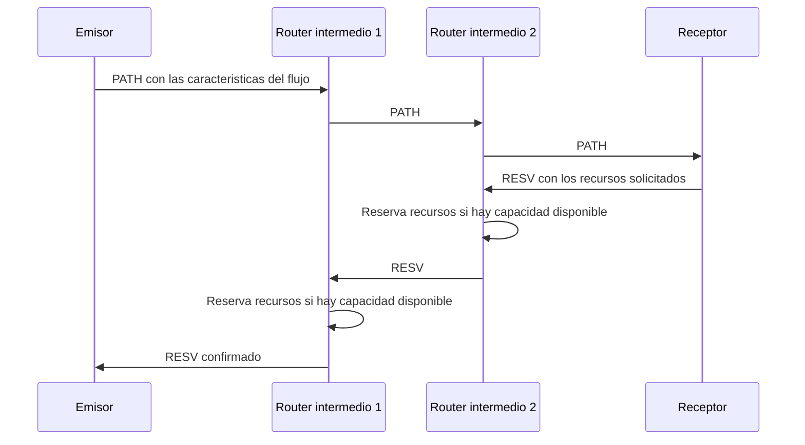
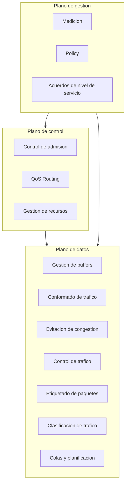
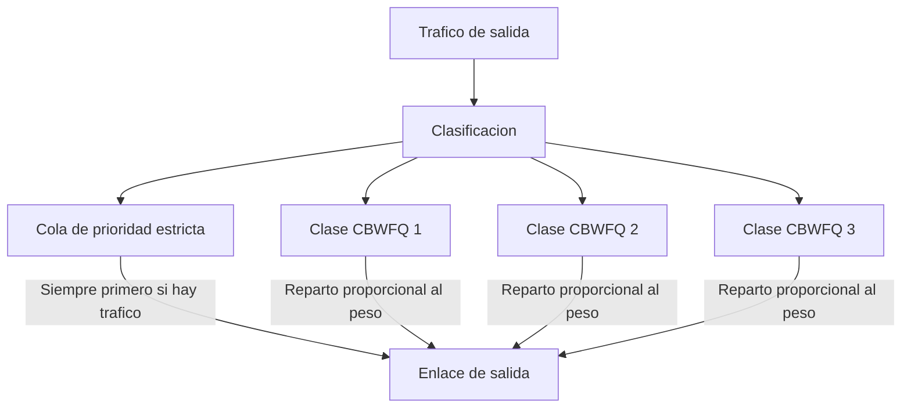

Una red de paquetes que transporta tráfico de naturaleza muy distinta, desde una
transferencia de ficheros que tolera segundos de espera hasta una llamada de voz que no
tolera más de unas decenas de milisegundos de retardo, necesita un mecanismo para tratar
ese tráfico de forma diferenciada en lugar de repartir sus recursos de manera uniforme.
Ese mecanismo es la **calidad de servicio** (Quality of Service, `QoS`), entendida como
el conjunto de indicadores objetivos, acuerdos contractuales y arquitecturas de red que
permiten garantizar, o al menos favorecer, un nivel de prestaciones determinado a un
flujo de tráfico concreto. Este capítulo describe esos indicadores, los acuerdos de
nivel de servicio que los formalizan, las arquitecturas que los implementan y los
mecanismos concretos con los que un equipo de red clasifica, conforma y encola el
tráfico para cumplirlos. La calidad percibida subjetivamente por el usuario, medida
mediante el `MOS` y modelos como `PESQ` o `POLQA`, queda fuera de este capítulo y se
trata en el siguiente de esta misma área, dedicado a la calidad de experiencia.

## Introducción

El `QoS` en una red se evalúa mediante indicadores clave de rendimiento (Key Performance
Indicator, `KPI`) mensurables, entre los que destacan el _throughput_ (velocidad de
datos en bits por segundo), la pérdida de paquetes (porcentaje de paquetes perdidos), el
retardo promedio y el _jitter_ (variabilidad del retardo). Estos `KPI` son esenciales
porque las aplicaciones son sensibles, en distinto grado, a la pérdida de datos, al
rendimiento, a la latencia y a la variabilidad del retardo, y las garantías de `QoS`
existen precisamente para asegurar la satisfacción del usuario y optimizar el uso de los
recursos de la red.

Para implementar `QoS` en una red IP existen, en esencia, dos vías. La primera consiste
en duplicar la infraestructura física, dedicando una red separada a cada tipo de
tráfico, lo que garantiza aislamiento completo a costa de un coste de despliegue que
crece con el número de servicios distintos que se quieran diferenciar. La segunda
consiste en etiquetar los paquetes para que los equipos de la red los reconozcan y les
den un tratamiento distinto sobre una única infraestructura compartida, que es la vía
que siguen las arquitecturas de `QoS` que se describen más adelante en este capítulo.

## Indicadores de calidad de servicio

Los indicadores de calidad de servicio describen el comportamiento de una red de forma
objetiva y técnica, sin depender de la percepción de un usuario concreto. Cuatro
indicadores concentran la práctica totalidad del análisis de `QoS` en una red IP: la
velocidad efectiva, el retardo, el _jitter_ y la pérdida de paquetes. Los tres primeros
comparten una propiedad común, que es la de admitir una medición instantánea, en un
momento concreto, y una medición promedio a lo largo de un intervalo de observación más
amplio. El capítulo de
[servicios multimedia](../01_multimedia/section_1_servicios_multimedia.md#requisitos-que-imponen-a-la-red)
trata estos mismos indicadores de forma genérica para cualquier servicio multimedia;
este capítulo los desarrolla ya aplicados específicamente al transporte sobre una red
IP.

### Velocidad efectiva instantánea y media

El rendimiento de una red se mide mediante la velocidad de transmisión instantánea
(_instantaneous throughput_) y la velocidad de transmisión promedio (_average
throughput_). El rendimiento instantáneo es una medición puntual, tomada en un momento
específico, y refleja la capacidad efectiva de la que dispone un flujo en ese instante,
que puede diferir sustancialmente de la capacidad nominal del enlace si existe otro
tráfico compitiendo por él. El rendimiento promedio, en cambio, refleja la calidad de la
conexión a lo largo del tiempo, considerando las condiciones cambiantes de la red
durante todo el intervalo de observación, y es el que habitualmente se compara frente a
un objetivo contractual de velocidad.

### Retardo y sus componentes

El **retardo** (_delay_) es el tiempo que tarda un contenido en llegar al usuario desde
que se genera. Ese retardo total se descompone en cuatro componentes que se acumulan a
lo largo de la ruta que sigue un paquete: el retardo de propagación, que depende de la
distancia física y del medio de transmisión; el retardo de transmisión, que depende del
tamaño del paquete y de la velocidad del enlace; el retardo de procesamiento, que
introduce cada equipo intermedio al examinar la cabecera del paquete y decidir su
encaminamiento; y el retardo de encolado, que aparece cuando el paquete debe esperar su
turno en una cola porque el recurso de salida está ocupado. Este último componente es el
único de los cuatro que depende de la carga instantánea de la red, y es también el que
las disciplinas de encolado que se describen más adelante en este capítulo intentan
controlar.

El retardo de propagación depende del medio físico porque la velocidad de propagación de
la señal varía con él. En un medio guiado, como un cable de cobre o una fibra óptica, la
velocidad de propagación se aproxima a dos tercios de la velocidad de la luz en el
vacío, mientras que en un medio no guiado, como un enlace radioeléctrico o un enlace por
satélite, la señal viaja a la velocidad de la luz en el vacío. Esta diferencia,
combinada con la distancia recorrida, explica por qué dos rutas con distancias físicas
comparables pueden presentar retardos de propagación muy distintos si una de ellas
atraviesa un tramo geoestacionario.

???+ example "Comparación del retardo de propagación entre cable y satélite"

    Un operador evalúa dos alternativas para enlazar una estación en la península ibérica
    con una flota situada en la costa de Angola: un cable submarino con un tramo final por
    radioenlace terrestre, y un doble salto por satélite geoestacionario. Se pide comparar
    el retardo de propagación acumulado de ambas alternativas.

    La alternativa del cable submarino recorre cuatro tramos: dos tramos cortos en tierra,
    de 2 km y de 94,14 km, ambos por medio guiado; un tramo submarino de 7219,09 km,
    también por medio guiado; y un radioenlace final de 150 km por medio no guiado. Con una
    velocidad de propagación de dos tercios de la velocidad de la luz en el vacío para los
    tramos guiados y la velocidad de la luz en el vacío para el radioenlace, los retardos
    de cada tramo resultan 0,01 ms, 0,4707 ms, 36,0954 ms y 0,5 ms, que suman un retardo de
    propagación total de 37,08 ms.

    La alternativa por satélite recorre también cuatro tramos: un tramo corto en tierra de
    2 km hasta la estación terrena, un segundo tramo terrestre de 526,85 km hasta el centro
    de comunicaciones por satélite, y dos saltos geoestacionarios de 71572 km cada uno. Los
    dos primeros tramos son guiados y los dos saltos por satélite son no guiados, lo que da
    unos retardos de 0,01 ms, 2,6342 ms, 238,5733 ms y 238,5733 ms, con un retardo de
    propagación total de 479,79 ms.

    La diferencia entre ambas alternativas, algo más de trece veces, no procede de la
    distancia física recorrida, comparable en ambos casos, sino de que un salto
    geoestacionario obliga a la señal a recorrer una distancia de decenas de miles de
    kilómetros a la velocidad de la luz en el vacío dos veces, una de subida y otra de
    bajada, mientras que el cable submarino recorre una distancia similar por un medio
    guiado en un único tramo continuo. Añadiendo el retardo de transmisión de un paquete de
    125 bytes sobre cuatro enlaces de 500 kbit/s, que aporta 2 ms por salto y 8 ms en total, el
    retardo extremo a extremo sin encolado queda en 45,08 ms para el cable submarino, frente
    a 487,79 ms para el satélite, una diferencia que resulta determinante para cualquier
    servicio sensible al retardo.

### Variación del retardo

El _jitter_ es la variación del retardo entre paquetes consecutivos de un mismo flujo.
Aunque el retardo de propagación y el de transmisión son prácticamente constantes para
una ruta fija, el retardo de encolado varía de un paquete a otro según el estado de
ocupación de las colas que atraviesa, y esa variación es la que se percibe como
_jitter_. Un servicio en tiempo real que reproduce el contenido a medida que lo recibe
necesita que los paquetes lleguen a un ritmo razonablemente regular, y el _jitter_
introduce precisamente la irregularidad que ese servicio debe absorber.

El mecanismo habitual para absorber el _jitter_ es el uso de un búfer de recepción que
retrasa deliberadamente la reproducción del contenido, retiene un número de paquetes
antes de empezar a reproducirlos, y de ese modo dispone de margen para que un paquete
que llegue con retraso todavía llegue a tiempo de ser reproducido en su turno. El tamaño
de ese búfer, expresado en número de paquetes o tramas, determina directamente cuánto
retraso adicional está dispuesto a asumir el sistema a cambio de esa tolerancia al
_jitter_.

???+ example "Duración temporal de un búfer de recepción dimensionado en tramas"

    Un servicio de vídeo en formato QCIF transmite a 64 kbit/s con un tamaño medio de paquete
    de 50 bytes y un tiempo medio entre paquetes de 6 ms, ambos modelados con una
    distribución de Pareto truncada. El receptor configura un búfer de recepción capaz de
    almacenar 12 tramas antes de comenzar la reproducción. Se pide expresar la capacidad de
    ese búfer en unidades de tiempo, que es la magnitud que realmente interesa para
    compararla con el _jitter_ esperado del enlace.

    La duración temporal del búfer es el producto de su capacidad en tramas por el tiempo
    medio entre paquetes, es decir, 12 tramas multiplicadas por 6 ms por trama, lo que da
    72 ms. Ese valor es la variación de retardo máxima que el búfer puede compensar sin que
    el receptor se quede sin datos que reproducir: mientras el _jitter_ acumulado entre dos
    paquetes no supere los 72 ms, la reproducción continúa sin interrupción. Si la variación
    del retardo del enlace excede sistemáticamente ese margen, el receptor agota el búfer
    antes de que lleguen los paquetes siguientes y se produce una interrupción en la
    reproducción, lo que ilustra por qué el tamaño del búfer es un compromiso directo entre
    la tolerancia al _jitter_ y el retardo adicional que se introduce antes de empezar a
    reproducir el contenido.

### Pérdida de paquetes

La **pérdida de paquetes** es el porcentaje de paquetes que no llegan a su destino
durante la transmisión. Puede producirse por dos motivos de naturaleza distinta: errores
introducidos por el canal de transmisión, cuantificados mediante la tasa de error de bit
(Bit Error Rate, `BER`), o descartes deliberados en las colas de los equipos intermedios
cuando su capacidad de almacenamiento se agota. Algunos protocolos de transporte, como
`TCP`, gestionan la pérdida mediante retransmisión, a costa de un incremento del retardo
percibido, mientras que un flujo en tiempo real transportado sobre `UDP` no dispone de
ese mecanismo y sufre la pérdida directamente como degradación del contenido
reproducido.

La tasa de error de bit de un enlace se traduce en una tasa de error de paquete (Packet
Error Rate, `PER`) que crece con el tamaño del paquete, porque un paquete más largo
contiene más bits expuestos al error, y con el número de saltos que atraviesa, porque el
error de cada salto se acumula de forma independiente sobre los anteriores. Si $p_i$ es
la probabilidad de error de bit del salto $i$-ésimo y $L$ es la longitud del paquete en
bits, la probabilidad de que el paquete llegue sin ningún bit erróneo tras atravesar $N$
saltos independientes es:

$$
P_{\text{exito}} = \prod_{i=1}^{N} \left(1 - p_i\right)^{L}
$$

y la tasa de error de paquete extremo a extremo es $PER = 1 - P_{\text{exito}}$.

???+ example "Tasa de error de paquete extremo a extremo en varios saltos"

    La alternativa del cable submarino descrita en el ejemplo anterior atraviesa cuatro
    tramos con tasas de error de bit de $10^{-6}$, $10^{-8}$, $10^{-6}$ y $5 \times
    10^{-5}$, mientras que la alternativa por satélite atraviesa cuatro tramos con tasas de
    $10^{-6}$, $10^{-8}$, $2 \times 10^{-5}$ y $7 \times 10^{-5}$. Se pide estimar la tasa
    de error de paquete extremo a extremo de ambas alternativas para un paquete de 1000
    bits, equivalente a 125 bytes.

    ```python linenums="1"
    def per_extremo_a_extremo(ber_por_salto: list[float], longitud_bits: int) -> float:
        """Calcula la tasa de error de paquete extremo a extremo.

        Args:
            ber_por_salto: Tasa de error de bit de cada salto independiente de la ruta.
            longitud_bits: Longitud del paquete, en bits.

        Returns:
            Tasa de error de paquete extremo a extremo, como fracción entre 0 y 1.
        """
        # Probabilidad de que el paquete atraviese cada salto sin ningun bit erroneo
        exito = 1.0
        for ber in ber_por_salto:
            exito *= (1 - ber) ** longitud_bits
        return 1 - exito


    ber_cable = [1e-6, 1e-8, 1e-6, 5e-5]
    ber_satelite = [1e-6, 1e-8, 2e-5, 7e-5]
    per_cable = per_extremo_a_extremo(ber_cable, 1000)
    per_satelite = per_extremo_a_extremo(ber_satelite, 1000)
    print(f"PER cable: {per_cable:.4%}")
    print(f"PER satelite: {per_satelite:.4%}")
    ```

    ```plaintext title="Expected output"
    PER cable: 5.0682%
    PER satelite: 8.6994%
    ```

    La alternativa por satélite presenta una tasa de error de paquete casi un 72 % más alta
    que la del cable submarino, principalmente porque sus dos saltos geoestacionarios
    acumulan tasas de error de bit de $2 \times 10^{-5}$ y $7 \times 10^{-5}$, sensiblemente
    peores que el peor tramo del cable submarino. Este resultado, combinado con la
    diferencia de retardo de propagación del ejemplo anterior, confirma que el enlace por
    satélite ofrece peores prestaciones objetivas de `QoS` en ambos indicadores, lo que
    obligaría a compensarlo con mecanismos de corrección de errores o de retransmisión más
    agresivos si esa fuera la alternativa elegida.

## Acuerdos de nivel de servicio

Los **acuerdos de nivel de servicio** (Service Level Agreement, `SLA`) son contratos
entre un proveedor de servicios de red y su cliente que establecen la calidad de
servicio garantizada. Un `SLA` traduce a términos contractuales los indicadores de
calidad descritos en el apartado anterior, fijando qué nivel de velocidad, de retardo,
de _jitter_ y de pérdida de paquetes se compromete a ofrecer el proveedor, y qué
compensación recibe el cliente si ese nivel no se cumple.

### Especificaciones de nivel de servicio

Un `SLA` puede incluir varias especificaciones de nivel de servicio (Service Level
Specification, `SLS`), cada una de las cuales define los límites adecuados para uno de
los aspectos de rendimiento del `QoS`. Esta separación permite que un mismo contrato
fije, por ejemplo, una `SLS` de retardo máximo para el tráfico de voz y una `SLS` de
velocidad mínima garantizada para el tráfico de datos, dentro de un único acuerdo global
entre el proveedor y el cliente, sin necesidad de negociar un contrato distinto por cada
tipo de tráfico.

### Servicios elásticos e inelásticos

Los servicios que circulan por una red IP se clasifican, según su tolerancia a la
variación de las condiciones de la red, en elásticos e inelásticos. Un **servicio
elástico** se adapta a la velocidad disponible en cada momento, sin un umbral mínimo de
prestaciones por debajo del cual deje de funcionar, aunque su tiempo de finalización se
alargue si la red está congestionada. Un **servicio inelástico**, en cambio, requiere un
nivel mínimo de calidad para funcionar adecuadamente, y por debajo de ese nivel la
degradación no es gradual sino que compromete la utilidad del propio servicio.

???+ example "Identificación de servicios elásticos e inelásticos en una ruta"

    Sobre la misma ruta de acceso a una flota pesquera se ofrecen tres servicios distintos:
    una transferencia de un fichero de 10 MB, un flujo de vídeo en directo hacia la flota y
    el acceso de varios clientes a una página web. Se pide clasificar cada uno como
    elástico o inelástico y justificarlo.

    La transferencia de fichero es el ejemplo más claro de servicio elástico: si la red
    dispone de menos capacidad de la esperada, la transferencia simplemente tarda más en
    completarse, sin que el resultado final, el fichero recibido íntegro, se vea alterado.
    El acceso a la página web se comporta de forma similar, puesto que una respuesta más
    lenta del servidor degrada la experiencia percibida pero no impide que la página
    termine cargando por completo.

    El flujo de vídeo en directo, en cambio, es un servicio inelástico dentro de una
    ventana de tolerancia acotada por el búfer de recepción: mientras la variación del
    retardo no supere la duración de ese búfer, el servicio absorbe la irregularidad de la
    red sin que el usuario lo perciba, pero en cuanto la superara de forma sostenida, el
    servicio no se ralentiza de forma gradual sino que sufre interrupciones en la
    reproducción, que es precisamente el síntoma de un servicio inelástico. Este mismo
    contraste es el que explica por qué un tráfico de voz se caracteriza típicamente por
    paquetes pequeños, un caudal aproximadamente constante y periodos de actividad y de
    silencio alternos: esa regularidad es la que un servicio inelástico necesita preservar
    de extremo a extremo para seguir siendo útil.

## Necesidad de calidad de servicio

El `QoS` resulta crucial en redes congestionadas para asignar los recursos disponibles
de manera eficiente y para dar prioridad a los flujos críticos frente a los que pueden
tolerar una degradación temporal. Sin mecanismos de `QoS`, todos los flujos compiten en
igualdad de condiciones por los mismos recursos, lo que penaliza por igual a un flujo
inelástico y a uno elástico en el momento de congestión, precisamente cuando esa
distinción resulta más necesaria.

### Congestión y reparto de recursos

Una red sin diferenciación de tráfico reparte sus recursos de forma indiscriminada entre
todos los flujos que compiten por ellos en un momento de congestión. Ese reparto
indiscriminado no distingue entre un flujo que puede esperar y otro que no, y el
resultado es que ambos sufren una degradación proporcional a su parte del tráfico total,
en lugar de que el flujo tolerante absorba una degradación mayor mientras el flujo
crítico mantiene sus prestaciones. Los mecanismos de `QoS` que se describen en el resto
de este capítulo existen, en última instancia, para introducir esa distinción de forma
controlada.

### Límites en los puntos de interconexión

En los puntos de interconexión entre redes de distintos operadores, la calidad de
servicio no siempre está garantizada, a menos que se trate de una red privada gestionada
íntegramente por una única organización. Un operador puede aplicar sus propios
mecanismos de `QoS` dentro de su propia red y, sin embargo, no tener ningún control
sobre el tratamiento que el tráfico recibe una vez que cruza hacia la red de otro
operador, salvo que exista un acuerdo explícito entre ambos que extienda las garantías
de `QoS` a través de esa frontera administrativa. La falta de `QoS` en un punto de
interconexión puede causar problemas cuando varias organizaciones comparten los mismos
recursos de tránsito sin haber acordado cómo repartirlos.

## Arquitecturas de calidad de servicio

Las arquitecturas de `QoS` para redes IP se agrupan en tres modelos, que se diferencian
por el grado de garantía que ofrecen y por la escala a la que resultan viables.

### Mejor esfuerzo

El **servicio de mejor esfuerzo** (_best effort_) trata todo el tráfico por igual, sin
ninguna diferenciación ni garantía. Es el modelo de reparto original de Internet, y
sigue siendo el modelo por defecto para cualquier tráfico al que no se le aplique de
forma explícita uno de los dos modelos siguientes. Su ventaja es la simplicidad de
implementación, y su límite es precisamente la ausencia de cualquier garantía cuando la
red se congestiona.

### Servicios integrados

Los **servicios integrados** (Integrated Services, `IntServ`) reservan recursos para
cada flujo individual de tráfico, y si esos recursos no se llegan a usar, quedan a
disposición de otro tráfico que sí los necesite. `IntServ` es orientado a la conexión y
requiere señalización explícita para establecer esa reserva antes de que el flujo pueda
comenzar a transmitir. El protocolo de señalización asociado a `IntServ` es el protocolo
de reserva de recursos (Resource Reservation Protocol, `RSVP`), que un emisor utiliza
para anunciar las características de su flujo a lo largo de la ruta hacia el receptor, y
que el receptor utiliza, en sentido inverso, para confirmar la reserva en cada uno de
los routers intermedios que la ruta atraviesa.



El mensaje `PATH` viaja desde el emisor hacia el receptor anunciando las características
del flujo que se quiere establecer, y cada router intermedio lo reenvía guardando el
camino de vuelta. El mensaje `RESV` viaja en sentido contrario, desde el receptor hacia
el emisor, y en cada router intermedio provoca la reserva efectiva de los recursos
solicitados si existe capacidad disponible, lo que conecta directamente esta
señalización con el control de admisión que se describe más adelante en el plano de
control.

???+ example "Coste de estado de los servicios integrados frente a la escala de la red"

    Un router del núcleo de una red atiende simultáneamente 10000 flujos activos de
    distintos usuarios. Se pide razonar qué cantidad de estado de reserva debe mantener ese
    router bajo el modelo de servicios integrados, y contrastarlo con el problema que ese
    volumen de estado plantea a la escala del núcleo de una red.

    Bajo `IntServ`, cada uno de los 10000 flujos requiere su propia reserva de recursos
    individual, negociada mediante `RSVP` y mantenida como estado independiente en cada
    router de la ruta mientras el flujo permanece activo. El router del núcleo debe, por
    tanto, mantener 10000 entradas de estado simultáneas, una por flujo, y actualizarlas
    cada vez que se produce un nuevo mensaje de señalización de mantenimiento de la
    reserva. Ese volumen de estado crece linealmente con el número de flujos que atraviesan
    el router, lo que resulta manejable en el borde de una red, donde el número de flujos
    por equipo es reducido, pero se convierte en un cuello de botella en el núcleo, donde un
    único router agrega el tráfico de miles de usuarios simultáneos. Este es precisamente
    el problema de escalabilidad que motiva la arquitectura de servicios diferenciados que
    se describe en el apartado siguiente, que sustituye el estado por flujo individual por
    un número reducido de clases de tráfico agregado.

### Servicios diferenciados

Los **servicios diferenciados** (Differentiated Services, `DiffServ`) se enfocan en
combinar flujos similares en agregados de tráfico, en lugar de reservar recursos para
cada flujo por separado. `DiffServ` se basa en la clasificación de los paquetes en los
bordes de la red, no es necesariamente orientado a la conexión, y resuelve precisamente
el problema de escalabilidad de `IntServ` descrito en el ejemplo anterior: en lugar de
mantener estado por flujo en cada router, cada paquete lleva consigo, en su propia
cabecera, la clase de servicio a la que pertenece.

Esa clase de servicio se codifica en el campo Punto de Código de Servicios Diferenciados
(Differentiated Services Code Point, `DSCP`), un campo de seis bits situado en la
cabecera IP que un router de núcleo lee directamente del paquete para decidir su
tratamiento, sin necesidad de consultar ningún estado de reserva previamente
establecido. El comportamiento asociado a cada valor de `DSCP` se denomina
comportamiento por salto (Per-Hop Behavior, `PHB`), y es ese comportamiento, no una
reserva de extremo a extremo, el que determina cómo un router encola, descarta o reenvía
el paquete.


La consecuencia práctica de este reparto de responsabilidades es que la complejidad de
la clasificación se concentra en el borde del dominio `DiffServ`, donde el volumen de
tráfico por equipo es manejable, mientras que el núcleo del dominio solo necesita leer
un campo de seis bits y aplicar el `PHB` correspondiente, una operación que escala sin
dificultad al volumen de tráfico agregado de miles de flujos simultáneos.

## Planos funcionales

El `QoS` se organiza en tres planos funcionales, cada uno compuesto por un conjunto de
elementos con una responsabilidad distinta dentro del conjunto.



### Plano de control

El **plano de control** se encarga de la señalización necesaria para establecer y
mantener las garantías de `QoS`, y está compuesto por tres elementos. El **control de
admisión** decide si se permite o no la entrada de un nuevo flujo de datos a la red,
basándose en la capacidad y en los recursos disponibles en ese momento: sin este control
no existe `QoS` real, porque cualquier garantía concedida a los flujos ya admitidos
quedaría comprometida si se aceptara un nuevo flujo sin comprobar antes que hay
capacidad para él, por lo que es un elemento fundamental de cualquier arquitectura de
`QoS`. El enrutamiento consciente de calidad de servicio (`QoS Routing`) selecciona las
rutas adecuadas para los flujos de datos según sus requisitos particulares de calidad de
servicio, en lugar de aplicar un único criterio de encaminamiento igual para todo el
tráfico. La **gestión de recursos** asigna y administra los recursos de la red para
cumplir con los requisitos de `QoS` que se hayan comprometido.

???+ example "Decisión de control de admisión ante una nueva solicitud de reserva"

    Un enlace troncal de 100 Mbit/s tiene comprometidos, en un instante dado, 82 Mbit/s en
    reservas activas de `QoS`. Llega una nueva solicitud de reserva para un flujo de voz
    codificado a 64 kbit/s, que con la sobrecarga de cabeceras de los protocolos de transporte
    ocupa efectivamente 80 kbit/s. Se pide decidir si el control de admisión debe aceptar o
    rechazar la nueva solicitud.

    El control de admisión compara la capacidad ya comprometida con la capacidad total del
    enlace tras sumar la nueva solicitud: 82 Mbit/s más 0,08 Mbit/s son 82,08 Mbit/s, una cifra
    que sigue por debajo de los 100 Mbit/s disponibles, con 17,92 Mbit/s de margen restante. La
    decisión, por tanto, es admitir el nuevo flujo, porque conceder la reserva no compromete
    las garantías ya otorgadas a los flujos previamente admitidos ni agota la capacidad del
    enlace. Si la suma hubiera superado los 100 Mbit/s, el control de admisión habría debido
    rechazar la solicitud, aun cuando el flujo individual fuera modesto en términos
    absolutos, porque admitirlo habría puesto en riesgo las garantías concedidas al resto
    del tráfico ya admitido.

### Plano de datos

El **plano de datos** se encarga de la parte de usuario, es decir, de aplicar sobre el
tráfico real las decisiones que el plano de control ha autorizado y que el plano de
gestión ha configurado como política. Sus elementos, la gestión de buffers, el
conformado de tráfico, la evitación de congestión, el control de tráfico, el etiquetado
de paquetes, la clasificación de tráfico y las colas y la planificación, son los
mecanismos concretos que un equipo de red ejecuta paquete a paquete, y se detallan con
extensión propia en el apartado dedicado a los mecanismos del plano de datos, más
adelante en este mismo capítulo.

### Plano de gestión

El **plano de gestión** define el comportamiento deseado de la red y cómo debe actuar en
consecuencia, y está compuesto por tres elementos. La **medición** evalúa y registra el
tráfico y el rendimiento de la red, proporcionando los datos con los que se comprueba si
los indicadores descritos al inicio de este capítulo cumplen los objetivos fijados. La
**política** (_policy_) define las reglas necesarias para garantizar la calidad de
servicio deseada, traduciendo un objetivo de negocio en configuraciones concretas para
los otros dos planos. Los **acuerdos de nivel de servicio**, ya descritos en el apartado
correspondiente de este capítulo, establecen el contrato entre el proveedor y el cliente
que da sentido último a los otros dos elementos del plano de gestión.

## Mecanismos del plano de datos

Los mecanismos del plano de datos son los que ejecutan, paquete a paquete, la
diferenciación de tráfico que las arquitecturas de `QoS` describen a nivel conceptual.
Se agrupan en cuatro bloques: la clasificación y el etiquetado de los paquetes, la
gestión de buffers y el conformado del tráfico, la evitación de congestión, y las colas
y la planificación, que es el bloque que finalmente decide en qué orden abandona cada
paquete un equipo de red.

### Clasificación y etiquetado

La **clasificación de tráfico** organiza los paquetes en categorías según sus
características y necesidades de `QoS`, y es el paso previo necesario para cualquier
tratamiento diferenciado: un router no puede aplicar un comportamiento distinto a un
paquete si antes no ha decidido a qué categoría pertenece. Esa clasificación se apoya
habitualmente en la dirección de origen o de destino, en el protocolo de transporte, en
el puerto de aplicación o en el propio contenido de la cabecera, y se ejecuta
típicamente en el borde de la red, donde el volumen de tráfico por equipo permite una
inspección más detallada de cada paquete.

El **etiquetado de paquetes** agrega a cada paquete la información que resulta de esa
clasificación, de modo que los equipos situados aguas abajo puedan aplicar el
tratamiento correspondiente sin repetir la clasificación completa. El campo `DSCP`,
descrito en el apartado dedicado a los servicios diferenciados de este capítulo, es el
mecanismo de etiquetado más extendido en redes IP: una vez que el borde de la red marca
ese campo, el núcleo de la red solo necesita leerlo para decidir el `PHB` aplicable, sin
volver a examinar el resto de la cabecera del paquete.

### Gestión de buffers y conformado

La **gestión de buffers** controla el almacenamiento temporal de datos para equilibrar
la velocidad de entrada y la velocidad de salida de un equipo de red, y es la base sobre
la que operan tanto el _jitter_ descrito al inicio de este capítulo como las colas de
planificación que se describen más adelante. El **conformado de tráfico** (_traffic
shaping_) modela el tráfico de datos antes de transmitirlo, suavizando sus
irregularidades para evitar que provoque congestión en los equipos situados aguas abajo.
Un mecanismo estrechamente relacionado, la **vigilancia de tráfico** (_traffic
policing_), no retiene ni suaviza el tráfico sino que comprueba si se ajusta a un perfil
contratado y descarta o remarca los paquetes que lo excedan, sin introducir el retardo
adicional que sí introduce el conformado.

Los dos algoritmos de referencia para implementar el conformado y la vigilancia de
tráfico son el **cubo con fugas** (_leaky bucket_) y el **cubo de fichas** (_token
bucket_). El cubo con fugas modela el tráfico saliente como si drenara de un cubo con un
orificio de tamaño fijo: el tráfico entra al cubo a un ritmo variable, potencialmente a
rachas, y sale de él a un ritmo constante, con independencia de cómo haya entrado, lo
que convierte cualquier ráfaga de entrada en un flujo de salida perfectamente regular a
costa de retener temporalmente el exceso en el propio cubo. El cubo de fichas invierte
la lógica: un depósito acumula fichas a un ritmo constante hasta un límite máximo, y
cada paquete que se transmite consume tantas fichas como bits contenga. Mientras el
depósito tenga fichas acumuladas, el tráfico puede transmitirse en una ráfaga a una
velocidad superior a la de reposición de fichas, y solo cuando el depósito se agota el
tráfico queda forzado a respetar exactamente el ritmo de reposición. Esta diferencia
hace del cubo de fichas el algoritmo preferido cuando se quiere permitir cierta ráfaga
ocasional sin renunciar a un límite medio a largo plazo, mientras que el cubo con fugas
resulta más adecuado cuando se necesita un flujo de salida perfectamente regular en todo
momento.

```python linenums="1"
def duracion_maxima_rafaga(
    profundidad_bits: float, tasa_reposicion_bps: float, tasa_pico_bps: float
) -> float:
    """Calcula la duracion maxima de una rafaga a tasa de pico en un cubo de fichas.

    Args:
        profundidad_bits: Capacidad maxima del deposito de fichas, en bits.
        tasa_reposicion_bps: Tasa de reposicion de fichas del cubo, en bits por segundo.
        tasa_pico_bps: Tasa de pico a la que se transmite mientras el deposito no
            se ha agotado, en bits por segundo.

    Returns:
        Duracion maxima de la rafaga a tasa de pico, en segundos, antes de que el
        deposito se agote y el trafico deba ajustarse a la tasa de reposicion.
    """
    if tasa_pico_bps <= tasa_reposicion_bps:
        raise ValueError("La tasa de pico debe superar la tasa de reposicion.")
    # El deposito se vacia a un ritmo neto igual a la diferencia entre ambas tasas
    return profundidad_bits / (tasa_pico_bps - tasa_reposicion_bps)


profundidad = 100_000  # bits, equivalentes a 12500 bytes
tasa_comprometida = 2_000_000  # 2 Mbit/s de tasa comprometida
tasa_pico = 10_000_000  # 10 Mbit/s de tasa de pico disponible en la interfaz
duracion = duracion_maxima_rafaga(profundidad, tasa_comprometida, tasa_pico)
bits_transmitidos = tasa_pico * duracion
print(f"Duracion maxima de rafaga: {duracion * 1000:.2f} ms")
print(f"Bits transmitidos durante la rafaga: {bits_transmitidos:.0f} bits")
```

```plaintext title="Expected output"
Duracion maxima de rafaga: 12.50 ms
Bits transmitidos durante la rafaga: 125000 bits
```

???+ example "Interpretación del resultado de un cubo de fichas con ráfaga permitida"

    Un enlace de acceso está regulado por un cubo de fichas con una tasa comprometida de
    2 Mbit/s y una profundidad de depósito de 100000 bits, equivalentes a 12500 bytes. La
    interfaz física permite transmitir en ráfaga a 10 Mbit/s mientras el depósito conserve
    fichas acumuladas. Se pide interpretar qué ocurre durante esa ráfaga y qué sucede una
    vez que el depósito se agota.

    Mientras el depósito está lleno, el tráfico puede transmitirse a la tasa de pico de
    10 Mbit/s, y el depósito se vacía a un ritmo neto igual a la diferencia entre la tasa de
    pico y la tasa de reposición, es decir, a 8 Mbit/s. Con una profundidad de 100000 bits, el
    depósito tarda 12,5 ms en agotarse por completo, tiempo durante el cual se han
    transmitido 125000 bits, equivalentes a 15625 bytes, muy por encima de lo que permitiría
    la tasa comprometida en ese mismo intervalo. Una vez agotado el depósito, el tráfico
    queda forzado a respetar exactamente los 2 Mbit/s de tasa de reposición, que es la tasa
    comprometida a largo plazo, hasta que el depósito vuelva a acumular fichas suficientes
    para permitir una nueva ráfaga. Este comportamiento es precisamente el que distingue al
    cubo de fichas de un simple limitador de velocidad constante: permite absorber
    variaciones cortas de la demanda sin penalizar de inmediato al tráfico, siempre que su
    promedio a largo plazo respete la tasa comprometida.

### Evitación de congestión

La **evitación de congestión** implementa estrategias para prevenir la congestión en la
red antes de que llegue a producirse, en lugar de reaccionar una vez que ya se ha
producido. La estrategia más extendida en routers IP consiste en vigilar la ocupación
media de una cola y comenzar a descartar paquetes de forma probabilística, y no solo
cuando la cola está completamente llena, antes de que se alcance ese límite. Ese
descarte temprano y selectivo actúa como una señal implícita para los protocolos de
transporte que reaccionan a la pérdida reduciendo su velocidad de envío, lo que permite
que varias conexiones reduzcan su ritmo de forma escalonada en lugar de que todas ellas
sufran un descarte simultáneo y masivo cuando la cola se llena por completo, un fenómeno
que de otro modo generaría oscilaciones sincronizadas en el tráfico agregado del enlace.

### Colas y planificación

Las **colas y la planificación** administran el almacenamiento temporal de los paquetes
a la salida de un equipo de red y deciden en qué orden se transmiten, y son el mecanismo
que traduce de forma más directa la clasificación de tráfico en un tratamiento
diferenciado observable. La disciplina de encolado más simple es la cola **`FIFO`**
(_first in, first out_), que atiende los paquetes exactamente en el orden en que llegan,
sin ninguna distinción entre ellos: es la disciplina por defecto de un servicio de mejor
esfuerzo, y su límite es que un paquete de un flujo de baja prioridad puede retrasar
indefinidamente a un paquete de un flujo crítico que llegue justo después de una ráfaga
del primero.

El **encolado por prioridad** (Priority Queuing, `PQ`) organiza el tráfico en varias
colas con un orden de prioridad estricto, y solo atiende una cola de menor prioridad
cuando todas las colas de mayor prioridad están vacías en ese instante. Esta disciplina
garantiza el mínimo retardo posible al tráfico de la cola más prioritaria, pero corre el
riesgo de que, si esa cola recibe suficiente tráfico de forma sostenida, las colas de
menor prioridad queden sin atender de forma indefinida, un efecto conocido como
inanición.

El **encolado justo ponderado** (Weighted Fair Queuing, `WFQ`) reparte la capacidad del
enlace entre varias colas de forma proporcional a un peso asignado a cada una, sin que
ninguna cola quede completamente desatendida como podía ocurrir con el encolado por
prioridad. Cada cola recibe una fracción de la capacidad total del enlace igual a su
peso dividido entre la suma de todos los pesos, lo que garantiza un reparto mínimo
incluso a las colas de menor peso mientras exista tráfico en todas ellas.

```python linenums="1"
def reparto_ancho_banda_wfq(
    capacidad_enlace_bps: float, pesos: dict[str, float]
) -> dict[str, float]:
    """Calcula el reparto de ancho de banda garantizado bajo WFQ.

    Args:
        capacidad_enlace_bps: Capacidad total del enlace, en bits por segundo.
        pesos: Peso relativo asignado a cada cola, indexado por su nombre.

    Returns:
        Ancho de banda garantizado a cada cola, en bits por segundo, indexado
        por el mismo nombre que en `pesos`.
    """
    suma_pesos = sum(pesos.values())
    return {
        nombre: capacidad_enlace_bps * peso / suma_pesos
        for nombre, peso in pesos.items()
    }


capacidad = 10_000_000  # enlace de 10 Mbit/s
pesos_colas = {"voz": 4, "video": 3, "datos": 1}
reparto = reparto_ancho_banda_wfq(capacidad, pesos_colas)
for nombre, ancho_banda in reparto.items():
    print(f"{nombre}: {ancho_banda / 1e6:.2f} Mbit/s")
```

```plaintext title="Expected output"
voz: 5.00 Mbit/s
video: 3.75 Mbit/s
datos: 1.25 Mbit/s
```

El **encolado justo ponderado basado en clases** (Class-Based Weighted Fair Queuing,
`CBWFQ`) extiende el `WFQ` agrupando el tráfico en clases definidas por el operador, en
lugar de por flujo individual, de la misma manera en que `DiffServ` agrupa flujos en
clases agregadas en lugar de gestionar cada uno por separado. Cada clase recibe un ancho
de banda mínimo garantizado, calculado exactamente con el mismo reparto proporcional que
`WFQ`, pero aplicado sobre agregados de tráfico en lugar de sobre flujos individuales,
lo que hereda la ventaja de escalabilidad que ya se describió al comparar `DiffServ` con
`IntServ`.

El **encolado de baja latencia** (Low Latency Queuing, `LLQ`) combina las dos
disciplinas anteriores: añade una única cola de prioridad estricta por encima de un
conjunto de colas `CBWFQ`, reservada exclusivamente para el tráfico más sensible al
retardo y al _jitter_, mientras que el resto del tráfico se reparte mediante `CBWFQ`
entre las clases restantes. De este modo, `LLQ` ofrece a la vez el retardo mínimo que
solo puede garantizar una cola de prioridad estricta y el reparto proporcional y sin
inanición que ofrece `CBWFQ` para el resto de las clases, resolviendo la principal
limitación de cada disciplina por separado: la inanición del `PQ` puro y la falta de una
garantía de retardo mínimo estricto del `CBWFQ` puro.



El comportamiento de una cola individual bajo carga, incluida la probabilidad de que un
paquete deba esperar y el tiempo medio de esa espera, se modela con el aparato
matemático que desarrolla el capítulo dedicado a la
[teoría de colas](../../06_trafico/01_colas/section_1_teoria_de_colas.md#introduccion),
que resulta directamente aplicable a cualquiera de las colas individuales que componen
una disciplina `PQ`, `WFQ`, `CBWFQ` o `LLQ`, aunque ese capítulo no entra en el reparto
diferenciado entre colas que es objeto propio de este apartado.

La calidad de servicio de una red IP, medida con los indicadores objetivos que abre este
capítulo y garantizada mediante las arquitecturas y los mecanismos que lo cierran,
condiciona directamente la calidad percibida por el usuario final, pero no la determina
por completo: dos servicios con indicadores objetivos idénticos pueden producir una
satisfacción muy distinta según el tipo de contenido y las expectativas del usuario. Esa
relación entre los indicadores objetivos de este capítulo y la percepción subjetiva del
usuario se desarrolla en el capítulo de
[calidad de experiencia](section_2_calidad_de_experiencia.md).
