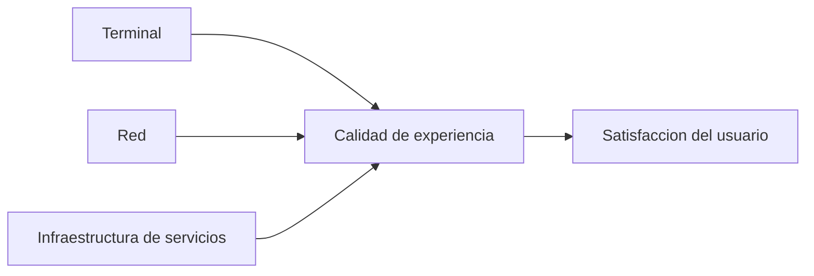
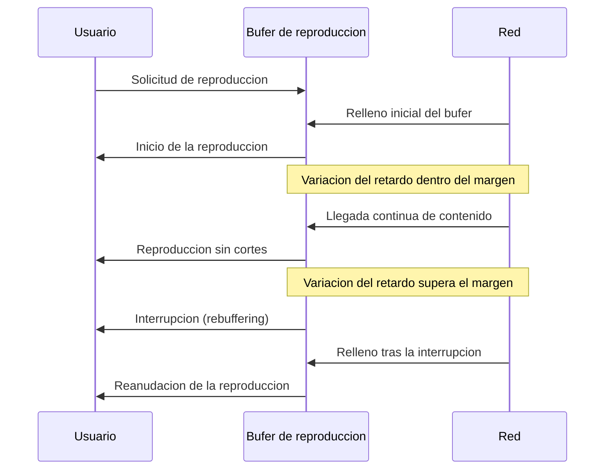

El capítulo anterior desarrolla los indicadores objetivos con los que una red mide su
propio comportamiento y los mecanismos con los que trata de garantizarlos. Ninguno de
esos indicadores, por sí solo, dice si el usuario final queda satisfecho con el servicio
que recibe: dos sesiones con idéntico retardo, idéntica variación del retardo e idéntica
tasa de pérdidas pueden producir experiencias de usuario muy distintas según el códec
empleado, el tipo de contenido o incluso las expectativas previas de quien lo consume.
Este capítulo se ocupa de esa capa adicional, la calidad tal como la percibe el usuario,
de cómo se mide de forma subjetiva y objetiva, y de cómo se relaciona con los
indicadores de red que [el capítulo anterior](section_1_qos_en_redes_ip.md) ya ha
caracterizado.

## Introducción

La **calidad de experiencia** (_Quality of Experience_, `QoE`) es una medida subjetiva
de la calidad de un servicio tal como la percibe el usuario final, que incorpora el
efecto conjunto del sistema completo de extremo a extremo: el terminal empleado, la red
que transporta el servicio y la infraestructura de servicios que lo origina. La `QoE` se
distingue de la **calidad de servicio** (_Quality of Service_, `QoS`) en que esta última
describe el comportamiento de la red mediante magnitudes objetivas y mensurables, como
el _throughput_, el retardo, su variación y la tasa de pérdida de paquetes, mientras que
la `QoE` describe el grado de satisfacción que ese mismo comportamiento produce en un
usuario real. Ambas magnitudes están relacionadas, pero no de forma directa ni uniforme:
la misma degradación de `QoS` produce un impacto en la `QoE` que depende del servicio,
del códec y de las expectativas del usuario, como se desarrolla en la sección de este
capítulo dedicada a esa relación.

Aunque la `QoE` se estima a menudo mediante medidas objetivas, la referencia última de
toda estimación objetiva es la que aportan los ensayos subjetivos, en los que personas
reales valoran la calidad de un servicio y esa valoración se resume en una puntuación
media. Como ese proceso resulta costoso y tedioso de repetir para cada nueva condición
de red o cada nuevo códec, los requisitos de `QoE` que se emplean en la práctica suelen
basarse en parámetros objetivos, como los requisitos de sincronización y compresión, los
requisitos de transmisión por la red y los objetivos de rendimiento en la capa de red,
calibrados de antemano frente a un conjunto de ensayos subjetivos de referencia.



## Puntuación media de opinión

### Escala y procedimiento

La **puntuación media de opinión** (_Mean Opinion Score_, `MOS`) es la métrica más
extendida de calidad de experiencia subjetiva. Un grupo de personas evalúa la calidad de
una llamada, o de otro servicio de audio o de vídeo, según su percepción, y otorga a
cada muestra una nota en una escala del uno al cinco, donde una puntuación baja indica
una calidad mala o inaceptable y una puntuación alta indica una calidad excelente,
indistinguible de la del original. El `MOS` final de una condición de prueba concreta,
por ejemplo un códec de voz operando con una determinada tasa de pérdidas, es la media
aritmética de las puntuaciones individuales que otorgan todos los participantes del
ensayo a esa misma condición.

El procedimiento con el que se recogen esas puntuaciones sigue métodos normalizados de
evaluación subjetiva. En el método de **calificación de categoría absoluta** (_Absolute
Category Rating_, `ACR`), cada participante escucha o visualiza una única muestra y la
puntúa de forma aislada en la escala de cinco categorías, sin ninguna referencia
explícita con la que compararla. En el método de **degradación por categoría**
(_Degradation Category Rating_, `DCR`), en cambio, cada participante escucha primero la
muestra original sin degradar y a continuación la misma muestra ya degradada, y puntúa
el grado de degradación percibida entre ambas en una escala igualmente de cinco
categorías. El método `DCR` resulta más sensible a degradaciones sutiles que el `ACR`,
precisamente porque ofrece al participante una referencia directa frente a la que
comparar, a costa de exigir una sesión de prueba más larga por cada muestra evaluada.

???+ example "Cálculo del MOS de un códec a partir de las puntuaciones individuales"

    Un ensayo subjetivo reúne a diez participantes que evalúan, con el método `ACR`, la
    calidad de una misma condición de codificación de voz. Las puntuaciones que otorgan
    son 4, 5, 4, 3, 4, 5, 4, 3, 4 y 4, en la escala del uno al cinco. Se pide el `MOS`
    de esa condición.

    El `MOS` es la media aritmética de las diez puntuaciones individuales,
    $\text{MOS} = \dfrac{4+5+4+3+4+5+4+3+4+4}{10} = \dfrac{40}{10} = 4{,}0$. Una
    puntuación media de 4,0 se interpreta como una calidad buena, próxima a la
    excelente, aunque la dispersión entre las puntuaciones individuales, que oscilan
    entre 3 y 5, indica que la percepción no es uniforme entre todos los participantes
    del ensayo: quien puntuó con un 3 percibió una degradación que otros participantes
    no llegaron a notar.

    ```python linenums="1"
    import numpy as np


    def puntuacion_media_opinion(puntuaciones: list[int]) -> float:
        """Calcula el MOS a partir de puntuaciones individuales.

        Args:
            puntuaciones: Notas otorgadas por cada participante, en la
                escala de uno a cinco.

        Returns:
            Puntuación media de opinión.
        """
        valores = np.array(puntuaciones, dtype=np.float64)
        return float(np.mean(valores))


    mos = puntuacion_media_opinion([4, 5, 4, 3, 4, 5, 4, 3, 4, 4])
    ```

    ```plaintext title="Expected output"
    mos == 4.0
    ```

### Coste de los ensayos subjetivos

El ensayo subjetivo que produce un `MOS` exige reclutar y coordinar a un número
suficiente de participantes, presentarles muestras controladas en condiciones acústicas
o visuales homogéneas y procesar estadísticamente sus respuestas antes de obtener una
puntuación fiable. Este proceso resulta costoso en tiempo y en recursos humanos, y su
coste crece con cada nueva condición que se quiere evaluar: un nuevo códec, una nueva
tasa de pérdidas o un nuevo perfil de red exige, en principio, repetir el ensayo
completo. Por ese motivo, los requisitos de calidad de experiencia que se aplican en el
despliegue y la operación de un servicio real no se basan en repetir ensayos subjetivos
para cada condición, sino en parámetros objetivos que ya han sido calibrados frente a un
conjunto limitado de ensayos subjetivos de referencia, y en modelos y algoritmos que
estiman de forma automática la puntuación que un ensayo subjetivo habría producido. Esos
modelos y algoritmos son el objeto de la sección siguiente.

## Estimación automática de la calidad

### Métodos con referencia

Un **método con referencia** estima la calidad de una señal degradada comparándola
directamente con la señal original de la que procede, de forma análoga al método
subjetivo `DCR` descrito más arriba. Estos métodos se califican como intrusivos porque
exigen disponer de la señal original en el punto donde se realiza la comparación, lo que
en la práctica limita su uso a entornos de laboratorio o de certificación, donde el lado
que evalúa dispone de ambas señales, frente a un despliegue en producción, donde la
señal original no siempre está disponible en el mismo punto en el que se recibe la señal
degradada.

El algoritmo de **evaluación perceptual de la calidad del habla** (_Perceptual
Evaluation of Speech Quality_, `PESQ`) es el método con referencia más extendido para
servicios de voz sobre IP. `PESQ` compara la señal de voz original con la señal recibida
tras atravesar la red y el códec, y modela cómo el sistema auditivo humano percibe las
diferencias entre ambas, teniendo en cuenta factores como el nivel de entrada de la
señal de voz, los errores introducidos por el canal de transmisión y el ruido ambiental
presente en la captura. El resultado de `PESQ` es una puntuación en una escala continua
comparable a la escala del `MOS`, obtenida sin necesidad de convocar a ningún
participante humano.

### Métodos sin referencia

Un **método sin referencia** estima la calidad de una señal degradada sin disponer de la
señal original con la que compararla, escuchando o analizando únicamente el lado
receptor de la comunicación. Estos métodos se califican como no intrusivos, y resultan
adecuados para monitorizar la calidad de un servicio ya en producción, en el punto de
recepción, sin necesidad de instrumentar también el punto de origen ni de transportar
una copia de la señal original junto con la señal en curso. A cambio de esa ventaja
operativa, un método sin referencia dispone de menos información que un método con
referencia para detectar una degradación, porque no puede distinguir de forma directa
qué parte de las características de la señal recibida proceden de la fuente original y
cuáles ha introducido la red o el códec.

### Modelos de calidad de voz

Además de los algoritmos que comparan señales de audio propiamente dichas, existen
modelos que estiman la calidad de una comunicación de voz a partir de los parámetros de
la propia red y del propio sistema, sin necesidad de procesar ninguna señal de audio. El
**modelo E** (_E-model_, `ITU-T G.107`) es el más extendido de esta familia: combina en
una única puntuación el efecto del ruido, de la pérdida de paquetes, del retardo, del
eco y de otros factores de degradación de la transmisión de voz, cada uno ponderado
según cuánto contribuye a la percepción final de calidad, y traduce esa combinación a
una escala equivalente a la del `MOS`. Su principal ventaja frente a `PESQ` es que no
necesita procesar la señal de voz en sí, sino únicamente los parámetros de red y de
sistema que la afectan, lo que lo hace adecuado para planificar la calidad esperada de
un servicio de voz antes incluso de desplegarlo, a partir de los presupuestos de retardo
y de pérdida que se prevén para la red.

`POLQA` (_Perceptual Objective Listening Quality Assessment_) es un algoritmo más
reciente de evaluación de calidad de voz basado igualmente en la percepción humana,
pensado para los sistemas de voz de mayor ancho de banda que las redes de voz sobre IP
modernas y los servicios de voz de alta definición manejan, frente a los cuales `PESQ`,
diseñado originalmente para tasas binarias más limitadas, ofrece una correspondencia
menos ajustada con la percepción real del usuario.

Para servicios de vídeo, la comparación objetiva entre la señal original y la señal
recibida se apoya en métricas equivalentes en su función a `PESQ`, aunque distintas en
su fundamento porque operan sobre imágenes en lugar de sobre una forma de onda de audio.
La **relación señal a ruido de pico** (_Peak Signal-to-Noise Ratio_, `PSNR`) compara,
píxel a píxel, la imagen original con la imagen degradada, y expresa en decibelios
cuánto se aparta la segunda de la primera; es un método con referencia sencillo de
calcular, pero se correlaciona de forma imperfecta con la percepción visual humana,
porque penaliza por igual dos diferencias de igual magnitud numérica aunque una sea
perceptualmente irrelevante y la otra muy visible. El **índice de similitud
estructural** (_Structural Similarity Index_, `SSIM`) mejora esa correspondencia al
comparar, en lugar de valores de píxel aislados, la estructura local de luminancia,
contraste y textura entre ambas imágenes, de forma más cercana a cómo el ojo humano
juzga la similitud entre dos imágenes. El **_Video Multimethod Assessment Fusion_**
(`VMAF`) combina varias métricas de este tipo, entre ellas una variante de `SSIM`,
mediante un modelo entrenado con puntuaciones subjetivas reales, para producir una única
puntuación que se correlaciona con la percepción humana mejor que cualquiera de las
métricas individuales que combina, al precio de una calibración más compleja y de exigir
el propio modelo entrenado, no solo la fórmula de comparación.

???+ example "Comparación de dos fotogramas con la relación señal a ruido de pico"

    Un codificador de vídeo produce un fotograma reconstruido que se quiere comparar
    con el fotograma original para estimar la degradación introducida por la
    compresión. Se pide una función en Python que calcule la `PSNR` entre ambos
    fotogramas, representados como matrices de intensidad de píxel.

    La `PSNR` se define como
    $\text{PSNR} = 10 \log_{10}\!\left(\dfrac{L_{\text{max}}^2}{\text{ECM}}\right)$,
    donde $L_{\text{max}}$ es el valor máximo que puede tomar un píxel, 255 para una
    imagen de 8 bits por canal, y $\text{ECM}$ es el error cuadrático medio entre la
    imagen original y la degradada. Un `ECM` pequeño, es decir, una imagen degradada
    muy parecida a la original, produce una `PSNR` alta; una imagen muy distinta
    produce una `PSNR` baja.

    ```python linenums="1"
    import numpy as np
    from numpy.typing import NDArray


    def psnr(
        original: NDArray[np.uint8], degradada: NDArray[np.uint8]
    ) -> float:
        """Calcula la relación señal a ruido de pico entre dos imágenes.

        Args:
            original: Fotograma original, en escala de 0 a 255.
            degradada: Fotograma reconstruido tras la compresión, con las
                mismas dimensiones que el original.

        Returns:
            PSNR en decibelios. Un valor infinito indica imágenes idénticas.
        """
        diferencia = original.astype(np.float64) - degradada.astype(np.float64)
        error_cuadratico_medio = np.mean(diferencia**2)
        if error_cuadratico_medio == 0:
            return float("inf")
        valor_maximo = 255.0
        return float(10 * np.log10(valor_maximo**2 / error_cuadratico_medio))
    ```

## Relación entre calidad de servicio y calidad de experiencia

### Dependencia del servicio

Los requisitos de calidad de experiencia varían de un servicio a otro, y con ellos varía
qué indicadores de calidad de servicio importan y cuánto pesa cada uno en la puntuación
final percibida, lo que hace que modelar la `QoE` de forma general, válida para
cualquier servicio, sea una tarea considerablemente compleja. Un servicio de voz
conversacional, por ejemplo, resulta especialmente sensible al retardo y a su variación,
tal como
[el capítulo de servicios multimedia](../01_multimedia/section_1_servicios_multimedia.md)
ya estableció, mientras que un servicio de vídeo bajo demanda tolera un retardo inicial
considerablemente mayor a cambio de una entrega más completa y menos degradada. Esta
dependencia del servicio es la razón por la que un mismo conjunto de indicadores
objetivos de red, como los que [el capítulo anterior](section_1_qos_en_redes_ip.md)
desarrolla en detalle, no basta por sí solo para predecir la satisfacción del usuario
sin conocer también qué servicio concreto se está prestando sobre esa red.

En el caso del vídeo transmitido en flujo continuo, la tasa de tráfico depende de la
velocidad de codificación combinada de audio y de vídeo, la latencia de la red no es
constante a lo largo de la sesión, y se necesita almacenamiento en búfer en el receptor
para compensar esa variabilidad antes de empezar la reproducción y durante ella. El
tamaño de ese búfer no es un valor único y universal, sino que depende del servicio
concreto, de las condiciones de la red que lo transporta y de la memoria disponible en
el dispositivo receptor, lo que convierte el dimensionado del búfer en una decisión de
diseño propia de cada servicio, no en un parámetro fijo de la red.

### Expectativas del usuario

Además de depender del servicio, la calidad de experiencia percibida depende de las
expectativas previas del usuario, que no son fijas sino que se ajustan según el contexto
de consumo. Sobre una red celular de segunda o de tercera generación, por ejemplo, el
usuario tolera un tiempo de almacenamiento inicial en búfer notablemente mayor que el
que toleraría sobre una red de mayor capacidad, precisamente porque sus expectativas de
partida ya incorporan las limitaciones conocidas de ese tipo de acceso. Aumentar el
tiempo de almacenamiento inicial en un veinte por ciento sobre ese tipo de redes, a
cambio de reducir la probabilidad de una interrupción posterior durante la reproducción,
puede resultar en una `QoE` percibida superior a la de mantener un tiempo de arranque
más breve pero con mayor riesgo de interrupciones, porque el usuario pondera de forma
distinta un retardo inicial conocido y aceptado frente a una interrupción inesperada en
mitad de la reproducción.

Este ajuste de expectativas según el contexto también se traslada a la calidad y al
tamaño del propio contenido: un servicio puede ajustar la resolución y la tasa binaria
del vídeo que entrega según el dispositivo receptor y según el servicio específico que
se está prestando, en lugar de imponer una única calidad fija independiente de esas
condiciones. Esa adaptación, que en el vídeo actual llega a producirse de forma continua
durante la propia reproducción, se desarrolla con más detalle en la sección siguiente de
este capítulo.

## Calidad de experiencia en vídeo

### Almacenamiento inicial y rellenado de buffer

Un servicio de vídeo en flujo continuo antepone a la reproducción un periodo de
**almacenamiento inicial en búfer**, durante el que el receptor acumula una cierta
cantidad de contenido antes de empezar a reproducirlo, con el objetivo de disponer de un
margen frente a la variabilidad posterior del retardo de la red. Este periodo se percibe
como un tiempo de arranque, y su duración forma parte de las magnitudes que determinan
directamente la calidad de experiencia del servicio: un tiempo de arranque demasiado
breve deja al receptor sin margen frente a la primera fluctuación de la red, mientras
que un tiempo de arranque excesivo retrasa de forma perceptible el comienzo de la
reproducción que el usuario ha solicitado.

El impacto del retardo de red sobre la calidad de experiencia de un servicio de vídeo se
compensa, precisamente, con esa cola de reproducción en el receptor, conocida como
**almacenamiento de desacoplo** (_de-jitter buffering_), cuyos valores típicos se sitúan
entre 100 y 500 ms para contenido de audio y de vídeo. Ese margen absorbe la variación
del retardo de la red sin que la reproducción tenga que interrumpirse cada vez que un
paquete llega con un retardo distinto al esperado, siempre que la variación observada no
supere el margen que el propio búfer ofrece. Este mecanismo es la aplicación específica,
al vídeo en flujo continuo, del búfer de reproducción genérico ya descrito en el
capítulo de
[servicios multimedia](../01_multimedia/section_1_servicios_multimedia.md#variacion-del-retardo).

### Frecuencia y duración de las interrupciones

Cuando la variación del retardo o la propia velocidad de llegada de datos superan el
margen que ofrece el búfer, la reproducción se interrumpe mientras el receptor espera a
que llegue suficiente contenido nuevo para reanudarla, un fenómeno conocido como
**relleno de búfer** (_rebuffering_). La calidad de experiencia de un servicio de vídeo
en flujo continuo se mide, en gran medida, en función de tres magnitudes relacionadas
con este fenómeno: el tiempo de almacenamiento inicial ya descrito, la frecuencia con la
que se producen episodios de _rebuffering_ durante una misma sesión, y la duración
promedio de cada uno de esos episodios. Estas tres magnitudes no son fijas, sino que se
pueden ajustar en función de las expectativas del usuario y de las condiciones de la red
sobre la que se presta el servicio, tal como se ha señalado en la sección anterior de
este capítulo al describir el ajuste por tipo de red de acceso.



???+ example "Frecuencia de rebuffering percibida en dos perfiles de red distintos"

    Un mismo servicio de vídeo en flujo continuo se ofrece sobre dos accesos
    distintos: una red celular de tercera generación, con una capacidad disponible
    reducida y variable, y una red de banda ancha fija, con una capacidad ampliamente
    superior a la que exige el vídeo. Se pide razonar por qué el servicio ajusta el
    tiempo de almacenamiento inicial de forma distinta en cada caso.

    Sobre la red celular de tercera generación, la capacidad disponible es más
    reducida y más variable, de modo que la probabilidad de que la velocidad de
    llegada de contenido caiga por debajo de la velocidad de reproducción, y con ella
    la probabilidad de un episodio de _rebuffering_, es más alta que sobre la red de
    banda ancha fija. Ampliar el tiempo de almacenamiento inicial sobre la red celular
    reduce esa probabilidad, a costa de un arranque más lento, un compromiso que
    resulta favorable porque el usuario de una red celular ya asume, por experiencia
    previa con ese tipo de acceso, un arranque más lento que en una conexión fija.
    Sobre la red de banda ancha fija, en cambio, ese mismo margen adicional apenas
    reduciría el riesgo de _rebuffering_, que ya es bajo por la holgura de capacidad
    disponible, y solo introduciría una espera inicial innecesaria, por lo que el
    servicio mantiene un tiempo de almacenamiento inicial más corto en ese caso.

### Adaptación al dispositivo y a la red

Además de ajustar el tiempo de almacenamiento en búfer, un servicio de vídeo en flujo
continuo puede adaptar la propia calidad y el propio tamaño del contenido que entrega
según el dispositivo receptor y según las condiciones instantáneas de la red. Esta
adaptación evita transmitir una calidad superior a la que el dispositivo puede
reproducir o a la que la pantalla puede mostrar, y permite reducir la resolución o la
tasa binaria del vídeo cuando la capacidad disponible de la red se reduce, en lugar de
mantener una calidad fija que provocaría episodios de _rebuffering_ más frecuentes o más
prolongados. La elección entre reducir la calidad de forma anticipada, para mantener una
reproducción continua, o mantener la calidad y aceptar el riesgo de interrupciones, es
en sí misma una decisión de calidad de experiencia: para la mayoría de los usuarios, una
reducción moderada y progresiva de la calidad resulta menos perjudicial para la
experiencia percibida que una interrupción completa de la reproducción.

## Objetivos de calidad para televisión de alta definición

### Material de origen y códec

Un servicio de televisión de alta definición fija, sobre el material de origen, unos
objetivos mínimos de calidad que condicionan directamente la experiencia final del
usuario. El material de origen debe proceder de un sistema de difusión digital terrestre
o por satélite con una relación de aspecto panorámica, y su resolución y frecuencia de
fotogramas deben corresponder a uno de los formatos de alta definición normalizados para
difusión, con entrelazado o barrido progresivo según el estándar concreto que se emplee.
El códec de vídeo empleado debe operar, como mínimo, a una tasa binaria de 15 Mbit/s de
velocidad constante para el perfil principal de `MPEG2`, o de 10 Mbit/s de velocidad
constante para los estándares de compresión más eficientes que sucedieron a `MPEG2`. El
códec de audio, por su parte, debe admitir de forma equivalente codificación en mono o
en estéreo mediante los formatos habituales de difusión digital, con la posibilidad de
incluir sonido envolvente y varias pistas simultáneas de audio para distintos idiomas.

### Sincronización entre audio y vídeo

La **sincronización entre audio y vídeo** exige unos márgenes que no son simétricos,
porque el sonido se propaga por el aire a una velocidad muy inferior a la de la luz que
transporta la imagen, de modo que en la percepción cotidiana el sonido de un evento
lejano siempre llega después de verse ese mismo evento, nunca antes. Esa asimetría
natural se traslada al margen de tolerancia de un servicio de televisión: si el audio se
adelanta al vídeo, situación menos habitual en la percepción cotidiana y por tanto más
perceptible como error, el margen máximo tolerable es de 15 ms; si el audio se retrasa
respecto al vídeo, situación más cercana a la experiencia natural del sonido que llega
después de la imagen, el margen máximo tolerable es de 45 ms, sensiblemente mayor.

### Tasa de pérdidas y retardo de transferencia

Los requisitos de transmisión por la red de un servicio de televisión de alta definición
se definen en términos de dos magnitudes objetivas: la **tasa de pérdidas de paquetes
IP** (_IP Packet Loss Ratio_, `PLR`) y el **retardo de transferencia de paquetes IP**
(_IP Packet Transfer Delay_, `PTD`), que incluye tanto el retardo máximo de transmisión
como la variación de ese retardo.

La tasa de pérdidas se calcula como la relación entre los paquetes perdidos y los
paquetes transmitidos,

$$
\text{PLR} = \frac{N_{\text{perdidos}}}{N_{\text{transmitidos}}}
$$

donde $N_{\text{perdidos}}$ es el número de paquetes perdidos durante la transmisión y
$N_{\text{transmitidos}}$ es el número total de paquetes enviados. La variación del
retardo, o _jitter_, se calcula como la diferencia entre el retardo máximo y el retardo
mínimo observados en la sesión,

$$
\text{Jitter} = \text{Retardo}_{\text{max}} - \text{Retardo}_{\text{min}}
$$

expresión que coincide, en su definición, con la variación del retardo que
[el capítulo anterior](section_1_qos_en_redes_ip.md) ya trató desde la perspectiva de la
red, y que aquí se retoma únicamente como el parámetro de entrada que fija cuánto margen
necesita el almacenamiento de desacoplo descrito en la sección de este capítulo dedicada
al vídeo.

???+ example "Tasa de pérdidas de un enlace de distribución de televisión"

    Un enlace de distribución de televisión de alta definición transmite 50000
    paquetes IP durante un intervalo de medida, de los cuales 15 no llegan a su
    destino. Se pide la tasa de pérdidas de paquetes de ese enlace.

    Aplicando la definición de `PLR`,
    $\text{PLR} = \dfrac{15}{50000} = 0{,}0003 = 0{,}03\,\%$, una tasa reducida en
    términos absolutos pero cuyo impacto real sobre la calidad de experiencia depende
    del tipo de datos que contuvieran esos 15 paquetes perdidos y de la capacidad del
    decodificador para disimular su ausencia, tal como se desarrolla en la sección
    siguiente de este capítulo.

## Impacto de las pérdidas

### Dependencia del tipo de datos perdidos

El impacto de la pérdida de paquetes sobre la calidad de experiencia percibida no es
uniforme, sino que depende en gran medida de qué tipo de datos contenía el paquete
perdido y de qué códec se está empleando. Un paquete perdido que contiene información de
referencia para varios fotogramas posteriores, en un códec de vídeo que aplica
compresión temporal, propaga su efecto a todos esos fotogramas dependientes, mientras
que un paquete perdido que contiene información redundante o de menor peso perceptual
apenas resulta perceptible. Las tasas binarias más altas, además, implican un mayor
impacto de una misma tasa de pérdidas expresada en porcentaje, porque cada paquete
individual transporta una cantidad de información proporcionalmente mayor, y su ausencia
deja un hueco de contenido más grande que en un servicio de tasa binaria más reducida.

### Mitigación en el decodificador

Los algoritmos de decodificación de audio y de vídeo pueden mitigar el impacto
perceptual de una pérdida de paquetes mediante técnicas de ocultación del error, que
estiman el contenido ausente a partir del contenido recibido antes y después del hueco
producido por la pérdida, en lugar de dejar ese hueco vacío o de detener la
reproducción. Estas técnicas no eliminan por completo el impacto de la pérdida sobre la
calidad de experiencia, pero reducen su severidad frente a la alternativa de no aplicar
ninguna corrección, y su eficacia depende igualmente del tipo de contenido perdido y del
propio códec, en la misma línea que la dependencia descrita en el apartado anterior.

La calidad de experiencia que perciben los usuarios de una red móvil en producción, una
vez agregada a nivel de celda y de red mediante indicadores diseñados para ese fin, se
retoma en el capítulo dedicado a la
[gestión de red e indicadores](../../03_redes_moviles/06_optimizacion/section_1_gestion_de_red_y_kpis.md).
